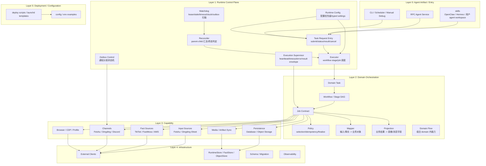
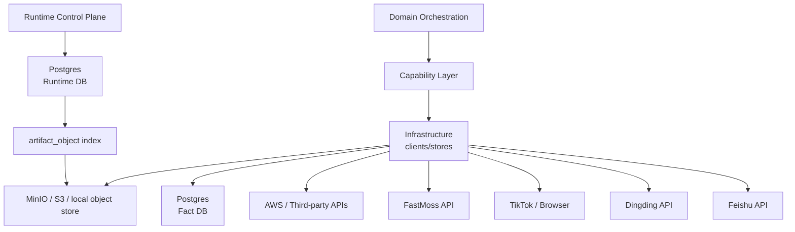
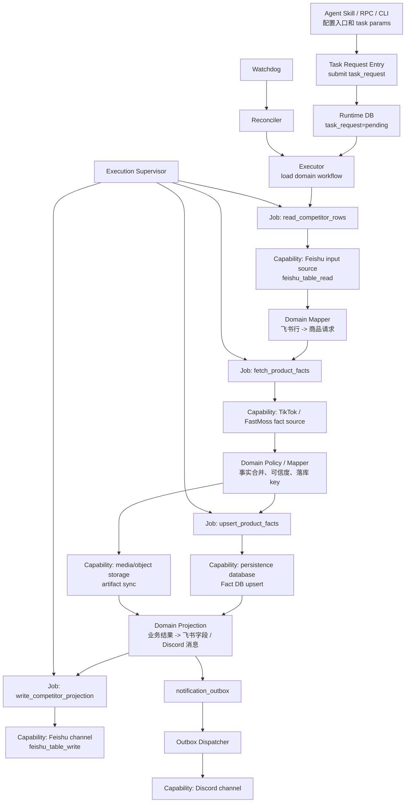
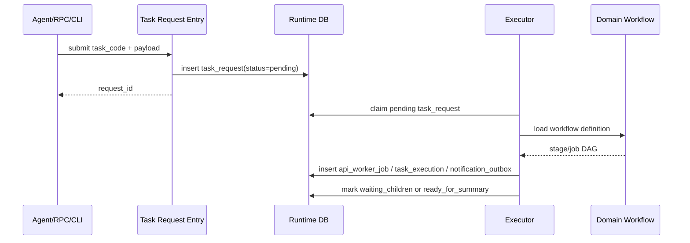
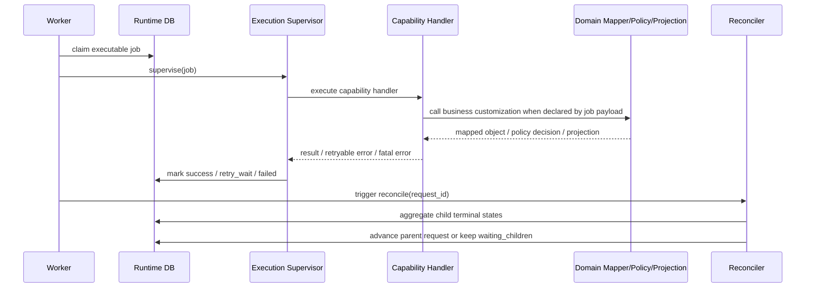
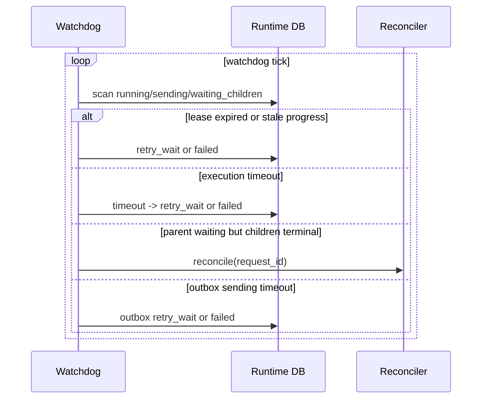

# 当前整体系统架构设计

日期: 2026-04-24

状态: 当前系统架构事实来源

## 1. 结论

Mujitask 当前系统应按分层架构理解，而不是按某几个历史目录或单个 flow 文件理解。

整体分为六层:

1. Agent Artifact / Entry Layer: 正式归属 `skills/**` 和 `apps/**`，包含 OpenClaw / Hermes / 用户 agent workspace 的 skill/script，以及 RPC Agent Service、CLI。
2. Runtime Control Plane: 正式归属 `control_plane/**`，包含 task request、executor、daemon、Execution Supervisor、Reconciler、Watchdog、outbox、runtime config。
3. Domain Orchestration Layer: 正式归属 `domains/**`，包含业务 task、workflow、job、policy、mapper、projection、flow。
4. Capability Layer: 正式归属 `capabilities/**`，包含可复用 input source、fact source、persistence、channel、browser、media handler。
5. Infrastructure Layer: 正式归属 `infrastructure/**`，包含外部系统 client、Runtime Store、Fact Store、Object Store、schema/migration、observability。
6. Deployment / Configuration Layer: 正式归属 `config/**` 和 `scripts/**`，包含项目配置、runtime 配置、agent 配置、launchd/systemd/docker/k8s 部署配置。

当前 runtime 主路径已经按上述分层治理。新增业务或重构时，应以 [项目架构契约](./project-architecture-contract.md) 为正式工程组织事实来源，以 [项目结构与命名契约](./project-structure-contract.md) 记录目录和命名细则，以 [Runtime 控制面契约](./runtime-control-plane-contract.md) 约束运行控制入口。

核心原则:

> Agent/RPC/CLI 只提交请求；Control Plane 只管理运行生命周期；Domain 只表达业务编排和定制逻辑；Capability 只提供可复用外部能力；Infrastructure 只实现技术连接；Runtime DB 是执行状态唯一真相，Fact DB 和 Object Store 是事实与产物沉淀，Feishu/Dingding/Discord 等是输入或投影视图。

## 2. 系统分层总览



## 3. 当前落位到项目分层的映射

| 项目层 | 当前落位 | 当前职责 | 不应放入 |
| --- | --- | --- | --- |
| Agent Artifact / Entry | `skills/mujitask-tiktok-feishu-sync/`、`src/automation_business_scaffold/apps/rpc_agent/`、`src/automation_business_scaffold/apps/cli/` | Agent skill bundle、RPC task registry、本地 submit/status/debug | workflow 主编排、worker loop、字段 mapper |
| Runtime Control Plane | `src/automation_business_scaffold/control_plane/`、`src/automation_business_scaffold/apps/daemons/`、`project_env.py`、`config.py` | task request 生命周期、executor、worker claim、supervisor、reconciler、watchdog、outbox、runtime config | Feishu 表字段、TikTok/FastMoss 业务策略、业务专用 daemon |
| Domain Orchestration | `src/automation_business_scaffold/domains/tiktok/tasks/`、`workflows/`、`jobs/`、`flows/`、`mappers/`、`projections/`、`policies/` | task/workflow/job、业务 mapper、projection、policy、业务组合 flow | 外部系统底层 client、Runtime DB store、daemon main |
| Capability | `src/automation_business_scaffold/capabilities/input_sources/`、`fact_sources/`、`persistence/`、`channels/`、`browser/`、`media/`、handler registry/contract | 通用 worker 能力: 输入源读取、事实采集、事实入库、媒体同步、飞书写回、outbox 分发、浏览器采集 | 单个业务的字段筛选、业务投影、终态汇总 |
| Infrastructure | `infrastructure/feishu/`、`infrastructure/fastmoss/`、`infrastructure/runtime/`、`infrastructure/facts/`、`infrastructure/artifacts/`、`infrastructure/browser/`、`infrastructure/rate_limit/` | 外部 client、Runtime Store、Fact Store、Object Store、browser bridge、限速 | task_code/workflow_code/job_code 业务决策 |
| Deployment / Configuration | `.env.example`、`scripts/execution_control/`、`scripts/deploy/`、`config/deployment/`、`config/browser_profiles.example.json`、`skill.local.env.example` | 项目配置、runtime 配置、agent 配置、launchd/deploy/dev/ops 脚本 | secret 真值、Python 业务实现、handler 逻辑 |

`src/automation_business_scaffold/business/**` 只作为 legacy reference；正式 runtime 主路径必须落在上表列出的项目层。

## 4. 业务进入系统后的标准拆分

一个业务需求进入开发阶段时，系统视角必须按下面顺序拆分。

### 4.1 Agent 配置

先确定业务是否需要 agent 入口:

- OpenClaw / Hermes / 用户 agent workspace 使用 skill bundle。
- skill bundle 放在 `skills/{skill_code}`，部署时复制到用户 agent workspace。
- skill 负责触发条件、少量参数提取、固定输入配置、提交 `task_request` 和首条回执。
- skill 不负责 workflow 主编排、worker 消费、Runtime DB 状态推进或最终 outbox 分发。

### 4.2 Task Request 与入口协议

业务入口必须归一到 task request:

- RPC Agent Service、CLI、Scheduler、agent skill 都调用同一个 submit/status/result/cancel envelope。
- 入口只创建顶层 `task_request`，返回 `request_id`。
- 长耗时任务由 executor/worker 推进，入口不等待完整业务同步完成。

### 4.3 消息通道和 Outbox 配置

第二步要明确消息通道，而不是在 workflow 中临时调用通知 API:

- 飞书、钉钉、Discord、Webhook 等通道属于 `capabilities/channels/{channel}`。
- 消息内容和字段来自 domain projection。
- 最终发送统一进入 `notification_outbox`，由 outbox dispatcher 发送并重试。
- outbox 失败不应反向修改已经完成的业务 task 状态。

### 4.4 输入数据源、事实数据源、存储拆分

每个 workflow 必须把数据来源拆成四类:

| 类型 | 示例 | 系统职责 |
| --- | --- | --- |
| 输入数据源 | 飞书表、钉钉表格、CSV、人工表单 | 提供业务待处理对象；通用读取在 capability，表级解释在 domain mapper |
| 事实数据源 | TikTok、FastMoss、AWS、第三方观测 API | 提供客观事实；采集在 capability，可信度/合并/落库 key 在 domain policy |
| 数据库 | Runtime DB、Fact DB、业务索引库 | Runtime DB 管执行状态，Fact DB 管事实主档和观测数据 |
| 文件存储 | MinIO、S3、本地 object store | 保存截图、HTML、raw JSON、图片、stdout、运行产物；Runtime DB 只保存索引 |

### 4.5 数据映射和定制逻辑

每个环节的定制逻辑必须显式落位:

- 输入行到业务对象: `domains/{domain}/mappers`。
- 事实结果到业务对象: `domains/{domain}/mappers` 或 `policies`。
- 选择、过滤、重试语义、幂等 key、终态汇总: `domains/{domain}/policies`。
- 写回飞书/钉钉/Discord 的字段或消息: `domains/{domain}/projections`。
- 外部 transport、鉴权、分页、限速、重试分类: `capabilities/**` + `infrastructure/**`。

## 5. Runtime Control Plane

Runtime Control Plane 是系统运行态的骨架。它不理解飞书表字段，也不理解 FastMoss 业务指标，只负责可靠推进、监督、恢复、汇总和通知分发。

| 组件 | 当前入口 | 职责 |
| --- | --- | --- |
| RPC Agent Service | `apps/rpc_agent/server.py` | 暴露 framework/platform 兼容 task registry 和 submit 入口 |
| CLI | `apps/cli/main.py` | 本地 submit/status/debug/list-tasks |
| Task Request Entry | `control_plane/task_requests/`、`control_plane/executor/runner.py::submit_task_request` | 创建顶层请求、查询状态和结果 |
| Executor | `apps/daemons/executor/main.py`、`control_plane/executor/runner.py` | claim task_request、读取 workflow、拆 job、推进 stage、写 summary/outbox |
| API Worker Daemon | `apps/daemons/api_worker/main.py` | 消费 API/IO 类 job，交给 supervisor 和 handler registry |
| Browser Runloop | `apps/daemons/browser_worker/main.py` | 串行消费浏览器/profile/CDP 类任务 |
| Execution Supervisor | `control_plane/supervisor/execution_supervisor.py` | heartbeat、progress、timeout、异常归一化、result/error envelope |
| Reconciler | `control_plane/reconciler/views.py`、`control_plane/reconciler/reconciler.py` | 汇总 child job 终态，推动 parent request 进入下一阶段或 ready_for_summary |
| Watchdog | `apps/daemons/watchdog/main.py`、`control_plane/watchdog/scanner.py` | 修复 lease expired、stale progress、execution timeout、stuck parent、outbox timeout |
| Outbox Dispatcher | `apps/daemons/outbox/main.py`、`control_plane/outbox/dispatcher.py` | claim `notification_outbox`、发送消息、处理通道重试 |
| Runtime Config | `control_plane/runtime_config/settings.py`、`project_env.py`、`config.py`、`scripts/execution_control/executor.local.env` | 配置加载优先级、typed defaults、runtime/agent/deployment 配置边界 |

Runtime Control Plane 的禁止规则:

- 不为单个业务新增专用 daemon、专用 Watchdog、专用 Reconciler 或专用 Execution Supervisor。
- 不在 control plane 写 Feishu 表字段、FastMoss 业务筛选、TikTok 页面业务策略。
- 不让 workflow 绕过 outbox 直接发送最终通知。
- 不让 worker 直接推进父 task；父子状态收敛必须由 Reconciler 或 executor 汇总路径完成。

## 6. Domain Orchestration

Domain Orchestration 表达“这个业务要做什么、分几步、每一步用什么能力、业务差异在哪里”。

正式目录是:

```text
domains/{business_domain}/
  tasks/
  workflows/
  jobs/
  policies/
  mappers/
  projections/
  flows/
```

职责拆分:

- `tasks`: 顶层业务入口参数、校验、业务可见名称。
- `workflows`: stage DAG、job binding、依赖、summary contract、outbox 触发点。
- `jobs`: 可执行单元 contract，绑定 capability handler。
- `policies`: 选择、过滤、幂等、retry、finalize、业务状态判断。
- `mappers`: 输入源/事实源结果到业务对象的映射。
- `projections`: 业务结果到飞书/钉钉/Discord/报表字段的投影。
- `flows`: 组合 domain 内能力，不能成为 runtime registry key。

Domain 层可以引用 capability handler contract，但不直接调用 infrastructure client。Domain 层可以定义 mapper/projection/policy，但不能把这些注册成 runtime handler code。

## 7. Capability Layer

Capability Layer 是可复用能力层。handler 应按“能力”命名，而不是按具体业务命名。

当前能力分类:

| Capability 类型 | 当前 handler 示例 | 归属说明 |
| --- | --- | --- |
| Input Sources / Feishu | `feishu_table_read` | 读取飞书表；表级筛选和字段解释交给 domain mapper |
| Input Sources / Dingding Sheet | planned capability | 未来钉钉表格读取应与飞书同类，不能写成业务专用 handler |
| Fact Sources / TikTok | `tiktok_product_request_fetch`、`tiktok_product_browser_fetch` | TikTok 事实采集；request-first 和 browser fallback 输出 normalized result |
| Fact Sources / FastMoss | `fastmoss_product_search`、`fastmoss_product_fetch`、`fastmoss_creator_fetch`、`fastmoss_shop_fetch`、`fastmoss_video_fetch` | FastMoss 商品/达人/店铺/视频事实采集 |
| Fact Sources / AWS | planned capability | AWS 作为事实源或对象源时放 fact source / persistence capability |
| Persistence / Database | `fact_bundle_upsert` | 写 Fact DB；业务 key 和合并策略来自 domain policy |
| Persistence / Object Storage / Media | `media_asset_sync` | 图片、截图、HTML、raw JSON、artifact 转存 |
| Channels / Feishu | `feishu_table_write` | 飞书写回；字段来自 domain projection |
| Channels / Dingding / Discord | planned capability | 出站消息必须经过 outbox |
| Browser / CDP / Profile | browser handler | 浏览器资源、页面采集、登录态/profile 边界 |
| Outbox Dispatch | `outbox_dispatch` | 消费 outbox，按 channel handler 发送 |

Capability 层的禁止规则:

- 不写业务域专属筛选、字段投影或终态判定。
- 不知道完整 workflow。
- 不直接决定 parent task 是否完成。
- 不把 mapper、projection、policy 名称注册成 handler code。

## 8. Infrastructure、数据与存储边界

Infrastructure Layer 只实现技术连接和存储，不表达业务流程。



数据落点:

| 落点 | 保存内容 | 不保存内容 |
| --- | --- | --- |
| Runtime DB | task_request、job/outbox 状态、lease、heartbeat、retry、stage cursor、artifact index | 商品/达人/视频事实主档 |
| Fact DB | 商品、达人、视频、店铺、关系、指标、latest、observation、raw evidence link | worker claim、retry、heartbeat |
| Object Store | 截图、HTML、raw JSON、图片、stdout、state dump、媒体文件 | 执行状态唯一真相 |
| Feishu / Dingding 表格 | 业务输入、运营投影视图、人工协作状态 | 内部任务状态和事实主档 |
| Discord / Feishu / Dingding 消息 | 通知投影和回执 | workflow 状态机 |

生产环境安全边界:

- daemon / worker / dispatcher / watchdog 使用 runtime user，只允许读写运行数据。
- schema 变更只允许 migration user 执行。
- 生产启动可以检查 schema version，但不自动 `CREATE TABLE`、`ALTER TABLE`、`DROP TABLE`。
- Runtime DB schema、Fact DB schema、handler contract、workflow contract、outbox contract 变更必须同步对应文档和 migration/兼容策略。

## 9. 端到端业务链路

以“从飞书竞品表读取商品，采集 TikTok / FastMoss 事实，写回飞书并通知 Discord”为例:



这条链路的关键边界:

- 读取飞书表是通用 input source capability。
- 哪些行处理、字段如何变成商品请求是 domain mapper。
- TikTok/FastMoss 采集是 fact source capability。
- 事实合并、去重、可信度和落库 key 是 domain policy。
- 写回飞书字段和 Discord 消息内容是 domain projection。
- 发送通知必须走 outbox channel。
- 超时、heartbeat、重试、父子汇总、卡住修复属于 Runtime Control Plane。

## 10. 进程通信时序

### 10.1 提交与编排



### 10.2 Worker、Supervisor 与 Reconciler



### 10.3 Watchdog 兜底



## 11. 新 Workflow 开发检查表

新增 workflow 必须在设计和代码评审时回答:

| 问题 | 应落位 |
| --- | --- |
| 这个业务是否有 agent 入口，skill 如何部署到用户 agent workspace? | `skills/{skill_code}` |
| 顶层业务入口是什么，参数和回执是什么? | `domains/{domain}/tasks/{task_code}` |
| workflow 分几阶段，每阶段依赖什么 job? | `domains/{domain}/workflows/{workflow_code}` |
| 每个 job 绑定哪个通用 handler capability? | `domains/{domain}/jobs/{job_code}` |
| 输入源是飞书、钉钉、CSV 还是其他? | `capabilities/input_sources/{source}` + domain mapper |
| 事实源是 TikTok、FastMoss、AWS 还是其他? | `capabilities/fact_sources/{source}` + domain policy/mapper |
| 数据落 Runtime DB、Fact DB 还是 Object Store? | Runtime control / persistence capability / infrastructure store |
| 输出是飞书写回、钉钉、Discord 还是 webhook? | domain projection + outbox channel capability |
| 哪些逻辑是业务定制? | domain mapper/projection/policy |
| 是否需要改 Watchdog、Reconciler、Execution Supervisor? | 只有通用运行规则才改 control plane；业务差异不得改 |

## 12. 最终规则

一句话规则:

> 当前系统以 Runtime DB 为执行状态真相，以 Runtime Control Plane 管理请求生命周期，以 Domain Orchestration 表达业务拆分，以 Capability Layer 复用外部能力，以 Infrastructure Layer 连接外部系统和存储，以 Agent Artifact / Configuration Layer 支撑部署入口；任何新业务必须先拆 agent、outbox、输入源、事实源、存储、通道、mapper、projection、policy，再写 workflow/job/handler。
