# 当前整体系统架构设计

日期: 2026-04-23

## 1. 结论

本文描述当前系统的整体架构口径。当前系统采用 Runtime DB 作为任务状态与可靠队列的事实来源，由 `executor_daemon` 负责业务流程编排，由 `api_worker` / `browser_worker` 负责具体执行能力，由 `outbox_dispatcher` 负责结果消息分发。

架构上应明确为:

- `executor_daemon` 是顶层任务编排器和 workflow runloop。
- `api_worker` / `browser_worker` 是业务无关的执行能力层。
- `handler` 是某类 job 的代码入口。
- `flow` 是 handler 内部复用的业务实现过程。
- `job` 是 Runtime DB 中可被 worker claim、retry、timeout 和审计的运行时执行单元。
- `Execution Supervisor` 是当前 `lease + heartbeat + retry + try/except` 执行保护机制的架构抽象，并作为后续 hard timeout、子进程隔离、progress monitor 的演进位置。
- `Watchdog Scanner` 是当前架构需要补齐的应用层兜底能力，用于基于 Runtime DB 状态处理卡死、超时、无进展、孤儿 running 任务。
- `outbox_dispatcher` 只负责 `notification_outbox` 的消息分发。

核心原则:

> 业务流程由 executor 编排，具体动作由 worker 执行，执行生命周期由 supervisor 管理，异常卡死由 watchdog 兜底，Runtime DB 是所有状态的唯一真相。

## 2. 为什么继续使用 Runtime DB

当前业务不是简单的后台异步任务，而是跨多个外部系统、长耗时、可失败、需要父子任务汇总的流程:

- 飞书表读取与写回
- TikTok 数据采集
- FastMoss 数据采集
- 浏览器/CDP/Profile 资源占用
- MinIO/本地对象存储
- 事实库写入
- outbox 消息分发
- 父任务与子任务的多阶段状态收敛

纯内存队列可以让本地代码路径更短，但无法天然解决以下生产问题:

- 进程重启后任务丢失
- worker 崩溃后无法恢复 running 任务
- 任务执行历史不可审计
- 父子任务状态难以恢复
- 多 worker 扩展困难
- 无响应任务仍然会阻塞当前 worker

因此 Runtime DB 队列的复杂性不是问题来源，而是把生产可靠性需求显性化。

## 3. 核心概念

| 概念 | 建议定义 | 示例 |
| --- | --- | --- |
| `Task` | 用户提交的一次顶层业务请求 | 选品分析、达人表同步、单行更新 |
| `Workflow` | Task 的阶段编排定义 | 飞书拉取 -> 数据采集 -> 飞书写回 |
| `Stage` | Workflow 中的一个阶段 | 飞书表读取、FastMoss 采集、飞书写回 |
| `Job` | Runtime DB 中 worker 可 claim 的运行时执行单元 | 读取飞书表、采集某个商品、写入某个达人 |
| `Handler` | 处理某类 Job 的代码入口 | `fastmoss_product_collect_handler` |
| `Flow` | Handler 内部复用的业务实现过程 | 调 FastMoss API、标准化字段、写飞书记录 |

关系如下:

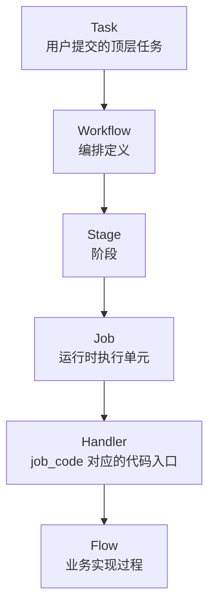

## 4. 架构分层

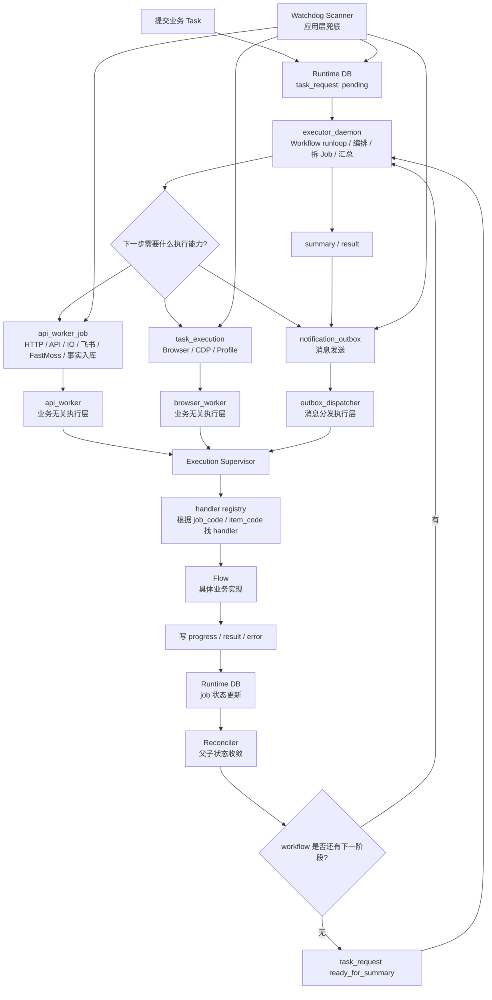

## 4.1 物理部署与存储层

整体架构文档需要补充 DB 和 MinIO 的物理层信息，但建议只描述到“物理组件 + 逻辑职责 + 连接关系”，不要把所有表字段塞进总览。详细字段和状态机放到专项文档:

- [Runtime DB Schema 设计](./runtime-db-schema-design.md)
- [Fact DB Schema 设计](./fact-db-schema-design.md)
- [数据库架构设计](./database-architecture-design.md)
- [Storage 架构设计](./storage-architecture-design.md)

推荐物理视图:

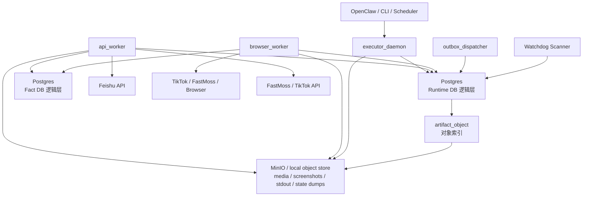

当前建议:

- Runtime DB 和 Fact DB 可以先落在同一个 Postgres 实例中，但逻辑 schema/表职责必须分清。
- `artifact_object` 只保存对象索引，截图、日志、媒体文件、运行状态 dump 放 MinIO 或本地对象存储。
- `fastmoss_session_cookie_cache` 物理上在 Runtime Postgres 中，逻辑上属于运行辅助缓存。
- 飞书是外部业务视图，不作为内部任务状态和事实主档的数据库。

## 4.2 Schema / Contract 安全边界

架构文档可以随代码实现同步，但 Runtime DB schema、Fact DB schema、workflow contract 和 handler contract 是受控契约，不属于普通业务代码可以自由改写的实现细节。

生产环境必须满足:

- `executor_daemon`、`api_worker`、`browser_worker`、`outbox_dispatcher`、`Watchdog Scanner` 使用运行账号连接数据库。
- 运行账号只允许读写数据，不允许 `CREATE TABLE`、`ALTER TABLE`、`DROP TABLE`、`CREATE INDEX`。
- schema 变更只允许通过 migration 流程使用 migration 账号执行。
- 应用启动时可以检查 schema version；版本不匹配时应 fail fast，不继续 claim job。
- workflow / handler contract 变更必须保持向后兼容；破坏性变更需要 `contract_revision`、adapter、migration 或旧 job 清理策略，不能把 `v1` / `v2` 写进稳定 code 名称。

这条边界的目的不是让文档不能随代码更新，而是保证“代码执行任务”与“变更数据库结构 / contract”分属不同权限和发布流程。

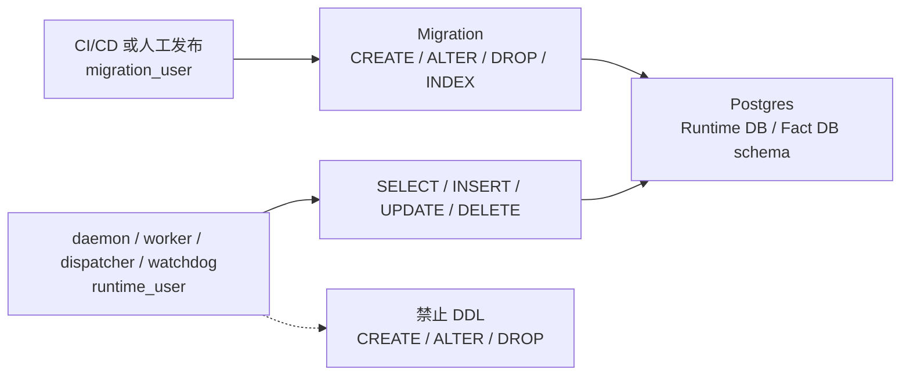

## 4.3 Feishu 输入到 Feishu 回写的数据流转

一个从飞书输入开始、最后把执行结果回写飞书的完整链路如下。不同 workflow 可以裁剪其中某些阶段，例如单商品 direct ingest 可以跳过飞书表读取，但不能改变 Runtime DB 作为执行状态事实来源、Fact DB 作为业务事实沉淀层、飞书作为业务投影视图的边界。

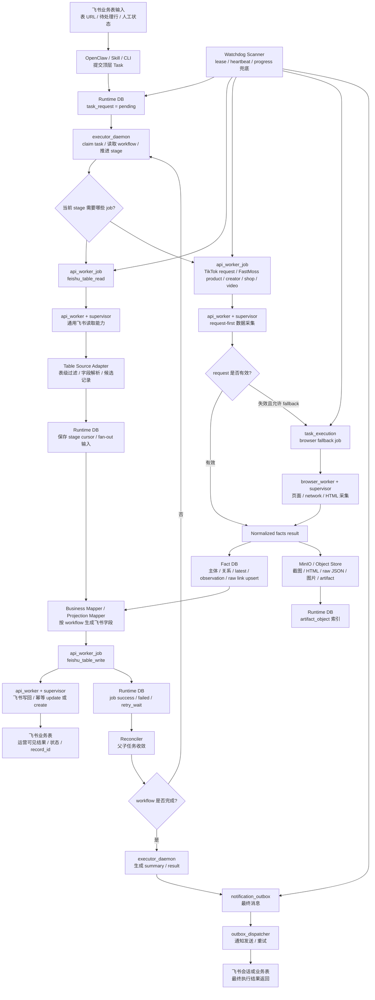

数据落点分工:

| 层 | 保存内容 | 不保存内容 |
| --- | --- | --- |
| Runtime DB | task/job/outbox 状态、lease、retry、stage cursor、artifact index | 商品/达人/视频事实主档 |
| Fact DB | 商品、达人、视频、店铺、关系、指标、raw evidence link | worker claim、retry、heartbeat |
| MinIO / local object store | 大文件、截图、HTML、raw JSON、图片、运行产物 | 任务状态真相 |
| Feishu | 业务输入、运营投影字段、人工协作状态、最终结果可见面 | 内部执行状态唯一真相 |

## 4.4 模块与进程间通信时序图

以下时序图描述重构后的目标通信口径。当前代码中部分路径仍通过集中 flow 分支完成，但重构后的进程间通信应统一收敛到 Runtime DB、handler registry、Reconciler 和 outbox。

### 4.4.1 顶层任务提交与 executor 编排

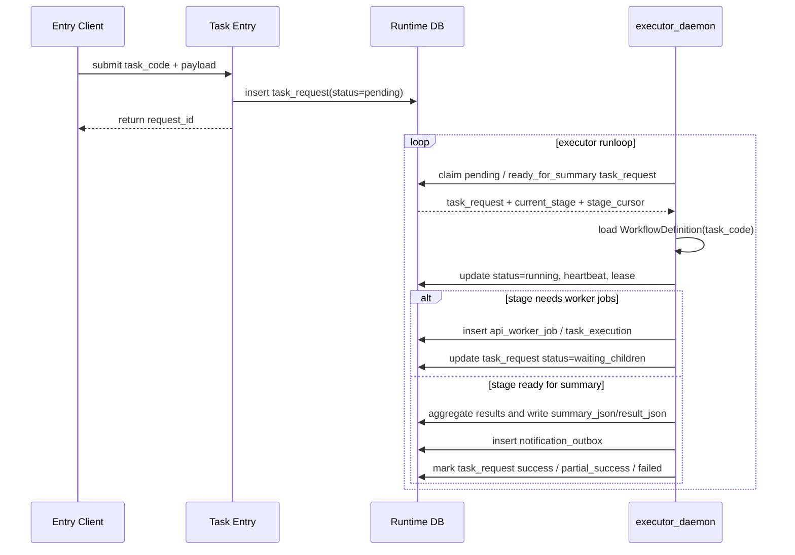

通信边界:

- Entry 只负责创建顶层 `task_request`，不直接执行长流程。
- executor 只通过 Runtime DB 派发 job 和推进 stage。
- executor 不等待 worker 内存 callback，父子状态收敛依赖 Reconciler 读取 Runtime DB。

### 4.4.2 worker claim、handler 执行与 Reconciler 收敛

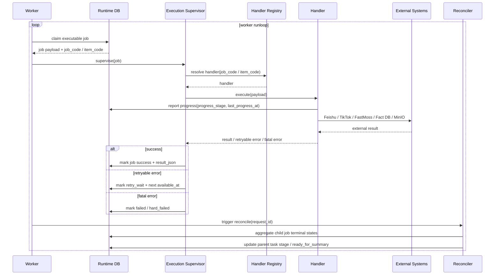

通信边界:

- worker 不直接理解完整 workflow，只处理 job claim 和 supervise。
- handler 可以调用 flow、adapter、mapper，但不能偷偷推进父 task。
- Reconciler 只看 Runtime DB 当前状态，重复执行必须幂等。

### 4.4.3 TikTok request-first / browser-fallback 时序

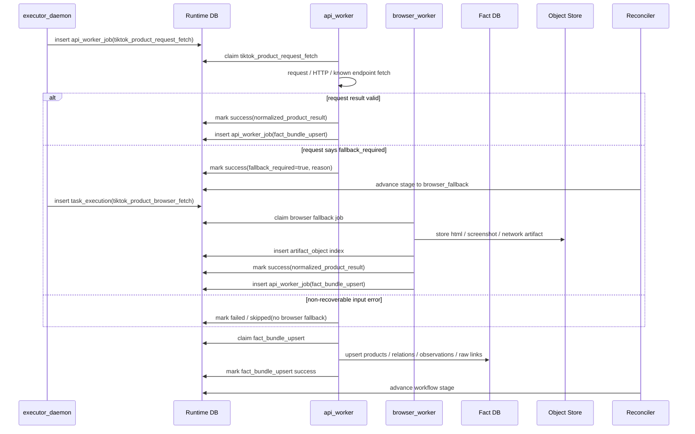

通信边界:

- browser fallback 只能由 `fallback_required=true` 或等价 result 触发。
- request handler 和 browser handler 必须输出同一种 normalized product result。
- `fact_bundle_upsert` 不关心结果来自 request 还是 browser。

### 4.4.4 飞书投影写回与 outbox 分发

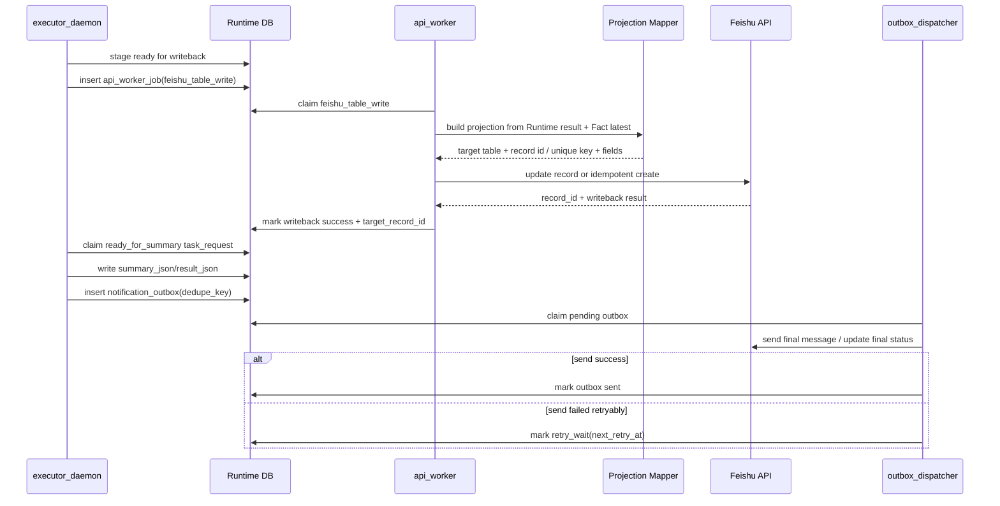

通信边界:

- 飞书写回是业务投影，不是 Fact DB 主档。
- projection mapper 决定字段映射，`feishu_table_write` handler 只负责可靠写入。
- outbox 分发失败不应反向改变已完成的业务 task 状态。

### 4.4.5 Watchdog 兜底时序

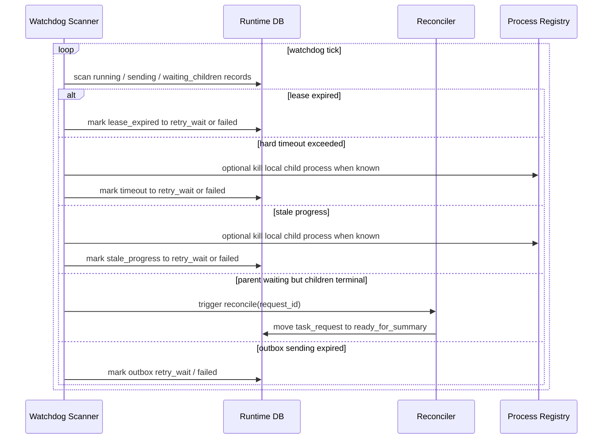

通信边界:

- Watchdog 的核心能力是修复 Runtime DB 状态，不替代 Supervisor 的执行期 hard kill。
- 如果没有子进程隔离，Watchdog 可以让任务进入 retry / failed，但不能保证原执行体已经被杀掉。
- 子进程隔离落地后，Watchdog 可以通过本机 supervisor/process registry 尝试 kill 已知 child process。

## 5. executor_daemon

`executor_daemon` 物理上是 runloop，逻辑上是 workflow state machine / orchestrator。

它不应该把一个顶层 task 同步执行到底，而应不断从 Runtime DB 中领取可推进的 `task_request`，根据当前 workflow stage 推进下一步。

典型循环:

```text
while true:
  claim 一个 pending / ready_for_summary / 可推进的 task_request
  读取 task_code、current_stage、stage_cursor
  根据 workflow 判断下一步
  派发 api_worker_job 或 task_execution
  或执行最终 summary
  更新 task_request 状态
  进入下一轮
```

executor 的职责:

- 接收顶层业务任务的运行时状态。
- 根据 `task_code` 找到 workflow。
- 根据当前 stage 和 cursor 决定下一步。
- 将 workflow 拆分为可执行 jobs。
- 将父任务置为 `waiting_children`。
- 在子任务收敛后生成最终 summary/result。
- 写入 `notification_outbox`。

executor 不应该负责:

- 长时间等待子任务完成。
- 直接执行浏览器或长耗时 API 任务。
- 直接发送最终通知。
- 保存只能存在于进程内存里的任务状态。

## 6. Reconciler

`Reconciler` 是一种职责，不一定是独立进程。它负责把子任务状态收敛回父任务。

当父任务派发多个子 job 后:

```text
task_request.status = waiting_children
api_worker_job / task_execution = pending / running / retry_wait / success / failed
```

Reconciler 负责判断:

```text
还有活跃子任务吗?
  有: 父任务继续 waiting_children
  没有: 父任务进入 ready_for_summary 或下一阶段
```

它可以在多个位置被调用:

- worker 完成 job 后顺手触发一次。
- executor 下一轮扫描时触发。
- watchdog 发现状态卡住时触发。
- finalizer 聚合领域子任务时触发。

Reconciler 不能依赖内存 callback，必须基于 Runtime DB 当前状态做幂等判断。

## 7. worker 的职责

`api_worker` 和 `browser_worker` 都是业务无关的执行层。

worker 不应该理解完整业务流程，只负责:

1. 从 Runtime DB claim 一个符合自身能力的 job。
2. 把 job 交给 Execution Supervisor。
3. Supervisor 根据 `job_code` / `item_code` 找到 handler。
4. handler 调用 flow 执行业务动作。
5. 将结果写回 Runtime DB。

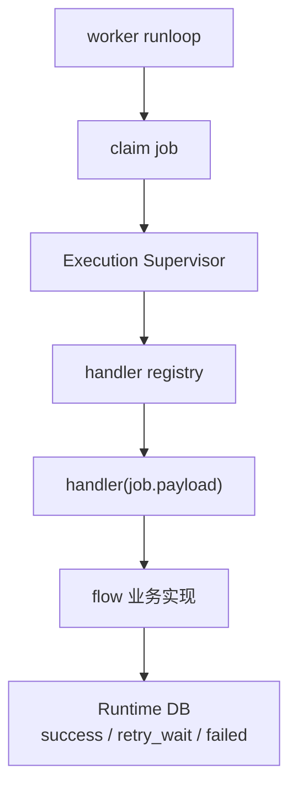

`api_worker` 的能力范围:

- 飞书 API 读取/写回
- FastMoss HTTP/API 数据采集
- TikTok 非浏览器 API 数据处理
- MinIO/对象存储
- 事实库写入
- 动态 job fan-out
- 领域 finalizer

`browser_worker` 的能力范围:

- Playwright/CDP 浏览器动作
- TikTok 页面采集
- 需要浏览器 profile/resource lease 的操作
- 登录态/风控/页面交互相关任务

`outbox_dispatcher` 也是执行层，但它只消费 `notification_outbox`，不参与主业务 workflow 调度。

## 8. Job 与 Handler 的边界

Job 是运行时调度层面的最小执行单元。

Handler 是代码层面的业务入口。

```text
Job = 一条具体待执行任务数据
Handler = 处理某类 Job 的代码函数
```

同一个 handler 可以处理很多 job:

```text
fastmoss_creator_fetch(job_for_creator_A)
fastmoss_creator_fetch(job_for_creator_B)
fastmoss_creator_fetch(job_for_creator_C)
```

一个 job 可以包含多个 API 请求和多个内部步骤，但必须满足:

- 可以独立 claim。
- 可以独立超时。
- 可以独立重试。
- 可以独立记录结果。
- 失败后可以安全重跑，或内部具备 checkpoint / 幂等保护。

不建议机械地把每一个 HTTP 请求都拆成 job。更合理的原则是:

> 每个需要独立调度、独立重试、独立状态追踪的业务单元，才应该成为 job。

## 9. Job 颗粒度原则

设计 job 颗粒度时需要回答:

| 问题 | 如果答案是是 | 设计建议 |
| --- | --- | --- |
| 失败后是否可以整体重试 | 是 | 可以放在一个 job |
| 中间是否有外部副作用 | 是 | 拆 job 或增加幂等/checkpoint |
| 是否耗时长且容易卡住 | 是 | 拆小并加 hard timeout |
| 是否需要并行处理 | 是 | 拆成多个 job |
| 是否需要逐条记录独立成功/失败 | 是 | 按记录或业务实体拆 job |
| 是否必须顺序执行 | 是 | 用 workflow cursor 或父子 job 控制 |

错误示例:

```text
一个超大 job:
  拉飞书所有数据
  拉所有商品数据
  拉所有达人数据
  写回所有飞书记录
  最后一次性成功或失败
```

问题:

- 任一达人失败会拖垮整个任务。
- 失败重试成本高。
- 无法知道卡在哪条记录。
- 超时后恢复困难。
- 很难做到幂等。

推荐示例:

```text
一个 table_read job 读取候选记录。
多个 product job 处理商品级 fan-out。
多个 creator detail job 处理达人详情和写回。
finalizer job 汇总一个 product 下的 creator detail jobs。
task reconciler 汇总整个 task。
```

## 10. 当前业务流程文档

具体业务流程不放在总览文档中展开。每个流程单独维护一份设计文档，并按 `Task / Workflow / Stage / Job / Handler / Flow` 的结构描述。

新增业务流程必须先按 [workflow-design-guidelines.md](./workflow-design-guidelines.md) 完成拆分，明确 workflow 必填内容、stage/job 颗粒度、handler/flow 边界、Runtime/Fact 写入、幂等、超时和 Watchdog 兜底策略。

当前拆分为:

| 业务流程 | 文档 |
| --- | --- |
| 选品分析 / TikTok + FastMoss 商品采集 | [workflow-selection-analysis-design.md](./workflow-selection-analysis-design.md) |
| 达人同步 / TK 达人池 | [workflow-influencer-pool-sync-design.md](./workflow-influencer-pool-sync-design.md) |
| 竞品表刷新 / 关键词竞品入库 | [workflow-competitor-table-design.md](./workflow-competitor-table-design.md) |

## 11. Execution Supervisor

当前系统已有 `lease + heartbeat + retry + try/except` 的轻量保护，但这只是 Execution Supervisor 的雏形。

目标 Supervisor 应该统一包裹所有 job handler 执行:

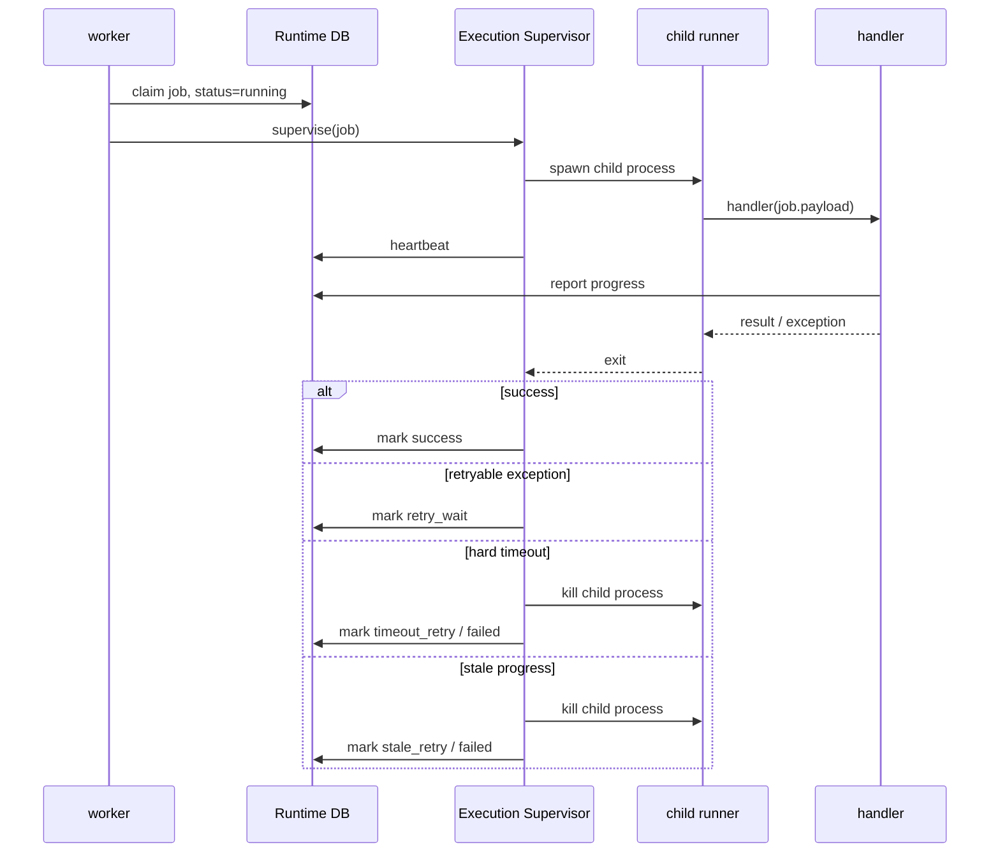

Supervisor 应具备:

- heartbeat 管理
- hard timeout
- progress monitor
- 子进程隔离
- kill child process
- retry / failed / dead_letter 状态归类
- 标准化错误类型

重要边界:

> heartbeat 只能说明 worker 或 supervisor 还活着，不能说明业务有进展。业务进展必须由 `last_progress_at` 和 `progress_stage` 表达。

## 12. Watchdog Scanner

Watchdog Scanner 不是业务调度器，也不是直接盯 worker 进程。

它基于 Runtime DB 状态扫描:

- `status = running`
- `lease_until`
- `heartbeat_at`
- `started_at`
- `last_progress_at`
- `max_execution_seconds`
- `attempt_count`
- `max_attempts`

职责:

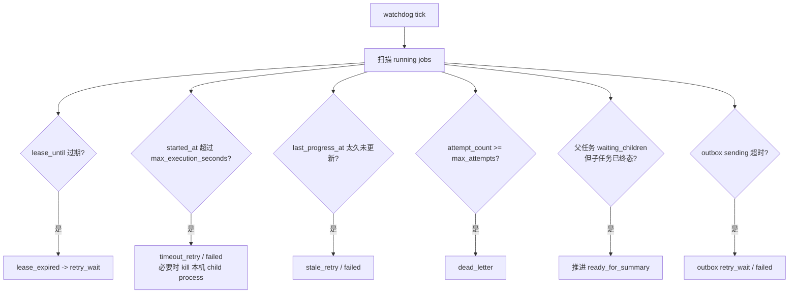

Watchdog 处理的是 worker 自己无法收尾的状态:

- 进程崩溃
- 任务卡死
- 外部调用无响应
- heartbeat 断更
- progress 长时间不更新
- 子任务完成但父任务未收敛
- outbox 发送卡住

## 13. Runtime DB 字段建议

现有表可以继续保留，不必一口气重构为单一 job 表。但建议各类 job 表统一补齐执行生命周期字段:

| 字段 | 用途 |
| --- | --- |
| `status` | 当前状态 |
| `attempt_count` | 已尝试次数 |
| `max_attempts` | 最大尝试次数 |
| `worker_id` | 当前领取者 |
| `lease_until` | worker 崩溃后的回收依据 |
| `heartbeat_at` | worker/supervisor 活跃时间 |
| `started_at` | 本次执行开始时间 |
| `finished_at` | 本次执行结束时间 |
| `last_progress_at` | 业务真实推进时间 |
| `progress_stage` | 当前业务进度阶段 |
| `max_execution_seconds` | 单次执行硬超时 |
| `available_at` / `next_retry_at` | 下次可执行时间 |
| `run_id` | 一次执行实例 |
| `error_type` | `exception / timeout / stale / killed / lease_expired` |
| `error_code` | 外部系统错误码 |
| `error_text` | 错误详情 |
| `dedupe_key` / `idempotency_key` | 幂等与去重 |
| `dead_letter_reason` | 最终无法继续的原因 |

## 14. 幂等与一致性原则

Job 可能在以下场景被重复执行:

- worker 崩溃后 lease 回收
- supervisor hard timeout 后重试
- watchdog 标记 stale 后重试
- handler 成功写外部系统但未成功写 Runtime DB

因此任何包含外部副作用的 job 都必须具备幂等策略。

示例:

Creator detail job:

```text
1. claim creator detail job -> running
2. 通过 fastmoss_creator_fetch 拉达人详情
3. 通过 feishu_table_write 写飞书达人表
4. 通过 fact_bundle_upsert 写事实库
5. 标记 creator detail job success
```

如果第 3 步成功但第 5 步失败，重试时可能重复写飞书。因此需要使用:

- `source_record_id`
- `product_id`
- `influencer_id`
- `target_record_id`
- `dedupe_key`
- 飞书表中的唯一业务键

来保证重复执行不会创建重复记录。

## 15. 推荐演进步骤

### 15.1 第一阶段: 统一架构口径

- 固定 Task / Workflow / Stage / Job / Handler / Flow 的定义。
- 文档和代码命名避免把领域 workflow 误写成 worker 类型。
- 将 `influencer_pool_worker` 口径调整为 `influencer_pool job family / handlers`。

### 15.2 第二阶段: 补齐 Watchdog Scanner

- 扫描 running job。
- 回收 lease expired。
- 识别 execution timeout。
- 识别 stale progress。
- 修复 parent waiting_children 未收敛。
- 修复 outbox sending 超时。

### 15.3 第三阶段: 标准化 Execution Supervisor

- 抽象统一 supervisor。
- 统一 heartbeat / retry / error_type。
- 为 api_worker、browser_worker、outbox_dispatcher 统一接入。
- 补 `last_progress_at` / `progress_stage`。

### 15.4 第四阶段: 子进程隔离与 hard timeout

- handler 在 child process 中执行。
- supervisor 父进程负责 kill 超时 child。
- 解决业务函数不返回、HTTP 卡死、浏览器动作 hang 住的问题。

### 15.5 远期可选阶段: 并发安全 claim 与多 worker 扩容

当前业务阶段暂不把多 worker 横向扩容作为近期建设目标。更高优先级是:

- Watchdog Scanner 兜底 running / stale / timeout / outbox 卡住。
- Execution Supervisor 统一 heartbeat、progress、retry 和错误分类。
- 子进程隔离与 hard timeout，解决 handler 真实卡死无法退出的问题。

因此本阶段只作为后续吞吐量提升或多机部署时的扩展方向，不阻塞当前架构落地。

触发条件:

- API worker 单实例吞吐成为瓶颈。
- 任务量增长到需要多个 worker 并行消费同一类 job。
- 需要多机部署或多进程常驻消费。
- browser profile / resource lease 需要更细的并发隔离。

届时再考虑:

- 使用 Postgres 原子 claim。
- 可选实现 `FOR UPDATE SKIP LOCKED` 或 `UPDATE ... RETURNING`。
- api_worker 可以多实例横向扩展。
- browser_worker 按 browser profile / resource lease 控制并发。

## 16. 最终目标形态

```text
Task 是用户请求。
Workflow 是任务编排。
executor_daemon 是 workflow runloop，负责推进状态和拆 job。
Job 是 worker 可执行的最小调度、重试、超时、审计单元。
worker 是业务无关执行层，只负责 claim job。
Handler 是 job 的业务入口。
Flow 是业务实现过程。
Execution Supervisor 包裹 handler，负责生命周期、超时、重试、心跳、progress。
Reconciler 负责父子状态收敛。
Watchdog Scanner 负责卡死、无响应、超时和状态未收敛兜底。
outbox_dispatcher 负责 notification_outbox 的消息分发。
Runtime DB 是所有状态的唯一事实来源。
```
