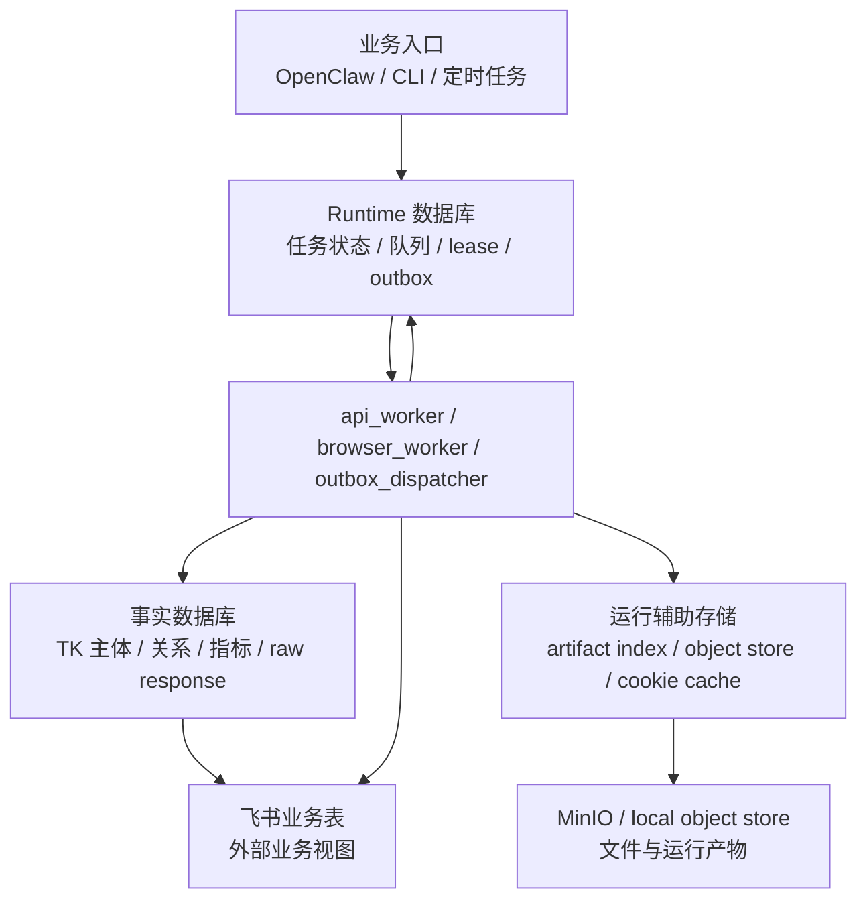
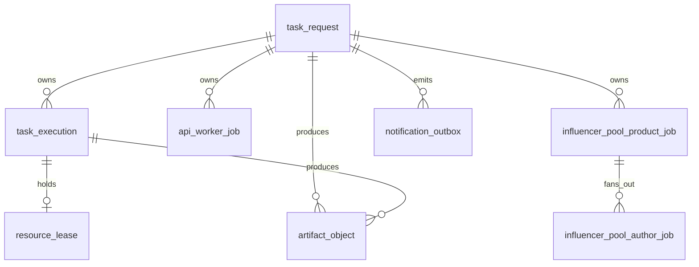
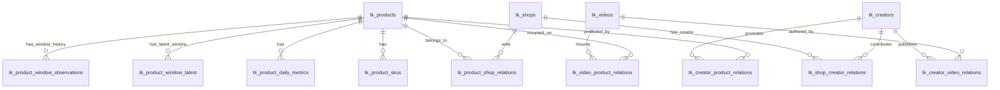
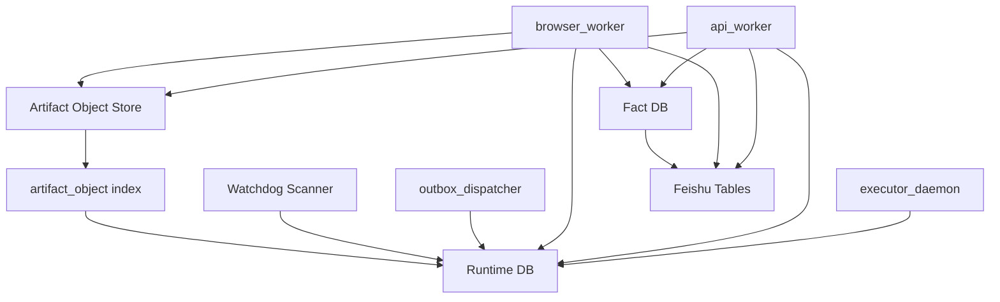

# 数据库架构设计

日期: 2026-04-23

## 1. 结论

当前系统的数据库不应只按物理数据库实例理解，而应按逻辑职责分层。

当前建议分为三类:

1. Runtime 数据库
   - 负责任务编排、队列、worker 执行状态、lease、outbox、运行产物索引。
2. 事实数据库
   - 负责 TikTok / FastMoss / 飞书沉淀出来的业务事实、主体、关系、原始响应和指标。
3. 运行辅助存储
   - 负责 artifact 对象索引、对象文件、FastMoss cookie/session cache 等运行辅助数据。

其中 Runtime 数据库和事实数据库当前可以在同一个 Postgres 中落地，但逻辑边界必须清楚。对象文件可以放本地文件系统或 MinIO，数据库只保存对象索引。

不建议把飞书业务表称为本系统数据库。飞书是外部业务视图和操作台，不是内部状态真相。

专项 schema 文档:

- [Runtime DB Schema 设计](./runtime-db-schema-design.md): 展开 Runtime 表、状态机、claim/lease/retry/watchdog 规则。
- [Fact DB Schema 设计](./fact-db-schema-design.md): 展开事实库 ERD、upsert key、idempotency 和写入规则。
- [Storage 架构设计](./storage-architecture-design.md): 展开 MinIO bucket、object prefix、artifact 生命周期和清理策略。

## 2. 分层总览



## 3. Runtime 数据库

Runtime 数据库是执行控制面。它回答的问题是:

- 哪些顶层任务正在执行?
- 哪些 job 可以被 worker 领取?
- 哪些 job 正在 running?
- 哪些 job 失败后等待重试?
- 哪个 worker 持有哪个资源 lease?
- 父任务是否可以进入 `ready_for_summary`?
- 哪些通知待发送?
- 某次执行留下了哪些 artifact?

Runtime 数据库是 `executor_daemon`、`api_worker`、`browser_worker`、`outbox_dispatcher`、`Watchdog Scanner` 的共同事实来源。

### 3.1 当前 Runtime 表

| 表 | 归属 | 作用 |
| --- | --- | --- |
| `task_request` | 顶层任务 | 用户提交的一次 Task，保存 payload、status、stage_cursor、summary、result |
| `task_execution` | 浏览器/叶子任务队列 | browser worker 可 claim 的执行单元，例如单行竞品补全、关键词发现、TikTok browser fallback |
| `api_worker_job` | API/IO job 队列 | api worker 可 claim 的通用 job，例如飞书表读取、FastMoss 商品采集、飞书写回 |
| `influencer_pool_product_job` | 达人同步领域队列 | 商品/竞品粒度的达人发现 job |
| `influencer_pool_author_job` | 达人同步领域队列 | 单个达人详情采集和写入 job |
| `resource_lease` | 资源租约 | 浏览器 profile / CDP 资源占用控制 |
| `notification_outbox` | 通知 outbox | 最终消息发送队列 |
| `artifact_object` | 运行产物索引 | stdout、截图、状态文件、上传对象等 artifact 的数据库索引 |

### 3.2 Runtime DB 的核心关系



### 3.3 Runtime DB 的设计原则

- Runtime DB 存任务状态，不存最终业务事实的主档。
- 任何 worker 都不能只依赖内存状态推进任务。
- 所有 job 必须有可查询的 `status`、`attempt_count`、`worker_id`、`heartbeat_at`、`lease_until` 或等价字段。
- 父任务收敛必须基于 Runtime DB 中的子任务状态。
- `outbox` 和主业务状态分离，通知失败不应反向污染业务完成状态。
- `artifact_object` 只保存索引，不保存大文件内容。

### 3.4 Runtime DB 后续需要补齐的字段

为支持应用层兜底，建议 Runtime job 表统一补齐:

| 字段 | 用途 |
| --- | --- |
| `max_execution_seconds` | 单次执行硬超时 |
| `last_progress_at` | 业务真实进展时间 |
| `progress_stage` | 当前业务阶段，便于判断卡点 |
| `error_type` | `exception / timeout / stale / killed / lease_expired` |
| `error_code` | 外部系统错误码 |
| `dead_letter_reason` | 最终进入 dead letter 的原因 |

这些字段主要服务 `Execution Supervisor` 和 `Watchdog Scanner`。

## 4. 事实数据库

事实数据库是业务事实面。它回答的问题是:

- 这个商品当前有哪些标准化事实?
- 这个商品关联哪些店铺、达人、视频?
- 这个达人关联哪些商品、视频、店铺?
- 哪些原始 API 响应支撑了这些事实?
- 某个窗口期或日粒度指标是什么?

事实数据库不应该承载 worker 运行状态，也不应该用来判断某个 job 是否可以重试。

### 4.1 当前事实表分层

| 层 | 表 | 作用 |
| --- | --- | --- |
| 主体主档层 | `tk_products`, `tk_product_skus`, `tk_shops`, `tk_creators`, `tk_videos` | 商品、SKU、店铺、达人、视频主体 |
| 媒体层 | `tk_media_assets`, `tk_entity_media_assets` | 图片、头像、视频封面等媒体资产及主体绑定 |
| 关系层 | `tk_product_shop_relations`, `tk_creator_product_relations`, `tk_creator_video_relations`, `tk_video_product_relations`, `tk_shop_creator_relations` | 商品、店铺、达人、视频之间的关系 |
| 原始审计层 | `tk_raw_api_responses`, `tk_raw_entity_links` | 原始 API 响应与事实主体的来源关系 |
| 指标层 | `tk_product_daily_metrics`, `tk_product_window_latest`, `tk_product_window_observations`, `tk_product_distribution_window_latest`, `tk_product_distribution_window_observations`, `tk_product_sku_window_latest`, `tk_product_sku_window_observations`, `tk_video_product_window_performance`, `tk_creator_product_window_performance` | 日粒度、窗口、分布、SKU、视频、达人商品表现指标 |

### 4.2 事实数据库关系



### 4.3 事实数据库设计原则

- 事实数据库保存业务事实，不保存 job 执行控制状态。
- 主体表使用业务 key 和 upsert 保证幂等。
- 关系表保存多对多关系，不把所有关联塞进 JSON。
- `facts_json` 承接暂未结构化的扩展字段。
- `tk_raw_api_responses` 保存原始证据，用于排障、回放和事实追溯。
- 当前 schema 不强依赖数据库外键，关系一致性主要由业务 key、唯一键和 upsert 逻辑保证。

## 5. 运行辅助存储

运行辅助存储不是第三个核心业务数据库，但在架构上需要单独归类，避免混入 Runtime 或事实层。

### 5.1 Artifact 存储

Artifact 分两部分:

| 组成 | 存储位置 | 作用 |
| --- | --- | --- |
| `artifact_object` | Postgres | 保存 artifact_id、run_id、step_id、bucket、object_key、content_type、source_path 等索引 |
| 对象内容 | MinIO 或本地文件系统 | 保存 stdout、截图、state dump、下载文件、媒体文件等大对象 |

原则:

- 数据库只保存索引，不保存大文件二进制。
- 业务结果引用 artifact 时使用 `artifact_id`、`object_key` 或 URL。
- artifact 归属于 run/job/request，用于排障和审计。

MinIO bucket、object prefix 和生命周期策略详见 [Storage 架构设计](./storage-architecture-design.md)。

### 5.2 Cookie / Session Cache

当前已有 `fastmoss_session_cookie_cache`。

它属于运行辅助缓存，不属于事实数据库:

- 保存 FastMoss 登录 cookie。
- 保存 cookie 数量、是否含 `fd_tk` 摘要、过期时间、最近登录/认证失败时间。
- 用于减少重复登录和提升采集稳定性。

原则:

- cookie cache 是可再生缓存，不是业务事实。
- 不应作为业务流程最终状态依据。
- 敏感明文应尽量避免出现在日志和任务结果中。

## 6. 飞书业务表的定位

飞书表不是本系统内部数据库，而是外部业务视图和人工操作台。

当前涉及:

- `TK选品收集`
- `TK竞品收集`
- `TK达人池`
- `TK达人建联表`
- `TK合作爆款视频`

系统对飞书表的职责:

- 读取待处理业务输入。
- 写回运营可见字段。
- 将事实数据库中的部分结果映射到业务表。
- 提供人工审核和运营协作界面。

飞书表不应该承担:

- worker lease
- job retry
- Runtime 状态真相
- 事实数据库主键体系
- 原始 API 响应审计

## 7. 是否还需要其他数据库

当前阶段不建议再新增独立数据库。建议逻辑上分层，物理上可以继续使用同一个 Postgres。

| 类型 | 当前是否需要 | 说明 |
| --- | --- | --- |
| Runtime 数据库 | 需要 | 当前核心控制面 |
| 事实数据库 | 需要 | 当前业务事实沉淀层 |
| Artifact 对象存储 | 需要 | MinIO 或本地文件系统，数据库保存索引 |
| Cookie/session cache | 需要 | 当前可放 Runtime Postgres，逻辑上归运行辅助缓存 |
| 配置/密钥库 | 可选 | 当前可由 env / local config 管理，生产可接 Secret Manager |
| 分析数仓 / BI Mart | 暂不需要 | 后续报表或多维分析变复杂后再考虑 |
| 搜索索引库 | 暂不需要 | 后续需要全文搜索、相似检索时再考虑 |
| 飞书映射/同步日志库 | 暂不单独建 | 可先用事实库和 Runtime 结果承载，等写回链路复杂后再独立建表 |

因此当前更准确的数据库架构是:

```text
Postgres
  Runtime 逻辑层
    task_request
    task_execution
    api_worker_job
    influencer_pool_product_job
    influencer_pool_author_job
    resource_lease
    notification_outbox
    artifact_object
    fastmoss_session_cookie_cache

  Fact 逻辑层
    tk_products
    tk_product_skus
    tk_shops
    tk_creators
    tk_videos
    tk_media_assets
    tk_*_relations
    tk_raw_api_responses
    tk_*_metrics / window tables

Object Store
  runtime artifacts
  media files
  screenshots
  logs / state dumps

External Business Views
  Feishu tables
```

## 8. 与任务架构的关系



Runtime DB 负责回答“任务怎么跑、跑到哪、谁持有、是否失败”。  
事实数据库负责回答“采集到了什么、主体和关系是什么、有哪些原始证据”。  
对象存储负责保存“大文件和运行产物”。  
飞书负责展示和人工协作。
