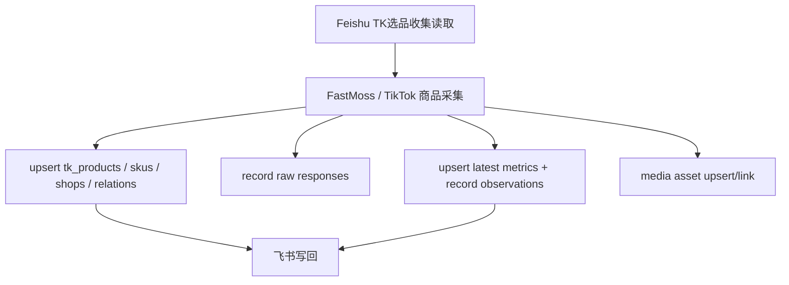
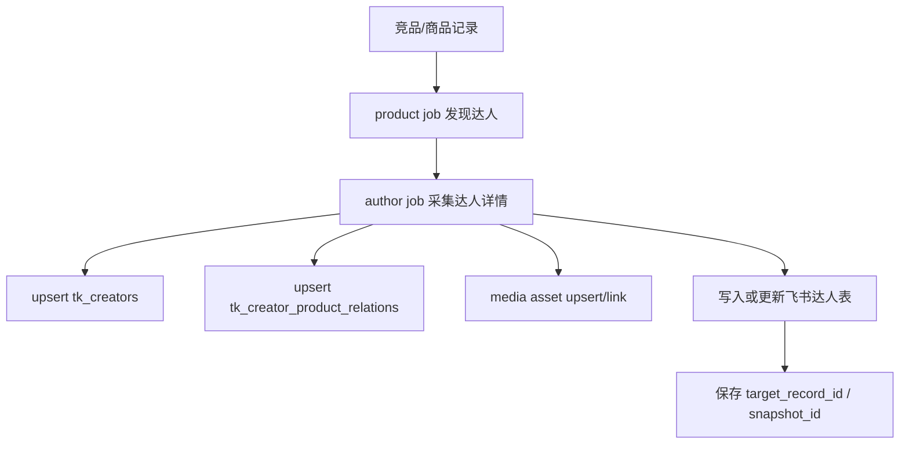
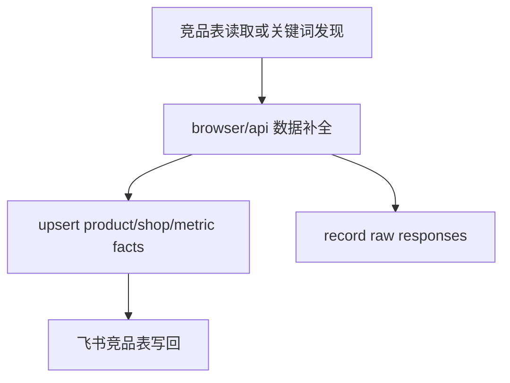

# Fact DB Schema 设计

日期: 2026-04-23

## 1. 定位

Fact DB 是系统的业务事实面，负责沉淀 TikTok / FastMoss / 飞书流程中产生的主体、关系、指标、原始响应和媒体资产。

它不负责 worker 调度、重试、lease、heartbeat，也不作为任务是否完成的判断来源。任务执行状态只以 Runtime DB 为准。

核心原则:

> Fact DB 用稳定业务键做 upsert，用 raw response 做证据追溯，用 observation/latest 分开承载历史和当前快照。

## 2. 事实库总体 ERD

```mermaid
erDiagram
    tk_products ||--o{ tk_product_skus : has
    tk_products ||--o{ tk_product_shop_relations : sold_by
    tk_shops ||--o{ tk_product_shop_relations : sells

    tk_creators ||--o{ tk_creator_product_relations : promotes
    tk_products ||--o{ tk_creator_product_relations : promoted_by

    tk_creators ||--o{ tk_creator_video_relations : publishes
    tk_videos ||--o{ tk_creator_video_relations : authored_by

    tk_videos ||--o{ tk_video_product_relations : mounts
    tk_products ||--o{ tk_video_product_relations : mounted_on

    tk_shops ||--o{ tk_shop_creator_relations : has_creator
    tk_creators ||--o{ tk_shop_creator_relations : contributes

    tk_products ||--o{ tk_product_daily_metrics : has_daily_metric
    tk_products ||--o{ tk_product_window_latest : has_latest_window
    tk_products ||--o{ tk_product_window_observations : has_window_history
    tk_products ||--o{ tk_product_distribution_window_latest : has_latest_distribution
    tk_products ||--o{ tk_product_sku_window_latest : has_latest_sku_window

    tk_media_assets ||--o{ tk_entity_media_assets : linked_to_entities
    tk_raw_api_responses ||--o{ tk_raw_entity_links : supports_entities
```



当前 schema 主要靠业务唯一键、唯一索引和 upsert 维护一致性，未强依赖数据库外键。这种方式更适合采集型系统的增量演进，但要求 upsert key 必须稳定。

## 3. 表分层

### 3.1 主体主档层

| 表 | 唯一业务键 | 作用 |
| --- | --- | --- |
| `tk_products` | `product_id` | 商品主档 |
| `tk_product_skus` | `sku_key` | 商品 SKU 主档 |
| `tk_shops` | `shop_key` | 店铺主档 |
| `tk_creators` | `creator_key` | 达人/创作者主档 |
| `tk_videos` | `video_key` | 视频主档 |

通用字段:

- `id` / 主键 ID。
- 业务唯一键。
- 可展示字段，例如 title、nickname、shop_name、product_url。
- `platform`, `country_region`, `source_platform`, `status`。
- `facts_json` 承接尚未结构化的扩展事实。
- `first_seen_at`, `last_seen_at`, `created_at`, `updated_at`。

### 3.2 媒体层

| 表 | 唯一业务键 | 作用 |
| --- | --- | --- |
| `tk_media_assets` | `asset_key` | 图片、头像、封面、文件 token、对象 key 等媒体资产 |
| `tk_entity_media_assets` | `relation_key` | 媒体资产与商品/达人/视频等主体的绑定 |

媒体内容本身不建议存入数据库。数据库保存 `source_url`、`file_token`、`local_path`、`object_key`、`mime_type` 和元数据。

### 3.3 关系层

| 表 | 唯一业务键 | 关系 |
| --- | --- | --- |
| `tk_product_shop_relations` | `relation_key` | 商品 - 店铺 |
| `tk_creator_product_relations` | `relation_key` | 达人 - 商品 |
| `tk_creator_video_relations` | `relation_key` | 达人 - 视频 |
| `tk_video_product_relations` | `relation_key` | 视频 - 商品 |
| `tk_shop_creator_relations` | `relation_key` | 店铺 - 达人 |

关系表不只表达连接，也可以保存关系维度事实，例如:

- `relation_role`
- `source_record_id`
- `target_record_id`
- `holiday_name`
- `sold_count`
- `source_platform`
- `metadata_json`

### 3.4 原始证据层

| 表 | 作用 |
| --- | --- |
| `tk_raw_api_responses` | 保存一次采集的原始 API 响应 |
| `tk_raw_entity_links` | 将 raw response 与事实主体关联起来 |

`tk_raw_api_responses` 带有 `request_id`、`execution_id`、`run_id`，可以从事实追溯到运行时上下文，但它不反向参与任务调度。

### 3.5 指标层

| 表 | 类型 | 作用 |
| --- | --- | --- |
| `tk_product_daily_metrics` | 日粒度 upsert | 商品每日销量、销售额、价格等 |
| `tk_product_window_latest` | 窗口最新快照 | 商品窗口指标当前值 |
| `tk_product_window_observations` | 窗口历史观测 | 商品窗口指标历史采样 |
| `tk_product_distribution_window_latest` | 分布窗口最新快照 | 商品分布类指标当前值 |
| `tk_product_distribution_window_observations` | 分布窗口历史观测 | 商品分布类指标历史采样 |
| `tk_product_sku_window_latest` | SKU 窗口最新快照 | SKU 窗口表现当前值 |
| `tk_product_sku_window_observations` | SKU 窗口历史观测 | SKU 窗口表现历史采样 |
| `tk_video_product_window_performance` | 事件/观测记录 | 视频-商品窗口表现 |
| `tk_creator_product_window_performance` | 事件/观测记录 | 达人-商品窗口表现 |

指标层的核心区分:

- `latest` 表用于当前业务读取和飞书写回。
- `observations` 表用于历史追踪、排障、趋势分析。
- daily metric 以自然日期作为唯一维度。

## 4. Upsert 与幂等规则

### 4.1 主体 upsert

| 方法 | 表 | 唯一键 | 幂等规则 |
| --- | --- | --- | --- |
| `upsert_product` | `tk_products` | `product_id` | 同一商品重复采集只更新事实和 `last_seen_at` |
| `upsert_product_sku` | `tk_product_skus` | `sku_key` | `sku_key = product_id + sku_id/sku_name/spec`，重复采集更新 SKU 事实 |
| `upsert_shop` | `tk_shops` | `shop_key` | 由 shop id/name/url 等稳定字段构建 |
| `upsert_creator` | `tk_creators` | `creator_key` | 由 `creator_id`、`uid`、`unique_id` 构建，优先稳定 ID |
| `upsert_video` | `tk_videos` | `video_key` | 通常为 `video:{video_id}` |

主体表 upsert 应遵守:

- 首次发现写入 `first_seen_at`。
- 每次更新写入 `last_seen_at` 和 `updated_at`。
- 不稳定或待扩展字段进入 `facts_json`。
- 结构化字段优先放列，便于查询和索引。

### 4.2 媒体 upsert

| 方法 | 表 | 唯一键 | 幂等规则 |
| --- | --- | --- | --- |
| `upsert_media_asset` | `tk_media_assets` | `asset_key` | 由 `source_url`、`file_token`、`local_path` 或 `object_key` 形成稳定资产键 |
| `link_media_asset` | `tk_entity_media_assets` | `relation_key` | `entity_type + entity_external_id + media_role + asset_id` |

媒体幂等重点:

- 同一个图片/文件重复上传或重复发现，不应产生多条资产主档。
- 同一主体同一角色同一资产，不应重复绑定。
- 对象内容在 MinIO/local object store，Fact DB 只保存定位和元数据。

### 4.3 关系 upsert

| 方法 | 表 | 唯一键 | 幂等规则 |
| --- | --- | --- | --- |
| `upsert_product_shop_relation` | `tk_product_shop_relations` | `product_id + shop_key + relation_role` | 同一商品-店铺-角色只保留一条关系 |
| `upsert_creator_product_relation` | `tk_creator_product_relations` | `creator_key + product_id` | 同一达人-商品关系重复写入时更新 sold_count、飞书记录 ID 等 |
| `upsert_creator_video_relation` | `tk_creator_video_relations` | `creator_key + video_key` | 同一达人-视频关系唯一 |
| `upsert_video_product_relation` | `tk_video_product_relations` | `video_key + product_id` | 同一视频-商品关系唯一 |
| `upsert_shop_creator_relation` | `tk_shop_creator_relations` | `shop_key + creator_key` | 同一店铺-达人关系唯一 |

关系 upsert 的意义:

- 支持同一个主体从多个 workflow 反复补全。
- 避免 repeated job 或 lease 回收导致重复关系。
- 将关系事实沉淀下来，而不是只藏在 `facts_json`。

### 4.4 Raw response 与 raw link

| 方法 | 表 | 幂等策略 |
| --- | --- | --- |
| `record_raw_api_response` | `tk_raw_api_responses` | 每次采集插入一条新 raw response，用于证据追溯 |
| `link_raw_entity` | `tk_raw_entity_links` | 将 raw response 绑定到主体，当前更偏审计记录 |

raw response 通常不做覆盖式 upsert，因为它表达的是“某次采集看到的原始证据”。如果后续存储压力变大，可以增加:

- payload digest 去重。
- 原始响应 TTL。
- 冷数据归档到对象存储。

### 4.5 指标 upsert 与 observation

| 方法 | 表 | 唯一键/写入方式 | 规则 |
| --- | --- | --- | --- |
| `upsert_product_daily_metric` | `tk_product_daily_metrics` | `(product_id, metric_date, source_platform)` | 同一天同来源保留最新值 |
| `upsert_product_window_latest` | `tk_product_window_latest` | `(product_id, source_platform, source_endpoint, window_days)` | 同窗口保留最新快照 |
| `record_product_window_observation` | `tk_product_window_observations` | insert | 每次观测保留历史 |
| `upsert_product_distribution_window_latest` | `tk_product_distribution_window_latest` | `(product_id, distribution_type, source_key, source_platform, window_days)` | 分布维度窗口最新值 |
| `record_product_distribution_window_observation` | `tk_product_distribution_window_observations` | insert | 分布维度历史观测 |
| `upsert_product_sku_window_latest` | `tk_product_sku_window_latest` | `(product_id, sku_key, source_platform, window_days)` | SKU 窗口最新值 |
| `record_product_sku_window_observation` | `tk_product_sku_window_observations` | insert | SKU 窗口历史观测 |

选择 `latest` 还是 `observation` 的规则:

- 飞书写回、当前推荐、当前分析结果读取 `latest`。
- 趋势分析、排障、回放读取 `observations`。
- daily metric 是自然日维度的事实，使用 upsert 避免同日重复行。

## 5. Workflow 写入路径

### 5.1 选品分析 Workflow



幂等重点:

- 商品以 `product_id` 为主键。
- SKU、店铺、关系均使用稳定业务键。
- 写回飞书时应基于源 `record_id` 更新，不重复创建。

### 5.2 达人同步 Workflow



幂等重点:

- Runtime 层用 `(request_id, source_record_id, product_id, influencer_id)` 去重 author job。
- Fact 层用 `creator_key` 去重达人主档。
- 关系层用 `creator_key + product_id` 去重达人-商品关系。
- 飞书写回用 `target_record_id` 或业务唯一键避免重复创建达人记录。

### 5.3 竞品表 Workflow



幂等重点:

- 竞品写回以飞书源记录或产品链接/商品 ID 为定位。
- 关键词候选入库需要先查已有记录，避免重复创建。
- 事实库 upsert 可以承受 browser job 的重复执行。

## 6. 幂等与一致性边界

### 6.1 Runtime DB 和 Fact DB 的边界

Runtime DB 负责 exactly-once 的调度近似，Fact DB 负责 at-least-once 执行下的重复写容忍。

实际生产中更现实的模型是:

```text
worker 可能重复执行 job
handler 可能重复写事实库
handler 可能写完事实库后还没来得及 mark success 就崩溃
watchdog 可能重新调度该 job
```

因此 Fact DB 必须允许重复写:

- 主体 upsert。
- 关系 upsert。
- latest 指标 upsert。
- observation/raw 追加记录。

### 6.2 外部副作用

飞书和对象存储属于外部副作用，需要单独幂等。

| 外部系统 | 幂等策略 |
| --- | --- |
| 飞书表更新 | 优先 update 已知 `record_id`；创建前用业务唯一键查重；写回后把 `target_record_id` 保存回 Runtime/Fact |
| MinIO/local object store | 使用稳定 `object_key`；可重复覆盖或检查已存在 |
| FastMoss/TikTok API | 原始响应可追加，标准化事实走 upsert |

### 6.3 事务边界

推荐事务边界:

- 单个 job 的 Runtime 状态更新应短事务完成。
- Fact DB upsert 可以在 handler 内部按一个业务实体或一批相关实体提交。
- 外部飞书写回无法和 Postgres 组成同一个事务，因此必须靠业务键和补偿逻辑保证幂等。
- job 成功标记应尽量发生在所有副作用完成后。

## 7. 当前 schema 的优点和风险

优点:

- 主体/关系/指标分层清楚。
- Upsert key 明确，适合重复采集。
- `facts_json` 和 `metadata_json` 给 schema 演进留了空间。
- raw response 可以支持排障和回放。

风险:

- 当前未强制数据库外键，脏关系需要靠写入逻辑控制。
- `creator_key`、`shop_key` 等构造规则必须稳定，一旦变更需要迁移。
- raw response 持续增长后需要归档策略。
- 飞书记录 ID 与事实主体的绑定需要更明确的同步日志或 binding 表。

## 8. 演进建议

第一阶段:

- 保持现有 TK fact schema。
- 明确所有 upsert key 的生成规则，写入文档和测试。
- 对 creator/shop/video/product relation 增加幂等测试。

第二阶段:

- 增加飞书 binding 表或同步日志表，用于记录 `entity_type + entity_key + feishu_table + record_id`。
- 对 raw response 增加 digest 字段，支持去重和归档。
- 对常用查询增加组合索引。

第三阶段:

- 如果分析查询变重，再拆出 BI Mart 或宽表。
- 如果全文搜索/相似检索成为核心需求，再引入搜索索引库。
- 如果事实回放变重要，将 raw response 大 payload 迁移到对象存储，Fact DB 保存 digest 和 object_key。

