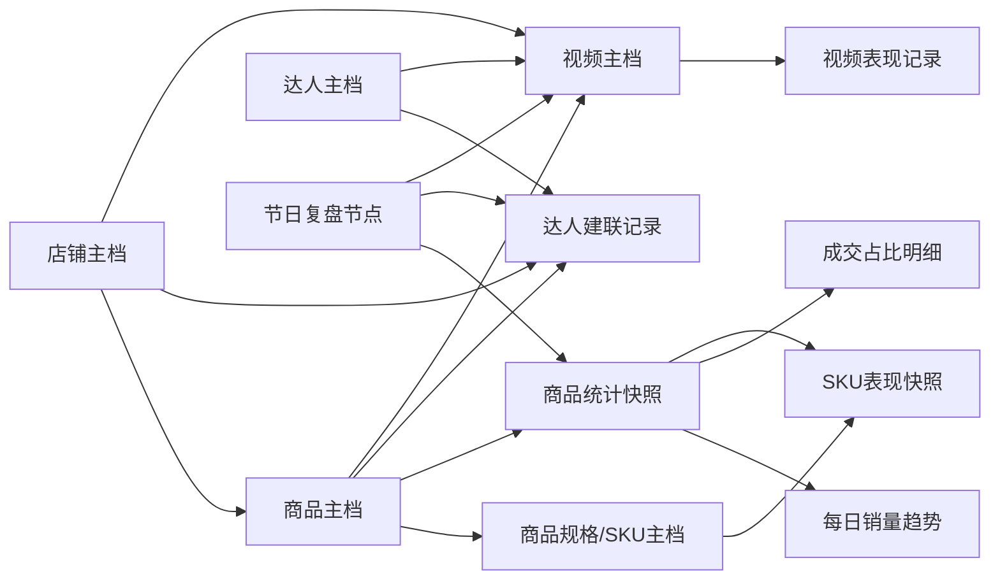

# TK 综合数据表设计

更新时间：`2026-04-17`

状态：设计草案。本文讨论未来飞书业务数据模型，不作为当前客户需求、当前飞书表事实或 Fact DB schema 的事实来源。

本文基于当前飞书五张业务表、已创建的节日复盘测试表，以及 FastMoss 真实接口数据验证结果，设计一套可长期承载“商品、SKU、店铺、达人、建联、视频、节日复盘”的多维表结构。

相关文档：

- [10-飞书五表结构与关联分析.md](../business/10-飞书五表结构与关联分析.md)
- [../reference/fastmoss-known-interfaces.md](../reference/fastmoss-known-interfaces.md)
- [../reference/fastmoss-visualization-analysis.md](../reference/fastmoss-visualization-analysis.md)

## 1. 设计目标

当前业务已经形成两条主线：

1. 商品线：选品 -> 竞品收集 -> FastMoss 数据补全 -> 节日复盘。
2. 达人线：爆款视频发现 -> 达人池沉淀 -> 达人建联 -> 视频履约与效果复盘。

本设计的目标是把这两条线打通：

- 一个商品可以有多个规格 SKU。
- 一个商品属于一个或多个节日，也可以由多个店铺销售或运营。
- 一个店铺下可以有多个商品，也可以发起多次达人建联。
- 一个达人可以有多个视频，也可以和多个商品、多个店铺发生建联。
- 一个视频应该能关联达人、商品、节日，并沉淀播放量、销量、GMV 等表现。
- 一个节日复盘节点下可以查看多个商品在某个统计窗口内的趋势、成交结构和 SKU 表现。

最终希望支持这些问题：

- 某个节日结束后，哪些商品是爆品，哪些是衰退品？
- 某个商品哪个规格卖得最好，是否有缺货风险？
- 某个商品的成交主要来自短视频、直播、商品卡、达人联盟还是广告？
- 某个店铺在某个节日下有哪些商品、哪些达人、哪些视频贡献最大？
- 某个达人历史上给哪些商品出过爆款视频，建联进度和履约情况如何？

## 2. 设计原则

### 2.1 不做一张超级大表

商品、SKU、达人、建联、视频、复盘快照的粒度不同，不能放进一张宽表：

- 商品是相对稳定的主数据。
- SKU 是商品下的规格维度。
- 达人是独立主体，可以跨商品合作。
- 建联是一次次发生的业务动作。
- 视频是内容资产。
- 复盘快照是某个时间窗口下的统计结果。

因此应拆成主档表、关系表和分析明细表。

### 2.2 主档表只放相对稳定的信息

例如：

- `商品主档` 放标题、链接、主图、商品 ID、商品类型。
- `达人主档` 放达人 ID、主页链接、粉丝量、联系方式。
- `店铺主档` 放标准店铺名、Seller ID、站点。

销量、GMV、库存占比、视频播放量这类会随时间变化的数据，不放在主档里作为唯一事实，应放进快照或表现记录。

### 2.3 所有关联都尽量使用飞书原生关联字段

当前五张表最大的问题是靠文本软关联：

- `商品ID` 对 `SKU-ID`
- `达人ID` 对 `达人名称`
- `店铺名称` 对 `建联店铺`
- `产品` 对 `建联产品`

新结构里应把关键关系改成飞书原生关联字段，减少人工对齐成本。

### 2.4 保留历史五表作为来源或临时工作台

不建议立刻删除五张旧表。更好的做法是：

- 旧表继续作为“录入入口”或“历史数据来源”。
- 新表作为“标准化数据层”。
- 用脚本或人工批处理逐步把旧表数据同步到新表。

## 3. 总体模型

## 4. 表清单

| 层级 | 表名 | 类型 | 是否已有基础 | 核心粒度 |
| --- | --- | --- | --- | --- |
| 主数据 | `店铺主档` | 新增 | 否 | 一个店铺一条 |
| 主数据 | `商品主档` | 复用/增强 | 是 | 一个商品一条 |
| 主数据 | `商品规格/SKU主档` | 复用/增强 | 是 | 一个 SKU/规格一条 |
| 主数据 | `达人主档` | 由 `TK达人池` 升级 | 是 | 一个达人一条 |
| 主数据 | `视频主档` | 由 `TK合作爆款视频` 升级 | 是 | 一个视频一条 |
| 业务流水 | `达人建联记录` | 由 `TK达人建联表` 升级 | 是 | 一次建联一条 |
| 复盘节点 | `节日复盘节点` | 复用/增强 | 是 | 一个节日复盘节点一条 |
| 商品分析 | `商品统计快照` | 复用/增强 | 是 | 一个商品在一个窗口下一条 |
| 商品分析 | `每日销量趋势` | 复用 | 是 | 一个快照下一天一条 |
| 商品分析 | `成交占比明细` | 新增/替代旧出单占比 | 部分已有 | 一个快照下一个占比项一条 |
| 商品分析 | `SKU表现快照` | 新增/替代旧 SKU 占比 | 部分已有 | 一个快照下一个 SKU 一条 |
| 内容分析 | `视频表现记录` | 新增 | 否 | 一个视频在一个窗口下一条 |

## 5. 表结构设计

### 5.1 店铺主档

用途：

- 统一店铺名称，解决 `JOYIN`、`Joyfy-US`、`Magpiee`、`Zidmo`、建联店铺编码不一致的问题。
- 向下关联商品、建联、视频，后续可以做店铺维度的节日复盘。

建议字段：

| 字段 | 类型 | 说明 |
| --- | --- | --- |
| `店铺名称` | 文本 | 主字段，标准店铺名 |
| `店铺别名` | 多选或文本 | 历史名称、缩写、人工别名 |
| `Seller ID` | 文本 | TikTok / FastMoss 店铺 ID |
| `站点/国家` | 单选 | US、UK 等 |
| `店铺链接` | 超链接 | TikTok Shop 或 FastMoss 店铺链接 |
| `店铺类型` | 单选 | 自有店、竞品店、合作店、待确认 |
| `主营节日` | 多选 | 情人节、复活节、毕业季等 |
| `备注` | 文本 | 人工说明 |
| `关联商品` | 关联记录 | 关联 `商品主档` |
| `关联建联记录` | 关联记录 | 关联 `达人建联记录` |
| `关联视频` | 关联记录 | 关联 `视频主档` |

来源映射：

| 来源表 | 来源字段 |
| --- | --- |
| `TK选品收集` | `店铺名称` |
| `TK竞品收集` | `卖家` |
| `TK达人建联表` | `建联店铺` |
| FastMoss `base` 接口 | `data.shop.seller_id`, `data.shop.name`, `data.shop.region` |

### 5.2 商品主档

用途：

- 商品的标准主表。
- 当前测试表中的 `商品主档` 可以直接作为基础继续增强。

建议字段：

| 字段 | 类型 | 说明 |
| --- | --- | --- |
| `商品名称` | 文本 | 内部易读名称，可包含节日/简称 |
| `商品ID` | 文本 | TikTok 商品 ID，强主键 |
| `商品链接` | 超链接 | TikTok PDP URL |
| `FastMoss链接` | 超链接 | FastMoss 商品详情 URL |
| `商品标题` | 文本 | TikTok / FastMoss 标题 |
| `商品主图` | 附件 | 商品主图 |
| `关联店铺` | 关联记录 | 关联 `店铺主档` |
| `店铺名称` | 查找或文本 | 从店铺主档查找，兼容历史字段 |
| `节日` | 多选 | 商品适配的节日 |
| `商品类型` | 多选 | 玩具、礼盒、装饰、派对用品等 |
| `选品状态` | 单选 | 待观察、重点跟踪、已上架、已复盘、已放弃 |
| `当前商品状态` | 单选 | 正常、已下架、区域不可售、待确认 |
| `首次记录日期` | 日期 | 第一次进入系统的日期 |
| `差评整理` | 文本 | 差评摘要 |
| `备注` | 文本 | 人工备注 |
| `规格SKU` | 关联记录 | 关联 `商品规格/SKU主档` |
| `统计快照` | 关联记录 | 关联 `商品统计快照` |
| `关联视频` | 关联记录 | 关联 `视频主档` |
| `建联记录` | 关联记录 | 关联 `达人建联记录` |

去重规则：

1. 优先用 `商品ID` 去重。
2. 商品链接中能提取 PDP ID 时，用 PDP ID 补齐 `商品ID`。
3. 没有商品 ID 时，暂时进入待清洗状态，不自动合并。

来源映射：

| 来源表 | 目标字段 |
| --- | --- |
| `TK选品收集.商品ID` | `商品ID` |
| `TK选品收集.商品链接` | `商品链接` |
| `TK选品收集.商品标题` | `商品标题` |
| `TK选品收集.商品主图` | `商品主图` |
| `TK竞品收集.SKU-ID` | `商品ID` |
| `TK竞品收集.产品链接` | `商品链接` |
| `TK竞品收集.标题` | `商品标题` |
| `TK竞品收集.图片` | `商品主图` |
| `TK竞品收集.节日` | `节日` |
| `TK竞品收集.商品状态` | `当前商品状态` |

### 5.3 商品规格/SKU主档

用途：

- 一个商品可能有多个 size、quantity、color 等规格。
- 该表只放规格的稳定信息，销量、GMV、占比放 `SKU表现快照`。

建议字段：

| 字段 | 类型 | 说明 |
| --- | --- | --- |
| `规格名称` | 文本 | 主字段，例如 `商品ID-60pcs` |
| `规格SKU ID` | 文本 | FastMoss / TikTok SKU ID |
| `关联商品` | 关联记录 | 关联 `商品主档` |
| `Size` | 文本 | 尺寸或数量规格 |
| `Color` | 文本 | 颜色规格 |
| `规格属性` | 文本 | 原始属性串，例如 `quantity=60pcs` |
| `规格图片` | 附件或 URL | SKU 图片 |
| `当前价格` | 数字 | 当前 SKU 价格 |
| `原价` | 数字 | 当前 SKU 原价 |
| `当前库存` | 数字 | 当前库存 |
| `是否主推规格` | 复选框 | 是否主推 |
| `当前状态` | 单选 | 正常、缺货、停卖、待确认 |
| `备注` | 文本 | 人工说明 |
| `历史表现` | 关联记录 | 关联 `SKU表现快照` |

来源映射：

| 来源 | 目标字段 |
| --- | --- |
| `/api/goods/v3/productSku.data.sku_list[].sku_id` | `规格SKU ID` |
| `/api/goods/v3/productSku.data.sku_list[].sku_sale_props[].prop_value` | `Size` / `规格属性` |
| `/api/goods/v3/productSku.data.sku_list[].real_price_value` | `当前价格` |
| `/api/goods/v3/productSku.data.sku_list[].stock` | `当前库存` |

### 5.4 达人主档

用途：

- 统一达人账号，承接达人池、爆款视频、建联记录。
- 当前 `TK达人池` 可以升级为此表。

建议字段：

| 字段 | 类型 | 说明 |
| --- | --- | --- |
| `达人ID` | 文本 | 主字段，TikTok unique_id 或账号 ID |
| `达人昵称` | 文本 | 昵称 |
| `达人主页` | 超链接 | TikTok 主页或 FastMoss 详情 |
| `达人头像` | 附件 | 头像 |
| `站点/国家` | 单选 | US 等 |
| `粉丝数` | 数字或文本 | 建议最终清洗为数字 |
| `达人类型` | 多选 | 竞品达人、爆款达人、自申请达人、合作达人 |
| `联系方式` | 文本 | 邮箱、电话、WhatsApp 等 |
| `达人地址` | 文本 | 地址 |
| `达人电话` | 文本 | 电话 |
| `合作过的节日` | 多选 | 历史节日标签 |
| `爆款产品标签` | 多选 | 出过爆款的视频产品 |
| `达人状态` | 单选 | 待建联、建联中、已合作、暂不合作、黑名单 |
| `备注` | 文本 | 人工说明 |
| `建联记录` | 关联记录 | 关联 `达人建联记录` |
| `关联视频` | 关联记录 | 关联 `视频主档` |

来源映射：

| 来源表 | 目标字段 |
| --- | --- |
| `TK达人池.达人ID` | `达人ID` |
| `TK达人池.达人头像` | `达人头像` |
| `TK达人池.粉丝数` | `粉丝数` |
| `TK达人池.达人联系方式` | `联系方式` |
| `TK达人池.跟我们合作过的节日` | `合作过的节日` |
| `TK达人池.出爆款视频...产品` | `爆款产品标签` |
| `TK合作爆款视频.达人ID` | 用于补齐或创建达人 |

### 5.5 达人建联记录

用途：

- 记录一次达人建联动作。
- 当前 `TK达人建联表` 应升级成此表，关键是补上 `关联达人`、`关联商品`、`关联店铺`。

建议字段：

| 字段 | 类型 | 说明 |
| --- | --- | --- |
| `建联记录` | 文本或自动编号 | 主字段 |
| `建联时间` | 日期 | 建联日期 |
| `关联达人` | 关联记录 | 关联 `达人主档` |
| `达人名称` | 文本 | 历史字段，保留便于迁移 |
| `关联商品` | 关联记录 | 关联 `商品主档` |
| `关联店铺` | 关联记录 | 关联 `店铺主档` |
| `关联节日` | 关联记录或单选 | 关联 `节日复盘节点` 或节日枚举 |
| `粉丝数` | 数字或文本 | 建联时记录的粉丝数快照 |
| `达人类型` | 单选 | 竞品达人、爆款达人、自申请达人 |
| `佣金` | 数字 | 佣金比例 |
| `建联渠道` | 单选 | 邮件、TikTok、WhatsApp、其他 |
| `建联状态` | 单选 | 待联系、已联系、已回复、寄样、已发视频、未履约、结束 |
| `视频链接` | 超链接 | 已履约视频 |
| `关联视频` | 关联记录 | 关联 `视频主档` |
| `发视频时间` | 日期或文本 | 建议后续改日期 |
| `备注` | 文本 | 沟通记录 |

迁移注意：

- `TK达人建联表.达人名称` 当前不一定是达人 ID，迁移时先用它匹配 `达人主档.达人ID`，匹配不到则创建待确认达人。
- `建联产品` 当前是内部编码，需要建立商品映射后再关联 `商品主档`。
- `建联店铺` 需要先进入 `店铺主档` 做标准化。

### 5.6 视频主档

用途：

- 管理爆款视频、履约视频、竞品视频。
- 当前 `TK合作爆款视频` 可以升级为此表。

建议字段：

| 字段 | 类型 | 说明 |
| --- | --- | --- |
| `视频标题/备注` | 文本 | 主字段，可用达人ID + 视频ID |
| `视频ID` | 文本 | TikTok 视频 ID，强主键 |
| `视频链接` | 超链接 | TikTok 视频链接 |
| `FastMoss链接` | 超链接 | FastMoss 视频访问链接 |
| `关联达人` | 关联记录 | 关联 `达人主档` |
| `关联商品` | 关联记录 | 关联 `商品主档` |
| `关联店铺` | 关联记录 | 关联 `店铺主档` |
| `关联节日` | 单选或关联 | 情人节、复活节等 |
| `产品标签` | 单选或多选 | 历史产品标签 |
| `视频类型` | 单选 | 爆款视频、履约视频、广告视频、竞品视频 |
| `发布时间` | 日期 | 视频发布日期 |
| `播放量` | 数字 | 当前或采集时播放量 |
| `销量` | 数字 | 当前或采集时销量 |
| `GMV` | 数字 | 当前或采集时 GMV |
| `视频素材` | 附件 | 可选 |
| `备注` | 文本 | 人工说明 |
| `表现记录` | 关联记录 | 关联 `视频表现记录` |

来源映射：

| 来源表 | 目标字段 |
| --- | --- |
| `TK合作爆款视频.视频码` | `视频ID` |
| `TK合作爆款视频.视频来源` | `视频链接` |
| `TK合作爆款视频.Fastmoss访问链接` | `FastMoss链接` |
| `TK合作爆款视频.达人ID` | `关联达人` |
| `TK合作爆款视频.节日` | `关联节日` |
| `TK合作爆款视频.产品` | `产品标签` |
| `TK合作爆款视频.视频发布的日期` | `发布时间` |
| `TK合作爆款视频.视频播放量-AI` | `播放量` |

### 5.7 节日复盘节点

用途：

- 记录某个节日某个复盘节点。
- 当前测试表中的 `节日复盘节点` 可以继续使用，并增强附件可视化字段。

建议字段：

| 字段 | 类型 | 说明 |
| --- | --- | --- |
| `节点名称` | 文本 | 主字段，例如 `真实-2026复活节-28天接口复盘` |
| `节日` | 单选 | 情人节、复活节等 |
| `年份` | 数字 | 2026 |
| `节点日期` | 日期 | 复盘日 |
| `统计开始日期` | 日期 | 窗口开始 |
| `统计结束日期` | 日期 | 窗口结束 |
| `统计口径` | 单选 | 过去7天、过去28天、过去30天、自然月、自定义 |
| `阶段` | 单选 | 预热期、爆发期、节后复盘、全年复盘 |
| `复盘目标` | 文本 | 本次复盘要回答的问题 |
| `复盘可视化总览` | 附件 | 已验证可用 |
| `销量GMV趋势图` | 附件 | 已验证可用 |
| `成交结构占比图` | 附件 | 已验证可用 |
| `SKU销量库存图` | 附件 | 已验证可用 |
| `商品快照` | 关联记录 | 关联 `商品统计快照` |
| `关联建联记录` | 关联记录 | 关联 `达人建联记录` |
| `关联视频` | 关联记录 | 关联 `视频主档` |
| `备注` | 文本 | 人工说明 |

### 5.8 商品统计快照

用途：

- 记录一个商品在一个统计窗口下的汇总数据。
- 当前测试表中的 `商品统计快照` 可继续使用。

建议字段：

| 字段 | 类型 | 说明 |
| --- | --- | --- |
| `快照名称` | 文本 | 主字段，商品ID + 节日 + 窗口 |
| `关联商品` | 关联记录 | 关联 `商品主档` |
| `关联复盘节点` | 关联记录 | 关联 `节日复盘节点` |
| `采集日期` | 日期时间 | 数据采集时间 |
| `统计开始日期` | 日期 | 窗口开始 |
| `统计结束日期` | 日期 | 窗口结束 |
| `统计天数` | 数字 | 7、28、30、90 |
| `窗口销量` | 数字 | FastMoss `overview.sold_count` |
| `窗口GMV` | 数字 | FastMoss `overview.sale_amount` |
| `日均销量` | 数字 | FastMoss `overview.avg_sold_count` |
| `日均GMV` | 数字 | FastMoss `overview.avg_sale_amount`，建议新增 |
| `当前价格` | 数字 | 当前价格 |
| `当前总销量` | 数字 | 商品累计销量 |
| `近7天销量` | 数字 | 可选 |
| `近28天销量` | 数字 | 可选 |
| `近30天销量` | 数字 | 视图兼容字段 |
| `近90天销量` | 数字 | 可选 |
| `峰值日` | 日期 | 统计窗口内销量最高日 |
| `峰值日销量` | 数字 | 峰值销量 |
| `复盘判断` | 单选 | 爆品、平稳、衰退、异常、待观察 |
| `商品状态` | 单选 | 正常、已下架、区域不可售、待确认 |
| `复盘结论` | 文本 | 人工或自动摘要 |
| `每日趋势` | 关联记录 | 关联 `每日销量趋势` |
| `成交占比明细` | 关联记录 | 关联 `成交占比明细` |
| `SKU表现快照` | 关联记录 | 关联 `SKU表现快照` |
| `价格趋势` | 关联记录 | 关联 `价格趋势明细` |

### 5.9 每日销量趋势

用途：

- 支撑销量/GMV趋势折线图。

建议字段：

| 字段 | 类型 | 说明 |
| --- | --- | --- |
| `趋势记录` | 文本 | 主字段，商品ID + 日期 |
| `关联快照` | 关联记录 | 关联 `商品统计快照` |
| `日期` | 日期 | `chart_list[].dt` |
| `当日销量` | 数字 | `chart_list[].inc_sold_count` |
| `当日GMV` | 数字 | `chart_list[].inc_sale_amount` |
| `累计销量` | 数字 | `chart_list[].sold_count`，建议新增 |
| `累计GMV` | 数字 | `chart_list[].sale_amount`，建议新增 |
| `当日价格` | 数字 | `chart_list[].price`，可与价格趋势共用 |
| `当日达人数量` | 数字 | `chart_list[].inc_author_count` |
| `当日视频数` | 数字 | `chart_list[].inc_aweme_count` |
| `当日直播数` | 数字 | `chart_list[].inc_live_count`，建议新增 |
| `是否峰值日` | 复选框 | 是否为窗口内峰值日 |
| `阶段标签` | 单选 | 节前、节日当天、节后、其他 |

### 5.10 成交占比明细

用途：

- 统一承接成交渠道占比、成交内容占比、成交投放占比。
- 建议替代当前测试表的 `出单种类占比`，因为“出单种类”只能覆盖内容维度，不够通用。

建议字段：

| 字段 | 类型 | 说明 |
| --- | --- | --- |
| `占比记录` | 文本 | 主字段，快照 + 占比类型 + 来源名称 |
| `关联快照` | 关联记录 | 关联 `商品统计快照` |
| `占比类型` | 单选 | 成交渠道、成交内容、成交投放 |
| `来源key` | 文本 | FastMoss 原始 key |
| `来源名称` | 单选或文本 | 中文名称 |
| `销量` | 数字 | `units_sold.list[].sold_count` |
| `销量占比` | 数字 | `units_sold.list[].propotion` 转小数 |
| `GMV` | 数字 | `gmv.list[].sale_amount` |
| `GMV占比` | 数字 | `gmv.list[].propotion` 转小数 |
| `排名` | 数字 | 当前指标排名 |
| `备注` | 文本 | 口径说明 |

占比类型来源：

| 占比类型 | FastMoss 字段 |
| --- | --- |
| `成交渠道` | `overview.data.channel_distribution` |
| `成交内容` | `overview.data.content_distribution` |
| `成交投放` | `overview.data.ads_distribution` |

业务映射：

| 原始 key | 中文名 |
| --- | --- |
| `common.goods.affiliate` | 达人联盟 |
| `common.goods.product_card` | 商品卡 |
| `common.goods.shop_account` | 店铺账号 |
| `video.name` | 短视频 |
| `live.name` | 直播 |
| `common.goods.adTraffic` | 广告流量 |
| `common.goods.otherTraffic` | 非广告流量 |

### 5.11 SKU表现快照

用途：

- 记录某个 SKU 在某个统计窗口下的销量、GMV、库存、占比。
- 建议替代当前测试表的 `SKU销量占比`。

建议字段：

| 字段 | 类型 | 说明 |
| --- | --- | --- |
| `SKU表现记录` | 文本 | 主字段，快照 + SKU |
| `关联快照` | 关联记录 | 关联 `商品统计快照` |
| `关联规格SKU` | 关联记录 | 关联 `商品规格/SKU主档` |
| `SKU名称` | 文本 | 用于承接 `Other` 聚合项 |
| `销量` | 数字 | `sku_units_sold` |
| `销量占比` | 数字 | `sku_units_sold.propotion` |
| `GMV` | 数字 | `sku_gmv.sale_amount` |
| `GMV占比` | 数字 | `sku_gmv.propotion` |
| `当前库存` | 数字 | `v3 productSku.stock` 或 `sku_stock` |
| `库存占比` | 数字 | `sku_stock.propotion` |
| `当前价格` | 数字 | SKU 价格 |
| `排名` | 数字 | 按销量或 GMV 排名 |
| `判断` | 单选 | 主销、长尾、滞销、缺货风险、待观察 |
| `是否聚合项` | 复选框 | `Other` 为 true |
| `备注` | 文本 | 口径说明 |

数据源：

| 指标 | FastMoss 字段 |
| --- | --- |
| SKU 销量 | `/api/goods/productSku.data.sku_units_sold` |
| SKU GMV | `/api/goods/productSku.data.sku_gmv` |
| SKU 库存分布 | `/api/goods/productSku.data.sku_stock` |
| SKU 完整清单 | `/api/goods/v3/productSku.data.sku_list` |

### 5.12 视频表现记录

用途：

- 记录视频在某个采集日或统计窗口下的表现。
- 让 `视频主档` 保持稳定，变化数据进入表现记录。

建议字段：

| 字段 | 类型 | 说明 |
| --- | --- | --- |
| `视频表现记录` | 文本 | 主字段，视频ID + 日期/窗口 |
| `关联视频` | 关联记录 | 关联 `视频主档` |
| `关联商品` | 关联记录 | 冗余关联，便于分析 |
| `关联达人` | 关联记录 | 冗余关联，便于分析 |
| `采集日期` | 日期 | 数据采集日 |
| `统计开始日期` | 日期 | 可选 |
| `统计结束日期` | 日期 | 可选 |
| `播放量` | 数字 | 视频播放量 |
| `点赞数` | 数字 | 可选 |
| `评论数` | 数字 | 可选 |
| `分享数` | 数字 | 可选 |
| `销量` | 数字 | 视频带货销量 |
| `GMV` | 数字 | 视频带货 GMV |
| `是否广告` | 复选框 | 是否广告视频 |
| `ROAS` | 数字 | 广告视频可用 |
| `备注` | 文本 | 口径说明 |

来源：

- 当前 `TK合作爆款视频` 可先生成一条初始表现记录。
- 后续可接 FastMoss `/api/goods/v3/video` 和 `/api/goods/V3/adsVideo`。

## 6. 现有五表迁移策略

### 6.1 迁移总览

| 现有表 | 新结构归宿 | 迁移动作 |
| --- | --- | --- |
| `TK选品收集` | `商品主档` + 商品素材 | 提取商品 ID、链接、标题、主图、评论、评分 |
| `TK竞品收集` | `商品主档` + `商品统计快照` | 商品基础信息进主档，销量/价格截图进快照 |
| `TK达人池` | `达人主档` | 达人 ID 作为主键，合作节日和产品标签保留 |
| `TK达人建联表` | `达人建联记录` | 补关联达人、商品、店铺 |
| `TK合作爆款视频` | `视频主档` + `视频表现记录` | 视频码作为主键，达人 ID 关联达人 |
| 测试复盘表 | 复盘分析层 | 保留并增强为正式分析层 |

### 6.2 商品迁移规则

商品合并优先级：

1. `TK竞品收集.SKU-ID`
2. `TK选品收集.商品ID`
3. `产品链接` 或 `商品链接` 中提取的 PDP ID

当同一商品同时存在于 `TK选品收集` 和 `TK竞品收集`：

- 以 `TK竞品收集` 的自动抓取字段作为结构化字段。
- 以 `TK选品收集` 的图片、差评、截图作为素材补充。
- 人工备注不覆盖，合并到备注或单独保留来源字段。

### 6.3 达人迁移规则

达人合并优先级：

1. `TK达人池.达人ID`
2. `TK合作爆款视频.达人ID`
3. `TK达人建联表.达人名称`

处理策略：

- 如果 `达人名称` 能精确匹配 `达人ID`，直接关联。
- 如果不能匹配，创建 `待确认` 达人记录。
- 后续人工补齐 `达人ID` 后再合并。

### 6.4 店铺迁移规则

店铺名称先进入 `店铺主档`，再人工或规则合并：

- `JOYIN`、`Joyfy-US` 这类可能是同品牌不同显示名，应放入 `店铺别名`。
- `Magpiee`、`Zidmo` 是建联店铺，需要确认是否为自有店或合作店。

### 6.5 视频迁移规则

视频以 `视频码` 为主键：

- 有 `视频码`：直接生成或更新 `视频主档`。
- 无 `视频码` 但有 `视频来源`：从 URL 提取视频 ID。
- 无法提取：进入待清洗状态。

## 7. 推荐视图

### 7.1 商品主档视图

| 视图 | 筛选/排序 |
| --- | --- |
| `重点跟踪商品` | `选品状态 = 重点跟踪` |
| `节日商品库` | 按 `节日` 分组 |
| `异常商品` | `当前商品状态 != 正常` |
| `待补SKU商品` | `规格SKU` 为空 |

### 7.2 节日复盘视图

| 视图 | 筛选/排序 |
| --- | --- |
| `情人节复盘看板` | `节日 = 情人节` |
| `复活节复盘看板` | `节日 = 复活节` |
| `近30天爆品排行` | 按 `窗口销量` 或 `近30天销量` 降序 |
| `复盘可视化` | 展示节点名、总览图、趋势图、成交结构图、SKU图 |

### 7.3 SKU 视图

| 视图 | 筛选/排序 |
| --- | --- |
| `SKU主销规格排行` | 按 `销量` 降序 |
| `SKU缺货风险` | `判断 = 缺货风险` 或 `销量高且库存低` |
| `SKU库存结构` | 按 `当前库存` 降序 |

### 7.4 达人视图

| 视图 | 筛选/排序 |
| --- | --- |
| `待建联达人` | `达人状态 = 待建联` |
| `已合作达人` | `达人状态 = 已合作` |
| `爆款达人库` | 有关联视频或爆款产品标签 |
| `节日达人池` | 按 `合作过的节日` 分组 |

### 7.5 建联视图

| 视图 | 筛选/排序 |
| --- | --- |
| `本周待跟进` | `建联状态 in 已联系/已回复/寄样` |
| `未履约达人` | `建联状态 = 未履约` |
| `按店铺看建联` | 按 `关联店铺` 分组 |
| `按商品看建联` | 按 `关联商品` 分组 |

### 7.6 视频视图

| 视图 | 筛选/排序 |
| --- | --- |
| `爆款视频库` | `视频类型 = 爆款视频` |
| `履约视频` | 有 `关联建联记录` |
| `高播放视频` | 按 `播放量` 降序 |
| `按达人看视频` | 按 `关联达人` 分组 |

## 8. 自动化同步建议

### 8.1 商品数据同步

输入：

- 商品 ID 或 TikTok 商品链接。

流程：

1. 解析商品 ID。
2. 调 FastMoss `/api/goods/v3/base` 更新 `商品主档` 和 `店铺主档`。
3. 调 `/api/goods/v3/productSku` 更新 `商品规格/SKU主档`。
4. 调 `/api/goods/v3/overview` 创建或更新 `商品统计快照`、`每日销量趋势`、`成交占比明细`。
5. 调 `/api/goods/productSku?d_type=28` 创建或更新 `SKU表现快照`。
6. 生成可视化附件，回写 `节日复盘节点` 或 `商品统计快照`。

### 8.2 达人数据同步

输入：

- 达人 ID 或达人主页链接。

流程：

1. 标准化达人 ID。
2. 更新 `达人主档`。
3. 根据商品关联达人接口或视频表补齐达人与商品关系。
4. 建联表只负责业务动作，不直接覆盖达人主档。

### 8.3 视频数据同步

输入：

- 视频链接或 FastMoss 视频链接。

流程：

1. 提取视频 ID。
2. 更新 `视频主档`。
3. 关联达人、商品、节日。
4. 写入 `视频表现记录`。

## 9. 分阶段落地计划

### 阶段 1：最小可用关系模型

目标：先把核心主键和关联打通。

新增或增强：

- 新增 `店铺主档`
- 新增 `视频主档`
- 新增 `成交占比明细`
- 新增 `SKU表现快照`
- 增强 `达人建联记录`

关键动作：

- 商品主档补 `关联店铺`
- 达人建联记录补 `关联达人`、`关联商品`、`关联店铺`
- 视频主档补 `关联达人`、`关联商品`

### 阶段 2：迁移现有五表

目标：把历史数据逐步进入标准模型。

关键动作：

- 从 `TK竞品收集` 生成商品主档和统计快照。
- 从 `TK达人池` 生成达人主档。
- 从 `TK合作爆款视频` 生成视频主档。
- 从 `TK达人建联表` 生成建联记录，并标记待确认关联。

### 阶段 3：复盘分析自动化

目标：用 FastMoss 接口自动刷新复盘数据和图表。

关键动作：

- 固化商品真实数据同步脚本。
- 固化可视化图片生成脚本。
- 按节日节点批量刷新商品快照。
- 增加 dashboard 或插件视图。

### 阶段 4：经营分析扩展

目标：从商品复盘扩展到店铺、达人、视频表现分析。

可做分析：

- 店铺节日表现排行。
- 达人履约率和爆款率。
- 商品 SKU 缺货风险。
- 视频内容类型对销量贡献。
- 广告流量与非广告流量占比变化。

## 10. 最小可用版本建议

如果只想最快落地，建议先做 8 张核心表：

1. `店铺主档`
2. `商品主档`
3. `商品规格/SKU主档`
4. `达人主档`
5. `达人建联记录`
6. `视频主档`
7. `商品统计快照`
8. `成交占比明细`

已经存在的 `节日复盘节点`、`每日销量趋势`、`价格趋势明细` 可以继续保留，不必重建。

## 11. 关键风险

1. 达人 ID 不统一
   - `TK达人建联表` 当前只有 `达人名称`，不是稳定 ID。
   - 需要补 `达人ID` 或做待确认匹配。

2. 店铺名称不统一
   - 商品表、建联表、FastMoss 店铺名可能不是同一套命名。
   - 需要 `店铺别名` 做过渡。

3. 产品编码不统一
   - `建联产品` 和真实商品 ID 不是同一体系。
   - 需要一张映射表或在 `商品主档` 增加 `内部产品编码`。

4. SKU 的 `Other` 聚合项不能强行拆分
   - FastMoss SKU 占比里 `Other` 不对应单一 SKU。
   - 应在 `SKU表现快照` 中标记 `是否聚合项`。

5. 快照数据不能覆盖主档事实
   - 销量、GMV、库存、价格会变化。
   - 不应只写在商品主档，应写在快照和表现表。

## 12. 一句话结论

综合设计的核心不是“把五张表合成一张”，而是把五张表背后的实体关系标准化：商品、SKU、店铺、达人、建联、视频都是独立实体；节日复盘、成交占比、SKU表现、视频表现是围绕这些实体产生的时间窗口数据。按这个模型建设后，后续才能稳定地做节日复盘、达人合作复盘、店铺经营分析和商品 SKU 分析。
