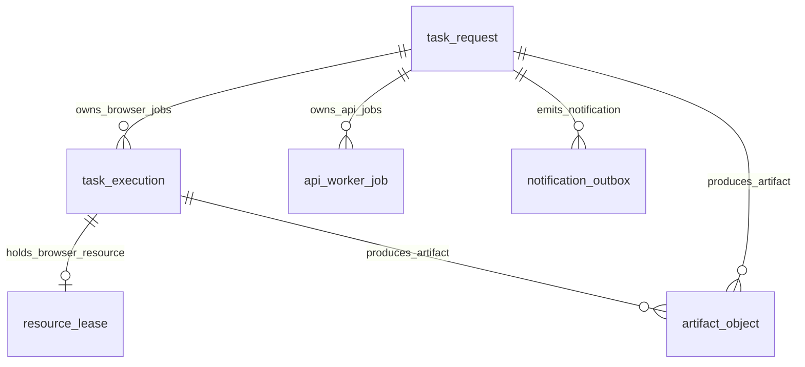
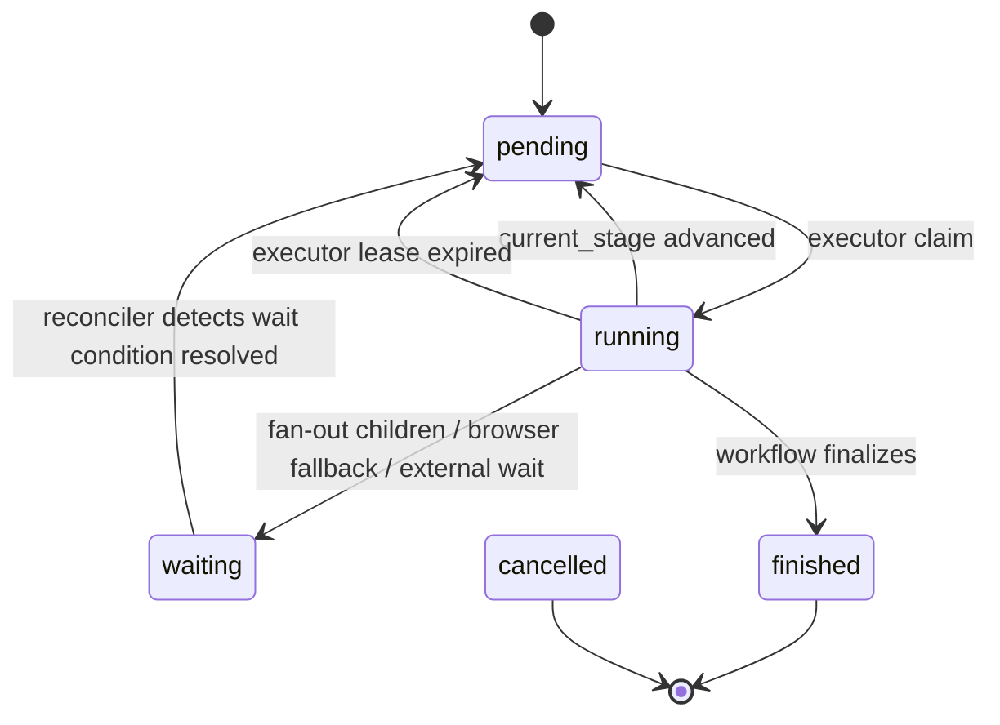
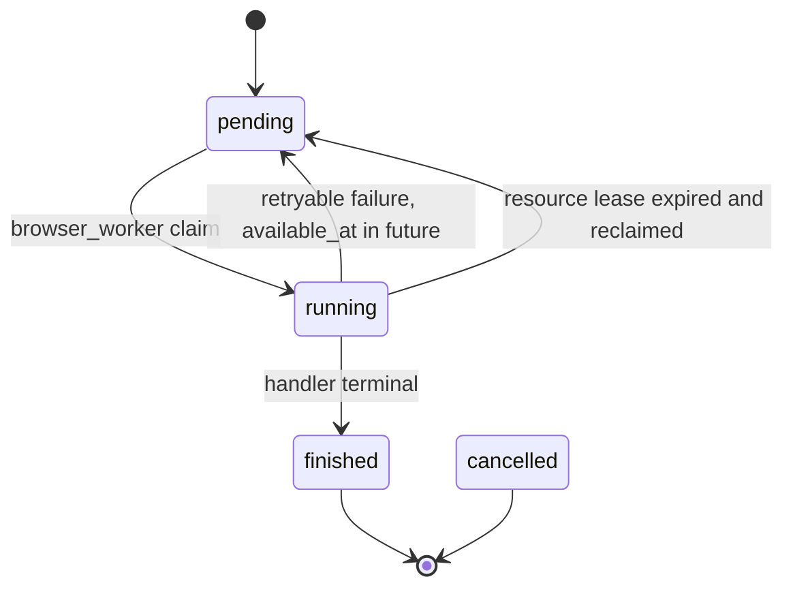
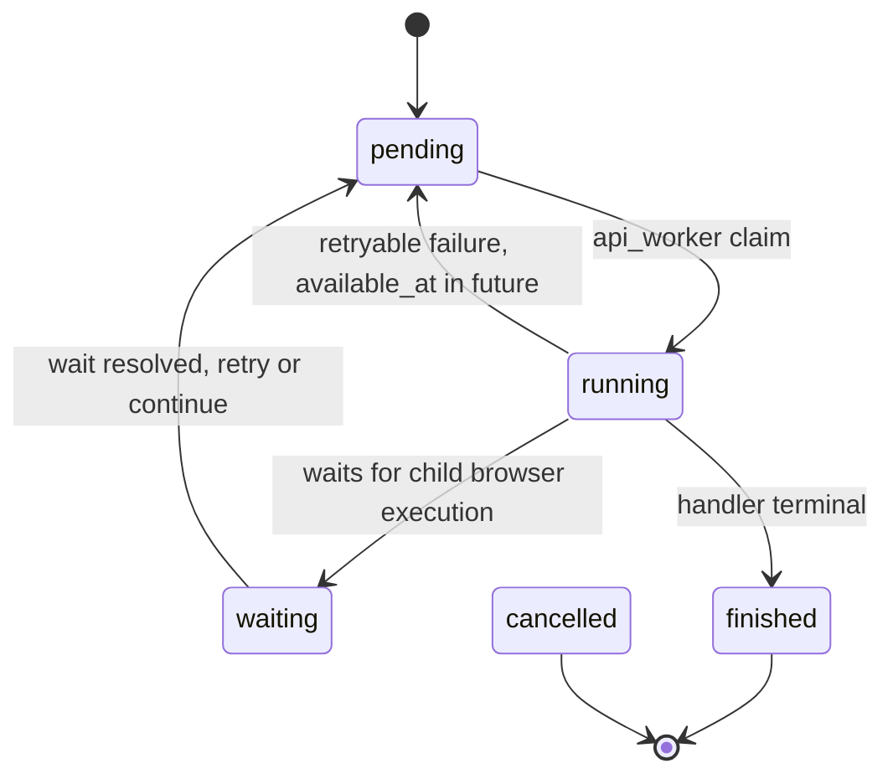
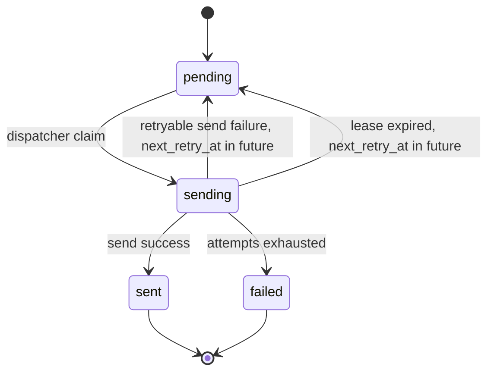

# Runtime DB Schema 设计

日期: 2026-07-23

## 1. 定位

Runtime DB 是系统的执行控制面，负责保存任务、队列、worker claim、lease、heartbeat、retry、outbox、artifact 索引等运行状态。

它不保存最终业务事实，不承担 TikTok / FastMoss / 飞书主体数据的主档职责。事实沉淀应进入 Fact DB；只有机器契约显式允许的长期业务对象进入 MinIO，其余运行文件只留在本地短期 artifact 目录。

核心判断:

> Runtime DB 回答“任务怎么跑、跑到哪、谁在跑、是否可重试、是否需要兜底”；Fact DB 回答“采集到了什么事实”。

### 1.1 Schema 变更治理

Runtime DB 是生产执行控制面，schema 不能作为普通业务代码的内部实现细节随意变更。

生产约束:

- daemon / worker / dispatcher / watchdog 只能使用运行账号连接 Runtime DB。
- 运行账号只允许 `SELECT / INSERT / UPDATE / DELETE`，不允许 `CREATE TABLE`、`ALTER TABLE`、`DROP TABLE`、`CREATE INDEX`。
- Runtime schema 变更必须通过 migration 流程执行，并由 migration 账号完成。
- 生产进程启动时只做 schema version / migration version 校验；版本不匹配时应 fail fast，不继续 claim job。
- 本地开发或首次 bootstrap 可以保留自动建表能力，但该能力不能成为生产任务消费路径的一部分。

任何 Runtime schema 变更都必须说明:

| 变更项 | 必须说明 |
| --- | --- |
| 新增字段 | 默认值、旧数据回填方式、旧 worker 是否兼容 |
| 删除字段 | 下游代码和文档引用是否清理、是否经过 deprecation 周期 |
| 字段类型变更 | 数据迁移方式、失败回滚方式、索引影响 |
| 状态枚举变更 | Reconciler、Watchdog、Supervisor、summary 逻辑影响 |
| 索引/唯一键变更 | claim 性能、dedupe/idempotency 影响 |
| retry/lease 字段变更 | 卡死兜底、重试次数、死信策略影响 |

推荐账号模型:

| 账号 | 使用者 | 权限 |
| --- | --- | --- |
| `mujitask_runtime_user` | `executor_daemon`、`api_worker`、`browser_worker`、`outbox_dispatcher`、`watchdog` | Runtime 表读写，不含 DDL |
| `mujitask_migration_user` | CI/CD migration 或人工发布 | Runtime schema DDL |
| `mujitask_readonly_user` | 排障、报表、只读分析 | Runtime 表只读 |

## 2. Runtime DB 总体关系



目标 Runtime DB 使用“顶层 Task + 通用执行队列 + Outbox + Artifact”的结构。新 workflow 不新增业务专用 job 表:

- `task_request`: 顶层 Task。
- `api_worker_job`: API/IO 类型通用 job 队列。
- `task_execution`: browser/CDP 类型执行队列。
- `notification_outbox`: 结果通知分发队列。
- `resource_lease`: 浏览器资源租约。
- `artifact_object`: 运行产物索引。
- `fastmoss_session_cookie_cache`: FastMoss cookie/session 运行缓存。

当前代码中仍存在达人同步专用历史 job 表。它们只作为迁移来源和兼容事实记录，不作为目标 workflow contract，也不允许新业务流程继续扩展同类表。

### 2.1 Runtime 状态语义收敛

Runtime DB 必须区分“执行生命周期”和“业务结果”。`status` 只描述记录当前能不能被 claim、是否正在执行、是否正在等待外部子执行或是否已经结束；业务成功、失败、跳过和部分成功放在 `result_status`。

统一生命周期:

| status | 适用表 | 含义 |
| --- | --- | --- |
| `pending` | `task_request` / `api_worker_job` / `task_execution` | 可被对应执行者 claim；如果 `available_at` / `next_retry_at` 在未来，则表示延迟可执行 |
| `running` | `task_request` / `api_worker_job` / `task_execution` | 已被 executor 或 worker claim，受 lease / heartbeat 保护 |
| `waiting` | `task_request` / `api_worker_job` | 当前记录不能继续执行，正在等待 child job / browser execution / 外部可观测事件终态；对行级 browser fallback，`waiting` row job 是唯一 fallback 待处理事实 |
| `finished` | `task_request` / `api_worker_job` / `task_execution` | 运行生命周期结束，必须同时写入 `result_status` |
| `cancelled` | `task_request` / `api_worker_job` / `task_execution` | 执行被取消或取消链路已收敛；它是生命周期状态，不是业务结果 |

统一结果状态:

| result_status | 含义 |
| --- | --- |
| `success` | 必要业务输出已完成，后续 stage 可消费 |
| `partial_success` | 主输出可用，但可选或非阻塞能力失败；Fact DB / MinIO / 必需写回失败不得归为 partial_success |
| `failed` | 当前记录业务结果失败或必要副作用失败 |
| `skipped` | 输入合法，但业务规则判定无需执行或应跳过 |

兼容迁移语义:

| 历史状态 / 信号 | 目标表达 |
| --- | --- |
| `retry_wait` | `status=pending` + `available_at` / `next_retry_at` 在未来；错误与重试原因写入标准错误字段 |
| `waiting_children` | `status=waiting`；被等待对象由 Runtime DB 中非终态 child `api_worker_job` / `task_execution` 表达，等待引用只能作为观测冗余 |
| `ready_for_summary` | `current_stage=ready_for_summary` + `status=pending`；它是 workflow stage/cursor，不是生命周期状态 |
| `success` / `failed` / `skipped` 作为 job status | `status=finished` + `result_status=success/failed/skipped` |
| `partial_success` 作为 job status | `status=finished` + `result_status=partial_success` |
| `fallback_required` | Handler 或行级 job 的等待信号，不是 Runtime DB status；executor 将触发行级 job 置为 `waiting`，并创建或等待对应 browser `task_execution` |

`pending` 只能落在可被调度的具体 Runtime 记录上:

- `task_request.status=pending`: executor 可以 claim 顶层请求并推进 workflow stage。
- `api_worker_job.status=pending`: api_worker 可以 claim API/IO job。
- `task_execution.status=pending`: browser_worker 可以 claim browser job。

FastMoss fetch、TikTok fetch 这类 handler 内部步骤本身不是 Runtime DB 记录，不能单独拥有 `pending`。只有当 workflow 或行级 pipeline 为它创建了 `api_worker_job` / `task_execution` 记录时，才有 Runtime 生命周期状态。

#### Row-Serial Browser Fallback 最小事实

行级串行商品采集 workflow 必须把 fallback 事实收敛在 Runtime DB 的既有记录上，不能为了恢复流程引入派生 candidate、source job 变量或平行状态表。

- `waiting` row job 是唯一 fallback 待处理事实。同一个 `task_request` 在 `row_pipeline_concurrency=1` 时最多只能存在一个因 browser fallback 等待的行级主 job。
- `task_execution` 是浏览器任务事实。同一个 `task_request` 在上述等待期间最多只能存在一个未终态 browser `task_execution`。
- Runtime DB 只保存最小运行事实: row job 的生命周期、handler 返回的业务化 browser 请求、browser execution 的生命周期、小型结构化结果和 artifact/cache 引用。
- executor 负责调度和数据交换: 根据 waiting row job 的业务化 fallback 请求创建 browser `task_execution`，在 browser 终态后把 browser result 引用、cookie cache metadata 或失败信息写回原 row job，再把原 row job 改回 `pending` 或收敛为终态。
- handler 只返回“我需要某个 browser handler 处理这件事”的业务化请求，例如 `handler_code` 与业务 payload；handler 不携带 `fallback_source_job_id`、`after_browser_candidates` 或类似运行时关联字段。
- summary gate 只看终态业务结果: 不存在 `waiting` / `running` 的 row job，不存在未终态 browser `task_execution`，所有需要汇总的 row job 都是 `status=finished` 且带 `result_status`。summary 不依赖派生 candidate 数量，也不能把 browser success 当成行级 success。

Handler fallback 请求使用小型结构化 payload，不复制大对象，也不表达 runtime 调度策略:

```json
{
  "next_action": {
    "type": "browser_fallback",
    "handler_code": "tiktok_product_browser_fetch",
    "payload": {
      "product_url": "https://www.tiktok.com/..."
    }
  }
}
```

`task_execution.result_json` 保存浏览器 handler 的小型结构化结果。只有机器契约显式允许的长期业务对象可以用完整 `bucket + object_key + content_digest` 引用交接；HTML、普通截图、页面/网络数据和其他浏览器诊断文件只留在本地并可由 `artifact_object` 建立短期排障索引，不得成为 Fact 或后续 Job 输入。FastMoss 风控解除产生的 cookie 直接持久化到 `fastmoss_session_cookie_cache`。browser result 写回原 job 的逻辑由 executor/runtime 层完成，原 job 只接收 normalized result、允许的长期业务对象引用、脱敏 cache metadata 或失败摘要。

### 2.2 Runtime JSON 热路径存储边界

`payload_json`、`summary_json` 和 `result_json` 是 Runtime 控制面字段，不是对象存储、Fact DB 或飞书 raw snapshot 的替代品。它们会被 daemon、worker、watchdog、status 查询、父任务 release 和 summary gate 高频读取；因此 Runtime JSON 必须保持小型、可快速反序列化、可用于调度和观测。

目标尺寸:

- `summary_json`: 只保存计数、状态、少量样本和错误摘要，通常应控制在数 KB。
- `payload_json` / `result_json`: 单条记录通常应控制在几十 KB；超过 100KB 必须评估是否误放了 raw payload、完整 fact bundle、媒体列表或飞书完整记录。
- 超过 256KB 的 Runtime JSON 视为设计异常，除非有明确 contract 说明、冷路径读取策略和迁移退出条件。

Runtime JSON 禁止保存:

- 飞书完整 `raw_rows`、`raw_rows_all`、完整 record fields 或整表 snapshot。
- TikTok / FastMoss 原始响应、HTML、截图、图片、视频、base64/blob、cookie value。
- 完整 `normalized_product_result`、完整 `product_fact_bundle`、`fact_bundle_upsert` 的完整 fact bundle、完整 `upserted_entities` / `upserted_relations` / `observation_refs` 明细。
- 完整 `media_asset_sync` payload/result、完整媒体下载/上传明细。
- 完整 `feishu_table_write` record fields 或第三方 API raw response。

Runtime JSON 允许保存:

- 生命周期和业务 handoff: `row_status`、`result_status`、`business_entity_key`、`source_record_id`、`product_id`、`creator_id`、`record_id`。
- 小型统计: count、duration、step status、error type/code、少量失败样本。
- 持久化引用: Fact DB entity/raw response id；以及仅对显式允许长期业务对象使用的完整 `bucket + object_key + content_digest` 和已验证的 byte size/content type。
- 本地诊断索引: `artifact_object` id 可以作为当次运行的排障线索，但不是持久业务引用、Fact 输入或跨进程可用性承诺。
- 下游真正需要的 compact projection hints，例如一张主图的对象引用、少量展示字段或去重键。

热路径查询规则:

- Reconciler、watchdog、父任务 release、进度查询和 stage active 判断必须优先使用聚合 SQL、summary 查询或不含 `result_json` 的 summary view。
- 不允许为了判断“是否还有 active child”、“子任务完成数”、“是否可以进入 summary”而 `SELECT *` 读取所有 child job 并反序列化完整 `result_json`。
- 需要按行 fan-out 的 source rows 只能保存 compact row: record id、业务 key、product/creator identity 和必要状态字段。完整飞书行只允许存在于当前 handler 内存或本地短期诊断文件，不进入 Runtime DB、Fact DB 或 MinIO。
- Handler 返回值写入 Runtime 前必须先裁剪为小型结构化 handoff；可复用事实和受控 raw evidence 先写 Fact DB，只有显式允许的长期业务对象写 MinIO，其余原始响应和诊断内容留在本地且不得成为下游依赖。

## 3. 表设计

### 3.1 `task_request`

顶层任务表，一条记录对应用户提交的一次 Task。

| 字段组 | 字段 | 说明 |
| --- | --- | --- |
| 身份 | `request_id` | 顶层任务 ID，主键 |
| 业务路由 | `project_code`, `skill_code`, `task_name`, `task_code`, `resource_code` | executor 根据这些字段选择 workflow |
| 来源 | `trigger_mode`, `source_channel_code`, `source_session_id`, `reply_target`, `requested_by` | 任务来源与回复目标 |
| 输入 | `payload_json`, `idempotency_key` | 任务输入与顶层幂等键 |
| 状态 | `status`, `result_status`, `current_stage`, `stage_cursor_json` | 生命周期状态、终态业务结果、workflow 阶段和阶段游标 |
| 汇总 | `summary_json`, `result_json`, `error_text` | 最终摘要、结果、等待引用和错误 |
| 子任务计数 | `child_total_count`, `child_terminal_count`, `child_success_count`, `child_failed_count`, `child_skipped_count` | Reconciler 判断父任务是否可收敛 |
| claim | `worker_id`, `lease_until`, `heartbeat_at` | executor 领取顶层任务时的租约 |
| 时间 | `created_at`, `updated_at`, `started_at`, `finished_at` | 生命周期时间 |

关键索引:

- `idx_task_request_status_created_at(status, created_at)`
- `idx_task_request_task_code_created_at(task_code, created_at)`
- `idx_task_request_status_lease_until(status, lease_until)`

### 3.2 `task_execution`

Browser worker 消费的执行队列。当前用于需要浏览器/CDP/Profile 资源的任务，例如 TikTok browser fallback、登录态页面采集或其他 request/API 无法完成的页面动作。

| 字段组 | 字段 | 说明 |
| --- | --- | --- |
| 身份 | `execution_id` | 执行 ID，主键 |
| 归属 | `request_id` | 所属顶层 Task |
| 路由 | `task_name`, `item_code`, `workflow_code`, `business_key`, `dedupe_key`, `resource_code` | worker 和 handler 路由字段 |
| 队列 | `status`, `result_status`, `queue_seq`, `available_at` | 生命周期状态、终态业务结果、顺序和重试可用时间 |
| 执行 | `worker_id`, `attempt_count`, `max_attempts`, `run_id` | 当前执行者、重试次数、执行实例 |
| 数据 | `payload_json`, `summary_json`, `result_json`, `error_text` | 输入、摘要、结果、错误 |
| 时间 | `created_at`, `updated_at`, `started_at`, `finished_at`, `heartbeat_at` | 生命周期时间 |

关键索引:

- `idx_task_execution_request_created_at(request_id, created_at)`
- `idx_task_execution_status_available_queue_seq(status, available_at, queue_seq)`
- `idx_task_execution_resource_status_available_queue_seq(resource_code, status, available_at, queue_seq)`

### 3.3 `api_worker_job`

API worker 消费的通用 job 队列。适合飞书 API 读取/写回、FastMoss API/HTTP、事实库写入、对象上传、fan-out/finalizer 等不依赖浏览器 profile 的任务。

| 字段组 | 字段 | 说明 |
| --- | --- | --- |
| 身份 | `job_id` | job ID，主键 |
| 归属 | `request_id`, `task_code` | 所属 Task 和业务类型 |
| 路由 | `job_code`, `business_key`, `dedupe_key`, `stage` | handler 路由、业务键、幂等键、阶段 |
| 队列 | `status`, `result_status`, `available_at` | 生命周期状态、终态业务结果和重试时间 |
| 执行 | `attempt_count`, `max_attempts`, `worker_id`, `lease_until`, `run_id` | 执行生命周期 |
| 数据 | `payload_json`, `summary_json`, `result_json`, `error_text` | 输入、摘要、结果、错误 |
| 时间 | `created_at`, `updated_at`, `started_at`, `finished_at`, `heartbeat_at` | 生命周期时间 |

关键索引:

- `idx_api_worker_job_status_available_created(status, available_at, created_at)`
- `idx_api_worker_job_request_created(request_id, created_at)`
- `idx_api_worker_job_job_code_status_available(job_code, status, available_at)`
- `idx_api_worker_job_dedupe_key(dedupe_key)`，仅 `dedupe_key <> ''` 时唯一。

### 3.4 `api_worker_job` 父子与实体关联字段

为了支撑达人同步这类“商品发现 -> 达人详情 -> 飞书投影”的 fan-out / fan-in 流程，目标做法是在通用 job 表中补齐通用关联字段，而不是新增业务专用 job 表。

| 字段组 | 字段 | 说明 |
| --- | --- | --- |
| 父子关系 | `parent_job_id`, `root_job_id`, `job_group` | 表达 product discovery job 与 creator detail jobs 的收敛关系 |
| 业务实体 | `entity_type`, `entity_key` | 表达当前 job 绑定的商品、达人、视频、飞书记录等实体 |
| 幂等辅助 | `dedupe_key` | 推荐格式为 `request_id:stage:entity_type:entity_key` |
| 进度 | `progress_stage`, `last_progress_at` | Watchdog 和 Reconciler 判断 job 是否卡死 |
| 失败分类 | `error_type`, `error_code`, `error_path`, `dead_letter_reason` | 统一错误归因和死信处理 |

达人同步示例:

- 商品发现 job: `job_code=fastmoss_product_fetch`, `stage=discover_related_creators`, `entity_type=product`, `entity_key=product_id`。
- 达人详情 job: `job_code=fastmoss_creator_fetch`, `stage=collect_creator_detail`, `entity_type=creator`, `entity_key=influencer_id`, `parent_job_id=<product discovery job>`。
- 达人池写回 job: `job_code=feishu_table_write`, `stage=write_influencer_pool`, `entity_type=creator_projection`, `entity_key=source_record_id:influencer_id`。

### 3.5 `resource_lease`

浏览器资源租约表。它保护 browser profile / CDP 资源，避免多个 browser worker 同时使用同一资源。

| 字段 | 说明 |
| --- | --- |
| `resource_code` | 资源编码，主键 |
| `execution_id` | 当前持有该资源的 browser execution |
| `request_id` | 所属 Task |
| `worker_id` | 持有者 |
| `status` | 租约状态 |
| `lease_until`, `heartbeat_at` | 过期和心跳时间 |
| `created_at`, `updated_at` | 时间戳 |

关键索引:

- `idx_resource_lease_lease_until(lease_until)`

### 3.6 `notification_outbox`

结果通知分发队列。业务完成和通知发送解耦，避免通知失败反向污染主流程完成状态。

| 字段组 | 字段 | 说明 |
| --- | --- | --- |
| 身份 | `outbox_id` | outbox ID |
| 路由 | `channel_code`, `event_type`, `ref_type`, `ref_id`, `reply_target` | 通知渠道、事件和引用对象 |
| 幂等 | `dedupe_key` | 同一通知事件去重 |
| 队列 | `status`, `retry_count`, `max_retry_count`, `next_retry_at` | 分发状态和重试计划 |
| 执行 | `worker_id`, `lease_until`, `heartbeat_at` | dispatcher claim 信息 |
| 数据 | `payload_json`, `last_error_text` | 通知内容和错误 |
| 时间 | `sent_at`, `created_at`, `updated_at` | 发送和更新时间 |

关键索引:

- `idx_notification_outbox_dedupe_key(dedupe_key)`，仅 `dedupe_key <> ''` 时唯一。
- `idx_notification_outbox_status_next_retry_at(status, next_retry_at)`
- `idx_notification_outbox_ref_type_ref_id(ref_type, ref_id)`
- `idx_notification_outbox_status_lease_until(status, lease_until)`

#### 3.6.1 Outbox Channel 配置模型

`notification_outbox` 只保存路由事实和消息内容，不保存飞书应用密钥。

| 字段 / 参数 | 说明 |
| --- | --- |
| `channel_code` | 发送通道。准入值包括 `noop`、`disabled`、`stdout`、`console`、`webhook`、`feishu_bot_api`、`feishu_direct_api`、`openclaw_message`、`feishu_openclaw`。 |
| `reply_target` | 接收目标。可以是 JSON object、Python dict repr 或简写字符串。Feishu 目标支持 `user:ou_xxx`、`open_id:ou_xxx`、`chat:oc_xxx`、`group:oc_xxx`。 |
| `accountId` / `account_id` | `reply_target` 中的账号选择字段。缺省使用通道配置的默认账号。 |
| `payload_json.message_text` | 最终发送文本。必须由 workflow/domain projection 默认生成人类可读文本；压缩 JSON 只能在显式 `message_format=json` 时使用。 |
| `payload_json.message_format` / task `outbox_message_format` | 可选消息格式。支持 `plain_text_detail`、`plain_text_summary`、`json`、`template`。 |
| task `outbox_message_template` | 可选模板。存在时优先于 message format。 |
| `payload_json.dry_run` | 仅用于显式本地演练。生产 outbox 不应依赖 dry-run。未知 channel 不能因为 dry-run 被标记为成功。 |

Feishu `reply_target.to` 归一化规则:

| 输入形式 | 飞书 `receive_id_type` | 来源 |
| --- | --- | --- |
| `user:ou_xxx` / `open_id:ou_xxx` | `open_id` | 飞书用户 open id。 |
| `chat:oc_xxx` / `group:oc_xxx` / `channel:oc_xxx` | `chat_id` | 飞书群 chat id。 |
| 裸 `oc_xxx` | `chat_id` | 飞书群 chat id 的简写形式。 |
| 其他裸字符串 | `open_id` | 兼容旧的用户 open id 简写形式。 |

Feishu 账号配置按以下优先级解析:

1. 环境变量 `MUJITASK_FEISHU_ACCOUNTS_JSON`，格式为 `{"default":{"appId":"...","appSecret":"...","domain":"feishu"}}`。
2. 环境变量 `MUJITASK_FEISHU_ACCOUNTS_FILE` 指向的部署配置文件，文件内容同上。
3. OpenClaw 本机兼容配置 `OPENCLAW_CONFIG_PATH` 或 `~/.openclaw/openclaw.json` 下的 `channels.feishu`。

`appSecret` 等密钥不得写入 outbox payload、result、日志或错误详情。发送 result 只允许记录 `channel_code`、`reply_target`、`account_id`、`receive_id_type`、HTTP status 和飞书返回 code。

#### 3.6.2 Outbox 失败语义

`outbox_dispatcher` 只有在 handler 返回 success 时才能把 outbox 标记为 `sent`。真实通道发送失败必须回到 `pending` 并设置 `next_retry_at`，或进入 `failed`，不能把 dry-run、unsupported channel 或配置缺失伪装成 sent。

| 场景 | 语义 |
| --- | --- |
| `noop` / `disabled` | 明确跳过，标记 sent，`delivery_state=skipped`。 |
| `stdout` / `console` | 本地输出。`dry_run=true` 时为 `simulated`，否则为 `sent`。 |
| `webhook` / Feishu / OpenClaw 网络超时或 5xx | retryable infra failure，回到 `pending` 并设置 `next_retry_at`。 |
| 缺少 webhook URL、Feishu 账号密钥、接收目标、OpenClaw CLI 或 unsupported channel | terminal configuration failure，进入 `failed`。 |
| 飞书 token 或消息接口返回非 0 code | 不标 sent；按 handler 分类回到 `pending` 并设置 `next_retry_at`，或进入 `failed`，错误中保留 code/msg，不保留 secret。 |

### 3.7 `artifact_object`

本地短期运行产物索引表。诊断文件内容不放数据库，只放本机 `artifact_root` / OS temp；新写入
不得把 Runtime artifact 同步到 MinIO。机器契约准入的长期业务对象可以在受控 Runtime result
中携带完整引用，`artifact_object` 即使为兼容查询建立冗余索引，也不是权威业务事实。

| 字段 | 说明 |
| --- | --- |
| `artifact_id` | artifact ID |
| `request_id`, `execution_id`, `run_id`, `step_id` | 归属和执行上下文 |
| `kind` | 本地 artifact 类型，例如 screenshot、stdout、state；历史 `media` 值只作兼容读取 |
| `bucket`, `object_key`, `etag`, `size`, `content_type` | 历史远端字段继续兼容读取；新本地 artifact 的 `object_key` 只表示本地相对名，`bucket/etag` 不构成远端持久引用 |
| `source_path` | 当前主机本地来源路径，只用于排障 |
| `metadata_json` | 扩展元数据；若冗余索引白名单长期业务对象，必须含对象类别与已验证 `content_digest`，且 `bucket/object_key` 命中配置 bucket 和类别 prefix |
| `created_at` | 创建时间 |

关键索引:

- `idx_artifact_object_run_id(run_id)`

### 3.8 `fastmoss_session_cookie_cache`

FastMoss 登录态运行缓存。它是可再生缓存，不属于事实库。该缓存可由 API 登录刷新流程写入，也可由 FastMoss browser security resolve 流程在真实浏览器完成风控解除后刷新；例如 `fastmoss_security_browser_resolve` 成功验证原始 FastMoss API 请求不再返回 `MSG_SAFE_0001` 后，应将浏览器导出的 FastMoss cookies 写入本表。原始请求可以是搜索 `/api/goods/V2/search`，也可以是商品详情 `/api/goods/v3/base`、达人、店铺或视频接口。

Runtime DB 只记录 cookie cache 元数据审计，不在 summary/log 输出 cookie value。可出现在 result、summary、日志中的字段只限于 `cookie_count`、`has_fd_tk`、`fd_tk_digest`、`expires_at`、`updated_at`、`verified_path` 等脱敏信息；完整 cookie value 只能保存在 `cookies_json`，并按运行缓存处理。

FastMoss session/cookie 恢复是 `infrastructure/fastmoss` 的平台策略，不属于 `product_search`、`product_fetch`、`creator_fetch`、`shop_fetch`、`video_fetch` 等业务 handler。缓存复用必须同时检查 `expires_at` 和 `last_auth_failed_at`；`last_auth_failed_at` 已标记的 cookie 不得继续加载复用。任意 FastMoss API 遇到明确 auth 失效时，平台层应在账号级 lock 内刷新登录并保存新 cookie，保存成功后清空 `last_auth_failed_at`。如果刷新后原请求仍 auth 失败，应归类为 `fastmoss_session_conflict_or_external_login`，表示可能存在单点登录或外部登录冲突。

| 字段 | 说明 |
| --- | --- |
| `cache_key` | cache 主键 |
| `namespace`, `account_key`, `base_url`, `region` | 账号和站点维度 |
| `cookies_json`, `cookie_count`, `has_fd_tk`, `fd_tk_digest` | cookie 内容和摘要 |
| `expires_at`, `last_auth_failed_at`, `last_login_at` | 过期、认证失败、登录时间 |
| `created_at`, `updated_at` | 时间戳 |

关键索引:

- `idx_fastmoss_session_cookie_cache_account(namespace, account_key, region)`
- `idx_fastmoss_session_cookie_cache_expires(expires_at)`

## 4. 统一生命周期字段

所有可执行 job 表应尽量统一这些字段。

| 字段 | 当前情况 | 作用 |
| --- | --- | --- |
| `status` | 已有 | 生命周期状态，只使用 `pending/running/waiting/finished/cancelled` |
| `result_status` | 建议统一补齐 | 终态业务结果，只在 `status=finished` 时写入 `success/partial_success/failed/skipped` |
| `attempt_count` | 已有 | 已尝试次数 |
| `max_attempts` | 已有 | 最大尝试次数 |
| `worker_id` | 已有 | 当前领取者 |
| `lease_until` | 多数已有 | worker 崩溃或失联后的回收依据 |
| `heartbeat_at` | 已有 | worker/supervisor 活跃时间 |
| `started_at` | 已有 | 本次执行开始 |
| `finished_at` | 已有 | 本次执行结束 |
| `available_at` / `next_retry_at` | 已有 | 重试延迟和下次可执行时间 |
| `run_id` | 多数已有 | 单次执行实例 |
| `error_text` / `last_error_text` | 已有 | 错误文本 |
| `last_error_type`, `last_error_code`, `last_error_path` | 建议统一补齐 | 标准化错误分类 |
| `last_progress_at` | 建议补齐 | 业务真实进展时间 |
| `progress_stage` | 建议补齐 | 业务真实进展阶段 |
| `max_execution_seconds` | 建议补齐 | 单次执行硬超时 |
| `dead_letter_reason` | 建议补齐 | 最终不可恢复原因 |

其中 `heartbeat_at` 和 `last_progress_at` 必须分开理解:

- `heartbeat_at`: worker 或 supervisor 还活着。
- `last_progress_at`: 业务动作有推进。

一个任务可以持续 heartbeat，但业务一直没有 progress，这种情况应由 Watchdog Scanner 兜底。

## 5. 状态机设计

### 5.1 `task_request` 状态机



`task_request.status` 不表达业务结果。顶层最终结果写入 `task_request.result_status`:

| 组合 | 含义 |
| --- | --- |
| `status=pending`, `current_stage=<stage>` | 等待 executor 推进某个 workflow stage |
| `status=running`, `current_stage=<stage>` | executor 正在推进该 stage |
| `status=waiting` | 等待 child `api_worker_job` / browser `task_execution` / 外部可观测事件终态；对 row-serial fallback，waiting row job 是唯一待处理事实 |
| `status=pending`, `current_stage=ready_for_summary` | 子任务已收敛，等待 executor 生成 summary/outbox |
| `status=finished`, `result_status=success` | 顶层任务成功 |
| `status=finished`, `result_status=partial_success` | 顶层任务部分成功 |
| `status=finished`, `result_status=failed` | 顶层任务失败 |
| `status=finished`, `result_status=skipped` | 顶层任务无业务动作或全部跳过 |
| `status=cancelled` | 顶层任务取消，取消原因写入 `error_text` 或 result metadata |

### 5.2 `task_execution` 状态机



`task_execution` 是 browser worker 可 claim 的最小执行单元。`tiktok_product_browser_fetch` 成功时，`result_status=success`，`result_json` 保存 normalized product result、artifact refs 和审计摘要。`fastmoss_security_browser_resolve` 成功时，`result_status=success`，`result_json` 只保存脱敏验证结果和 cookie cache metadata，完整 cookie 写入 `fastmoss_session_cookie_cache`。

失败重试时仍保持 `status=pending`，通过 `available_at` 表示下次可 claim 时间；耗尽重试后进入 `status=finished,result_status=failed`。

### 5.3 `api_worker_job` 状态机



`api_worker_job` 承载 API/IO job。行级主 job 例如 `selection_row_refresh` / `competitor_row_refresh` 可以在需要 browser fallback 时进入 `waiting`；这个 waiting row job 本身就是唯一 fallback 待处理事实。executor 根据 row job 中的业务化 fallback 请求创建 browser `task_execution`，在 task_execution 终态后把 browser result 引用或脱敏 cache metadata 写回原 row job，并按 workflow 定义把原 row job 改回 `pending` 或收敛为 `finished`。Runtime 设计不依赖 `after_browser_candidates`、`fallback_source_job_id` 这类派生字段。

当前 claim 过期后应通过 requeue 逻辑回到 `pending` 或在次数耗尽时进入 `finished, result_status=failed`。建议把 `error_type` 记录为 `lease_expired`。

### 5.4 逻辑 fan-out job 状态

商品发现、达人详情、飞书写回这类逻辑 job 不拥有独立 Runtime 表。它们共享 `api_worker_job` 状态机，并通过 `stage`、`progress_stage`、`parent_job_id`、`job_group`、`entity_type`、`entity_key` 表达业务进度和父子收敛。

达人同步示例状态含义:

| 逻辑阶段 | Runtime 表达 |
| --- | --- |
| 商品待发现 | `api_worker_job.status=pending`, `stage=discover_related_creators` |
| 商品发现中 | `status=running`, `progress_stage=fetch_related_creators` |
| 商品发现完成并派生达人详情 | 商品发现 job `status=finished,result_status=success`，creator detail jobs 已写入 `api_worker_job` |
| 达人详情待采集 | `api_worker_job.status=pending`, `stage=collect_creator_detail` |
| 达人详情采集中 | `status=running`, `progress_stage=fetch_creator_detail` |
| 达人详情完成/跳过/失败 | `status=finished,result_status=success/skipped/failed`，父级由 Reconciler 聚合 |

### 5.5 `notification_outbox` 状态机



Outbox 的终态不应反向修改业务 Task 的成功/失败状态。业务完成和消息分发应保持解耦。

## 6. Claim / Lease / Retry 规则

### 6.1 Claim

worker claim job 时必须满足:

- `status` 在可执行集合内。
- `available_at <= now` 或 `next_retry_at <= now`。
- 如果涉及资源，必须拿到 `resource_lease`。
- 更新 `status = running` 或 `sending`。
- 写入 `worker_id`、`lease_until`、`started_at`、`heartbeat_at`、`run_id`。

### 6.2 Heartbeat

worker 或 supervisor 执行期间需要续约:

- 更新 `heartbeat_at`。
- 延长 `lease_until`。
- 只对当前 `worker_id` 且 `status = running/sending` 的记录生效。

### 6.3 Retry

handler 抛出可重试异常或外部调用失败时:

- `attempt_count += 1` 或 `retry_count += 1`。
- 如果未超过最大次数，回到 `status=pending`，并设置未来的 `available_at` / `next_retry_at`。
- 设置 `available_at` / `next_retry_at`。
- 清理 `worker_id`、`lease_until`。
- 写入标准化错误。

如果次数耗尽:

- 通用 job 进入 `status=finished,result_status=failed`。
- outbox 进入 `failed`。

### 6.4 Lease 过期

当前代码已有对部分 running claim 的回收:

- `task_request`: executor claim 过期后回到 `pending`，保留 `current_stage`，包括 `current_stage=ready_for_summary`。
- `api_worker_job`: running 过期后回到 `pending` 或进入 `finished, result_status=failed`。
- `task_execution` + `resource_lease`: 浏览器资源过期后释放租约，execution 回到可执行状态。
- `notification_outbox`: sending 过期后回到 `pending` 并设置 `next_retry_at`，或进入 `failed`。

推荐补齐:

- 所有 job 表统一 `error_type = lease_expired`。
- lease 过期是否消耗 attempt 要有统一策略。
- 对 browser job，资源 lease 释放和 job retry 状态应在同一个事务中完成。

## 7. 父子任务收敛

父任务进入 `waiting` 后，不能依赖进程内 callback 等子任务结束。Reconciler 必须从 Runtime DB 聚合子任务状态。

当前 `task_request` 已有子任务计数字段:

- `child_total_count`
- `child_terminal_count`
- `child_success_count`
- `child_failed_count`
- `child_skipped_count`

推荐收敛规则:

```text
active_count = pending + running + waiting

if active_count > 0:
  task_request.status = waiting
else:
  task_request.status = pending
  task_request.current_stage = ready_for_summary
```

需要注意:

- `api_worker_job` 和 `task_execution` 的终态统一表达为 `status=finished` + `result_status`。
- `skipped` 对父任务通常计入完成，但需要在 summary 中单独展示。
- `failed` / dead letter 应进入 failed count，并影响最终 `result_status` 策略。
- 父任务从 `waiting` 到 `current_stage=ready_for_summary,status=pending` 的更新应幂等。
- Browser fallback child success 只表示 fallback 执行完成，不自动等于行级业务成功；Reconciler 必须按 workflow 定义检查原行级 job 是否已形成最终 `result_status`。

## 8. 幂等与去重

Runtime DB 的幂等分两层:

| 层 | 字段 | 规则 |
| --- | --- | --- |
| 顶层 Task | `idempotency_key` | 防止同一来源重复创建同一顶层请求 |
| API job | `dedupe_key` | 防止重复派生同一个 API/IO job |
| Browser job | `dedupe_key`, `business_key`, `resource_code` | 防止重复派生同一个浏览器执行单元 |
| Product discovery job | `dedupe_key=request_id:discover_related_creators:product_id` | 同一任务下同一竞品/商品只生成一个商品发现 API job |
| Creator detail job | `dedupe_key=request_id:collect_creator_detail:product_id:influencer_id` | 同一任务下同一商品的同一达人只生成一个达人详情 API job |
| Outbox | `dedupe_key` | 同一通知事件只发送一次 |

幂等不是只靠 Runtime DB。凡是 job 内部有外部副作用，还需要外部系统写入幂等:

- 飞书写回需要基于 `record_id`、业务唯一键或目标表去重。
- Fact DB 写入需要使用业务唯一键和 upsert。
- MinIO/object store 写入需要稳定 `object_key` 或写入后可重复覆盖。

## 9. Watchdog Scanner 应补齐的 Runtime 能力

当前 Runtime DB 已经有 lease、heartbeat、retry 的基础字段，但应用层兜底还需要 Watchdog Scanner 将“不可恢复或无响应”的状态显式处理掉。

Watchdog 每轮扫描:

```text
1. running/sending 且 lease_until < now
2. running 且 started_at + max_execution_seconds < now
3. running 且 last_progress_at 长时间不更新
4. waiting 但所有引用子任务已终态
5. pending 且 available_at/next_retry_at 超过最大等待策略
6. outbox sending 卡住
```

处理动作:

| 场景 | 动作 |
| --- | --- |
| worker 崩溃，lease 过期 | 标记 `lease_expired`，进入 retry 或 failed |
| handler 卡死但进程还活着 | 标记 `stale_progress`，必要时 kill child process |
| 单次执行超过硬超时 | 标记 `timeout`，进入 retry 或 failed |
| 子任务已终态但父任务未收敛 | 幂等推进父任务到 `current_stage=ready_for_summary,status=pending` 或 workflow 定义的下一个 stage |
| outbox sending 卡住 | 回到 `pending` 并设置 `next_retry_at`，或进入 `failed` |
| attempts 耗尽 | 进入 dead letter / hard_failed，并记录原因 |

推荐新增字段:

| 表 | 字段 |
| --- | --- |
| `task_execution`, `api_worker_job`, `notification_outbox` | `last_progress_at`, `progress_stage`, `max_execution_seconds`, `dead_letter_reason` |
| 通用 job 表 | `error_type`, `error_code`, `error_path` |
| `task_request` | `last_progress_at`, `progress_stage`, `cancel_requested_at` |

## 10. 演进建议

第一阶段:

- 冻结业务专用 job 表扩展，新 workflow 只能使用 `api_worker_job` / `task_execution`。
- 文档和代码口径统一: product discovery / creator detail 是逻辑 job 粒度，不是独立 Runtime 表。
- 将所有状态枚举集中定义，避免散落字符串。

第二阶段:

- 实现 Watchdog Scanner。
- 为 `api_worker_job` 补齐父子关联、实体关联、progress、dead letter 和错误分类字段。
- 将达人同步历史专用 job 表迁移到通用 `api_worker_job` 表达。

第三阶段:

- 引入标准 Execution Supervisor。
- handler 放入 child process 或可取消 runner。
- supervisor 负责 heartbeat、progress、hard timeout、kill、retry 分类。

第四阶段:

- 根据运行数据决定是否进一步抽象统一 `runtime_job` 表。
- 若确有高频查询需求，优先增加只读投影、索引或事实库关系表；不得把业务流程重新拆成专用 Runtime job 表。
