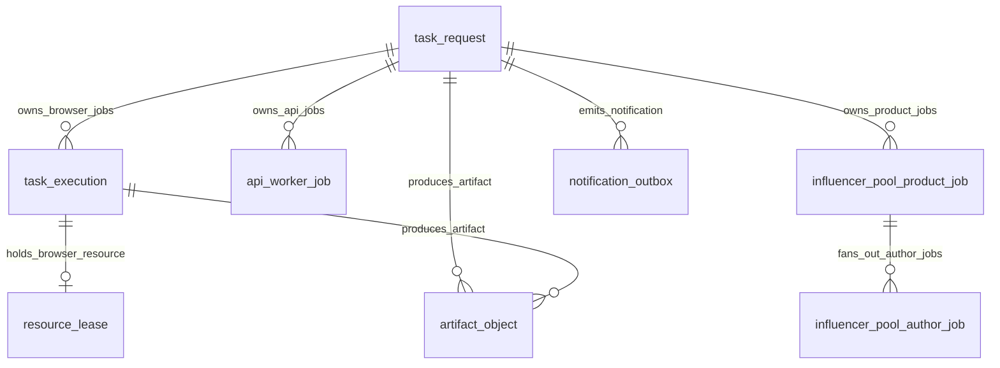
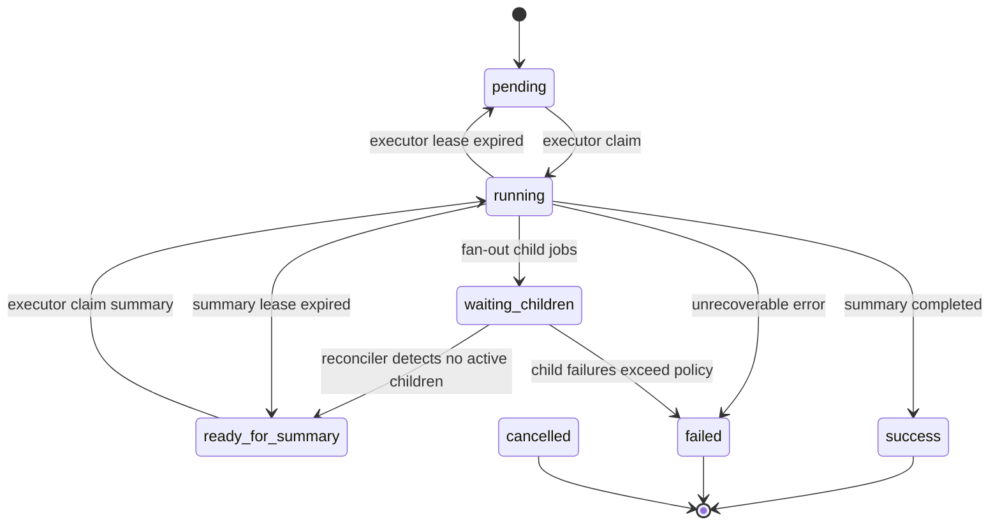
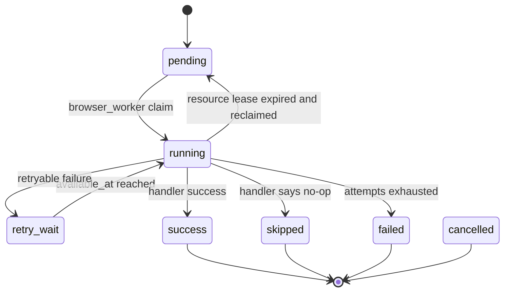
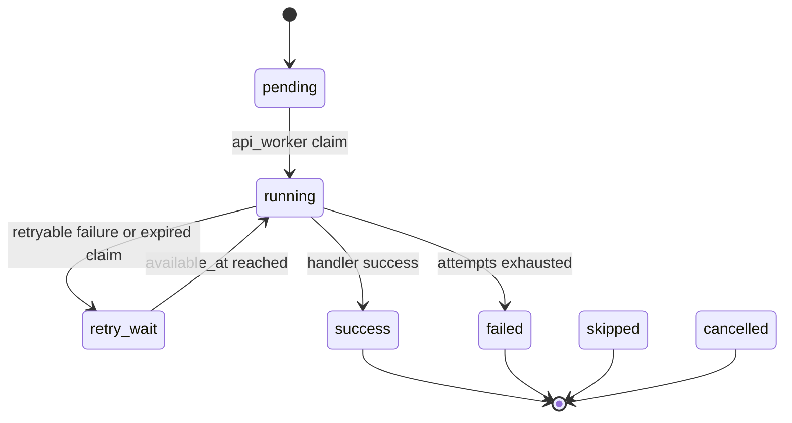
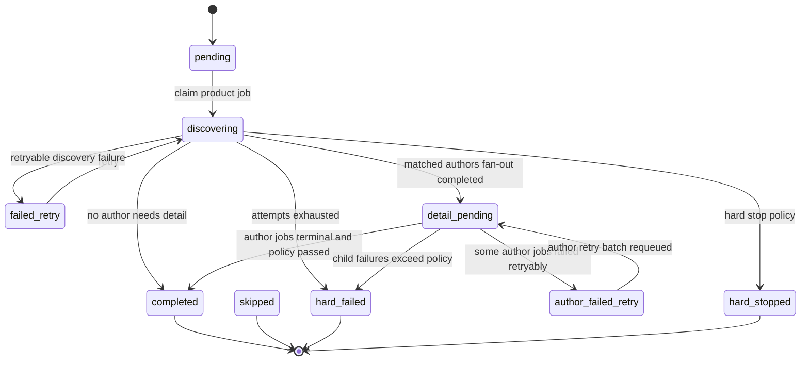
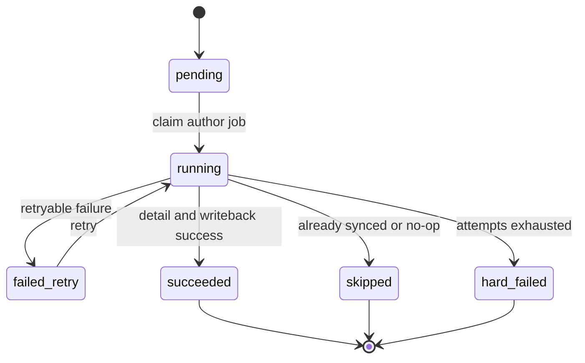
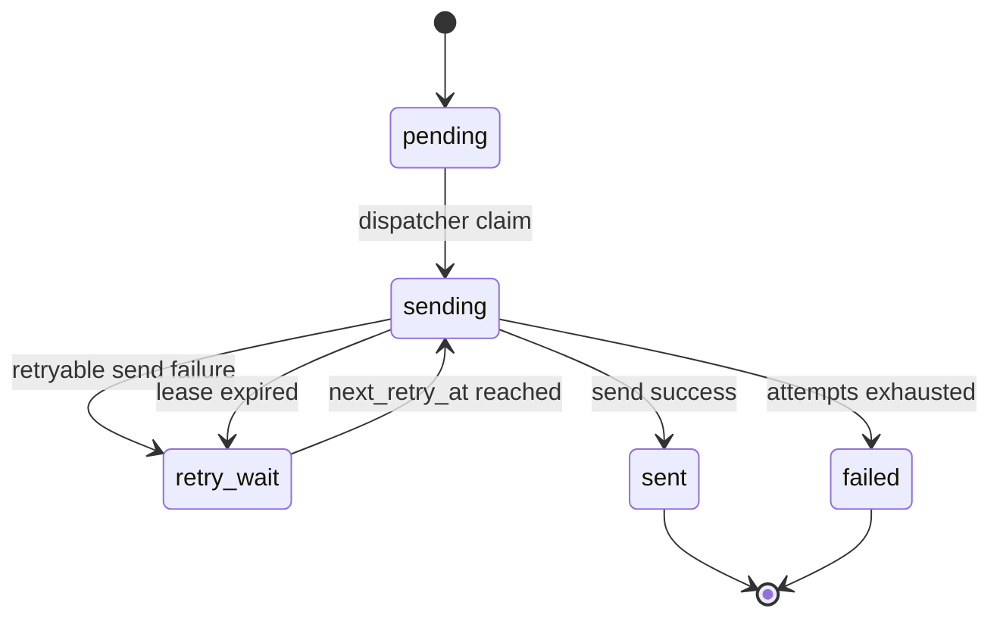

# Runtime DB Schema 设计

日期: 2026-04-23

## 1. 定位

Runtime DB 是系统的执行控制面，负责保存任务、队列、worker claim、lease、heartbeat、retry、outbox、artifact 索引等运行状态。

它不保存最终业务事实，不承担 TikTok / FastMoss / 飞书主体数据的主档职责。事实沉淀应进入 Fact DB，文件内容应进入 MinIO 或本地对象存储。

核心判断:

> Runtime DB 回答“任务怎么跑、跑到哪、谁在跑、是否可重试、是否需要兜底”；Fact DB 回答“采集到了什么事实”。

## 2. Runtime DB 总体关系



当前 Runtime DB 不是单一通用 job 表，而是“通用队列 + 领域队列”并存:

- `task_request`: 顶层 Task。
- `api_worker_job`: API/IO 类型通用 job 队列。
- `task_execution`: browser/CDP 类型执行队列。
- `influencer_pool_product_job`: 达人同步 workflow 中的商品级领域 job。
- `influencer_pool_author_job`: 达人同步 workflow 中的达人级领域 job。
- `notification_outbox`: 结果通知分发队列。
- `resource_lease`: 浏览器资源租约。
- `artifact_object`: 运行产物索引。
- `fastmoss_session_cookie_cache`: FastMoss cookie/session 运行缓存。

## 3. 表设计

### 3.1 `task_request`

顶层任务表，一条记录对应用户提交的一次 Task。

| 字段组 | 字段 | 说明 |
| --- | --- | --- |
| 身份 | `request_id` | 顶层任务 ID，主键 |
| 业务路由 | `project_code`, `skill_code`, `task_name`, `task_code`, `resource_code` | executor 根据这些字段选择 workflow |
| 来源 | `trigger_mode`, `source_channel_code`, `source_session_id`, `reply_target`, `requested_by` | 任务来源与回复目标 |
| 输入 | `payload_json`, `idempotency_key` | 任务输入与顶层幂等键 |
| 状态 | `status`, `current_stage`, `stage_cursor_json` | workflow 状态机和阶段游标 |
| 汇总 | `summary_json`, `result_json`, `error_text` | 最终摘要、结果和错误 |
| 子任务计数 | `child_total_count`, `child_terminal_count`, `child_success_count`, `child_failed_count`, `child_skipped_count` | Reconciler 判断父任务是否可收敛 |
| claim | `worker_id`, `lease_until`, `heartbeat_at` | executor 领取顶层任务时的租约 |
| 时间 | `created_at`, `updated_at`, `started_at`, `finished_at` | 生命周期时间 |

关键索引:

- `idx_task_request_status_created_at(status, created_at)`
- `idx_task_request_task_code_created_at(task_code, created_at)`
- `idx_task_request_status_lease_until(status, lease_until)`

### 3.2 `task_execution`

Browser worker 消费的执行队列。当前用于需要浏览器/CDP/Profile 资源的任务，例如单行竞品补全、关键词发现、TikTok browser fallback。

| 字段组 | 字段 | 说明 |
| --- | --- | --- |
| 身份 | `execution_id` | 执行 ID，主键 |
| 归属 | `request_id` | 所属顶层 Task |
| 路由 | `task_name`, `item_code`, `workflow_code`, `business_key`, `dedupe_key`, `resource_code` | worker 和 handler 路由字段 |
| 队列 | `status`, `queue_seq`, `available_at` | 可领取状态、顺序和重试可用时间 |
| 执行 | `worker_id`, `attempt_count`, `max_attempts`, `run_id` | 当前执行者、重试次数、执行实例 |
| 数据 | `payload_json`, `summary_json`, `result_json`, `error_text` | 输入、摘要、结果、错误 |
| 时间 | `created_at`, `updated_at`, `started_at`, `finished_at`, `heartbeat_at` | 生命周期时间 |

关键索引:

- `idx_task_execution_request_created_at(request_id, created_at)`
- `idx_task_execution_status_available_queue_seq(status, available_at, queue_seq)`
- `idx_task_execution_resource_status_available_queue_seq(resource_code, status, available_at, queue_seq)`

### 3.3 `api_worker_job`

API worker 消费的通用 job 队列。适合飞书 API 读取/写回、FastMoss API/HTTP、事实库写入、对象上传、fan-out/finalizer 等不依赖浏览器 profile 的任务。

| 字段组 | 字段 | 说明 |
| --- | --- | --- |
| 身份 | `job_id` | job ID，主键 |
| 归属 | `request_id`, `task_code` | 所属 Task 和业务类型 |
| 路由 | `job_code`, `business_key`, `dedupe_key`, `stage` | handler 路由、业务键、幂等键、阶段 |
| 队列 | `status`, `available_at` | 可领取状态和重试时间 |
| 执行 | `attempt_count`, `max_attempts`, `worker_id`, `lease_until`, `run_id` | 执行生命周期 |
| 数据 | `payload_json`, `summary_json`, `result_json`, `error_text` | 输入、摘要、结果、错误 |
| 时间 | `created_at`, `updated_at`, `started_at`, `finished_at`, `heartbeat_at` | 生命周期时间 |

关键索引:

- `idx_api_worker_job_status_available_created(status, available_at, created_at)`
- `idx_api_worker_job_request_created(request_id, created_at)`
- `idx_api_worker_job_job_code_status_available(job_code, status, available_at)`
- `idx_api_worker_job_dedupe_key(dedupe_key)`，仅 `dedupe_key <> ''` 时唯一。

### 3.4 `influencer_pool_product_job`

达人同步 workflow 的商品/竞品粒度领域 job。它不是新的物理 worker 类型，而是 API worker 可消费的一组领域 job。

| 字段组 | 字段 | 说明 |
| --- | --- | --- |
| 身份 | `job_id` | product job ID |
| 归属 | `request_id`, `source_record_id`, `product_id` | 所属 Task、飞书来源记录、商品 |
| 输入 | `source_record_json` | 竞品/商品来源行快照 |
| 状态 | `status`, `stage` | 商品级发现、等待达人、完成、失败 |
| 计数 | `matched_author_count`, `queued_author_job_count` | 匹配达人数量和派生 author job 数 |
| 执行 | `attempt_count`, `max_attempts`, `worker_id`, `lease_until`, `available_at`, `run_id` | claim/retry/lease 信息 |
| 错误 | `last_error_text`, `last_error_type`, `last_error_code`, `last_error_path` | 标准化错误 |
| 时间 | `created_at`, `updated_at`, `started_at`, `finished_at`, `heartbeat_at` | 生命周期时间 |

关键约束:

- `idx_influencer_pool_product_job_status(status, available_at)`
- 唯一键建议保持为 `(request_id, source_record_id, product_id)`，用于重复 fan-out 时去重。

### 3.5 `influencer_pool_author_job`

达人同步 workflow 的达人粒度领域 job。适合单个达人详情采集、事实入库、飞书达人表写回。

| 字段组 | 字段 | 说明 |
| --- | --- | --- |
| 身份 | `job_id` | author job ID |
| 归属 | `request_id`, `source_record_id`, `product_id` | 所属 Task、来源竞品记录、商品 |
| 达人键 | `influencer_id`, `uid` | 达人业务键 |
| 输入 | `sold_count`, `follower_count`, `holiday_name`, `source_images_json`, `author_row_json`, `force_refresh` | 采集和写回输入 |
| 输出 | `target_record_id`, `snapshot_id` | 飞书目标记录和事实快照 |
| 状态 | `status`, `stage` | 达人级运行状态 |
| 执行 | `attempt_count`, `max_attempts`, `worker_id`, `lease_until`, `available_at`, `run_id` | claim/retry/lease 信息 |
| 错误 | `last_error_text`, `last_error_type`, `last_error_code`, `last_error_path` | 标准化错误 |
| 时间 | `created_at`, `updated_at`, `started_at`, `finished_at`, `heartbeat_at` | 生命周期时间 |

关键索引:

- `idx_influencer_pool_author_job_product_status(product_id, status, available_at)`
- `idx_influencer_pool_author_job_source_status(source_record_id, status, available_at)`
- 唯一键建议保持为 `(request_id, source_record_id, product_id, influencer_id)`，用于重复 fan-out 时去重。

### 3.6 `resource_lease`

浏览器资源租约表。它保护 browser profile / CDP 资源，避免多个 browser worker 同时使用同一资源。

| 字段 | 说明 |
| --- | --- |
| `resource_code` | 资源编码，主键 |
| `execution_id` | 当前持有该资源的 browser execution |
| `request_id` | 所属 Task |
| `worker_id` | 持有者 |
| `status` | 租约状态 |
| `lease_until`, `heartbeat_at` | 过期和心跳时间 |
| `created_at`, `updated_at` | 时间戳 |

关键索引:

- `idx_resource_lease_lease_until(lease_until)`

### 3.7 `notification_outbox`

结果通知分发队列。业务完成和通知发送解耦，避免通知失败反向污染主流程完成状态。

| 字段组 | 字段 | 说明 |
| --- | --- | --- |
| 身份 | `outbox_id` | outbox ID |
| 路由 | `channel_code`, `event_type`, `ref_type`, `ref_id`, `reply_target` | 通知渠道、事件和引用对象 |
| 幂等 | `dedupe_key` | 同一通知事件去重 |
| 队列 | `status`, `retry_count`, `max_retry_count`, `next_retry_at` | 分发状态和重试计划 |
| 执行 | `worker_id`, `lease_until`, `heartbeat_at` | dispatcher claim 信息 |
| 数据 | `payload_json`, `last_error_text` | 通知内容和错误 |
| 时间 | `sent_at`, `created_at`, `updated_at` | 发送和更新时间 |

关键索引:

- `idx_notification_outbox_dedupe_key(dedupe_key)`，仅 `dedupe_key <> ''` 时唯一。
- `idx_notification_outbox_status_next_retry_at(status, next_retry_at)`
- `idx_notification_outbox_ref_type_ref_id(ref_type, ref_id)`
- `idx_notification_outbox_status_lease_until(status, lease_until)`

### 3.8 `artifact_object`

运行产物索引表。大文件内容不放数据库，放 MinIO 或本地对象存储。

| 字段 | 说明 |
| --- | --- |
| `artifact_id` | artifact ID |
| `request_id`, `execution_id`, `run_id`, `step_id` | 归属和执行上下文 |
| `kind` | artifact 类型，例如 screenshot、stdout、state、media |
| `bucket`, `object_key`, `etag`, `size`, `content_type` | 对象存储定位和元信息 |
| `source_path` | 本地来源路径 |
| `metadata_json` | 扩展元数据 |
| `created_at` | 创建时间 |

关键索引:

- `idx_artifact_object_run_id(run_id)`

### 3.9 `fastmoss_session_cookie_cache`

FastMoss 登录态运行缓存。它是可再生缓存，不属于事实库。

| 字段 | 说明 |
| --- | --- |
| `cache_key` | cache 主键 |
| `namespace`, `account_key`, `base_url`, `region` | 账号和站点维度 |
| `cookies_json`, `cookie_count`, `has_fd_tk`, `fd_tk_digest` | cookie 内容和摘要 |
| `expires_at`, `last_auth_failed_at`, `last_login_at` | 过期、认证失败、登录时间 |
| `created_at`, `updated_at` | 时间戳 |

关键索引:

- `idx_fastmoss_session_cookie_cache_account(namespace, account_key, region)`
- `idx_fastmoss_session_cookie_cache_expires(expires_at)`

## 4. 统一生命周期字段

所有可执行 job 表应尽量统一这些字段。

| 字段 | 当前情况 | 作用 |
| --- | --- | --- |
| `status` | 已有 | 当前状态 |
| `attempt_count` | 已有 | 已尝试次数 |
| `max_attempts` | 已有 | 最大尝试次数 |
| `worker_id` | 已有 | 当前领取者 |
| `lease_until` | 多数已有 | worker 崩溃或失联后的回收依据 |
| `heartbeat_at` | 已有 | worker/supervisor 活跃时间 |
| `started_at` | 已有 | 本次执行开始 |
| `finished_at` | 已有 | 本次执行结束 |
| `available_at` / `next_retry_at` | 已有 | 重试延迟和下次可执行时间 |
| `run_id` | 多数已有 | 单次执行实例 |
| `error_text` / `last_error_text` | 已有 | 错误文本 |
| `last_error_type`, `last_error_code`, `last_error_path` | 领域 job 已有 | 标准化错误分类 |
| `last_progress_at` | 建议补齐 | 业务真实进展时间 |
| `progress_stage` | 建议补齐 | 业务真实进展阶段 |
| `max_execution_seconds` | 建议补齐 | 单次执行硬超时 |
| `dead_letter_reason` | 建议补齐 | 最终不可恢复原因 |

其中 `heartbeat_at` 和 `last_progress_at` 必须分开理解:

- `heartbeat_at`: worker 或 supervisor 还活着。
- `last_progress_at`: 业务动作有推进。

一个任务可以持续 heartbeat，但业务一直没有 progress，这种情况应由 Watchdog Scanner 兜底。

## 5. 状态机设计

### 5.1 `task_request` 状态机



当前主要状态:

| 状态 | 含义 |
| --- | --- |
| `pending` | 等待 executor 推进 |
| `running` | executor 正在推进 |
| `waiting_children` | 已派生子 job，等待子任务完成 |
| `ready_for_summary` | 子任务已收敛，等待 executor 生成总结 |
| `success` | 顶层任务成功 |
| `failed` | 顶层任务失败 |
| `cancelled` | 顶层任务取消，当前需要补齐完整取消链路 |

### 5.2 `task_execution` 状态机



当前 `task_execution` 适合承载 browser worker 最小执行单元。失败重试时应保证外部副作用具备幂等保护。

### 5.3 `api_worker_job` 状态机



当前 claim 过期后会通过 requeue 逻辑进入 `retry_wait` 或 `failed`。后续建议把 `error_type` 记录为 `lease_expired`。

### 5.4 `influencer_pool_product_job` 状态机



状态含义:

| 状态 | 含义 |
| --- | --- |
| `pending` | 等待处理商品/竞品 |
| `discovering` | 正在获取商品关联达人并派生 author jobs |
| `failed_retry` | 商品发现阶段失败，等待重试 |
| `detail_pending` | 商品发现完成，等待 author jobs 收敛 |
| `author_failed_retry` | author jobs 存在可重试失败，等待重排 |
| `completed` | 商品级流程完成 |
| `skipped` | 已跳过 |
| `hard_failed` | 不可恢复失败 |
| `hard_stopped` | 命中硬停止策略 |

### 5.5 `influencer_pool_author_job` 状态机



状态含义:

| 状态 | 含义 |
| --- | --- |
| `pending` | 等待采集达人详情 |
| `running` | 正在执行达人详情采集/写回 |
| `failed_retry` | 可重试失败 |
| `succeeded` | 成功 |
| `skipped` | 跳过，例如已同步 |
| `hard_failed` | 不可恢复失败 |

### 5.6 `notification_outbox` 状态机



Outbox 的终态不应反向修改业务 Task 的成功/失败状态。业务完成和消息分发应保持解耦。

## 6. Claim / Lease / Retry 规则

### 6.1 Claim

worker claim job 时必须满足:

- `status` 在可执行集合内。
- `available_at <= now` 或 `next_retry_at <= now`。
- 如果涉及资源，必须拿到 `resource_lease`。
- 更新 `status = running` 或 `sending`。
- 写入 `worker_id`、`lease_until`、`started_at`、`heartbeat_at`、`run_id`。

### 6.2 Heartbeat

worker 或 supervisor 执行期间需要续约:

- 更新 `heartbeat_at`。
- 延长 `lease_until`。
- 只对当前 `worker_id` 且 `status = running/sending` 的记录生效。

### 6.3 Retry

handler 抛出可重试异常或外部调用失败时:

- `attempt_count += 1` 或 `retry_count += 1`。
- 如果未超过最大次数，进入 `retry_wait` / `failed_retry`。
- 设置 `available_at` / `next_retry_at`。
- 清理 `worker_id`、`lease_until`。
- 写入标准化错误。

如果次数耗尽:

- 通用 job 进入 `failed`。
- 达人领域 job 进入 `hard_failed` 或 `hard_stopped`。
- outbox 进入 `failed`。

### 6.4 Lease 过期

当前代码已有对部分 running claim 的回收:

- `task_request`: executor claim 过期后回到 `pending` 或 `ready_for_summary`。
- `api_worker_job`: running 过期后进入 `retry_wait` 或 `failed`。
- `task_execution` + `resource_lease`: 浏览器资源过期后释放租约，execution 回到可执行状态。
- `notification_outbox`: sending 过期后进入 `retry_wait` 或 `failed`。
- influencer pool product/author job: 当前在 claim 路径里已有过期运行记录的懒回收逻辑，Watchdog 需要补齐独立扫描、硬超时、无进展判断和统一错误分类。

推荐补齐:

- 所有 job 表统一 `error_type = lease_expired`。
- lease 过期是否消耗 attempt 要有统一策略。
- 对 browser job，资源 lease 释放和 job retry 状态应在同一个事务中完成。

## 7. 父子任务收敛

父任务进入 `waiting_children` 后，不能依赖进程内 callback 等子任务结束。Reconciler 必须从 Runtime DB 聚合子任务状态。

当前 `task_request` 已有子任务计数字段:

- `child_total_count`
- `child_terminal_count`
- `child_success_count`
- `child_failed_count`
- `child_skipped_count`

推荐收敛规则:

```text
active_count = pending + running + retry_wait + failed_retry + discovering + detail_pending + author_failed_retry

if active_count > 0:
  task_request.status = waiting_children
else:
  task_request.status = ready_for_summary
```

需要注意:

- 不同 job 表的终态命名不同，Reconciler 需要统一映射。
- `skipped` 对父任务通常计入成功完成，但需要在 summary 中单独展示。
- `hard_failed` / `hard_stopped` 应进入 failed count，并影响最终策略。
- 父任务从 `waiting_children` 到 `ready_for_summary` 的更新应幂等。

## 8. 幂等与去重

Runtime DB 的幂等分两层:

| 层 | 字段 | 规则 |
| --- | --- | --- |
| 顶层 Task | `idempotency_key` | 防止同一来源重复创建同一顶层请求 |
| API job | `dedupe_key` | 防止重复派生同一个 API/IO job |
| Browser job | `dedupe_key`, `business_key`, `resource_code` | 防止重复派生同一个浏览器执行单元 |
| Product job | `(request_id, source_record_id, product_id)` | 同一任务下同一竞品/商品只生成一个 product job |
| Author job | `(request_id, source_record_id, product_id, influencer_id)` | 同一任务下同一商品的同一达人只生成一个 author job |
| Outbox | `dedupe_key` | 同一通知事件只发送一次 |

幂等不是只靠 Runtime DB。凡是 job 内部有外部副作用，还需要外部系统写入幂等:

- 飞书写回需要基于 `record_id`、业务唯一键或目标表去重。
- Fact DB 写入需要使用业务唯一键和 upsert。
- MinIO/object store 写入需要稳定 `object_key` 或写入后可重复覆盖。

## 9. Watchdog Scanner 应补齐的 Runtime 能力

当前 Runtime DB 已经有 lease、heartbeat、retry 的基础字段，但应用层兜底还需要 Watchdog Scanner 将“不可恢复或无响应”的状态显式处理掉。

Watchdog 每轮扫描:

```text
1. running/sending 且 lease_until < now
2. running 且 started_at + max_execution_seconds < now
3. running 且 last_progress_at 长时间不更新
4. waiting_children 但所有子任务已终态
5. retry_wait/failed_retry 超过最大等待策略
6. outbox sending 卡住
```

处理动作:

| 场景 | 动作 |
| --- | --- |
| worker 崩溃，lease 过期 | 标记 `lease_expired`，进入 retry 或 failed |
| handler 卡死但进程还活着 | 标记 `stale_progress`，必要时 kill child process |
| 单次执行超过硬超时 | 标记 `timeout`，进入 retry 或 failed |
| 子任务已终态但父任务未收敛 | 幂等推进父任务到 `ready_for_summary` |
| outbox sending 卡住 | 进入 `retry_wait` 或 `failed` |
| attempts 耗尽 | 进入 dead letter / hard_failed，并记录原因 |

推荐新增字段:

| 表 | 字段 |
| --- | --- |
| `task_execution`, `api_worker_job`, `influencer_pool_product_job`, `influencer_pool_author_job`, `notification_outbox` | `last_progress_at`, `progress_stage`, `max_execution_seconds`, `dead_letter_reason` |
| 通用 job 表 | `error_type`, `error_code`, `error_path` |
| `task_request` | `last_progress_at`, `progress_stage`, `cancel_requested_at` |

## 10. 演进建议

第一阶段:

- 保持现有表，不强行合并成单一 job 表。
- 文档和代码口径统一: product/author 是领域 job，不是新的 worker 层。
- 将所有状态枚举集中定义，避免散落字符串。

第二阶段:

- 实现 Watchdog Scanner。
- 为 influencer pool product/author job 补齐 lease 过期回收。
- 为所有 job 统一记录 `error_type`。

第三阶段:

- 引入标准 Execution Supervisor。
- handler 放入 child process 或可取消 runner。
- supervisor 负责 heartbeat、progress、hard timeout、kill、retry 分类。

第四阶段:

- 根据运行数据决定是否抽象统一 `runtime_job` 表。
- 如果领域 job 越来越多，可保留领域表作为扩展表，通用生命周期放入统一 job 表。
