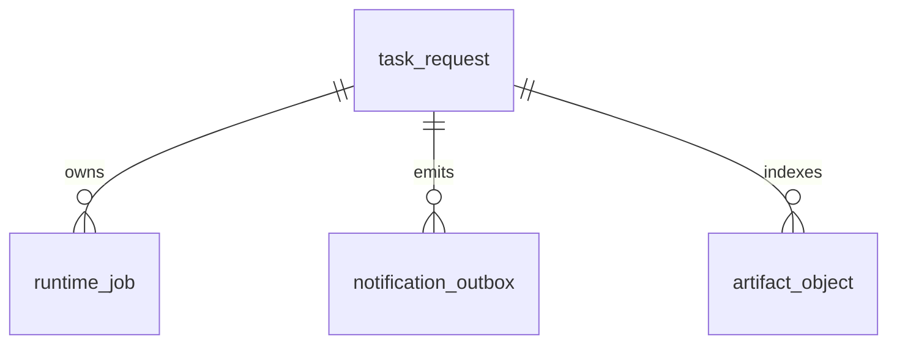

# Runtime Task Request 表设计

日期: 2026-05-12

状态: 设计草案，待后续 migration / schema 实现。本文只定义 `task_request`
顶层任务表的目标设计，不代表当前生产库已经完成迁移。

## 1. 定位

`task_request` 是 Runtime DB 中的顶层业务请求表。一条记录代表用户、Skill、
CLI 或控制面提交的一次顶层 Task。

本表只回答三类问题:

- 这个 request 要走哪个业务流程。
- 这个 request 当前生命周期和 workflow stage 走到哪里。
- 这个 request 最终聚合摘要是什么。

本表不保存具体 worker/job 的执行细节、重试明细、错误堆栈或 artifact 明细。
这些信息应由后续 worker/job 表、outbox 表和 artifact 表承接。

## 2. 字段

| 字段 | 必须 | 说明 |
| --- | --- | --- |
| `request_id` | 是 | 顶层任务 ID，主键。 |
| `task_code` | 是 | 当前 request 对应的业务流程编码，例如 `sync_tk_influencer_pool`。 |
| `payload_json` | 是 | 提交时的原始业务输入。不得保存数据库连接串、access key、secret 等运行密钥。 |
| `status` | 是 | 顶层 request 生命周期状态，只表达能否被推进、是否等待、是否结束。 |
| `current_stage` | 是 | 当前 workflow stage，用于恢复、观测和 watchdog 判断流程是否推进。 |
| `result_json` | 是 | 顶层聚合摘要，包括最终 outcome、统计信息、失败摘要和关键 result 引用。 |
| `created_at` | 是 | request 创建时间。 |
| `updated_at` | 是 | request 最近一次生命周期、stage 或聚合摘要更新时间。 |
| `started_at` | 否 | request 首次开始执行时间。未开始时为空。 |
| `finished_at` | 否 | request 生命周期结束时间。未结束时为空。 |

## 3. 状态语义

`status` 只表示生命周期，不表示业务成功或失败。

| status | 含义 |
| --- | --- |
| `pending` | 等待 executor 推进当前 `current_stage`。 |
| `running` | executor 正在推进当前 `current_stage`。 |
| `waiting` | 顶层 request 正在等待 child job、browser job 或外部可观测事件收敛。 |
| `finished` | 顶层 request 生命周期已经结束。业务 outcome 从 `result_json` 读取。 |
| `cancelled` | 顶层 request 已取消。取消摘要写入 `result_json`。 |

禁止把 `success`、`failed`、`partial_success`、`skipped` 写入
`task_request.status`。这些是业务 outcome，不是生命周期。

## 4. Stage 语义

`current_stage` 表达 workflow 当前推进位置。它必须是稳定、可恢复的 stage code，
不能使用只对代码局部有意义的临时描述。

示例:

```text
submitted
scan_source_rows
dispatch_row_jobs
waiting_children
ready_for_summary
write_outbox
finalized
```

每次推进 `current_stage` 时必须同时更新 `updated_at`。Watchdog 可以通过
`status`、`current_stage`、`updated_at` 和 child job 状态判断顶层流程是否长时间未推进。

## 5. Result JSON

`result_json` 是面向查询和通知的顶层聚合摘要。具体 worker/job 的详细结果仍由
worker/job 表保存，`task_request.result_json` 只保存可读摘要和必要引用。

建议结构:

```json
{
  "outcome": "success | partial_success | failed | skipped | cancelled",
  "summary": {},
  "counts": {
    "total": 0,
    "success": 0,
    "failed": 0,
    "skipped": 0
  },
  "failure_summary": {
    "failed_count": 0,
    "samples": []
  },
  "references": {
    "jobs": [],
    "artifacts": [],
    "outbox": []
  }
}
```

`outcome` 是业务聚合结果，但它不参与 Runtime claim。Runtime claim 只看
`status` 和 worker/job 表状态。

## 6. 明确不放入本表的字段

以下字段不属于 `task_request` 的最小目标设计:

| 字段 | 原因 |
| --- | --- |
| `result_status` | 顶层业务结果由 `result_json.outcome` 表达，避免额外状态字段与 summary 不一致。 |
| `error_text` | 具体错误由 worker/job 表承接；顶层只在 `result_json.failure_summary` 中保存聚合摘要。 |
| `worker_id` | 具体执行者属于 worker/job claim 事实；顶层 request 不绑定单个 worker。 |
| `lease_until` | lease 属于可 claim 的具体 worker/job；顶层 request 只保存流程位置。 |
| `heartbeat_at` | 心跳属于 worker/job 或 supervisor 运行事实；顶层 watchdog 通过 `updated_at` 和 child job 状态观测推进。 |

如果后续确认 executor 需要并发 claim 顶层 `task_request`，再单独评估是否增加
顶层 claim 字段；不能把 worker/job 的运行事实提前塞回 task 表。

## 7. 表关系

目标关系:



关系原则:

- `runtime_job.request_id` 关联 `task_request.request_id`。
- `notification_outbox.request_id` 关联 `task_request.request_id`。
- `artifact_object.request_id` 关联 `task_request.request_id`。
- `task_request` 不直接保存 worker/job 明细，只保存顶层聚合摘要。

## 8. Watchdog 口径

Watchdog 可以使用内存缓存加速观测，但必须能够从 Runtime DB 重建判断依据。

对 `task_request` 的最小判断依据:

- `status` 是否处于 `running` 或 `waiting`。
- `current_stage` 当前停留在哪一步。
- `updated_at` 距当前时间是否超过该 stage 的允许窗口。
- 对应 worker/job 表是否仍有正常 heartbeat、未终态 job 或可重试 job。

当 task 长时间未推进时，Watchdog 不直接从 task 表推断具体错误原因，而是结合
worker/job 表决定 retry、fail、repair 或重新推进 stage。
