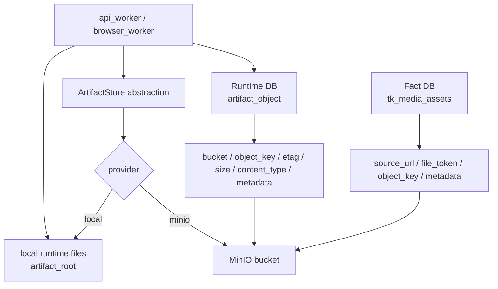
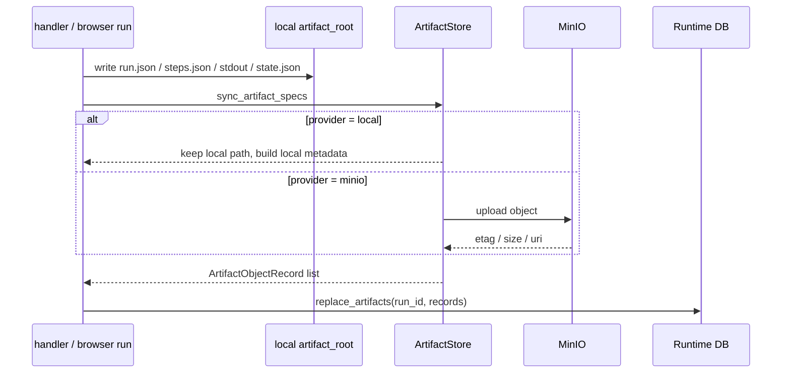
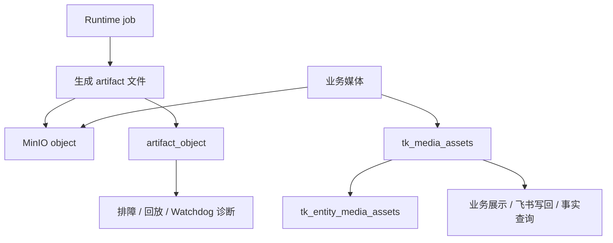

# Storage 架构设计

日期: 2026-04-23

## 1. 定位

Storage 层负责保存数据库不适合直接承载的大对象，包括运行产物、截图、stdout、state dump、下载文件、商品媒体、原始 HTML/JSON 等。

当前系统支持两种模式:

| 模式 | 说明 |
| --- | --- |
| `local` | 对象保留在本地 `artifact_root`，`artifact_object` 记录本地 object key 和 source path |
| `minio` | 对象上传到 MinIO，`artifact_object` 记录 bucket、object_key、etag、size、content_type、metadata |

核心原则:

> Runtime DB 保存对象索引和运行状态，MinIO 保存对象内容；任务是否完成不能依赖 MinIO，artifact 是否可追溯必须依赖 `artifact_object`。

## 2. 当前代码约定

当前配置来自 execution control defaults:

| 配置 | 默认值 | 说明 |
| --- | --- | --- |
| `artifact_store_provider` | `local` | `local` 或 `minio` |
| `artifact_root` | `runtime/execution_control/object_store` | local 模式下的本地根目录 |
| `artifact_bucket` | `local-runtime` | 对象 bucket，MinIO 模式下是真实 bucket |
| `artifact_object_prefix` | 空 | 对象 key 前缀，会拼到 runtime artifact 和 product media 前面 |
| `minio_endpoint` | 空 | MinIO endpoint |
| `minio_access_key` | 空 | MinIO access key |
| `minio_secret_key` | 空 | MinIO secret key |
| `minio_region` | 空 | MinIO region |
| `minio_secure` | `false` | 是否使用 HTTPS |
| `minio_create_bucket` | `false` | 是否允许程序自动创建 bucket |
| `sync_referenced_files` | `false` | 是否同步 result payload 中引用到的本地文件 |

当前对象 key 生成规则:

| 类型 | key 规则 |
| --- | --- |
| runtime artifact | `<artifact_object_prefix>/runs/<run_id>/<relative_name>` |
| run json | `<prefix>/runs/<run_id>/run.json` |
| steps json | `<prefix>/runs/<run_id>/steps.json` |
| signals json | `<prefix>/runs/<run_id>/signals.json` |
| stdout log | `<prefix>/runs/<run_id>/stdout.log` |
| state dump | `<prefix>/runs/<run_id>/artifacts/<step_id>/state.json` |
| referenced file | `<prefix>/runs/<run_id>/referenced/<kind>/<filename>` |
| product media | `<prefix>/product-media/<product_id>/<media_role>-<digest>-<filename>` |

如果 `artifact_object_prefix` 为空，key 直接从 `runs/...` 或 `product-media/...` 开始。

## 3. 物理架构



边界:

- `artifact_object` 是运行产物索引，归属于 `request_id`、`execution_id`、`run_id`、`step_id`。
- `tk_media_assets` 是业务媒体资产索引，归属于商品、达人、视频等事实主体。
- MinIO 不保存任务状态，不承担队列、重试、锁、heartbeat。
- 本地 `artifact_root` 是生成和缓存位置，生产环境最终应以 MinIO 为长期存储。

## 4. Bucket 设计

### 4.1 当前兼容方案

当前代码通过单个 `artifact_bucket` 写 runtime artifact 和 product media。因此最小改造的生产方案是:

```text
bucket: mujitask-artifacts
artifact_object_prefix: <env>
```

示例:

```text
mujitask-artifacts/
  prod/runs/<run_id>/run.json
  prod/runs/<run_id>/steps.json
  prod/runs/<run_id>/signals.json
  prod/runs/<run_id>/stdout.log
  prod/runs/<run_id>/artifacts/<step_id>/state.json
  prod/runs/<run_id>/referenced/<kind>/<filename>
  prod/product-media/<product_id>/<media_role>-<digest>-<filename>
```

这种方案和当前 `artifact_bucket + artifact_object_prefix` 完全兼容。

### 4.2 生产推荐方案

当对象规模变大后，建议按生命周期拆 bucket:

| Bucket | 内容 | 生命周期特点 |
| --- | --- | --- |
| `mujitask-runtime-artifacts` | run.json、steps.json、signals.json、stdout、state dump、截图、HTML、referenced files | 运行排障产物，可按时间清理 |
| `mujitask-media-assets` | 商品图片、达人头像、视频封面、飞书可复用媒体 | 业务资产，保留更久 |
| `mujitask-raw-captures` | 原始 API 响应、原始 HTML、页面快照 | 审计和回放证据，可冷热分层 |
| `mujitask-temp` | 临时下载、转换中间文件 | 短生命周期 |

当前代码要完全支持多 bucket，需要在 media upload 和 artifact sync 里引入 category-specific bucket 配置。短期建议先使用单 bucket + prefix，等产物规模稳定后再拆 bucket。

## 5. Object Prefix 规范

### 5.1 Prefix 总原则

Object key 必须满足:

- 稳定可重复。
- 可按环境隔离。
- 可按对象类型扫描。
- 可从 key 看出基本归属。
- 不包含敏感信息。
- 不直接使用外部 URL 原文作为路径。

推荐全局 prefix:

```text
<env>/<category>/...
```

但由于当前代码已经内置 `runs/...` 和 `product-media/...`，现阶段建议将 `artifact_object_prefix` 配置为环境或租户级前缀:

```text
prod
staging
dev/<developer-name>
```

不要把当前 `artifact_object_prefix` 配成 `prod/runtime`，否则商品媒体会变成 `prod/runtime/product-media/...`，语义会混在一起。

### 5.2 Runtime Artifact Prefix

当前兼容格式:

```text
<env>/runs/<run_id>/run.json
<env>/runs/<run_id>/steps.json
<env>/runs/<run_id>/signals.json
<env>/runs/<run_id>/stdout.log
<env>/runs/<run_id>/artifacts/<step_id>/state.json
<env>/runs/<run_id>/referenced/<kind>/<filename>
```

推荐后续演进格式:

```text
<env>/runtime/runs/<yyyy>/<mm>/<dd>/<run_id>/run.json
<env>/runtime/runs/<yyyy>/<mm>/<dd>/<run_id>/steps.json
<env>/runtime/runs/<yyyy>/<mm>/<dd>/<run_id>/signals.json
<env>/runtime/runs/<yyyy>/<mm>/<dd>/<run_id>/stdout.log
<env>/runtime/runs/<yyyy>/<mm>/<dd>/<run_id>/artifacts/<step_id>/state.json
<env>/runtime/runs/<yyyy>/<mm>/<dd>/<run_id>/artifacts/<step_id>/screenshot.png
<env>/runtime/runs/<yyyy>/<mm>/<dd>/<run_id>/referenced/<kind>/<sha1>-<filename>
```

是否加日期分区取决于对象规模。当前 `artifact_object` 已可按 `run_id` 查询，MinIO lifecycle 本身可以按 prefix 做清理；对象很多时再引入日期分区更合理。

### 5.3 Product Media Prefix

当前兼容格式:

```text
<env>/product-media/<product_id>/<media_role>-<digest>-<filename>
```

示例:

```text
prod/product-media/1729384756/product_main_image-a1b2c3d4e5f6a7b8-cover.jpg
```

推荐后续演进格式:

```text
<env>/media/product/<product_id>/<media_role>/<sha1>-<filename>
<env>/media/creator/<creator_key>/<media_role>/<sha1>-<filename>
<env>/media/video/<video_key>/<media_role>/<sha1>-<filename>
```

媒体 key 的稳定身份优先级:

1. 外部 source URL 的规范化 digest。
2. 平台 file token。
3. MinIO object key。
4. 本地文件 sha256。

不要使用原始 URL 直接作为 object key。

### 5.4 Raw Capture Prefix

当前 raw response 主要落在 Fact DB 的 `tk_raw_api_responses`。如果后续 payload 变大，建议迁移大 payload 到对象存储:

```text
<env>/raw/<source_platform>/<source_endpoint>/<yyyy>/<mm>/<dd>/<raw_response_id>.json
<env>/raw-html/<source>/<yyyy>/<mm>/<dd>/<capture_id>.html
<env>/raw-screenshot/<source>/<yyyy>/<mm>/<dd>/<capture_id>.png
```

Fact DB 保留:

- `raw_response_id`
- `source_platform`
- `source_endpoint`
- `request_id`
- `execution_id`
- `run_id`
- `payload_digest`
- `bucket`
- `object_key`

### 5.5 Amazon 商品详情 Prefix

Amazon 商品详情首期复用当前配置的 `artifact_bucket`，不新建专用 bucket，也不允许生产
browser/API job 在运行路径中创建 bucket。平台与对象类型通过受控 prefix 隔离:

| 内容 | Object key |
| --- | --- |
| Runtime 证据 | `<env>/runs/<run_id>/amazon/<asin>/<kind>.<ext>` |
| 标准化 capture | `<env>/raw-captures/amazon/us/<asin>/<yyyy>/<mm>/<dd>/<run_id>/<sha256>/normalized.json` |
| sanitized HTML | `<env>/raw-captures/amazon/us/<asin>/<yyyy>/<mm>/<dd>/<run_id>/<sha256>/page.html.gz` |
| allowlisted page data | `<env>/raw-captures/amazon/us/<asin>/<yyyy>/<mm>/<dd>/<run_id>/<sha256>/page-data.json` |
| screenshot | `<env>/raw-captures/amazon/us/<asin>/<yyyy>/<mm>/<dd>/<run_id>/<sha256>/page.png` |
| 商品媒体 | `<env>/product-media/amazon/us/<asin>/<media_role>/<sha256>.<ext>` |

Amazon raw ref 必须绑定当前 request、同一来源 Browser execution 和 run；Fact 写入前读取
实际对象字节复算 SHA-256。`page.html.gz` 还要解压为 UTF-8 并重新执行脱敏校验。Amazon
商品图片源只接受 `media-amazon.com` / `ssl-images-amazon.com` 的 HTTPS 地址，去除 query
和 fragment 后才能进入媒体物化流程。

索引归属保持分层:

- `artifact_object` 只记录运行证据和 raw capture 的 Runtime 索引。
- `amazon_raw_captures` 记录 raw capture 的事实索引和 digest；HTML、JSON、截图 body
  不进入 Runtime DB 或 Fact DB。
- `amazon_media_assets` 与 `amazon_product_media_assets` 记录长期业务媒体及商品关系。
- Amazon 首期不修改 Runtime DB schema；Fact DB 使用独立 `amazon_*` 表，不复用
  `tk_media_assets` 或 `tk_raw_api_responses`。

Raw capture 使用实际存储字节的 SHA-256 内容寻址。相同内容重试复用同一 coordinate；
内容变化写入新 coordinate，不能覆盖旧证据。Fact 写入还会拒绝同一 run 的 divergent
normalized capture，以及同一 `(bucket, object_key)` 的 digest 或归属冲突。

对象 key 只包含环境、运行标识、美国站 ASIN、日期和受控文件名，不包含 URL query、
cookie、用户信息、浏览器 profile id 或飞书账号信息。只有需要独立 IAM、地域、合规保留
或成本核算时，才通过新的 Storage contract 与 migration 拆分 Amazon bucket。

## 6. Artifact 生命周期

### 6.1 生成流程



当前关键点:

- artifact 文件先在本地生成。
- MinIO 模式上传后，`artifact_object` 保存远端 bucket/object_key。
- local 模式下，`artifact_object.object_key` 仍然使用 `runs/<run_id>/...`，`source_path` 指向本地绝对路径。
- `replace_artifacts(run_id, records)` 表示同一个 run 的 artifact 索引可以幂等重建。

### 6.2 Artifact 状态

当前 `artifact_object` 没有独立状态字段。建议从架构上定义逻辑状态:

| 状态 | 含义 | 当前承载方式 |
| --- | --- | --- |
| `created_local` | 本地文件已生成 | `source_path` 存在 |
| `uploaded` | 已上传 MinIO | `bucket` + `object_key` + `metadata.remote_uri` |
| `indexed` | 已写入 Runtime DB | `artifact_object` 记录存在 |
| `expired` | 对象已被生命周期清理 | 当前缺字段，建议后续增加 |
| `missing` | 索引存在但对象不可读 | 当前靠排障发现，建议巡检补齐 |

建议后续给 `artifact_object` 增加:

- `storage_status`
- `expires_at`
- `deleted_at`
- `retention_policy`
- `object_digest`

### 6.3 Retention 策略

建议按对象类型设置生命周期:

| 类型 | 建议保留 | 说明 |
| --- | --- | --- |
| `run_json`, `steps_json`, `signals_json` | 180 天 | 体积小，排障价值高 |
| `stdout_log` | 90 天 | 可能包含大量日志，需要控制体积 |
| `state_json` | 90 天 | 排障核心证据，但可能含业务字段 |
| screenshot / html snapshot | 30-90 天 | 体积大，主要用于短期排障 |
| referenced downloads | 30-90 天 | 视业务复用价值决定 |
| product media | 365 天或业务存续期 | 业务资产，不应跟 runtime 一起短期删除 |
| raw API response | 180-365 天 | 审计/回放价值高，可归档到冷层 |
| Amazon normalized capture | 365 天 | 标准化事实回放依据 |
| Amazon 成功 HTML / page data | 90 天 | sanitized / allowlisted 页面证据 |
| Amazon blocked/失败 HTML / page data / screenshot | 180 天 | 排障与合规审计证据 |
| Amazon 商品媒体 | 365 天或业务存续期 | 业务资产，独立于 Runtime 清理 |
| temp files | 1-7 天 | 可随时重建 |

具体生产建议:

- Runtime artifacts 默认 90 天。
- 失败任务 artifacts 默认 180 天。
- 成功任务的大文件 artifacts 默认 30 天。
- 业务媒体 assets 默认 365 天起。
- 原始 raw captures 默认 180 天，超过后转冷存储或只保留 digest。

### 6.4 清理原则

对象清理必须分两层:

| 层 | 动作 |
| --- | --- |
| MinIO lifecycle | 根据 bucket/prefix/tag 删除或转冷 |
| Runtime DB cleanup | 更新或清理 `artifact_object` 索引 |

不要只删 MinIO 对象而完全不处理 DB，否则会产生悬挂索引。也不要只删 DB 索引而保留大量对象，否则会产生不可追踪存储成本。

建议清理流程:

```text
1. 根据 retention policy 找到过期 artifact_object
2. 删除或归档 MinIO object
3. 将 artifact_object 标记 deleted/expired，或移动到归档表
4. 定期巡检 bucket/object_key 是否还能访问
```

当前 schema 没有 `storage_status` / `expires_at` / `deleted_at`，短期可以先依赖 MinIO lifecycle；中期应补字段，让 DB 侧能表达对象生命周期。

## 7. Metadata 和索引规范

MinIO object metadata 建议包含:

| Metadata | 说明 |
| --- | --- |
| `request_id` | 顶层任务 |
| `execution_id` | 子执行 |
| `run_id` | 运行实例 |
| `step_id` | step |
| `kind` | artifact 类型 |
| `entity_type` | 业务主体类型 |
| `entity_external_id` | 业务主体 ID |
| `media_role` | 媒体角色 |
| `source_url` | 来源 URL，注意不要放敏感 query |
| `sha256` | 内容摘要 |

Runtime DB `artifact_object` 必须保存:

- `artifact_id`
- `request_id`
- `execution_id`
- `run_id`
- `step_id`
- `kind`
- `bucket`
- `object_key`
- `etag`
- `size`
- `content_type`
- `source_path`
- `metadata_json`

Fact DB `tk_media_assets` 必须保存:

- `asset_key`
- `source_url`
- `file_token`
- `local_path`
- `object_key`
- `file_name`
- `mime_type`
- `source_platform`
- `metadata_json`

## 8. 安全与权限

Bucket 权限建议:

| 角色 | 权限 |
| --- | --- |
| worker | `putObject`, `statObject`, 必要时 `getObject` |
| dispatcher / API 查询 | `getObject` 或签名 URL |
| cleanup job | `listBucket`, `deleteObject`, `statObject` |
| 人工排障 | 只读 |

安全约束:

- `minio_access_key` 和 `minio_secret_key` 只能来自环境变量或 Secret Manager。
- 不在日志、payload、summary 中输出 secret。
- object key 不包含手机号、cookie、token、完整用户输入等敏感信息。
- raw HTML / raw response 可能包含敏感字段，必须设置更严格 retention。
- 对外展示 artifact 时优先使用短期签名 URL，不直接暴露长期凭证。

## 9. 与 Runtime / Fact 的关系



关系边界:

- Runtime artifact 可删除，不应影响已沉淀事实。
- Product media 如果已经作为业务资产写入 Fact DB，生命周期应长于 runtime artifact。
- Raw response 可以先入 Fact DB，体积变大后迁移到 MinIO 并在 Fact DB 保留 digest/object_key。
- 飞书 file token 不是 MinIO object key；两者都可以作为媒体资产的定位信息。

## 10. 建议演进步骤

第一阶段:

- 继续使用当前 `artifact_bucket + artifact_object_prefix`。
- 生产配置为 `artifact_bucket=mujitask-artifacts`，`artifact_object_prefix=prod`。
- Runtime artifact 和 product media 先在同 bucket 下按 prefix 区分。
- 所有上传后都写 `artifact_object` 或 `tk_media_assets`。

第二阶段:

- 给 `artifact_object` 增加生命周期字段: `storage_status`, `expires_at`, `deleted_at`, `retention_policy`。
- 增加对象巡检任务，检查 DB 索引和 MinIO 对象一致性。
- 为 Runtime artifacts 配置 MinIO lifecycle。

第三阶段:

- 按生命周期拆 bucket: runtime artifacts、media assets、raw captures、temp。
- 增加 category-specific bucket 配置。
- 将大 raw response 从 Fact DB 迁移到对象存储，Fact DB 只保留 digest 和 object_key。

第四阶段:

- 引入签名 URL 查询接口。
- 支持 artifact 冷归档和按需恢复。
- 在 Watchdog/排障页面中直接展示 run artifact、state dump、stdout、截图。
