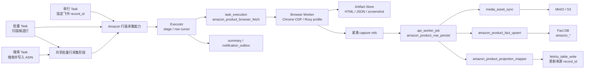
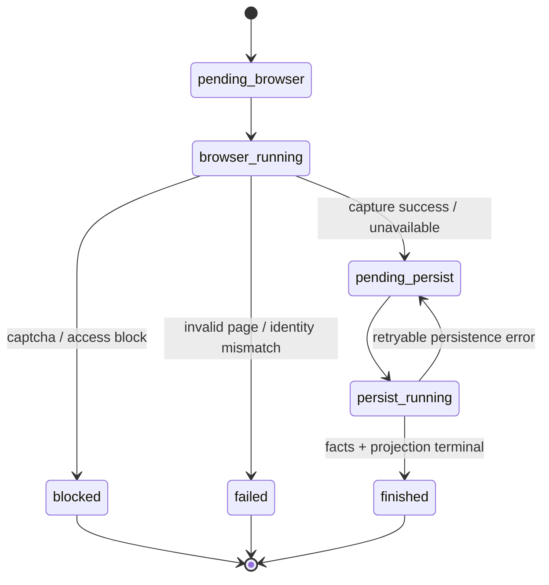
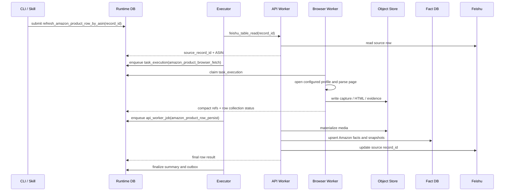
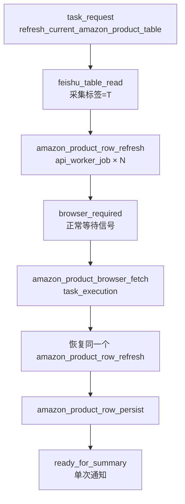
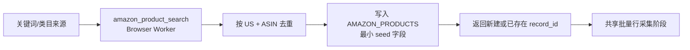
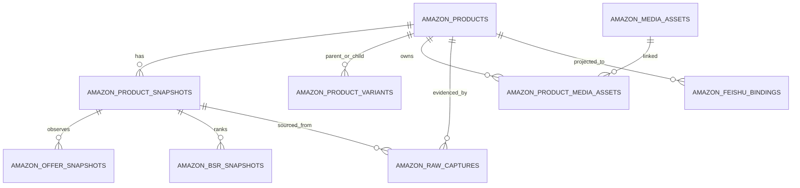

# Amazon 竞品表商品详情采集 Workflow 与事实存储设计

日期: 2026-07-14

状态: 已批准，实施中，能力尚未完成

适用范围: Amazon 美国站商品详情、飞书 Amazon竞品表、浏览器采集、Fact DB 持久化、对象存储和飞书写回

## 1. 文档定位

本文定义 Mujitask 新增 Amazon 竞品表商品详情采集能力时的目标架构、业务流程、数据边界和验收口径。

本文是实现前设计事实，不代表仓库当前已经具备 Amazon 采集能力。代码、migration 和机器契约完成并通过 completion gate 前，不得把本文描述的目标 task、handler、表或字段声明为已实现。

相关现有事实来源:

- [项目架构契约](./project-architecture-contract.md)
- [Workflow 设计与拆分规范](./workflow-design-guidelines.md)
- [Runtime 控制面契约](./runtime-control-plane-contract.md)
- [Handler Contract 设计](./handler-contract-design.md)
- [入口与输出契约设计](./entry-output-contract-design.md)
- [Fact DB Schema 设计](./fact-db-schema-design.md)
- [Storage 架构设计](./storage-architecture-design.md)
- [飞书 Adapter 与 Projection Mapper 契约](./feishu-table-adapter-projection-contract.md)
- [商品事实采集机器契约](../../contracts/facts/product-fact-collection.yaml)

## 2. 已确认业务范围

| 决策项 | 已确认口径 |
| --- | --- |
| 平台 | Amazon |
| 首期站点 | 美国站 `amazon.com` |
| 商品身份 | ASIN，不使用 Seller SKU |
| 业务来源 | 飞书多维表格中的 ASIN 记录 |
| 页面执行 | Chrome CDP 或项目配置的指纹浏览器 profile |
| 技术路线 | 浏览器访问 + 页面数据分层解析 |
| 当前商品范围 | 完整采集来源行对应的当前 ASIN |
| 变体范围 | 保存 Parent ASIN、页面暴露的 Child ASIN 和变体属性，不逐个访问其他 Child ASIN |
| 事实持久化 | Amazon 独立事实表，不写入 `tk_*` 表 |
| 对象存储 | 复用现有 bucket，使用 Amazon 独立 prefix 和生命周期 |
| 飞书写回 | 更新提供 ASIN 的原始 `record_id` |
| 批量采集 | 扫描飞书候选行，每行复用单商品采集能力 |
| 搜索采集 | 搜索结果先按 ASIN 去重写入飞书，再复用批量采集能力 |
| Agent 入口 | 独立 `mujitask-amazon-feishu-sync` Skill |
| OpenClaw 隔离 | 独立 `amazon-ops` agent 与 `workspace-amazon` |
| 飞书机器人 | 使用部署配置的本地 account ID，覆盖入口、受理回执和最终通知；不固定 `default` 或 `amazon` 等别名 |

首期采集字段:

- 标题、品牌、类目路径、卖点、描述。
- 主图和图库。
- 当前价格、原价、币种。
- 评分、评论数、过去一个月购买人数页面展示值、库存状态。
- Parent ASIN、Child ASIN 列表、当前 ASIN 的变体属性。
- 卖家、配送方式、Featured Offer / Buy Box。
- 优惠券、促销。
- BSR 排名。
- 技术参数。

## 3. 目标与非目标

### 3.1 目标

- 建立一个可由单行、批量和搜索流程共同复用的 Amazon 行级商品采集能力。
- 浏览器采集、事实持久化、媒体同步和飞书投影保持职责分离。
- Runtime DB 只保存执行状态和紧凑引用，不保存完整 HTML、完整标准化 payload 或图片内容。
- Fact DB 保存可重复采集、可追溯、可查询的 Amazon 主体、快照、Offer、变体、BSR、媒体和原始证据索引。
- 同一任务重复执行时保持 Runtime、Fact DB、对象存储和飞书写回幂等。
- 不影响现有 TikTok / FastMoss workflow、`tk_*` 事实表或 browser fallback 语义。

### 3.2 非目标

- 首期不支持美国站以外的 marketplace。
- 不支持 Seller SKU 到 ASIN 的解析。
- 不逐个访问所有 Child ASIN。
- 不采集评论明细、问答明细或 A+ Content。
- 不枚举全部第三方 Offer；只保存当前页面可观察到的 Featured Offer / Buy Box 及相关卖家、价格和配送信息。
- 不依赖 Product Advertising API、Creators API 或 Selling Partner API。
- 不新增 Amazon 专用 daemon、worker、Runtime 队列表或 Watchdog。
- 不新增代理轮换、验证码破解、访问限制绕过或 stealth 绕过能力。
- 首期不拆独立 Fact DB 实例，不新建对象存储 bucket。
- 不为 Amazon 复制一套 Runtime DB、daemon、worker、watchdog 或对象存储 bucket；入口隔离和后台运行资源隔离是两个不同边界。

### 3.3 Agent、Skill 与通知隔离

Amazon 的入口和通知采用业务域级物理隔离，机器绑定以 `contracts/agents/business-agent-bindings.yaml` 为准：

| 维度 | Amazon 固定值 | 与 TikTok 的关系 |
| --- | --- | --- |
| Skill bundle | `mujitask-amazon-feishu-sync` | 不包含 TikTok/FastMoss intent |
| OpenClaw agent | `amazon-ops` | 不复用 `tiktok-ops` session |
| workspace | `workspace-amazon` | 不安装 `mujitask-tiktok-feishu-sync` |
| Feishu channel | `feishu` | 与 TikTok 共用同一种传输能力 |
| Feishu accountId | `default` | 与 TikTok 共用同一个机器人账号 |
| Feishu peer binding | `kind=group`、部署时配置 `oc_*` | 精确群聊路由优先于 TikTok 账号级兜底路由 |

执行边界：

1. Amazon Skill 只做意图识别、确认预览、业务输入提取和顶层 `task_request` 提交。
2. Skill 只从自身 `skill.local.env` 拼接 `AMAZON_PRODUCTS` 表 URL，并以必填的无密钥 `table_refs` 配置快照随顶层 Request 提交；worker 只消费该快照，启动环境不得提供 Amazon 表路由或回退。
3. Skill 从 `amazon-ops` session 取得回复目标，并校验 `reply_target.channel=feishu`、`reply_target.accountId` 等于 `MUJITASK_AMAZON_FEISHU_ACCOUNT_ID`、`reply_target.to=chat:oc_*` 后提交。
4. Workflow 只写 `notification_outbox`；通用 outbox dispatcher 使用该部署绑定的飞书机器人回复原 Amazon 群聊，不新增 Amazon 专用通知 handler。
5. App ID、App Secret、token 和真实 workspace 绝对路径是部署配置，不进入 workflow payload 或 Runtime result。
6. 后续新增 Amazon 批量、搜索、监控或分析 workflow 时，只能扩展 Amazon Skill 的 intent，不得加入 TikTok Skill。

## 4. 商品身份与 URL Contract

### 4.1 身份键

虽然首期只有美国站，身份键仍保留 marketplace 维度:

```text
product_key = amazon:{marketplace_code}:{asin}
marketplace_code = US
canonical_url = https://www.amazon.com/dp/{asin}
```

Fact DB 唯一键使用 `(marketplace_code, asin)`，不能只使用 ASIN。这样以后增加其他站点时，不需要改变既有主键语义。

### 4.2 ASIN 规范化

- 去除首尾空格并转为大写。
- 首期接受符合 `^[A-Z0-9]{10}$` 的值。
- 正式身份输入必须来自飞书 `ASIN` 字段，系统始终由该 ASIN 构造 canonical URL。
- 飞书 `商品链接` 只作为派生输出或一致性校验；如果存在，可从 `/dp/{ASIN}`、`/gp/product/{ASIN}` 或标题 slug 后接 `/dp/{ASIN}` 的 URL 中提取 ASIN 进行比对。
- 链接中的 ASIN 与来源 `ASIN` 不一致时返回 `identity_mismatch`；非 `amazon.com` 域名返回 `unsupported_marketplace`，不得静默改成美国站。
- URL 中的跟踪参数、affiliate 参数和无关 query 不进入 canonical URL。

### 4.3 请求身份与页面身份

浏览器采集必须同时记录:

- `requested_asin`: 飞书来源 ASIN。
- `resolved_asin`: 页面最终解析出的当前 ASIN。
- `parent_asin`: 页面明确暴露的 Parent ASIN。

身份判定:

| 场景 | 处理 |
| --- | --- |
| `requested_asin == resolved_asin` | 正常采集 |
| `requested_asin == parent_asin` 且页面自动落到某个 Child ASIN | 保存关系证据，行结果为 `partial_success`；不得把 Child 的价格伪装成 Parent 的价格 |
| 其他 ASIN 不一致 | 返回 `identity_mismatch`，不写商品业务字段 |
| 页面明确不可售、下架或不存在 | 保存终态事实，行状态为 `unavailable` |

## 5. 总体架构



### 5.1 分层职责

| Owner | 目标职责 | 禁止事项 |
| --- | --- | --- |
| `domains/amazon/tasks/**` | 顶层入口和 Runtime request shell | 页面解析、数据库写入 |
| `domains/amazon/workflows/**` | Stage、Job、transition、summary contract | 直接访问浏览器、飞书或数据库 |
| `domains/amazon/flows/**` | 行级业务编排、候选、状态收敛 | 持有底层 client、执行 DDL |
| `domains/amazon/mappers/**` | 飞书来源行转换为 Amazon 业务输入 | 网络访问、Fact DB 写入 |
| `domains/amazon/projections/**` | Amazon 事实结果转换为飞书字段，并把 Amazon handler outcome 投影为首次 Runtime 写入允许的紧凑结果 | 页面采集、事实持久化、Runtime claim/retry |
| `capabilities/browser/amazon/**` | 页面访问、分层解析、证据生成 | Fact DB、媒体长期持久化、飞书写回 |
| `capabilities/fact_sources/amazon/mappers/**` | browser capture 转 Amazon fact payload | 页面访问、飞书字段解释 |
| `capabilities/media/**` | 下载并物化商品媒体 | 商品筛选和飞书字段策略 |
| `capabilities/persistence/database/**` | Amazon fact upsert handler | Workflow 编排、飞书投影 |
| `infrastructure/facts/**` | Amazon Fact Store 和数据库读写 | 业务候选与投影决策 |
| `infrastructure/browser/browser_bridge.py` | framework browser provider 适配边界 | Amazon 字段解释 |
| `control_plane/**` | Runtime claim、lease、retry、watchdog、outbox，并通过通用 runtime projection hook 接收领域投影 | Amazon 页面、字段、ASIN、Fact ref 或飞书写回语义 |

新增实现优先落入上述 owner，不新增 `helper`、`service`、`manager`、`coordinator`、`collector` 或旁路 `orchestrator`。Workflow package 的 `orchestrator.py` 只允许做 stage dispatch，并需在 architecture ownership contract 中声明。

## 6. 浏览器采集与分层解析

### 6.1 浏览器 profile

正式任务不携带 cookie、provider token、workspace id、profile id 或 CDP 地址。

运行时解析顺序:

1. 项目运行配置中的 `AMAZON_US_BROWSER_PROFILE_REF`。
2. framework 的 `DEFAULT_PROFILE_REF`。
3. 两者都不存在时 submit preflight 失败。

`config/browser_profiles.json` 可使用现有 provider:

- `chrome_cdp`: 连接本地或用户管理的 Chrome CDP。
- `roxy`: 使用已配置的指纹浏览器 workspace/profile。

Amazon capability 只调用现有 `infrastructure/browser/browser_bridge.py`，不直接依赖 framework 内部 browser/client 模块。`ROXY_TOKEN`、CDP 地址和 profile metadata 只来自运行配置或 secret 环境。

每个 Amazon profile 应使用稳定的美国语言、时区和配送地区。Fact snapshot 记录非敏感的 `profile_context_digest`、locale 和 delivery region；不记录 cookie 或账号标识。

### 6.2 页面访问流程

1. 由 ASIN 构造 canonical URL。
2. 使用 profile resource lease 打开页面。
3. 等待 document ready、商品身份节点或明确的终态/受阻节点。
4. 必要时有限滚动并展开 Product details 等商品区块。
5. 校验最终 URL、requested ASIN 和 resolved ASIN。
6. 生成 raw HTML、允许的数据片段和必要截图。
7. 执行分层字段解析。
8. 生成标准化 capture JSON 并上传对象存储。
9. Browser handler 只返回身份、字段覆盖率、状态和 artifact refs。

### 6.3 解析优先级

同一字段按以下顺序取值:

1. 页面内嵌的结构化数据或稳定商品数据对象。
2. 本次页面加载过程中观察到的同源商品响应。
3. 稳定语义 DOM 节点和 data attribute。
4. Product details、technical details 等受控文本区块。

不得单独调用未公开 Amazon 内部接口作为正式依赖。网络观察只消费当前浏览器页面自然加载产生的数据。
首期 response observer 必须在页面导航前注册，只接收 canonical page exact same-origin 的
`fetch` / `xhr` JSON 响应；最多保留 8 个响应、单个响应不超过 256 KiB、总计不超过
512 KiB，超限时淘汰最早候选并保留最新的有界观察窗口。候选在计入窗口前必须命中
requested ASIN 或当前页面 resolved ASIN，并包含 capture contract allowlist 字段；最终只允许明确
携带 resolved ASIN 的商品对象参与解析。其他 ASIN、跨源响应、URL query、headers 和非 allowlist
字段全部丢弃。净化后的可选
片段写为 `page-data.json` / `network_data` artifact，Runtime 仍只保存对象引用。
同一字段被多个合格响应观察到时，以监听窗口内最后一次明确值为网络层候选，再与其他解析层按上述优先级比较。

促销解析还必须满足以下约束:

- 采用 `coupon`、`limited_time_deal` 白名单，只在 Featured Offer / Apex price / Buy Box / Coupon 等受控报价容器中识别，不对全页文本做模糊搜索。
- 价格、折扣和 badge 必须来自同一报价容器；禁止把不同 Buy Box option 或页面区域的值拼成一条促销。
- `Save ... at checkout`、Prime Member Price、Exclusive Prime Price、Prime Day Deal、Subscribe & Save、数量/条件购买折扣、普通降价和无法明确归类的其他文案不生成促销对象。
- Coupon 允许动态 `couponText...` ID，但只提取 `Apply/Save ... coupon` 可见短文本；不读取容器内脚本和兑换参数。
- Limited Time Deal 只保留 `Limited time deal` 标签和同一报价区的页面活动价；其折扣百分比和 List/Typical/Regular Price 不进入促销对象。
- DOM 文本收集必须递归排除 `script`、`style`、`noscript` 和 `template`。无法安全缩减为促销短文本的节点不进入 capture。
- 飞书 `促销活动记录` 由 projection 使用父 capture 的 `captured_at` 和 Featured Offer 当前价格生成。Coupon 折后价在 projection 边界以 Decimal 计算并按美元四舍五入保留两位小数；Limited Time Deal 直接使用 `deal_price`。
- `promotions[]` 被明确观察为空数组时，projection 写入 `采集时间 | 当前没有促销活动` 并覆盖 `促销活动记录`；`missing` 仍保留旧值。

商品信息与配送文案还必须满足以下约束:

- `commerce.bought_past_month` 只从稳定 DOM 节点 `#social-proofing-faceout-title-tk_bought` 的可见文本提取；不得对全页文本做模糊搜索。
- 节点文本必须匹配 `<展示值> bought in past month`。capture 与飞书只保留展示值，例如 `500+`；不得转成数值 `500`、去掉 `+` 或保存完整英文句子。
- `commerce.bought_past_month` 是可选页面指标；证据缺失时 projection 保留飞书 `30天购买人数` 原值，且该字段单独缺失不改变 collection status。
- Product information 的 `prodDetTable` 属于受控技术参数区域；`Number of Items` 以原始可见文本进入 `product.technical_details`，由飞书 projection 生成 `包装规格`。
- `包装规格` 不从 `Unit Count`、Quantity 选择器或标题推导；`Number of Items` 缺失时 projection 写固定文本 `没有包装规格`。
- `commerce.featured_offer.delivery_text` 只允许以 `FREE delivery` 开头的主配送文案，并在进入 capture 前移除配送地址、邮编、`Or fastest delivery`、倒计时和账户文本。
- 飞书 `送达日期` 从净化后的 `delivery_text` 提取英文日期或日期范围，并去除 `FREE delivery` 标签和订单门槛；该证据为 `missing` 或无法提取日期时保留原值。

每个字段保存:

- `value`。
- `source_kind`。
- `source_locator` 或片段 digest。
- `observed` / `explicitly_unavailable` / `missing`。
- `confidence`。

Projection 只写 `observed` 或 `explicitly_unavailable` 字段；`missing` 不得清空飞书旧值。

### 6.4 标准化 Capture Contract

完整 capture 不进入 Runtime DB，而是写为对象并通过 `normalized_capture_ref` 传递。逻辑结构如下:

```yaml
contract_revision: 5
source_platform: amazon
marketplace_code: US
requested_asin: B0XXXXXXXX
resolved_asin: B0XXXXXXXX
canonical_url: https://www.amazon.com/dp/B0XXXXXXXX
captured_at: ISO-8601 timestamp
profile_context:
  locale: en_US
  currency: USD
  delivery_region: non-sensitive region label
  profile_context_digest: sha256 digest
product:
  title: text
  brand: text
  category_path: [text]
  bullet_points: [text]
  description: text
  technical_details: object
commerce:
  availability_status: in_stock | out_of_stock | unavailable | unknown
  rating: decimal
  review_count: integer
  bought_past_month: text | null
  featured_offer:
    seller_id: text
    seller_name: text
    is_buy_box: boolean
    price_amount: decimal
    list_price_amount: decimal
    currency: USD
    fulfillment_channel: amazon | merchant | unknown
    delivery_text: text
    coupon_text: text
    promotions:
      - promotion_type: coupon | limited_time_deal
        label: text
        discount_type: percentage | amount | price_override
        discount_value: decimal | null
        deal_price: decimal | null
        reference_price: decimal | null
        reference_price_type: list_price | typical_price | regular_price | current_price | null
        currency: USD | null
        prime_only: boolean
        claim_required: boolean
        raw_text: text
variants:
  parent_asin: text
  child_asins: [text]
  current_attributes: object
  dimensions: object
rankings:
  - category_name: text
    category_path: [text]
    rank: integer
media:
  main_image: object
  gallery_images: [object]
field_evidence: object
artifact_refs: [object]
```

revision 2 只产生上述固定 key 的促销对象，每条促销的时间和非敏感浏览器上下文继承自父 capture 的 `captured_at` 和 `profile_context_digest`，不在每条对象中重复。revision 3 继承 revision 2 的促销结构，并把 Amazon 主图和图库 URL 收紧为不含 CDN 图像变换段的原始资源 URL。revision 4 进一步要求 Browser 从当前商品图片块的 `ImageBlockATF.colorImages.initial` 取得有序图库，按同一图库项选择 `hiRes`，禁止从可能具有不同资产 ID 的 `thumb` URL 推断高清图。revision 5 继承 revision 4，并新增可选 `commerce.bought_past_month` 文本和同路径 evidence；Browser 只输出 `bought in past month` 前面的展示值。

兼容策略是持久化边界同时接受 revision 1、2、3、4 与 5：revision 1 的 `promotions: [text]` 仍按历史原文保存，revision 2–5 必须通过结构化促销校验；revision 1/2 capture 中的 Amazon CDN 派生图片 URL 在内存兼容 adapter 中转换为无变换段 URL，并同步更新对应 field evidence 后再验证和物化，不重写已存 raw capture。revision 3 可继续消费，但它无法从既有缩略图 URL 恢复不同的高清资产 ID，必须重新采集才具备 revision 4 的高清保证。revision 1–4 没有 `commerce.bought_past_month`，继续按旧 evidence 集合读取；新 Browser worker 只生成 revision 5。该变化使用既有 snapshot JSON 与 raw capture，不需要 Fact DB DDL 或重写历史数据。

## 7. Workflow 设计

### 7.1 稳定业务入口

| 业务入口 | task_code / workflow_code | 说明 |
| --- | --- | --- |
| 单商品行采集 | `refresh_amazon_product_row_by_asin` | 指定飞书 `record_id`，读取 ASIN 并更新同一行 |
| Amazon竞品表批量刷新 | `refresh_current_amazon_product_table` | 只扫描 `采集标签=T` 的候选行 |
| Amazon 关键词搜索 | `search_keyword_amazon_products` | 搜索、按 ASIN 去重写入飞书，再进入共享批量行采集阶段 |

三个入口分别拥有 machine workflow contract。单商品和批量入口已经落地；搜索仍为后续范围。批量入口只负责筛选并在同一个顶层 Request 下创建幂等的 `amazon_product_row_refresh` 行级主 Job，不创建单商品子 Request。行级主 Job 复用现有 Amazon browser/persist handler，不能复制页面解析、Fact mapping、媒体同步或飞书 projection。

### 7.2 行级状态机



该状态机是 Workflow stage cursor 中的业务行状态，不新增 Runtime DB lifecycle 枚举。

### 7.3 单商品 Workflow

| stage_code | execution_mode | Job / Handler | 退出条件 |
| --- | --- | --- | --- |
| `read_amazon_product_row` | worker job | `feishu_table_read` + `amazon_product_table_source_adapter` | 找到唯一来源行并验证 ASIN |
| `collect_amazon_product_detail` | browser task | `amazon_product_browser_fetch` | capture 或终态错误已写入 `task_execution` |
| `persist_amazon_product_detail` | API worker job | `amazon_product_row_persist` | 媒体、事实和飞书写回收敛 |
| `ready_for_summary` | summary | `task_completed_notification` | summary 与 outbox 已持久化 |

`invalid_asin`、`unsupported_marketplace`、`identity_mismatch`、`blocked/captcha`
等已定位到来源行的终态错误，在当前 read 或 browser stage 结束前复用
`feishu_table_write` 执行一次 status-only projection，只写 `采集状态`、`上次采集时间`
和脱敏 `采集错误`。该写回不新增第五个 stage，不进入媒体或 Fact persistence，也不得携带
页面商品字段；写回完成或重试耗尽后才允许父任务失败收敛。来源行不存在时不执行写回。

Amazon 飞书写入使用固定六字段白名单：`主图`、`侧边栏图片`、`30天购买人数`、`送达日期`、`包装规格`、
`促销活动记录`。`collecting`、`persisting`、`failed` 等 status-only projection 仍可沿用统一
handler contract，但映射后的字段会在发送请求前被白名单过滤为空，并以受控的
`skipped/empty_fields` 收敛；它不写飞书、不阻断浏览器或 Fact 副作用。终态商品投影只发送
六字段白名单与目标 schema 的交集，并仍须精确更新原 `source_record_id`。字段白名单不放宽
来源行、ASIN、目标表身份或实际终态写回记录数校验。



### 7.4 批量 Workflow

批量流程复用 TikTok 竞品表已经验证的“一个顶层 Request + 多个行级主 Job”调度拓扑：

1. `feishu_table_read` 读取 `AMAZON_PRODUCTS`。
2. `amazon_product_batch_source_adapter` 只保留 `采集标签` 严格等于 `T` 且 ASIN 合法的行。
3. Executor 按父请求与 `source_record_id` 生成幂等键，在当前 `request_id` 下为每行创建一个 `amazon_product_row_refresh` API Job。
4. 行级主 Job 首次运行完成来源身份与 collecting 状态收敛，然后返回 `browser_required` 正常等待信号；该信号不是错误、fallback 或业务终态。
5. Executor 根据等待中的行级主 Job 创建 `amazon_product_browser_fetch` `task_execution`。Browser Worker 完成后，Runtime 将紧凑浏览器结果写回原行级 Job 并重新置为 `pending`。
6. 同一个行级 Job 恢复后调用 `amazon_product_row_persist`，串行完成媒体、Fact、projection 和飞书覆盖写回，最后形成行级终态。
7. 所有行级 Job 终态后，父 Request 汇总 success、partial_success、unavailable、blocked、failed 和 skipped，并发送一条最终通知。

批量流程不产生子 `task_request`。实际页面访问继续由 Browser Worker 的 profile/resource lane 控制；所有 Amazon 页面执行使用同一资源 lane，首期保持串行。



### 7.5 搜索 Workflow

搜索流程按以下方式组合:



搜索 seed 最少写入:

- ASIN。
- canonical URL。
- 来源关键词。
- `采集状态=pending`。

去重键为 `(marketplace_code=US, asin)`。搜索 workflow 获得目标 `record_id` 后，在同一顶层请求中进入共享行采集阶段，不复制商品详情解析逻辑。

## 8. Job 与 Handler Contract

### 8.1 新增稳定 handler

| handler_code | worker_type | 物理 Runtime 表 | 职责 |
| --- | --- | --- | --- |
| `amazon_product_row_refresh` | `api_worker` | `api_worker_job` | 批量请求中的一条 Amazon 行级主执行；请求主浏览器执行、消费结果并复用行持久化能力 |
| `amazon_product_browser_fetch` | `browser_worker` | `task_execution` | 访问并解析一个 ASIN 页面，生成 capture artifacts |
| `amazon_product_row_persist` | `api_worker` | `api_worker_job` | 行级媒体、事实、projection 和飞书写回收敛 |
| `amazon_product_fact_upsert` | `api_worker` capability | `api_worker_job` 或行级内部受控调用 | 写 Amazon 独立事实表 |
| `amazon_product_search` | `browser_worker` | `task_execution` | 后续搜索 workflow 的 ASIN 发现 |

复用现有 handler:

- `feishu_table_read`。
- `feishu_table_write`。
- `media_asset_sync`。
- `task_completed_notification`。

`amazon_product_row_refresh` 与 `amazon_product_row_persist` 只能通过现有 handler dispatch/contract 边界调用下层 handler，不能直接 import capability handler 实现。`browser_required` 是兼容新增的 HandlerResult 状态；旧 handler 状态保持不变，worker 只把它映射为 `api_worker_job.status=waiting`，不改变 Runtime lifecycle 枚举。

### 8.2 Browser worker 基础扩展

当前 browser claim allowlist 硬编码 TikTok 与 FastMoss handler。目标设计要求:

- Browser handler allowlist 新增 Amazon handler contract。
- `execute_browser_once` 从受控 `BROWSER_HANDLER_CODES` 读取可 claim code，而不是继续维护另一份硬编码 tuple。
- Browser Worker 仍是业务无关执行层，不理解 Amazon Workflow。
- 继续使用 child-process supervision，避免 Playwright 同步执行进入 host asyncio loop。

### 8.3 Payload 边界

正式 task 的业务 payload 只允许:

- `table_ref`，首期使用配置别名 `AMAZON_PRODUCTS`。
- `source_record_id`。

`control_action`、`requested_by`、`reply_target` 和幂等键属于 Task 调用/通知信封，
不写入正式业务 payload。首期不接受 `force_refresh` 或其他扩展业务字段；需要新增时先修改
workflow machine contract。

正式 task payload 禁止:

- Runtime DB / Fact DB URL。
- MinIO/S3 endpoint、bucket credential。
- cookie、localStorage、请求头。
- browser provider token、profile id、workspace id、CDP URL。
- 原始 HTML、完整 capture 或图片内容。

Browser `task_execution.result_json` 只保存:

- requested/resolved ASIN。
- collection status。
- field coverage summary。
- `normalized_capture_ref`。
- raw/screenshot artifact refs。
- 受控 `media_source_refs`；每项仅含已按当前图库项绑定到高清资产、已去除 Amazon CDN 尺寸/裁剪/质量变换段及 query/fragment 的 Amazon CDN URL、
  Amazon/US/ASIN 身份、media role 和 position；URL 的 percent-decoded path 含 HTML、token、
  cookie 或控制字符时删除该项并把成功采集降为 `partial_success`，重复
  `(media_role, position)` 则拒绝整行进入 persist。
- 非敏感 browser target digest；值固定为 64 位小写 SHA-256，并且必须精确等于当前
  `browser:amazon:<digest>` resource lane 的 `<digest>`，不能信任 child 自报的其他值。该字段对
  success、partial、blocked 和 failed result 都是必需项；缺失、空值、非法 resource lane 或不匹配
  都必须在首次 Runtime 写入前按非法 handler result 失败收敛。

这里的 `media_source_refs` 是等待对象存储物化的紧凑来源引用，不是媒体正文或下载凭证；
其字段和值都按 workflow machine contract 投影。API persist job 通过 object ref 读取完整
capture，并消费上述受控媒体来源引用，不经 Runtime DB 传递 capture、HTML 或媒体正文。
Browser/API child 可控的 provider、progress stage、supervisor 状态、error type/code 和 contract
revision 只能按各字段 allowlist 或固定值投影；未知 opaque code 使用稳定 fallback，不能依靠
关键词 denylist 判断是否包含 credential。`amazon_product_row_persist` 只接受
`success`、`partial_success` 或 `failed`；`fallback_required` / `skipped` 作为非法结果立即失败，
不得进入无人继续消费的 waiting 状态。

## 9. Runtime、幂等与并发

### 9.1 Runtime DB

继续使用现有:

- `task_request`。
- `task_execution`。
- `api_worker_job`。
- `resource_lease`。
- `artifact_object`。
- `notification_outbox`。

首期不需要新增或修改 Runtime DB 表。若实现中发现必须新增字段，应单独更新 Runtime schema contract 和 migration，不能在本需求中无声扩展。

### 9.2 幂等键

| 层 | 幂等键 |
| --- | --- |
| 行级业务 | `{request_id}:{source_record_id}:{asin}` |
| 行级主 Job | `{request_id}:amazon_row_refresh:{source_record_id}:{asin}` |
| Browser execution | `{request_id}:amazon_collect:{source_record_id}:{asin}` |
| Persist job | `{request_id}:amazon_persist:{source_record_id}:{asin}` |
| 商品主档 | `(marketplace_code, asin)` |
| 本次快照 | `(marketplace_code, asin, run_id)` |
| 变体关系 | `(marketplace_code, parent_asin, child_asin)` |
| 媒体资产 | 规范化 source URL digest 或内容 SHA-256 |
| 商品媒体关系 | `(product_id, asset_id, media_role, position)` |
| 飞书来源绑定 | `(base_id, table_id, record_id)` |
| 搜索 seed | `(marketplace_code, asin)` |

重试同一个 run 不重复创建 snapshot；新的正式采集 run 追加新的 snapshot 和 Offer/BSR observation。

### 9.3 资源 lane

- Browser execution 的 `resource_code` 使用解析后的 browser target key digest。
- submit preflight 通过 browser adapter 解析配置中的 profile ref；把 target key digest、派生
  `resource_code` 以及同一次 persistence config 解析得到的非敏感 `artifact_bucket` / normalized
  `artifact_object_prefix` 快照保存到 Runtime `stage_cursor.runtime_context`，不保存 profile ref、
  provider token、workspace id、profile id、endpoint 或 credential。Browser child payload 只携带该
  bucket/prefix 快照用于产出与落库前校验，不能在 worker 中重新解释为另一套坐标策略。
- 空 object prefix 是合法快照，和字段缺失不同；旧的 in-flight request 若没有 bucket/prefix
  快照则 fail closed，不继续采集或接受 artifact ref。
- 同一 profile 同时只允许一个 Amazon 页面任务。
- 首期可以一次创建全部行级主 Job，但同一 browser resource lane 同时只允许一个 Amazon 页面执行。
- Browser 与 API persistence 是两个物理执行单元；Browser Worker 按资源 lane 串行，行级主 Job 只在对应 browser execution 终态后恢复。

## 10. Amazon Fact DB 设计

### 10.1 分离决策

首期采用:

> 同一个 Fact DB 实例、同一个现有数据库部署、Amazon 独立 `amazon_*` 表。

不采用:

- 把 Amazon 数据写入 `tk_products`、`tk_product_skus` 或 `tk_media_assets`。
- 仅把 Amazon payload 塞入 TikTok `facts_json`。
- 首期创建第二套 Fact DB 实例。
- 首期引入新的 PostgreSQL schema/search_path 复杂度。

这样既保持业务域与表结构隔离，又复用现有连接、migration、备份、监控和 runtime config。Amazon 表不得对 `tk_*` 表建立外键。

### 10.2 目标 ERD



### 10.3 表与主键

#### `amazon_products`

商品主档与 latest identity:

- `id`: 内部稳定 ID。
- `marketplace_code`、`asin`: 唯一键。
- `canonical_url`。
- `parent_asin`。
- `title`、`brand`、`category_path_json`。
- `status`。
- `latest_snapshot_id`。
- `facts_json`: 低频扩展字段，不替代常用 typed column。
- `first_seen_at`、`last_seen_at`、`created_at`、`updated_at`。

#### `amazon_product_snapshots`

每次正式采集的不可变商品观察:

- `snapshot_id`。
- `product_id`、`marketplace_code`、`asin`。
- `run_id`、`request_id`、`execution_id`。
- `resolved_asin`、`parent_asin`。
- `availability_status`。
- `title`、`brand`。
- `category_path_json`、`bullet_points_json`、`description`、`technical_details_json`。
- `rating`、`review_count`。
- `variant_attributes_json`、`child_asins_json`。
- `field_coverage_json`、`payload_json`、`content_digest`。
- `collected_at`、`created_at`。

唯一键: `(marketplace_code, asin, run_id)`。

#### `amazon_offer_snapshots`

当前页面可观察到的 Featured Offer / Buy Box:

- `offer_snapshot_id`、`product_snapshot_id`、`product_id`。
- `offer_key`。
- `seller_id`、`seller_name`。
- `is_featured_offer`。
- `price_amount`、`list_price_amount`、`currency`。
- `availability_status`。
- `fulfillment_channel`、`delivery_text`。
- `coupon_text`、`promotions_json`。
- `profile_context_digest`。
- `collected_at`、`created_at`。

该表不声称包含 Amazon 全部 Offer。

#### `amazon_product_variants`

- `relation_id`。
- `marketplace_code`、`parent_asin`、`child_asin`。
- `attributes_json`、`dimensions_json`。
- `source_asin`。
- `first_seen_at`、`last_seen_at`、`created_at`、`updated_at`。

唯一键: `(marketplace_code, parent_asin, child_asin)`。

页面只暴露 Child ASIN 而未访问详情时，关系可以存在，但不得把 Child 当作已完整采集商品。

#### `amazon_bsr_snapshots`

- `bsr_snapshot_id`、`product_snapshot_id`、`product_id`。
- `category_name`、`category_path_json`。
- `rank_value`。
- `collected_at`、`created_at`。

一个商品快照可有多个类目排名。

#### `amazon_media_assets`

- `asset_id`、`asset_key`。
- `source_url`、`source_url_digest`、`content_digest`。
- `bucket`、`object_key`、`remote_uri`。
- `file_name`、`mime_type`、`size_bytes`。
- `metadata_json`。
- `first_seen_at`、`last_seen_at`、`created_at`、`updated_at`。

#### `amazon_product_media_assets`

- `relation_id`、`relation_key`。
- `product_id`、`asset_id`。
- `media_role`: `main_image` 或 `gallery_image`。
- `position`。
- `metadata_json`。
- `first_seen_at`、`last_seen_at`、`created_at`、`updated_at`。

#### `amazon_raw_captures`

- `raw_capture_id`、`product_id`、`snapshot_id`。
- `capture_kind`: `normalized_capture`、`html`、`network_data` 或 `screenshot`。
- `bucket`、`object_key`、`content_digest`、`content_type`。
- `request_id`、`execution_id`、`run_id`。
- `sanitization_status`。
- `collected_at`、`created_at`。

数据库只保存索引、摘要和 digest，不保存大 HTML body。

#### `amazon_feishu_bindings`

- `binding_id`、`product_id`。
- `base_id`、`table_id`、`record_id`。
- `source_asin`、`status`。
- `latest_snapshot_id`：当前来源绑定对应的最新 Fact snapshot，不表示飞书已写回。
- `first_bound_at`、`last_bound_at`、`created_at`、`updated_at`。

唯一键: `(base_id, table_id, record_id)`。

### 10.4 Fact persistence owner

首期新增 Amazon 专用 `AmazonFactStore` / repository 和 `amazon_product_fact_upsert` handler，不改变 `TKFactStore` 的稳定语义，也不把现有 `fact_bundle_upsert` 静默改成跨平台路由器。

一次 normalized capture 对应的 product、snapshot、raw capture index、Offer、变体、BSR、
媒体关系、飞书 binding 和 `latest_snapshot_id` 必须在同一个 PostgreSQL 事务中提交；任一后段
写入失败时整包回滚，`latest_snapshot_id` 作为最后一条数据库写入。证据对象在事务前写入并
校验，对象存储和后续飞书 projection 不属于该数据库事务。

如果未来需要统一多平台 Fact Store，必须先形成跨平台 entity contract 和 migration，不在本需求中提前抽象。

### 10.5 Migration、兼容与回滚

- 使用独立 `alembic_fact.ini` 和 `fact_alembic_version` 的 additive Fact migration 创建
  `amazon_*` 表和索引；Runtime Alembic 同 revision 只保留无 DDL 兼容节点。
- Fact migration 必须显式读取 `BUSINESS_EXECUTION_CONTROL_FACT_MIGRATION_DB_URL`，不得回退
  到 Runtime DB URL 或 worker 的 Fact DB URL。
- 不修改或迁移任何 `tk_*` 数据。
- migration 使用 `mujitask_migration_user`；生产 worker 不执行 DDL。
- `BUSINESS_EXECUTION_CONTROL_FACT_RUNTIME_ROLE` 是 API worker 共用的受限 Fact 身份，只授予
  schema USAGE、机器契约列出的 TikTok / Amazon Fact 表
  `SELECT / INSERT / UPDATE / DELETE` 和 `fact_alembic_version` SELECT；不得授予 Runtime 表权限。
- 应用启动检查 schema version；版本不匹配时新 Amazon worker fail fast。
- 旧 worker 不认识新 handler，不应消费新 Amazon job；发布时应先 migration，再原子更新 executor/browser/API worker。
- 代码回滚时优先停用 Amazon task/handler，保留 additive 表和对象；只有确认无保留数据需求并完成备份后，才在 Fact migration 图执行 downgrade 到 `base`。

## 11. 对象存储设计

### 11.1 Bucket 决策

首期不新建 bucket。继续使用现有 `artifact_bucket`，按环境 prefix 隔离:

| 内容 | 推荐 object key |
| --- | --- |
| Runtime 证据 | `<env>/runs/<run_id>/amazon/<asin>/<kind>.<ext>` |
| 标准化 capture | `<env>/raw-captures/amazon/us/<asin>/<yyyy>/<mm>/<dd>/<run_id>/<sha256>/normalized.json` |
| 原始 HTML | `<env>/raw-captures/amazon/us/<asin>/<yyyy>/<mm>/<dd>/<run_id>/<sha256>/page.html.gz` |
| 允许的页面数据 | `<env>/raw-captures/amazon/us/<asin>/<yyyy>/<mm>/<dd>/<run_id>/<sha256>/page-data.json` |
| 截图 | `<env>/raw-captures/amazon/us/<asin>/<yyyy>/<mm>/<dd>/<run_id>/<sha256>/page.png` |
| 商品媒体 | `<env>/product-media/amazon/us/<asin>/<media_role>/<sha256>.<ext>` |

Runtime 证据写入 `artifact_object`；业务媒体写入 `amazon_media_assets`；raw capture 同时由 `artifact_object` 和 `amazon_raw_captures` 建立运行与事实索引。

### 11.2 持久化要求

- `normalized_capture.json` 和 sanitized HTML 是正常采集的必需证据。
- Fact handler 只接受受控 capture kind，并校验其 content type 与 sanitization status：
  normalized capture 为 `application/json + normalized`，HTML 为
  `application/gzip + sanitized`，network data 为 `application/json + allowlisted`，
  screenshot 为 `image/png + not_applicable`。
- 每个 raw ref 必须携带当前 `request_id`、同一个来源 Browser `execution_id` 和当前
  稳定 `run_id`；Browser worker 在首次写 `task_execution.result_json` 和 `artifact_object` 前，
  按 submit-time bucket/prefix、请求 ASIN、`collected_at` 的 UTC 日期、digest、kind filename、
  content type 和 sanitization status 精确校验并只保留机器契约字段。Fact handler 在写库前
  读取实际对象字节并复算 digest。HTML 必须能解压为
  UTF-8，且解压后再次通过脚本、敏感元素、属性、metadata 和结构化数据脱敏检查，不能只信任引用 metadata。
- Browser child 返回的 ETag 不属于紧凑 artifact ref contract，Runtime 首次索引时必须丢弃，
  不能把任意 child 文本写入 `artifact_object.etag`。
- `blocked`、`captcha_required` 或 `access_blocked` 在首次 Runtime 写入前必须包含按同一坐标规则
  校验通过的 screenshot artifact；预导航配置或连接失败没有页面证据时不套用该规则。
- `field_evidence` 必须精确覆盖对应 capture revision 的目标字段，并包含
  `value/status/source_kind/source_locator/confidence`；evidence value 必须与 normalized
  capture 对应字段一致，`missing` 不得指向非空值。revision 1–4 使用既有字段集合；revision 5
  额外要求 `commerce.bought_past_month` evidence。该字段允许 `missing` 且不影响 collection status。
- 同一 `(bucket, object_key)` 只能对应相同商品、快照、run、kind、digest 与脱敏状态；
  重试发现不可变证据变化时必须失败，不能把新对象内容与旧 Fact digest 静默拼接。
- Raw capture key 中的 `<sha256>` 必须是实际上传字节的 digest。相同内容重试复用同一
  coordinate；内容变化写入新 coordinate 并保留旧对象，但同一 run 的 normalized
  capture digest 变化仍按 `same_run_capture_conflict` 拒绝进入 Fact DB。
- `blocked`、`captcha_required` 和 `access_blocked` 必须有截图；其他 failed/身份不一致若发生在
  页面加载前可没有页面截图，但任何已返回的证据仍必须通过同一坐标和脱敏校验。
- 主图和图库必须先物化到非本地对象存储，再建立 media fact。
- Fact handler 在建立 media fact 前必须读取物化对象，复核对象存在性、SHA-256、大小、
  受控图片 MIME 与内容签名；对象暂不可读按可重试错误处理，摘要或类型不一致按验证错误拒绝。
- Browser parser 负责把图库控件与高清原图绑定：读取当前商品图片块的
  `ImageBlockATF.colorImages.initial` 有序数组，并从每一项依次选择 `hiRes`、`data-old-hires`、
  最大尺寸动态图片、`large`；视频项不进入图库。`thumb` / `#altImages img.src` 仅用于侧边栏顺序，
  不得作为高清候选，因为缩略图与 `hiRes` 可以使用不同资产 ID。
- 只有完成同项绑定的高清候选才删除 Amazon CDN 文件名中的尺寸、裁剪、质量和格式派生段。
  normalized capture、field evidence 和 `media_source_refs` 必须使用绑定后 URL；页面没有高清映射时
  该媒体为 missing/partial success，不能把去掉变换段的缩略图 URL 当作高清原图。
- 进入 normalized capture 和媒体同步队列的图片 URL 只允许 HTTPS Amazon CDN
  `media-amazon.com` / `ssl-images-amazon.com`（默认端口或 443、无 userinfo），并在持久化前删除 query 和 fragment；仍含已知 Amazon 图像变换段或其他不合规 URL 的媒体不得下载、上传飞书或保存为事实，并把本次采集降为 partial success，不得回退使用缩略图。
- `media_asset_sync` 必须根据 Amazon/US 资产身份在 handler 内强制上述 CDN allowlist 和
  `25 MiB` 下载 hard cap；调用 payload 只能进一步收紧 host 或字节上限，不能通过缺省、扩大
  allowlist 或提高上限绕过治理。
- 该高清原图规则不改变 handler payload/result 或 Fact schema 的字段形状，但把 revision 3 的
  “同资产去变换段”语义收紧为“图库项绑定高清资产”；revision 4 承载该媒体保证，当前新 Browser 输出使用 revision 5，
  不需要数据库 migration。`media_asset_sync` 继续负责 URL/重定向/正文安全与下载上限，不负责从
  缩略图猜测高清资产 ID。Fact persistence 继续接受 revision 1/2/3/4/5；revision 1/2 的派生 URL
  adapter 只提供历史兼容，revision 3 只有重新采集才能获得高清资产 ID 保证。
- payload 与 asset ref 的平台/marketplace 身份不得冲突；Amazon 媒体必须显式收敛到美国站，
  缺失或非 `US` marketplace 均在对象存储副作用前拒绝。Amazon caller 不得注入
  `local_path`、`object_key`、`source_path`、`bucket`、`remote_uri` 或 `file_token` 绕过下载治理。
- 图片下载发生 30x 时，必须在发起下一跳请求前使用同一 HTTPS CDN allowlist 逐跳校验；禁止先跟随跳转再检查最终 URL。每一跳中间响应体也使用当前有效下载字节上限，超限时关闭响应并拒绝继续跳转。
- 未成功上传的 CDN URL 不能作为已持久化媒体事实。
- normalized capture、network data、压缩 HTML、截图和商品媒体分别使用受控读取上限；
  HTML 解压也必须有独立上限，禁止压缩炸弹进入 worker 内存。
- 正式 workflow 要求 `requires_fact_db=true` 和 `requires_object_storage=true`。
- 缺少 Fact DB、MinIO/S3 provider、bucket 或 credential 时 submit preflight 失败。
- `provider=local` 不能作为正式生产成功。

### 11.3 生命周期

| 对象 | 建议保留 |
| --- | --- |
| 标准化 capture | 365 天 |
| 成功任务 HTML / page data | 90 天 |
| 失败或 blocked HTML / page data / screenshot | 180 天 |
| 成功截图 | 默认不生成；生成时 90 天 |
| 商品媒体 | 365 天或商品业务存续期 |

只有当 Amazon 数据需要独立 IAM、独立地域、独立合规保留或独立成本核算时，才拆分新 bucket。拆 bucket 必须更新 Storage contract、部署配置和回滚方案。

## 12. 飞书表 Contract

### 12.1 Table alias

新增项目配置 alias:

```text
AMAZON_PRODUCTS
```

单行和批量采集都从该表读取。批量入口读取配置的 view；view 负责业务候选筛选，adapter 只验证 ASIN、record id 和必要控制字段。

### 12.2 字段字典与当前写回范围

下表保留完整采集字段字典，供页面解析与 Fact DB 使用。当前飞书 active projection 仅包含
`主图`、`侧边栏图片`、`30天购买人数`、`送达日期`、`包装规格`、`促销活动记录`；表中其他字段即使存在也不写入。

| 飞书字段 | 类型 | Owner | 语义 |
| --- | --- | --- | --- |
| ASIN | 单行文本 | 业务输入 | 美国站商品身份，不由采集结果改写 |
| 商品链接 | URL | Amazon projection | canonical URL |
| 来源关键词 | 单行文本 | 搜索流程 | 搜索 seed 来源 |
| 强制刷新 | 复选框 | 业务输入 | 显式重新采集 |
| 采集状态 | 单选 | Amazon workflow | pending / collecting / persisting / success / partial_success / unavailable / blocked / failed |
| 上次采集时间 | 日期时间 | Amazon projection | 最新终态时间 |
| 采集错误 | 多行文本 | Amazon projection | 脱敏错误摘要 |
| 标题 | 多行文本 | Amazon projection | 当前 ASIN 标题 |
| 品牌 | 单行文本 | Amazon projection | 品牌 |
| 类目路径 | 多行文本 | Amazon projection | `一级 > 二级 > 末级` |
| 卖点 | 多行文本 | Amazon projection | bullet points，换行分隔 |
| 描述 | 多行文本 | Amazon projection | 商品描述 |
| 主图 | 附件 | Amazon projection | 单个主图 |
| 侧边栏图片 | 附件 | Amazon projection | `media.gallery_images` 物化后的有序图片数组 |
| 当前价格 | 数字 | Amazon projection | 当前 Featured Offer 价格 |
| 原价 | 数字 | Amazon projection | 页面明确显示的 list price |
| 币种 | 单行文本 | Amazon projection | 首期固定为 USD，但仍显式保存 |
| 评分 | 数字 | Amazon projection | 当前评分 |
| 评论数 | 数字 | Amazon projection | 当前评论总数 |
| 30天购买人数 | 单行文本 | Amazon projection | `#social-proofing-faceout-title-tk_bought` 中 `bought in past month` 前的页面展示值，例如 `500+` |
| 库存状态 | 单选 | Amazon projection | in_stock / out_of_stock / unavailable / unknown |
| Parent ASIN | 单行文本 | Amazon projection | 页面明确识别的 parent |
| Child ASIN列表 | 多行文本 | Amazon projection | 页面暴露的 child，换行分隔 |
| 变体属性 | 多行文本 | Amazon projection | 当前 ASIN 属性与变体维度的稳定 JSON 文本 |
| 卖家 | 单行文本 | Amazon projection | Featured Offer 卖家 |
| 配送方式 | 单行文本 | Amazon projection | Amazon / Merchant / unknown 及配送摘要 |
| 送达日期 | 单行文本 | Amazon projection | 从净化后的主配送文案提取 `Weekday, Month D` 或英文日期范围，不含配送标签、订单门槛、地址和 fastest delivery |
| 包装规格 | 单行文本 | Amazon projection | Product information / Item details 的 `Number of Items`；缺失写 `没有包装规格` |
| Buy Box卖家 | 单行文本 | Amazon projection | 当前 Buy Box 卖家 |
| Buy Box价格 | 数字 | Amazon projection | 当前 Buy Box 价格 |
| 优惠券 | 多行文本 | Amazon projection | 页面明确观察到的 coupon |
| 促销活动记录 | 多行文本 | Amazon projection | 白名单 promotion 的当前快照，按北京时间换行覆盖；明确观察到空数组时写 `采集时间 | 当前没有促销活动` |
| BSR排名 | 多行文本 | Amazon projection | `#rank - category`，一行一个 |
| 技术参数 | 多行文本 | Amazon projection | 排序后的稳定 JSON 文本 |
| 页面ASIN | 单行文本 | Amazon projection | resolved ASIN，用于身份审计 |
| 字段完整度 | 数字 | Amazon projection | 本次已观察目标字段百分比，范围 0–100 |

最终实现前必须把显示名、字段类型、必填性、写回策略和 alias 固化到 `contracts/fields/feishu-amazon-products.yaml`。

### 12.3 写回规则

- 单行和批量都按来源 `record_id` 更新，不按标题或 URL 猜测记录。
- 最终写回 handler 必须返回 `written_count=1`、`failed_count=0`、`skipped_count=0`，且
  `target_record_ids` 精确等于当前 `source_record_id`；否则按写回未收敛失败，不能完成行任务。
- `ASIN` 是业务输入字段，projection 不改写。
- 飞书写入前必须执行固定六字段 allowlist；`fields_written` 也只能报告实际通过 allowlist 的字段。
- Search seed 创建前按 ASIN 查询，存在则复用原 record。
- Amazon-owned 字段采用 refresh 语义，可覆盖旧的已观察值。
- 解析状态为 `missing` 的字段不写回，也不清空旧值。
- `explicitly_unavailable` 可按字段 contract 清空价格/Offer，并同时写库存终态。
- 不覆盖业务备注、负责人、标签等非 Amazon-owned 字段。
- 附件只有在对象存储物化和飞书上传成功后写入。
- Fact DB 成功但飞书失败时保留事实，通过同一 persist job 重试投影；重试不得追加重复 snapshot。

## 13. 结果状态、错误与重试

### 13.1 Runtime 与业务状态分离

Runtime lifecycle 继续使用现有状态；Amazon 行级业务结果使用 `result_status` 和业务状态:

| 业务状态 | Runtime result_status | 含义 |
| --- | --- | --- |
| success | success | 身份、事实、必需证据和飞书写回完成 |
| partial_success | partial_success | 身份与事实完成，但部分可选字段、媒体或投影缺失 |
| unavailable | success | 商品明确下架、不可售或不存在，终态事实已持久化 |
| blocked | failed | 验证码、机器人页或访问限制；已保存证据，不自动绕过 |
| failed | failed | 身份、解析、配置、持久化或写回不可收敛 |
| skipped | skipped | 候选无效、重复或不满足 view/force policy |

`blocked` 不是新的 Runtime DB lifecycle 状态。
这里的 `skipped` 是行级 workflow 结果；`amazon_product_row_persist` handler 本身不得返回
`skipped` 或 `fallback_required`，否则 Runtime 以 `invalid_handler_result` 终态失败，避免 job 永久等待。

### 13.2 错误分类

| error_code | 是否自动重试 | 处理 |
| --- | --- | --- |
| `invalid_asin` | 否 | 更新来源行失败状态，不启动浏览器 |
| `unsupported_marketplace` | 否 | 拒绝非美国站 URL |
| `source_row_not_found` | 否 | 终止单行任务 |
| `browser_profile_unavailable` | 否 | 配置失败，submit/handler fail fast |
| `navigation_timeout` | 是 | 使用现有 retry 与 attempt 限制 |
| `transient_page_failure` | 是 | 对临时 5xx、连接中断重试 |
| `rate_limited` | 是 | 延迟后重试，不切换成绕过路径 |
| `access_blocked` | 否 | 保存 HTML/截图，状态 blocked |
| `captcha_required` | 否 | 保存证据，等待人工处理 profile |
| `identity_mismatch` | 否 | 不写商品业务字段 |
| `product_unavailable` | 不适用 | 作为终态商品事实成功持久化 |
| `required_field_missing` | 视身份完整性 | 有稳定身份时 partial，否则 failed |
| `artifact_size_limit_exceeded` | 否 | 上传前拒绝超限证据，不向对象存储写入本批对象 |
| `media_sync_failed` | 是 | 事实可保存，媒体与飞书附件为 partial |
| `fact_persistence_failed` | 是 | 不写 success 状态，幂等重试 |
| `feishu_write_failed` | 是 | 事实保留，重试 projection |

自动重试只用于临时技术错误，使用现有 Runtime attempt/lease/watchdog 机制。不得自动轮换 profile、代理或账号来规避 blocked/captcha。
Runtime projection 必须保留 `navigation_timeout`、`transient_page_failure` 和 `rate_limited`
等受控可重试 code；未知 child code 使用固定安全 fallback。handler/supervisor 明确标记为
非重试或 terminal 的 API persist 失败，即使 attempts 尚未耗尽也必须 force-terminal 收敛。

### 13.3 Summary gate

父任务进入 `ready_for_summary` 前必须满足:

- 所有候选行均有最终业务结果。
- 不存在 active browser `task_execution`。
- 不存在 active `amazon_product_row_persist` job。
- 不存在已采集但尚未完成事实/飞书收敛的行。

Browser task success 只表示采集能力完成，不等于商品行成功。

## 14. 安全、隐私与合规边界

- 上线前由业务 owner 确认采集用途、访问授权和适用的 Amazon 条款。
- 自动化只访问用户明确放入飞书的 ASIN 或搜索流程明确产生的候选。
- 不实现验证码破解、机器人检测绕过、代理轮换或访问限制规避。
- 建议使用无个人购物数据的专用美国站浏览器 profile。
- 不保存 cookie、authorization header、localStorage、账号名、收货地址或完整请求头。
- 网络数据只允许保存商品字段 allowlist；其余字段在上传前删除或脱敏。
- raw HTML 和截图按敏感 artifact 管理，bucket 私有，访问使用短期签名 URL。
- 日志、Runtime result 和 outbox 不输出 profile id、workspace id、token、cookie 或原始页面大 payload。
- 对象 key 不包含飞书用户信息、账号信息或 URL query。

## 15. 现有架构需要补充的基础能力

| 能力缺口 | 目标补充 | Owner |
| --- | --- | --- |
| Amazon 身份归一化 | ASIN、美国站 URL、canonical URL、identity mismatch | `capabilities/fact_sources/amazon` 或 Amazon domain mapper |
| Amazon 主浏览器采集 | `amazon_product_browser_fetch` | `capabilities/browser/amazon` |
| 分层解析与字段证据 | embedded/network/DOM/text precedence 和 coverage | `capabilities/browser/amazon` |
| Primary browser workflow | 正常业务阶段直接使用 `task_execution`，不伪装成 fallback | Amazon workflow + control plane contract |
| Browser claim 扩展 | claim code 从受控 handler allowlist 读取 | `control_plane/executor/worker_dispatch.py` |
| Profile policy | Amazon profile ref 从 runtime config 解析 | project config + browser bridge |
| 大对象引用交接 | capture 写对象存储，Runtime 只传 refs | browser handler + artifact capability |
| Amazon Fact schema | `amazon_*` 表、migration、grants、query/upsert | `infrastructure/schemas`、`infrastructure/facts` |
| Amazon Fact handler | `amazon_product_fact_upsert` | persistence capability |
| Amazon 飞书字段 | source adapter、projection、field contract | `domains/amazon/mappers`、`projections`、`contracts/fields` |
| 行级组合 | browser → persist 的首期行级 owner；未来入口复用相同 stage/payload contract | `domains/amazon/flows/refresh_amazon_product_row_by_asin` + `domains/amazon/flows/amazon_product_row_persist` |
| 搜索 seed 复用 | ASIN 去重写表后进入共享批量阶段 | Amazon search workflow |
| 监控 | 时长、coverage、blocked、媒体失败、写回失败计数 | Runtime summary / logs |

不需要补充:

- 新 daemon。
- 新 Runtime 队列表。
- Amazon 专用 Watchdog。
- 通用 helper/service/manager。
- 第二套对象存储 client。

## 16. 机器契约与文档变更清单

实现前按阶段补齐:

### 16.1 正式需求与字段

- `docs/business/requirements/amazon-product-detail-collection.md`。
- `contracts/fields/feishu-amazon-products.yaml`。
- `contracts/states/amazon-product-collection-status.yaml`。

### 16.2 Workflow

- `contracts/workflow/refresh_amazon_product_row_by_asin.yaml`。
- `contracts/workflow/refresh_current_amazon_product_table.yaml`。
- `contracts/workflow/search_keyword_amazon_products.yaml`。
- 对应的 package implementation manifests。

### 16.3 Fact 与架构 ownership

- Amazon Fact contract 合并维护在 `contracts/facts/product-fact-collection.yaml` 的
  `platform_contracts.amazon_us`，不另建语义重复的专用 contract。
- 更新 `contracts/harness/architecture-ownership.yaml`，声明 Amazon browser owner、row flow 和允许的 workflow orchestrator。
- 更新 `docs/arch/fact-db-schema-design.md`、`storage-architecture-design.md`、`handler-contract-design.md` 和 `entry-output-contract-design.md`。

### 16.4 Completion roadmap

在 `contracts/harness/code-roadmap.yaml` 分拆 feature:

| feature_code | 范围 |
| --- | --- |
| `amazon_product_fact_schema` | Amazon Fact 表、migration、store、upsert contract |
| `amazon_single_product_ingest` | 单行 browser → persist → Feishu |
| `amazon_batch_product_ingest` | `采集标签=T` 扫描与同 Request 行级主 Job 复用 |
| `amazon_keyword_product_search` | 搜索、ASIN seed 去重和批量阶段复用 |

每个 feature 都应声明 `requires_architecture_delta_gate: true`，并拥有独立、可执行的 `done_gate`。

## 17. 推荐交付顺序

### 阶段 A: 契约与 Fact 基础

- 正式业务需求、飞书字段、状态和 workflow contract。
- Amazon Fact migration、store 和 upsert。
- 对象 prefix 与 artifact contract。
- Browser handler registry/claim contract 扩展。

### 阶段 B: 单商品行采集

- ASIN/URL 归一化。
- Browser profile preflight。
- 分层 parser 和页面 fixture。
- `amazon_product_browser_fetch`。
- `amazon_product_row_persist`。
- 单行飞书写回与 summary。

### 阶段 C: 批量采集

- 飞书 Amazon竞品表读取并固定筛选 `采集标签=T`。
- 按 `source_record_id` 在同一批量 Request 下幂等创建 `amazon_product_row_refresh` 行级主 Job并汇总终态。
- 行级主 Job 继续复用阶段 B 的 browser fetch、capture 验证、row persist、Fact、媒体和飞书投影能力。

### 阶段 D: 搜索采集

- 搜索页 ASIN 发现。
- ASIN 去重和 seed 写入。
- 将目标 `record_id` 交给阶段 C 的共享行采集阶段。

阶段 C 已建立在单商品 browser fetch、capture validation、row persist 和 projection 能力之上；搜索仍需在批量入口稳定后实现。批量行级主 Job 只组合这些既有能力，避免三套流程各自复制页面解析和持久化。

## 18. 测试与验收

### 18.1 Parser fixture

离线 fixture 至少覆盖:

- 正常有货、Featured Offer、主图和图库。
- `500+ bought in past month` 只解析并投影为文本 `500+`；节点缺失或文案不匹配时保持 missing。
- Coupon 和白名单 promotion。
- 动态 Coupon ID、固定金额/百分比 Coupon、Limited Time Deal，以及 Coupon 折后价计算和北京时间格式。
- 同页多条白名单促销共存；checkout、Prime、Subscribe & Save、数量/条件购买折扣和普通划线价被排除。
- 促销容器夹带脚本、样式、兑换参数时只保留可见促销短文本。
- Parent/Child 变体页面。
- 多个 BSR 类目。
- 技术参数不同页面模板。
- 无价格或无 Buy Box。
- 下架、不可售或不存在。
- 验证码/机器人页。
- 页面重定向导致 ASIN 不一致。
- 部分区块缺失。

CI 不依赖实时 Amazon 页面。真实浏览器 smoke test 使用显式 opt-in 和专用 profile。

### 18.2 Contract 与结构测试

- Task/workflow/stage/job/handler code 与 machine manifest 一致。
- Amazon domain 不 import TikTok domain。
- Browser handler 不写 Fact DB 或飞书。
- Projection 不执行网络访问。
- Runtime result 不包含 HTML、完整 capture、cookie 或图片 body。
- Browser worker claim allowlist 来自 handler contract。
- 新 abstraction 通过 architecture delta gate。

### 18.3 数据与幂等测试

- 同一 run 重试不重复 snapshot。
- 新 run 追加 snapshot，并更新 product latest。
- Offer、BSR、variant 和 media unique key 正确。
- 事实写入成功但飞书失败时可幂等重试。
- Search seed 不重复创建相同 ASIN。
- 同一 profile 不并发。

### 18.4 单商品验收

给定一条包含有效美国站 ASIN 的飞书记录:

1. 任务能使用配置的 Chrome CDP 或 Roxy profile 打开 canonical URL。
2. 生成 sanitized capture 和 raw evidence 对象。
3. 将当前 ASIN 的已观察字段写入 Amazon Fact DB。
4. 主图和图库先进入对象存储，再建立 media relation。
5. 更新原始飞书 `record_id`，不修改 ASIN 和非 owned 字段。
6. Runtime DB 只保留紧凑 summary 和 refs。
7. 重复执行不产生主档、媒体或飞书重复记录。

### 18.5 失败验收

- 缺 Fact DB、对象存储或 browser profile 时 fail fast。
- captcha/blocked 保存证据，不写空商品字段，不绕过。
- unavailable 保存终态事实并写回库存状态。
- identity mismatch 不把错误页面写到来源 ASIN。
- media 部分失败产生 partial success，已成功事实不回滚丢失。

## 19. 观测与运行摘要

每行 summary 保存:

- requested/resolved ASIN。
- source record id。
- browser provider 类型的非敏感名称。
- navigation、parse、artifact、media、fact、Feishu 各阶段耗时。
- 字段覆盖率。
- artifact/media 数量。
- 最终业务状态和脱敏错误码。

顶层 summary 保存:

- total、success、partial_success、unavailable、blocked、failed、skipped。
- 平均/最大行耗时。
- blocked rate、parse coverage、media failure rate、Feishu failure rate。

Browser worker 与 `amazon_product_row_persist` API worker 的首次 Runtime 落库边界，以及最终
Workflow，都不信任 child worker 返回的嵌套对象。
`fact_refs`、`media_coverage`、
`writeback`、`evidence_refs`、`media_source_refs` 及其中的 artifact ref 必须按机器契约逐字段投影；未知字段、
非原生字符串/整数类型以及嵌套 token、cookie 或 HTML 一律丢弃。persist 结果的
`source_record_id`、requested ASIN、resolved ASIN 和 run id 必须分别与来源行、已验证
Browser 结果和稳定采集 run 完全一致，任一不一致都在生成 summary 前失败收敛。

媒体关系只按 `(media_role, position)` 判重；同一来源 URL 同时作为主图和图库项时保留两条
关系，Fact 层可按内容身份复用资产，但不得以 URL 去重丢失商品媒体语义。

失败路径实际执行 terminal `feishu_table_write` 时，使用该 Runtime job 的
`finished_at - started_at` 实测时长并入行级 `stage_durations_ms.feishu`；若此前已有
persist Feishu 耗时则累加，避免 blocked、身份失败或持久化失败的行耗时漏算终态写回。

不得在 summary、日志或通知中输出完整 HTML、cookie、profile id、workspace id、token 或对象存储 credential。

## 20. 最终设计结论

1. Amazon 是独立业务域，不能把字段、parser 或事实写入 TikTok owner。
2. Runtime DB、executor、API worker、browser worker、outbox 和 watchdog 全部复用。
3. 单商品、批量和搜索是三个顶层业务入口，但只存在一套详情行级采集能力。
4. Browser Worker 是 Amazon 首要采集执行器；行级主 Job 使用独立的 `browser_required` 正常等待信号，不使用 `fallback_required` 伪装正常流程。
5. Browser 只生成 capture 与 evidence；API Worker 负责媒体、Fact DB 和飞书副作用。
6. Fact DB 使用同一实例中的 `amazon_*` 独立表；首期不拆数据库。
7. 对象存储复用同 bucket，通过 Amazon prefix、索引和生命周期隔离；首期不新建 bucket。
8. 飞书是业务入口和最新投影，Amazon Fact DB 是历史事实来源。
9. blocked/captcha 不自动绕过；原始证据必须脱敏并受控保留。
10. 先交付 Fact 基础和单商品采集，再交付批量，最后交付搜索。
