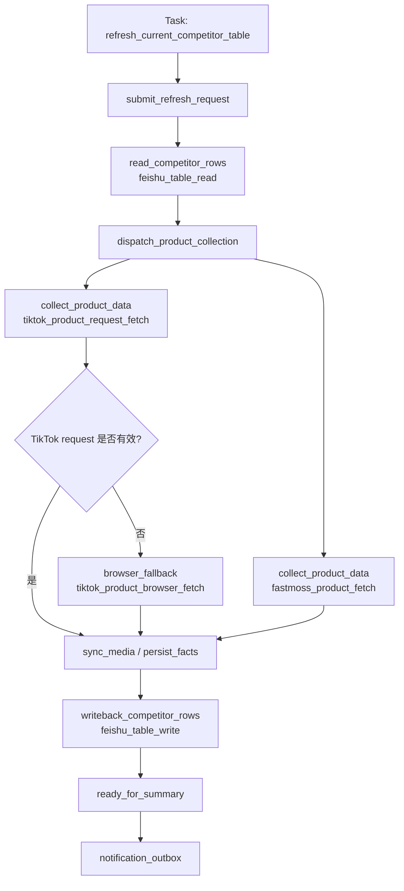
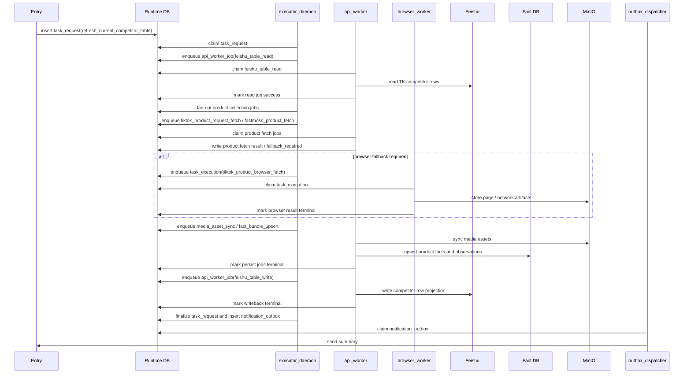
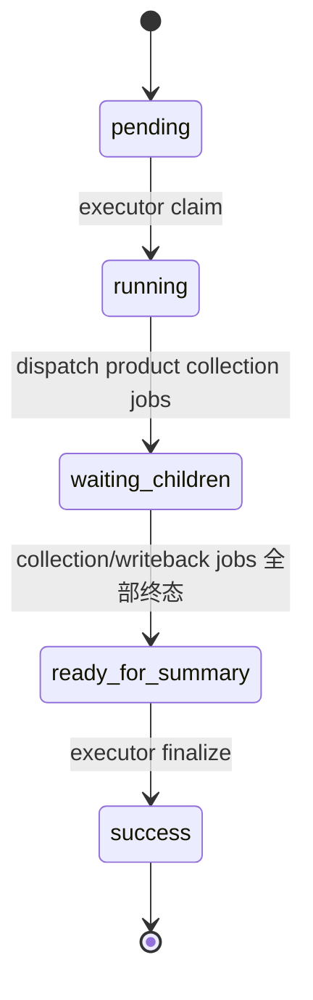
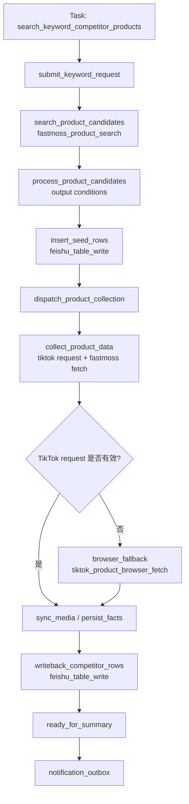
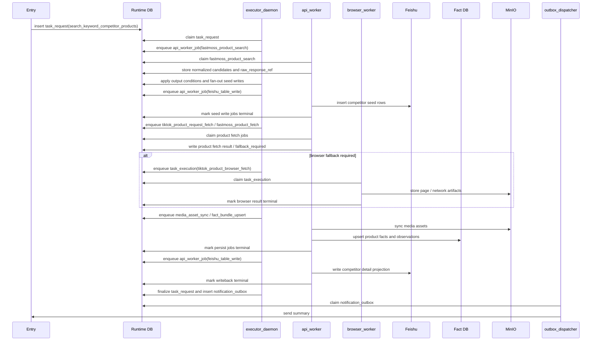

# 竞品表 Workflow 设计

日期: 2026-04-23

## 1. 流程定位

竞品表相关流程当前主要包含两类:

- `refresh_current_competitor_table`: 补全/刷新当前 `TK竞品收集` 中待处理记录。
- `search_keyword_competitor_products`: 按关键词在 FastMoss 搜索竞品，插入飞书种子行，再补全详情。

这两类都属于 `TK竞品收集` 的运营主表维护流程。重构后它们不再依赖业务专用的单行补全或种子行写入 handler，而是统一使用:

- `feishu_table_read`
- `feishu_table_write`
- `tiktok_product_request_fetch`
- `tiktok_product_browser_fetch`
- `fastmoss_product_search`
- `fastmoss_product_fetch`
- `media_asset_sync`
- `fact_bundle_upsert`

## 2. Task

| Task | 当前 task_code | 入口类 | 作用 |
| --- | --- | --- | --- |
| 竞品表刷新 | `refresh_current_competitor_table` | `RefreshCurrentCompetitorTableTask` | 读取竞品候选行，采集商品事实，写回竞品表投影 |
| 关键词竞品入库 | `search_keyword_competitor_products` | `SearchKeywordCompetitorProductsTask` | FastMoss 商品 API 搜索，通过通用飞书写入创建种子行，再采集商品事实并写回投影 |

## 3. Workflow: 竞品表刷新

目标 workflow_code 为 `refresh_current_competitor_table`。当前代码中的历史 `WorkflowSpec` ID 可以作为兼容实现事实保留，但目标 Runtime workflow contract 不在 code 名称中追加版本后缀。

### 3.1 Stage 设计

| Stage code | 作用 | Runtime 表 |
| --- | --- | --- |
| `submitted` | 创建顶层 `task_request` | `task_request` |
| `read_competitor_rows` | 读取和过滤 `TK竞品收集` 候选行 | `api_worker_job` |
| `dispatch_product_collection` | 根据候选行 fan-out 商品采集 job | `task_request` |
| `collect_product_data` | request-first 采集 TikTok / FastMoss 商品事实 | `api_worker_job` |
| `browser_fallback` | TikTok request 失效时执行页面采集 | `task_execution` |
| `sync_media` | 同步图片、封面等媒体资产 | `api_worker_job` |
| `persist_facts` | 写 Fact DB、MinIO artifact、raw links | `api_worker_job` |
| `writeback_competitor_rows` | 将事实和指标投影回竞品表 | `api_worker_job` |
| `ready_for_summary` | executor 汇总所有行结果并写通知 outbox | `task_request` / `notification_outbox` |

### 3.2 Job / Handler / Flow

| Job | item_code / job_code | Worker | Handler | Flow / Mapper |
| --- | --- | --- | --- | --- |
| 竞品表读取 | `feishu_table_read` | `api_worker` | `feishu_table_read` | `competitor_table_source_adapter` |
| TikTok 商品 request 采集 | `tiktok_product_request_fetch` | `api_worker` | `tiktok_product_request_fetch` | TikTok request flow |
| FastMoss 商品采集 | `fastmoss_product_fetch` | `api_worker` | `fastmoss_product_fetch` | FastMoss product flow |
| TikTok browser fallback | `tiktok_product_browser_fetch` | `browser_worker` | `tiktok_product_browser_fetch` | browser product page flow |
| 媒体同步 | `media_asset_sync` | `api_worker` | `media_asset_sync` | object store flow |
| 事实入库 | `fact_bundle_upsert` | `api_worker` | `fact_bundle_upsert` | `competitor_fact_relation_mapper` |
| 竞品表写回 | `feishu_table_write` | `api_worker` | `feishu_table_write` | `competitor_table_projection_mapper` |
| 通知发送 | outbox message | `outbox_dispatcher` | `outbox_dispatch` | 飞书/OpenClaw/console 发送 |

### 3.3 进程间调度时序图

本图只表达竞品表刷新在进程间如何调度，不展开 source adapter、projection mapper 或 handler 内部函数。

### 3.4 状态收敛

## 4. Workflow: 关键词竞品入库

目标 workflow_code 为 `search_keyword_competitor_products`。

### 4.1 Stage 设计

| Stage code | 作用 | Runtime 表 |
| --- | --- | --- |
| `submitted` | 创建顶层 `task_request` | `task_request` |
| `search_product_candidates` | 使用 FastMoss 商品搜索 API，根据 keyword/filter 获取候选商品 | `api_worker_job` |
| `process_product_candidates` | 读取 search 结果，按 output condition 去重、过滤、生成竞品种子投影 | `task_request` 编排阶段 |
| `insert_seed_rows` | 通过 `feishu_table_write` 创建竞品种子行 | `api_worker_job` |
| `dispatch_product_collection` | 根据成功 seed rows fan-out 商品采集 job | `task_request` |
| `collect_product_data` | request-first 采集 TikTok / FastMoss 商品事实 | `api_worker_job` |
| `browser_fallback` | TikTok request 失效时执行页面采集 | `task_execution` |
| `sync_media` | 同步图片、封面等媒体资产 | `api_worker_job` |
| `persist_facts` | 写 Fact DB、MinIO artifact、raw links | `api_worker_job` |
| `writeback_competitor_rows` | 将详情投影回竞品表 | `api_worker_job` |
| `ready_for_summary` | 汇总搜索、种子写入、商品采集和详情写回结果，并写通知 outbox | `task_request` / `notification_outbox` |

### 4.2 Job / Handler / Flow

| Job | item_code / job_code | Worker | Handler | Flow / Mapper |
| --- | --- | --- | --- | --- |
| FastMoss 商品搜索 | `fastmoss_product_search` | `api_worker` | `fastmoss_product_search` | FastMoss product search API flow |
| 飞书种子行写入 | `feishu_table_write` | `api_worker` | `feishu_table_write` | `competitor_seed_projection_mapper` |
| TikTok 商品 request 采集 | `tiktok_product_request_fetch` | `api_worker` | `tiktok_product_request_fetch` | TikTok request flow |
| FastMoss 商品采集 | `fastmoss_product_fetch` | `api_worker` | `fastmoss_product_fetch` | FastMoss product flow |
| TikTok browser fallback | `tiktok_product_browser_fetch` | `browser_worker` | `tiktok_product_browser_fetch` | browser product page flow |
| 媒体同步 | `media_asset_sync` | `api_worker` | `media_asset_sync` | object store flow |
| 事实入库 | `fact_bundle_upsert` | `api_worker` | `fact_bundle_upsert` | `competitor_fact_relation_mapper` |
| 竞品表详情写回 | `feishu_table_write` | `api_worker` | `feishu_table_write` | `competitor_table_projection_mapper` |
| 通知发送 | outbox message | `outbox_dispatcher` | `outbox_dispatch` | 飞书/OpenClaw/console 发送 |

### 4.3 进程间调度时序图

本图只表达关键词竞品入库在进程间如何调度，不展开 FastMoss 搜索条件解析、候选过滤或飞书字段映射。

## 5. 竞品表流程的 Job 颗粒度

竞品表刷新和关键词入库都不应该把整张表作为一个超大 job 执行。目标颗粒度是:

- 顶层 task 表示一次用户请求。
- `search_product_candidates` / `read_competitor_rows` 是阶段性 job 或编排动作。
- 每条竞品记录的商品采集、事实入库、飞书写回都是可审计的 runtime job。
- 父 task 基于所有子 job 状态汇总。

这样可以做到:

- 单行失败不拖垮整张表。
- 单行可独立重试。
- 默认走 request/API；浏览器 profile 只在 TikTok product fallback 时使用。
- 最终 summary 可以保留每行成功/失败/跳过状态。

## 6. 与选品分析、达人同步的关系

竞品表是当前商品运营主表:

- 选品分析可以将商品采集结果写回 `TK选品收集`，也可以通过字段映射与竞品表联动。
- 达人同步以 `TK竞品收集` 作为来源表，从竞品商品出发生成达人发现和达人详情 job。
- 竞品表刷新维护商品基础数据质量，达人同步维护商品到达人池的关系沉淀。
