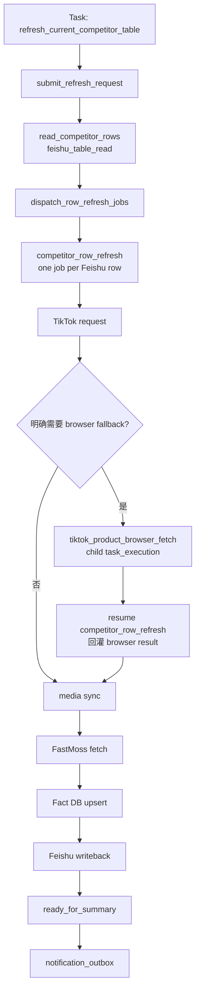
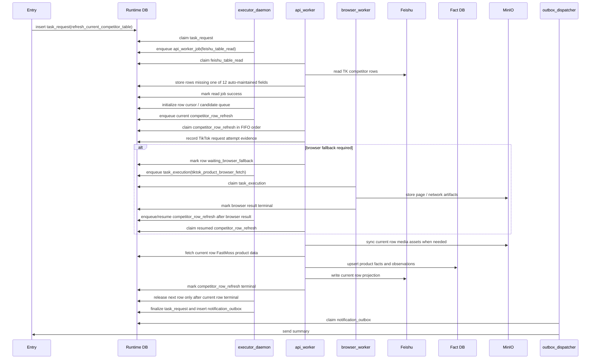
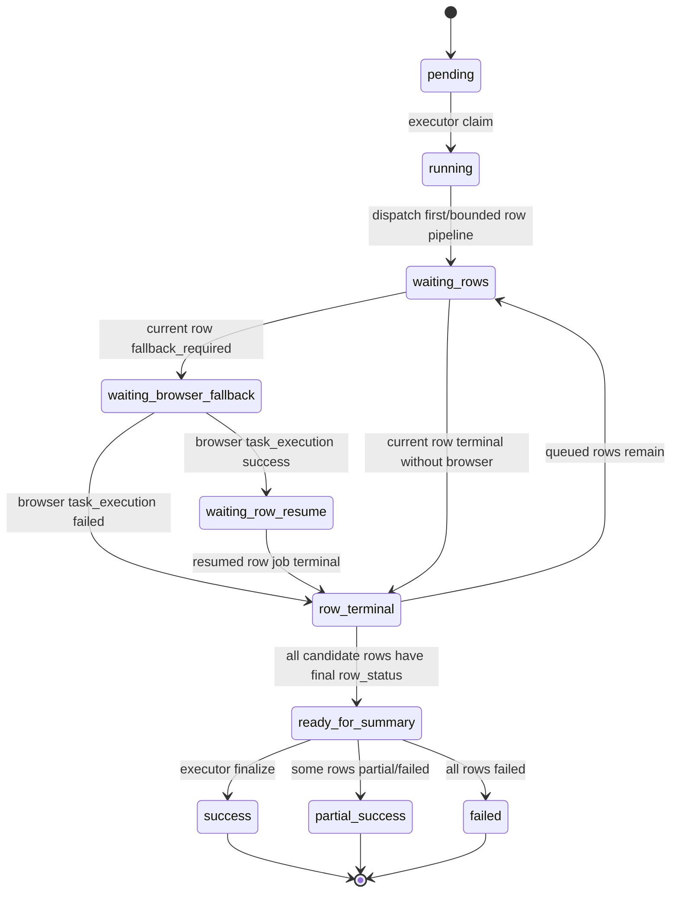
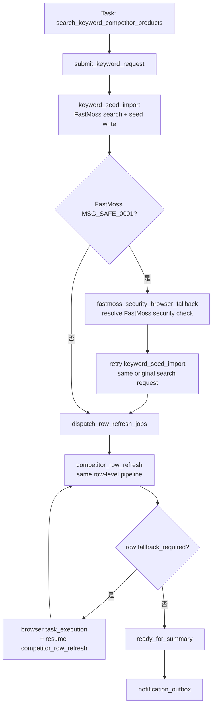
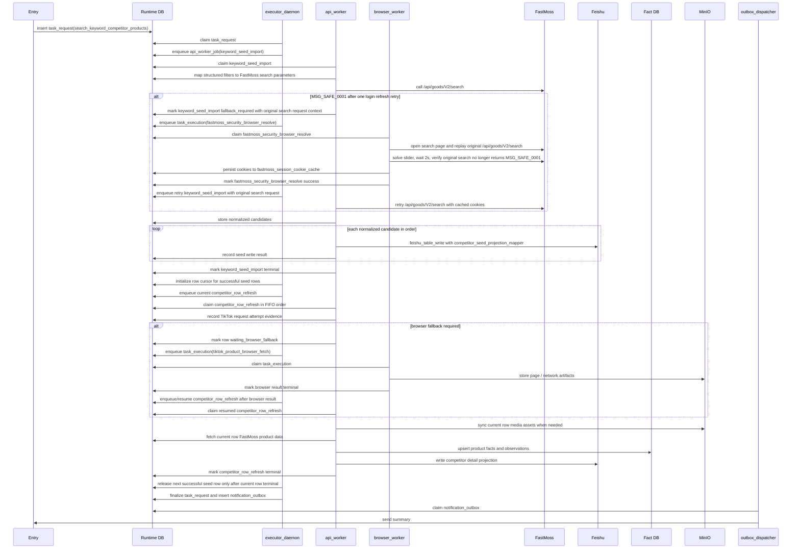

# 竞品采集与关键词搜索竞品写入 Workflow 设计

日期: 2026-04-23

## 1. 流程定位

竞品表相关 workflow 覆盖两类正式流程:

- 竞品采集（`refresh_current_competitor_table`）：补全/刷新当前 `TK竞品收集` 中待处理记录。
- 关键词搜索竞品写入（`search_keyword_competitor_products`）：按关键词在 FastMoss 搜索竞品，插入飞书种子行，再补全详情。

这两类都属于 `TK竞品收集` 的运营主表维护流程，统一使用通用表读写能力和行级 pipeline 能力:

- `feishu_table_read`
- `feishu_table_write`
- `fastmoss_product_search`
- `competitor_row_refresh`
- `tiktok_product_browser_fetch`

其中 `competitor_row_refresh` 是一条竞品记录的行级主 job，内部串行调用 TikTok request、media sync、FastMoss product fetch、Fact DB upsert 和飞书写回能力。`tiktok_product_browser_fetch` 和 `fastmoss_security_browser_resolve` 只在行级主 job 确认需要浏览器兜底时作为 child `task_execution` 创建；child execution 成功后必须 resume 回原行级 pipeline，不能直接计为行级成功。

本 workflow 只决定竞品表来源行如何筛选、每行采集什么商品、以及最终写回 `TK竞品收集` 的哪些字段。商品、店铺、媒体、FastMoss 指标、关系和 raw response 的事实入库必须遵守 [fact-db-schema-design.md](./fact-db-schema-design.md) 与 [workflow-design-guidelines.md](./workflow-design-guidelines.md) 的统一事实采集 contract，不能在竞品表流程里另写一套私有事实写入逻辑；商品媒体物化边界同时受 `contracts/facts/product-fact-collection.yaml` 约束。

## 2. Task

| Task | task_code | 入口类 | 作用 |
| --- | --- | --- | --- |
| 竞品采集 | `refresh_current_competitor_table` | `RefreshCurrentCompetitorTableTask` | 读取竞品候选行，采集商品事实，写回竞品表投影 |
| 关键词搜索竞品写入 | `search_keyword_competitor_products` | `SearchKeywordCompetitorProductsTask` | FastMoss 商品 API 搜索，通过通用飞书写入创建种子行，再采集商品事实并写回投影 |

## 3. Workflow: 竞品采集

目标 workflow_code 为 `refresh_current_competitor_table`。Runtime workflow contract 不在 code 名称中追加版本后缀。



### 3.1 Stage 设计

| Stage code | 作用 | Runtime 表 |
| --- | --- | --- |
| `submitted` | 创建顶层 `task_request` | `task_request` |
| `read_competitor_rows` | 读取 `TK竞品收集`，只输出 12 个自动维护字段存在空值且未被跳过的候选行 | `api_worker_job` |
| `dispatch_row_refresh_jobs` | 初始化 row cursor / queue，按 workflow 声明的 concurrency 派发行级采集 job；客户可见竞品采集默认 `row_pipeline_concurrency=1` | `task_request` |
| `refresh_competitor_rows` | 等待 active 行级 pipeline 产出最终行级结果；当前行经过 request、必要 browser fallback、resume、media、FastMoss、Fact DB、飞书写回后才允许放行下一行 | `api_worker_job` / `task_execution` |
| `ready_for_summary` | executor 汇总所有最终行级结果并写通知 outbox；不得存在未处理 fallback / active resume | `task_request` / `notification_outbox` |

### 3.2 Job / Handler / Flow

| Job | item_code / job_code | Worker | Handler | Flow / Mapper |
| --- | --- | --- | --- | --- |
| 竞品表读取 | `feishu_table_read` | `api_worker` | `feishu_table_read` | `competitor_table_source_adapter` |
| 行级竞品刷新 | `competitor_row_refresh` | `api_worker` | `competitor_row_refresh` | TikTok request flow -> media sync -> FastMoss product flow -> fact upsert -> `competitor_table_projection_mapper` |
| TikTok browser fallback | `tiktok_product_browser_fetch` | `browser_worker` | `tiktok_product_browser_fetch` | 由 workflow / 行级 fallback stage 派发，结果必须 resume 回原 `competitor_row_refresh` |
| FastMoss browser fallback | `fastmoss_security_browser_resolve` | `browser_worker` | `fastmoss_security_browser_resolve` | FastMoss provider 风控解除；成功后只允许原行级 pipeline 重试原 API 一次 |
| 通知发送 | outbox message | `outbox_dispatcher` | `outbox_dispatch` | 飞书/OpenClaw/console 发送 |

`competitor_row_refresh` 是行级 job_code。TikTok request、media sync、FastMoss fetch、Fact DB upsert 和飞书写回是该 job 内部步骤，不作为同一条飞书记录的并行 sibling jobs。browser fallback 使用独立 `task_execution`，因为它需要独占 browser profile 资源，但它必须引用当前行级 job 和触发 fallback 的 TikTok request attempt 或 FastMoss verification request。

TikTok request 必须实际发起并写入 attempt 证据。只有返回明确风控、登录、验证码、访问受限或缺少商品详情脚本时，`competitor_row_refresh` 才能返回 `fallback_required`，由 workflow 派发 `tiktok_product_browser_fetch` 子执行。商品不可访问、已下架或区域不可售是 request 阶段可判定的终态，应直接写回 `商品状态=已下架/区域不可售` 并停止该行后续 browser fallback、媒体同步和 FastMoss 补齐；普通网络失败、超时、5xx、429 或代理临时异常先按 retry policy 重试，不能直接 fallback。

### 3.2.1 行级逻辑阻塞与 Browser Fallback 通信

`competitor_row_refresh` 是业务上的行级主执行单元。Browser fallback 是物理上的独立 `task_execution`，但业务上仍属于当前竞品行 pipeline 的中间步骤。

约束:

- `fallback_required` 不是行级终态，不能计入父任务 success，也不能让 `ready_for_summary` 提前开始。
- Browser `task_execution` success 只证明浏览器能力完成，不等于竞品行刷新完成；必须 resume 回原 `competitor_row_refresh`，继续 media sync、FastMoss、Fact DB、Feishu writeback，并产出最终行级状态。
- Browser `task_execution` failed 只终结当前行，当前行按业务规则进入 `failed` 或 `partial_success`，然后 row cursor 才能继续下一行。
- `refresh_current_competitor_table` 默认 `row_pipeline_concurrency=1`；关键词竞品详情补齐也默认沿用同一行级 pipeline gate。后续如需 bounded concurrency，必须在 workflow contract 中声明幂等边界、FIFO/lane、summary gate 和并发上限。
- 父任务 summary 只能汇总最终行级业务结果；不能只按 `api_worker_job.status` / `task_execution.status` 汇总，也不能把 `fallback_required`、browser success 或 seed write success 当成详情采集 success。

### 3.2.2 行级 Job 颗粒度约束

这个 workflow 必须明确一条红线: handler 不是 job 颗粒度，API 调用更不是 job 颗粒度。

禁止的拆分方式:

- 因为已经有 `tiktok_product_request_fetch`、`fastmoss_product_fetch`、`media_asset_sync`、`fact_bundle_upsert`、`feishu_table_write` 这些现成 handler，就把它们各自提升成同一行记录的 sibling jobs。
- 因为希望观察每一次 API 调用结果，就把 TikTok request、FastMoss request、媒体同步、Fact DB 写入、飞书写回分别入队。
- 最终形成 `候选记录数 x 内部步骤数` 的 fan-out 队列模型。

为什么这是错误设计:

- 队列资源占用不再由业务筛选结果控制，而是被内部 API 步骤数放大。
- 同一行记录的严格执行顺序被拆散，队列只能看到一堆同层级 sibling jobs，很难表达“这一条记录的一次刷新”。
- browser fallback、media sync、Fact DB、飞书写回都要靠跨 job 拼接上下文，失败恢复和审计都变得脆弱。
- 同一行的重试、延迟、风控证据和最终结果被切碎，验收时无法直接回答“这条飞书记录到底完整跑到了哪一步”。

因此，本流程的正确约束是:

- 一条候选飞书记录最多创建一个 `competitor_row_refresh` 主 job。
- TikTok request、media sync、FastMoss、Fact DB upsert、飞书写回都是该主 job 的内部步骤，不得再按 API 调用粒度拆成 sibling jobs。
- 只有 `tiktok_product_browser_fetch` 这种确实需要独立 browser 资源生命周期的步骤，才允许作为 child `task_execution` 从主 job 内派生。
- 行级主 job 可以决定执行顺序和 fallback，但不能改变 TikTok / FastMoss / media / Fact DB 的统一事实 contract。
- 飞书写回 mapper 只负责业务投影字段，不负责事实入库。

### 3.2.3 竞品表 Adapter / Common 边界

本流程的飞书来源表业务语义由 `competitor_table_source_adapter` 承担，不能散落到 `common` helper、handler registry 或 skill submit 参数中。

`competitor_table_source_adapter` 必须内聚以下默认业务规则:

- `TK竞品收集` 的 12 个自动维护字段定义。
- 商品身份提取规则，例如 `SKU-ID` 在本流程中映射为商品 ID / `product_id`。
- 候选判断规则，即“只有 12 个自动维护字段存在空值的记录才进入刷新候选集”。
- `商品状态 = 已下架/区域不可售` 的跳过规则。
- 空行、坏行、重复行的丢弃与去重规则。
- `source_rows`、`candidate_keys`、`writeback_context`、`adapter_summary` 的构造规则。

`competitor_table_projection_mapper` 必须内聚以下目标表写回规则:

- 12 个自动维护字段的写回映射。
- 哪些字段允许系统覆盖，哪些字段默认不覆盖人工值。
- `商品状态` 不属于 12 个自动维护字段，也不参与 pending 判断。
- `商品状态` 属于系统状态投影；当商品明确不可访问、已下架或区域不可售时，mapper 必须允许写回 `商品状态=已下架/区域不可售`。
- `商品状态` 是系统覆盖字段，不属于人工保留字段；人工修改 `产品链接` 或 `SKU-ID` 后，需要人工清空该字段才重新进入抓取。

`feishu_table_read` / `feishu_table_write` 及其 `common` helper 只负责:

- `table_url` / `view_id` 解析。
- Feishu API 读写、分页、schema 校验和错误分类。
- 原始记录标准化和通用结果 envelope。

它们不负责:

- 定义竞品表的 12 个自动维护字段。
- 定义 `已下架/区域不可售` 的业务跳过语义。
- 决定一行是否属于待刷新候选。
- 决定竞品表写回时哪些字段属于系统默认覆盖。

因此，`refresh_current_competitor_table` 的外部入口只应提供真正可变的运行输入，例如 `table_url`、认证上下文、显式指定的 `record_ids` 或运营批准的强制重刷选项。像 `candidate_policy = missing_auto_maintained_fields` 这类用于启用默认竞品筛选语义的内部 mode，不应成为 skill / CLI 调用方必须传入的前置条件。若未来允许 override，workflow 文档必须单独列出允许的 override 项、默认值和缺省行为。

### 3.3 进程间调度时序图

本图只表达竞品采集在进程间如何调度，不展开 source adapter、projection mapper 或 handler 内部函数。行内普通 API 调用由 `competitor_row_refresh` 串行执行，不再由 executor 一次性拆出 TikTok / FastMoss / media / fact / writeback sibling jobs。



### 3.4 状态收敛



## 4. Workflow: 关键词搜索竞品写入

目标 workflow_code 为 `search_keyword_competitor_products`。



### 4.1 Stage 设计

| Stage code | 作用 | Runtime 表 |
| --- | --- | --- |
| `submitted` | 创建顶层 `task_request` | `task_request` |
| `keyword_seed_import` | 根据结构化关键词/filter 生成 FastMoss 搜索参数，调用通用搜索能力，按返回的 normalized candidates 顺序写入竞品种子行 | `api_worker_job` |
| `fastmoss_security_browser_fallback` | `keyword_seed_import` 遇到 FastMoss `MSG_SAFE_0001` 且登录刷新重试后仍失败时，派发浏览器解风控任务，成功后重新派发原始搜索请求 | `task_execution` |
| `dispatch_row_refresh_jobs` | 根据成功 seed rows 创建行级采集 job | `task_request` |
| `refresh_competitor_rows` | 使用与竞品采集一致的 `competitor_row_refresh` 行级 pipeline 补齐详情；row fallback 必须经 browser task_execution + resume 形成最终行级结果 | `api_worker_job` / `task_execution` |
| `ready_for_summary` | 汇总搜索、种子写入、商品采集和详情写回的最终业务结果；不得存在未处理 fallback / active resume | `task_request` / `notification_outbox` |

### 4.2 Job / Handler / Flow

| Job | item_code / job_code | Worker | Handler | Flow / Mapper |
| --- | --- | --- | --- | --- |
| 关键词种子写入 | `keyword_seed_import` | `api_worker` | `keyword_seed_import` | `keyword_search_parameter_mapper` -> `fastmoss_product_search` -> candidate iteration -> `feishu_table_write` + `competitor_seed_projection_mapper` |
| FastMoss API 风控解除 | `fastmoss_security_browser_resolve` | `browser_worker` | `fastmoss_security_browser_resolve` | 打开与原始失败 FastMoss API 对应的页面，围绕 `verification_request` 复现风控、解滑块、二次确认、保存 cookie cache，并验证原始 API 不再返回 `MSG_SAFE_0001` |
| 行级竞品刷新 | `competitor_row_refresh` | `api_worker` | `competitor_row_refresh` | 与竞品采集相同的行级 pipeline |
| TikTok browser fallback | `tiktok_product_browser_fetch` | `browser_worker` | `tiktok_product_browser_fetch` | 由 workflow / 行级 fallback stage 派发，结果必须 resume 回原 `competitor_row_refresh` |
| 通知发送 | outbox message | `outbox_dispatcher` | `outbox_dispatch` | 飞书/OpenClaw/console 发送 |

默认 outbox 文案由 `domains/tiktok/projections/outbox_message_projection.py` 生成，标题为 `关键词搜索竞品写入完成`。默认 `plain_text_detail` 必须包含关键词、候选数、种子写入/跳过/失败数、详情成功/失败数；明细只展示本次新插入并进入详情刷新的 SKU，`existing_record` / `skip_existing` / duplicate 这类跳过商品只进入汇总计数，不进入明细列表。可通过 task payload `outbox_message_format` 或 `outbox_message_template` 覆盖输出格式。

`keyword_seed_import` 是关键词搜索竞品写入前半段的业务 job。它不是新的 FastMoss 专用搜索能力，也不是新的飞书表格写入能力；它只负责把一次业务搜索请求串行编排为:

1. 使用 `keyword_search_parameter_mapper` 把结构化业务条件映射为 `fastmoss_product_search` payload。
2. 调用通用 `fastmoss_product_search`，取得 normalized candidates。
3. 按 candidates 顺序逐条调用 `feishu_table_write`，并指定 `competitor_seed_projection_mapper`、`write_mode=insert_if_absent`；候选写入之间默认间隔 1 秒。
4. 记录每条 candidate 的 seed write 结果，包括 `success`、`skip_existing`、`failed` 和失败原因。

`fastmoss_product_search` 的原始响应只作为排障证据保存，不直接进入竞品表 mapper。search 结果已经是 normalized candidates，因此本 workflow 不再单独定义 search result mapper；业务 job 只按返回顺序逐条调用种子写入。种子写入的已存在判断沿用 `competitor_seed_projection_mapper` 输出的 `upsert_key`: 优先使用 `SKU-ID` / `product_id`，缺少 product_id 时才按标准化 `产品链接` 兜底。

`max_candidates` 默认值为 `20`。当调用方传入 `max_candidates=0` 时，`fastmoss_product_search` 不按候选数截断，只在分页、FastMoss total、空页、无新商品、销量阈值或 `fastmoss_search_max_pages` 等停止条件触发时结束。真实翻页请求之间默认间隔 1 秒，避免连续请求触发 FastMoss 风控。

FastMoss API HTTP session 默认不继承系统代理配置，避免生产 daemon 因 macOS/system proxy 或本机调试代理被动走 `127.0.0.1` 代理。只有调用方显式设置 `fastmoss_trust_env=true` 或 `fastmoss_use_system_proxy=true` 时，FastMoss API 才允许读取环境/系统代理；browser worker 自身仍按 browser profile 的网络配置执行。

关键词搜索默认使用 FastMoss `order=2,2`，按“近 7 天销量倒序”处理。当请求带有 `output_conditions.business_conditions.min_day7_sold_count` 时，live 翻页必须按整页判断是否继续：如果当前页所有可解析商品的 `day7_sold_count` 最大值低于该阈值，handler 将停止继续请求后续页，并返回 `pagination.stop_reason=below_min_day7_sold_count`。该规则只在搜索排序明确为 7 日销量倒序时启用，避免非销量排序下提前截断造成漏采。

FastMoss 搜索接口返回 `MSG_SAFE_0001` 时，`fastmoss_product_search` 必须先执行一次现有登录态刷新策略: 清理 FastMoss cookies、重新登录、`ensure_logged_in()`，并重试原始 `/api/goods/V2/search` 请求。如果重试后仍返回 `MSG_SAFE_0001`，`keyword_seed_import` 不应把整个 workflow 直接终止为普通失败，而应返回 `fallback_required`，并保留原始失败请求上下文: method/path、keyword、region、page、pagesize、order、filters、referer、response_code、`data.id` 和 `ext.is_login`。

`fastmoss_security_browser_fallback` 是 FastMoss provider 级风控解除 stage。关键词搜索竞品写入场景中，它只能围绕原始失败的 FastMoss 搜索请求解除风控。browser worker 必须打开对应 FastMoss 搜索页，在同一登录态下触发同等 `/api/goods/V2/search` 请求；若出现滑块，使用 framework v0.3.8 `SliderCaptchaResolver` 处理，滑块消失后等待 2 秒并再次确认风控容器仍然消失。成功判据是浏览器中原始搜索接口不再返回 `MSG_SAFE_0001`，商品详情页不能作为搜索风控解除成功判据。商品详情页最多用于登录态 warm-up，不能作为搜索 stage 的验收条件。

同一能力也服务搜索后的详情补齐和其它 FastMoss provider API。`fastmoss_product_fetch`、`fastmoss_creator_fetch`、`fastmoss_shop_fetch`、`fastmoss_video_fetch` 遇到 `MSG_SAFE_0001` 时，API handler 必须返回 `fallback_required` 和脱敏 `verification_request`，其中包含原始失败的 FastMoss API 请求 method/path/params/referer/region/stage，例如商品详情 `/api/goods/v3/base`。workflow 或行级主 job 再派发 `fastmoss_security_browser_resolve`，browser handler 只验证该原始失败请求不再返回 `MSG_SAFE_0001`，成功后持久化 FastMoss cookies 并由原调用方重试原 handler 一次。

FastMoss 与 TikTok 商品页的验证码逻辑保持独立。TikTok browser fallback 使用 TikTok 商品页 selector 和商品页继续采集判据；FastMoss browser fallback 使用 FastMoss/Tencent selector profile，并且只验证原始 `/api/goods/V2/search`。两者可以共用 framework 的 audited slider resolver，但不能共用业务 handler、成功判据或 cookie/token 持久化策略。

安全验证码处理策略必须和业务触发条件对齐:

- 验证码等待只在已识别风控信号后发生。正常 FastMoss 搜索、正常 TikTok request、正常 TikTok 商品页 browser 采集不得进入滑块等待，也不得预先等待验证码元素。
- TikTok 商品页只有在 request-first 返回明确风控/验证码/访问受限信号，或 browser 页面检测到 TikTok 商品页 security check popup 时，才进入 TikTok slider resolver。
- FastMoss 只有在原始 FastMoss API 请求返回 `MSG_SAFE_0001`，且调用方决定进入 `fastmoss_security_browser_fallback` 时，才进入 FastMoss/Tencent slider resolver。搜索场景的原始请求是 `/api/goods/V2/search`；详情补齐场景可以是 `/api/goods/v3/base`，达人、店铺、视频场景使用各自原始失败 API。
- `image_timeout_ms` 是元素出现的最大等待，不是固定 sleep；背景图、拼图块和手柄提前可用时必须立刻识别和拖动。
- 滑动后最多轮询 5 秒验证结果；轮询中如果 popup 消失或成功 selector 出现，立即进入稳定性确认，不继续固定等待。
- 弹窗消失后延迟 2 秒二次确认；二次确认时 popup 仍消失才允许把当前滑块 attempt 标记为成功。
- 如果 TikTok 页面出现 `Unable to verify. Please try again.` 等失败态文本，或二次确认时弹层重新出现，本次 attempt 视为失败，应按 max attempts 和 refresh 策略进入下一次尝试。
- TikTok 商品页默认 `simple_target=false`，沿用已通过 Roxy/TikTok 实测的 framework `SliderCaptchaResolver` match 行为；FastMoss 由 FastMoss/Tencent selector profile 和对应 provider config 单独决定。FastMoss/Tencent 默认背景取 CSS `background-image` 原图、拼图取元素截图、`simple_target=false`，距离按目标中心点减当前拼图中心点计算。
- FastMoss/Tencent 失败重试前必须等待上一轮 loading/verifying 结束，刷新后必须等背景图、拼图块、手柄和起点 reset 都 ready 后再截图识别；不得在 spinner 画面或上一轮残留位置上进行 ddddocr 识别。默认拖动节奏为 36 steps、每步 0.012s，可通过 resolver config 覆盖。
- 审计必须记录 ddddocr 原始坐标、坐标换算、拖动距离、前后截图、目标位置截图、失败态文本、滑动后轮询结果和二次确认结果，便于区分识别错误、距离计算错误和鼠标执行异常。目标位置截图 artifact 名称为 `target_position_screenshot`，必须在鼠标移动到计算终点且释放之前捕获。

FastMoss browser fallback 的持久化对象是 FastMoss cookies，不是 API token。browser handler 成功后只把 FastMoss cookies 写入 `fastmoss_session_cookie_cache`；summary/log 只允许记录 `cookie_count`、`has_fd_tk`、`fd_tk_digest`、`verified_path` 等脱敏元数据，不得输出 cookie value。搜索 fallback 成功后，workflow 重新派发 `keyword_seed_import`，使用新的 dedupe suffix，例如 `after-fastmoss-security-browser-fallback`，再由 API handler 加载 cookie cache 并重新请求原始搜索接口。详情补齐 fallback 成功后，行级主 job 只重试原 FastMoss API handler 一次，例如 `fastmoss_product_fetch`。同一原始 FastMoss API 请求的 fallback 最多执行一次；再次失败时终态错误为 `fastmoss_security_verification_required`。

关键词竞品有两类 fallback，它们都不是 summary 终态:

- `keyword_seed_import` 的 FastMoss search fallback: `fallback_required` 表示等待 `fastmoss_security_browser_resolve` 或等待原始 `/api/goods/V2/search` 重试。browser success 只能 resume 原搜索，不能直接把关键词任务计为 success。
- 详情补齐阶段的 row fallback: 新增成功的竞品种子行进入 `competitor_row_refresh` 后，TikTok / FastMoss fallback 必须按第 3.2.1 节回灌到原行级 pipeline。seed write success 只表示种子行创建成功，不等于详情采集 success。

`ready_for_summary` 入口条件是: `keyword_seed_import` 已终态、所有成功 seed row 都有最终行级业务结果、且不存在未处理的 `fallback_required`、active browser execution 或 active resume job。

FastMoss session/cookie 恢复由 `infrastructure/fastmoss` 统一处理。业务 workflow 不判断 cookie 是否失效，也不直接保存 cookie value。平台层加载 cookie cache 时必须检查 `expires_at` 和 `last_auth_failed_at`；明确 auth 失效时在账号级 lock 内登录刷新并持久化新 cookie。若刷新后原请求仍 auth 失败，终态错误为 `fastmoss_session_conflict_or_external_login`，用于提示单点登录或外部登录冲突；该错误不进入 browser fallback。

TikTok 商品页 browser fallback 和 FastMoss browser fallback 的安全验证滑块都不在 workflow 内手写识别逻辑。TikTok 商品页通过 framework v0.3.8 `SliderCaptchaResolver` 暴露 selector、`DdddOcrCaptchaProvider` 参数、拖动修正参数和审计 artifact；FastMoss/Tencent 通过独立 FastMoss resolver 暴露同样的 provider config、拖动修正参数和审计 artifact。若默认 ddddocr 模型不足，可用 `dddd_trainer` 训练导出的 ONNX/charset 作为 provider config 注入。运行结果必须带 `slider_captcha_resolution` / `slider_resolution` 和 `slider_captcha_audit_artifact_refs`，让后续能区分“识别坐标错误”“CSS 缩放/距离计算错误”和“鼠标拖动执行异常”。

### 4.3 进程间调度时序图

本图只表达关键词搜索竞品写入在进程间如何调度，不展开 FastMoss 搜索条件解析、候选过滤或飞书字段映射。



## 5. 竞品表流程的 Job 颗粒度

竞品采集和关键词搜索竞品写入都不应该把整张表作为一个超大 job 执行，也不应该把同一条竞品记录机械拆成多个并行 API job。目标颗粒度是:

- 顶层 task 表示一次用户请求。
- `keyword_seed_import` / `read_competitor_rows` 是阶段性 job 或编排动作，只负责产生候选行和可继续处理的飞书行。
- 每条待处理竞品记录创建一个 `competitor_row_refresh` 行级主 job。
- `competitor_row_refresh` 内部按固定顺序串行执行 TikTok request、必要 browser fallback、media sync、FastMoss fetch、Fact DB upsert、飞书写回。
- browser fallback 是当前行级 job 派生并等待的子 `task_execution`，不是与当前行并行推进的 sibling job。
- `competitor_row_refresh` 绑定串行 queue lane，按 `available_at` / `queue_seq` / `created_at` FIFO claim；同一 lane 同一时刻最多一个 running job。
- TikTok、FastMoss 和飞书外部请求之间必须使用统一 request pacing 并记录 request start/end、pacing delay / cooldown 和 fallback reason 等 runtime evidence。默认 pacing 区间为 `0.5s` 到 `1.0s`，可通过全局配置、provider 级配置或 job payload 覆盖。
- 该流程覆盖的外部 HTTP request 包括 TikTok request-first 商品页请求、FastMoss 搜索/商品/达人接口、Feishu Bitable 读写、Feishu Drive 附件上传、Feishu 附件远程图片下载、media 远程素材下载、最终 outbox webhook / Feishu bot 通知。浏览器 fallback 内部的 Playwright/CDP 等待不属于 API request pacing 范畴，但其前后的 API request 仍必须记录 pacing evidence。
- 关键词搜索新增的 FastMoss 搜索风控 fallback 只刷新登录态 cookie cache，不改变商品事实、media asset、Fact DB upsert 的 ownership；这些事实采集边界仍以 `contracts/facts/product-fact-collection.yaml` 为准。
- 父 task 基于最终业务结果汇总：关键词种子导入结果 + 每条成功 seed row 的最终行级结果。`fallback_required`、browser child success、seed write success 都不能替代详情行终态。

FastMoss 商品详情指标必须按窗口语义映射，不按固定原始字段名猜测。`competitor_row_refresh` 对新写入/关键词搜索写入的商品默认请求 `goods.overview` 的 `d_type=7`、`d_type=28`、`d_type=90` 三个窗口，其中 `d_type=28` 继续用于常规商品概览、趋势和结构数据，`d_type=90` 用于补齐 `近90天销量`。`近90天销量` 来自 `goods.overview` 以 `d_type=90` 调用后的窗口汇总；mapper 优先使用标准化 `sales_90d`，其次使用同一窗口下的 `overview.real_sold_count`、`overview.sold_count`，最后才在 `chart_list` 满 90 天时按 `inc_sold_count` 求和。`raw_api_responses.request_params` 与 `product_metric_snapshots.window_days` 必须记录对应窗口，让后续审计能区分“7/28/90 天窗口汇总”和普通累计字段。不满 90 天的 `chart_list` 不能伪装成完整 90 天销量。

这样可以做到:

- 单行失败不拖垮整张表。
- 单行可独立重试。
- 同一行的 TikTok / FastMoss / 飞书请求顺序可审计，不会因为 worker 并发乱序。
- 默认走 request/API；浏览器 profile 只在 TikTok product fallback 或 FastMoss provider security resolve 时使用。
- 最终 summary 可以保留每行成功/失败/跳过状态。

## 6. 与选品采集、达人同步的关系

竞品表是当前商品运营主表:

- 选品采集可以将商品采集结果写回 `TK选品收集`，也可以通过字段映射与竞品表联动。
- 达人同步以 `TK竞品收集` 作为来源表，从竞品商品出发生成达人发现和达人详情 job。
- 竞品采集维护商品基础数据质量，达人同步维护商品到达人池的关系沉淀。

## 7. P0 Contract Payload / Result 样例

本节只冻结 workflow 与通用 handler/mapper 的边界，不要求 P0 实现真实 handler。

### 7.1 竞品采集: `feishu_table_read`

stage: `read_competitor_rows`

payload:

```json
{
  "request_id": "req-refresh-001",
  "task_code": "refresh_current_competitor_table",
  "workflow_code": "refresh_current_competitor_table",
  "stage_code": "read_competitor_rows",
  "source_table_ref": "feishu://mujitask/TK竞品收集",
  "field_names": ["产品链接", "SKU-ID", "图片", "标题", "节日", "卖家", "价格", "Fastmoss价格", "昨日销量", "近7天销量", "近90天销量", "记录日期", "商品状态"],
  "filter_spec": {
    "candidate_policy": "missing_auto_maintained_fields",
    "skip_product_status": ["已下架/区域不可售"]
  },
  "adapter_code": "competitor_table_source_adapter",
  "snapshot_policy": {
    "store_raw_rows": true
  }
}
```

说明:

- 上述 `field_names` 和 `filter_spec` 是 `refresh_current_competitor_table` 在 `read_competitor_rows` stage 传给 `feishu_table_read` 的有效 payload，不代表外部 skill / CLI 必须显式提交这些内部筛选参数。
- 这些默认值表达的是竞品表 workflow 的固定业务语义，应由 workflow 或 `competitor_table_source_adapter` 在内部保证稳定生效；外部入口缺省时不能静默退化成“读取整表后不过滤”的另一套语义。

result:

```json
{
  "source_rows": [
    {
      "source_record_id": "recRefresh001",
      "source_table_ref": "feishu://mujitask/TK竞品收集",
      "product_identity": {
        "product_id": "1731194997356205027",
        "product_url": "https://www.tiktok.com/shop/pdp/1731194997356205027",
        "normalized_product_url": "https://www.tiktok.com/view/product/1731194997356205027",
        "fastmoss_product_url": "https://www.fastmoss.com/zh/e-commerce/detail/1731194997356205027"
      },
      "missing_auto_fields": ["Fastmoss价格", "近7天销量", "近90天销量"],
      "writeback_context": {
        "target_table_ref": "feishu://mujitask/TK竞品收集",
        "record_id": "recRefresh001"
      },
      "source_snapshot_ref": "artifact://feishu/competitor/read/req-refresh-001/recRefresh001.json"
    }
  ],
  "candidate_keys": ["product:1731194997356205027"],
  "adapter_summary": {
    "input_row_count": 49,
    "source_row_count": 1,
    "skipped_complete_count": 41,
    "skipped_unavailable_count": 7
  }
}
```

### 7.2 竞品采集: Fact projection 到详情写回 / `competitor_row_refresh`

`competitor_row_refresh` 是单条竞品记录的主 job。它内部串行完成 TikTok request、必要 browser fallback、media sync、FastMoss fetch、Fact DB upsert 和飞书写回，只对外产出一个行级执行结果。截图可以作为内部 artifact 保存，但 `前台截图`、`Fastmoss截图` 不属于 12 个自动维护字段，也不参与待更新判断。

job result:

```json
{
  "source_record_id": "recRefresh001",
  "job_code": "competitor_row_refresh",
  "business_entity_key": "product:1731194997356205027",
  "step_timeline": [
    {
      "step": "tiktok_request",
      "status": "success",
      "attempted": true,
      "http_status": 200,
      "fallback_required": false,
      "fallback_reason": ""
    },
    {
      "step": "media_sync",
      "status": "success"
    },
    {
      "step": "fastmoss_fetch",
      "status": "success"
    },
    {
      "step": "fact_db_upsert",
      "status": "success"
    },
    {
      "step": "feishu_writeback",
      "status": "success"
    }
  ],
  "fact_upsert": {
    "persisted_entities": [
      "tiktok_product:1731194997356205027",
      "fastmoss_product:1731194997356205027"
    ],
    "persisted_observations": [
      "obs:fastmoss_product:1731194997356205027:day7_sold_count:2026-04-24"
    ]
  },
  "writeback_projection": {
    "fields": {
      "产品链接": {
        "text": "https://www.tiktok.com/shop/pdp/1731194997356205027",
        "link": "https://www.tiktok.com/shop/pdp/1731194997356205027"
      },
      "SKU-ID": "1731194997356205027",
      "图片": ["asset://product/1731194997356205027/main-image"],
      "标题": "Graduation party decoration set",
      "节日": "Graduation",
      "卖家": "Graduation Shop",
      "价格": "$12.99",
      "Fastmoss价格": "$12.99",
      "昨日销量": "38",
      "近7天销量": "412",
      "近90天销量": "2310",
      "记录日期": "2026-04-24"
    }
  },
  "runtime_evidence": {
    "created_browser_fallback": false,
    "browser_child_execution_id": "",
    "fallback_reason": "",
    "api_lane": "competitor_row_refresh",
    "claim_order": 1
  }
}
```

writeback payload:

```json
{
  "target_table_ref": "feishu://mujitask/TK竞品收集",
  "write_mode": "update_missing_auto_fields",
  "mapper_code": "competitor_table_projection_mapper",
  "records": [
    {
      "op": "update",
      "record_id": "recRefresh001",
      "business_entity_key": "product:1731194997356205027",
      "fields": {
        "产品链接": {
          "text": "https://www.tiktok.com/shop/pdp/1731194997356205027",
          "link": "https://www.tiktok.com/shop/pdp/1731194997356205027"
        },
        "SKU-ID": "1731194997356205027",
        "图片": ["asset://product/1731194997356205027/main-image"],
        "标题": "Graduation party decoration set",
        "节日": "Graduation",
        "卖家": "Graduation Shop",
        "价格": "$12.99",
        "Fastmoss价格": "$12.99",
        "昨日销量": "38",
        "近7天销量": "412",
        "近90天销量": "2310",
        "记录日期": "2026-04-24"
      },
      "source_context": {
        "source_record_id": "recRefresh001",
        "projection_type": "competitor_detail_writeback"
      }
    }
  ]
}
```

### 7.3 关键词搜索竞品写入: `keyword_seed_import`

stage: `keyword_seed_import`

`keyword_seed_import` 是关键词搜索竞品写入前半段的业务 job。它接收结构化业务搜索条件，内部先通过 `keyword_search_parameter_mapper` 生成通用 `fastmoss_product_search` 参数，再按搜索返回的 normalized candidates 顺序调用 `feishu_table_write` 写入种子行。飞书表写入不复用 search mapper，而是通过 `competitor_seed_projection_mapper` 把单条 normalized candidate 映射成 seed write record。

payload:

```json
{
  "request_id": "req-keyword-001",
  "task_code": "search_keyword_competitor_products",
  "workflow_code": "search_keyword_competitor_products",
  "stage_code": "keyword_seed_import",
  "source_table_ref": "feishu://mujitask/TK竞品收集",
  "search_request": {
    "search_mode": "keyword",
    "keyword": "Halloween decoration",
    "region": "US",
    "filters": {
      "sales_range": {
        "window_days": 7,
        "min": 200,
        "max": null
      }
    },
    "sort": {
      "field": "day7_sold_count",
      "direction": "desc",
      "source_order": "2,2"
    },
    "pagination": {
      "page": 1,
      "page_size": 10,
      "max_pages": 50,
      "stop_when_no_new_product": true
    },
    "output_conditions": {
      "max_candidates": 20,
      "dedupe_by": ["product_id", "normalized_product_url"],
      "business_conditions": {
        "min_day7_sold_count": 200
      }
    }
  },
  "seed_write": {
    "target_table_ref": "feishu://mujitask/TK竞品收集",
    "write_mode": "insert_if_absent",
    "mapper_code": "competitor_seed_projection_mapper"
  },
  "mapper_refs": {
    "search_parameter_mapper": "keyword_search_parameter_mapper",
    "seed_write_mapper": "competitor_seed_projection_mapper"
  }
}
```

result:

```json
{
  "search_parameters": {
    "handler_code": "fastmoss_product_search",
    "search_mode": "keyword",
    "keyword": "Halloween decoration",
    "region": "US",
    "sort": {
      "field": "day7_sold_count",
      "direction": "desc",
      "source_order": "2,2"
    }
  },
  "normalized_candidates": [
    {
      "source": "fastmoss",
      "product_id": "1731194997356205027",
      "normalized_product_url": "https://www.tiktok.com/shop/pdp/1731194997356205027",
      "fastmoss_product_url": "https://www.fastmoss.com/zh/e-commerce/detail/1731194997356205027",
      "title": "Halloween decoration",
      "image_url": "https://cdn.fastmoss.com/product.jpg",
      "metrics": {
        "day7_sold_count": 412,
        "sold_count": 2310,
        "relate_author_count": 35
      },
      "matched_conditions": {
        "min_day7_sold_count": true
      },
      "dedupe_keys": {
        "product_id": "1731194997356205027",
        "normalized_product_url": "https://www.tiktok.com/shop/pdp/1731194997356205027"
      },
      "quality_score": 1.0,
      "raw_item_ref": ""
    }
  ],
  "search_summary": {
    "candidate_count": 1,
    "applied": {
      "min_day7_sold_count": 1
    },
    "rejected_count": 0
  },
  "pagination": {
    "page": 1,
    "has_more": true,
    "next_page": 2
  },
  "raw_response_ref": "artifact://fastmoss/search/req-keyword-001/page-1.json",
  "seed_write_records": [
    {
      "op": "insert_if_absent",
      "business_entity_key": "product:1731194997356205027",
      "upsert_key": {
        "field": "SKU-ID",
        "value": "1731194997356205027"
      },
      "fields": {
        "SKU-ID": "1731194997356205027",
        "产品链接": {
          "text": "https://www.tiktok.com/shop/pdp/1731194997356205027",
          "link": "https://www.tiktok.com/shop/pdp/1731194997356205027"
        },
        "备注": "通过搜索关键字：Halloween decoration"
      },
      "source_context": {
        "keyword": "Halloween decoration",
        "search_candidate_rank": 1,
        "fastmoss_product_url": "https://www.fastmoss.com/zh/e-commerce/detail/1731194997356205027"
      }
    }
  ],
  "seed_write_results": [
    {
      "business_entity_key": "product:1731194997356205027",
      "product_id": "1731194997356205027",
      "record_id": "recSeed001",
      "op": "append",
      "status": "success"
    }
  ],
  "written_count": 1,
  "skipped_count": 0,
  "failed_count": 0,
  "target_record_ids": ["recSeed001"],
  "writeback_context": {
    "seed_record_id_by_product_id": {
      "1731194997356205027": "recSeed001"
    }
  }
}
```

### 7.4 关键词搜索竞品写入: 种子写入 mapper

search 参数映射和飞书写表映射是两个边界:

- `keyword_search_parameter_mapper`: 业务 filter / 关键词 -> `fastmoss_product_search` parameters。
- `competitor_seed_projection_mapper`: 单条 normalized candidate + 关键词上下文 -> `feishu_table_write` 单次写入 record。

`keyword_seed_import` 内部调用 `feishu_table_write` 时必须指定 `competitor_seed_projection_mapper`。该 mapper 的输入是一条 normalized candidate 加上关键词来源上下文，输出是一条可写入 `TK竞品收集` 的 seed write record。

mapper 输出必须满足:

- `op=insert_if_absent`
- `fields.SKU-ID={product_id}`
- `fields.产品链接` 为标准化 TikTok 商品链接
- `fields.备注=通过搜索关键字：{关键词}`
- `upsert_key` 优先使用 `SKU-ID`；缺少 product_id 时才使用标准化 `产品链接`
