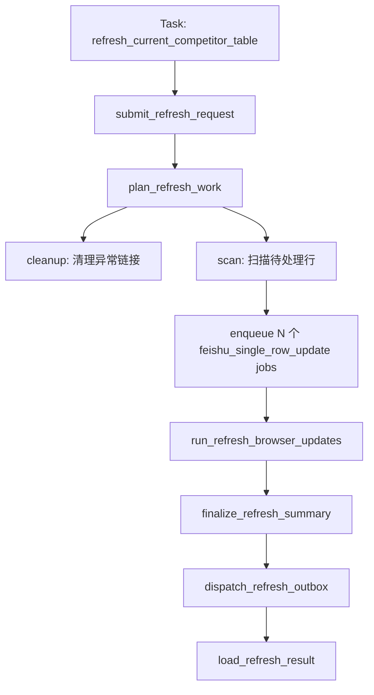
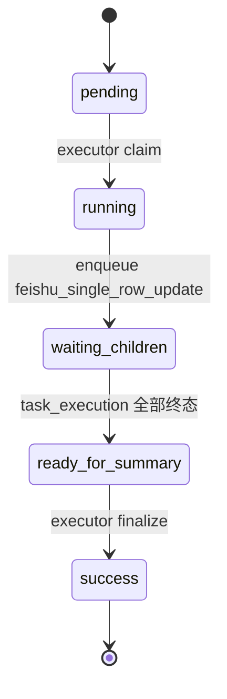
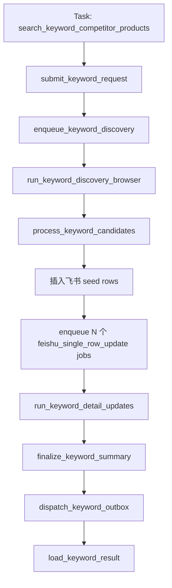

# 竞品表 Workflow 设计

日期: 2026-04-23

## 1. 流程定位

竞品表相关流程当前主要包含两类:

- `refresh_current_competitor_table`: 补全/刷新当前 `TK竞品收集` 中待处理记录。
- `search_keyword_competitor_products`: 按关键词在 FastMoss 搜索竞品，插入飞书种子行，再补全详情。

这两类都属于 `TK竞品收集` 的运营主表维护流程。它们使用同一套 Runtime DB、executor、browser worker、outbox dispatcher，但 job 拆分方式不同。

## 2. Task

| Task | 当前 task_code | 入口类 | 作用 |
| --- | --- | --- | --- |
| 竞品表刷新 | `refresh_current_competitor_table` | `RefreshCurrentCompetitorTableTask` | 清理链接、扫描待处理行、逐行补全竞品数据 |
| 关键词竞品入库 | `search_keyword_competitor_products` | `SearchKeywordCompetitorProductsTask` | FastMoss 关键词搜索、插入竞品种子行、补全详情 |

## 3. Workflow: 竞品表刷新

当前 workflow id 为 `refresh_current_competitor_table_v1`。

### 3.1 Stage 设计

| Stage | 作用 | Runtime 表 |
| --- | --- | --- |
| submit | 创建顶层 `task_request` | `task_request` |
| plan | 清理链接、扫描待处理行、派发逐行更新任务 | `task_request` + `task_execution` |
| browser update | browser worker 逐行采集/补全 | `task_execution` |
| finalize | executor 汇总所有行结果 | `task_request` |
| outbox | 分发最终通知 | `notification_outbox` |

### 3.2 Job / Handler / Flow

| Job | item_code / job_code | Worker | Handler | Flow |
| --- | --- | --- | --- | --- |
| 链接清理 | executor 内部编排动作 | `executor_daemon` | `_plan_refresh_request` | `run_tiktok_product_link_cleanup` |
| 待处理行扫描 | executor 内部编排动作 | `executor_daemon` | `_plan_refresh_request` | `run_feishu_pending_rows_scan` |
| 单行竞品补全 | `feishu_single_row_update` | `browser_worker` | `_run_browser_execution_once` | `run_feishu_single_row_update` |
| 父任务汇总 | `ready_for_summary` | `executor_daemon` | `_finalize_request_summary` | task executions summary |
| 通知发送 | outbox message | `outbox_dispatcher` | `dispatch_phase1_outbox_once` | 飞书/OpenClaw/console 发送 |

### 3.3 状态收敛

## 4. Workflow: 关键词竞品入库

当前 workflow id 为 `search_keyword_competitor_products_v1`。

### 4.1 Stage 设计

| Stage | 作用 | Runtime 表 |
| --- | --- | --- |
| submit | 创建顶层 `task_request` | `task_request` |
| keyword discovery | 派发 FastMoss 关键词发现 browser job | `task_execution` |
| candidate processing | 读取 discovery 结果并插入竞品种子行 | `task_request` 编排阶段 |
| detail updates | 对插入的竞品种子行派发单行补全 job | `task_execution` |
| finalize | 汇总发现、插入、详情补全结果 | `task_request` |
| outbox | 分发最终通知 | `notification_outbox` |

### 4.2 Job / Handler / Flow

| Job | item_code / job_code | Worker | Handler | Flow |
| --- | --- | --- | --- | --- |
| 关键词竞品发现 | `fastmoss_keyword_candidate_discovery` | `browser_worker` | `_run_browser_execution_once` | `run_fastmoss_keyword_candidate_discovery` |
| 飞书种子行插入 | executor 内部编排动作 | `executor_daemon` | `_resume_keyword_request` | `run_feishu_seed_row_insert` |
| 单行竞品补全 | `feishu_single_row_update` | `browser_worker` | `_run_browser_execution_once` | `run_feishu_single_row_update` |
| 父任务汇总 | `ready_for_summary` | `executor_daemon` | `_finalize_request_summary` | task executions summary |
| 通知发送 | outbox message | `outbox_dispatcher` | `dispatch_phase1_outbox_once` | 飞书/OpenClaw/console 发送 |

## 5. 竞品表流程的 Job 颗粒度

竞品表刷新和关键词入库都不应该把整张表作为一个超大 job 执行。当前更合理的颗粒度是:

- 顶层 task 表示一次用户请求。
- discovery / scan 是阶段性 job 或编排动作。
- 每条竞品记录的详情补全是一个 `feishu_single_row_update` browser job。
- 父 task 基于所有子 job 状态汇总。

这样可以做到:

- 单行失败不拖垮整张表。
- 单行可独立重试。
- 浏览器 profile 可以通过 resource lease 串行控制。
- 最终 summary 可以保留每行成功/失败/跳过状态。

## 6. 与选品分析、达人同步的关系

竞品表是当前商品运营主表:

- 选品分析可以将商品采集结果写回 `TK选品收集`，也可以通过字段映射与竞品表联动。
- 达人同步以 `TK竞品收集` 作为来源表，从竞品商品出发生成达人发现和达人详情 job。
- 竞品表刷新维护商品基础数据质量，达人同步维护商品到达人池的关系沉淀。

