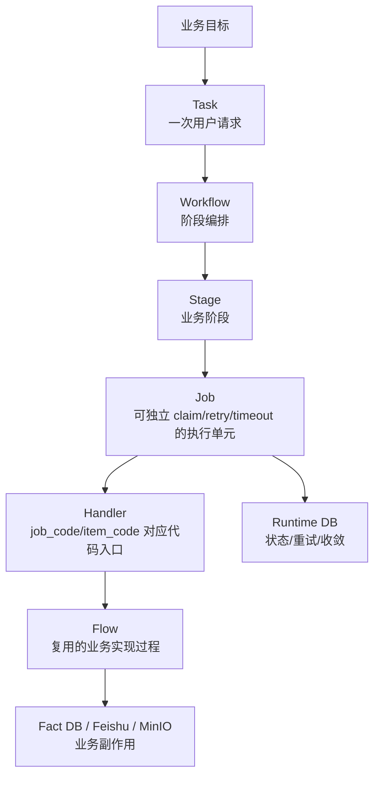
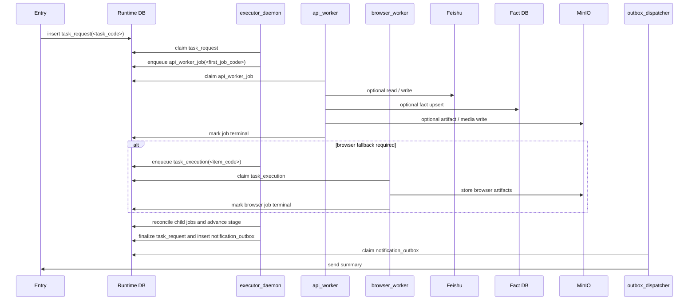
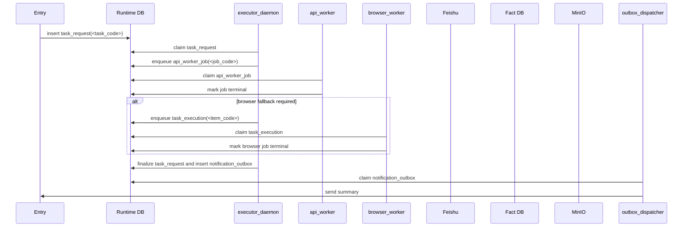

# 新增 Workflow 设计与拆分规范

日期: 2026-04-23

## 1. 这份文档放什么

本文是新增业务流程的统一设计约束。任何新的业务进入系统前，都应先按本文完成拆分和评审，再落到具体 workflow 文档和代码实现。

文档职责划分:

| 内容 | 放置位置 |
| --- | --- |
| 通用拆分原则、workflow 必填内容、job 颗粒度约束 | 本文 |
| 系统整体角色、executor/worker/supervisor/watchdog 边界 | [current-system-architecture-design.md](./current-system-architecture-design.md) |
| Runtime 表、状态机、claim/lease/retry/watchdog 字段 | [runtime-db-schema-design.md](./runtime-db-schema-design.md) |
| Fact 表、ERD、upsert/idempotency 规则 | [fact-db-schema-design.md](./fact-db-schema-design.md) |
| 某一个具体业务流程 | `workflow-<business-name>-design.md` |

核心约束:

> 新增业务流程不能直接从“写一个 handler”开始，必须先定义 Task、Workflow、Stage、Job、Handler、Flow 的边界。

> `task_code`、`workflow_code`、`stage_code`、`job_code`、`handler_code` 是稳定路由键，不在名称里追加 `v1`、`v2`、`stage1`、`stage2B` 这类版本或顺序信息。兼容演进通过新增可选字段、`contract_revision` 元数据、adapter 或迁移策略表达。

## 2. 新增业务流程的设计顺序

新增业务应按下面顺序拆:



推荐步骤:

1. 先定义业务目标和边界。
2. 定义顶层 `Task`，明确输入、输出、触发方式、幂等键。
3. 定义 `Workflow`，明确有哪些 stage、每个 stage 的进入和退出条件。
4. 定义每个 stage 会生成哪些 `Job`。
5. 为每类 job 明确 worker 类型、handler、payload、result、retry、timeout、idempotency。
6. 明确父子任务如何收敛，最终 summary 如何生成。
7. 明确会写哪些 Runtime 表、Fact 表、飞书表和对象存储。
8. 明确失败、无响应、超时、部分成功时如何兜底。

## 2.1 命名与版本约束

所有 workflow contract 都必须使用稳定、可读、可搜索的语义化 code。

### 2.1.1 稳定 Code 规则

| 对象 | 命名规则 | 示例 |
| --- | --- | --- |
| `task_code` | 业务入口语义，snake_case | `search_keyword_competitor_products` |
| `workflow_code` | 通常与 `task_code` 一致，表达稳定编排身份 | `tiktok_fastmoss_product_ingest` |
| `stage_code` | 动词 + 业务对象，snake_case | `read_selection_rows`、`collect_product_data` |
| `job_code` / `item_code` | worker 路由键，表达执行能力 | `fastmoss_product_search`、`feishu_table_write` |
| `handler_code` | handler registry 路由键，通常与通用 `job_code` 一致 | `fact_bundle_upsert` |
| mapper / adapter | 表级或业务级语义组件 | `selection_table_source_adapter`、`competitor_table_projection_mapper` |

禁止:

- `fastmoss_product_search_v1`
- `fastmoss_product_search_v2`
- `stage1`
- `stage_2b`
- `step1_handler`

允许:

- 在 contract 文档里记录 `contract_revision`，但它不是路由键。
- 为破坏性变更新增迁移 adapter 或新 handler，但不能在旧 handler 的字段语义上静默破坏兼容。
- 当前代码中历史 `WorkflowSpec` 的兼容 ID 可以保留为实现事实，目标 Runtime workflow 文档统一使用稳定 `workflow_code`。

### 2.1.2 Stage Code 规范

Stage 是 workflow 的业务阶段，不是步骤编号、函数名、adapter 名或 UI 文案。

推荐 stage code:

| 阶段类型 | 推荐命名 | 说明 |
| --- | --- | --- |
| 来源读取 | `read_<source>_rows` | 读取飞书源表或来源数据 |
| 候选搜索 | `search_<entity>_candidates` | 通过搜索 API 得到候选 |
| 候选处理 | `process_<entity>_candidates` | 去重、过滤、生成后续 job payload |
| 派发子任务 | `dispatch_<entity>_jobs` / `dispatch_product_collection` | fan-out 子 job |
| 数据采集 | `collect_<entity>_data` / `collect_<entity>_detail` | request/API 采集 |
| 浏览器兜底 | `browser_fallback` | 仅在 request 明确要求 fallback 时进入 |
| 媒体同步 | `sync_media` | 上传或绑定图片、头像、封面 |
| 事实入库 | `persist_facts` | 写 Fact DB、raw links、observations |
| 业务写回 | `writeback_<target>_rows` / `write_<target>` | 飞书或业务投影写回 |
| 父级汇总 | `ready_for_summary` | executor 生成 summary/outbox |

Stage 文档必须把 adapter/mapper 放在 Job / Handler / Flow 映射里，不能把 adapter/mapper 写成 stage 名称。比如 `read_selection_rows` 可以派生 `feishu_table_read`，并在 Job 映射里注明它调用 `selection_table_source_adapter`。

### 2.1.3 Stage Contract 示例

标准 stage 行应该包含“业务阶段 + 编排动作 + 派生 job + 退出条件”，不包含实现函数名或步骤编号。

| Stage code | 进入条件 | 编排动作 | 派生 Job | 退出条件 |
| --- | --- | --- | --- | --- |
| `read_selection_rows` | 开启 TK selection table mode | 派发飞书读取 job，读取源行和写回上下文 | `feishu_table_read` | 得到 product candidates 或确认跳过 |
| `collect_product_data` | 有 product url / product id | 派发 request-first 商品采集 job | `tiktok_product_request_fetch`、`fastmoss_product_fetch` | 商品采集成功、失败或要求 fallback |
| `browser_fallback` | `tiktok_product_request_fetch` 返回 `fallback_required=true` | 派发浏览器兜底 job | `tiktok_product_browser_fetch` | browser job 终态 |
| `persist_facts` | 已得到 normalized facts | 写 Fact DB、raw links 和 observations | `fact_bundle_upsert` | facts 写入完成 |
| `writeback_selection_rows` | 有来源飞书记录且需要写回 | 派发飞书写回 job | `feishu_table_write` | 写回 job 终态 |

对应 Job / Handler / Flow 映射:

| Stage code | Job code | Handler code | Adapter / Mapper / Flow |
| --- | --- | --- | --- |
| `read_selection_rows` | `feishu_table_read` | `feishu_table_read` | `selection_table_source_adapter` |
| `collect_product_data` | `tiktok_product_request_fetch` | `tiktok_product_request_fetch` | TikTok request flow |
| `collect_product_data` | `fastmoss_product_fetch` | `fastmoss_product_fetch` | FastMoss product flow |
| `writeback_selection_rows` | `feishu_table_write` | `feishu_table_write` | `selection_table_projection_mapper` |

## 3. Workflow 必须包含的内容

每个具体 workflow 文档都必须包含以下内容。

### 3.1 基本信息

| 字段 | 必填 | 说明 |
| --- | --- | --- |
| `task_code` | 是 | 顶层任务类型，executor 用它选择 workflow |
| `workflow_code` | 是 | workflow 编排编码 |
| `contract_revision` | 可选 | 兼容演进元数据，不写进 `workflow_code` / `stage_code` / `job_code` |
| `business_owner` | 建议 | 业务负责人或模块负责人 |
| `trigger_mode` | 是 | manual / schedule / webhook / cli |
| `source_channel_code` | 建议 | OpenClaw、CLI、定时任务等来源 |
| `reply_target` | 视情况 | 最终 outbox 回复目标 |

### 3.2 业务边界

必须写清楚:

- 这个 workflow 解决什么业务问题。
- 输入从哪里来。
- 输出写到哪里。
- 哪些事情不属于这个 workflow。
- 是否允许部分成功。
- 是否需要人工审核或人工补偿。

### 3.3 输入输出

必须定义:

| 内容 | 说明 |
| --- | --- |
| `payload_json` schema | 顶层 Task 输入 |
| stage cursor | workflow 推进游标 |
| job payload schema | 每类 job 的最小输入 |
| job result schema | 每类 job 的成功结果 |
| summary schema | 顶层任务最终摘要 |
| error schema | 标准化错误字段 |

约束:

- job payload 只放执行所需的最小稳定数据。
- 大对象、截图、原始响应、媒体文件不放 payload，放 MinIO/object store 或 Fact DB。
- payload 中不要长期依赖易变外部页面字段。

### 3.4 Stage 设计

每个 stage 必须说明:

| 内容 | 说明 |
| --- | --- |
| `stage_code` | 阶段编码，必须是语义化 snake_case |
| 进入条件 | 什么状态下进入 |
| 执行动作 | executor 在该阶段做什么 |
| 派生 job | 生成哪些 job |
| 退出条件 | 什么时候进入下一阶段 |
| 失败策略 | 阶段失败如何处理 |
| 是否可重复推进 | executor 重跑该 stage 是否安全 |

Stage 是业务阶段，不是代码函数。比如:

- 飞书读取
- 商品数据采集
- 达人详情采集
- 飞书写回
- summary/outbox

Stage 不能用 `Stage 1`、`Stage 2B` 或 adapter 名称表达。下面是推荐写法:

| 不推荐 | 推荐 |
| --- | --- |
| `Stage 1: feishu_table_read + selection_table_source_adapter` | `read_selection_rows` |
| `Stage 2: tiktok_product_request_fetch + fastmoss_product_fetch` | `collect_product_data` |
| `Stage 2B: tiktok_product_browser_fetch` | `browser_fallback` |
| `competitor_table_projection_mapper_stage` | `writeback_competitor_rows` |

### 3.5 Job 设计

每类 job 必须说明:

| 内容 | 说明 |
| --- | --- |
| `job_code` / `item_code` | handler 路由键 |
| worker 类型 | `api_worker` / `browser_worker` / `outbox_dispatcher` |
| Runtime 表 | `api_worker_job` / `task_execution` |
| business key | 业务定位键 |
| dedupe key | 去重键 |
| payload schema | 最小输入 |
| result schema | 成功输出 |
| side effects | 会写哪些外部系统 |
| retry policy | 最大次数、重试间隔、可重试错误 |
| timeout policy | 单次执行最大时间 |
| progress policy | 何时更新 `last_progress_at` / `progress_stage` |
| idempotency policy | 重复执行如何保证不重复写 |
| terminal statuses | 成功、跳过、失败、硬失败如何表达 |

### 3.6 Handler 与 Flow

必须区分:

```text
Job = Runtime DB 里的一条待执行数据
Handler = 处理某类 job 的代码入口
Flow = handler 内部复用的业务过程
```

约束:

- worker 只根据 `job_code` / `item_code` 找 handler，不理解完整业务流程。
- handler 可以调用一个或多个 flow，但不能承担父 workflow 的全局编排职责。
- flow 可以复用，但不能偷偷读写 Runtime 状态推进父任务，除非它明确属于该 handler 的职责。

### 3.7 进程间调度时序图

每个具体 workflow 文档必须包含一张“进程间调度时序图”。这张图用于说明业务从入口进入 Runtime DB 后，如何在 `executor_daemon`、`api_worker`、`browser_worker`、`outbox_dispatcher` 和外部系统之间交接。

必须表达:

- 入口如何创建 `task_request`。
- `executor_daemon` 在每个关键 stage 派发哪些 `api_worker_job` 或 `task_execution`。
- `api_worker` / `browser_worker` 如何 claim job，并把 result/status 写回 Runtime DB。
- request-first / browser-fallback 的分支条件。
- Fact DB、Feishu、MinIO/object store 的写入发生在哪个 worker 进程里。
- Reconciler / executor 如何根据 Runtime DB 推进下一 stage 或最终 summary。
- `notification_outbox` 何时创建，`outbox_dispatcher` 如何发送最终结果。

不应该表达:

- handler 内部每个函数调用。
- adapter/mapper 的字段级映射细节。
- 某个外部 API 的每一次 HTTP 请求。
- Flow 内部的普通业务判断，除非它影响跨进程调度。

通用模板:



## 4. 拆分原则

### 4.1 Task 拆分原则

一个 Task 应代表一次用户可理解的顶层业务请求。

适合成为 Task:

- 用户点击一次“同步达人池”。
- 定时任务发起一次“刷新竞品表”。
- CLI 提交一次“选品分析”。

不适合成为 Task:

- 某一次 HTTP 请求。
- 某一个函数调用。
- 某一个内部字段更新。

Task 必须具备:

- 可审计的输入。
- 可查询的最终状态。
- 可生成 summary。
- 可通过 outbox 回复。
- 可在进程重启后继续推进或明确失败。

### 4.2 Stage 拆分原则

Stage 应按业务阶段拆，不按代码文件拆。

应该拆 stage 的信号:

| 信号 | 说明 |
| --- | --- |
| 需要等待一批子 job 完成 | stage 边界成立 |
| 输入来源和输出目标明显不同 | stage 边界成立 |
| 失败策略不同 | stage 边界成立 |
| 需要人工可见的业务进度 | stage 边界成立 |
| 能力层不同 | 可能需要 stage 边界，例如 API 到 Browser |

不应该拆 stage 的情况:

- 只是同一个 handler 内部的两个函数。
- 只是字段转换、参数拼装、日志打印。
- 没有独立状态意义。

### 4.3 Job 拆分原则

Job 是 Runtime DB 中可被 worker 独立 claim、retry、timeout、审计的最小调度单元。

一个动作适合拆成 job，当它满足任意一条:

- 需要独立重试。
- 需要独立超时。
- 需要独立并发。
- 需要独立记录成功/失败。
- 需要独立占用资源，例如 browser profile。
- 失败后不应拖垮整批数据。
- 执行时间长或容易卡住。
- 有外部副作用，需要清晰幂等边界。

不建议机械地把每个 HTTP 请求拆成 job。一个 job 可以包含多个 API 调用，只要它们属于同一个可安全重试的业务单元。

### 4.4 Handler 拆分原则

Handler 应按 job 类型拆。

合理的 handler:

- `feishu_table_read`
- `fastmoss_product_fetch`
- `fastmoss_creator_fetch`
- `tiktok_product_browser_fetch`
- `feishu_table_write`

不合理的 handler:

- `do_everything_handler`
- `sync_all_handler`
- `orchestrate_sync_tk_influencer_pool`
- `orchestrate_tiktok_fastmoss_product_ingest`
- `run_sync_tk_influencer_pool`
- `step1_handler`、`step2_handler` 这种没有业务语义的命名。

`orchestrate_*` / `run_*_workflow` / `run_sync_*` 这类名称表达 workflow 编排入口，不是 handler。它们不能作为 `handler_code`、handler registry key、job handler 文件名或目标 handler contract 出现。目标文档如需说明历史实现，只能放在“当前实现事实 / 兼容入口”说明中，不能放入目标 Job / Handler 映射表。

Handler 必须做到:

- 输入来自 job payload。
- 输出写回 job result。
- 异常被 supervisor 捕获并标准化。
- 可重复执行时不会制造重复业务数据。

### 4.5 Flow 拆分原则

Flow 是业务实现复用层，不是调度层。

适合放入 flow:

- FastMoss 商品详情采集。
- TikTok 数据标准化。
- 飞书字段映射。
- 媒体上传和绑定。
- Fact DB upsert 组合逻辑。

不适合放入 flow:

- 从 Runtime DB claim job。
- 推进父 Task stage。
- 扫描 Watchdog。
- 发送 outbox。

## 5. Job 颗粒度决策表

| 问题 | 是 | 否 |
| --- | --- | --- |
| 失败后是否可以整体重试 | 可以放同一个 job | 需要拆分或加 checkpoint |
| 是否会写飞书、Fact DB、MinIO 等外部系统 | 必须定义幂等策略 | 可按执行便利性合并 |
| 是否需要逐条知道成功/失败 | 按业务实体拆 job | 可以批量处理 |
| 是否耗时长或容易卡住 | 拆小并设置 timeout/progress | 可合并 |
| 是否需要并行 | 拆成多个 job | 可以串行 |
| 是否需要 browser profile | 放 `task_execution` 给 browser worker | 放 `api_worker_job` |
| 是否必须严格顺序 | 用 stage cursor 或父子 job 控制 | fan-out 并发 |
| 重复执行是否会产生重复外部数据 | 拆分或补幂等键 | 可以复用 retry |

## 6. 常见拆分模式

### 6.1 表读取 + fan-out + finalizer

适合飞书表驱动的批处理。

```text
Task:
  sync_xxx_table

read_source_rows:
  table_read job 读取候选记录

dispatch_entity_jobs:
  每条记录生成 entity job

finalize_entity_jobs:
  finalizer 汇总 entity jobs

ready_for_summary:
  summary + outbox
```

适用:

- 选品分析。
- 竞品表刷新。
- 达人同步。

### 6.2 父 job + 子 job

适合一条业务记录会派生多条明细任务。

```text
product job:
  发现 N 个达人
  upsert N 个 author jobs
  进入 detail_pending

author jobs:
  每个达人独立采集和写回

product finalizer:
  author jobs 收敛后标记 product completed/hard_failed
```

适用:

- 商品到达人。
- 店铺到商品。
- 关键词到候选商品。

### 6.3 API 优先 + Browser fallback

适合 API 采集失败时用浏览器兜底。

```text
api job:
  调 FastMoss/TikTok API
  如果成功，写 Fact DB
  如果需要浏览器，生成 browser execution

browser execution:
  使用 profile/CDP 采集
  写 result

reconciler:
  汇总 API 和 browser 结果
```

适用:

- TikTok 商品页面补全。
- 风控下 API 无法覆盖的字段。

### 6.4 写回单独成 job

适合外部写回副作用比较重的流程。

```text
collect job:
  采集并写 Fact DB

writeback job:
  基于 record_id 或业务唯一键写回飞书
```

适用:

- 飞书写回需要单独限流。
- 写回失败不希望重跑采集。
- 写回需要人工审核或补偿。

## 7. 失败和兜底约束

每个 workflow 必须定义失败策略:

| 场景 | 必须定义 |
| --- | --- |
| 外部 API 超时 | 重试次数、重试间隔、是否降级 |
| 浏览器卡死 | hard timeout、resource lease 回收 |
| worker 崩溃 | lease 过期后如何恢复 |
| job 有 heartbeat 但无业务进展 | `last_progress_at` 超时策略 |
| 飞书写回成功但 Runtime 未标记成功 | 重试时如何避免重复写 |
| 部分子 job 失败 | 父任务是否允许部分成功 |
| attempts 耗尽 | failed / hard_failed / dead letter 规则 |

约束:

- 任何 running job 都必须能被 lease 或 watchdog 回收。
- 任何有外部副作用的 job 都必须能安全重试，或者明确不可重试并进入人工补偿。
- 父任务不能依赖内存 callback 收敛，必须基于 Runtime DB 状态聚合。
- Outbox 失败不应反向污染主业务成功状态。

## 8. 幂等约束

新增 workflow 必须至少定义三类幂等键:

| 层 | 字段 | 例子 |
| --- | --- | --- |
| Task | `idempotency_key` | 同一次用户触发或同一批次 |
| Job | `dedupe_key` / 领域唯一键 | `request_id + record_id + product_id` |
| Fact/外部写入 | 业务唯一键 | `product_id`, `creator_key`, `record_id`, `object_key` |

设计要求:

- Runtime 去重只能避免重复派发，不能替代外部系统幂等。
- Fact DB 必须使用 upsert 承受重复执行。
- 飞书创建类动作必须先查重或保存 `target_record_id`。
- MinIO/object store 应使用稳定 object key，允许重复覆盖或跳过。

## 9. 新增 Workflow 文档模板

新增具体流程时，建议创建:

```text
docs/arch/workflow-<business-name>-design.md
```

模板:

````markdown
# <业务名> Workflow 设计

日期: YYYY-MM-DD

## 1. 流程定位

## 2. Task

- task_code:
- trigger_mode:
- payload_json:
- idempotency_key:
- summary:
- outbox:

## 3. Workflow

- workflow_code:
- contract_revision: optional metadata, not part of code names
- stages:
- stage_cursor:
- terminal statuses:

## 4. Stage 设计

| Stage code | 进入条件 | 动作 | 派生 Job | 退出条件 | 失败策略 |
| --- | --- | --- | --- | --- | --- |

## 5. Job 设计

| Job | Runtime 表 | Worker | Handler | Payload | Result | Retry | Timeout | Idempotency |
| --- | --- | --- | --- | --- | --- | --- | --- | --- |

## 6. Handler 与 Flow 边界

## 7. 进程间调度时序图



## 8. 数据写入

- Runtime DB:
- Fact DB:
- Feishu:
- MinIO/object store:

## 9. 状态收敛

## 10. 失败兜底

## 11. 观测与 artifact
````

## 10. 新增 Workflow 评审清单

新增 workflow 进入开发前，应至少确认:

- 是否有明确 `task_code` 和 `workflow_code`。
- 是否定义了 stage 列表和 stage cursor。
- 是否每类 job 都有 `job_code` / `item_code`。
- 是否明确 job 由 `api_worker` 还是 `browser_worker` 执行。
- 是否定义了 payload/result schema。
- 是否定义了 retry、timeout、progress、error_type。
- 是否定义了 dedupe key 和外部写入幂等。
- 是否明确 Runtime DB 表和 Fact DB 表。
- 是否包含进程间调度时序图，并且图中没有展开 handler 内部函数细节。
- 是否明确父子 job 如何收敛。
- 是否明确部分成功和最终 summary 规则。
- 是否明确 outbox 事件和通知内容。
- 是否明确 Watchdog 可以如何兜底。
- 是否避免让 worker 理解完整业务流程。
- 是否避免一个超大 job 串完整个业务。

## 11. 放到代码里的映射原则

文档到代码的建议映射:

| 设计对象 | 代码映射 |
| --- | --- |
| Task / Workflow | executor workflow 分支或 workflow registry |
| Stage | executor 中的 stage handler / state machine |
| Job | Runtime DB 中的一条 job 记录 |
| Handler | worker 侧 handler registry 的入口函数 |
| Flow | `business/flows` 中可复用业务过程 |
| Reconciler | Runtime Store 聚合方法或 executor 可重复调用的收敛函数 |
| Watchdog | 独立 scanner 或 daemon tick |

约束:

- 新增业务不应新增一个新的 worker 类型，除非它代表新的执行能力。
- 新增业务通常只需要新增 workflow、job_code、handler、flow。
- `api_worker` / `browser_worker` 保持业务无关，只扩展 handler registry。
- 新业务流程默认不得新增业务专用 job 表；父子收敛、领域计数和高频查询优先通过 `api_worker_job` 的通用父子字段、业务键、payload/checkpoint、必要的只读投影或索引解决。
