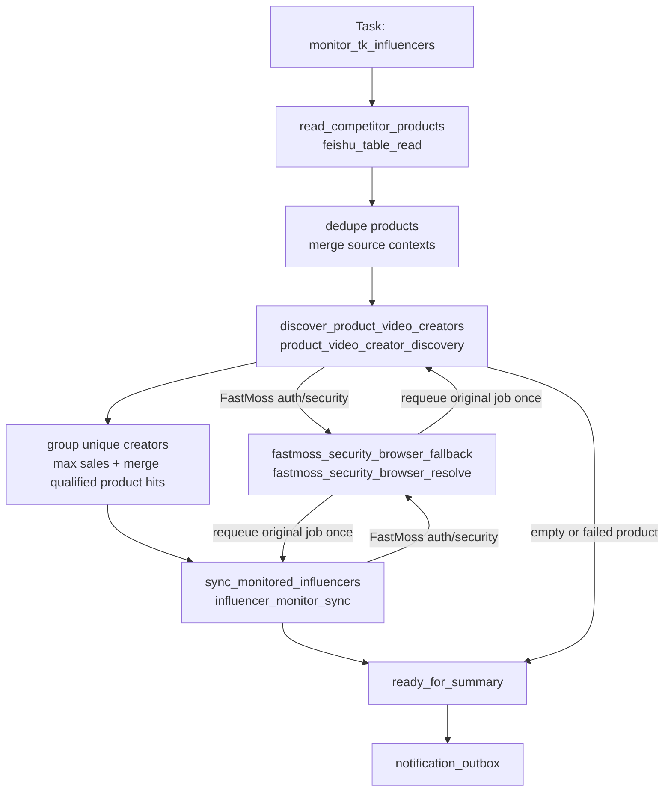
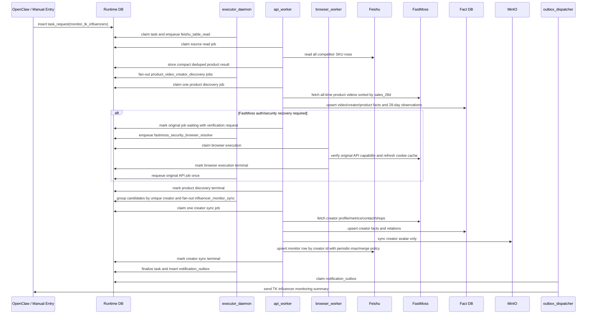

# TK 达人监控 Workflow 设计

日期：`2026-07-28`

状态：已批准，已实现（部署配置待接入）

## 1. 流程定位

`TK达人监控` 对应全新 Task / Workflow `monitor_tk_influencers`。它每天从 `TK竞品收集` 读取全部有效 SKU，通过 FastMoss 商品关联视频发现近 28 天销量超过阈值的达人，按唯一达人聚合后写入 `TK达人监控目标表`。

这是一个独立架构单元，必须独立拥有：

- Task / workflow code 与 workflow contract。
- 来源 adapter、候选 policy、商品视频发现 job 和达人同步 job。
- `TK达人监控目标表` 字段 contract 与 projection mapper。
- summary / outbox projection、测试和 completion gate。

本流程的业务输入仅包括 `TK竞品收集`、FastMoss 返回数据和 `TK达人监控目标表` 自身记录。其他达人业务表、workflow、job、projection 和字段 contract 均不是本流程的输入、输出或运行时依赖。

本文与 workflow contract、字段 contract 和当前实现共同描述该 Task 的运行事实；稳定 code 保持不变，兼容演进通过 `contract_revision` 和带默认值的可选字段完成。

## 2. Task

| 字段 | 设计 |
| --- | --- |
| Task 名称 | TK 达人监控 |
| `task_code` | `monitor_tk_influencers` |
| `workflow_code` | `monitor_tk_influencers` |
| `contract_revision` | `2` |
| 触发方式 | `schedule`；实现验收时允许手动提交同一 Task |
| 正常频率 | 每天一次 |
| 来源逻辑表 | `feishu://mujitask/tk_competitor` |
| 目标逻辑表 | `feishu://mujitask/tk_influencer_monitoring` |
| 主要 worker | `api_worker` |
| Runtime 队列 | `api_worker_job` |
| 允许部分成功 | 是 |
| 默认 outbox 标题 | `TK达人监控完成` |

### 2.1 顶层输入

外部入口只暴露真正会改变业务规则的参数：

```json
{
  "min_video_sales_28d": 50,
  "related_product_sales_reset_days": 28
}
```

参数规则：

- `min_video_sales_28d` 必须是非负整数。
- 未传时由 Task entry 补默认值 `50`。
- 判断条件固定为 `video_product_sales_28d > min_video_sales_28d`。
- `related_product_sales_reset_days` 必须是正整数，未传时由 Task entry 补默认值 `28`。
- `related_product_sales_reset_days` 只控制目标表销量最高值的保留周期，不改变 FastMoss `date_type=28` 指标窗口。
- Task entry 在创建请求时按 `Asia/Shanghai` 固定内部 `task_business_date`；同一 Task 的 job、重试和补偿均沿用该日期，外部入口不能覆盖。
- Base URL、`table_id`、`view_id`、FastMoss transport 参数和内部 mapper code 不作为外部业务输入。

### 2.2 Task 幂等

- schedule 入口优先使用调度系统提供的 `schedule_fire_id` 形成 Task idempotency key。
- 手动或补偿提交使用 `request_id` 形成 Task idempotency key。
- 即使同一业务日按顺序产生两次不同 Task，目标表的达人唯一键、周期内销量 `max`、图片/节日/店铺集合合并仍必须保证外部副作用幂等。
- 不把“同一天”作为禁止再次执行的硬条件，避免第一次部分失败后无法补偿。
- Runtime 队列保证同一时间最多运行一个 `monitor_tk_influencers` Task；定时、手动和补偿提交不得重叠执行。

### 2.3 顶层输出

Task summary 至少包含：

```json
{
  "result_status": "success | partial_success | failed",
  "effective_min_video_sales_28d": 50,
  "effective_related_product_sales_reset_days": 28,
  "task_business_date": "2026-07-28",
  "source_row_count": 0,
  "valid_product_count": 0,
  "deduped_product_count": 0,
  "product_discovery_success_count": 0,
  "product_discovery_empty_count": 0,
  "product_discovery_failed_count": 0,
  "fetched_video_count": 0,
  "qualified_video_count": 0,
  "qualified_creator_count": 0,
  "creator_created_count": 0,
  "creator_updated_count": 0,
  "creator_unchanged_count": 0,
  "creator_failed_count": 0,
  "early_stopped_product_count": 0,
  "warnings": [],
  "failed_items": []
}
```

## 3. 业务边界

本 workflow 负责：

- 读取来源表中全部能够解析为 FastMoss `product_id` 的 SKU。
- 忽略 `达人查找状态` 和 `商品状态` 对候选范围的影响。
- 对相同 `product_id` 去重，并合并来源商品图、节日和记录上下文。
- 查询商品关联视频的全部发布时间范围。
- 使用视频-商品近 28 天销量筛选达人，不使用粉丝数过滤。
- 在单 SKU 内按达人取最大视频销量，再跨 SKU 按达人取最大销量。
- 采集达人画像、指标、联系方式和合作店铺。
- 通过平台 Fact DB 和媒体能力沉淀事实与允许的达人头像。
- 以 `达人ID` 为唯一键向独立目标表 upsert。
- 按“销量在每个达人独立周期内取最高值、周期到期后由下一次达标观测重置、关联信息做集合合并”的策略写回。

本 workflow 不负责：

- 读取其他达人业务表，或调用其他达人 workflow、job、projection 和业务字段 contract。
- 读取或写回 `达人查找状态` 的状态机。
- 修改来源表任何字段。
- 使用商品关联达人列表代替商品关联视频。
- 为目标表引入新的业务字段。
- 配置 OpenClaw cron、固定飞书物理路由或处理测试/生产 Base 差异。
- 在达人没有达标观测时，仅因周期到期主动扫描、删除达人、降低销量或清空关联数据。

允许部分成功：

- 单个商品发现失败只影响该商品。
- 单个达人详情采集或写回失败只影响该达人。
- 来源表整体读取失败、目标表整体不可读写或系统级契约不匹配时，Task 失败。

## 4. Workflow



正式 stage cursor：

```text
read_competitor_products
discover_product_video_creators
sync_monitored_influencers
fastmoss_security_browser_fallback
ready_for_summary
```

`fastmoss_security_browser_fallback` 是可插入的等待/恢复 stage。恢复结束后返回触发它的原 stage，不作为业务成功终态。

## 5. Stage 设计

| Stage code | 进入条件 | 动作 | 派生 Job | 退出条件 | 失败策略 |
| --- | --- | --- | --- | --- | --- |
| `read_competitor_products` | Task 创建后 | 读取来源表、解析有效商品身份、按 `product_id` 去重并合并来源上下文 | `feishu_table_read` | 获得去重商品列表或确认无有效 SKU | 整体读表失败则 Task 失败；无有效 SKU 正常进入汇总 |
| `discover_product_video_creators` | 已得到去重商品列表 | 每个 unique `product_id` 派发 1 个商品视频达人发现 job | `product_video_creator_discovery` | 所有商品发现 job 终态 | 单商品失败计入部分成功；空列表正常成功 |
| `fastmoss_security_browser_fallback` | 商品发现或达人同步返回可恢复的 FastMoss auth/security 请求 | browser worker 恢复共享 FastMoss session，并 requeue 原 waiting job 一次 | `fastmoss_security_browser_resolve` | 原 job 被 requeue 或终态失败 | 恢复失败只终结受影响商品/达人；系统级连续失败可令 Task 失败 |
| `sync_monitored_influencers` | 商品发现结果已终态 | 按本 workflow 的 creator identity contract 分组，合并 qualifying product hits，每个 unique 达人派发 1 个同步 job | `influencer_monitor_sync` | 所有达人同步 job 终态 | 单达人失败计入部分成功 |
| `ready_for_summary` | 不存在 waiting job、活动 browser execution 或未终态达人/商品 job | 汇总业务结果并创建 outbox | workflow finalizer | Task 进入终态 | summary 失败不回滚已完成外部副作用 |

Stage 可重复推进，但必须依赖稳定 dedupe key，不能重复创建同一 Task 下的商品或达人 job。

## 6. Job 设计

| Job | Runtime 表 | Worker | Handler | Business key | Retry / Timeout | 外部副作用 |
| --- | --- | --- | --- | --- | --- | --- |
| 来源表读取 | `api_worker_job` | `api_worker` | `feishu_table_read` | `source:TK竞品收集` | 使用平台 Feishu handler 错误与重试策略 | 无 |
| 商品视频达人发现 | `api_worker_job` | `api_worker` | `product_video_creator_discovery` | `product:{product_id}` | 最多 3 次；timeout 使用该 job 的 Runtime 配置 | FastMoss API、Fact DB |
| 达人监控同步 | `api_worker_job` | `api_worker` | `influencer_monitor_sync` | `creator:{creator_id}` | 最多 3 次；timeout 使用该 job 的 Runtime 配置 | FastMoss API、Fact DB、MinIO 头像、飞书目标表 |
| FastMoss 登录态恢复 | `task_execution` | `browser_worker` | `fastmoss_security_browser_resolve` | 原始 FastMoss 请求 digest | 同一原始请求最多恢复一次 | FastMoss cookie cache |
| 父任务汇总 | `task_request` finalize | `executor_daemon` | workflow finalizer | `request:{request_id}` | 使用 Runtime finalizer 策略 | `notification_outbox` |

### 6.1 来源表读取

workflow 内部有效 payload：

```json
{
  "task_code": "monitor_tk_influencers",
  "workflow_code": "monitor_tk_influencers",
  "stage_code": "read_competitor_products",
  "source_table_ref": "feishu://mujitask/tk_competitor",
  "field_names": ["SKU-ID", "产品链接", "图片", "节日", "商品状态", "达人查找状态"],
  "adapter_code": "influencer_monitor_source_adapter",
  "snapshot_policy": {
    "store_raw_rows": false
  }
}
```

`influencer_monitor_source_adapter` 规则：

- `SKU-ID` / 可解析商品身份是唯一候选条件。
- `商品状态` 和 `达人查找状态` 只允许进入审计摘要，不能作为过滤条件。
- `source_record_id` 只用于审计和来源关系，不用于状态写回。
- 相同 `product_id` 合并为一个商品候选。
- 来源商品图片只携带受控 attachment / asset ref，不把附件二进制或完整飞书 raw row 放入 Runtime result。
- 重复 SKU 的来源节日、图片和 record id 分别去重合并。

#### 6.1.1 来源商品状态的技术验证边界

`商品状态` 只作为来源审计属性，不参与 SKU 候选筛选。只要来源行能够解析出有效
`product_id`，正常、已下架和区域不可售商品都必须派发商品视频发现 job。

本轮技术验证明确排除“分别选择已下架 SKU 和区域不可售 SKU 做 Roxy / FastMoss
实抓”，后续不再为这两类状态补充 live sample。缺少这两类实时样本不构成实现
readiness 或 completion gate 的阻断项。

该边界只影响技术验证范围，不改变业务行为：

- source adapter 不允许按 `商品状态` 过滤。
- 已派发请求的空结果、业务错误和请求失败按本 workflow 的通用商品级结果分类。
- 认证、风控、网络或明确业务错误不得伪装为正常空结果。
- 状态无关性由 source adapter contract test 和 fixture test 验收。

result 示例：

```json
{
  "products": [
    {
      "product_id": "1732266893752242590",
      "source_record_ids": ["recA", "recB"],
      "source_product_images": [
        {"source_record_id": "recA", "attachment_token": "box..."}
      ],
      "holidays": ["万圣节"],
      "observed_source_statuses": {
        "product_statuses": ["已下架/区域不可售"],
        "influencer_search_statuses": ["已完成"]
      }
    }
  ],
  "adapter_summary": {
    "input_row_count": 2,
    "valid_row_count": 2,
    "unique_product_count": 1,
    "missing_product_id_count": 0,
    "deduped_row_count": 1
  }
}
```

### 6.2 商品视频达人发现

每个 unique SKU 创建一个 `product_video_creator_discovery` job。

payload 示例：

```json
{
  "task_code": "monitor_tk_influencers",
  "workflow_code": "monitor_tk_influencers",
  "stage_code": "discover_product_video_creators",
  "job_code": "product_video_creator_discovery",
  "product_id": "1732266893752242590",
  "source_context": {
    "source_record_ids": ["recA", "recB"],
    "source_product_images": [
      {"source_record_id": "recA", "attachment_token": "box..."}
    ],
    "holidays": ["万圣节"]
  },
  "query_policy": {
    "promotion_scope": "all",
    "publish_time_scope": "all",
    "metric_name": "video_product_sales_28d",
    "metric_window_days": 28,
    "sort_direction": "desc",
    "min_video_sales_28d": 50
  }
}
```

职责：

1. 调用平台 FastMoss HTTP session 的商品关联视频能力。
2. 归一化每行的：
   - `product_id`
   - `video_id`
   - `creator_identity`
   - `video_product_sales_28d`
   - `video_product_sale_amount_28d`
   - `published_date`
   - `is_promoted`
3. 先按视频身份去重，再严格筛选 `video_product_sales_28d > threshold`。
4. 同一 SKU 下按本 workflow 的 creator identity contract 分组，取该达人所有达标视频的最大销量。
5. 对抓取到的主体、关系和窗口指标调用平台 `fact_bundle_upsert` capability，不在 Runtime result 中保存完整 FastMoss response。
6. 输出供 workflow fan-in 的 compact creator candidates。

result 示例：

```json
{
  "product_id": "1732266893752242590",
  "fetch_status": "success",
  "effective_min_video_sales_28d": 50,
  "fetched_video_count": 10,
  "qualified_video_count": 10,
  "qualified_creator_count": 9,
  "pagination": {
    "page_size": 5,
    "fetched_page_count": 2,
    "early_stopped": true,
    "stop_reason": "at_or_below_min_video_sales_28d"
  },
  "creator_candidates": [
    {
      "creator_identity": {
        "creator_id": "6582334729479290885",
        "uid": "6582334729479290885",
        "unique_id": "heidiann__"
      },
      "product_hit": {
        "product_id": "1732266893752242590",
        "max_video_sales_28d": 120,
        "winning_video_id": "7641370220849859854",
        "qualified_video_count": 2,
        "source_record_ids": ["recA", "recB"],
        "source_product_images": [
          {"source_record_id": "recA", "attachment_token": "box..."}
        ],
        "holidays": ["万圣节"]
      }
    }
  ],
  "fact_write_summary": {
    "entity_count": 0,
    "relation_count": 0,
    "performance_count": 0,
    "raw_response_ids": []
  }
}
```

### 6.3 FastMoss transport 映射与分页

以下 transport 映射已于 `2026-07-25` 通过 Roxy 页面请求和本地 FastMoss 凭据 HTTP
重放确认：

| 业务语义 | FastMoss 请求参数 | 验证结论 |
| --- | --- | --- |
| 发布时间全部 | `d_type=0` | 结果中包含发布时间为 `2024-10-16` 的视频 |
| 投流情况全部 | `is_promoted=-1` | 与页面投流情况“全部”状态一致 |
| 近 28 天指标 | `date_type=28` | 与页面“销量（近28天）”列共同生效 |
| 近 28 天销量倒序 | `order=1,2` | 页面与 API 销量逐行一致并按非递增顺序返回 |
| 发布时间倒序 | `order=6,2` | 页面切换到视频发布时间排序时使用；本流程不得采用 |
| 页大小 | `pagesize=5` | 页面实抓值；接口允许的最大值为 `10` |

关键边界：

- `d_type=0` 控制视频发布时间范围。
- `date_type=28` 表示请求/返回的指标窗口。
- 二者不能合并理解成“只查近 28 天发布的视频”。
- FastMoss 原始 `sold_count` 标准化为 `video_product_sales_28d`，业务 policy 只消费标准化字段。
- 实现必须显式传入 `order=1,2`、`d_type=0`、`date_type=28`、`is_promoted=-1` 和 `pagesize=5`，不得依赖 client 默认参数。
- 接口对 `pagesize=100` 返回“值不能大于 10”，因此实现和补偿工具均不得使用大于 `10` 的 page size。

#### 6.3.1 已完成的实抓验证基线

本次验证商品为 `1729679758111249333`。验证时该商品在上述筛选条件下返回
`total=7220`。

- Roxy 页面点击“销量（近28天）”后，请求参数为
  `order=1,2,d_type=0,is_promoted=-1,date_type=28,pagesize=5`。
- 页面前 5 行销量与接口 `sold_count` 逐行一致，均为
  `1341, 1113, 512, 500, 482`；本地 FastMoss 凭据使用相同参数重放返回
  `code=200`，结果一致。
- 上述结果中包含发布时间为 `2024-10-16` 的视频，证明“发布时间全部”和“近 28 天销量指标”是两个独立维度。
- 阈值 `50` 的分页边界验证使用 `pagesize=10` 拉取 3 页、共 30 行：
  `sold_count` 均为非负数字，销量在页内和跨页均保持非递增，`video_id` 无重复；
  前 19 行严格大于 `50`，第 20 行为 `49`，紧邻下一页没有重新出现大于 `50`
  的记录。
- 页面 `pagesize=5` 的边界样例为：第 3 页
  `105, 104, 102, 99, 95`，第 4 页 `93, 85, 66, 64, 49`，第 5 页
  `49, 33, 31, 30, 28`。

以上数值是 point-in-time 验证证据，只用于 mapper、排序、分页和阈值 fixture，
不是业务常量，也不用于断言该商品未来仍有相同 `total` 或销量。本轮没有完整扫描
全部 `7220` 条视频。

#### 6.3.2 实现固化门禁

FastMoss 参数、排序、销量字段和阈值分页的外部技术验证已经完成，不再作为待办实抓项。
当前 completion gate 固化以下检查：

1. 将脱敏请求和返回样例固化为 transport mapper fixture。
2. 测试 `sold_count -> video_product_sales_28d` 映射。
3. 测试采集器显式使用 `pagesize=5`，且不会发送大于 FastMoss 上限 `10` 的值。
4. 测试销量非递增时允许在首个 `<= threshold` 处提前停止。
5. 测试运行时观察到非单调数据时关闭提前停止并继续分页。
6. 测试 `video_id` 去重和本地凭据响应必须为成功业务码。

分页规则：

- 正常按 `data.total`、空页、当前页不足 page size 收敛。
- 正常全量扫描不设置会截断结果后仍标记成功的业务 `max_pages`。
- 当当前商品已抓取前缀中的有效销量保持非递增时，遇到首个有效数字 `<= threshold` 即可提前停止；由于业务条件是严格大于，等于阈值也属于停止边界。
- 缺失或不可解析销量的行不入选，但不能单独作为提前停止依据。
- 如果运行时观测到销量顺序违反非递增约束，则当前商品关闭阈值提前停止并继续完整分页，同时记录 `video_sales_order_not_monotonic` warning，不能在排序不可信时漏采达人。
- 任一中间页重试耗尽时，整个商品发现 job 失败；已抓取的部分页只能进入失败诊断，不能作为候选继续 fan-in 或写入目标表。

### 6.4 跨商品达人 fan-in

`discover_product_video_creators` 全部终态后，executor 按本 workflow 的 creator identity contract 聚合候选：

creator identity contract：

- 业务身份字段为 FastMoss/TikTok `unique_id` 的标准化非空文本，标准化时去除首部 `@`。
- mapper 将标准化 `unique_id` 同时作为 candidate `creator_id`、business key、dedupe key 和目标表 upsert key。
- FastMoss 稳定数字 `uid` 作为独立内部标识保留，只用于达人详情查询和 Fact 关联，不写入目标表 `达人ID`。
- 无法同时取得有效 `unique_id` 和稳定 `uid` 的视频不形成达人候选，并记录 `invalid_creator_identity`。

`2026-07-25` 商品视频实抓对 20 行进行了身份一致性抽样：

- 20 行根级 `uid` 均非空。
- 根级 `uid` 与 `author.uid` 无不一致。
- 根级 `unique_id` 与 `author.unique_id` 无不一致。
- 20 行归并为 12 个 unique 达人，其中 5 个达人具有多条视频。
- 达人 `uid=7269459274316645422` 的抽样视频销量为 `1113`、`112`、`66`，
  按同一 canonical 身份执行单 SKU 内 `max` 聚合后为 `1113`。

因此本流程以标准化 `unique_id` 生成业务 `creator_id`；`uid` 仅保留为内部 FastMoss 标识。

```text
creator_run_max_sales_28d
  = max(product_hits[*].max_video_sales_28d)
```

聚合规则：

- 一个 unique 达人只派发一个 `influencer_monitor_sync` job。
- `product_hits` 只包含至少一条视频严格超过阈值的商品关系。
- 每个 `product_hit` 保留该商品下的最大视频销量、获胜视频、达标视频数和来源关联上下文。
- 商品图、节日按全部 qualifying product hits 合并，不只保留销量最高 SKU 的关联信息。
- `creator_run_max_sales_28d` 只用于目标销量 `max`；不把多个 SKU 的销量相加。

### 6.5 达人监控同步

每个 unique 达人一个 `influencer_monitor_sync` job。

payload 示例：

```json
{
  "task_code": "monitor_tk_influencers",
  "workflow_code": "monitor_tk_influencers",
  "stage_code": "sync_monitored_influencers",
  "job_code": "influencer_monitor_sync",
  "creator_identity": {
    "creator_id": "6582334729479290885",
    "uid": "6582334729479290885",
    "unique_id": "heidiann__"
  },
  "creator_run_max_sales_28d": 120,
  "related_product_sales_reset_days": 28,
  "task_business_date": "2026-07-28",
  "product_hits": [
    {
      "product_id": "1732266893752242590",
      "max_video_sales_28d": 120,
      "winning_video_id": "7641370220849859854",
      "qualified_video_count": 2,
      "source_record_ids": ["recA", "recB"],
      "source_product_images": [
        {"source_record_id": "recA", "attachment_token": "box..."}
      ],
      "holidays": ["万圣节"]
    }
  ],
  "sync_plan": {
    "creator_fetch": {
      "internal_handler": "fastmoss_creator_fetch",
      "detail_level": "profile_metrics_contact_goods",
      "date_type": 28
    },
    "fact_upsert": {
      "internal_handler": "fact_bundle_upsert"
    },
    "media_asset_sync": {
      "internal_handler": "media_asset_sync",
      "scope": "creator_avatar_only"
    },
    "target_write": {
      "internal_handler": "feishu_table_write",
      "target_table_ref": "feishu://mujitask/tk_influencer_monitoring",
      "mapper_code": "influencer_monitor_projection_mapper"
    }
  }
}
```

job 内部按顺序完成：

1. 调用平台 `fastmoss_creator_fetch` capability 采集达人详情、28 天指标、联系方式和合作店铺。
2. 调用平台 `fact_bundle_upsert` capability 写达人主体、达人-商品关系和观测事实。
3. 仅对达人头像调用 `media_asset_sync`。
4. 使用 `influencer_monitor_projection_mapper` 生成目标表 upsert。
5. 由 `feishu_table_write` 按 `达人ID` 查找 `TK达人监控目标表` 自身行并执行 diff 写入。

result 只保存下游 summary 所需的 compact 结构：

```json
{
  "creator_id": "6582334729479290885",
  "status": "success",
  "creator_run_max_sales_28d": 120,
  "target_existing_sales_28d": 90,
  "target_effective_sales_28d": 120,
  "target_operation": "created | updated | unchanged",
  "written_fields": ["关联商品销量", "带货商品图", "关联节日", "更新日期"],
  "product_hit_count": 1,
  "fact_write_summary": {},
  "target_record_id": "recMonitor001"
}
```

完整 creator fact bundle、FastMoss raw response、媒体字节、完整飞书记录和联系方式原始 envelope 不进入 Runtime result。

## 7. Handler、Flow 与 Owner 边界

### 7.1 平台级通用能力依赖

| 能力 | 调用边界 |
| --- | --- |
| FastMoss 商品关联视频 HTTP | 调用 `infrastructure/fastmoss` session 与 `/api/goods/v3/video` client；不在本 workflow 内实现 transport |
| FastMoss 达人详情 | 调用 `fastmoss_creator_fetch` capability；本 workflow 只定义所需字段与业务结果 |
| Fact DB | 调用 `fact_bundle_upsert` capability 和平台 fact mapper / repository |
| 达人头像 | 调用 `media_asset_sync` capability，仅同步本流程允许的头像资产 |
| 飞书读写 | 调用 `feishu_table_read` / `feishu_table_write` transport handler；业务映射由本流程 adapter / projection 决定 |
| FastMoss 风控恢复 | 调用 `fastmoss_security_browser_resolve` capability |
| 通知投递 | 本流程拥有专属 summary / outbox projection，底层调用平台 outbox transport |

### 7.2 新流程专属业务 owner

| 组件 | 职责 |
| --- | --- |
| `influencer_monitor_source_adapter` | 全量 SKU 选择、商品身份解析、相同 SKU 来源上下文合并 |
| `product_video_creator_discovery` | 商品粒度视频分页、销量标准化、阈值筛选、单 SKU 达人最大值 |
| `influencer_monitor_candidate_policy` | 严格阈值、周期参数校验和单 SKU / 跨 SKU `max` 规则 |
| `influencer_monitor_sync` | 一个 unique 达人的详情、事实、头像和目标表 upsert 原子业务单元 |
| `influencer_monitor_projection_mapper` | 新目标表字段映射、周期最高销量策略声明和关联字段合并 |

边界约束：

- `monitor_tk_influencers` 的业务组件不得 import 或调用其他达人业务 workflow、job、adapter、policy、projection 或字段 contract。
- 跨业务边界只允许依赖本节列出的通用 capability、基础设施与平台 contract。
- SKU 选择、视频筛选、达人聚合、目标字段映射和写入语义全部由本流程专属组件负责。
- 不通过给其他业务组件增加 `mode` 来承载本流程语义。
- 不在 `common`、registry、submit helper 或新建 `service/manager/coordinator/collector` 中保存本流程字段和筛选规则。
- 如果 `fact_bundle_upsert` 尚未支持视频-商品 28 天窗口表现，应在平台 Fact owner 与机器契约内扩展，不新增旁路事实写入 helper。

## 8. 飞书 Adapter 与 Projection

### 8.1 来源 Adapter

| 项目 | 设计 |
| --- | --- |
| adapter code | `influencer_monitor_source_adapter` |
| 业务表 | `TK竞品收集` |
| 身份字段 | `SKU-ID`；由 adapter 标准化为 FastMoss canonical `product_id`，无法解析时记为无效来源行 |
| 候选字段 | 仅有效 `product_id` |
| 非筛选状态字段 | `商品状态`、`达人查找状态` |
| 透传字段 | 来源 record id、图片、节日 |
| 去重键 | `product:{product_id}` |
| 来源写回 | 无 |

### 8.2 目标 Projection

`influencer_monitor_projection_mapper` 必须绑定 `TK达人监控` 独立字段 contract。该 contract 完整定义每个字段的数据来源、格式、更新策略和覆盖策略，不引用其他业务表字段 contract。

| 字段 | 输入 | 更新策略 |
| --- | --- | --- |
| `达人ID` | FastMoss/TikTok `unique_id` | 去除首部 `@` 后写入；创建必填、唯一 upsert key、创建后不改；数字 `uid` 不写入 |
| `带货商品图` | 全部 qualifying product hits 对应的 `TK竞品收集.图片` | 按 `source product_id + asset/attachment identity` 去重并集，不删除目标行有效图片 |
| `关联节日` | 全部 qualifying product hits 对应来源行的节日 | 标准化文本后集合并集，不删除目标行有效值 |
| `关联商品销量` | `creator_run_max_sales_28d` | 周期未到期取 `max(existing, observed)`；周期到期时写 `observed`，允许低于旧周期值 |
| `达人头像` | FastMoss `avatar_url` 物化后的稳定 asset ref | 物化成功时填充或刷新；空值或物化失败不清除目标行有效头像 |
| `粉丝数(W)` | FastMoss `follower_count` | 达人详情成功且数值有效时刷新；空值或非法值不覆盖；不参与筛选；写入原始值除以 `10000` 后的 JSON 数字 |
| `28天视频数` | FastMoss `aweme_28d_count` | 达人详情成功且数值有效时刷新；空值或非法值不覆盖；写入 JSON 数字 |
| `带货视频 GMV(W)` | FastMoss `video_sale_amount` | 达人详情成功且数值有效时刷新；空值或非法值不覆盖；写入原始值除以 `10000` 后的 JSON 数字 |
| `带货直播 GMV(W)` | FastMoss `live_sale_amount` | 达人详情成功且数值有效时刷新；空值或非法值不覆盖；写入原始值除以 `10000` 后的 JSON 数字 |
| `合作店铺` | FastMoss `cooperation_shops` | 标准化后与目标行做集合并集；只写飞书字段允许选项；未知选项跳过并 warning；不删除已有值 |
| `达人联系方式` | FastMoss normalized contacts | 邮箱优先，否则取第一个有效联系方式；空值不覆盖 |
| `记录日期` | Task 业务日期 | 创建、周期重置或空/非法/未来锚点修复时写；普通周期内新高不移动 |
| `更新日期` | Task 业务日期 | 创建、其他维护字段 diff、周期重置或锚点修复时写 |

销量计算必须在数值域完成：

```text
observed = creator_run_max_sales_28d
today = task_business_date
period = related_product_sales_reset_days

if target row does not exist:
    effective = observed
    anchor = today
else if recorded_date is empty, invalid, or later than today:
    effective = max(existing, observed)
    anchor = today
    emit warning
else if (today - recorded_date).days >= period:
    effective = observed
    anchor = today
else:
    effective = max(existing, observed)
    keep recorded_date
```

只有本次 Task 聚合出了该达人的达标观测才执行上述判断。没有达标观测时，即使周期已经到期，也不写销量、`记录日期` 或 `更新日期`。旧 job 未携带新字段时按 `period=28` 执行，保证兼容。

目标表其他字段：

- `合作商品数` 不写。
- 公式字段不写。
- 人工运营字段不写。
- 未出现在独立字段 contract 的字段不写。

### 8.3 物理表配置边界

workflow 和 mapper 只使用稳定逻辑引用：

```text
feishu://mujitask/tk_competitor
feishu://mujitask/tk_influencer_monitoring
```

真实 Base、`table_id`、`view_id` 和环境差异由平台配置解析层负责。它们不进入 Task payload、workflow contract 的业务规则、dedupe key 或领域测试样例。

## 9. Fact DB 与 Storage

### 9.1 Fact DB

本流程使用平台统一事实模型：

- `tk_products`
- `tk_creators`
- `tk_videos`
- `tk_creator_product_relations`
- `tk_creator_video_relations`
- `tk_video_product_relations`
- `tk_video_product_window_performance`
- `tk_creator_product_window_performance`

窗口指标口径：

- 每条视频行的近 28 天销量写为视频-商品 28 天窗口表现。
- 单 SKU 下达人最大值可写为达人-商品 28 天窗口表现，并在 payload 中保留 `aggregation=max_video_sales_28d` 和 winning video identity。
- 目标表“周期内最高值”是业务投影规则，不反向修改事实观测；Fact DB 仍保留每次任务看到的当前 28 天窗口值。
- 不把近 28 天销量写进视频主档或商品-视频关系字段。

如果实现检查确认上述 performance 表的 repository / mapper 尚未接入 `fact_bundle_upsert`，只扩展平台 Fact owner 和机器契约；当前设计不要求新增 Fact DB 表或业务私有数据库。

### 9.2 MinIO 与媒体

- 仅达人头像属于本流程新增采集时允许物化的长期媒体对象。
- 商品图片使用来源飞书 attachment 或平台 product asset ref，不在达人 job 中重复下载。
- FastMoss raw response、整表快照、完整飞书写回 payload、分页诊断和失败截图不进入 MinIO。
- 本地诊断 artifact 按平台短期保留策略处理。

## 10. 进程间调度时序图



## 11. 状态收敛

### 11.1 商品发现

- `success`：请求完成并产出一个或多个达人候选。
- `empty`：没有关联视频，或没有视频严格超过阈值；属于业务成功。
- `failed`：重试和一次 browser recovery 均无法完成商品发现。

### 11.2 达人同步

- `created`：目标表新建达人。
- `updated`：已有达人至少一个系统字段发生 diff。
- `unchanged`：目标表现有销量更高或相等，且画像/关联字段也没有变化。
- `failed`：达人详情、事实、媒体必需步骤或目标写入重试耗尽。

### 11.3 Task 终态

| 条件 | `result_status` |
| --- | --- |
| 来源读取成功，所有派生商品和达人都成功/empty/unchanged | `success` |
| 来源读取成功，至少一个商品或达人失败，但存在可交付结果 | `partial_success` |
| 来源读取失败、目标表整体不可用、schema/contract 不匹配或没有任何可可信交付结果 | `failed` |

父 Task 进入 `ready_for_summary` 前必须确认：

- 不存在 waiting API job。
- 不存在活动 browser execution。
- 所有商品发现 job 已终态。
- 所有已派发达人同步 job 已终态。
- 空结果与失败结果已经分别计数。

## 12. 重试、进度与幂等

### 12.1 Dedupe key

```text
source read:
  {request_id}:read_competitor_products

product discovery:
  {request_id}:product_video_creator_discovery:{product_id}:{threshold}

creator sync:
  {request_id}:influencer_monitor_sync:{creator_id}

target upsert:
  target_table_ref + 达人ID
```

### 12.2 重试

- Feishu、FastMoss、Fact DB、MinIO 和目标写入使用对应平台 handler 的错误分类。
- 临时网络错误、限流和可恢复服务端错误最多重试 3 次。
- FastMoss auth/session/security 错误进入一次 browser recovery，不与普通 retry 混为同一成功事实。
- 非法商品身份、非法销量值和目标表已有销量无法解析属于不可重试业务/数据错误。
- 目标表 `记录日期` 为空、非法或晚于 Task 业务日期时记录 warning，并按 `max(existing, observed)` 安全修复锚点，不因此降低销量。
- Creator job 重试必须重新读取目标表当前值，再执行周期判断、`max` 和 diff，不能使用首次尝试缓存值覆盖已有更新。

### 12.3 Progress

- 商品发现每完成一页更新 `last_progress_at`，`progress_stage` 至少包含当前页码和已抓视频数。
- 达人同步在 creator fetch、fact upsert、media sync、target write 后更新内部步骤状态。
- 进度信息只用于 watchdog 和观测，不改变业务聚合结果。

### 12.4 外部写入幂等

- 视频、达人、商品和关系按平台 Fact DB 唯一键 upsert。
- performance observation 使用稳定 `performance_id` 或 source request identity 防止同一 job retry 重复写同一观测。
- 目标表按 `达人ID` upsert。
- 销量在有效周期内使用 `max`；到期重置后，同一 Task 业务日期的顺序重试仍落在新周期内，不会再次降低或累加数值。
- 商品图、节日和店铺使用集合/来源商品去重，重复执行不会追加重复项。
- `记录日期` 只在创建、周期重置或异常锚点修复时写；周期未到期且无字段 diff 时不更新 `更新日期`。

## 13. Summary / Outbox

默认 outbox 标题为 `TK达人监控完成`，默认格式为 `plain_text_detail`。

必须包含：

- 本次有效阈值、销量重置周期和 Task 业务日期。
- 来源总行数、有效行数、去重 SKU 数。
- 商品发现成功、空结果、失败数。
- 抓取视频数、达标视频数。
- unique 达人数。
- 新建、更新、无变化、失败达人数。
- 因销量边界提前停止分页的商品数。
- 按 SKU / 达人归纳的有限失败明细和标准化错误码。

不得包含：

- FastMoss cookie 或 token。
- 飞书 access token、Base URL、`table_id`、`view_id`。
- 完整 FastMoss raw response。
- 完整达人联系方式 envelope。
- 未裁剪的附件或媒体 URL 清单。

## 14. 机器契约与组件清单

本流程由以下机器契约和组件共同实现：

| 类型 | 目标 |
| --- | --- |
| feature roadmap | 为 `monitor_tk_influencers` 建立独立 feature code、allowed paths 和 done gate |
| workflow contract | `contracts/workflow/monitor_tk_influencers.yaml` |
| implementation manifest | `src/automation_business_scaffold/contracts/workflow/monitor_tk_influencers.yaml` |
| target field contract | 独立 `TK达人监控` 字段 contract，冻结 `关联商品销量=periodic_max_numeric` 和 `记录日期` 锚点语义 |
| Task entry | `domains/tiktok/tasks/monitor_tk_influencers.py` |
| Workflow owner | `domains/tiktok/workflows/monitor_tk_influencers.py` 或按当前项目结构契约落位 |
| source adapter | `influencer_monitor_source_adapter` |
| domain policy | `influencer_monitor_candidate_policy` |
| product job | `product_video_creator_discovery` |
| creator job | `influencer_monitor_sync` |
| target projection | `influencer_monitor_projection_mapper` |
| fact integration | 在平台 fact mapper / `fact_bundle_upsert` owner 中接入视频-商品与达人-商品 28 天窗口表现 |
| summary / outbox projection | 新增本 workflow 专属摘要映射与文案，底层调用平台 outbox transport |
| tests | workflow contract、adapter、分页阈值、聚合、projection、Runtime integration、partial success、architecture ownership |

持续约束：

- 将其他达人 workflow、job、projection、adapter、policy 或业务字段 contract 列为本流程依赖。
- field/workflow contract 与实现、测试必须同步演进。
- 新增未经 architecture ownership contract 声明的 helper-like 抽象。
- 把物理飞书路由写死到源码、contract 或测试。

## 15. 验收场景

测试至少覆盖：

1. `d_type=0` 与 `date_type=28` 分别表达全部发布时间和 28 天指标窗口。
2. 阈值默认 `50`，严格排除 `50`、包含 `51`。
3. 不按粉丝数过滤。
4. 来源 adapter 对正常、已下架和区域不可售状态使用同一候选规则，不使用
   `商品状态` 或 `达人查找状态` 筛选；使用 contract / fixture test 验收，不要求额外
   live SKU 实抓。
5. 重复 SKU 合并来源上下文后只派发一个商品 job。
6. 同 SKU 同达人多视频取最大值。
7. 跨 SKU 同达人取最大值。
8. 周期未到期时，目标已有值更高不降低，目标已有值更低提高到本次最大值，且两者都不移动 `记录日期`。
9. `记录日期=6-20`、周期 `7` 天时，`6-26` 未到期，`6-27` 到期；到期后本次值无论高、等、低都开启新周期。
10. 较低但仍达标的商品关系不提高销量，但继续合并其商品图和节日。
11. 未达标商品关系不合并商品图和节日。
12. 空视频和无达标达人均为商品业务成功。
13. 单商品失败、单达人失败产生 `partial_success`，不阻塞无关实体。
14. 相同参数顺序重复运行不重复创建、不累加销量、不重复关联字段；周期重置后的同日重试不再次降低销量。
15. 使用 `2026-07-25` 脱敏实抓 fixture 验证 `order=1,2`、
    `sold_count -> video_product_sales_28d`、跨页非递增和本地 HTTP 重放一致性。
16. 采集器使用 `pagesize=5`，不会发送大于 FastMoss 上限 `10` 的值。
17. 视频行根级 `uid/unique_id` 与 `author.uid/author.unique_id` 一致；同一 `uid`
    的多条视频按同一达人聚合。
18. 排序非单调时关闭提前停止并完整分页。
19. 目标物理路由只从配置解析，业务 payload 和 contract 不固定环境 ID。
20. architecture ownership 测试确认本流程业务 owner 只依赖允许的通用 capability，不 import 或调用其他达人业务组件。
21. 没有达标观测时不触发过期重置；空/非法/未来 `记录日期` 使用安全修复并产生 warning。
22. 旧 job 缺少新字段时使用默认周期 `28`；Task 参数变化从下一次请求起立即基于已有锚点生效。

## 16. 关联文档

- [../business/requirements/tk-influencer-monitoring.md](../business/requirements/tk-influencer-monitoring.md)
- [workflow-design-guidelines.md](./workflow-design-guidelines.md)
- [feishu-table-adapter-projection-contract.md](./feishu-table-adapter-projection-contract.md)
- [fact-db-schema-design.md](./fact-db-schema-design.md)
- [../reference/fastmoss-known-interfaces.md](../reference/fastmoss-known-interfaces.md)
