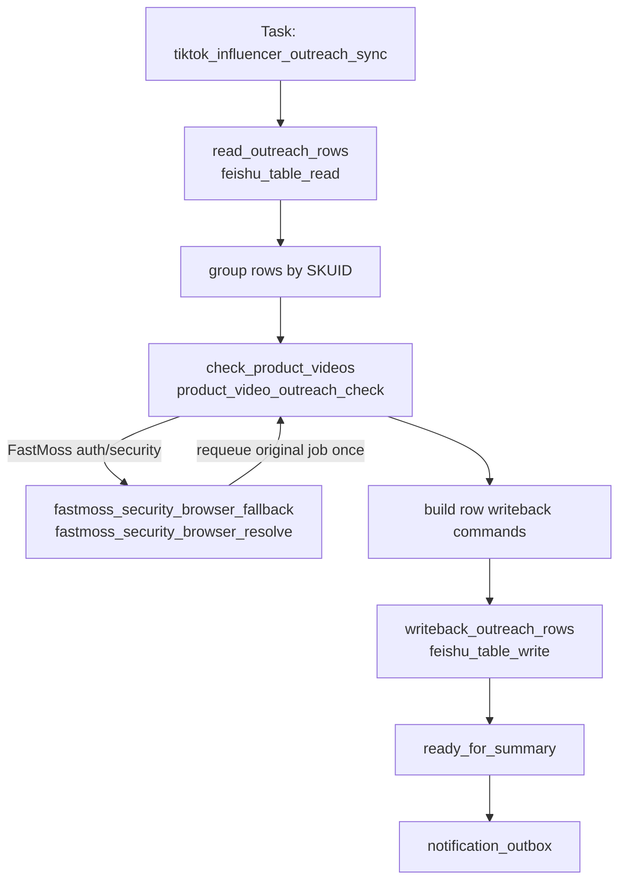

# 达人建联检查 Workflow 设计

日期: 2026-05-22

## 1. 流程定位

达人建联检查用于维护 `TK达人建联表`。它按飞书行中的 `SKUID` 和 `达人ID` 检查 FastMoss 商品关联视频列表；如果同商品同达人已发布视频，则回写 `视频链接`、`视频发布时间` 和 `检查时间`；如果商品视频列表抓取成功但未匹配到该达人，则只回写 `检查时间`；如果商品视频列表抓取失败，则该商品对应行不更新检查结果。

该流程不走浏览器作为常规路径。默认使用 FastMoss HTTP API `/api/goods/v3/video` 获取商品关联视频，基于接口返回的 `unique_id` 和 `video_id` 生成 TikTok 视频链接。浏览器只保留为 FastMoss 登录态或安全校验恢复能力，不作为视频链接获取来源。

## 2. Task

| 字段 | 设计 |
| --- | --- |
| Task 名称 | 达人建联检查 |
| 当前 task_code | `tiktok_influencer_outreach_sync` |
| workflow_code | `tiktok_influencer_outreach_sync` |
| 顶层表 | `task_request` |
| 编排者 | `executor_daemon` |
| 主要执行 worker | `api_worker` |
| Runtime 队列 | `api_worker_job` |
| 逻辑 job 粒度 | 表读取 job、商品视频列表检查 job、飞书批量写回 job |
| 最终结果 | 商品检查汇总、行级匹配/未匹配/跳过计数、飞书写回结果、summary/outbox |

触发方式支持定时任务或手动触发。首次实现可以用默认全表扫描；后续如需要按商品、按记录或按时间窗口手动补偿，可通过 task payload 增加可选过滤条件。

## 3. 业务边界

本 workflow 负责：

- 读取 `TK达人建联表` 中待检查行。
- 跳过 `SKUID` 为空、`达人ID` 为空或 `视频链接` 已有内容的行。
- 按商品聚合待检查行，避免按飞书行逐条请求 FastMoss。
- 按商品检查 FastMoss 商品关联视频列表。
- 对同商品同 `unique_id` 的视频按发布时间最早优先匹配。
- 将匹配结果或检查时间写回 `TK达人建联表`。

本 workflow 不负责：

- 自动维护 `SKUID` 或 `达人ID`。
- 覆盖已有 `视频链接`。
- 自动回写 `播放量`。
- 30 天未履约提醒。
- 从 FastMoss 视频详情页或 TikTok 页面解析视频链接。
- 把商品视频原始列表长期保存到 Runtime result。

允许部分成功。一个商品抓取失败只影响该商品对应行，其余商品继续检查和写回。

## 4. Workflow



## 5. Stage 设计

| Stage code | 进入条件 | 编排动作 | 派生 Job | 退出条件 | 失败策略 |
| --- | --- | --- | --- | --- | --- |
| `read_outreach_rows` | task 创建后 | 读取 `TK达人建联表` 行级字段，交给 source adapter 生成待检查候选和跳过摘要 | `feishu_table_read` | 得到待检查行或确认无候选 | 读表失败则 task 失败 |
| `check_product_videos` | 已得到按商品聚合的待检查行 | 每个 unique `SKUID` 派发 1 个商品视频检查 job | `product_video_outreach_check` | 所有商品检查 job 终态 | 单商品失败只标记该商品失败，不生成该商品行写回 |
| `fastmoss_security_browser_fallback` | 商品视频检查遇到 FastMoss auth/session/security 恢复需求 | 使用 browser worker 恢复共享 cookie，并 requeue 原 job 一次 | `fastmoss_security_browser_resolve` | 原商品视频检查 job 重试完成 | 重试后仍失败则该商品失败收敛 |
| `writeback_outreach_rows` | 商品检查结果已收敛 | 批量写回匹配行和未匹配但抓取成功行 | `feishu_table_write` | 写回 job 终态 | 单批失败按 Feishu 写回失败记录到 summary，可重试 |
| `ready_for_summary` | 检查和写回均终态 | 汇总商品、行、写回结果并生成 outbox | workflow finalizer | task 终态 | summary 失败不改变已完成外部副作用 |

## 6. Job 设计

| Job | Runtime 表 / job 类型 | Worker | Handler | Adapter / Mapper / Flow |
| --- | --- | --- | --- | --- |
| 建联表读取 | `api_worker_job` / `feishu_table_read` | `api_worker` | `feishu_table_read` | `outreach_source_adapter` |
| 商品视频检查 | `api_worker_job` / `product_video_outreach_check` | `api_worker` | `product_video_outreach_check` | FastMoss product videos flow |
| FastMoss 登录态恢复 | `task_execution` / `fastmoss_security_browser_resolve` | `browser_worker` | `fastmoss_security_browser_resolve` | 复用 FastMoss security fallback |
| 建联表写回 | `api_worker_job` / `feishu_table_write` | `api_worker` | `feishu_table_write` | `outreach_result_projection_mapper` |
| 父任务汇总 | `task_request` finalize | `executor_daemon` | workflow finalizer | outreach summary policy |

### 6.1 `feishu_table_read` 输入输出

设计目标是减少 Feishu 网络请求。`feishu_table_read` 只做一次物理表读取，在同一个 read job 内完成字段读取、商品去重和行级候选生成；需求文档中的“第一次读表收集商品、第二次读表读取行级字段”是逻辑步骤，不要求实现为两次 Feishu API 扫表。

读取字段固定为：

- `SKUID`
- `达人ID`
- `视频链接`
- `视频发布时间`
- `检查时间`

`outreach_source_adapter` 输出待检查行：

```json
{
  "source_record_id": "rec...",
  "business_key": "outreach:{record_id}",
  "product_id": "1732266893752242590",
  "creator_unique_id": "heidiann__",
  "existing_video_url": "",
  "last_checked_at": "2026-05-21",
  "writeback_context": {
    "table_code": "tk_influencer_outreach",
    "record_id": "rec..."
  }
}
```

跳过行必须进入 adapter summary，至少区分：`missing_product_id`、`missing_creator_unique_id`、`already_has_video_url`。

### 6.2 `product_video_outreach_check` payload

每个商品 1 个 job，payload 只保存该商品下待检查行的最小匹配信息：

```json
{
  "product_id": "1732266893752242590",
  "trigger_date": "2026-05-22",
  "query_window": {
    "mode": "d_type",
    "d_type": 90
  },
  "rows": [
    {
      "source_record_id": "rec...",
      "creator_unique_id": "heidiann__",
      "last_checked_at": ""
    }
  ]
}
```

窗口规则：

- 首次全量检查和增量检查复用同一个 `product_video_outreach_check` handler、同一套分页、归一化、匹配和写回结果结构；差异只体现在 FastMoss 查询窗口参数。
- 商品窗口只基于本次候选行判断；`视频链接` 已有内容的行在 source adapter 阶段跳过，不参与候选集合，也不参与窗口判断。
- 首次全量检查：同一商品本次候选行都没有有效 `检查时间` 时，使用 `d_type=90`，不传 `start_date` / `end_date`。
- 增量检查：同一商品本次候选行中只要存在至少一个有效 `检查时间`，就使用最早的有效 `检查时间日期 - 1 天` 作为 `start_date`，任务触发日期作为 `end_date`，不传 `d_type`。
- 如果同一商品历史行都已有 `视频链接`，这些行全部跳过；后续新增同商品候选行且没有 `检查时间` 时，该商品本次候选集合没有有效 `检查时间`，按首次全量检查处理。

### 6.3 `product_video_outreach_check` result

Runtime result 只保存小型归一化结果和计数，不保存完整 FastMoss 原始响应：

```json
{
  "product_id": "1732266893752242590",
  "fetch_status": "success",
  "query_window": {
    "mode": "date_range",
    "start_date": "2026-05-20",
    "end_date": "2026-05-22"
  },
  "matched_rows": [
    {
      "source_record_id": "rec...",
      "creator_unique_id": "heidiann__",
      "video_id": "7641370220849859854",
      "video_url": "https://www.tiktok.com/@heidiann__/video/7641370220849859854",
      "published_date": "2026-05-19"
    }
  ],
  "unmatched_rows": [
    {
      "source_record_id": "rec...",
      "creator_unique_id": "other_creator"
    }
  ],
  "summary": {
    "fetched_video_count": 253,
    "matched_row_count": 1,
    "unmatched_row_count": 1
  }
}
```

失败商品 result 必须包含 `product_id`、`fetch_status=failed`、标准化错误摘要。失败商品不生成对应行的 `检查时间` 写回。

## 7. FastMoss 商品视频检查 Flow

商品视频检查 flow 使用 `FastMossHTTPSession.list_product_videos` 调用 `/api/goods/v3/video`。

实现阶段需要补齐当前 client 的能力差距：

- `list_product_videos` 支持 `start_date` / `end_date`。
- 当传入自定义日期范围时，请求参数不带 `d_type`。
- 增加分页迭代能力，按 `data.total`、当前页行数和 `pagesize` 收敛。

归一化每条视频时只依赖以下字段：

| 归一化字段 | FastMoss 来源 |
| --- | --- |
| `product_id` | `row.product_id` |
| `creator_unique_id` | 优先 `row.unique_id`，否则 `row.author.unique_id` |
| `video_id` | `row.video_id` |
| `published_date` | `row.create_date` |

匹配规则：

1. `product_id` 必须等于飞书 `SKUID` 归一化值。
2. `creator_unique_id` 必须等于飞书 `达人ID` 归一化值。
3. 同一行匹配到多条视频时，选择 `published_date` 最早的一条。
4. `video_url` 按 `https://www.tiktok.com/@{unique_id}/video/{video_id}` 生成。

## 8. 飞书写回设计

`outreach_result_projection_mapper` 只写 `TK达人建联表` 的系统维护字段：

| 字段 | 写入条件 | 来源 | 覆盖策略 |
| --- | --- | --- | --- |
| `视频链接` | 匹配成功 | 生成的 TikTok canonical URL | 只写原值为空的行 |
| `视频发布时间` | 匹配成功 | 选中视频的 `create_date` | 只写原值为空的行 |
| `检查时间` | 商品视频列表抓取成功 | task 触发日期 | 系统覆盖字段 |

写回规则：

- 匹配成功行写 `视频链接`、`视频发布时间`、`检查时间`。
- 未匹配但商品抓取成功行只写 `检查时间`。
- 商品抓取失败行不写任何字段。
- `视频链接` 已有内容的行在 source adapter 阶段已跳过，不进入写回。
- 批量写回 job 可按固定 batch size 拆分，建议每批不超过 50 行。

## 9. 幂等与重试

- `read_outreach_rows` 可重复执行；重复读取只会重新生成候选摘要。
- `product_video_outreach_check` 的 dedupe key 使用 `task_request_id + product_id + query_window`。
- `writeback_outreach_rows` 使用 Feishu `record_id` 更新，不做 upsert，不新增行。
- 同一行重复写入相同 `视频链接`、`视频发布时间`、`检查时间` 视为幂等成功。
- 已有 `视频链接` 的行即使出现在旧 job payload 中，projection mapper 也必须拒绝覆盖或省略该字段。
- FastMoss auth/session/security 错误进入 browser fallback，fallback 成功后原商品检查 job 只重试一次。
- FastMoss 传输错误或 5xx 可按通用 API worker retry 策略重试；重试耗尽后按商品失败收敛。

## 10. Summary / Outbox

summary 使用面向运营的行级口径，至少包含：

- 读取总行数。
- 待检查行数。
- 跳过行数及原因分布。
- 商品总数。
- 商品抓取成功数 / 失败数。
- 匹配成功行数。
- 未匹配但已更新时间行数。
- 飞书写回成功行数 / 失败行数。

默认 outbox 标题为 `达人建联检查完成`。明细中使用 `SKUID`、行记录、匹配状态和错误摘要，不暴露 FastMoss cookie、完整原始响应或敏感运行配置。

## 11. 需要新增或调整的实现组件

| 类型 | 建议名称 | 位置 |
| --- | --- | --- |
| workflow contract | `tiktok_influencer_outreach_sync.yaml` | `contracts/workflow/` |
| implementation manifest | `tiktok_influencer_outreach_sync.yaml` | `src/automation_business_scaffold/contracts/workflow/` |
| source adapter | `outreach_source_adapter` | `domains/tiktok/` 下现有 Feishu source adapter 所在模块 |
| projection mapper | `outreach_result_projection_mapper` | `domains/tiktok/projections/` |
| handler | `product_video_outreach_check` | `capabilities/` 或 `domains/tiktok/` 中现有业务 handler 模式对应位置 |
| FastMoss client | 扩展 `list_product_videos` | `infrastructure/fastmoss/http_session.py` |
| tests | adapter、mapper、FastMoss pagination、workflow manifest、handler happy/failure path | `tests/` |

## 12. 受保护不变量

- `达人ID` 按 FastMoss/TikTok `unique_id` 使用，不按数值型 `uid` 使用。
- `SKUID` 按 FastMoss `product_id` 使用。
- 常规路径不依赖浏览器获取视频链接。
- `视频链接` 生成规则固定为 `https://www.tiktok.com/@{unique_id}/video/{video_id}`。
- `视频链接` 已有内容时不覆盖。
- 商品抓取失败时，该商品对应行不更新 `检查时间`。
- Runtime result 只保存匹配结果、计数和错误摘要，不保存完整 FastMoss 视频列表原始响应。
