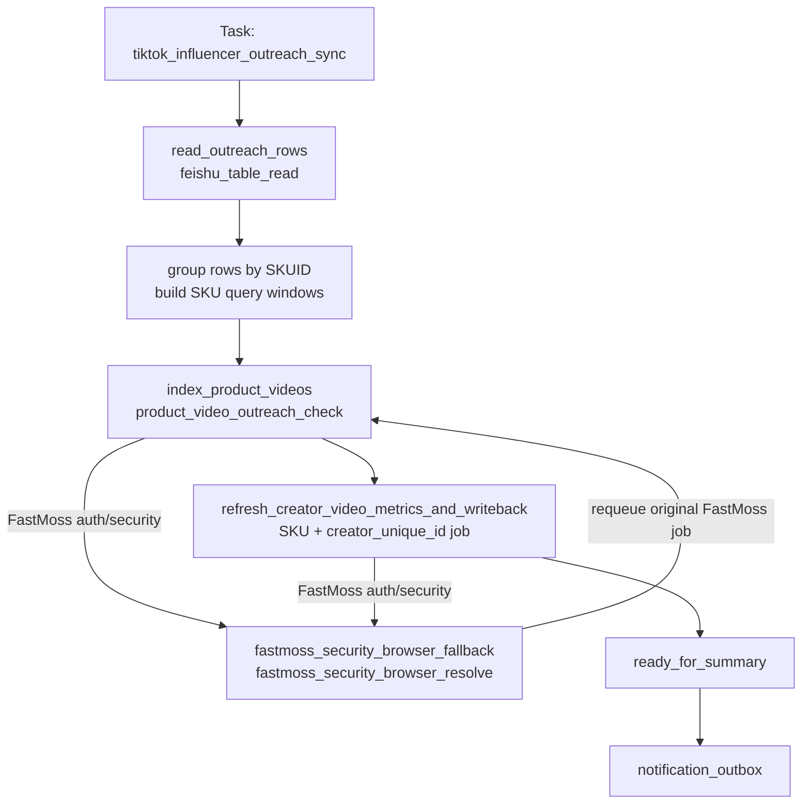

# 达人建联检查 Workflow 设计

日期: 2026-05-28

## 1. 流程定位

达人建联检查用于维护 `TK达人建联表`。它按飞书行中的 `SKUID` 和 `达人ID` 发现商品关联视频，沉淀 SKU 与视频关系，再按 `SKU + creator_unique_id` 刷新该达人在该 SKU 下的全部视频播放量、视频数量、最高播放视频链接和最早发布时间。

常规路径使用 FastMoss HTTP API：

- `/api/goods/v3/video` 只用于发现 SKU 关联视频，并沉淀 `product + creator + video` 关系。
- `/api/video/overview` 用于获取单条视频播放量，是最终播放量统计来源。

浏览器只保留为 FastMoss 登录态或安全校验恢复能力，不作为常规视频采集来源。

## 2. Task

| 字段 | 设计 |
| --- | --- |
| Task 名称 | 达人建联检查 |
| 当前 task_code | `tiktok_influencer_outreach_sync` |
| workflow_code | `tiktok_influencer_outreach_sync` |
| 顶层表 | `task_request` |
| 编排者 | `executor_daemon` |
| 主要执行 worker | `api_worker` |
| Runtime 队列 | `api_worker_job` |
| 逻辑 job 粒度 | 表读取 job、SKU 商品视频索引 job、SKU+达人视频指标刷新并写回 job |
| 最终结果 | SKU 索引汇总、达人行刷新成功/跳过/失败计数、summary/outbox |

触发方式支持定时任务或手动触发。`force_full=true` 或显式 `start_date/end_date` 优先于飞书字段窗口。

## 3. 业务边界

本 workflow 负责：

- 读取 `TK达人建联表` 中 `SKUID`、`达人ID`、`视频链接`、`视频发布时间`、`检查时间`、`播放量`、`视频数量`、`更新时间`。
- 跳过 `SKUID` 为空或 `达人ID` 为空的行。
- 按 SKU 分组，计算每个 SKU 的商品视频分页窗口。
- 按 SKU 请求 `/api/goods/v3/video`，对新采集到的视频做数据库查重、插入或更新，并写入 product-video 关系。
- 按飞书行中的 `SKU + creator_unique_id` 从数据库查询该达人该 SKU 下全部已知视频。
- 对同一 `SKU + creator_unique_id` 下的全部视频请求 `/api/video/overview`，全部成功后聚合并写回该飞书行。

本 workflow 不负责：

- 自动维护 `SKUID` 或 `达人ID`。
- 创建新的达人建联表行。
- 使用 `/api/goods/v3/video` 的 `play_count` 作为最终播放量。
- 新增本地 SKU 游标表；商品视频分页窗口以飞书远程表字段为准。
- 30 天未履约提醒。

允许部分成功。一个 SKU 索引失败只影响该 SKU；一个 `SKU + creator_unique_id` 指标刷新失败只影响该飞书行，重试耗尽后跳过，不阻塞其他达人。

## 4. Workflow



## 5. Stage 设计

| Stage code | 进入条件 | 编排动作 | 派生 Job | 退出条件 | 失败策略 |
| --- | --- | --- | --- | --- | --- |
| `read_outreach_rows` | task 创建后 | 读取达人建联表，生成有效行、跳过摘要、SKU 分组和分页窗口 | `feishu_table_read` | 得到有效行或确认无候选 | 读表失败则 task 失败 |
| `index_product_videos` | 已得到 SKU 分组 | 每个 unique `SKUID` 派发 1 个商品视频索引 job | `product_video_outreach_check` | 所有 SKU 索引 job 终态 | 单 SKU 失败则该 SKU 下达人刷新不派发 |
| `fastmoss_security_browser_fallback` | SKU 索引或视频 overview 遇到 FastMoss auth/security 恢复需求 | 使用 browser worker 恢复共享 cookie，并 requeue 原 waiting API job | `fastmoss_security_browser_resolve` | browser 恢复成功后原 job 被 requeue | browser 恢复失败则原 waiting API job 标记失败，并使整个 task 失败 |
| `refresh_creator_video_metrics_and_writeback` | SKU 视频索引已成功 | 按有效飞书行派发 `SKU + creator_unique_id + record_id` job，采集 overview、落快照、聚合并写回飞书 | `outreach_creator_video_metric_refresh` | 所有达人行刷新 job 终态 | 单行失败按 job retry；3 次失败后跳过该行 |
| `ready_for_summary` | SKU 索引和达人行刷新均终态 | 汇总 SKU、达人行、写回结果并生成 outbox | workflow finalizer | task 终态 | summary 失败不改变已完成外部副作用 |

`writeback_outreach_rows` 不再作为独立 stage。飞书写回合并在 `refresh_creator_video_metrics_and_writeback` 的 `SKU + creator_unique_id` job 内完成，以保证单个达人行的采集、聚合和写回作为同一业务单元成功或失败。

## 6. Job 设计

| Job | Runtime 表 / job 类型 | Worker | Handler | Adapter / Mapper / Flow |
| --- | --- | --- | --- | --- |
| 建联表读取 | `api_worker_job` / `feishu_table_read` | `api_worker` | `feishu_table_read` | `outreach_source_adapter` |
| SKU 商品视频索引 | `api_worker_job` / `product_video_outreach_check` | `api_worker` | `product_video_outreach_check` | FastMoss product videos index flow |
| SKU+达人指标刷新并写回 | `api_worker_job` / `outreach_creator_video_metric_refresh` | `api_worker` | `outreach_creator_video_metric_refresh` | video overview fetch + metric snapshot + Feishu row update |
| FastMoss 登录态恢复 | `task_execution` / `fastmoss_security_browser_resolve` | `browser_worker` | `fastmoss_security_browser_resolve` | 复用 FastMoss security fallback |
| 父任务汇总 | `task_request` finalize | `executor_daemon` | workflow finalizer | outreach summary policy |

### 6.1 `feishu_table_read` 输入输出

读取字段固定为：

- `SKUID`
- `达人ID`
- `视频链接`
- `视频发布时间`
- `检查时间`
- `播放量`
- `视频数量`
- `更新时间`

`outreach_source_adapter` 输出所有有效行；已有 `视频链接` 的行不能跳过，因为它仍需要刷新播放量和视频数量。当前业务约束下，`SKU + creator_unique_id` 在达人建联表中唯一。

示例输出：

```json
{
  "source_record_id": "rec...",
  "business_key": "outreach:{record_id}",
  "product_id": "1732266893752242590",
  "creator_unique_id": "heidiann__",
  "existing_video_url": "",
  "existing_video_published_date": "",
  "existing_play_count": 0,
  "existing_video_count": 0,
  "last_checked_at": "2026-05-21",
  "last_updated_at": "2026-05-27",
  "writeback_context": {
    "table_code": "tk_influencer_outreach",
    "record_id": "rec..."
  }
}
```

跳过行必须进入 adapter summary，至少区分：`missing_product_id`、`missing_creator_unique_id`。已有 `视频链接` 不再作为跳过原因。

### 6.2 SKU 商品视频分页窗口

分页窗口按 SKU 计算：

1. `force_full=true` 时，使用 `d_type=0`。
2. 显式指定 `start_date/end_date` 时，使用显式日期窗口。
3. 如果 SKU 下存在 `视频链接` 为空的达人行：
   - 只使用这些无视频链接行计算窗口；已有 `视频链接` 的达人行不参与本次分页窗口计算。
   - 如果无视频链接行都没有 `检查时间`，使用 `d_type=0`。
   - 如果无视频链接行存在 `检查时间`，取最早的 `检查时间 - 1 天` 作为 `start_date`，任务触发日期作为 `end_date`。
4. 只有当 SKU 下全部达人行都有 `视频链接` 时，才使用 `更新时间` 计算新内容发现窗口：
   - 如果这些行存在 `更新时间`，取最晚的 `更新时间 - 1 天` 作为 `start_date`，任务触发日期作为 `end_date`。
   - 如果这些行都没有 `更新时间`，使用 `d_type=0`。

### 6.3 `product_video_outreach_check` payload

每个 SKU 1 个 job，payload 保存该 SKU 下飞书行的最小上下文和分页窗口：

```json
{
  "product_id": "1732266893752242590",
  "trigger_date": "2026-05-28",
  "query_window": {
    "mode": "date_range",
    "start_date": "2026-05-20",
    "end_date": "2026-05-28"
  },
  "rows": [
    {
      "source_record_id": "rec...",
      "creator_unique_id": "heidiann__",
      "existing_video_url": "",
      "last_checked_at": "2026-05-21",
      "last_updated_at": "2026-05-27"
    }
  ]
}
```

该 job 调用 `/api/goods/v3/video`，`pagesize=5`，分页直到接口无数据、当前页不足 page size 或达到 `data.total`。如果单页请求返回 HTTP 200 但 FastMoss 业务 `code=500`，视为页级临时失败，按 10/20/30 秒退避重试当前页；重试耗尽后该 SKU 索引失败，result 记录已抓取的 `partial_video_rows` 和 `failed_page`，该 SKU 下达人刷新不派发。

职责：

- 对返回视频归一化 `product_id`、`creator_unique_id`、`video_id`、`published_date`、`video_url`。
- 对新采集到的 video 做数据库查重、插入或更新。
- 写入或更新 `tk_video_product_relations`。
- 不使用列表接口 `play_count` 作为最终播放量。

### 6.4 `product_video_outreach_check` result

Runtime result 只保存小型归一化结果和计数，不保存完整 FastMoss 原始响应：

```json
{
  "product_id": "1732266893752242590",
  "fetch_status": "success",
  "query_window": {
    "mode": "date_range",
    "start_date": "2026-05-20",
    "end_date": "2026-05-28"
  },
  "indexed_video_count": 253,
  "new_video_count": 12,
  "updated_video_count": 241,
  "target_creator_count": 18,
  "summary": {
    "fetched_video_count": 253,
    "indexed_video_count": 253,
    "failed_video_count": 0
  }
}
```

失败 SKU result 必须包含 `product_id`、`fetch_status=failed`、标准化错误摘要。失败 SKU 不派发该 SKU 下的 `outreach_creator_video_metric_refresh` job。

### 6.5 `outreach_creator_video_metric_refresh` payload

每个飞书有效行 1 个 job，粒度为 `SKU + creator_unique_id + source_record_id`。当前业务约束下 `SKU + creator_unique_id` 唯一，但 payload 保留 `source_record_id` 作为飞书写回定位。

```json
{
  "product_id": "1732266893752242590",
  "creator_unique_id": "heidiann__",
  "source_record_id": "rec...",
  "trigger_date": "2026-05-28",
  "source_fields": {
    "视频链接": "",
    "视频发布时间": "",
    "检查时间": "2026-05-21",
    "播放量": 0,
    "视频数量": 0,
    "更新时间": ""
  }
}
```

职责：

1. 以飞书行中的 `product_id + creator_unique_id` 为依据，从数据库查询该 SKU 下该 creator 的全部已知视频。
2. 如果没有视频：
   - 原 `视频链接` 为空时，写回 `检查时间`，表示本次已检查但未发现视频。
   - 原 `视频链接` 不为空时，不写播放量、视频数量或视频链接，记录为索引缺失或跳过。
3. 如果有 M 条视频：
   - 必须对 M 条视频全部成功请求 `/api/video/overview`。
   - 全部成功后写入 `tk_video_metric_snapshots`。
   - 聚合 `播放量`、`视频数量`、最高播放 `视频链接`、最早 `视频发布时间`。
   - 按 diff 写回当前飞书 row。
4. 任意 video overview 失败时，不写飞书聚合结果，job 按通用 retry 重试。
5. 三次失败后跳过该 `SKU + creator_unique_id` 行，进入 summary 的 failed/skipped 统计。

### 6.6 `outreach_creator_video_metric_refresh` result

```json
{
  "product_id": "1732266893752242590",
  "creator_unique_id": "heidiann__",
  "source_record_id": "rec...",
  "refresh_status": "success",
  "video_count": 12,
  "overview_success_count": 12,
  "overview_failed_count": 0,
  "total_play_count": 321000,
  "highest_play_video_url": "https://www.tiktok.com/@heidiann__/video/7641370220849859854",
  "earliest_published_date": "2026-05-19",
  "feishu_written": true,
  "written_fields": ["视频链接", "视频发布时间", "播放量", "视频数量", "更新时间"]
}
```

## 7. FastMoss Flow

### 7.1 商品视频索引

商品视频索引 flow 使用 `FastMossHTTPSession.list_product_videos` 调用 `/api/goods/v3/video`。

实现阶段需要保证：

- 支持 `d_type=0` 全量分页。
- 支持 `start_date` / `end_date` 日期窗口。
- 自定义日期范围时不传 `d_type`。
- 固定 `pagesize=5`。
- 增加分页迭代能力，按 `data.total`、当前页行数和 `pagesize` 收敛。

### 7.2 视频 overview

视频指标刷新 flow 使用 `FastMossHTTPSession.get_video_overview` 调用 `/api/video/overview`。

实现阶段需要保证：

- 单条 video overview 成功后才写入一条 `tk_video_metric_snapshots`。
- 同一 `SKU + creator_unique_id` 下所有目标视频 overview 全部成功后，才计算并写回聚合结果。
- overview 失败不能写半截 `播放量`、`视频数量` 或最高播放视频链接。

### 7.3 FastMoss browser fallback

`fastmoss_security_browser_resolve` 默认使用浏览器 profile 的现有 FastMoss 登录态。打开 profile 后先导出当前 `fastmoss.com` cookie 摘要；如果 profile 已有 `fd_tk`，不注入纯 HTTP 登录接口产生的 cookie，避免覆盖浏览器风控态。

只有以下情况才允许导入纯 HTTP 登录 cookie：

- profile 中没有 `fd_tk`。
- 显式要求配置登录或清理浏览器会话后重新登录。
- payload 显式开启 `fastmoss_browser_import_login_cookies` 或 `fastmoss_import_login_cookies`。

如果 payload 未传 browser profile，fallback 使用环境配置中的 `DEFAULT_PROFILE_REF`，本地 Roxy 测试默认应指向 `roxy-tiktok`。

## 8. 飞书写回设计

`outreach_creator_video_metric_refresh` 内完成当前飞书 row 写回，不再派发独立 `feishu_table_write` stage。它只更新系统维护字段：

| 字段 | 写入条件 | 来源 | 覆盖策略 |
| --- | --- | --- | --- |
| `视频链接` | 聚合结果存在可写 URL，且最高播放视频 URL 与当前值不同 | SKU+达人最高播放视频 | 可覆盖 |
| `视频发布时间` | 聚合结果存在可写 URL，且飞书原字段为空 | SKU+达人最早发布视频时间 | 只补空，不覆盖 |
| `检查时间` | 聚合结果没有可写 URL，且飞书原行没有 `视频链接` | task 触发日期 | 系统覆盖 |
| `播放量` | 聚合结果存在可写 URL，目标视频 overview 全部成功且展示值变化 | SKU+达人全部视频播放量总和格式化值 | 系统覆盖 |
| `视频数量` | 聚合结果存在可写 URL，数据库已知视频数量变化 | SKU+达人全部已知视频数量 | 系统覆盖 |
| `更新时间` | 本次实际写入 `视频链接`、`视频发布时间`、`播放量` 或 `视频数量` | task 触发日期 | 系统覆盖 |

写回规则：

- 每个 `outreach_creator_video_metric_refresh` job 先按当前飞书行的 `SKUID + creator_unique_id` 从 DB 查询全部已知 video；有 video 时必须全部 overview 成功后才进入聚合写回。
- 聚合结果存在可写 URL：不更新 `检查时间`；按需刷新 `视频链接`、`视频发布时间`、`播放量`、`视频数量` 和 `更新时间`。
- 聚合结果没有可写 URL，且飞书原行没有 `视频链接`：只写 `检查时间`，不写 `更新时间`。
- 聚合结果没有可写 URL，但飞书原行已有 `视频链接`：视为本地视频索引缺失或历史视频尚未沉淀，跳过该行，不写 `检查时间` 或其他字段。
- `播放量` 写飞书前使用展示格式：小于 10000 写 `<1W`，大于等于 10000 按万向下截断写 `nW`；内部 snapshot 和聚合统计仍保留原始数值。
- 若聚合结果与飞书现有值一致，且无需写 `检查时间`，则不写该行。
- 飞书写回失败视为当前 `SKU + creator_unique_id` job 失败并重试；重试耗尽后跳过该行。

## 9. 幂等与重试

- `read_outreach_rows` 可重复执行；重复读取只会重新生成候选摘要。
- `product_video_outreach_check` 的 dedupe key 使用 `task_request_id + product_id + query_window`。
- `outreach_creator_video_metric_refresh` 的 dedupe key 使用 `task_request_id + product_id + creator_unique_id + source_record_id`。
- SKU 视频索引 upsert 和 product-video 关系 upsert 必须幂等。
- 视频 metric snapshot 是 append-only；重复 overview 成功会追加新快照。
- 飞书写回使用 Feishu `record_id` 更新，不新增行。
- 同一行重复写入相同字段值视为幂等成功。
- FastMoss auth/session/security 错误进入 browser fallback；workflow 发现 waiting fallback job 后优先切入 `fastmoss_security_browser_fallback`，不等待同 stage 其他 pending/running job 全部完成。
- browser fallback 成功后原 waiting API job requeue，父任务回到原 source stage 继续执行。
- browser fallback 失败后原 waiting API job 标记为 failed，父 task 直接失败。
- `outreach_creator_video_metric_refresh` 三次失败后跳过该行，不阻塞其他达人。

## 10. Summary / Outbox

summary 使用面向运营的行级口径，至少包含：

- 读取总行数。
- 有效达人行数。
- 跳过行数及原因分布。
- SKU 总数。
- SKU 视频索引成功数 / 失败数。
- SKU+达人刷新成功数。
- 无视频但已写检查时间行数。
- overview 失败后跳过行数。
- 飞书写回成功行数 / 失败行数。
- 视频数量变化行数。
- 播放量变化行数。

默认 outbox 标题为 `达人建联检查完成`。明细中使用 `SKUID`、`达人ID`、飞书记录、刷新状态和错误摘要，不暴露 FastMoss cookie、完整原始响应或敏感运行配置。

## 11. 需要新增或调整的实现组件

| 类型 | 建议名称 | 位置 |
| --- | --- | --- |
| workflow contract | `tiktok_influencer_outreach_sync.yaml` | `contracts/workflow/` |
| implementation manifest | `tiktok_influencer_outreach_sync.yaml` | `src/automation_business_scaffold/contracts/workflow/` |
| source adapter | `outreach_source_adapter` | `domains/tiktok/mappers/` |
| SKU 视频索引 handler | `product_video_outreach_check` | `domains/tiktok/jobs/` |
| SKU+达人指标刷新并写回 handler | `outreach_creator_video_metric_refresh` | `domains/tiktok/jobs/` |
| Feishu row projection/update mapper | `outreach_result_projection_mapper` 或专用 row updater | `domains/tiktok/projections/` |
