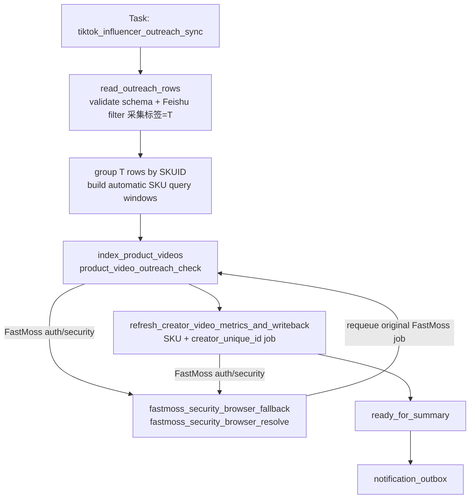

# 达人建联检查 Workflow 设计

日期: 2026-08-17

设计状态: 已确认，已与 workflow contract、实现和测试同步

## 1. 流程定位

达人建联检查用于维护 `TK达人建联表`。它只从表路由所配置视图中读取 `采集标签` 精确等于大写 `T` 的行，按这些行中的 `SKUID` 和 `达人ID` 发现商品关联视频，沉淀 SKU 与视频关系，再按 `SKU + creator_unique_id` 刷新该达人在该 SKU 下的全部视频播放量、视频数量、最高播放视频链接和最早发布时间。候选边界是“配置视图中的记录 ∩ `采集标签=T`”，不绕过现有 `view_id` 扩大到物理表全部记录。

常规路径使用 FastMoss HTTP API：

- `/api/goods/v3/video` 只用于发现 SKU 关联视频，并沉淀 `product + creator + video` 关系。
- `/api/video/overview` 用于获取单条视频播放量，是最终播放量统计来源。

浏览器只保留为 FastMoss 登录态或安全校验恢复能力，不作为常规视频采集来源。

## 2. Task

| 字段 | 设计 |
| --- | --- |
| Task 名称 | 达人建联检查 |
| 当前 task_code | `tiktok_influencer_outreach_sync` |
| workflow_code | `tiktok_influencer_outreach_sync` |
| 目标 contract_revision | `2026-08-17`（达人建联专属 revision） |
| 顶层表 | `task_request` |
| 编排者 | `executor_daemon` |
| 主要执行 worker | `api_worker` |
| Runtime 队列 | `api_worker_job` |
| 逻辑 job 粒度 | 表读取 job、SKU 商品视频索引 job、SKU+达人视频指标刷新并写回 job |
| 最终结果 | SKU 索引汇总、达人行刷新成功/跳过/失败计数、summary/outbox |

触发方式支持定时任务、手动触发或 CLI 触发配置视图中的 `T` 候选集。候选范围、商品视频窗口和任务日期都不接受人工覆盖；`source_record_ids`、`force_full`、顶层 `start_date`、顶层 `end_date` 和调用方 `trigger_date` 从本 revision 起删除。

### 2.1 Task 输入契约变更

- `source_table_ref` 仍是归一化 task payload 的必要字段，但其唯一合法值是固定逻辑路由 `feishu://mujitask/tk_influencer_outreach`；入口可以补齐该默认值，调用方不能借此选择其他表或视图。该逻辑路由只由受控部署配置 `TK_INFLUENCER_OUTREACH` 解析实际 `table_id/view_id`，定时、手动和 CLI 触发使用同一候选策略。
- `source_record_ids`、`force_full`、顶层 `start_date`、顶层 `end_date` 和调用方提供的 `trigger_date` 从目标 payload contract 删除。
- workflow preflight 在派发任何 job 前检查原始请求是否出现已删除字段；只要字段出现，即使值为空也将 task 终止为 `error_type=contract`、`error_code=unsupported_outreach_task_inputs`、`retryable=false`，`details.unsupported_fields` 保存排序后的字段名。该检查允许 task request 已持久化，不要求提交 API 在持久化前同步拒绝。
- workflow preflight 同时校验 `source_table_ref`。缺失时补齐固定逻辑路由；出现原始 HTTP(S) URL、其他 alias、显式 `table_id/view_id` 或无法解析为受控路由时，以 `error_type=contract`、`error_code=invalid_outreach_source_table_ref`、`retryable=false` 终止。
- 系统以 task request `created_at` 按 `Asia/Shanghai` 自然日生成唯一任务日期，并将该系统日期传入 SKU 与达人 job 的内部 `trigger_date`；SKU job `query_window.start_date/end_date` 仍保留。这些是重试可重现和自动增量分页所需的 workflow 上下文，不是调用方输入。

## 3. 业务边界

本 workflow 负责：

- 在读取记录前校验 `TK达人建联表` 存在全部九个必需字段名；任一字段缺失或改名时 fail fast。`采集标签` 的单选类型和 `T/F` 选项属于飞书表配置前提，不在本 workflow 内扩展通用字段类型校验。
- 通过飞书服务端过滤只返回 `采集标签=T` 的记录，再在本地归一化时只保留 `采集标签`、`SKUID`、`达人ID`、`视频链接`、`视频发布时间`、`检查时间`、`播放量(W)`、`视频数量`、`更新时间`。
- 只校验和跳过 `T` 候选中 `SKUID` 为空或 `达人ID` 为空的行。
- 按 `T` 行的 SKU 分组，仅使用 `T` 行自动计算每个 SKU 的商品视频分页窗口。
- 按 SKU 请求 `/api/goods/v3/video`，对新采集到的视频做数据库查重、插入或更新，并写入 product-video 关系。
- 按飞书行中的 `SKU + creator_unique_id` 从数据库查询该达人该 SKU 下全部已知视频。
- 对同一 `SKU + creator_unique_id` 下的全部视频请求 `/api/video/overview`，全部成功后聚合并写回该飞书行。

本 workflow 不负责：

- 自动维护 `SKUID` 或 `达人ID`。
- 创建新的达人建联表行。
- 使用 `/api/goods/v3/video` 的 `play_count` 作为最终播放量。
- 新增本地 SKU 游标表；商品视频分页窗口以飞书远程表字段为准。
- 统计、解释或写回 `F`、空值或其他非 `T` 行。
- 提供指定行、强制全量或人工日期窗口覆盖。
- 30 天未履约提醒。

允许部分成功。一个 SKU 索引失败只影响该 SKU；一个 `SKU + creator_unique_id` 指标刷新失败只影响该飞书行，重试耗尽后跳过，不阻塞其他达人。

同一 SKU 在配置视图中同时存在 `T` 行和非 `T` 行时，飞书读取结果仅包含 `T` 行。该 SKU 因 `T` 行只派发一个 `product_video_outreach_check`；该 job 可沉淀 FastMoss 在自动 `query_window` 内完整分页返回的全部 SKU 视频事实，但后续只为读取快照中的 `T` 行派发达人指标刷新和飞书写回。配置视图外的行不属于本 workflow 候选集。

## 4. Workflow


```mermaid
flowchart TD
    A["Task: tiktok_influencer_outreach_sync"] --> B["read_outreach_rows<br/>validate schema + Feishu filter 采集标签=T"]
    B --> C["group T rows by SKUID<br/>build automatic SKU query windows"]
    C --> D["index_product_videos<br/>product_video_outreach_check"]
    D -->|FastMoss auth/security| R["fastmoss_security_browser_fallback<br/>fastmoss_security_browser_resolve"]
    R -->|requeue original FastMoss job| D
    D --> E["refresh_creator_video_metrics_and_writeback<br/>SKU + creator_unique_id job"]
    E -->|FastMoss auth/security| R
    E --> G["ready_for_summary"]
    G --> H["notification_outbox"]
```

## 5. Stage 设计

| Stage code | 进入条件 | 编排动作 | 派生 Job | 退出条件 | 失败策略 |
| --- | --- | --- | --- | --- | --- |
| `read_outreach_rows` | task 创建后 | 校验已删除输入和必需字段，服务端过滤读取 `T` 记录，本地归一化候选与跳过摘要 | `feishu_table_read` | 得到有效 `T` 行结果或确认无 `T` 候选 | 输入契约违反、必需字段缺失、过滤契约违反或读表失败则 task 失败；无 `T` 行则成功空结束 |
| `index_product_videos` | 已得到归一化 `T` 候选 | 从 read result 取候选，按 `SKUID` 分组，计算自动 `query_window`，每个 unique `SKUID` 派发 1 个商品视频索引 job | `product_video_outreach_check` | 所有 SKU 索引 job 终态 | 单 SKU 失败则该 SKU 下达人刷新不派发 |
| `fastmoss_security_browser_fallback` | SKU 索引或视频 overview 遇到 FastMoss auth/security 恢复需求 | 使用 browser worker 恢复共享 cookie，并 requeue 原 waiting API job | `fastmoss_security_browser_resolve` | browser 恢复成功后原 job 被 requeue | browser 恢复失败则原 waiting API job 标记失败，并使整个 task 失败 |
| `refresh_creator_video_metrics_and_writeback` | SKU 视频索引已成功 | 按有效飞书行派发 `SKU + creator_unique_id + record_id` job，采集 overview、落快照、聚合并写回飞书 | `outreach_creator_video_metric_refresh` | 所有达人行刷新 job 终态 | 单行失败按 job retry；3 次失败后跳过该行 |
| `ready_for_summary` | SKU 索引和达人行刷新均终态 | 汇总 SKU、达人行、写回结果并生成 outbox | workflow finalizer | task 终态 | summary 失败不改变已完成外部副作用 |

`writeback_outreach_rows` 不再作为独立 stage。飞书写回合并在 `refresh_creator_video_metrics_and_writeback` 的 `SKU + creator_unique_id` job 内完成，以保证单个达人行的采集、聚合和写回作为同一业务单元成功或失败。

## 6. Job 设计

| Job | Runtime 表 / job 类型 | Worker | Handler | Adapter / Mapper / Flow |
| --- | --- | --- | --- | --- |
| 建联表读取 | `api_worker_job` / `feishu_table_read` | `api_worker` | `feishu_table_read` | `outreach_source_adapter` |
| SKU 商品视频索引 | `api_worker_job` / `product_video_outreach_check` | `api_worker` | `product_video_outreach_check` | FastMoss product videos index flow |
| SKU+达人指标刷新并写回 | `api_worker_job` / `outreach_creator_video_metric_refresh` | `api_worker` | `outreach_creator_video_metric_refresh` | video overview fetch + metric snapshot + Feishu row update |
| FastMoss 登录态恢复 | `task_execution` / `fastmoss_security_browser_resolve` | `browser_worker` | `fastmoss_security_browser_resolve` | 复用 FastMoss security fallback |
| 父任务汇总 | `task_request` finalize | `executor_daemon` | workflow finalizer | outreach summary policy |

### 6.1 `feishu_table_read` 输入输出

读取字段固定为：

- `采集标签`
- `SKUID`
- `达人ID`
- `视频链接`
- `视频发布时间`
- `检查时间`
- `播放量(W)`
- `视频数量`
- `更新时间`

读取 job 的固定策略是：

1. 强制开启 schema validation，对上述全部必需字段做字段名存在性校验；任一字段缺失或改名都返回不可重试的字段缺失错误。现有校验不检查飞书字段类型或单选选项；`采集标签` 为单选 `T/F` 属于表配置前提。
2. workflow orchestrator 只使用固定逻辑路由经受控部署配置解析出的 `table_id/view_id` 构造读表 job，并固定传入 `采集标签=T` 与 `validate_schema=true`。不得把调用方原始 `source_table_ref` URL、`table_url`、`request_payload.table_refs`、`request_payload.feishu_table`、`filter_spec` 或 `validate_schema` 透传为读表路由或策略，因此定时、手动和 CLI 入口都不能改写表、视图、过滤字段、过滤值或关闭 schema validation。飞书返回记录后，再在本地按固定字段名归一化。
3. 服务端过滤后没有记录时，读取 job 正常成功且 workflow 以零候选结束。
4. `outreach_source_adapter` 在生成候选前再校验每条记录的标签值为大写 `T`。任一非 `T` 记录到达 adapter 时，视为服务端过滤契约违反并抛出明确原因；`feishu_table_read` 沿用现有 adapter 失败外壳，以 `error_type=contract`、`error_code=feishu_source_adapter_failed`、`retryable=false` 立即失败。该记录不静默丢弃，也不计入“读取飞书行数”或跳过统计。
5. submit 边界按 task payload contract 白名单拒绝未声明字段，尤其不得接受 `mock_fastmoss_*`、FastMoss 分页上限或调用方凭据变量名。OpenClaw 正式执行默认 `writeback_enabled=true`；显式试运行传 `writeback_enabled=false`，只抑制飞书写回，不绕过真实读取、FastMoss 和 Fact DB 路径。

`outreach_source_adapter` 输出所有有效 `T` 行；已有 `视频链接` 的 `T` 行不能跳过，因为它仍需要刷新播放量和视频数量。当前业务约束下，`SKU + creator_unique_id` 在达人建联表中唯一。

示例输出：

```json
{
  "source_record_id": "rec...",
  "business_key": "outreach:{record_id}",
  "product_id": "1732266893752242590",
  "creator_unique_id": "heidiann__",
  "existing_video_url": "",
  "existing_video_published_date": "",
  "existing_play_count": 0,
  "existing_video_count": 0,
  "last_checked_at": "2026-05-21",
  "last_updated_at": "2026-05-27",
  "writeback_context": {
    "table_code": "tk_influencer_outreach",
    "record_id": "rec..."
  }
}
```

只有已返回的 `T` 行业务字段缺失才进入 adapter summary，至少区分：`missing_product_id`、`missing_creator_unique_id`。`F`、空值或其他标签行不被读取，不产生跳过原因；已有 `视频链接` 不作为跳过原因。

### 6.2 SKU 商品视频分页窗口

分页窗口按 SKU 计算：

1. 只使用飞书返回的 `T` 行计算窗口，不接受 task payload 覆盖。
2. 如果 SKU 下存在 `视频链接` 为空的 `T` 行：
   - 只使用这些无视频链接 `T` 行计算窗口；已有 `视频链接` 的 `T` 行不参与本次分页窗口计算。
   - 如果无视频链接行都没有 `检查时间`，使用 `d_type=0`。
   - 如果无视频链接行存在 `检查时间`，取最早的 `检查时间 - 1 天` 作为 `start_date`，任务触发日期作为 `end_date`。
3. 只有当 SKU 下全部 `T` 行都有 `视频链接` 时，才使用这些 `T` 行的 `更新时间` 计算新内容发现窗口：
   - 如果这些 `T` 行存在 `更新时间`，取最晚的 `更新时间 - 1 天` 作为 `start_date`，任务触发日期作为 `end_date`。
   - 如果这些 `T` 行都没有 `更新时间`，使用 `d_type=0`。

这里的 `start_date/end_date` 是 workflow 从 `T` 行自动计算后写入 SKU job `query_window` 的内部字段，不是顶层 task 输入。

### 6.3 `product_video_outreach_check` payload

每个 SKU 1 个 job，payload 保存该 SKU 下飞书行的最小上下文和分页窗口：

```json
{
  "product_id": "1732266893752242590",
  "trigger_date": "2026-05-28",
  "query_window": {
    "mode": "date_range",
    "start_date": "2026-05-20",
    "end_date": "2026-05-28"
  },
  "rows": [
    {
      "source_record_id": "rec...",
      "creator_unique_id": "heidiann__",
      "existing_video_url": "",
      "last_checked_at": "2026-05-21",
      "last_updated_at": "2026-05-27"
    }
  ]
}
```

该 job 调用 `/api/goods/v3/video`，`pagesize=5`，分页直到接口无数据、当前页不足 page size 或达到 `data.total`。如果单页请求返回 HTTP 200 但 FastMoss 业务 `code=500`，视为页级临时失败，按 10/20/30 秒退避重试当前页；重试耗尽后该 SKU 索引失败，result 记录已抓取的 `partial_video_rows` 和 `failed_page`，该 SKU 下达人刷新不派发。

职责：

- 对返回视频归一化 `product_id`、`creator_unique_id`、`video_id`、`published_date`、`video_url`。
- 对新采集到的 video 做数据库查重、插入或更新。
- 写入或更新 `tk_video_product_relations`。
- 不使用列表接口 `play_count` 作为最终播放量。

### 6.4 `product_video_outreach_check` result

Runtime result 只保存小型归一化结果和计数，不保存完整 FastMoss 原始响应：

```json
{
  "product_id": "1732266893752242590",
  "fetch_status": "success",
  "query_window": {
    "mode": "date_range",
    "start_date": "2026-05-20",
    "end_date": "2026-05-28"
  },
  "indexed_video_count": 253,
  "new_video_count": 12,
  "updated_video_count": 241,
  "target_creator_count": 18,
  "summary": {
    "fetched_video_count": 253,
    "indexed_video_count": 253,
    "failed_video_count": 0
  }
}
```

失败 SKU result 必须包含 `product_id`、`fetch_status=failed`、标准化错误摘要。失败 SKU 不派发该 SKU 下的 `outreach_creator_video_metric_refresh` job。

### 6.5 `outreach_creator_video_metric_refresh` payload

每个飞书有效行 1 个 job，粒度为 `SKU + creator_unique_id + source_record_id`。当前业务约束下 `SKU + creator_unique_id` 唯一，但 payload 保留 `source_record_id` 作为飞书写回定位。

```json
{
  "product_id": "1732266893752242590",
  "creator_unique_id": "heidiann__",
  "source_record_id": "rec...",
  "trigger_date": "2026-05-28",
  "source_fields": {
    "采集标签": "T",
    "视频链接": "",
    "视频发布时间": "",
    "检查时间": "2026-05-21",
    "播放量(W)": 0,
    "视频数量": 0,
    "更新时间": ""
  }
}
```

职责：

1. 以飞书行中的 `product_id + creator_unique_id` 为依据，从数据库查询该 SKU 下该 creator 的全部已知视频。
2. 如果没有视频：
   - 原 `视频链接` 为空时，写回 `检查时间`，表示本次已检查但未发现视频。
   - 原 `视频链接` 不为空时，不写播放量、视频数量或视频链接，记录为索引缺失或跳过。
3. 如果有 M 条视频：
   - 必须对 M 条视频全部成功请求 `/api/video/overview`。
   - 全部成功后写入 `tk_video_metric_snapshots`。
   - 聚合原始播放量，并把原始总播放量除以 `10000` 后写入 `播放量(W)`，同时聚合 `视频数量`、最高播放 `视频链接`、最早 `视频发布时间`。
   - 按 diff 写回当前飞书 row。
4. 任意 video overview 失败时，不写飞书聚合结果，job 按通用 retry 重试。
5. 三次失败后跳过该 `SKU + creator_unique_id` 行，进入 summary 的 failed/skipped 统计。

### 6.6 `outreach_creator_video_metric_refresh` result

```json
{
  "product_id": "1732266893752242590",
  "creator_unique_id": "heidiann__",
  "source_record_id": "rec...",
  "refresh_status": "success",
  "video_count": 12,
  "overview_success_count": 12,
  "overview_failed_count": 0,
  "total_play_count": 321000,
  "highest_play_video_url": "https://www.tiktok.com/@heidiann__/video/7641370220849859854",
  "earliest_published_date": "2026-05-19",
  "feishu_written": true,
  "written_fields": ["视频链接", "视频发布时间", "播放量(W)", "视频数量", "更新时间"]
}
```

## 7. FastMoss Flow

### 7.1 商品视频索引

商品视频索引 flow 使用 `FastMossHTTPSession.list_product_videos` 调用 `/api/goods/v3/video`。

实现阶段需要保证：

- 支持 `d_type=0` 全量分页。
- 支持 workflow 自动生成的 `start_date` / `end_date` 日期窗口。
- 使用内部自动日期范围时不传 `d_type`。
- 固定 `pagesize=5`。
- 增加分页迭代能力，按 `data.total`、当前页行数和 `pagesize` 收敛。

### 7.2 视频 overview

视频指标刷新 flow 使用 `FastMossHTTPSession.get_video_overview` 调用 `/api/video/overview`。

实现阶段需要保证：

- 单条 video overview 成功后才写入一条 `tk_video_metric_snapshots`。
- 同一 `SKU + creator_unique_id` 下所有目标视频 overview 全部成功后，才计算并写回聚合结果。
- overview 失败不能写半截 `播放量(W)`、`视频数量` 或最高播放视频链接。

### 7.3 FastMoss browser fallback

`fastmoss_security_browser_resolve` 默认使用浏览器 profile 的现有 FastMoss 登录态。打开 profile 后先导出当前 `fastmoss.com` cookie 摘要；如果 profile 已有 `fd_tk`，不注入纯 HTTP 登录接口产生的 cookie，避免覆盖浏览器风控态。

只有以下情况才允许导入纯 HTTP 登录 cookie：

- profile 中没有 `fd_tk`。
- 显式要求配置登录或清理浏览器会话后重新登录。
- payload 显式开启 `fastmoss_browser_import_login_cookies` 或 `fastmoss_import_login_cookies`。

如果 payload 未传 browser profile，fallback 使用环境配置中的 `DEFAULT_PROFILE_REF`，本地 Roxy 测试默认应指向 `roxy-tiktok`。

## 8. 飞书写回设计

`outreach_creator_video_metric_refresh` 内完成当前飞书 row 写回，不再派发独立 `feishu_table_write` stage。它只更新系统维护字段：

| 字段 | 写入条件 | 来源 | 覆盖策略 |
| --- | --- | --- | --- |
| `视频链接` | 聚合结果存在可写 URL，且最高播放视频 URL 与当前值不同 | SKU+达人最高播放视频 | 可覆盖 |
| `视频发布时间` | 聚合结果存在可写 URL，且飞书原字段为空 | SKU+达人最早发布视频时间 | 只补空，不覆盖 |
| `检查时间` | 聚合结果没有可写 URL，且飞书原行没有 `视频链接` | task 触发日期 | 系统覆盖 |
| `播放量(W)` | 聚合结果存在可写 URL，目标视频 overview 全部成功且数值变化 | SKU+达人全部视频原始播放量总和除以 `10000` 后的 JSON 数字 | 系统覆盖 |
| `视频数量` | 聚合结果存在可写 URL，数据库已知视频数量变化 | SKU+达人全部已知视频数量 | 系统覆盖 |
| `更新时间` | 本次实际写入 `视频链接`、`视频发布时间`、`播放量(W)` 或 `视频数量` | task 触发日期 | 系统覆盖 |

写回规则：

- 每个 `outreach_creator_video_metric_refresh` job 先按当前飞书行的 `SKUID + creator_unique_id` 从 DB 查询全部已知 video；有 video 时必须全部 overview 成功后才进入聚合写回。
- 聚合结果存在可写 URL：不更新 `检查时间`；按需刷新 `视频链接`、`视频发布时间`、`播放量(W)`、`视频数量` 和 `更新时间`。
- 聚合结果没有可写 URL，且飞书原行没有 `视频链接`：只写 `检查时间`，不写 `更新时间`。
- 聚合结果没有可写 URL，但飞书原行已有 `视频链接`：视为本地视频索引缺失或历史视频尚未沉淀，跳过该行，不写 `检查时间` 或其他字段。
- `播放量(W)` 写入原始总播放量除以 `10000` 后的 JSON 数字，不写 `<1W` 或 `nW` 文本；内部 snapshot 和聚合统计仍保留原始数值。
- `采集标签` 门禁和任务输入收敛不改变 `粉丝数(W)` 的业务边界；当前 workflow 仍不读取、不写回该字段，也不新增达人详情调用。
- 若聚合结果与飞书现有值一致，且无需写 `检查时间`，则不写该行。
- 飞书写回失败视为当前 `SKU + creator_unique_id` job 失败并重试；重试耗尽后跳过该行。

## 9. 幂等与重试

- `read_outreach_rows` 可重复执行；重复读取只会重新生成候选摘要。
- 任务以后续 stage 复用的 `feishu_table_read` result 中归一化 `T` 候选结果快照继续执行；运行中将标签从 `T` 改为任意非 `T` 值只对下一次任务生效。该口径不要求持久化飞书原始行 artifact。
- 行从任意非 `T` 值改回 `T` 时，重新进入当前 SKU 的自动窗口计算；未增加标签切换游标，因此不保证覆盖整个非 `T` 停用期。标记为任意非 `T` 值不删除旧飞书字段或已沉淀事实。
- `product_video_outreach_check` 的 dedupe key 使用 `task_request_id + product_id + query_window`。
- `outreach_creator_video_metric_refresh` 的 dedupe key 使用 `task_request_id + product_id + creator_unique_id + source_record_id`。
- SKU 视频索引 upsert 和 product-video 关系 upsert 必须幂等。
- 视频 metric snapshot 是 append-only；重复 overview 成功会追加新快照。
- 飞书写回使用 Feishu `record_id` 更新，不新增行。
- 同一行重复写入相同字段值视为幂等成功。
- FastMoss auth/session/security 错误进入 browser fallback；workflow 发现 waiting fallback job 后优先切入 `fastmoss_security_browser_fallback`，不等待同 stage 其他 pending/running job 全部完成。
- browser fallback 成功后原 waiting API job requeue，父任务回到原 source stage 继续执行。
- browser fallback 失败后原 waiting API job 标记为 failed，父 task 直接失败。
- `outreach_creator_video_metric_refresh` 三次失败后跳过该行，不阻塞其他达人。

## 10. Summary / Outbox

summary 使用面向运营的行级口径。由于飞书在服务端已按 `采集标签=T` 过滤，“读取飞书行数”仅表示飞书返回的 `T` 行数，展示名称保持不变；summary 不包含非 `T` 行数或非 `T` 跳过原因。至少包含：

- 读取飞书行数。
- 有效达人行数。
- `T` 行中因 `SKUID` 或 `达人ID` 缺失而跳过的行数及原因分布。
- SKU 总数。
- SKU 视频索引成功数 / 失败数。
- SKU+达人刷新成功数。
- 无视频但已写检查时间行数。
- overview 失败后跳过行数。
- 飞书写回成功行数 / 失败行数。
- 视频数量变化行数。
- 播放量变化行数。

默认 outbox 标题为 `达人建联检查完成`。明细中使用 `SKUID`、`达人ID`、飞书记录、刷新状态和错误摘要，不暴露 FastMoss cookie、完整原始响应或敏感运行配置。没有 `T` 行时，workflow 以 success 结束，并保留“读取飞书行数：0”口径。

## 11. Contract 切换、发布与回退

本次同时改变候选集语义并删除旧输入，属于破坏性 workflow payload contract 变更。以下 hard-cut 约束是人工发布前提，不表示控制面已提供按 task code 原子停提交流量、批量取消或验空能力：

1. `task_code`、`workflow_code`、stage code、job code 和 handler code 保持稳定，不在 code 名称中加版本后缀。
2. `tiktok_influencer_outreach_sync` 不再使用共享默认 revision；目标专属 `contract_revision` 为 `2026-08-17`。该字段是 workflow 定义和契约标识，不是 Runtime 自动隔离或抢占机制。
3. 发布前先下线该任务调度并暂停人工与 CLI 提交，再枚举 task request、逐 `request_id` 取消；取消会阻止 pending/waiting 工作继续消费，但仍须等待所有 running API job 和 browser `task_execution` 进入终态，并确认没有该 task 的活跃 request、job、fallback execution 或 requeue 后才能部署。
4. workflow preflight 在派发任何 job 前检查 `source_record_ids`、`force_full`、顶层 `start_date`、顶层 `end_date` 或调用方 `trigger_date`。只要任一字段出现，即使值为空，也将 task 终止为 `error_type=contract`、`error_code=unsupported_outreach_task_inputs`、`retryable=false`，并在 `details.unsupported_fields` 中返回排序后的字段名；不要求提交 API 在 task request 持久化前同步拒绝。
5. 不保留旧参数兼容 adapter 或双 revision 运行分支。跨 revision 不重放依赖发布期间停止提交并完成上述 drain 验证，不由 `contract_revision` 自动保证。
6. 回退时同样先停止提交、取消 pending/waiting 工作、等待 running API job 与 browser `task_execution` 进入终态，并验证无活跃 request、job、fallback execution 或 requeue，再回退 contract 和代码。

## 12. 本次设计影响的现有组件

本次不新增 helper、service、manager 或旁路编排模块。需要同步修改或核查的现有 owner 为：

| 类型 | 建议名称 | 位置 |
| --- | --- | --- |
| workflow payload contract | `tiktok_influencer_outreach_sync_payload` | `domains/tiktok/workflows/` |
| workflow contract | `tiktok_influencer_outreach_sync.yaml` | `contracts/workflow/` |
| implementation manifest | `tiktok_influencer_outreach_sync.yaml` | `src/automation_business_scaffold/contracts/workflow/` |
| source adapter | `outreach_source_adapter` | `domains/tiktok/mappers/` |
| workflow orchestrator | `tiktok_influencer_outreach_sync/orchestrator.py` | `domains/tiktok/flows/` |
| summary/finalizer 验证 | 现有 outreach summary policy 与 contract error 保留 | `domains/tiktok/flows/` |
| feature completion contract | `code-roadmap.yaml` | `contracts/harness/` |
| 回归与契约测试 | 达人建联 workflow、source adapter、summary、非 canonical `source_table_ref` 拒绝、嵌套路由覆盖不可绕过门禁 | `tests/` |
| hard-cut 发布 runbook | 按 request 枚举、取消、drain、验空与回退步骤 | `docs/ops/` |
