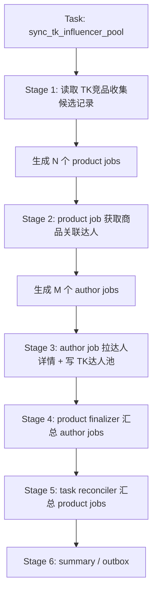
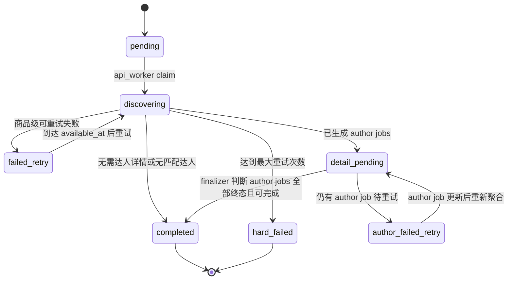
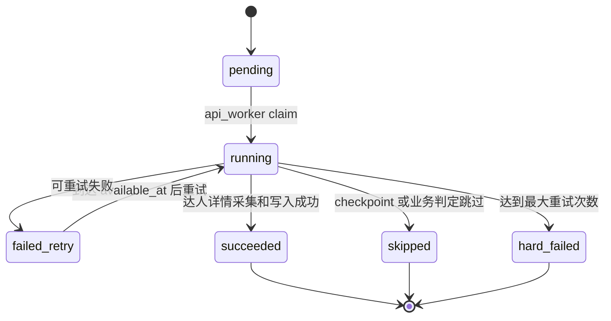
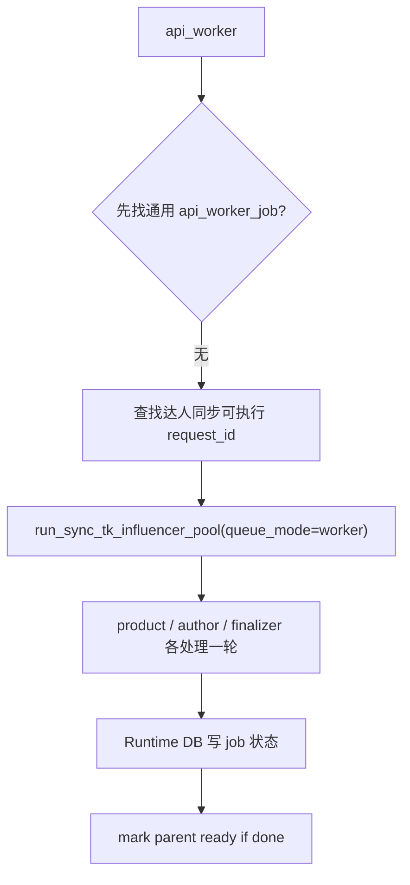

# 达人同步 Workflow 设计

日期: 2026-04-23

## 1. 流程定位

达人同步当前对应 `sync_tk_influencer_pool`。它从 `TK竞品收集` 中筛选待处理竞品，基于 FastMoss 商品关联达人列表动态生成达人详情 job，再将达人详情写入 `TK达人池`，最终回写竞品表的达人查找状态并汇总任务结果。

该流程本质上不是独立 worker 类型，而是一个 workflow / job family。它主要由 `api_worker` 执行，因为当前核心动作是飞书 API、FastMoss HTTP API、事实库和飞书写回。

## 2. Task

| 字段 | 设计 |
| --- | --- |
| Task 名称 | 达人同步 / TK 达人池同步 |
| 当前 task_code | `sync_tk_influencer_pool` |
| 顶层表 | `task_request` |
| 编排者 | `executor_daemon` |
| 主要执行 worker | `api_worker` |
| 领域 job 表 | `influencer_pool_product_job`、`influencer_pool_author_job` |
| 最终结果 | product/author 汇总、飞书达人池写入结果、竞品表状态、summary/outbox |

## 3. Workflow

当前代码中的 workflow id 为 `sync_tk_influencer_pool_v1`，当前 `WorkflowSpec` 以 `orchestrate_sync_tk_influencer_pool` 作为顶层 orchestration step。runtime 层实际会将它拆成 product job、author job 和 finalizer。

架构归一后，该 workflow 可表达为:

## 4. Stage 设计

| Stage | 作用 | Runtime 状态 |
| --- | --- | --- |
| 候选竞品读取 | 从 `TK竞品收集` 中筛选待查找/失败重试/处理中记录 | `dispatch_influencer_pool_product_jobs` |
| product fan-out | 为每条候选竞品创建 `influencer_pool_product_job` | product job `pending` |
| 商品关联达人发现 | 调 FastMoss 商品达人列表 API，创建 author jobs | product job `discovering` -> `detail_pending` |
| 达人详情采集与写入 | 拉单个达人详情，upsert `TK达人池` 和事实库 | author job `running` -> `succeeded/skipped/failed_retry` |
| product finalizer | 聚合该竞品下所有 author jobs，更新竞品表状态 | product job `completed/author_failed_retry/hard_failed` |
| task reconciler | 所有 product jobs 终态后推进父 task | `ready_for_summary` |
| summary / outbox | executor 生成 summary 并写通知 | `completed` |

## 5. Job 设计

| Job | 表 / job 类型 | Worker | Handler | Flow |
| --- | --- | --- | --- | --- |
| 候选竞品分发 | `task_request` 编排阶段 | `executor_daemon` | `_execute_sync_tk_influencer_pool_request` | `run_sync_tk_influencer_pool(queue_mode=dispatch_only)` |
| 商品达人列表发现 | `influencer_pool_product_job` | `api_worker` | `_run_one_influencer_pool_product_worker` | `_process_source_record` |
| 达人详情采集写入 | `influencer_pool_author_job` | `api_worker` | `_run_one_influencer_pool_author_worker` | `_process_author_detail_job` |
| 商品级汇总 | product finalizer | `api_worker` | `_run_one_influencer_pool_finalizer` | `summarize_influencer_pool_author_jobs` / product 状态更新 |
| 父任务汇总 | `task_request` finalize | `executor_daemon` | `_finalize_sync_tk_influencer_pool_request` | `_build_sync_tk_influencer_pool_result_from_jobs` |

## 6. Product Job 状态

Product Job 的关键原则:

- 负责一条竞品记录的达人发现。
- 负责创建对应的 author jobs。
- 创建 author jobs 后进入 `detail_pending`，不在内存中等待。
- 由 finalizer 基于 Runtime DB 聚合 author jobs 后完成。

## 7. Author Job 状态

Author Job 的关键原则:

- 一条 author job 对应一个达人详情采集和写入动作。
- 失败只影响该达人，不拖垮整个 task。
- 写飞书和事实库必须依赖 `influencer_id / product_id / source_record_id` 做幂等。

## 8. Handler 与 Flow 边界

达人同步中的 `api_worker` 不理解完整达人同步业务，只执行当前 claim 到的 product/author/finalizer job。

## 9. 颗粒度原则

达人同步不应该设计成一个大 job 一次性处理所有竞品和所有达人。

推荐颗粒度:

- 顶层 task 负责一次同步请求。
- product job 负责一条竞品记录的商品级达人发现。
- author job 负责一个达人详情和写入。
- product finalizer 负责一条竞品记录下的 author jobs 汇总。
- task reconciler 负责整个 task 下 product jobs 汇总。

这样一个达人失败只重试这个达人，一个竞品失败只影响这个竞品，父 task 可以继续推进并保留完整审计状态。

