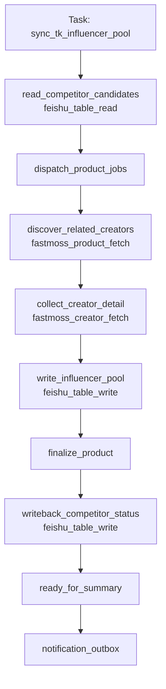
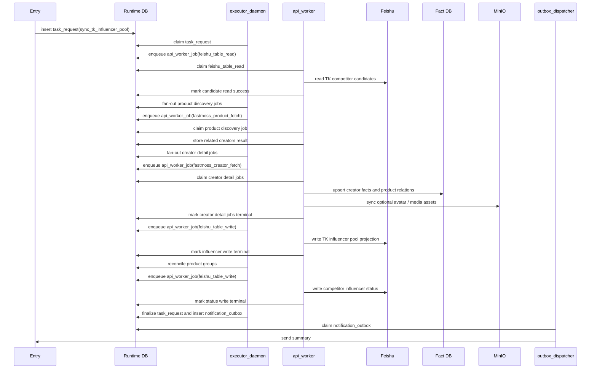
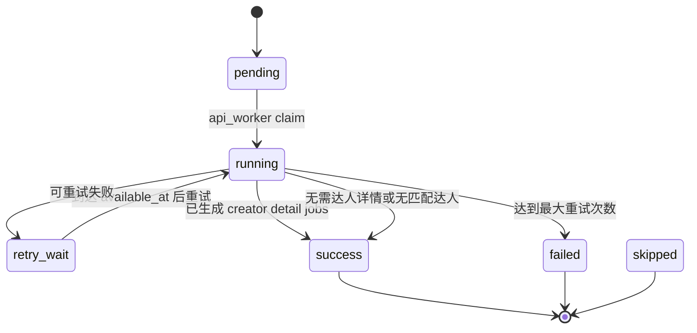
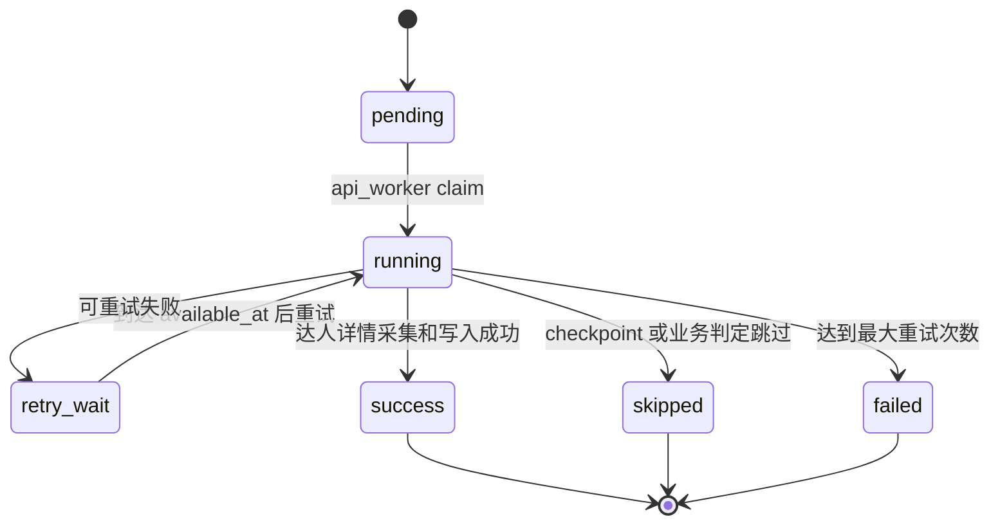
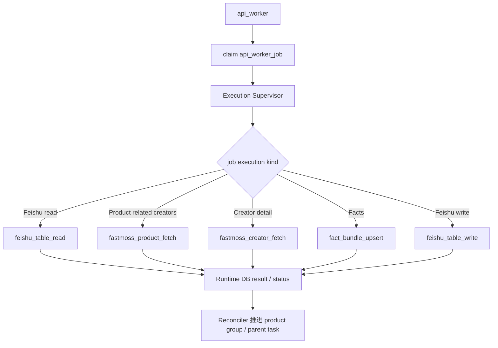

# 达人同步 Workflow 设计

日期: 2026-04-23

## 1. 流程定位

达人同步当前对应 `sync_tk_influencer_pool`。它从 `TK竞品收集` 中筛选待处理竞品，基于 FastMoss 商品关联达人列表动态生成达人详情 job，再将达人详情写入 `TK达人池`，最终回写竞品表的达人查找状态并汇总任务结果。

该流程本质上不是独立 worker 类型，而是一个 workflow / job family。它主要由 `api_worker` 执行，因为当前核心动作是飞书 API、FastMoss HTTP API、事实库和飞书写回。

## 2. Task

| 字段 | 设计 |
| --- | --- |
| Task 名称 | 达人同步 / TK 达人池同步 |
| 当前 task_code | `sync_tk_influencer_pool` |
| 顶层表 | `task_request` |
| 编排者 | `executor_daemon` |
| 主要执行 worker | `api_worker` |
| Runtime 队列 | `api_worker_job` |
| 逻辑 job 粒度 | product discovery job、creator detail job、Feishu projection job |
| 最终结果 | product/creator 汇总、飞书达人池写入结果、竞品表状态、summary/outbox |

说明: product discovery job、creator detail job 是 workflow 内部的逻辑执行颗粒度，不是独立 Runtime 表，也不是专用 handler。

## 3. Workflow

目标 workflow_code 为 `sync_tk_influencer_pool`。正式 workflow contract 只描述 Runtime stage、job 和通用 handler 映射；历史 framework 兼容入口不作为目标架构设计元素。

架构归一后，该 workflow 可表达为:



## 4. Stage 设计

| Stage code | 作用 | Runtime 表 / 状态 |
| --- | --- | --- |
| `read_competitor_candidates` | 从 `TK竞品收集` 中筛选待查找/失败重试/处理中记录 | `api_worker_job` / `feishu_table_read` |
| `dispatch_product_jobs` | 为每条候选竞品创建商品发现 `api_worker_job` | `api_worker_job` / `stage=discover_related_creators` |
| `discover_related_creators` | 通过 `fastmoss_product_fetch` 获取商品关联达人，创建 creator detail `api_worker_job` | `api_worker_job` / `job_code=fastmoss_product_fetch` |
| `collect_creator_detail` | 通过 `fastmoss_creator_fetch` 拉单个达人详情，写达人事实和媒体资产 | `api_worker_job` / `job_code=fastmoss_creator_fetch` |
| `write_influencer_pool` | 将达人事实和关系投影到 `TK达人池` | `api_worker_job` / `job_code=feishu_table_write` |
| `finalize_product` | 聚合该竞品下所有 creator detail jobs | `api_worker_job` result + reconciler aggregation |
| `writeback_competitor_status` | 回写竞品表达人查找状态 | `api_worker_job` / `feishu_table_write` |
| `ready_for_summary` | 所有 product groups 终态后生成 summary 并写通知 | `task_request` / `notification_outbox` |

## 5. Job 设计

| Job | 表 / job 类型 | Worker | Handler | Flow / Mapper |
| --- | --- | --- | --- | --- |
| 竞品候选读取 | `api_worker_job` | `api_worker` | `feishu_table_read` | `influencer_pool_source_adapter` |
| 商品达人列表发现 | `api_worker_job` / `stage=discover_related_creators` | `api_worker` | `fastmoss_product_fetch` | `detail_level=related_creators` + product relation mapper |
| 达人详情采集 | `api_worker_job` / `stage=collect_creator_detail` | `api_worker` | `fastmoss_creator_fetch` | creator fact mapper + optional `media_asset_sync` |
| 达人池写入 | `api_worker_job` / `stage=write_influencer_pool` | `api_worker` | `feishu_table_write` | `influencer_pool_projection_mapper` |
| 商品级汇总 | `api_worker_job` result scan | `executor_daemon` / reconciler | workflow finalizer | product creator status aggregator |
| 竞品状态回写 | `api_worker_job` | `api_worker` | `feishu_table_write` | `competitor_influencer_status_projection_mapper` |
| 父任务汇总 | `task_request` finalize | `executor_daemon` | workflow finalizer | product / creator detail summary policy |

约束:

- 达人同步不新增业务专用 Runtime job 表；所有 API/IO 执行单元统一进入 `api_worker_job`。
- 商品发现和达人详情只是逻辑 job 粒度，通过 `stage`、`job_code`、`business_key`、`dedupe_key`、payload 中的 `source_record_id/product_id/influencer_id` 表达。
- 如需要父子收敛，优先在通用 Runtime job schema 中补充 `parent_job_id` / `job_group` / `entity_type` / `entity_key` 这类通用字段，而不是新增达人同步专用表。
- `api_worker` 只通过通用 handler 执行外部能力: `fastmoss_product_fetch`、`fastmoss_creator_fetch`、`media_asset_sync`、`fact_bundle_upsert`、`feishu_table_write`。
- 不新增 `influencer_pool_product`、`influencer_pool_author`、`influencer_pool_finalizer` 这类业务专用 worker handler。

## 6. 进程间调度时序图

本图只表达达人同步在进程间如何调度，不展开达人筛选、关系映射、飞书字段投影等 handler 内部逻辑。



## 7. Product Discovery Job 状态



Product Discovery Job 的关键原则:

- 负责一条竞品记录的达人发现。
- 负责创建对应的 creator detail jobs。
- 创建 creator detail jobs 后自身进入 `success`，product group 进入等待收敛状态，不在内存中等待。
- 由 finalizer 基于 Runtime DB 聚合 creator detail jobs 后推进 product group 完成。

## 8. Creator Detail Job 状态



Creator Detail Job 的关键原则:

- 一条 creator detail job 对应一个达人详情采集和写入动作。
- 失败只影响该达人，不拖垮整个 task。
- 写飞书和事实库必须依赖 `influencer_id / product_id / source_record_id` 做幂等。

## 9. Handler 与 Flow 边界

达人同步中的 `api_worker` 不理解完整达人同步业务，只根据 job 的执行意图调用通用 handler。



## 10. 颗粒度原则

达人同步不应该设计成一个大 job 一次性处理所有竞品和所有达人。

推荐颗粒度:

- 顶层 task 负责一次同步请求。
- product discovery job 负责一条竞品记录的商品级达人发现。
- creator detail job 负责一个达人详情和写入。
- product finalizer 负责一条竞品记录下的 creator detail jobs 汇总。
- task reconciler 负责整个 task 下 product groups 汇总。

这样一个达人失败只重试这个达人，一个竞品失败只影响这个竞品，父 task 可以继续推进并保留完整审计状态。

## 11. P0 Contract Payload / Result 样例

本节冻结达人同步与 Feishu common、FastMoss common、Fact projection 和 projection mapper 的边界。P0 不实现真实 handler。

### 11.1 竞品候选读取: `feishu_table_read`

stage: `read_competitor_candidates`

payload:

```json
{
  "request_id": "req-influencer-001",
  "task_code": "sync_tk_influencer_pool",
  "workflow_code": "sync_tk_influencer_pool",
  "stage_code": "read_competitor_candidates",
  "source_table_ref": "feishu://mujitask/TK竞品收集",
  "field_names": ["产品链接", "SKU-ID", "节日", "商品状态", "达人查找状态", "Fastmoss价格"],
  "filter_spec": {
    "candidate_status": ["待查找", "失败重试", "处理中", ""],
    "skip_product_status": ["已下架/区域不可售"]
  },
  "adapter_code": "influencer_pool_source_adapter",
  "snapshot_policy": {
    "store_raw_rows": true
  }
}
```

result:

```json
{
  "source_rows": [
    {
      "source_record_id": "recInfluencer001",
      "source_table_ref": "feishu://mujitask/TK竞品收集",
      "product_identity": {
        "product_id": "1731194997356205027",
        "fastmoss_product_url": "https://www.fastmoss.com/zh/e-commerce/detail/1731194997356205027",
        "normalized_product_url": "https://www.tiktok.com/view/product/1731194997356205027"
      },
      "business_fields": {
        "holiday": "毕业季",
        "influencer_search_status": "待查找"
      },
      "writeback_context": {
        "competitor_status_table_ref": "feishu://mujitask/TK竞品收集",
        "record_id": "recInfluencer001"
      }
    }
  ],
  "candidate_keys": ["product:1731194997356205027"],
  "adapter_summary": {
    "input_row_count": 49,
    "source_row_count": 1
  }
}
```

### 11.2 商品达人发现: `fastmoss_product_fetch`

stage: `discover_related_creators`

payload:

```json
{
  "request_id": "req-influencer-001",
  "task_code": "sync_tk_influencer_pool",
  "workflow_code": "sync_tk_influencer_pool",
  "stage_code": "discover_related_creators",
  "product_identity": {
    "product_id": "1731194997356205027",
    "fastmoss_product_url": "https://www.fastmoss.com/zh/e-commerce/detail/1731194997356205027"
  },
  "detail_level": "related_creators",
  "source_context": {
    "source_record_id": "recInfluencer001",
    "holiday": "毕业季"
  },
  "relation_policy": {
    "creator_sold_count_min": 50,
    "creator_follower_count_min": 5000
  }
}
```

result:

```json
{
  "product_fact_bundle": {
    "product_id": "1731194997356205027",
    "entity_key": "fastmoss_product:1731194997356205027"
  },
  "related_creators": [
    {
      "creator_id": "7228697870020199470",
      "creator_identity": {
        "creator_id": "7228697870020199470",
        "uid": "7228697870020199470",
        "profile_url": "https://www.fastmoss.com/zh/influencer/detail/7228697870020199470"
      },
      "display_name": "Anonymous Billionaires",
      "metrics": {
        "sold_count": 72,
        "follower_count": 128000
      },
      "matched_conditions": {
        "creator_sold_count_min": true,
        "creator_follower_count_min": true
      },
      "source_context": {
        "source_record_id": "recInfluencer001",
        "product_id": "1731194997356205027",
        "holiday": "毕业季"
      }
    }
  ],
  "raw_response_refs": [
    "artifact://fastmoss/product/1731194997356205027/author.json"
  ]
}
```

### 11.3 达人详情采集: `fastmoss_creator_fetch`

stage: `collect_creator_detail`

payload:

```json
{
  "request_id": "req-influencer-001",
  "task_code": "sync_tk_influencer_pool",
  "workflow_code": "sync_tk_influencer_pool",
  "stage_code": "collect_creator_detail",
  "creator_identity": {
    "creator_id": "7228697870020199470",
    "uid": "7228697870020199470",
    "profile_url": "https://www.fastmoss.com/zh/influencer/detail/7228697870020199470"
  },
  "region": "US",
  "detail_level": "profile_metrics_contact_goods",
  "source_context": {
    "source_record_id": "recInfluencer001",
    "product_id": "1731194997356205027",
    "holiday": "毕业季",
    "matched_product_sold_count": 72
  },
  "fetch_plan": {
    "date_type": 28,
    "endpoints": ["base_info", "author_index", "stat_info", "contact", "cargo_summary", "goods_list"]
  }
}
```

result:

```json
{
  "entities": {
    "creators": [
      {
        "entity_key": "fastmoss_creator:7228697870020199470",
        "creator_id": "7228697870020199470",
        "nickname": "Anonymous Billionaires",
        "avatar_url": "https://cdn.fastmoss.com/avatar.jpg",
        "metrics": {
          "follower_count": 128000,
          "aweme_28d_count": 16,
          "video_sale_amount": 32000,
          "live_sale_amount": 0
        },
        "contact": {
          "normalized_text": "",
          "available": false
        }
      }
    ]
  },
  "relations": [
    {
      "relation_key": "creator_product:7228697870020199470:1731194997356205027",
      "relation_type": "creator_promotes_product",
      "metrics": {
        "sold_count": 72,
        "sale_amount": 1299
      },
      "source_context": {
        "source_record_id": "recInfluencer001",
        "holiday": "毕业季"
      }
    }
  ],
  "observations": [
    {"entity_key": "fastmoss_creator:7228697870020199470", "metric_name": "follower_count", "metric_value": 128000}
  ],
  "media_refs": [
    {"entity_key": "fastmoss_creator:7228697870020199470", "media_type": "avatar", "source_url": "https://cdn.fastmoss.com/avatar.jpg"}
  ],
  "raw_response_refs": [
    "artifact://fastmoss/creator/7228697870020199470/base-info.json"
  ]
}
```

### 11.4 达人池写入: `influencer_pool_projection_mapper` -> `feishu_table_write`

stage: `write_influencer_pool`

payload:

```json
{
  "target_table_ref": "feishu://mujitask/TK达人池",
  "write_mode": "batch_upsert",
  "mapper_code": "influencer_pool_projection_mapper",
  "records": [
    {
      "op": "upsert",
      "business_entity_key": "creator:7228697870020199470",
      "upsert_key": {
        "field": "达人ID",
        "value": "7228697870020199470"
      },
      "fields": {
        "达人ID": "7228697870020199470",
        "达人头像": [{"asset_ref": "asset://creator/7228697870020199470/avatar"}],
        "粉丝数": "12.8W",
        "28天视频数": "16",
        "带货视频 GMV": "$3.2W",
        "带货直播 GMV": "$0",
        "带货商品图": [{"asset_ref": "asset://product/1731194997356205027/main-image"}],
        "关联商品销量": "72",
        "关联节日": ["毕业季"],
        "合作店铺": ["Graduation Shop"],
        "达人联系方式": "",
        "记录时间": "2026-04-24"
      },
      "source_context": {
        "source_record_id": "recInfluencer001",
        "product_id": "1731194997356205027",
        "relation_key": "creator_product:7228697870020199470:1731194997356205027"
      }
    }
  ]
}
```

result:

```json
{
  "written_count": 1,
  "skipped_count": 0,
  "target_record_ids": ["recInfluencerPool001"],
  "records": [
    {
      "business_entity_key": "creator:7228697870020199470",
      "record_id": "recInfluencerPool001",
      "op": "upsert",
      "status": "success"
    }
  ]
}
```

### 11.5 竞品状态回写: `competitor_influencer_status_projection_mapper`

stage: `writeback_competitor_status`

payload:

```json
{
  "target_table_ref": "feishu://mujitask/TK竞品收集",
  "write_mode": "batch_update",
  "mapper_code": "competitor_influencer_status_projection_mapper",
  "records": [
    {
      "op": "update",
      "record_id": "recInfluencer001",
      "business_entity_key": "product:1731194997356205027",
      "fields": {
        "达人查找状态": "已完成"
      },
      "source_context": {
        "matched_creator_count": 1,
        "written_creator_count": 1,
        "failed_creator_count": 0
      }
    }
  ]
}
```

result:

```json
{
  "written_count": 1,
  "target_record_ids": ["recInfluencer001"],
  "records": [
    {
      "business_entity_key": "product:1731194997356205027",
      "record_id": "recInfluencer001",
      "op": "update",
      "status": "success"
    }
  ]
}
```
