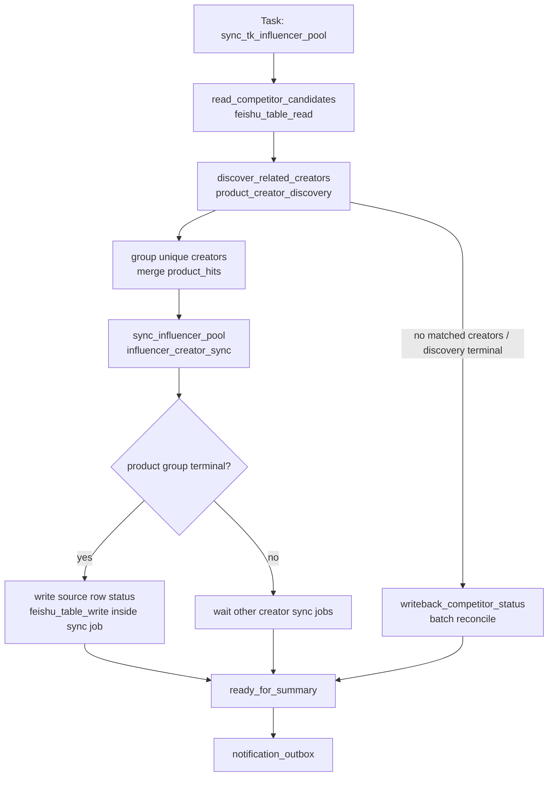
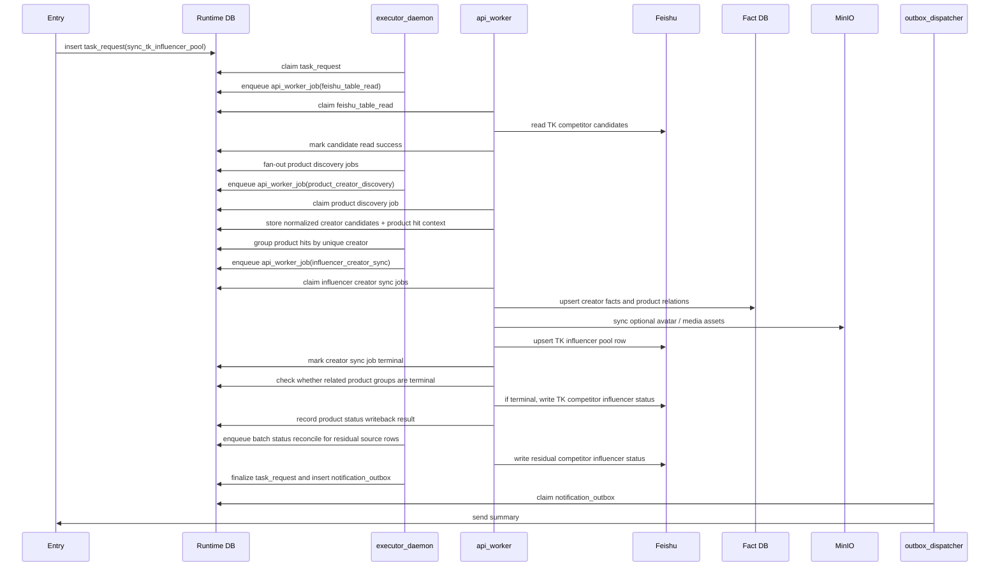
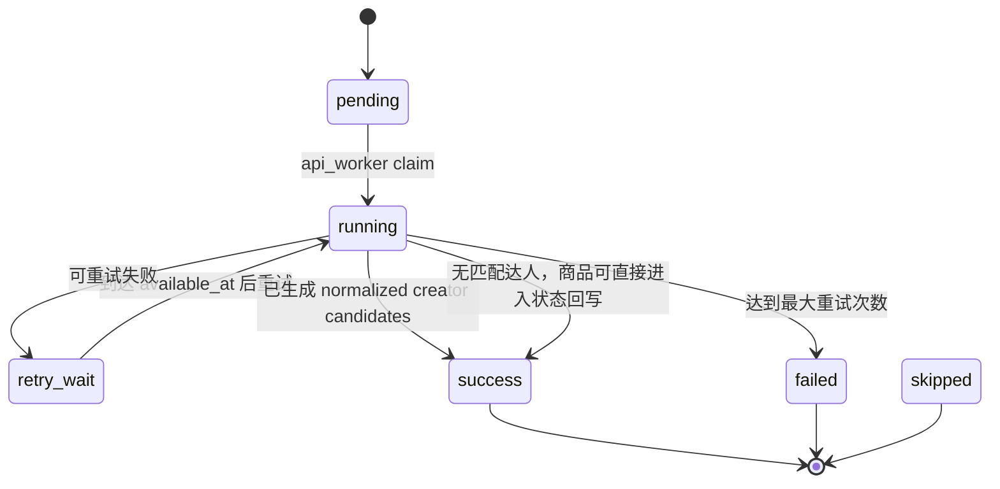
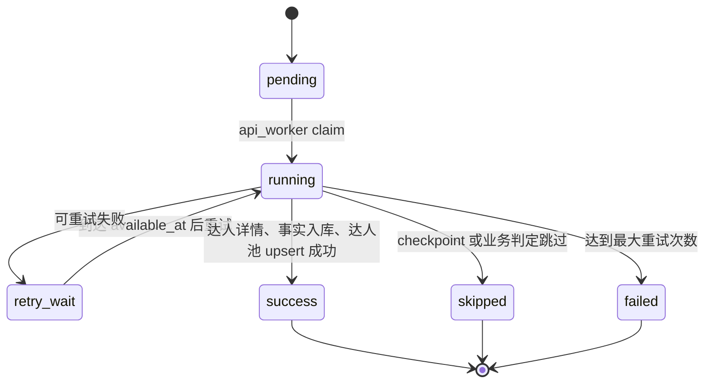
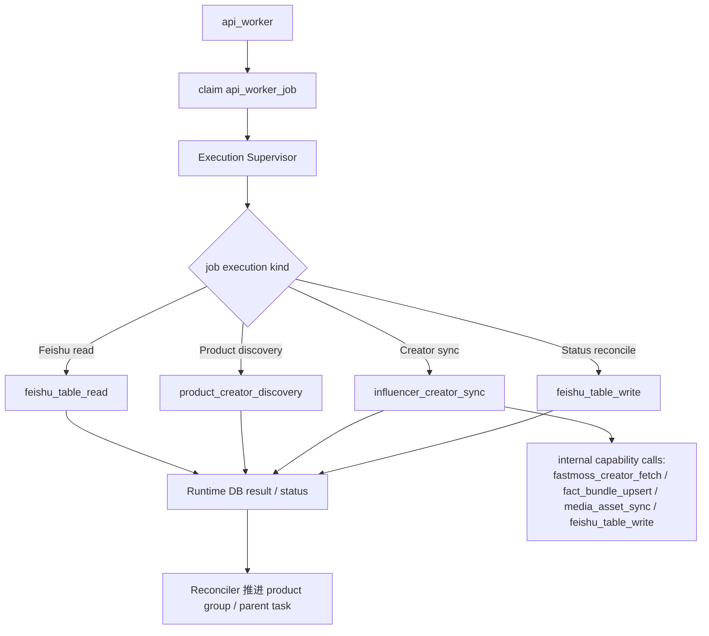

# 达人同步 Workflow 设计

日期: 2026-04-25

## 1. 流程定位

达人同步当前对应 `sync_tk_influencer_pool`。它从 `TK竞品收集` 中筛选待处理竞品，先按商品发现关联达人，再按 unique 达人同步达人详情、事实和 `TK达人池` 写回。每个达人同步 job 会携带该达人本次命中的所有商品上下文；当某个商品下所有达人同步 job 都已终态时，最后完成的达人同步 job 同步回写该商品的 `达人查找状态`。

该流程本质上不是独立 worker 类型，而是一个 workflow / job family。它主要由 `api_worker` 执行，因为当前核心动作是飞书 API、FastMoss HTTP API、事实库和飞书写回。目标颗粒度收敛为“商品发现 job + 达人同步 job”两层 fan-out：不按每个 API 拆 job，也不把整批商品或整批达人塞进一个大 job。

## 2. Task

| 字段 | 设计 |
| --- | --- |
| Task 名称 | 达人同步 / TK 达人池同步 |
| 当前 task_code | `sync_tk_influencer_pool` |
| 顶层表 | `task_request` |
| 编排者 | `executor_daemon` |
| 主要执行 worker | `api_worker` |
| Runtime 队列 | `api_worker_job` |
| 逻辑 job 粒度 | product creator discovery job、influencer creator sync job、status reconcile batch job |
| 最终结果 | product/creator 汇总、飞书达人池写入结果、竞品表状态、summary/outbox |

说明: product creator discovery job 和 influencer creator sync job 是 workflow 内部的业务执行颗粒度，统一进入 `api_worker_job`，不新增达人同步专用 Runtime 表。

## 3. Workflow

正式 workflow_code 为 `sync_tk_influencer_pool`。正式 workflow contract 只描述 Runtime stage、job 和通用 handler 映射；非正式 framework 入口不作为项目架构设计元素。

架构归一后，该 workflow 可表达为:



## 4. Stage 设计

| Stage code | 作用 | Runtime 表 / 状态 |
| --- | --- | --- |
| `read_competitor_candidates` | 从 `TK竞品收集` 中筛选待查找/失败重试/处理中记录 | 1 个 `api_worker_job` / `feishu_table_read` |
| `discover_related_creators` | 每个竞品商品 1 个 `product_creator_discovery` job，内部调用 FastMoss 商品达人列表，按销量和粉丝阈值过滤，输出 normalized creator candidates + product hit context | `api_worker_job` / `product_creator_discovery` |
| `sync_influencer_pool` | 每个 unique 达人 1 个 `influencer_creator_sync` job，payload 携带该达人本次命中的所有 `product_hits`；job 内部完成达人详情、事实入库、达人池 upsert，并在商品 group 终态时写回对应竞品商品状态 | `api_worker_job` / `influencer_creator_sync` |
| `writeback_competitor_status` | 批量兜底回写竞品表达人查找状态，处理无匹配达人、商品发现失败、重试耗尽或未被最后一个达人同步 job 成功写回的 source rows；单个 job 最多 50 条 source rows | `api_worker_job` / `feishu_table_write` |
| `ready_for_summary` | 汇总 product / creator / Feishu writeback 结果并写通知 | `task_request` / `notification_outbox` |

默认 outbox 文案由 `domains/tiktok/projections/outbox_message_projection.py` 生成，标题为 `TK达人池同步完成`。默认 `plain_text_detail` 必须使用简单商品口径，包含商品总数、商品成功数、商品失败数、子任务成功数，以及每个 SKU 的 `record/status/更新达人数量/创建达人数量/warnings` 摘要；不使用“商品组”作为面向用户的描述。可通过 task payload `outbox_message_format` 或 `outbox_message_template` 覆盖输出格式。

## 5. Job 设计

| Job | 表 / job 类型 | Worker | Handler | Flow / Mapper |
| --- | --- | --- | --- | --- |
| 竞品候选读取 | `api_worker_job` | `api_worker` | `feishu_table_read` | `influencer_pool_source_adapter` |
| 商品达人发现 | `api_worker_job` / `stage=discover_related_creators` / 每个商品 1 个 | `api_worker` | `product_creator_discovery` | 内部复用 `fastmoss_product_fetch`，输出 normalized creator candidates + product hit context |
| 达人同步 | `api_worker_job` / `stage=sync_influencer_pool` / 每个 unique 达人 1 个 | `api_worker` | `influencer_creator_sync` | 内部复用 `fastmoss_creator_fetch`、`fact_bundle_upsert`、`media_asset_sync`、`feishu_table_write`；写 `TK达人池` 并按 product group 终态回写 `达人查找状态` |
| 竞品状态兜底回写 | `api_worker_job` / 最多 50 条 source rows | `api_worker` | `feishu_table_write` | `competitor_influencer_status_projection_mapper` |
| 父任务汇总 | `task_request` finalize | `executor_daemon` | workflow finalizer | product / creator / Feishu writeback summary policy |

约束:

- 达人同步不新增业务专用 Runtime job 表；所有 API/IO 执行单元统一进入 `api_worker_job`。
- 商品发现和达人同步只是逻辑 job 粒度，通过 `stage`、`job_code`、`business_key`、`dedupe_key`、payload 中的 `source_record_id/product_id/creator_id/product_hits` 表达。
- 如需要父子收敛，优先在通用 Runtime job schema 中补充 `parent_job_id` / `job_group` / `entity_type` / `entity_key` 这类通用字段，而不是新增达人同步专用表。
- `product_creator_discovery` 是商品粒度业务 job，内部复用 FastMoss 商品达人列表能力，不再拆成商品 base、overview、author list 等多个 Runtime job。
- `influencer_creator_sync` 是达人粒度业务 job，内部完成达人详情、事实入库、素材同步、`TK达人池` upsert 和商品终态状态回写，不再把 `persist_creator_facts`、`write_influencer_pool` 拆成独立 Runtime job。
- 不新增 `influencer_pool_product`、`influencer_pool_author`、`influencer_pool_finalizer` 这类历史业务专用 worker handler；新业务 job 名称以 `product_creator_discovery` 和 `influencer_creator_sync` 为准。
- 商品状态回写需要幂等。若多个达人同步 job 同时判断同一个 product group 已终态，只允许一个稳定 dedupe key 产生最终写回，其余重复写回应被跳过或视为幂等成功。

## 6. 进程间调度时序图

本图只表达达人同步在进程间如何调度，不展开达人筛选、关系映射、飞书字段投影等 handler 内部逻辑。



## 7. Product Creator Discovery Job 状态



Product Creator Discovery Job 的关键原则:

- 负责一条竞品记录的达人发现。
- 内部调用 FastMoss 商品达人列表，不把商品 base、overview、author list 等 API 拆成多个 Runtime job。
- 按 `sold_count > 50`、`follower_count > 5000` 过滤后输出 normalized creator candidates 和 product hit context。
- discovery job 自身不直接写 `TK达人池`；它只提供后续按 unique 达人聚合的输入。
- 如果无匹配达人，商品 group 可以直接进入状态回写，最终状态为 `已完成`，并在 summary 中记录 `matched_creator_count=0`。

## 8. Influencer Creator Sync Job 状态



Influencer Creator Sync Job 的关键原则:

- 一条 influencer creator sync job 对应一个 unique 达人的同步动作，payload 携带该达人本次命中的所有 `product_hits`。
- 该 job 内部完成达人详情采集、Fact DB upsert、媒体资产同步、`TK达人池` upsert，不再把这些连续依赖步骤拆成多个 Runtime job。
- 失败只影响该达人，不拖垮整个 task。
- 写飞书和事实库必须依赖 `creator_id`、`product_hits[*].product_id`、`product_hits[*].source_record_id` 做幂等。
- job 终态后必须检查它涉及的每个 product group 是否所有相关达人同步 job 都已终态；如果是，则在同一个 job 内通过飞书写回该商品的 `达人查找状态`。
- 商品状态写回规则为: 所有相关达人同步成功或跳过时写 `已完成`；存在不可恢复失败、达人池写入失败或商品级信息不足时写 `失败重试`，并带失败原因摘要。

## 9. Handler 与 Flow 边界

达人同步中的 `api_worker` 只 claim Runtime job，并根据 `handler_code` 调用准入 handler。业务 job 可以在自己的 handler 内部串行复用 capability handler，但它必须把内部步骤、错误和最终副作用汇总到同一个 Runtime job result。



## 10. 颗粒度原则

达人同步不应该设计成一个大 job 一次性处理所有竞品和所有达人。

推荐颗粒度:

- 顶层 task 负责一次同步请求。
- product creator discovery job 负责一条竞品记录的商品级达人发现。
- influencer creator sync job 负责一个 unique 达人的详情、事实、达人池写入，并在对应商品下所有达人 job 完成时写回该商品状态。
- status reconcile batch job 只处理无达人、discovery 失败、重试耗尽或异常残留的 source rows；每个 job 最多 50 条。
- task reconciler 负责整个 task 下 product / creator / Feishu writeback 汇总和 outbox。

这样一个达人失败只重试这个达人，一个竞品失败只影响这个竞品，父 task 可以继续推进并保留完整审计状态。示例: 一次读到 20 个商品，发现 60 个候选达人，去重后 35 个达人，目标 Runtime job 数量约为 `1 read + 20 discovery + 35 creator sync + 1 status reconcile + 1 outbox = 58`。

## 11. P0 Contract Payload / Result 样例

本节冻结达人同步与 Feishu common、FastMoss common、Fact projection 和 projection mapper 的边界。P0 不实现真实 handler。

### 11.1 竞品候选读取: `feishu_table_read`

stage: `read_competitor_candidates`

payload:

```json
{
  "request_id": "req-influencer-001",
  "task_code": "sync_tk_influencer_pool",
  "workflow_code": "sync_tk_influencer_pool",
  "stage_code": "read_competitor_candidates",
  "source_table_ref": "feishu://mujitask/TK竞品收集",
  "field_names": ["产品链接", "SKU-ID", "节日", "商品状态", "达人查找状态", "Fastmoss价格"],
  "filter_spec": {
    "candidate_status": ["待查找", "失败重试", "处理中", ""],
    "skip_product_status": ["已下架/区域不可售"]
  },
  "adapter_code": "influencer_pool_source_adapter",
  "snapshot_policy": {
    "store_raw_rows": true
  }
}
```

result:

```json
{
  "source_rows": [
    {
      "source_record_id": "recInfluencer001",
      "source_table_ref": "feishu://mujitask/TK竞品收集",
      "product_identity": {
        "product_id": "1731194997356205027",
        "fastmoss_product_url": "https://www.fastmoss.com/zh/e-commerce/detail/1731194997356205027",
        "normalized_product_url": "https://www.tiktok.com/view/product/1731194997356205027"
      },
      "business_fields": {
        "holiday": "毕业季",
        "influencer_search_status": "待查找"
      },
      "writeback_context": {
        "competitor_status_table_ref": "feishu://mujitask/TK竞品收集",
        "record_id": "recInfluencer001"
      }
    }
  ],
  "candidate_keys": ["product:1731194997356205027"],
  "adapter_summary": {
    "input_row_count": 49,
    "source_row_count": 1
  }
}
```

### 11.2 商品达人发现: `product_creator_discovery`

stage: `discover_related_creators`

payload:

```json
{
  "request_id": "req-influencer-001",
  "task_code": "sync_tk_influencer_pool",
  "workflow_code": "sync_tk_influencer_pool",
  "stage_code": "discover_related_creators",
  "job_code": "product_creator_discovery",
  "product_identity": {
    "product_id": "1731194997356205027",
    "fastmoss_product_url": "https://www.fastmoss.com/zh/e-commerce/detail/1731194997356205027"
  },
  "discovery_plan": {
    "internal_handler": "fastmoss_product_fetch",
    "detail_level": "related_creators",
    "page_size": 50,
    "max_pages": 5
  },
  "source_context": {
    "source_record_id": "recInfluencer001",
    "holiday": "毕业季"
  },
  "relation_policy": {
    "creator_sold_count_min": 50,
    "creator_follower_count_min": 5000
  }
}
```

result:

```json
{
  "product_fact_bundle": {
    "product_id": "1731194997356205027",
    "entity_key": "fastmoss_product:1731194997356205027"
  },
  "normalized_creator_candidates": [
    {
      "creator_id": "7228697870020199470",
      "creator_identity": {
        "creator_id": "7228697870020199470",
        "uid": "7228697870020199470",
        "profile_url": "https://www.fastmoss.com/zh/influencer/detail/7228697870020199470"
      },
      "display_name": "Anonymous Billionaires",
      "metrics": {
        "sold_count": 72,
        "follower_count": 128000
      },
      "matched_conditions": {
        "creator_sold_count_min": true,
        "creator_follower_count_min": true
      },
      "source_context": {
        "source_record_id": "recInfluencer001",
        "product_id": "1731194997356205027",
        "holiday": "毕业季"
      }
    }
  ],
  "product_hit_context": {
    "source_record_id": "recInfluencer001",
    "product_id": "1731194997356205027",
    "candidate_count": 1,
    "matched_creator_count": 1
  },
  "raw_response_refs": [
    "artifact://fastmoss/product/1731194997356205027/author.json"
  ]
}
```

### 11.3 达人同步业务 job: `influencer_creator_sync`

stage: `sync_influencer_pool`

payload:

```json
{
  "request_id": "req-influencer-001",
  "task_code": "sync_tk_influencer_pool",
  "workflow_code": "sync_tk_influencer_pool",
  "stage_code": "sync_influencer_pool",
  "job_code": "influencer_creator_sync",
  "creator_identity": {
    "creator_id": "7228697870020199470",
    "uid": "7228697870020199470",
    "profile_url": "https://www.fastmoss.com/zh/influencer/detail/7228697870020199470"
  },
  "region": "US",
  "product_hits": [
    {
      "source_record_id": "recInfluencer001",
      "product_id": "1731194997356205027",
      "holiday": "毕业季",
      "matched_product_sold_count": 72,
      "source_status_writeback": {
        "target_table_ref": "feishu://mujitask/TK竞品收集",
        "record_id": "recInfluencer001"
      }
    }
  ],
  "sync_plan": {
    "creator_fetch": {
      "internal_handler": "fastmoss_creator_fetch",
      "detail_level": "profile_metrics_contact_goods",
      "date_type": 28,
      "endpoints": ["base_info", "author_index", "stat_info", "contact", "cargo_summary", "goods_list"]
    },
    "fact_upsert": {"internal_handler": "fact_bundle_upsert"},
    "media_asset_sync": {"internal_handler": "media_asset_sync", "optional": true},
    "influencer_pool_write": {
      "internal_handler": "feishu_table_write",
      "mapper_code": "influencer_pool_projection_mapper",
      "target_table_ref": "feishu://mujitask/TK达人池"
    },
    "product_status_reconcile": {
      "enabled": true,
      "internal_handler": "feishu_table_write",
      "mapper_code": "competitor_influencer_status_projection_mapper"
    }
  }
}
```

result:

`contact` 字段标准化时按邮箱优先选择；没有邮箱时选择 FastMoss 返回的第一个有效联系方式；没有任何联系方式时 `available=false`，后续飞书写入不覆盖已有联系方式。

```json
{
  "creator_id": "7228697870020199470",
  "status": "success",
  "internal_steps": {
    "creator_fetch": "success",
    "fact_upsert": "success",
    "media_asset_sync": "success",
    "influencer_pool_write": "success",
    "product_status_reconcile": "success"
  },
  "creator_fact_bundle": {
    "entity_key": "fastmoss_creator:7228697870020199470",
    "creator_id": "7228697870020199470",
    "metrics": {
      "follower_count": 128000,
      "aweme_28d_count": 16,
      "video_sale_amount": 32000,
      "live_sale_amount": 0
    },
    "contact": {
      "raw": "hello@example.com",
      "normalized_text": "hello@example.com",
      "available": true
    }
  },
  "influencer_pool_write": {
    "target_table_ref": "feishu://mujitask/TK达人池",
    "mapper_code": "influencer_pool_projection_mapper",
    "records": [
      {
        "op": "upsert",
        "business_entity_key": "creator:7228697870020199470",
        "upsert_key": {
          "field": "达人ID",
          "value": "7228697870020199470"
        },
        "fields": {
          "达人ID": "7228697870020199470",
          "达人头像": [{"asset_ref": "asset://creator/7228697870020199470/avatar"}],
          "粉丝数": "13W",
          "28天视频数": "16",
          "带货视频 GMV": "3W",
          "带货直播 GMV": "小于1W",
          "带货商品图": [{"asset_ref": "asset://product/1731194997356205027/main-image"}],
          "关联商品销量": "72",
          "关联节日": ["毕业季"],
          "合作店铺": ["Graduation Shop"],
          "达人联系方式": "hello@example.com",
          "记录日期": "2026-04-24",
          "更新日期": "2026-04-24"
        },
        "source_context": {
          "source_record_id": "recInfluencer001",
          "product_id": "1731194997356205027",
          "relation_key": "creator_product:7228697870020199470:1731194997356205027"
        }
      }
    ],
    "write_result": {
      "written_count": 1,
      "skipped_count": 0,
      "target_record_ids": ["recInfluencerPool001"]
    }
  },
  "creator_records": [
    {
      "business_entity_key": "creator:7228697870020199470",
      "record_id": "recInfluencerPool001",
      "op": "upsert",
      "status": "success"
    }
  ],
  "product_hits": [
    {
      "source_record_id": "recInfluencer001",
      "product_id": "1731194997356205027",
      "creator_sync_status": "success"
    }
  ],
  "product_status_writebacks": [
    {
      "source_record_id": "recInfluencer001",
      "product_id": "1731194997356205027",
      "product_group_terminal": true,
      "final_status": "已完成",
      "matched_creator_count": 1,
      "synced_creator_count": 1,
      "failed_creator_count": 0,
      "writeback_record_id": "recInfluencer001",
      "status_writeback": "success"
    }
  ],
  "raw_response_refs": [
    "artifact://fastmoss/creator/7228697870020199470/base-info.json",
    "artifact://fastmoss/creator/7228697870020199470/author-contact.json"
  ]
}
```

### 11.4 竞品状态批量兜底回写: `competitor_influencer_status_projection_mapper`

stage: `writeback_competitor_status`

本 stage 不是正常成功路径的唯一状态回写入口。正常情况下，最后一个让某个 product group 进入终态的 `influencer_creator_sync` job 会在同一个 job 内写回该商品的 `达人查找状态`。本 stage 只负责批量兜底和对账，每个 job 最多处理 50 条 source rows。

payload:

```json
{
  "target_table_ref": "feishu://mujitask/TK竞品收集",
  "write_mode": "batch_update",
  "mapper_code": "competitor_influencer_status_projection_mapper",
  "batch_policy": {
    "max_source_rows": 50,
    "only_unwritten_terminal_product_groups": true
  },
  "records": [
    {
      "op": "update",
      "record_id": "recInfluencer001",
      "business_entity_key": "product:1731194997356205027",
      "fields": {
        "达人查找状态": "已完成"
      },
      "source_context": {
        "matched_creator_count": 1,
        "written_creator_count": 1,
        "failed_creator_count": 0,
        "status_reason": "all_creator_sync_jobs_terminal"
      }
    }
  ]
}
```

result:

```json
{
  "written_count": 1,
  "target_record_ids": ["recInfluencer001"],
  "records": [
    {
      "business_entity_key": "product:1731194997356205027",
      "record_id": "recInfluencer001",
      "op": "update",
      "status": "success"
    }
  ]
}
```
