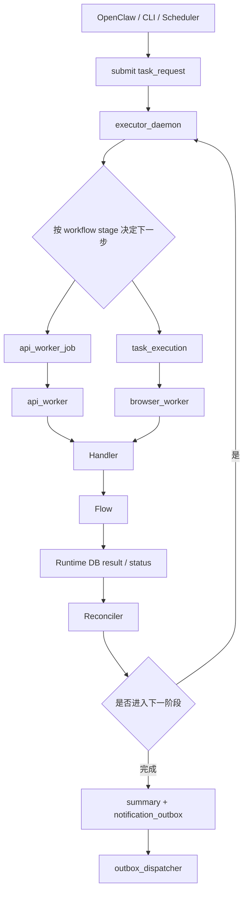
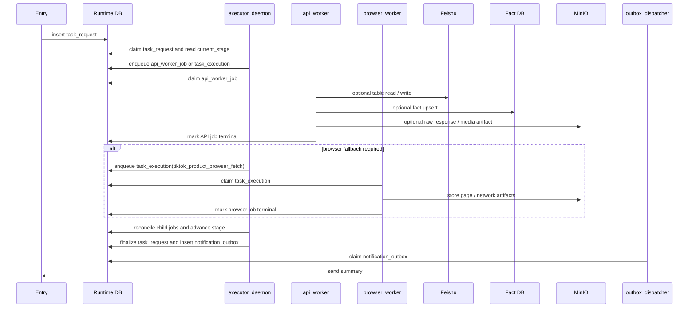
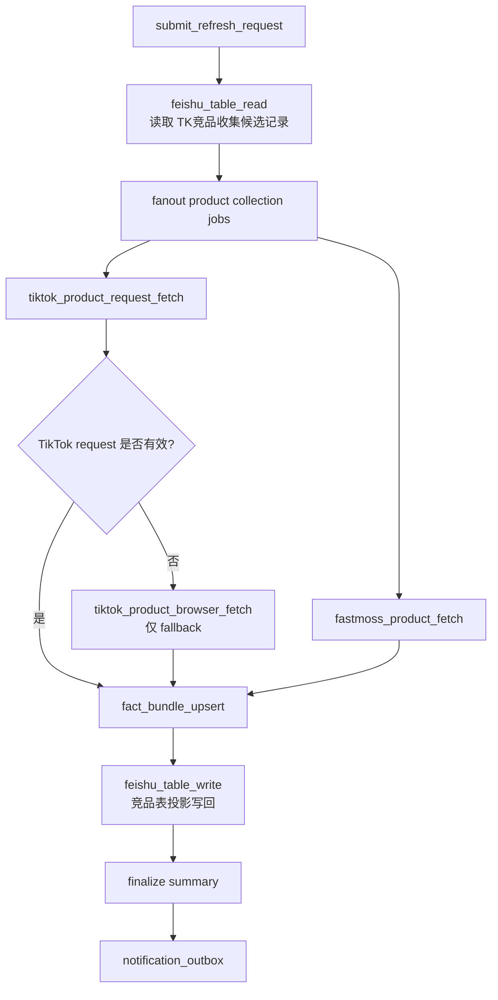
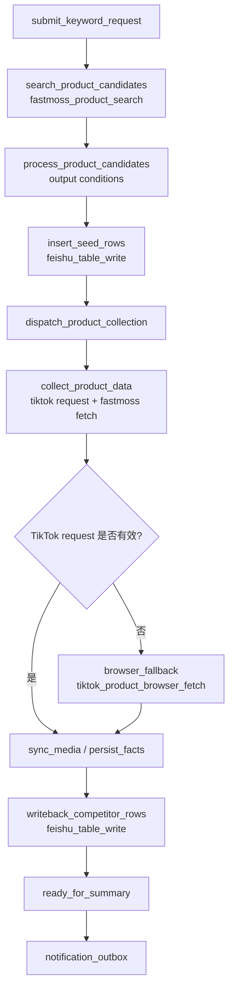
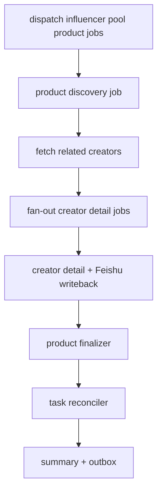
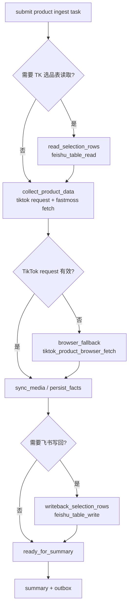

# 四个 Workflow 重设计评审

日期: 2026-04-23

状态: 正式架构评审文档

本文把当前系统中的四个正式业务 workflow 收敛到同一套架构口径下评审，并给出后续重设计方向。本文不是替代具体流程文档，而是作为跨 workflow 的统一设计基线。

相关文档:

- [系统架构设计](./system-architecture-design.md)
- [新增 Workflow 设计与拆分规范](./workflow-design-guidelines.md)
- [Runtime DB Schema 设计](./runtime-db-schema-design.md)
- [Fact DB Schema 设计](./fact-db-schema-design.md)
- [入口与输出契约设计](./entry-output-contract-design.md)
- [竞品表 Workflow 设计](./workflow-competitor-table-design.md)
- [选品分析 Workflow 设计](./workflow-selection-analysis-design.md)
- [达人同步 Workflow 设计](./workflow-influencer-pool-sync-design.md)

## 1. 评审范围

当前纳入正式评审的四个 workflow 是:

| Workflow | task_code | 正式 workflow_code | 当前业务定位 |
| --- | --- | --- | --- |
| 竞品表刷新 | `refresh_current_competitor_table` | `refresh_current_competitor_table` | 刷新已有 `TK竞品收集` 记录，逐行补全商品数据 |
| 关键词竞品入库 | `search_keyword_competitor_products` | `search_keyword_competitor_products` | 按关键词/filter 搜索候选商品，写入飞书种子行，再采集商品事实并回写详情 |
| 达人同步 | `sync_tk_influencer_pool` | `sync_tk_influencer_pool` | 从竞品商品出发发现达人，写入 `TK达人池` 并回写竞品表状态 |
| 选品分析 | `tiktok_fastmoss_product_ingest` | `tiktok_fastmoss_product_ingest` | 单商品 TikTok + FastMoss 采集、媒体上传、事实沉淀、可选飞书写回 |

说明: 当前代码中的历史 `WorkflowSpec` ID 可以保留为 framework 兼容实现事实；正式 Runtime workflow contract 使用稳定 `workflow_code`，不在 `workflow_code`、`stage_code`、`job_code` 或 `handler_code` 中追加版本后缀。

这四个 workflow 覆盖了当前系统的四种典型执行形态:

- 整表维护型: 竞品表刷新。
- 搜索入库型: 关键词竞品入库。
- 领域 fan-out 型: 达人同步。
- 单商品采集型: 选品分析。

## 2. 总体结论

四个 workflow 的顶层业务边界是合理的，建议继续保留为四个独立 `task_code`。当前真正需要调整的不是“是否合并 workflow”，而是把 Task / Stage / Job / Handler / Flow 的职责边界落到代码结构和 Runtime 状态机中。

评审结论:

| Workflow | 结论 | 主要改造方向 |
| --- | --- | --- |
| `refresh_current_competitor_table` | 保留 | plan 阶段拆薄，清理/扫描逐步从 executor 内部动作演进为 API job |
| `search_keyword_competitor_products` | 保留 | 候选处理后通过通用 `feishu_table_write` 写种子行，再复用商品事实采集和竞品表投影链路 |
| `sync_tk_influencer_pool` | 保留 | product / creator detail / finalizer 颗粒度合理，需统一 handler registry 和失败语义 |
| `tiktok_fastmoss_product_ingest` | 保留 | 区分 direct ingest 与 TK 选品表模式，显式表达 browser fallback 和写回阶段 |

总体判断:

- Runtime DB 作为可靠队列和状态事实来源是必要的。
- 四个 workflow 的业务颗粒度基本正确。
- 当前代码实现仍偏“集中 flow 分支路由”，不是完全业务无关 worker + handler registry。
- `src/automation_business_scaffold/domains/tiktok/workflows/*.py` 是当前正式 workflow 定义落点。
- 后续应引入内部 `WorkflowDefinition`，把 stage、job、transition、summary policy 作为架构事实来源。

## 3. 统一执行链路

项目架构下，四个 workflow 应共享同一条执行链路:



### 3.1 统一进程间调度时序图



### 3.2 统一概念

| 概念 | 定义 | 当前落点 |
| --- | --- | --- |
| Task | 用户可理解的一次顶层业务请求 | `task_request` |
| Workflow | Task 的阶段编排定义 | 当前在 `domains/tiktok/workflows/*.py` 与 contract 中共同表达 |
| Stage | Workflow 的业务阶段 | `task_request.current_stage` / `stage_cursor_json` |
| Job | Runtime DB 中 worker 可领取的最小运行时执行单元 | `api_worker_job` / `task_execution` |
| Handler | 某类 job 的代码入口 | 当前多数在 flow 文件中以函数分支存在 |
| Flow | Handler 内部复用的业务过程 | `domains/tiktok/flows/*` 与对应 capability adapter |

## 4. 当前实现事实与项目架构差异

### 4.1 Worker 业务无关是正式约束，不是当前完全事实

项目架构要求 worker 只做:

1. claim job。
2. 交给 Execution Supervisor。
3. 根据 `job_code` / `item_code` 查 handler。
4. 写回 result / error / retry 状态。

当前代码中，`executor_daemon`、`api_worker_daemon`、`browser_runloop`、`outbox_dispatcher` 都进入同一个核心业务 flow，再由 flow 中的分支处理不同 `task_code`、`job_code`、`item_code`。因此文档和代码应明确:

- 当前实现: 集中业务 flow 路由。
- 正式实现: worker + handler registry。

### 4.2 WorkflowSpec 是兼容层，不是完整 Runtime workflow

当前 `WorkflowSpec` 有两种形态:

- `refresh_current_competitor_table` 和 `search_keyword_competitor_products` 仍保留多 step 兼容流程，会在 framework run 模式中陪跑 executor/browser/outbox。
- 部分当前实现仍通过 framework 兼容入口进入 Runtime 推进；项目架构不把这些兼容入口作为 workflow contract。

正式架构口径:

- `WorkflowSpec` 继续作为 framework 兼容入口。
- 内部 Runtime workflow 应由新的 `WorkflowDefinition` 表达。
- `WorkflowDefinition` 应包含 `task_code`、`workflow_code`、`stage_code`、`job_code`、transition、summary policy 和 idempotency policy。

### 4.3 Executor 仍承担部分业务动作

当前 executor 已经承担编排职责，但仍直接执行部分轻量业务动作:

- 竞品表刷新中的链接清理和待处理行扫描。
- 关键词竞品入库中的候选处理和后续 fan-out。

短期可以接受，但判断标准要清楚:

- 轻量、快速、可幂等、失败面小的编排动作可以暂留 executor。
- 耗时、外部副作用重、需要独立重试或需要独立超时的动作应拆为 `api_worker_job`。

### 4.4 Reconciler 与 Watchdog 需要成为显式能力

当前系统已有 lease、heartbeat、retry 和部分父子状态收敛，但这些能力仍分散在 RuntimeStore 和业务 flow 中。

项目架构要求:

- Reconciler 基于 Runtime DB 判断父任务是否可进入下一阶段。
- Watchdog Scanner 处理 worker 自己无法收尾的状态。
- Execution Supervisor 统一管理 heartbeat、hard timeout、progress monitor、异常分类和 retry。

### 4.5 通用事实采集与业务投影边界

四个 workflow 的共性不只是“有一些通用 job”，而是它们都依赖同一套事实采集能力。飞书表读取、TikTok 商品 request/browser 采集、FastMoss 商品/达人/视频数据拉取，本质上都应被看成通用数据获取能力，再由统一的事实写入层沉淀到 Fact DB。

正式架构口径:

- 商品、达人、视频、图片/媒体资产属于通用事实数据，不应绑定到某一个 workflow。
- 事实数据通过业务唯一键 upsert 到 Fact DB，作为跨 workflow 共享的主档或事实实体。
- 不同 workflow 的差异主要体现在关系数据、快照数据、业务字段映射和飞书投影写回。
- 如果某个业务流程需要更多数据，应增加采集 step 或启用更高 detail level，而不是复制一套业务专属采集逻辑。

需要区分四类数据:

| 数据类型 | 示例 | 主要存储 | 说明 |
| --- | --- | --- | --- |
| 事实实体 | 商品、达人、视频、店铺、媒体资产 | Fact DB | 跨 workflow 共享，按业务唯一键 upsert |
| 关系数据 | 商品-达人关系、商品-视频关系、来源飞书记录-商品关系、活动/节日-商品关系 | Fact DB 或业务关系表 | 体现业务上下文，不应塞进实体主档 |
| 快照/观测 | 某次采集的销量、粉丝数、页面原文、飞书源行快照、写回结果 | Runtime artifact / Fact observation / snapshot 表 | 体现某个时间点或某次任务的状态 |
| 业务投影 | `TK竞品收集`、`TK达人池`、`TK选品收集` 写回字段 | Feishu | 面向运营使用的视图，不是内部任务状态真相 |

因此，通用能力型 job 应优先围绕事实采集和投影写入来设计:

| Generic Job | Worker | 输出 |
| --- | --- | --- |
| `feishu_table_read` | `api_worker` | source rows / source snapshot / candidate keys |
| `tiktok_product_request_fetch` | `api_worker` | TikTok 商品 request 结果、解析后的商品事实、fallback 判断 |
| `tiktok_product_browser_fetch` | `browser_worker` | request 失效后的 TikTok 页面 HTML / network / 页面解析结果 |
| `fastmoss_product_search` | `api_worker` | FastMoss 商品搜索候选，支持 keyword/category/filter 输入和 condition 输出 |
| `fastmoss_product_fetch` | `api_worker` | 商品事实、店铺事实、商品指标观测 |
| `fastmoss_creator_fetch` | `api_worker` | 达人事实、达人指标观测 |
| `fastmoss_shop_fetch` | `api_worker` | 店铺事实、店铺指标观测 |
| `fastmoss_video_fetch` | `api_worker` | 视频事实、视频指标观测 |
| `media_asset_sync` | `api_worker` | 图片、封面、头像等媒体资产事实和对象索引 |
| `fact_bundle_upsert` | `api_worker` | 商品/达人/视频/媒体/关系/观测的统一 upsert 结果 |
| `feishu_table_write` | `api_worker` | 面向业务表的投影写回结果 |

TikTok 商品数据采集约定:

- 默认优先派发 `tiktok_product_request_fetch`，通过 request / HTTP / 已知接口路径获取商品数据。
- 只有 request 结果不可解析、关键字段缺失、被风控/登录/验证码阻断，或 handler 明确返回 `fallback_required=true` 时，才派发 `tiktok_product_browser_fetch`。
- 浏览器采集是 fallback，不是默认路径；它占用 browser profile、执行成本更高，也更容易触发风控。
- request job 和 browser fallback job 必须输出同一种 normalized product result，后续 `fact_bundle_upsert` 不应关心数据来自 request 还是 browser。
- 非法输入、缺少 product key、URL 无法归一化等不可恢复错误，不应 fallback 到浏览器，而应直接进入 failed 或 skipped。
- fallback 决策必须写入 result / stage cursor，例如 `fallback_required`、`fallback_reason`、`fallback_source_job_id`。

Workflow 不应该直接绑定某个大业务函数，而应该编排这些通用事实采集 job，再通过业务 mapper 决定:

- 需要读取哪些来源表。
- 需要采集哪些实体和 detail level。
- 需要写入哪些关系或观测。
- 需要把结果投影到哪张飞书表。
- 部分失败时如何定义 `success / partial_success / failed`。

### 4.6 重构后 Workflow / Job / Handler 映射总表

本节给出重构后的正式映射。它是代码落地时的主要对照表，比后面各 workflow 的局部说明更接近实现清单。

映射规则:

- `Stage` 由内部 `WorkflowDefinition` 和 `executor_daemon` 推进。
- `Job code` 必须写入 Runtime DB 中的 job 记录，用于 worker claim 和审计。
- `Handler code` 是 handler registry 的路由键。通用 handler 的 `job_code` 和 `handler_code` 通常一致。
- `Adapter / Mapper / Flow` 是 handler 内部调用的表级语义、字段投影或业务复用过程。
- `executor_action` 表示短期可以留在 executor 的轻量编排动作；一旦耗时、失败率或外部副作用变重，应升级为 job。
- 旧的 leaf task / 业务专用 handler 不进入项目架构。现有 workflow 重构时直接切到本表定义的通用 handler 链路。

#### 4.6.1 `refresh_current_competitor_table`

目的在于刷新已有 `TK竞品收集` 记录。重构后直接拆成“飞书读取 -> 通用商品事实采集 -> 事实入库 -> 竞品表投影写回”，不再保留单行补全业务专用 handler。

| Stage code | Job code | Runtime 表 | Worker / 进程 | Handler code | Adapter / Mapper / Flow | Result 消费方 |
| --- | --- | --- | --- | --- | --- | --- |
| `read_competitor_rows` | `feishu_table_read` | `api_worker_job` | `api_worker` | `feishu_table_read` | `competitor_table_source_adapter` | executor fan-out candidate rows |
| `dispatch_product_collection` | `executor_action:fanout_competitor_rows` | `task_request` | `executor_daemon` | workflow dispatcher | `competitor_row_to_product_payload_mapper` | creates product collection jobs |
| `collect_product_data` | `tiktok_product_request_fetch` | `api_worker_job` | `api_worker` | `tiktok_product_request_fetch` | TikTok request flow | `fact_bundle_upsert` / fallback decision |
| `collect_product_data` | `fastmoss_product_fetch` | `api_worker_job` | `api_worker` | `fastmoss_product_fetch` | FastMoss product flow | `fact_bundle_upsert` |
| `browser_fallback` | `tiktok_product_browser_fetch` | `task_execution` | `browser_worker` | `tiktok_product_browser_fetch` | browser product page flow | normalized product result |
| `persist_facts` | `media_asset_sync` | `api_worker_job` | `api_worker` | `media_asset_sync` | media/object store flow | `fact_bundle_upsert` / projection |
| `persist_facts` | `fact_bundle_upsert` | `api_worker_job` | `api_worker` | `fact_bundle_upsert` | fixed `fact_bundle` upsert | writeback projection |
| `writeback_competitor_rows` | `feishu_table_write` | `api_worker_job` | `api_worker` | `feishu_table_write` | `competitor_table_projection_mapper` | row job terminal result |
| `ready_for_summary` | `task_completed_notification` | `notification_outbox` | `outbox_dispatcher` | `outbox_dispatch` | summary renderer | user / Feishu final notification |

约束:

- 不新增单行补全业务专用 handler。
- 每条竞品记录的更新由通用商品采集 job 和通用飞书写回 job 组合完成。
- browser worker 只在 TikTok request 采集明确要求 fallback 时介入。

#### 4.6.2 `search_keyword_competitor_products`

目的在于按关键词或其他 filter 在 FastMoss 中搜索候选商品，先写入 `TK竞品收集` 种子行，再复用竞品表刷新链路完成事实采集和投影写回。

| Stage code | Job code | Runtime 表 | Worker / 进程 | Handler code | Adapter / Mapper / Flow | Result 消费方 |
| --- | --- | --- | --- | --- | --- | --- |
| `search_product_candidates` | `fastmoss_product_search` | `api_worker_job` | `api_worker` | `fastmoss_product_search` | FastMoss product search API flow | candidate normalizer + output conditions |
| `process_product_candidates` | `executor_action:normalize_product_candidates` | `task_request` | `executor_daemon` | workflow dispatcher | `product_candidate_policy` | seed insert jobs |
| `insert_seed_rows` | `feishu_table_write` | `api_worker_job` | `api_worker` | `feishu_table_write` | `competitor_seed_projection_mapper` | created Feishu record ids |
| `dispatch_product_collection` | `executor_action:fanout_seed_rows` | `task_request` | `executor_daemon` | workflow dispatcher | `competitor_row_to_product_payload_mapper` | product collection jobs |
| `collect_product_data` | `tiktok_product_request_fetch` | `api_worker_job` | `api_worker` | `tiktok_product_request_fetch` | TikTok request flow | `fact_bundle_upsert` / fallback decision |
| `collect_product_data` | `fastmoss_product_fetch` | `api_worker_job` | `api_worker` | `fastmoss_product_fetch` | FastMoss product flow | `fact_bundle_upsert` |
| `browser_fallback` | `tiktok_product_browser_fetch` | `task_execution` | `browser_worker` | `tiktok_product_browser_fetch` | browser product page flow | normalized product result |
| `sync_media` | `media_asset_sync` | `api_worker_job` | `api_worker` | `media_asset_sync` | media/object store flow | media facts / projection |
| `persist_facts` | `fact_bundle_upsert` | `api_worker_job` | `api_worker` | `fact_bundle_upsert` | fixed `fact_bundle` upsert | writeback projection |
| `writeback_competitor_rows` | `feishu_table_write` | `api_worker_job` | `api_worker` | `feishu_table_write` | `competitor_table_projection_mapper` | detail terminal result |
| `ready_for_summary` | `task_completed_notification` | `notification_outbox` | `outbox_dispatcher` | `outbox_dispatch` | summary renderer | user / Feishu final notification |

约束:

- 不新增种子行写入业务专用 handler。
- 种子行写入就是 `feishu_table_write + competitor_seed_projection_mapper`。
- 种子行创建完成后，后续商品详情补全直接复用通用商品采集和竞品表投影链路。

#### 4.6.3 `sync_tk_influencer_pool`

目的在于从 `TK竞品收集` 候选商品出发，发现关联达人，采集达人详情，写入 `TK达人池`，并回写竞品表达人查找状态。

| Stage code | Job code | Runtime 表 | Worker / 进程 | Handler code | Adapter / Mapper / Flow | Result 消费方 |
| --- | --- | --- | --- | --- | --- | --- |
| `read_competitor_candidates` | `feishu_table_read` | `api_worker_job` | `api_worker` | `feishu_table_read` | `influencer_pool_source_adapter` | product discovery job fan-out |
| `dispatch_product_jobs` | `executor_action:fanout_influencer_products` | `task_request` | `executor_daemon` | workflow dispatcher | `influencer_product_candidate_mapper` | product discovery `api_worker_job` |
| `discover_related_creators` | `fastmoss_product_fetch` | `api_worker_job` | `api_worker` | `fastmoss_product_fetch` | `detail_level=related_creators` + product relation mapper | creator detail job fan-out |
| `collect_creator_detail` | `fastmoss_creator_fetch` | `api_worker_job` | `api_worker` | `fastmoss_creator_fetch` | FastMoss creator flow + optional `media_asset_sync` | Feishu influencer projection |
| `write_influencer_pool` | `feishu_table_write` | `api_worker_job` | `api_worker` | `feishu_table_write` | `influencer_pool_projection_mapper` | target_record_id / creator terminal |
| `finalize_product` | `executor_action:finalize_product` | `api_worker_job` result scan | `executor_daemon` / reconciler | workflow finalizer | product creator status aggregator | product group terminal |
| `writeback_competitor_status` | `feishu_table_write` | `api_worker_job` | `api_worker` | `feishu_table_write` | `competitor_influencer_status_projection_mapper` | source record status |
| `ready_for_summary` | `task_completed_notification` | `notification_outbox` | `outbox_dispatcher` | `outbox_dispatch` | summary renderer | user / Feishu final notification |

边界说明:

- 达人同步不新增业务专用 Runtime job 表；product discovery 和 creator detail 都是 `api_worker_job` 的逻辑 job 粒度。
- product/creator 父子关系通过通用字段或 payload 表达，例如 `parent_job_id`、`job_group`、`entity_type`、`entity_key`、`source_record_id`、`product_id`、`influencer_id`。
- creator detail job 如果同时推进达人详情采集和飞书写入，必须在 job checkpoint 中明确幂等边界；正式 handler 仍然使用通用能力 handler。

#### 4.6.4 `tiktok_fastmoss_product_ingest`

目的在于围绕单个 TikTok 商品完成 request-first/browser-fallback 采集、FastMoss 商品采集、事实入库、媒体同步，以及可选 `TK选品收集` 投影写回。

| Stage code | Job code | Runtime 表 | Worker / 进程 | Handler code | Adapter / Mapper / Flow | Result 消费方 |
| --- | --- | --- | --- | --- | --- | --- |
| `read_selection_rows` | `feishu_table_read` | `api_worker_job` | `api_worker` | `feishu_table_read` | `selection_table_source_adapter` | product collection payload |
| `collect_product_data` | `tiktok_product_request_fetch` | `api_worker_job` | `api_worker` | `tiktok_product_request_fetch` | TikTok request flow | normalized result / fallback decision |
| `collect_product_data` | `fastmoss_product_fetch` | `api_worker_job` | `api_worker` | `fastmoss_product_fetch` | FastMoss product flow | product facts / metrics |
| `browser_fallback` | `tiktok_product_browser_fetch` | `task_execution` | `browser_worker` | `tiktok_product_browser_fetch` | browser product page flow | normalized product result |
| `sync_media` | `media_asset_sync` | `api_worker_job` | `api_worker` | `media_asset_sync` | object store upload flow | media facts / artifact_object |
| `persist_facts` | `fact_bundle_upsert` | `api_worker_job` | `api_worker` | `fact_bundle_upsert` | fixed `fact_bundle` upsert | writeback projection / summary |
| `writeback_selection_rows` | `feishu_table_write` | `api_worker_job` | `api_worker` | `feishu_table_write` | `selection_table_projection_mapper` | source row updated |
| `ready_for_summary` | `task_completed_notification` | `notification_outbox` | `outbox_dispatcher` | `outbox_dispatch` | summary renderer | user / Feishu final notification |

边界说明:

- direct ingest 模式跳过 `read_selection_rows` 和 `writeback_selection_rows`。
- `browser_fallback` 只在 `tiktok_product_request_fetch` 明确返回 `fallback_required=true` 时派发。
- `fact_bundle_upsert` 必须只依赖 normalized facts contract，不依赖 request/browser 来源。

## 5. Workflow 1: 竞品表刷新

### 5.1 当前定位

`refresh_current_competitor_table` 负责刷新已有 `TK竞品收集` 记录。它的核心价值是维护竞品表中商品基础数据质量。

正式重构链路:



### 5.2 设计合理点

- 顶层 Task 代表一次刷新请求。
- 每条竞品记录会被拆成独立商品采集和写回 job。
- 单行失败不会拖垮整张表。
- Browser profile 只在 TikTok request fallback 时使用，默认不占用浏览器资源。
- 最终 summary 可以保留每行成功、失败、跳过状态。

### 5.3 当前问题

| 问题 | 影响 | 建议 |
| --- | --- | --- |
| 当前流程依赖单行补全 leaf task | worker 仍承载业务特化路径 | 直接替换为通用商品采集 + 通用飞书写回 |
| `plan_refresh_work` 同时做 cleanup、scan、fan-out | executor 阶段偏厚 | 扫描和读取统一进入 `feishu_table_read` |
| `waiting_children` 语义偏泛 | 状态不够可读 | 在 `progress_stage` / `stage_cursor` 中表达当前等待的是 product collection 还是 competitor writeback |

### 5.4 Stage

| Stage code | 进入条件 | 编排动作 | 派生 Job | 退出条件 |
| --- | --- | --- | --- | --- |
| `submitted` | task 创建成功 | 初始化请求上下文 | 无 | 进入 `read_competitor_rows` |
| `read_competitor_rows` | 有表 URL / view / filter | 读取候选行并标准化 source snapshot | `feishu_table_read` | 得到 candidate rows |
| `dispatch_product_collection` | 有 candidate rows | 为每行派发商品采集 job | `tiktok_product_request_fetch`、`fastmoss_product_fetch` | 商品采集 jobs 已创建或跳过 |
| `browser_fallback` | TikTok request 需要 fallback | 派发 browser fallback | `tiktok_product_browser_fetch` | fallback 终态 |
| `persist_facts` | 商品采集有 normalized facts | 写 Fact DB / media / raw links | `media_asset_sync`、`fact_bundle_upsert` | facts 写入完成 |
| `writeback_competitor_rows` | 有可投影结果 | 写回竞品表字段和状态 | `feishu_table_write` | 写回终态 |
| `ready_for_summary` | 子任务已终态 | 汇总结果，写 outbox | `notification_outbox` | `completed` / `partial_success` |

### 5.5 Job

| Job | Runtime 表 | Worker | Handler | 幂等边界 |
| --- | --- | --- | --- | --- |
| `feishu_table_read` | `api_worker_job` | `api_worker` | `feishu_table_read` | table + view/filter + request_id |
| `tiktok_product_request_fetch` | `api_worker_job` | `api_worker` | `tiktok_product_request_fetch` | product_id / normalized url |
| `fastmoss_product_fetch` | `api_worker_job` | `api_worker` | `fastmoss_product_fetch` | product_id / fastmoss product key |
| `tiktok_product_browser_fetch` | `task_execution` | `browser_worker` | `tiktok_product_browser_fetch` | request_id + product url |
| `media_asset_sync` | `api_worker_job` | `api_worker` | `media_asset_sync` | entity key + asset source |
| `fact_bundle_upsert` | `api_worker_job` | `api_worker` | `fact_bundle_upsert` | entity business keys + observation timestamp |
| `feishu_table_write` | `api_worker_job` | `api_worker` | `feishu_table_write` | table + source_record_id / business unique key |
| `task_completed_notification` | `notification_outbox` | `outbox_dispatcher` | `outbox_dispatch` | `task_request.completed:{request_id}` |

## 6. Workflow 2: 关键词竞品入库

### 6.1 当前定位

`search_keyword_competitor_products` 负责根据关键词和 filter 在 FastMoss 中搜索竞品，通过通用飞书写入能力创建 `TK竞品收集` 种子行，再复用商品事实采集和竞品表投影链路完成详情更新。

当前主要链路:



### 6.2 当前合理点

- FastMoss 商品搜索是独立 API job，关键词只是 filter 的一种输入。
- 搜索候选后再写入 seed rows，避免一开始就污染飞书表。
- 种子行插入和详情写回都复用 `feishu_table_write`。
- 商品详情补全复用通用商品事实采集和 `fact_bundle_upsert`。
- `search_product_candidates`、`insert_seed_rows`、`dispatch_product_collection` 和 `writeback_competitor_rows` 分阶段推进，可以恢复。

### 6.3 当前问题

| 问题 | 影响 | 建议 |
| --- | --- | --- |
| 旧关键词搜索偏浏览器动作 | 搜索能力不能复用，filter/condition 难标准化 | 抽成 `fastmoss_product_search` API handler |
| 旧 seed row insert 是业务专用动作 | 飞书写入能力无法复用 | 统一改为 `feishu_table_write + competitor_seed_projection_mapper` |
| candidate processing、seed insert、detail fan-out 混在一个阶段 | 状态不够可观测 | 拆为 `process_product_candidates`、`insert_seed_rows`、`dispatch_product_collection` |
| 详情补全依赖旧单行 leaf task | 难复用通用事实采集 | 统一改为商品采集 + Fact upsert + 飞书投影写回 |

### 6.4 Stage

| Stage code | 进入条件 | 编排动作 | 派生 Job | 退出条件 |
| --- | --- | --- | --- | --- |
| `submitted` | task 创建成功 | 校验关键词、filter 和 output condition | 无 | 进入 `search_product_candidates` |
| `search_product_candidates` | 有搜索输入 | 派发 FastMoss 商品搜索 API job | `fastmoss_product_search` | search job 终态 |
| `process_product_candidates` | search success | 按 output condition 过滤、去重、生成 seed payload | 无 | 进入 `insert_seed_rows` |
| `insert_seed_rows` | 有候选 | 派发通用飞书写入 job | `feishu_table_write` | seed jobs 全部终态 |
| `dispatch_product_collection` | 有成功 seed rows | 派发商品采集 job | `tiktok_product_request_fetch`、`fastmoss_product_fetch` | 进入 `collect_product_data` |
| `collect_product_data` | 有 product url / id | 等待 request/API 商品采集 job | `tiktok_product_request_fetch`、`fastmoss_product_fetch` | 成功 / fallback required / failed |
| `browser_fallback` | TikTok request 需要 fallback | 派发 browser fallback | `tiktok_product_browser_fetch` | fallback 终态 |
| `sync_media` | 采集结果中存在图片、封面、头像等媒体资产 | 同步媒体到 MinIO / object store | `media_asset_sync` | 媒体同步完成 / skipped / failed |
| `persist_facts` | 商品采集有 normalized facts | 写 Fact DB / raw links / observations | `fact_bundle_upsert` | facts 写入完成 |
| `writeback_competitor_rows` | 有可投影结果 | 写回竞品表详情字段 | `feishu_table_write` | 写回终态 |
| `ready_for_summary` | 子任务终态 | 汇总 product search / seed write / product collection / writeback | `notification_outbox` | `completed` / `partial_success` |

### 6.5 Job

| Job | Runtime 表 | Worker | Handler | 幂等边界 |
| --- | --- | --- | --- | --- |
| `fastmoss_product_search` | `api_worker_job` | `api_worker` | `fastmoss_product_search` | request_id + search filters digest |
| `feishu_table_write` | `api_worker_job` | `api_worker` | `feishu_table_write` | destination table + product_id / normalized url |
| `tiktok_product_request_fetch` | `api_worker_job` | `api_worker` | `tiktok_product_request_fetch` | product_id / normalized url |
| `fastmoss_product_fetch` | `api_worker_job` | `api_worker` | `fastmoss_product_fetch` | product_id / fastmoss product key |
| `tiktok_product_browser_fetch` | `task_execution` | `browser_worker` | `tiktok_product_browser_fetch` | request_id + product url |
| `media_asset_sync` | `api_worker_job` | `api_worker` | `media_asset_sync` | entity key + asset source |
| `fact_bundle_upsert` | `api_worker_job` | `api_worker` | `fact_bundle_upsert` | entity business keys + observation timestamp |

## 7. Workflow 3: 达人同步

### 7.1 当前定位

`sync_tk_influencer_pool` 负责从 `TK竞品收集` 中筛选需要查找达人的竞品记录，基于 FastMoss 商品关联达人列表生成达人详情任务，写入 `TK达人池`，并回写竞品表状态。

当前主要链路:



### 7.2 当前合理点

这是四个 workflow 中最接近项目架构的一个。

- product discovery job 负责一条竞品记录的商品级达人发现。
- creator detail job 负责一个达人详情采集和写入。
- product finalizer 基于 Runtime DB 汇总 creator detail jobs。
- 单个达人失败不会拖垮整个 task。
- product discovery / creator detail 的业务状态通过通用 `api_worker_job` 字段和 payload/checkpoint 表达，不再新增达人同步专用 job 表。

### 7.3 当前问题

| 问题 | 影响 | 建议 |
| --- | --- | --- |
| API worker 对历史达人专用 job 有特殊路径 | worker 仍理解部分业务 | 迁移为统一 `api_worker_job` + handler registry |
| product / creator detail / finalizer 边界不够显式 | 难以单独评审 payload/result | 明确逻辑 job 粒度、payload/result schema 和通用父子关联字段 |
| 父任务 final status 策略不够清晰 | success / partial_success / failed 容易混淆 | 明确 final_status_policy |
| 历史专用 job 与通用 job 生命周期字段未完全统一 | Watchdog 兜底难统一 | 统一到 `api_worker_job` 生命周期字段 |

### 7.4 Stage

| Stage code | 进入条件 | 编排动作 | 派生 Job | 退出条件 |
| --- | --- | --- | --- | --- |
| `read_competitor_candidates` | task pending | 读取并筛选达人同步候选竞品 | `feishu_table_read` | 得到 product candidates |
| `dispatch_product_jobs` | 有 product candidates | 创建 product discovery jobs | `api_worker_job(job_code=fastmoss_product_fetch)` | product discovery jobs 已创建或跳过 |
| `discover_related_creators` | product discovery job 可执行 | 获取商品关联达人并创建 creator detail jobs | `api_worker_job(job_code=fastmoss_product_fetch)` | product group 进入 `detail_pending` 或终态 |
| `collect_creator_detail` | creator detail job 可执行 | 采集达人详情和事实 | `api_worker_job(job_code=fastmoss_creator_fetch)` | creator detail job 终态或待重试 |
| `write_influencer_pool` | creator facts 可投影 | 写入 `TK达人池` | `api_worker_job(job_code=feishu_table_write)` | 写入终态 |
| `finalize_product` | creator detail jobs 可聚合 | 聚合 product 下 creator detail jobs | product finalizer | product group 终态或待重试 |
| `writeback_competitor_status` | product group 终态 | 回写竞品表达人查找状态 | `api_worker_job(job_code=feishu_table_write)` | 写回终态 |
| `ready_for_summary` | product groups 终态 | 汇总 product / creator detail 状态，写 outbox | `notification_outbox` | `completed` / `partial_success` / `failed` |

逻辑 job 内部状态:

| Job | 状态流转 |
| --- | --- |
| product discovery job | `pending -> running -> success/retry_wait/failed/skipped` |
| creator detail job | `pending -> running -> success/skipped/retry_wait/failed` |
| product finalizer | 聚合 creator detail jobs，推进 product group 终态 |

### 7.5 Job

| Job | Runtime 表 | Worker | Handler | 幂等边界 |
| --- | --- | --- | --- | --- |
| 商品达人列表发现 | `api_worker_job` | `api_worker` | `fastmoss_product_fetch` | request_id + source_record_id + product_id |
| 达人详情采集 | `api_worker_job` | `api_worker` | `fastmoss_creator_fetch` | request_id + source_record_id + product_id + influencer_id |
| 达人池写入 | `api_worker_job` | `api_worker` | `feishu_table_write` | source_record_id + influencer_id |
| 商品级汇总 | `api_worker_job` result scan | `executor_daemon` / reconciler | workflow finalizer | product group key |
| 父任务汇总 | `task_request` | `executor_daemon` | workflow finalizer | request_id |

### 7.6 Final Status Policy

达人同步应显式定义父任务终态:

| 条件 | final_status |
| --- | --- |
| product groups 全部完成，creator detail jobs 全部 success/skipped | `success` |
| 部分 product / creator detail failed，但未超过业务阈值 | `partial_success` |
| 无任何有效结果，或失败超过业务阈值，或编排阶段不可恢复失败 | `failed` |

## 8. Workflow 4: 选品分析

### 8.1 当前定位

`tiktok_fastmoss_product_ingest` 负责围绕一个 TikTok 商品 URL / SKU 完成商品数据采集、媒体上传、事实库沉淀和可选飞书写回。

该 workflow 有两个模式:

| 模式 | 说明 |
| --- | --- |
| direct ingest | 调用方直接给 product url / product id，系统直接派发商品采集 job |
| TK selection table mode | 需要先读取 `TK选品收集`，获取源记录和写回上下文，再采集并写回飞书 |

正式主要链路:



### 8.2 当前合理点

- 商品采集使用 `api_worker_job`，适合 HTTP/API、媒体上传、事实库写入。
- TikTok 商品数据优先走 request，request 不可解析或关键字段缺失时可以派发 browser fallback。
- 飞书读取、商品采集、飞书写回已经拆成不同 job。
- Fact DB upsert 与 MinIO artifact/object prefix 已纳入采集结果。

### 8.3 当前问题

| 问题 | 影响 | 建议 |
| --- | --- | --- |
| framework 兼容入口与 Runtime stage 混在一起 | 外部看不到真实 stage | 内部 `WorkflowDefinition` 显式定义 stage，兼容入口不进入正式 contract |
| 文档容易把飞书读取/写回写成必经链路 | direct ingest 模式被误解 | 明确飞书表读写是条件阶段 |
| 商品采集 job 内部副作用较多 | 幂等要求高 | 将 TikTok request、FastMoss fetch、Fact upsert、写回边界显式化 |
| fallback 后二次采集的 stage transition 不够直观 | 排障困难 | stage cursor 记录 fallback execution 和 after-fallback job |

### 8.4 Stage

| Stage code | 进入条件 | 编排动作 | 派生 Job | 退出条件 |
| --- | --- | --- | --- | --- |
| `read_selection_rows` | 开启 TK selection table mode | 派发通用飞书读取 job | `feishu_table_read` | 读取成功 / 跳过 |
| `collect_product_data` | 有 product url / id | 优先派发 request/API 采集 | `tiktok_product_request_fetch`、`fastmoss_product_fetch` | 成功 / fallback required / failed |
| `browser_fallback` | TikTok request 失效且允许 fallback | 派发 browser fetch job | `tiktok_product_browser_fetch` | browser fetch 终态 |
| `sync_media` | 采集结果中存在图片、封面、头像等媒体资产 | 同步媒体到 MinIO / object store | `media_asset_sync` | 媒体同步完成 / skipped / failed |
| `persist_facts` | 已得到 normalized product result | 写 Fact DB、raw links 和 observations | `fact_bundle_upsert` | 事实写入完成 / failed |
| `writeback_selection_rows` | 有来源飞书记录且需要写回 | 派发通用飞书写回 job | `feishu_table_write` | 写回终态 |
| `ready_for_summary` | 子任务终态 | 汇总 result，写 outbox | `notification_outbox` | `completed` / `partial_success` / `failed` |

### 8.5 Job

| Job | Runtime 表 | Worker | Handler | 幂等边界 |
| --- | --- | --- | --- | --- |
| `feishu_table_read` | `api_worker_job` | `api_worker` | `feishu_table_read` | request_id + table + product key |
| `tiktok_product_request_fetch` | `api_worker_job` | `api_worker` | `tiktok_product_request_fetch` | product_id / normalized url |
| `fastmoss_product_fetch` | `api_worker_job` | `api_worker` | `fastmoss_product_fetch` | product_id / fastmoss product key |
| `tiktok_product_browser_fetch` | `task_execution` | `browser_worker` | `tiktok_product_browser_fetch` | request_id + product url |
| `fact_bundle_upsert` | `api_worker_job` | `api_worker` | `fact_bundle_upsert` | entity business keys + observation timestamp |
| `feishu_table_write` | `api_worker_job` | `api_worker` | `feishu_table_write` | request_id + source_record_id |

### 8.6 幂等要求

商品采集阶段应由 TikTok request、FastMoss fetch、media sync 和 fact upsert 这些通用 job 组合完成，并必须满足:

- Fact DB 只通过业务唯一键 upsert。
- MinIO object key 必须稳定，或允许同一 request 覆盖。
- 飞书写回只能由 `feishu_table_write + selection_table_projection_mapper` 执行。
- fallback 后二次 ingest 不能重复创建不一致事实。
- outbox 使用 request 级 dedupe key，避免重复通知。

## 9. 统一重设计方案

### 9.1 内部 WorkflowDefinition

正式 workflow 编排落在 domain workflow 层:

```text
src/automation_business_scaffold/domains/tiktok/workflows/
  refresh_current_competitor_table.py
  search_keyword_competitor_products.py
  sync_tk_influencer_pool.py
  tiktok_fastmoss_product_ingest.py
```

每个 definition 至少包含:

| 字段 | 说明 |
| --- | --- |
| `task_code` | 顶层任务类型 |
| `workflow_code` | 稳定 workflow 编排编码，不追加版本后缀 |
| `contract_revision` | 可选兼容演进元数据 |
| `stages` | stage code、进入条件、退出条件 |
| `job_defs` | job code、worker type、payload/result schema |
| `transitions` | stage 转移规则 |
| `summary_policy` | success / partial_success / failed 规则 |
| `idempotency_policy` | job 和外部副作用幂等规则 |
| `timeout_policy` | 单 job 超时和整体超时策略 |
| `watchdog_policy` | lease expired、stale progress、dead letter 规则 |

### 9.2 Handler Registry

正式目录:

```text
src/automation_business_scaffold/contracts/handler/
  api.py
  dispatch.py

src/automation_business_scaffold/capabilities/input_sources/feishu/
  table_read_handler.py
  table_common.py

src/automation_business_scaffold/capabilities/channels/feishu/
  table_write_handler.py

src/automation_business_scaffold/capabilities/fact_sources/tiktok/
  product_request_fetch_handler.py

src/automation_business_scaffold/capabilities/fact_sources/fastmoss/
  product_search_handler.py
  product_fetch_handler.py
  creator_fetch_handler.py
  shop_fetch_handler.py
  video_fetch_handler.py

src/automation_business_scaffold/domains/tiktok/jobs/
  competitor_row_refresh.py
  keyword_seed_import.py
  product_creator_discovery.py
  influencer_creator_sync.py

src/automation_business_scaffold/capabilities/browser/
  tiktok_product_fetch_handler.py

src/automation_business_scaffold/capabilities/media/
  asset_sync_handler.py

src/automation_business_scaffold/capabilities/persistence/database/
  fact_bundle_upsert_handler.py

src/automation_business_scaffold/domains/tiktok/mappers/
src/automation_business_scaffold/domains/tiktok/projections/
```

约束:

- API worker 不再写 `if job_code == ...` 业务分支。
- Browser worker 不再写 `if item_code == ...` 业务分支。
- 新增 job 只需要注册 handler，不修改 worker runloop。
- Handler 统一返回标准 result / error / retry classification。
- 通用 handler 负责获取或写入事实数据，业务 mapper 负责关系、快照和飞书字段投影。

### 9.3 Reconciler

正式目录:

```text
src/automation_business_scaffold/control_plane/reconciler/
  reconciler.py
  views.py

src/automation_business_scaffold/control_plane/watchdog/
  scanner.py
```

职责:

- 基于 Runtime DB 判断 child jobs 是否全部终态。
- 推进父 `task_request` 到下一 stage 或 `ready_for_summary`。
- 对同一个 request 可重复执行，结果幂等。
- 不依赖 worker 进程内 callback。

### 9.4 Flow 收敛

`domains/{domain}/flows/` 应保持为可复用业务过程，不承载全局编排大分支。

正式边界:

| 层 | 应该做 | 不应该做 |
| --- | --- | --- |
| executor | 推进 stage、派发 job、汇总父任务 | 直接执行长耗时业务动作 |
| worker | claim、supervise、handler lookup、写回状态 | 理解完整业务 workflow |
| handler | 执行某类 job，调用 flow，分类错误 | 编排整个父 task |
| flow | 复用业务动作，如请求 API、写飞书、写事实库 | 偷偷推进 Runtime 父状态 |
| reconciler | 基于 DB 聚合状态 | 依赖内存 callback |

## 10. 迁移计划

### 10.1 阶段一: 文档和状态口径统一

正式口径:

- 保留四个 `task_code` 不变。
- 固化每个 workflow 的 stage code、job code、payload schema、result schema。
- 明确 `WorkflowSpec` 是 framework 兼容层。
- 修正选品分析文档中“飞书读取/写回是必经链路”的表述。

验收:

- 每个 workflow 都能在文档中找到 Task / Stage / Job / Handler / Flow 映射。
- 新增 workflow 必须按 [新增 Workflow 设计与拆分规范](./workflow-design-guidelines.md) 完成评审。

### 10.2 阶段二: Handler registry 抽取

正式口径:

- API worker 从 `job_code` 分支改为 registry lookup。
- Browser worker 从 `item_code` 分支改为 registry lookup。
- 历史 influencer pool 专用 job 迁移为统一 `api_worker_job` 后接入 API handler registry。

验收:

- 新增一个 API job 不需要修改 API worker 主循环。
- 新增一个 browser item_code 不需要修改 browser runloop 主循环。
- handler 有统一 payload/result/error schema。

### 10.3 阶段三: Reconciler 显式化

正式口径:

- 将父任务推进逻辑从业务 flow 中抽到 reconciler。
- 支持 worker 完成后触发、executor 扫描触发、watchdog 兜底触发。
- 统一 `waiting_children -> ready_for_summary -> completed` 的推进规则。

验收:

- 父任务从 `waiting_children` 到 `ready_for_summary` 完全依赖 Runtime DB 当前状态。
- 重复执行 reconciler 不会重复创建 outbox 或重复推进非法状态。

### 10.4 阶段四: Watchdog / Supervisor 补齐

正式口径:

- 所有 job 表补齐或等价表达 `last_progress_at`、`progress_stage`、`max_execution_seconds`、`dead_letter_reason`。
- Watchdog 处理 lease expired、stale progress、hard timeout、orphan running。
- Supervisor 统一 heartbeat、progress、timeout 和异常分类。

验收:

- worker 崩溃后 job 可自动重试或进入失败终态。
- handler 卡住但进程仍 heartbeat 时，可被 stale progress 策略兜底。
- 父任务不会长期停留在 children 已终态的 `waiting_children`。

### 10.5 阶段五: 高副作用动作统一通用 handler

正式口径:

- 种子行创建、竞品表详情写回、选品表写回、达人池写回都统一走 `feishu_table_write`。
- 竞品表读取、选品表读取、达人来源读取都统一走 `feishu_table_read`。
- 竞品表 cleanup/scan 视耗时和失败率决定是否拆成 `feishu_table_read` 的 adapter 或独立轻量 API job。
- 选品分析中的媒体上传/事实入库若失败率高，再从 product ingest job 中拆出。

验收:

- 外部副作用动作都有独立 retry、timeout、idempotency。
- 文档和代码中不再出现业务专用飞书写入 handler 作为正式路径。
- executor 不再承担长耗时或高失败率业务动作。

## 11. 优先级建议

| 优先级 | 动作 | 原因 |
| --- | --- | --- |
| P0 | 修正文档口径，明确当前实现与项目架构差异 | 避免后续开发误判现状 |
| P0 | 固化通用事实采集与业务投影边界 | 避免每个 workflow 重复实现商品/达人/视频采集 |
| P1 | 抽 API / browser handler registry | 降低新增 job 对 worker 主循环的侵入 |
| P1 | 所有飞书读写统一到 `feishu_table_read` / `feishu_table_write` | 避免继续扩散业务专用飞书 handler |
| P1 | influencer pool final status policy 固化 | 达人同步需要清晰表达 partial success |
| P2 | Reconciler 显式化 | 提升父子任务收敛的可测试性和可恢复性 |
| P2 | Watchdog Scanner 补齐 | 解决无响应、卡死、孤儿 running 兜底 |
| P3 | 内部 WorkflowDefinition 落地 | 让 stage/job 设计从文档进入代码事实来源 |

## 12. 最终结果

四个 workflow 的最终结果不是把代码机械拆碎，而是让可靠性边界清楚:

- Task 面向用户请求、审计和最终结果。
- Stage 面向业务进度、恢复和可观测性。
- Job 面向独立调度、重试、超时和幂等。
- Handler 面向代码入口和执行保护。
- Flow 面向可复用业务实现。
- Runtime DB 面向状态真相。
- Reconciler 面向父子状态收敛。
- Watchdog 面向不可恢复或无响应状态兜底。

新增业务流程时，不应从“写一个 handler”开始，而应先定义 Task、Workflow、Stage、Job、Handler、Flow 和对应的 Runtime/Fact/Storage 边界，再进入代码实现。
