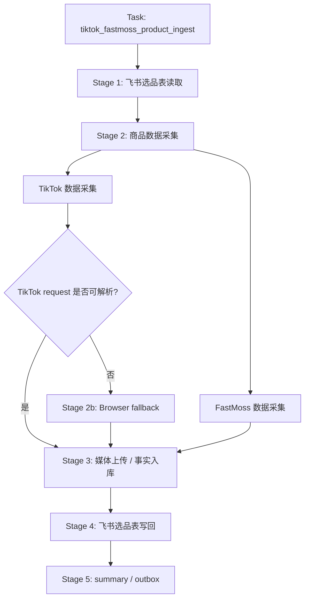
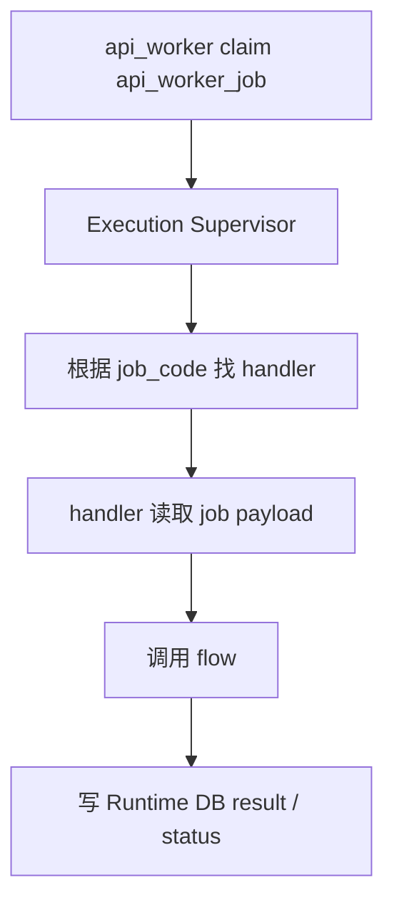
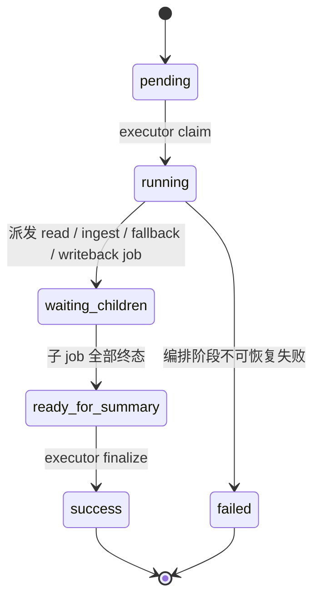

# 选品分析 Workflow 设计

日期: 2026-04-23

## 1. 流程定位

选品分析当前对应 `tiktok_fastmoss_product_ingest` 这一类商品采集任务。它围绕一个 TikTok 商品 URL / SKU，把飞书选品表读取、TikTok 商品数据采集、FastMoss 商品数据采集、媒体上传、事实库沉淀、飞书选品表写回串成一个可恢复的 workflow。

该流程不是一个单体长函数。架构口径上，它应由 `executor_daemon` 编排成多个 API job / browser job，再由 `api_worker` 或 `browser_worker` 执行具体 handler。

## 2. Task

| 字段 | 设计 |
| --- | --- |
| Task 名称 | 选品分析 / TikTok + FastMoss 商品采集 |
| 当前 task_code | `tiktok_fastmoss_product_ingest` |
| 顶层表 | `task_request` |
| 编排者 | `executor_daemon` |
| 主要执行 worker | `api_worker`，必要时使用 `browser_worker` |
| 最终结果 | 商品采集结果、事实库写入结果、飞书写回结果、summary/outbox |

## 3. Workflow

当前代码中的 workflow id 为 `tiktok_fastmoss_product_ingest_v1`。当前 `WorkflowSpec` 以 `orchestrate_tiktok_fastmoss_product_ingest` 作为顶层 orchestration step，内部再由 runtime executor 派发 API worker job 和 browser fallback job。

架构归一后，该 workflow 可表达为:

## 4. Stage 设计

| Stage | 作用 | Runtime 状态 |
| --- | --- | --- |
| 飞书选品表读取 | 根据商品 URL / SKU 从 `TK选品收集` 找到源记录和写回上下文 | `waiting_feishu_tk_selection_table_read` |
| 商品数据采集 | 采集 TikTok 商品信息、FastMoss 商品 API 信息 | `waiting_api_worker` |
| Browser fallback | 当 TikTok request HTML 不可解析时，派发浏览器采集任务 | `waiting_tiktok_product_browser_fetch` |
| 媒体上传 / 事实入库 | 上传商品媒体，写入商品/店铺/视频/达人等事实数据 | API job 内部 result |
| 飞书选品表写回 | 将采集结果写回飞书选品表 | `dispatch_feishu_tk_selection_table_writeback` / waiting children |
| summary / outbox | executor 汇总 request，创建通知消息 | `ready_for_summary` -> `completed` |

## 5. Job 设计

| Job | job_code / item_code | Worker | Handler | Flow |
| --- | --- | --- | --- | --- |
| 飞书选品表读取 | `feishu_tk_selection_table_read` | `api_worker` | `_run_feishu_tk_selection_table_read_api_worker_job` | `read_feishu_tk_selection_table_for_product` |
| 商品数据采集 | `tiktok_fastmoss_product_ingest` | `api_worker` | `_run_tiktok_fastmoss_product_ingest_api_worker_job` | `run_tiktok_fastmoss_product_ingest` |
| TikTok browser fallback | `tiktok_product_browser_fetch` | `browser_worker` | `_run_browser_execution_once` | `fetch_tiktok_product_via_browser` |
| 飞书选品表写回 | `feishu_tk_selection_table_writeback` | `api_worker` | `_run_feishu_tk_selection_table_writeback_api_worker_job` | `writeback_feishu_tk_selection_table` |

## 6. Handler 与 Flow 边界

`api_worker` 和 `browser_worker` 只执行 job，不理解完整选品分析流程。

选品分析中:

- Handler 是 worker 看到的入口。
- Flow 是具体业务实现，例如请求 TikTok、请求 FastMoss、上传媒体、写事实库、写飞书。
- Job 是可重试、可超时、可审计的运行时单元。

## 7. 状态收敛

每个 API job / browser job 完成后写回 Runtime DB。父 `task_request` 不依赖内存 callback，而是由 executor/reconciler 根据 DB 状态判断是否进入下一阶段。

## 8. 颗粒度原则

选品分析的 job 不按每一个 HTTP 请求拆分，而按可独立重试的业务动作拆分:

- 飞书表读取是一个 job。
- 商品采集是一个 job。
- 浏览器 fallback 是一个 job。
- 飞书写回是一个 job。

商品采集 job 内部可以包含 TikTok request、FastMoss request、媒体上传和事实入库，但必须保证幂等，尤其是事实库 upsert 和飞书写回。

