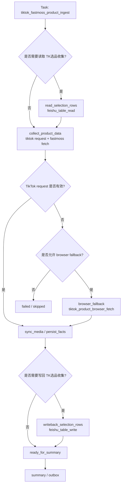
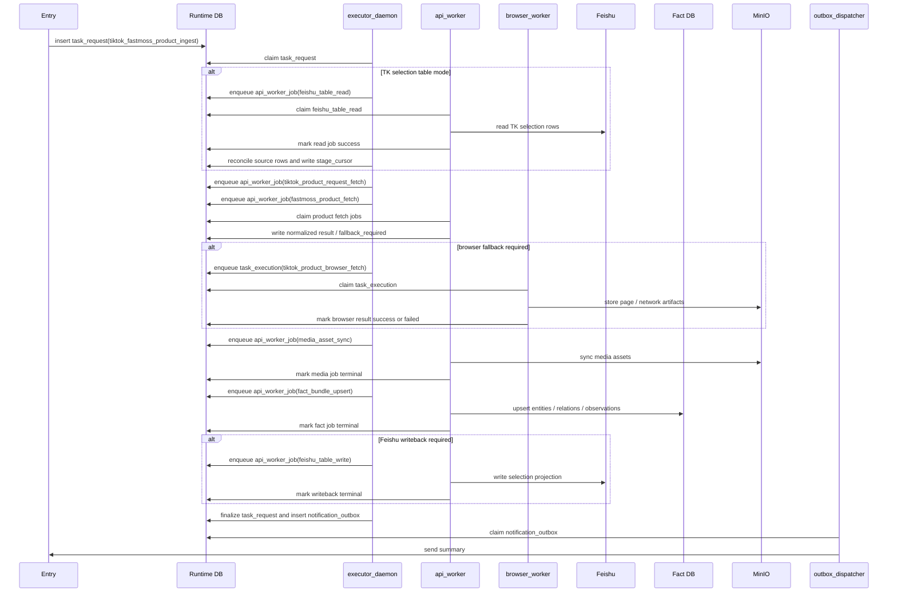
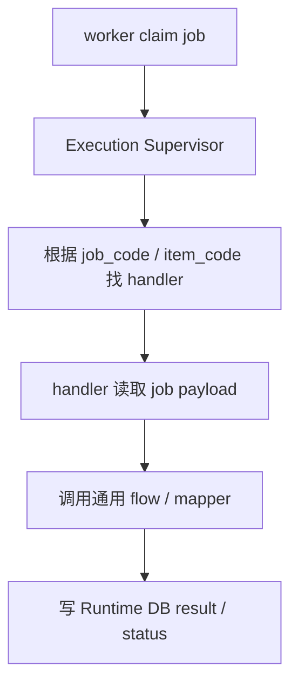
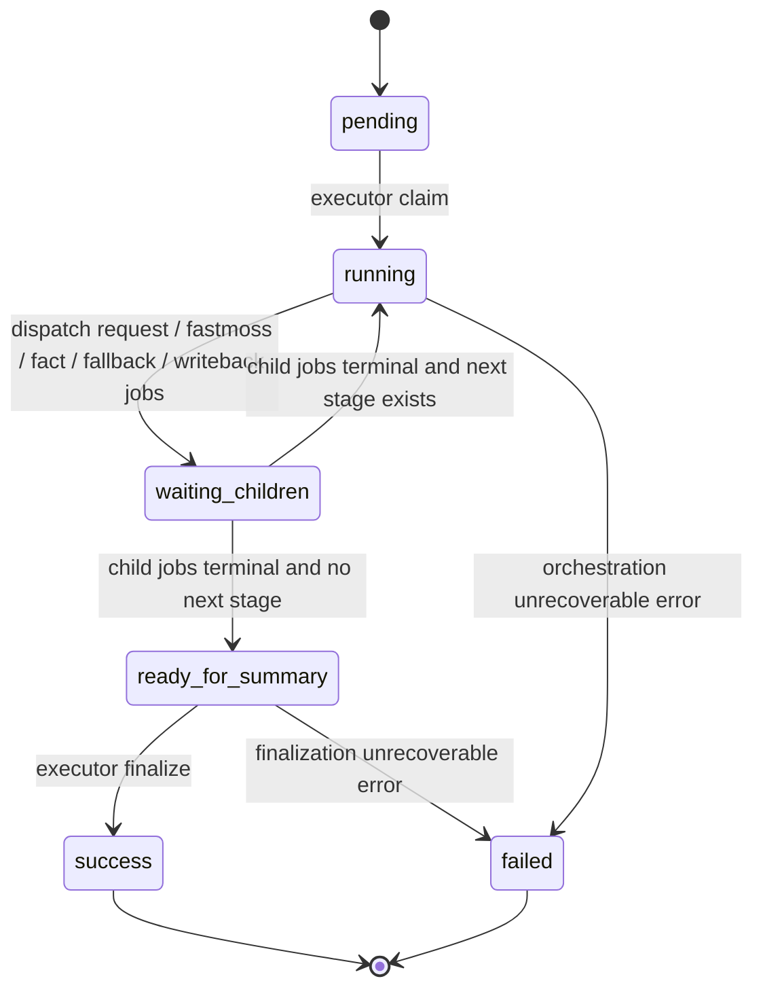

# 选品分析 Workflow 设计

日期: 2026-04-23

状态: 当前架构设计文档

## 1. 流程定位

选品分析当前对应 `tiktok_fastmoss_product_ingest`。它围绕一个 TikTok 商品 URL / SKU / product id 完成商品数据采集、媒体资产同步、事实库沉淀，并在需要时把结果写回 `TK选品收集`。

该 workflow 有两个入口模式:

| 模式 | 说明 |
| --- | --- |
| direct ingest | 调用方直接提交 product url / product id，系统直接进入商品事实采集 |
| TK selection table mode | 系统先读取 `TK选品收集`，找到来源记录、商品 key 和写回上下文，再进入商品事实采集 |

正式架构口径:

- 商品、店铺、达人、视频、媒体资产属于通用事实，不属于选品分析专有数据。
- TikTok 商品数据采集优先走 request/API 路径。
- Browser 只作为 fallback，用于 request 失效、关键字段缺失或被风控阻断的场景。
- Workflow 的业务差异主要在来源飞书表读取、事实关系/快照记录、选品表写回字段映射。
- TikTok、FastMoss、media sync 和 Fact DB upsert 必须复用统一事实采集 contract；选品 workflow 不能因为自身只写回部分字段而丢弃已采集事实。

## 2. Task

| 字段 | 设计 |
| --- | --- |
| Task 名称 | 选品分析 / TikTok + FastMoss 商品采集 |
| 当前 task_code | `tiktok_fastmoss_product_ingest` |
| 目标 workflow_code | `tiktok_fastmoss_product_ingest` |
| 顶层表 | `task_request` |
| 编排者 | `executor_daemon` |
| 默认执行 worker | `api_worker` |
| fallback worker | `browser_worker` |
| 最终结果 | 商品事实、FastMoss 数据、媒体资产、事实库写入结果、可选飞书写回、summary/outbox |

说明: 当前代码中的历史 `WorkflowSpec` ID 可以保留为 framework 兼容实现事实；目标 Runtime workflow contract 使用稳定 `workflow_code`，不在 code 名称中追加版本后缀。

## 3. Workflow

正式 workflow contract 只描述 Runtime stage、job 和通用 handler 映射；framework 兼容入口不作为目标架构设计元素。Runtime 层由 executor 根据 `task_request.current_stage` 和 `stage_cursor_json` 派发 API job / browser job。

目标 workflow 应表达为:



Stage 命名遵循 [workflow-design-guidelines.md](./workflow-design-guidelines.md): stage code 只表达业务阶段，adapter/mapper 放在 Job / Handler / Flow 映射中。

## 4. Stage 设计

| Stage code | 进入条件 | 编排动作 | 派生 Job | 退出条件 |
| --- | --- | --- | --- | --- |
| `read_selection_rows` | 开启 TK selection table mode | 派发通用飞书读取 job，获取来源记录和写回上下文 | `feishu_table_read` | 读取成功 / 跳过 / 失败 |
| `collect_product_data` | 有 product url / product id | 优先派发 request/API 采集 | `tiktok_product_request_fetch`、`fastmoss_product_fetch` | 成功 / fallback required / failed |
| `browser_fallback` | TikTok request 失效且允许 fallback | 派发 browser 采集 job | `tiktok_product_browser_fetch` | browser fetch 成功 / failed |
| `sync_media` | 采集结果中存在图片、封面、头像等媒体资产 | 同步媒体到 MinIO / object store | `media_asset_sync` | 媒体同步完成 / skipped / failed |
| `persist_facts` | 已得到 normalized product result | 写商品、店铺、达人、视频、媒体引用、关系和观测 | `fact_bundle_upsert` | 事实写入完成 / failed |
| `writeback_selection_rows` | 有来源飞书记录且需要写回 | 派发通用飞书写回 job | `feishu_table_write` | 写回终态 |
| `ready_for_summary` | 子任务全部终态 | 汇总 result，写 outbox | `notification_outbox` | `completed` / `partial_success` / `failed` |

当前 Runtime 状态可以继续沿用已有值，但语义应向上表收敛:

| 当前状态 | 目标语义 |
| --- | --- |
| `waiting_feishu_table_read` | 等待 `read_selection_rows` 派生的通用飞书读取 job |
| `waiting_api_worker` / `waiting_tiktok_fastmoss_product_ingest` | 等待 request/API 商品采集或事实写入 |
| `waiting_tiktok_product_browser_fetch` | 等待 browser fallback |
| `dispatch_feishu_table_write` / `waiting_feishu_table_write` | 派发或等待 `writeback_selection_rows` 的通用飞书写回 job |
| `ready_for_summary` | 等待最终汇总 |

## 5. Job 设计

| Job | Runtime 表 | Worker | Handler | 输出 |
| --- | --- | --- | --- | --- |
| `feishu_table_read` | `api_worker_job` | `api_worker` | `feishu_table_read` | source row、product key、writeback context |
| `tiktok_product_request_fetch` | `api_worker_job` | `api_worker` | `tiktok_product_request_fetch` | normalized TikTok product result、fallback decision |
| `fastmoss_product_fetch` | `api_worker_job` | `api_worker` | `fastmoss_product_fetch` | FastMoss 商品、店铺、指标、关联信息 |
| `tiktok_product_browser_fetch` | `task_execution` | `browser_worker` | `tiktok_product_browser_fetch` | browser 原始数据和 normalized product result |
| `media_asset_sync` | `api_worker_job` | `api_worker` | `media_asset_sync` | MinIO object keys、媒体资产事实 |
| `fact_bundle_upsert` | `api_worker_job` | `api_worker` | `fact_bundle_upsert` | entity / relation / observation upsert result |
| `feishu_table_write` | `api_worker_job` | `api_worker` | `feishu_table_write` | 飞书写回结果 |
| `task_completed_notification` | `notification_outbox` | `outbox_dispatcher` | `outbox_dispatch` | 最终通知 |

## 6. 进程间调度时序图

本图只表达跨进程调度、Runtime DB 状态交接和外部副作用位置，不展开 handler 内部函数。



## 7. TikTok Request-First / Browser-Fallback 约定

TikTok 商品数据采集必须优先使用 request/API 路径:

1. executor 优先派发 `tiktok_product_request_fetch`。
2. request handler 尝试通过 HTTP / 已知接口 / request HTML 解析商品信息。
3. request handler 返回统一 normalized result；如果无法满足最低字段要求，返回 `fallback_required=true`。
4. executor 只有在 `fallback_required=true` 且错误可通过浏览器恢复时，才派发 `tiktok_product_browser_fetch`。
5. browser handler 采集 HTML / network / 页面信息，并输出与 request handler 相同的 normalized result contract。
6. 后续 `fact_bundle_upsert` 不关心数据来自 request 还是 browser。

必须 fallback 的典型情况:

| 场景 | 处理 |
| --- | --- |
| request HTML 不可解析 | 允许 browser fallback |
| 关键字段缺失，例如 product id、title、shop、price 等 | 允许 browser fallback |
| request 被登录、验证码、风控或地区限制阻断 | 允许 browser fallback |
| request 返回结构变化，解析器无法识别 | 允许 browser fallback |

不应 fallback 的情况:

| 场景 | 处理 |
| --- | --- |
| URL 无法归一化 | `failed` 或 `skipped` |
| 缺少 product url / product id | `failed` 或 `skipped` |
| 商品明确不存在或已下架 | 按业务策略 `skipped` / `partial_success` |
| 已达到 fallback 最大次数 | `failed` 或 `partial_success` |

fallback 决策必须写入 result / stage cursor:

```json
{
  "fallback_required": true,
  "fallback_reason": "request_parse_failed",
  "fallback_source_job_id": "api-job-id",
  "fallback_allowed": true
}
```

## 8. 事实、关系、快照与业务投影

选品分析不应把所有结果都写成 workflow 私有数据。需要区分:

| 类型 | 示例 | 写入位置 |
| --- | --- | --- |
| 事实实体 | 商品、店铺、达人、视频、媒体资产 | Fact DB |
| 关系数据 | 商品-达人关系、商品-视频关系、来源飞书记录-商品关系 | Fact DB 关系表或业务关系表 |
| 快照/观测 | 本次采集的销量、价格、评分、粉丝数、原始响应 | Fact observation / Runtime artifact |
| 业务投影 | `TK选品收集` 的状态、摘要、链接、指标字段 | Feishu |

业务 mapper 负责:

- 从飞书源行映射 product key。
- 从事实和观测映射 `TK选品收集` 写回字段。
- 定义部分成功时哪些字段可以写回，哪些字段必须留空或标记失败。

事实入库不由选品 projection mapper 负责。mapper 只能读取标准事实结果并生成业务表投影；Fact DB 写入统一走 `media_asset_sync` 和 `fact_bundle_upsert`。

## 9. Handler 与 Flow 边界

`api_worker` 和 `browser_worker` 只执行 job，不理解完整选品分析流程。



约束:

- Handler 是 worker 看到的入口。
- Flow 是具体业务实现，例如请求 TikTok、请求 FastMoss、上传媒体、写事实库、写飞书。
- Mapper 负责业务字段映射和投影，不负责 worker 调度。
- Job 是可重试、可超时、可审计的运行时单元。

## 10. 状态收敛

每个 API job / browser job 完成后写回 Runtime DB。父 `task_request` 不依赖内存 callback，而是由 executor / reconciler 根据 DB 状态判断是否进入下一阶段。



父任务 final status 建议:

| 条件 | final_status |
| --- | --- |
| request/API 成功、事实写入成功、可选飞书写回成功 | `success` |
| 商品事实成功但部分 FastMoss / 媒体 / 飞书写回失败，业务允许继续 | `partial_success` |
| 无有效商品事实，或 request/browser 均不可恢复失败 | `failed` |

## 11. 颗粒度原则

选品分析不按每一个 HTTP 请求拆 job，而按可靠性边界拆 job:

- 飞书表读取是来源上下文 job。
- TikTok request fetch 是默认商品数据采集 job。
- TikTok browser fetch 是 fallback job。
- FastMoss product fetch 是商品扩展事实 job。
- Media sync 和 fact upsert 是事实沉淀 job。
- 飞书写回是业务投影 job。

这样可以保证:

- 浏览器资源只在必要时占用。
- request 与 browser 输出同一 result contract。
- Fact DB upsert 和 Feishu writeback 有清晰幂等边界。
- 失败可以定位到具体数据来源或副作用阶段。
