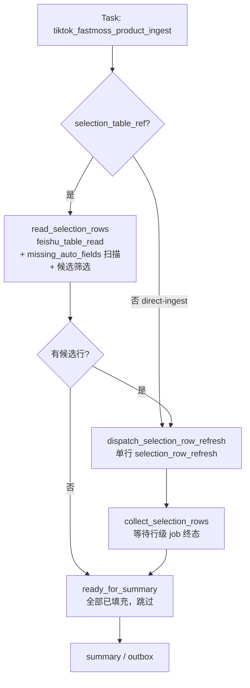
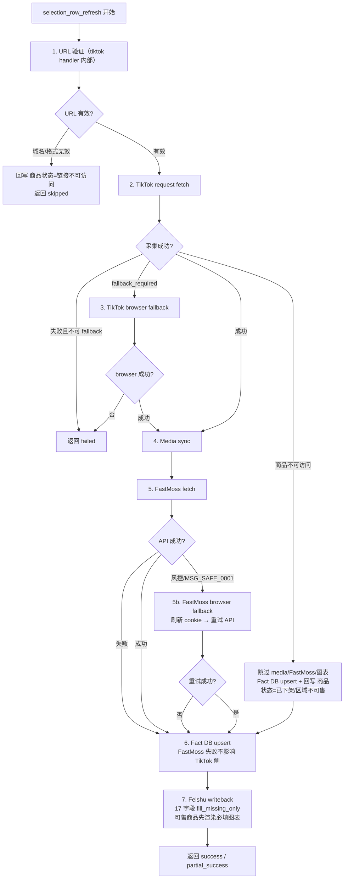
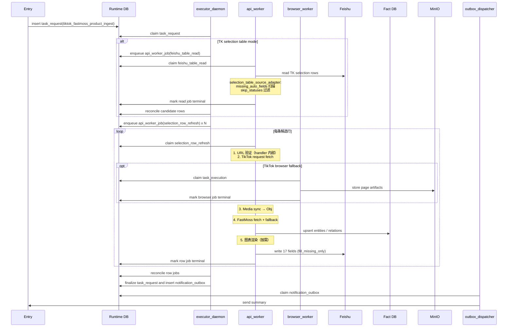
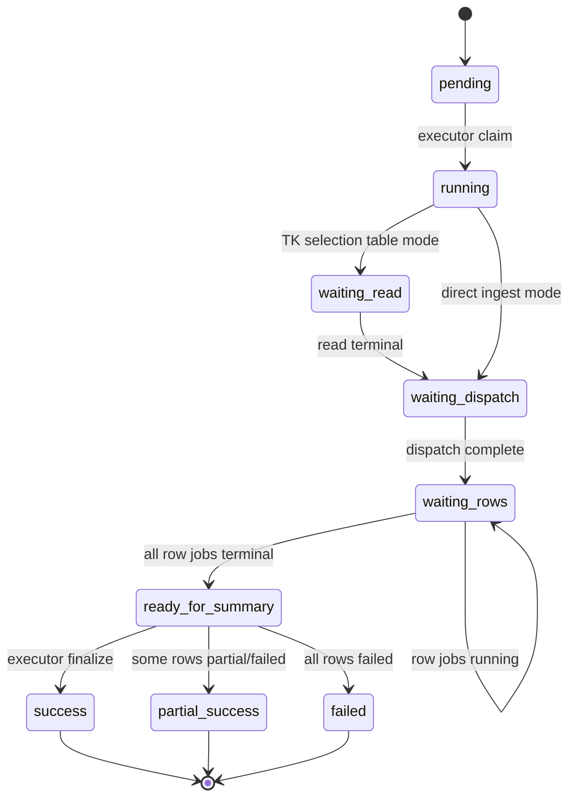

# 选品表自动采集扩展 Workflow 设计

日期: 2026-04-30

状态: 实施设计文档

## 1. 流程定位

重构 `tiktok_fastmoss_product_ingest` workflow，从按 API 步骤拆分 job 的旧模型迁移到行级 pipeline 模型。每一条选品表候选行只创建一个行级主 job（`selection_row_refresh`），内部串行完成 TikTok 采集 → FastMoss 采集 → 事实入库 → 飞书写回。

本次重构同时扩展写回字段从 3 个到 17 个，并补齐 URL 验证、`missing_auto_fields` 扫描、父体数据写入、图表渲染等能力。

关联需求文档：[../../business/requirements/tk-selection-collection-expand.md](../../business/requirements/tk-selection-collection-expand.md)

## 2. Task

| 字段 | 设计 |
| --- | --- |
| Task 名称 | 选品分析 / TikTok + FastMoss 商品采集 |
| task_code | `tiktok_fastmoss_product_ingest`（保持不变） |
| workflow_code | `tiktok_fastmoss_product_ingest`（保持不变） |
| 顶层表 | `task_request` |
| 编排者 | `executor_daemon` |
| 执行 worker | `api_worker`（主），`browser_worker`（TikTok/FastMoss fallback） |
| 触发方式 | `manual` / `schedule` / `webhook` / `cli` |
| 输入 | `product_url`、`product_id`、`selection_table_ref`、`selection_record_id`、`writeback_enabled`、`fallback_allowed` |
| 最终结果 | 商品事实、FastMoss 数据、媒体资产、17 字段飞书写回、summary/outbox |

## 3. Workflow

### 3.1 Stage 设计

从当前 7 个 stage 收敛到 4 个：

| Stage code | 进入条件 | 编排动作 | 派生 Job | 退出条件 |
| --- | --- | --- | --- | --- |
| `read_selection_rows` | 开启 TK selection table mode | 派发飞书读取 job，`selection_table_source_adapter` 执行 `missing_auto_fields` 扫描和 URL 格式/域名校验 | `feishu_table_read` | 得到候选行 / 跳过 / 失败 |
| `dispatch_selection_row_refresh` | 存在候选行 | 为每条候选行创建一个 `selection_row_refresh` job | `selection_row_refresh` | 行级 job 全部创建完成 |
| `collect_selection_rows` | 行级 job 已派发 | 等待所有 `selection_row_refresh` 完成，回收结果 | 无（等待阶段） | 全部行级 job 终态 |
| `ready_for_summary` | 子任务全部终态 | 汇总 result，写 outbox | `notification_outbox` | `completed` / `partial_success` / `failed` |

### 3.2 流程图



### 3.3 行级 Pipeline（`selection_row_refresh` 内部）



## 4. Job 设计

| Job | Runtime 表 | Worker | Handler | 说明 |
| --- | --- | --- | --- | --- |
| `feishu_table_read` | `api_worker_job` | `api_worker` | `feishu_table_read` | 读取选品表全部记录，`selection_table_source_adapter` 执行候选筛选 |
| `selection_row_refresh` | `api_worker_job` | `api_worker` | `selection_row_refresh`（**新**） | 行级 pipeline 主 job，内部串行执行完整采集链路 |
| `notification_outbox` | `notification_outbox` | `outbox_dispatcher` | `outbox_dispatch` | 最终通知 |

### 4.1 `selection_row_refresh` Payload

```json
{
  "request_payload": {},
  "stage_code": "collect_selection_rows",
  "source_record_id": "rec_xxx",
  "source_table_ref": "tblpF46y6SkmVCE5",
  "product_identity": {
    "product_id": "1730892854181139253",
    "product_url": "https://www.tiktok.com/shop/pdp/1730892854181139253",
    "normalized_product_url": "https://www.tiktok.com/shop/pdp/1730892854181139253"
  },
  "source_context": {},
  "fallback_allowed": true,
  "fastmoss_overview_window_days": [28],
  "fastmoss_sku_window_days": 28,
  "writeback_enabled": true,
  "target_table_ref": "tblpF46y6SkmVCE5"
}
```

### 4.2 `selection_row_refresh` Result

```json
{
  "source_record_id": "rec_xxx",
  "row_status": "success | partial_success | unavailable | url_invalid | failed",
  "normalized_product_result": {},
  "product_fact_bundle": {},
  "fact_upsert": {},
  "writeback_projection": {"fields": {}},
  "writeback_result": {},
  "step_timeline": [],
  "runtime_evidence": {}
}
```

## 5. Handler 与 Flow 边界

### 5.1 共享能力（Handler 层）

以下能力作为 handler 内部逻辑，所有 TikTok/FastMoss 抓取 workflow 共享：

| 能力 | 实现位置 | 影响范围 |
| --- | --- | --- |
| URL 域名/格式验证 | `tiktok_product_request_fetch` handler 内部 | 选品表、竞品表、关键词搜索 |
| 商品可访问性判定 | `tiktok_product_request_fetch` handler 内部 | 已有，保持不变 |
| FastMoss browser fallback | `fastmoss_product_fetch` handler / `run_competitor_row_refresh_flow` 内部 | 选品表、竞品表、达人池同步 |

### 5.2 本 Workflow 专属

| 组件 | Code | 所有权 |
| --- | --- | --- |
| Source Adapter | `selection_table_source_adapter` | 选品表业务语义（`missing_auto_fields` 扫描、身份字段、跳过规则） |
| Projection Mapper | `selection_table_projection_mapper` | 17 字段映射、`fill_missing_only` 策略、图表渲染 |
| Row Refresh Flow | `run_selection_row_refresh_flow` | 行级 pipeline 串行编排 |

### 5.3 Adapter / Mapper 默认业务语义

| 配置项 | 默认值 | 说明 |
| --- | --- | --- |
| `missing_auto_fields` | 17 个（见需求文档 3.3 节） | 全部已填充则跳过 |
| `skip_statuses` | `["已下架/区域不可售", "链接不可访问"]` | 不可访问记录跳过 |
| `upsert_key` | `商品ID` | 写回主键 |
| `fill_missing_only` | `true` | 所有新增字段不覆盖已有值 |
| `refresh_identity_fields` | `["商品ID", "商品链接"]` | 身份字段始终刷新 |
| `recorded_date_conditional` | `true` | 有实际字段写入才刷新 `记录日期` |

### 5.4 竞品表同步更新

本次共享能力变更需同步更新竞品表 workflow：

| 变更 | 竞品表影响 |
| --- | --- |
| URL 验证（TikTok handler 内部） | `competitor_row_refresh` 自动获得 URL 验证能力，无效 URL 回写 `商品状态=链接不可访问` |
| FastMoss browser fallback | `competitor_row_refresh` 已有此能力，保持不变 |

竞品表 workflow 结构不变（已是行级 pipeline），仅 handler 层共享能力增强。

## 6. 进程间调度时序图



## 7. 数据写入

### 7.1 Runtime DB
- `task_request`：父任务状态
- `api_worker_job`：`feishu_table_read`、`selection_row_refresh`（每条候选行一个）
- `task_execution`：`tiktok_product_browser_fetch`（fallback 时）、`fastmoss_security_browser_resolve`（FastMoss fallback 时）

### 7.2 Fact DB
- 商品、店铺、SKU、媒体资产、关系、指标快照、每日指标、分布快照（统一走 `fact_bundle_upsert`）

### 7.3 Feishu
- `TK选品收集`：17 个自动维护字段，`fill_missing_only` 策略
- `商品状态`：仅在不可访问时写入"链接不可访问"或"已下架/区域不可售"

### 7.4 MinIO / Object Store
- 商品主图、侧边栏图片（media sync）
- 图表 PNG 不入 MinIO，写回时直接渲染后插入飞书单元格

## 8. SKU 绑定规则

TikTok 和 FastMoss 各自返回 SKU 数据，但字段命名和结构不同。本节定义两平台 SKU 的绑定规则，确保父体规格、父体图片、最佳 SKU 等字段能正确关联。

### 8.1 绑定键

绑定使用两个维度：`sku_id` 和 `prop_value_id`。

| 维度 | TikTok 字段 | FastMoss 字段 | 说明 |
| --- | --- | --- | --- |
| SKU 唯一标识 | `skus[].sku_id` | `sku_list[].sku_id` | 两平台共享相同值（FastMoss 数据源为 TikTok） |
| 规格值标识 | `sku_images[].sku_property_key` | `sku_list[].sku_sale_props[].prop_value_id` | TikTok 内部数字 ID，两平台一致 |

**关键发现**：`sku_property_key` 和 `prop_value_id` 都是 TikTok 内部为每个规格值分配的数字 ID（如 `7630828784765421326`），而非可读文本（如 "Golden"）。这使得跨平台绑定不需要文本匹配。

### 8.2 图片关联

TikTok 的 `sku_property_image_map` 将 `sku_property_key` 映射到图片 URL。FastMoss 的 `sku_sale_props[].image` 也包含相同的图片（相同图片 ID，不同 CDN 域名）。

```
TikTok sku_images[0]:
  sku_property_key: "7630828784765421326"
  source_url: "https://p19-.../6993942ee660440da03c482b2371076c~..."

FastMoss sku_list[0].sku_sale_props[0]:
  prop_value_id: "7630828784765421326"   ← 匹配 sku_property_key
  image: "https://p16-.../6993942ee660440da03c482b2371076c~..."  ← 相同图片 ID
```

### 8.3 实际数据示例

以商品 `1732355931137544633`（TikTok URL: `https://www.tiktok.com/shop/pdp/1732355931137544633`）为例：

**TikTok 侧数据**（来自 `sku_images` + `skus`）：

| 序号 | sku_id | sku_name | sku_property_key | 图片 URL |
| --- | --- | --- | --- | --- |
| 1 | 1732355931814793657 | 03-9307 | 7630828784765421326 | `.../6993942ee660440da03c482b2371076c~...` |
| 2 | 1732355931816365377 | 03-9306 | 7630828784765392614 | `.../95fde6d364f8473c823f4a6f3ccf5bb4~...` |
| 3 | 1732355931816889657 | 03-9305 | 7630828784765363878 | `.../f2dc23e4b53b4848915b0e1aa5d3a198~...` |
| 4 | 1732355931816889658 | 03-9304 | 7630828784765335142 | `.../91a1ed8b572f431d8180ca6e1b5b58c1~...` |
| 5 | 1732355931816889659 | 03-9303 | 7630828784765306406 | `.../cb15f52b1cb9403d9e3e8d137ba8720d~...` |

**FastMoss 侧数据**（来自 `sku_list`）：

| 序号 | sku_id | sku_name | spec_name | prop_value_id | image |
| --- | --- | --- | --- | --- | --- |
| 1 | 1732355931814793657 | Golden - 12 Pack | Golden - 12 Pack | 7630828784765421326 | `.../6993942ee660440da03c482b2371076c~...` |
| 2 | 1732355931816365377 | Blue - 12 Pack | Blue - 12 Pack | 7630828784765392614 | `.../95fde6d364f8473c823f4a6f3ccf5bb4~...` |
| 3 | 1732355931816889657 | Red - 12 Pack | Red - 12 Pack | 7630828784765363878 | `.../f2dc23e4b53b4848915b0e1aa5d3a198~...` |
| 4 | 1732355931816889658 | Green - 12 Pack | Green - 12 Pack | 7630828784765335142 | `.../91a1ed8b572f431d8180ca6e1b5b58c1~...` |
| 5 | 1732355931816889659 | Burgundy - 12 Pack | Burgundy - 12 Pack | 7630828784765306406 | `.../cb15f52b1cb9403d9e3e8d137ba8720d~...` |

**绑定结果**：通过 `sku_id` 精确匹配（如 `1732355931814793657`），或通过 `prop_value_id = sku_property_key` 匹配（如 `7630828784765421326`），可将 FastMoss 的可读规格名（"Golden - 12 Pack"）绑定到 TikTok 的规格图片。FastMoss 的 `sku_name`/`spec_name` 可覆盖 TikTok 的 `sku_name`（TikTok 侧为内部编码如 "03-9307"）。

### 8.4 best_sku 父体字段绑定策略

`父体规格`、`父体图片` 的唯一业务来源是 FastMoss SKU 分析中的有效 `best_sku`，不得从 `product_skus[0]`、单 SKU、`Default`、`默认`、`Specification`、空 SKU 或任意第一条 SKU 兜底生成。

有效 `best_sku` 必须同时满足：

1. `best_sku.sku_value` 有业务值，且不属于 `Default`、`默认`、`Specification` 等无区分度规格值。
2. `best_sku.sold_count > 0`。

父体图片匹配优先级：

1. 以 `best_sku` 描述的主销规格值作为入口。
2. 在 FastMoss SKU row 中查找同一主销 SKU。
3. 优先用 `sku_id` 精确匹配。
4. 其次用 `prop_value_id = sku_property_key` 匹配规格值维度图片。
5. 无匹配则跳过 `父体图片`，但可保留已确认的 `父体规格`。

当前 `tk_fact_ingestion_service._match_fastmoss_sku_reference` 仅使用 `sku_id`、`sku_name`、`prop_value`、`prop_name: prop_value` 作为匹配键，**未包含 `prop_value_id`**。需补充此键以支持规格值维度的绑定。

### 8.5 数据流缺口

当前实现中，TikTok 解析器（`product_page.py`）已提取 `sku_images`，但 `normalized_product_result.logical_fields` 未包含此字段。导致：

- `tk_fact_ingestion_service` 无法获取 TikTok 侧的 SKU 图片
- 父体图片无法从 SKU 维度绑定写回
- 仅能依赖 FastMoss 的 `sku_sale_props[].image`（如 API 未返回则为空）

**修复方向**：将 `sku_images` 纳入 `logical_fields` 或在 fact bundle 中单独传递。

### 8.6 best_sku 接口要求

`best_sku`（最佳 SKU）字段**仅存在于旧版 SKU 分布接口**，v3 版本不返回。

| 接口 | 路径 | 返回 best_sku | 说明 |
| --- | --- | --- | --- |
| SKU List (v3) | `GET /api/goods/v3/productSku` | 否 | 返回 `sku_list`、`sku_detail`，无销量分布 |
| SKU Distribution (旧版) | `GET /api/goods/productSku` | **是** | 返回 `sku_list`、`sku_detail`、`best_sku`、`sku_gmv`、`sku_units_sold` |

`best_sku` 结构：

```json
{
  "sku_name": "Size",          // 规格维度名
  "sku_value": "Golden - 12 Pack",  // 规格值
  "sold_count": 35,            // 销量
  "sale_amount": 350,          // 销售额
  "currency": "USD",
  "price": "10.29"
}
```

**必须同时调用两个接口**：v3 获取 `sku_sale_props`（含 `prop_value_id` 绑定键），旧版获取 `best_sku`（含销量分布）。

### 8.7 无有效 best_sku 处理

当商品无销量或没有有效主销规格时，FastMoss 返回的 `best_sku` 字段可能存在但值为空：

```json
{
  "sku_name": "",
  "sku_value": "",
  "sold_count": 0,
  "sale_amount": 0,
  "price": ""
}
```

实测 13 个产品中 5 个存在此情况（均为新上架或零销量商品）。

**业务规则**：只有 `best_sku.sku_value` 有业务值且 `best_sku.sold_count > 0` 时，才允许生成以下字段：
- `SKU销量占比图`（图表渲染）
- `父体规格`（来自 `best_sku.sku_value`）
- `父体图片`（需要 best_sku 的 prop_value_id 绑定图片）

`Default`、`默认`、`Specification`、空 SKU、单 SKU 或第一条 SKU 不视为有效父体规格来源。没有有效 `best_sku` 时，三者均跳过；有有效 `best_sku` 但图片无法通过 `sku_id` 或 `prop_value_id` 匹配时，只跳过 `父体图片`。

### 8.8 Fact DB 持久化配置

当前 `fact_bundle_upsert` handler 需要 `fact_db_url` 才能实际写入数据库。若 payload 中未提供，handler 以 `dry_run` 模式运行（仅计算不持久化）。

**已知问题**：`selection_row_refresh` 和 `competitor_row_refresh` flow 均未在 `fact_bundle_upsert` 步骤的 payload 中传入 `fact_db_url`，导致 Fact DB 写入全部为 dry_run。

**修复方向**：在两个 flow 的 `_child_context` 构建 `fact_bundle_upsert` payload 时，从 `request_payload` 或环境变量中解析并传入 `fact_db_url`（或 `execution_control_db_url`）。

## 9. 状态收敛



父任务 final status：

| 条件 | final_status |
| --- | --- |
| 所有行级 job 成功（含 skipped by all-filled） | `success` |
| 部分行成功、部分失败或 partial_success | `partial_success` |
| 所有行失败，或 read 阶段失败 | `failed` |

## 10. 失败兜底

| 场景 | 策略 |
| --- | --- |
| URL 格式/域名无效 | 回写 `商品状态=链接不可访问`，行级 job 标记 `skipped`，不阻塞其他行 |
| TikTok request 失败 + browser fallback 失败 | 行级 job 标记 `failed`，不执行写回 |
| 商品已下架/区域不可售 | 回写 `商品状态=已下架/区域不可售`，行级 job 标记 `skipped` |
| FastMoss API 失败 | 行级 job 继续执行，TikTok 侧 8 个字段仍正常写回，标记 `partial_success` |
| FastMoss 风控 fallback 失败 | 同上，FastMoss 侧 6 个字段留空 |
| Fact DB upsert 失败 | 行级 job 标记 `failed`，可重试 |
| 飞书写回失败 | 行级 job 标记 `failed`，可重试 |
| 图表渲染失败 | 对应截图字段跳过，不阻塞其他字段 |
| best_sku 不存在、销量为 0、规格值为空或为 `Default`/`默认`/`Specification` | 跳过 `SKU销量占比图`、`父体规格`、`父体图片` 三个字段，其余字段正常写回 |
| best_sku 有效但无法匹配 SKU 图片 | 写入 `父体规格`，跳过 `父体图片`，其余字段正常写回 |

## 11. 源码变更清单

| 文件 | 变更类型 | 说明 |
| --- | --- | --- |
| `domains/tiktok/workflows/tiktok_fastmoss_product_ingest.py` | **重写** | Stage 从 7 个收敛到 4 个，新增 `selection_row_refresh` job 定义 |
| `domains/tiktok/flows/tiktok_fastmoss_product_ingest.py` | **重写** | 按行级 pipeline 重写 stage 推进逻辑 |
| `domains/tiktok/flows/selection_row_refresh.py` | **新增** | 行级 pipeline flow（参照 `competitor_row_refresh.py`） |
| `fact_sources/tiktok/product_request_fetch_handler.py` | 修改 | 新增 URL 域名/格式验证，扩展 `logical_fields`（review_count, rating, description, gallery_images, **sku_images**） |
| `fact_sources/fastmoss/product_fetch_handler.py` | 修改 | 新增 FastMoss browser fallback 返回信号 |
| `mappers/feishu_selection_row_mapper.py` | 修改 | 新增 `missing_auto_fields` 扫描、`skip_statuses` 过滤 |
| `projections/feishu_selection_projection.py` | **重写** | 从 3 字段扩展到 17 字段，新增图表渲染、`fill_missing_only` 策略 |
| `contracts/fields/feishu-tk-selection.yaml` | 修改 | 14 个字段从 `not_written_by_current_ingest` 改为 `fill_missing_only` |
| `infrastructure/facts/tk_fact_ingestion_service.py` | 修改 | `_match_fastmoss_sku_reference` 补充 `prop_value_id` 匹配键，支持规格值维度 SKU 绑定 |
| `domains/tiktok/flows/selection_row_refresh.py` | 修改 | `fact_bundle_upsert` 步骤传入 `fact_db_url`，修复 dry_run 问题 |
| `domains/tiktok/flows/competitor_row_refresh.py` | 修改 | 同上，`fact_bundle_upsert` 步骤传入 `fact_db_url` |
| `domains/tiktok/jobs/__init__.py` | 修改 | 注册 `selection_row_refresh` job |

## 12. 竞品表同步变更

| 文件 | 变更类型 | 说明 |
| --- | --- | --- |
| `flows/competitor_row_refresh.py` | 修改 | 接入 URL 验证结果处理（tiktok handler 返回 `url_invalid` 时回写 `商品状态=链接不可访问`） |

## 13. 关联文档

- [../../business/requirements/tk-selection-collection-expand.md](../../business/requirements/tk-selection-collection-expand.md)
- [../../business/business-requirements.md](../../business/business-requirements.md)
- [workflow-design-guidelines.md](./workflow-design-guidelines.md)
- [workflow-competitor-table-design.md](./workflow-competitor-table-design.md)
- [../../contracts/fields/feishu-tk-selection.yaml](../../contracts/fields/feishu-tk-selection.yaml)
