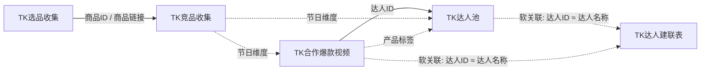

# 飞书五表结构与关联分析

更新时间：`2026-04-12`

## 1. 说明

本文基于以下 5 个飞书多维表视图的实时元数据与视图记录分析生成：

- `TK选品收集` `tblpF46y6SkmVCE5` `vewhXPD4x1`
- `TK竞品收集` `tblpzuTZXHtDq83t` `vewT6AtfED`
- `TK达人池` `tblwLYl59TkfVFLe` `vewuKd9i6D`
- `TK达人建联表` `tblpK4zCGaaL6h6v` `vewmMgDNV5`
- `TK合作爆款视频` `tblP9S5mRrirutDT` `vewu7vztKp`

分析方式：

- 使用飞书 Bitable Open API 拉取表列表、字段定义和指定视图记录。
- 关系分析以“当前视图中的实际数据重合”和“字段语义”共同判断。
- 本文不保存或展示 token。

重要结论先说：

1. 这 5 张表目前没有使用飞书原生“关联记录”字段，表间关系主要依赖文本、URL、单选/多选值做软关联。
2. `TK选品收集` 和 `TK竞品收集` 之间存在最强的商品级关联，当前视图中 5 个有 `商品ID` 的选品记录全部能在竞品表里找到对应 `SKU-ID`。
3. `TK合作爆款视频` 和 `TK达人池` 之间存在最强的达人级关联，主要通过 `达人ID` 对接，一个达人可对应多条爆款视频。
4. `TK达人建联表` 更像“外联执行台账”，和 `TK达人池` 的关系存在，但目前是弱关联，因为它没有独立的 `达人ID` 字段，只能拿 `达人名称` 去对齐。

## 2. 表概览

| 表名 | table_id | view_id | 当前视图记录数 | 核心角色 |
| --- | --- | --- | ---: | --- |
| `TK选品收集` | `tblpF46y6SkmVCE5` | `vewhXPD4x1` | 18 | 商品选品研究与素材沉淀 |
| `TK竞品收集` | `tblpzuTZXHtDq83t` | `vewT6AtfED` | 49 | TikTok/FastMoss 竞品运营主表 |
| `TK达人池` | `tblwLYl59TkfVFLe` | `vewuKd9i6D` | 81 | 达人画像池与合作沉淀 |
| `TK达人建联表` | `tblpK4zCGaaL6h6v` | `vewmMgDNV5` | 87 | 达人建联执行台账 |
| `TK合作爆款视频` | `tblP9S5mRrirutDT` | `vewu7vztKp` | 49 | 爆款视频案例库 |

## 3. 字段类型说明

本文字段类型来自飞书字段 `type`，按当前 5 张表中出现的类型映射如下：

| type | 说明 |
| ---: | --- |
| `1` | 文本 |
| `2` | 数字 |
| `3` | 单选 |
| `4` | 多选 |
| `5` | 日期 |
| `7` | 复选框 |
| `15` | 超链接 |
| `17` | 附件 |
| `20` | 公式 |
| `1005` | 自动编号 |

## 4. 表间逻辑关系

## 4.1 关系图



## 4.2 关系结论

| 上游表 | 下游表 | 关联字段 | 关系强度 | 结论 |
| --- | --- | --- | --- | --- |
| `TK选品收集` | `TK竞品收集` | `商品ID -> SKU-ID`，`商品链接 -> 产品链接`，`商品标题 -> 标题` | 高 | 这是同一批商品在“研究池”和“运营池”中的两种形态。当前视图中 5 个有 `商品ID` 的选品商品全部能在竞品表找到。 |
| `TK合作爆款视频` | `TK达人池` | `达人ID -> 达人ID` | 高 | 视频案例库中的达人账号可直接映射达人池，一个达人对应多条视频。当前视图中有 16 个达人账号直接重合。 |
| `TK达人池` | `TK达人建联表` | `达人ID ≈ 达人名称` | 中 | 存在业务关系，但不是硬关联。当前仅 8 个达人能精确重合，说明建联表覆盖范围更广，或命名规范不统一。 |
| `TK合作爆款视频` | `TK达人建联表` | `达人ID ≈ 达人名称`，`视频来源 / 视频链接` | 中低 | 能辅助判断某达人是否已进入建联流程，但当前不是稳定主键关系。 |
| `TK竞品收集` | `TK达人池` / `TK合作爆款视频` | `节日` | 中 | 三张表都在用“节日”作为分析维度，但选项集未完全统一。 |
| `TK合作爆款视频` | `TK达人池` | `产品` vs `出爆款视频产品` | 中 | 存在部分一致的产品标签，如 `棒棒糖`、`花积木`、`爱心石头`。但达人池字段混入了 `情人节Top1` 这类排行语义。 |
| `TK达人建联表` | 其他商品表 | `建联店铺` / `建联产品` | 低 | 当前值体系与商品主表不一致，难以直接用于可靠 join。 |

## 4.3 最可靠的主关联键

推荐把以下字段视为当前最可靠的业务键：

- 商品主键：
  - `TK选品收集.商品ID`
  - `TK竞品收集.SKU-ID`
  - `TikTok PDP URL` 中提取出的商品 ID
- 达人主键：
  - `TK达人池.达人ID`
  - `TK合作爆款视频.达人ID`
- 视频主键：
  - `TK合作爆款视频.视频码`

不建议直接当强键使用的字段：

- `TK达人建联表.达人名称`
- `TK达人建联表.建联产品`
- `TK达人建联表.建联店铺`
- `TK达人池.出爆款视频（>20w）or 成交件数>50 的产品`

原因是这些字段存在编码规则不统一、语义混合或人工填写差异。

## 5. 关键数据观察

## 5.1 商品链路

- `TK选品收集` 当前视图有 18 条记录，但只有 5 条记录有完整的 `商品ID / 店铺名称 / 商品标题 / 价格 / 评论数 / 评分`。
- 这 5 条商品在 `TK竞品收集` 中都能找到对应 `SKU-ID` 和同名标题。
- `TK选品收集` 中发现 1 条异常链接，`商品链接` 指向了飞书内部记录 URL，而不是 TikTok 商品页 URL。
- `TK竞品收集` 当前视图 49 条里：
  - 42 条是“正常可抓取商品”，已经有标题、卖家、截图、FastMoss 数据。
  - 7 条被标记为 `已下架/区域不可售`，且这 7 条没有标题等抓取结果。

这说明：

- `TK选品收集` 更像“选品/研究池”。
- `TK竞品收集` 是已经经过标准化与自动补全的竞品运营主表。

## 5.2 达人链路

- `TK达人池` 当前最实用的核心字段是：
  - `达人ID`
  - `跟我们合作过的节日`
  - `出爆款视频（>20w）or 成交件数>50 的产品`
- 很多其他画像字段目前为空或仅少量填写，例如：
  - `合作店铺`
  - `合作商品数`
  - `达人地址`
  - `达人电话`
- `TK合作爆款视频` 中有 47 条完整视频记录，达人账号与达人池存在明显交集，说明这张表可作为达人池的“爆款证据来源”。
- `TK达人建联表` 记录最完整，87 条记录几乎都有：
  - 建联时间
  - 达人名称
  - 粉丝数
  - 达人类型
  - 佣金
  - 建联店铺
  - 建联产品

这说明：

- `TK达人池` 偏“达人沉淀和标签库”。
- `TK达人建联表` 偏“执行层台账”。
- `TK合作爆款视频` 偏“内容证据库 / 爆款素材库”。

## 6. 各表字段说明

## 6.1 TK选品收集

定位：

- 商品研究池。
- 用于沉淀候选商品的 TikTok 链接、商品基础信息、图片和部分销量分析截图。

当前视图特征：

- 共 18 条记录。
- 其中只有少部分记录已经补齐商品详情，说明这张表存在“已研究商品”和“待整理素材”混合状态。

字段说明：

| 字段 | 类型 | 非空/18 | 说明 |
| --- | --- | ---: | --- |
| `文本` | 文本 | 7 | 辅助标记字段，当前值类似 `1`、`3`，更像临时分组或序号，不建议作为业务主键。 |
| `商品链接` | 文本 | 18 | 商品入口链接，理论上应为 TikTok PDP URL；当前发现 1 条飞书内部记录链接，建议清洗。 |
| `关键词` | 文本 | 0 | 预留的搜索关键词来源字段，当前视图未使用。 |
| `商品ID` | 文本 | 5 | TikTok 商品 ID，是本表最可靠的商品键。 |
| `店铺名称` | 文本 | 5 | 商品所属店铺名，当前已见值主要为 `Joyfy-US`。 |
| `商品标题` | 文本 | 5 | 商品标题，可与竞品表 `标题` 对齐。 |
| `商品当前价格` | 数字 | 5 | TikTok 商品当前售价。 |
| `商品评论数` | 数字 | 5 | 评论数量。 |
| `商品描述` | 文本 | 4 | 商品长描述，适合选品研判。 |
| `商品评分` | 数字 | 5 | 商品评分。 |
| `商品主图` | 附件 | 17 | 商品主图素材。 |
| `商品侧边栏图片` | 附件 | 5 | 商品侧边展示图，用于补充视觉信息。 |
| `出单种类占比截图` | 附件 | 1 | 订单结构分析截图。 |
| `今年总销量` | 数字 | 5 | 当前商品今年累计销量。 |
| `今年总销量趋势截图` | 附件 | 1 | 销量趋势图。 |
| `SKU销量占比分析` | 附件 | 1 | SKU 维度销量分析截图。 |
| `父体规格` | 文本 | 1 | 父体规格说明。 |
| `父体图片` | 附件 | 1 | 父体图。 |
| `差评整理` | 文本 | 0 | 预留给差评分析，当前未填。 |

与其他表的关系：

- 最强关联到 `TK竞品收集`。
- 推荐关联键：
  - `商品ID -> SKU-ID`
  - `商品链接 -> 产品链接`

## 6.2 TK竞品收集

定位：

- 竞品运营主表。
- 当前仓库中的自动化抓取逻辑与这张表高度一致，字段结构和代码中的默认 schema 基本匹配。

当前视图特征：

- 共 49 条记录。
- 42 条为正常商品。
- 7 条为 `已下架/区域不可售`。

字段说明：

| 字段 | 类型 | 非空/49 | 说明 |
| --- | --- | ---: | --- |
| `产品链接` | 超链接 | 49 | 标准化 TikTok 商品链接，是商品入口。 |
| `关键词` | 文本 | 1 | 搜索引入时的来源关键词，目前填充很少。 |
| `SKU-ID` | 文本 | 49 | 商品主键，等价于 TikTok 商品 ID。 |
| `图片` | 附件 | 42 | 商品主图。 |
| `标题` | 文本 | 42 | 商品标题。 |
| `节日` | 单选 | 42 | 商品归属节日，目前值有 `情人节`、`复活节`、`毕业季`。 |
| `卖家` | 文本 | 42 | 卖家名。 |
| `前台截图` | 附件 | 42 | TikTok 商品页截图。 |
| `价格` | 文本 | 42 | TikTok 商品价格。 |
| `Fastmoss价格` | 文本 | 42 | FastMoss 详情页价格。 |
| `Fastmoss截图` | 附件 | 42 | FastMoss 详情截图。 |
| `昨日销量` | 文本 | 42 | 昨日销量。 |
| `近7天销量` | 文本 | 42 | 近 7 天销量。 |
| `近90天销量` | 文本 | 42 | 近 90 天销量。 |
| `记录日期` | 日期 | 42 | 本次自动写回的记录日期。 |
| `备注` | 文本 | 30 | 人工备注或阶段标签，如 `情人节Top1`。 |
| `开售时间` | 文本 | 21 | 人工维护的开售时间。 |
| `第一波高峰期` | 文本 | 21 | 人工维护的第一波销售高峰。 |
| `第二波高峰期` | 文本 | 18 | 人工维护的第二波销售高峰。 |
| `价格趋势` | 附件 | 8 | 价格变化截图。 |
| `商品状态` | 文本 | 7 | 系统状态字段，目前为 `已下架/区域不可售`。 |

与其他表的关系：

- 与 `TK选品收集` 通过商品 ID / URL 强关联。
- 可通过 `节日` 与达人相关表做分析维度关联。

## 6.3 TK达人池

定位：

- 达人沉淀池。
- 更像“达人标签库 + 历史表现库”，而不是执行台账。

当前视图特征：

- 共 81 条记录。
- 最有信息量的字段是：
  - `达人ID`
  - `跟我们合作过的节日`
  - `出爆款视频（>20w）or 成交件数>50 的产品`
- 大量画像字段当前仍较稀疏。

字段说明：

| 字段 | 类型 | 非空/81 | 说明 |
| --- | --- | ---: | --- |
| `达人ID` | 文本 | 79 | 达人账号主键，是本表最可靠的 join 键。 |
| `带货商品图` | 附件 | 1 | 达人带货商品图，当前仅少量样本。 |
| `关联节日` | 多选 | 1 | 某个具体达人的当前关联节日标签，当前填充很少。 |
| `关联商品销量` | 文本 | 1 | 某个关联商品的销量说明。 |
| `达人头像` | 附件 | 1 | 达人头像素材。 |
| `粉丝数` | 文本 | 1 | 达人粉丝数。 |
| `28天视频数` | 文本 | 1 | 近 28 天发视频数量。 |
| `带货视频 GMV` | 文本 | 1 | 达人视频带货 GMV。 |
| `带货直播 GMV` | 文本 | 1 | 达人直播带货 GMV。 |
| `合作店铺` | 多选 | 0 | 预留给合作店铺标签，当前视图为空。 |
| `合作商品数` | 文本 | 0 | 预留给合作商品统计，当前视图为空。 |
| `达人联系方式` | 文本 | 1 | 联系方式或跳转链接。 |
| `检查达人名称是否重复` | 公式 | 81 | 自动判重字段，当前大多返回 `唯一`。 |
| `记录时间` | 日期 | 2 | 记录创建或入池日期。 |
| `跟我们合作过的节日` | 多选 | 78 | 历史合作节日标签。 |
| `出爆款视频（>20w）or 成交件数>50 的产品` | 多选 | 78 | 达人产出过爆款的视频对应产品标签。 |
| `毕业季建联` | 复选框 | 4 | 是否已进入毕业季建联。 |
| `达人地址` | 文本 | 0 | 预留字段，当前为空。 |
| `达人电话` | 文本 | 0 | 预留字段，当前为空。 |

与其他表的关系：

- 与 `TK合作爆款视频` 通过 `达人ID` 强关联。
- 与 `TK达人建联表` 可通过 `达人ID ≈ 达人名称` 做弱关联。

## 6.4 TK达人建联表

定位：

- 达人外联执行台账。
- 记录与达人沟通、佣金、店铺、建联产品、履约情况等执行信息。

当前视图特征：

- 共 87 条记录。
- 字段完整度高，是当前达人侧最“运营执行化”的表。

字段说明：

| 字段 | 类型 | 非空/87 | 说明 |
| --- | --- | ---: | --- |
| `序号` | 自动编号 | 87 | 自动递增编号。 |
| `建联时间` | 日期 | 87 | 建联日期。 |
| `达人名称` | 文本 | 87 | 达人名称或达人账号，是当前与达人池做弱关联的唯一字段。 |
| `粉丝数` | 文本 | 87 | 达人粉丝量级。 |
| `达人类型` | 单选 | 87 | 达人来源分类，如 `竞品达人`、`爆款达人`、`自申请达人`。 |
| `佣金` | 数字 | 87 | 佣金比例。 |
| `视频链接` | 文本 | 28 | 达人已发布视频链接。 |
| `发视频时间` | 文本 | 30 | 发布状态或时间，如 `未履约`、`3.24`。 |
| `建联店铺` | 单选 | 87 | 建联所对应的店铺，目前值有 `Magpiee`、`Zidmo`。 |
| `建联产品` | 单选 | 87 | 建联所对应产品编码，目前值有 `2026`、`GRAD蓝`、`GRAD金`。 |

与其他表的关系：

- 与 `TK达人池` 之间目前没有硬键。
- 如果后续希望稳定打通达人侧链路，建议新增 `达人ID` 字段并强制规范。

## 6.5 TK合作爆款视频

定位：

- 爆款视频案例库。
- 保存达人账号、视频链接、视频码、节日、产品标签、FastMoss 跳转链接等。

当前视图特征：

- 共 49 条记录。
- 其中 47 条记录是完整样本。

字段说明：

| 字段 | 类型 | 非空/49 | 说明 |
| --- | --- | ---: | --- |
| `视频来源` | 超链接 | 47 | TikTok 视频链接。 |
| `视频码` | 文本 | 47 | TikTok 视频 ID，是本表最可靠的视频主键。 |
| `Fastmoss访问链接` | 文本 | 47 | 对应视频在 FastMoss 的访问链接。 |
| `节日` | 单选 | 47 | 视频所属节日，目前值有 `情人节`、`万圣节`。 |
| `产品` | 单选 | 47 | 视频主打产品标签，如 `花积木`、`棒棒糖`、`爱心石头`。 |
| `达人ID` | 文本 | 47 | 发布视频的达人账号，可与达人池对接。 |
| `视频发布的日期` | 文本 | 47 | 视频发布日期。 |
| `视频播放量-AI` | 文本 | 47 | 播放量文本，疑似 AI 识别或整理后的指标。 |
| `备注` | 文本 | 3 | 补充说明，如 `AI视频`、`某达人小号`。 |

与其他表的关系：

- 与 `TK达人池` 是最直接的一对多关系。
- 也可为 `TK达人建联表` 提供“是否值得联系”的外部证据。

## 7. 当前关系的结构化结论

可以把这 5 张表理解成两条主链路：

### 7.1 商品链路

```text
TK选品收集
-> 挑选候选商品
-> 进入 TK竞品收集
-> 补齐 TikTok / FastMoss 数据
-> 供运营分析与人工判断
```

这条链路中：

- `TK选品收集` 偏研究。
- `TK竞品收集` 偏正式运营与自动更新。

### 7.2 达人链路

```text
TK合作爆款视频
-> 提供爆款达人与案例
-> 沉淀到 TK达人池
-> 进入 TK达人建联表做外联执行
```

这条链路中：

- `TK合作爆款视频` 偏内容证据。
- `TK达人池` 偏达人标签沉淀。
- `TK达人建联表` 偏执行台账。

## 8. 数据设计问题与建议

基于当前字段和数据分布，建议优先做这 5 件事：

1. 给 `TK达人建联表` 增加 `达人ID`
   - 这样可以和 `TK达人池`、`TK合作爆款视频` 建立稳定主键关系。

2. 统一产品维度编码
   - 目前存在：
     - `SKU-ID`
     - `商品ID`
     - `产品`
     - `建联产品`
     - `出爆款视频产品`
   - 其中 `建联产品` 还是一套编码值，无法直接与商品表 join。

3. 统一节日枚举
   - 商品表、达人池、爆款视频表都在用节日，但选项集合不完全一致。

4. 统一店铺命名
   - 例如商品表中出现 `Joyfy-US` 与 `JOYIN` 这类不同命名体系。
   - 若后续要做“店铺 -> 商品 -> 达人 -> 视频”分析，建议引入标准店铺维度表。

5. 考虑引入飞书原生关联字段
   - 当前全部是软关联，查询和维护成本都高。
   - 如果业务会长期扩展，建议至少把以下关系改成显式关联：
     - 商品研究表 -> 竞品主表
     - 爆款视频表 -> 达人池
     - 达人池 -> 建联表

## 9. 一句话总结

这 5 张表当前已经形成了“商品研究/竞品运营”和“达人沉淀/建联执行/爆款案例”两条业务链，但目前仍主要依赖文本字段做软关联；如果后续要做更稳定的自动化分析，最先应该规范的是 `商品主键`、`达人主键`、`节日枚举` 和 `产品编码体系`。
