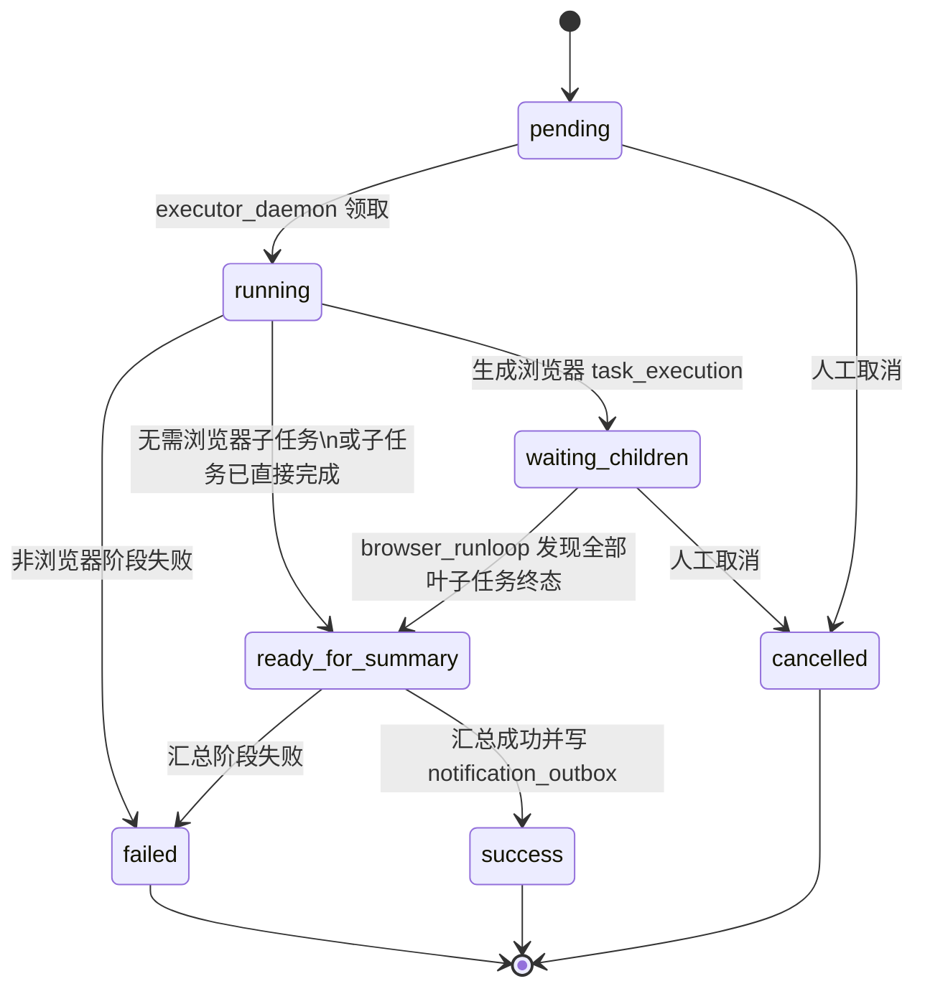
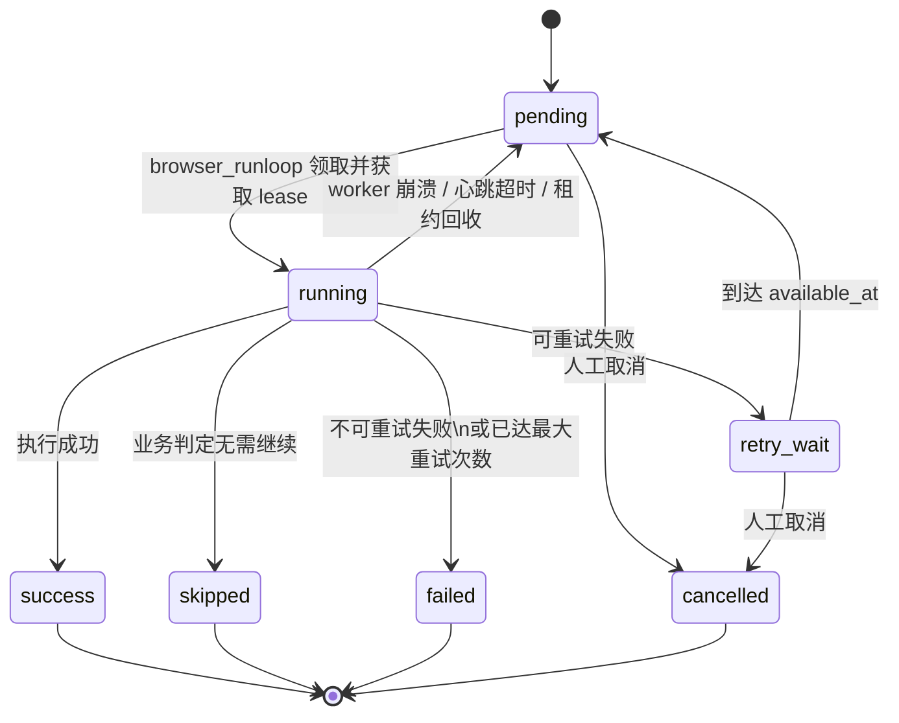
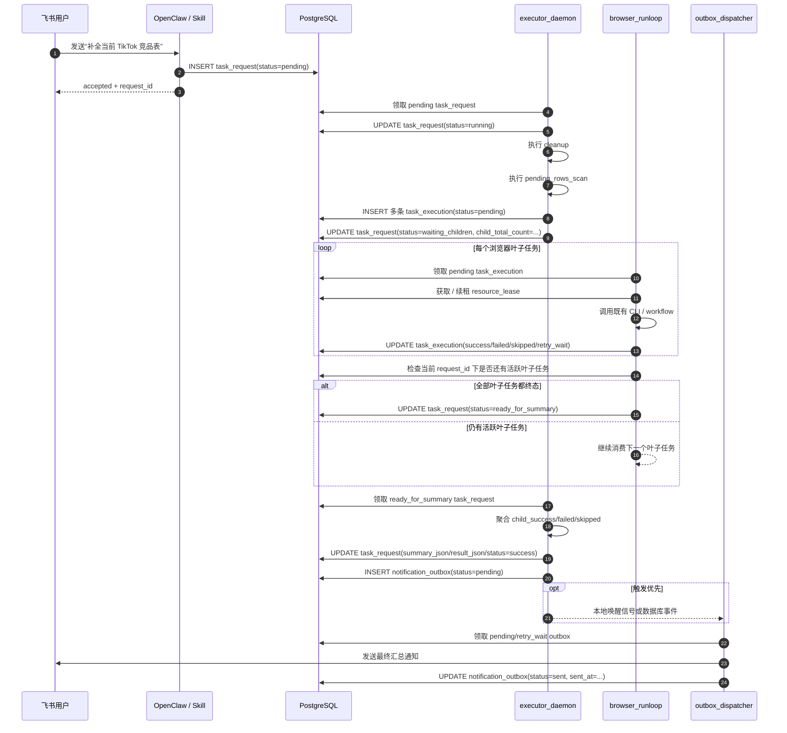

# 系统升级状态流转图与进程交互时序图

更新时间：`2026-04-13`

本文只回答两个问题：

1. 顶层任务与叶子任务在运行时怎么做状态流转
2. `executor_daemon`、`browser_runloop`、`outbox_dispatcher` 最终以什么形态运行和交互

主方案中的详细边界说明仍以 [12-系统架构升级方案](/Users/happyzhao/Work/mujitask-wt-system-architecture-upgrade/docs/business/12-系统架构升级方案.md:1) 为准；本文只给出更直观的图和落地口径。

## 1. 运行时形态

### 1.1 推荐部署形态

| 组件 | 是否独立常驻进程 | 推荐入口形态 | 是否可同机部署 | 是否共享进程内状态 |
| --- | --- | --- | --- | --- |
| `OpenClaw` 入口层 | 否，通常依附在 OpenClaw gateway / agent 内 | OpenClaw 自身进程 | 是 | 否 |
| `executor_daemon` | 是 | `python -m ... executor_daemon` | 是 | 否 |
| `browser_runloop` | 是 | `python -m ... browser_runloop` | 是 | 否 |
| `outbox_dispatcher` | 是 | `python -m ... outbox_dispatcher` | 是 | 否 |

推荐语义是：

- 同一个代码仓库
- 同一套数据库
- 3 个独立 worker 角色
- 可以先部署在同一台机器上
- 后续如果压力上来，可以再拆到多台机器

开发环境可以临时提供“一键启动 3 个 worker”的脚本，但那只是启动方式，不改变它们在架构上的独立角色。

### 1.2 协作原则

三者之间的协作原则只有两条：

- 数据库状态是唯一真源
- 触发事件只做加速，不做真源

所以：

- 不能靠进程内 callback / future 串起后续步骤
- 可以用本地唤醒事件或 Postgres `LISTEN / NOTIFY` 做加速
- 即使事件丢失，系统也必须还能靠数据库状态收敛

## 2. 顶层任务状态流转图

这里的顶层任务是 `task_request`。

### 2.1 状态说明

| 状态 | 含义 | 谁推进到这个状态 |
| --- | --- | --- |
| `pending` | 顶层任务已创建，尚未被执行器领取 | `OpenClaw` 入口层 |
| `running` | 执行器正在推进确定性阶段 | `executor_daemon` |
| `waiting_children` | 当前只差浏览器叶子任务收敛 | `executor_daemon` |
| `ready_for_summary` | 父任务已具备继续汇总条件 | `browser_runloop` 或 `executor_daemon` |
| `success` | 顶层任务完成，汇总已写出 | `executor_daemon` |
| `failed` | 顶层任务终态失败 | `executor_daemon` |
| `cancelled` | 人工或系统取消 | 管理操作或 `executor_daemon` |

### 2.2 关键约束

- `executor_daemon` 不在内存里等待某个父任务的全部子任务完成。
- 父任务一旦进入 `waiting_children`，`executor_daemon` 就应立即让出，继续处理别的可推进任务。
- 父任务之所以能继续，不是因为收到了某个 callback，而是因为数据库里已经被推进到 `ready_for_summary`。

## 3. 叶子任务状态流转图

这里的叶子任务是 `task_execution`，主要承接浏览器相关步骤。

### 3.1 状态说明

| 状态 | 含义 | 谁推进到这个状态 |
| --- | --- | --- |
| `pending` | 可执行、待领取 | `executor_daemon` 或恢复逻辑 |
| `running` | 已被 `browser_runloop` 领取并开始执行 | `browser_runloop` |
| `retry_wait` | 失败但允许重试，等待下一次可领取时间 | `browser_runloop` |
| `success` | 成功完成 | `browser_runloop` |
| `skipped` | 业务上判定跳过 | `browser_runloop` |
| `failed` | 最终失败 | `browser_runloop` |
| `cancelled` | 被人工或系统取消 | 管理操作 |

### 3.2 活跃态定义

活跃态固定为：

- `pending`
- `running`
- `retry_wait`

相同 `dedupe_key` 的叶子任务在活跃态下不能重复插入。

## 4. 进程交互时序图

下面用 demo 任务 `refresh_current_competitor_table` 来展示一次完整闭环。

## 5. 为什么不是“同一个进程一路跑完”

如果把 `executor_daemon`、浏览器消费和通知发送都塞进一个进程，短期会省事，但长期会遇到这几个问题：

- 一个长批次浏览器任务会卡住顶层任务推进
- 浏览器异常会把汇总和通知阶段一起拖住
- 进程重启后很难恢复“我到底卡在等待哪个子任务”
- 通知发送失败会反向污染业务执行状态

所以这里推荐的是：

- 逻辑上一个系统
- 运行上三个独立 worker
- 状态上只信数据库

## 6. 触发式和定时器的关系

这里不是二选一，而是两层机制：

### 6.1 正常路径

- 子任务完成时，`browser_runloop` 在写库时顺手推进父任务状态
- 写出新的 `notification_outbox` 时，允许顺手发唤醒信号

这属于触发式推进。

### 6.2 补偿路径

- `executor_daemon` 仍然可以周期性领取 `pending / running / ready_for_summary`
- `outbox_dispatcher` 仍然可以周期性扫描 `pending / retry_wait`

这属于补偿式扫描。

一句话说：

- 正常靠状态推进和触发式加速
- 兜底靠扫描恢复

## 7. 当前实现与目标形态的差距

目标形态已经在本文冻结为：

- `executor_daemon`
- `browser_runloop`
- `outbox_dispatcher`

当前代码里真正完整落地的还是 Phase 1 前半段，后续实现需要按本文把：

- 顶层 `task_request.status` 状态机
- `ready_for_summary` 推进逻辑
- `notification_outbox`
- 独立 `browser_runloop`

继续收完。
