# 事实数据库 ERD 与表结构设计

更新时间：`2026-04-21`

本文档已按当前代码中实际创建的事实数据库表结构对齐。当前事实源为：

- [tk_fact_store.py](/Users/happyzhao/Work/mujitask/src/automation_business_scaffold/infrastructure/facts/tk_fact_store.py) 中的 `TK_FACT_SCHEMA_STATEMENTS`
- [20260421_0002_tk_fact_database.py](/Users/happyzhao/Work/mujitask/alembic/versions/20260421_0002_tk_fact_database.py) 中的 Alembic migration

本阶段采用明确的 TK 业务主体模型，不再兼容旧的 `entity_registry / external_binding / entity_snapshot` 通用实体层。`tk_raw_api_responses / tk_raw_entity_links` 只承担原始接口审计职责，不是主体主档。

相关依据：

- [18-TK综合数据表设计.md](./18-TK综合数据表设计.md)
- [19-FastMoss四主体接口与关系设计.md](./19-FastMoss四主体接口与关系设计.md)
- [fastmoss已知接口.md](./fastmoss已知接口.md)
- [fastmoss可视化分析.md](./fastmoss可视化分析.md)

## 1. 设计依据

### 1.1 四类主体必须拆成主档和关系

此前通过 Roxy 打开 FastMoss 商品、达人、视频、店铺四个详情页，已验证四类主体之间存在交叉关系：

| 主体 | 样例 ID | 关系依据 |
| --- | --- | --- |
| 商品 | `1732183068040729370` | 商品页 `/api/goods/v3/base` 返回商品和店铺；商品页 `/api/goods/v3/video` 返回关联视频和达人 |
| 店铺 | `7496166867916327706` | 商品页 `data.shop.seller_id` 与店铺页 `/api/shop/v3/base` 一致 |
| 达人 | `7094679250578015274` | 商品页 `/api/goods/v3/author`、视频页 `/api/video/overview`、达人页 `/api/author/v3/detail/*` 均返回同一达人 |
| 视频 | `7623147954093690143` | 商品页、视频页、达人页都能交叉验证视频带货商品、作者达人和销售表现 |

真实样例中：

- 视频 `7623147954093690143` 由达人 `7094679250578015274` 发布。
- 视频 `7623147954093690143` 带货商品 `1732183068040729370`。
- 该视频对该商品贡献销量 `174`，GMV `$2421.05`。
- 商品 `1732183068040729370` 归属店铺 `7496166867916327706`。

因此当前 schema 使用 `tk_products / tk_shops / tk_creators / tk_videos` 承载主体，使用关系表承接商品、店铺、达人、视频之间的多对多关系。

### 1.2 TikTok PDP 和 FastMoss 的职责边界

TikTok PDP 适合低频补齐商品基础信息和图片/SKU：

| 数据 | TikTok PDP HTML 路径 |
| --- | --- |
| 商品 ID | `product_model.product_id` |
| 店铺 ID | `product_model.seller_id` |
| 商品标题 | `product_model.name` |
| 商品主图 / 侧边栏图 | `product_model.images[]` |
| SKU 列表 | `product_model.skus[]` |
| SKU 规格 | `skus[].property_pairs[]` |
| SKU 库存 | `skus[].sku_quantity.available_quantity` |
| 规格维度和值 | `product_model.sale_properties[]` |
| 商品评分 | `review_model.product_overall_score` |
| 商品评论数 | `review_model.product_review_count` |

FastMoss 适合承载分析口径：

| 分析需求 | 推荐接口 |
| --- | --- |
| 商品 7/28/90 天销量、GMV、每日趋势 | `/api/goods/v3/overview` |
| 成交渠道/内容/投放占比 | `/api/goods/v3/overview` |
| SKU 销量/GMV/库存占比 | `/api/goods/v3/productSku` |
| 商品关联视频排行 | `/api/goods/v3/video` |
| 商品关联达人排行 | `/api/goods/v3/author` |
| 视频基础信息和挂载商品 | `/api/video/overview`、`/api/video/v2/goods` |
| 达人基础、带货、趋势 | `/api/author/v3/detail/*` |
| 店铺基础、商品、达人、趋势 | `/api/shop/v3/*` |

### 1.3 当前阶段的边界

当前阶段已经建表并接入主体、素材、关系、raw 审计写入能力。快照/窗口表已预建，但现有业务流程暂不写入销量快照、窗口快照、节日复盘快照，也暂不开发数据库到飞书的新业务映射。

## 2. 设计原则

### 2.1 数据库是事实源，飞书是业务视图

数据库负责：

- 原始接口响应留存。
- 主体去重。
- 主体关系索引。
- 素材索引。
- 后续快照和窗口数据沉淀。

飞书负责：

- 竞品池。
- 达人建联。
- 人工备注。
- 复盘结论。
- 负责人和跟进状态。
- 业务看板和轻量可视化。

### 2.2 主档只保留当前最新稳定属性

`tk_products / tk_shops / tk_creators / tk_videos / tk_product_skus` 保存去重后的主体当前状态。接口里大量易变、来源差异大或暂未建模的字段进入 `facts_json`。

### 2.3 关系表只表达事实关系，不承担业务准入

采集筛选由业务流程决定，例如“销量大于 50、粉丝数大于 5000”。Mapper 只把已接受的接口数据转成事实 bundle，`TKFactIngestionService` 只负责幂等写入主体、素材、关系和 raw 审计。

### 2.4 快照表已预建，但写入策略后置

当前已创建日粒度、窗口 latest、窗口 observation、SKU 窗口、分布窗口、视频商品窗口、达人商品窗口表。是否写入快照、以什么频率写入、哪些窗口需要保留，由后续独立业务接口控制。

### 2.5 当前类型约定

| 类型 | 当前用途 |
| --- | --- |
| `TEXT` | 主键、外部 ID、URL、标题、枚举值、JSON 字符串、业务日期 |
| `REAL` | epoch seconds 时间戳、销量/金额/库存等可为小数的数值 |
| `INTEGER` | 状态码、窗口天数、布尔标记 |

当前 schema 为 SQLite 和 Postgres 部署保持一致，JSON 字段统一用 `TEXT` 存 JSON 字符串；业务日期统一用 `YYYY-MM-DD` 文本；采集时间统一用 epoch seconds `REAL`。当前表没有声明数据库外键，关系一致性由业务 key、唯一键和 upsert 逻辑保证。

## 3. 当前总体 ERD

```mermaid
erDiagram
    tk_products ||--o{ tk_product_skus : has
    tk_products ||--o{ tk_product_shop_relations : belongs_to
    tk_shops ||--o{ tk_product_shop_relations : owns

    tk_creators ||--o{ tk_creator_product_relations : promotes
    tk_products ||--o{ tk_creator_product_relations : promoted_by

    tk_creators ||--o{ tk_creator_video_relations : publishes
    tk_videos ||--o{ tk_creator_video_relations : authored_by

    tk_videos ||--o{ tk_video_product_relations : carries
    tk_products ||--o{ tk_video_product_relations : mounted_on

    tk_shops ||--o{ tk_shop_creator_relations : works_with
    tk_creators ||--o{ tk_shop_creator_relations : contributes

    tk_media_assets ||--o{ tk_entity_media_assets : linked_to
    tk_raw_api_responses ||--o{ tk_raw_entity_links : yields

    tk_products ||--o{ tk_product_daily_metrics : has
    tk_products ||--o{ tk_product_window_latest : has_latest_window
    tk_products ||--o{ tk_product_window_observations : has_window_history
    tk_products ||--o{ tk_product_distribution_window_latest : has_latest_distribution
    tk_products ||--o{ tk_product_distribution_window_observations : has_distribution_history
    tk_products ||--o{ tk_product_sku_window_latest : has_latest_sku_window
    tk_products ||--o{ tk_product_sku_window_observations : has_sku_window_history
    tk_videos ||--o{ tk_video_product_window_performance : sells
    tk_creators ||--o{ tk_creator_product_window_performance : sells
```



## 4. 当前已创建表分层

| 层 | 当前已创建表 | 作用 |
| --- | --- | --- |
| 主体主档层 | `tk_products`, `tk_product_skus`, `tk_shops`, `tk_creators`, `tk_videos` | 去重后的商品、SKU、店铺、达人、视频 |
| 素材层 | `tk_media_assets`, `tk_entity_media_assets` | 统一保存图片、头像、封面、截图等素材索引，并关联到主体 |
| 关系层 | `tk_product_shop_relations`, `tk_creator_product_relations`, `tk_creator_video_relations`, `tk_video_product_relations`, `tk_shop_creator_relations` | 主体之间的事实关系 |
| Raw 审计层 | `tk_raw_api_responses`, `tk_raw_entity_links` | 原始接口响应和响应中命中的主体 |
| 快照/窗口预建层 | `tk_product_daily_metrics`, `tk_product_window_latest`, `tk_product_window_observations`, `tk_product_distribution_window_latest`, `tk_product_distribution_window_observations`, `tk_product_sku_window_latest`, `tk_product_sku_window_observations`, `tk_video_product_window_performance`, `tk_creator_product_window_performance` | 预留给后续快照写入策略 |

未在当前 schema 中创建的旧文档表名包括：`products`, `shops`, `creators`, `videos`, `product_snapshots`, `product_distribution_snapshots`, `product_sku_snapshots`, `fact_video_product_performance`, `fact_creator_product_performance`, `feishu_records`, `feishu_sync_events`, `creator_outreach_records`, `collaboration_videos`。这些名称不应再作为当前实现依据。

## 5. 主体主档表

### 5.1 `tk_products`

商品主档，一行一个 TikTok/FastMoss 商品。

| 字段 | 类型 | 约束/默认 | 说明 |
| --- | --- | --- | --- |
| `id` | `TEXT` | PK | 内部 UUID |
| `product_id` | `TEXT` | UNIQUE NOT NULL | 商品外部 ID |
| `product_url` | `TEXT` | NOT NULL DEFAULT `''` | 商品链接 |
| `normalized_url` | `TEXT` | NOT NULL DEFAULT `''` | 归一化链接 |
| `title` | `TEXT` | NOT NULL DEFAULT `''` | 商品标题 |
| `holiday` | `TEXT` | NOT NULL DEFAULT `''` | 节日标签 |
| `seller_name` | `TEXT` | NOT NULL DEFAULT `''` | 卖家名称 |
| `platform` | `TEXT` | NOT NULL DEFAULT `'tiktok'` | 平台 |
| `country_region` | `TEXT` | NOT NULL DEFAULT `''` | 国家/地区 |
| `source_platform` | `TEXT` | NOT NULL DEFAULT `''` | 来源平台 |
| `status` | `TEXT` | NOT NULL DEFAULT `'active'` | 主体状态 |
| `facts_json` | `TEXT` | NOT NULL DEFAULT `'{}'` | 扩展事实 JSON |
| `first_seen_at` | `REAL` | NOT NULL | 首次出现时间 |
| `last_seen_at` | `REAL` | NOT NULL | 最近出现时间 |
| `created_at` | `REAL` | NOT NULL | 创建时间 |
| `updated_at` | `REAL` | NOT NULL | 更新时间 |

索引：`idx_tk_products_last_seen_at(last_seen_at)`。

### 5.2 `tk_product_skus`

商品 SKU 主档，一行一个商品规格。

| 字段 | 类型 | 约束/默认 | 说明 |
| --- | --- | --- | --- |
| `id` | `TEXT` | PK | 内部 UUID |
| `sku_key` | `TEXT` | UNIQUE NOT NULL | SKU 幂等 key |
| `product_id` | `TEXT` | NOT NULL | 商品外部 ID |
| `sku_id` | `TEXT` | NOT NULL DEFAULT `''` | SKU 外部 ID |
| `sku_name` | `TEXT` | NOT NULL DEFAULT `''` | SKU 名称 |
| `spec_name` | `TEXT` | NOT NULL DEFAULT `''` | 规格名/规格展示 |
| `price_text` | `TEXT` | NOT NULL DEFAULT `''` | 价格文本 |
| `stock_count` | `REAL` | NOT NULL DEFAULT `0` | 库存 |
| `facts_json` | `TEXT` | NOT NULL DEFAULT `'{}'` | 扩展事实 JSON |
| `first_seen_at` | `REAL` | NOT NULL | 首次出现时间 |
| `last_seen_at` | `REAL` | NOT NULL | 最近出现时间 |
| `created_at` | `REAL` | NOT NULL | 创建时间 |
| `updated_at` | `REAL` | NOT NULL | 更新时间 |

索引：`idx_tk_product_skus_product_id(product_id)`。

### 5.3 `tk_shops`

店铺主档，一行一个 TikTok Shop/FastMoss 店铺。

| 字段 | 类型 | 约束/默认 | 说明 |
| --- | --- | --- | --- |
| `id` | `TEXT` | PK | 内部 UUID |
| `shop_key` | `TEXT` | UNIQUE NOT NULL | 店铺幂等 key |
| `shop_id` | `TEXT` | NOT NULL DEFAULT `''` | 店铺外部 ID |
| `shop_name` | `TEXT` | NOT NULL DEFAULT `''` | 店铺名称 |
| `shop_url` | `TEXT` | NOT NULL DEFAULT `''` | 店铺链接 |
| `platform` | `TEXT` | NOT NULL DEFAULT `'tiktok'` | 平台 |
| `country_region` | `TEXT` | NOT NULL DEFAULT `''` | 国家/地区 |
| `source_platform` | `TEXT` | NOT NULL DEFAULT `''` | 来源平台 |
| `status` | `TEXT` | NOT NULL DEFAULT `'active'` | 主体状态 |
| `facts_json` | `TEXT` | NOT NULL DEFAULT `'{}'` | 扩展事实 JSON |
| `first_seen_at` | `REAL` | NOT NULL | 首次出现时间 |
| `last_seen_at` | `REAL` | NOT NULL | 最近出现时间 |
| `created_at` | `REAL` | NOT NULL | 创建时间 |
| `updated_at` | `REAL` | NOT NULL | 更新时间 |

索引：`idx_tk_shops_shop_name(shop_name)`。

### 5.4 `tk_creators`

达人主档，一行一个达人。

| 字段 | 类型 | 约束/默认 | 说明 |
| --- | --- | --- | --- |
| `id` | `TEXT` | PK | 内部 UUID |
| `creator_key` | `TEXT` | UNIQUE NOT NULL | 达人幂等 key |
| `creator_id` | `TEXT` | NOT NULL DEFAULT `''` | 达人外部 ID |
| `uid` | `TEXT` | NOT NULL DEFAULT `''` | TikTok/FastMoss UID |
| `unique_id` | `TEXT` | NOT NULL DEFAULT `''` | 账号名 |
| `nickname` | `TEXT` | NOT NULL DEFAULT `''` | 昵称 |
| `profile_url` | `TEXT` | NOT NULL DEFAULT `''` | 主页链接 |
| `platform` | `TEXT` | NOT NULL DEFAULT `'tiktok'` | 平台 |
| `country_region` | `TEXT` | NOT NULL DEFAULT `''` | 国家/地区 |
| `source_platform` | `TEXT` | NOT NULL DEFAULT `''` | 来源平台 |
| `status` | `TEXT` | NOT NULL DEFAULT `'active'` | 主体状态 |
| `facts_json` | `TEXT` | NOT NULL DEFAULT `'{}'` | 扩展事实 JSON |
| `first_seen_at` | `REAL` | NOT NULL | 首次出现时间 |
| `last_seen_at` | `REAL` | NOT NULL | 最近出现时间 |
| `created_at` | `REAL` | NOT NULL | 创建时间 |
| `updated_at` | `REAL` | NOT NULL | 更新时间 |

索引：`idx_tk_creators_unique_id(unique_id)`。

### 5.5 `tk_videos`

视频主档，一行一个视频。

| 字段 | 类型 | 约束/默认 | 说明 |
| --- | --- | --- | --- |
| `id` | `TEXT` | PK | 内部 UUID |
| `video_key` | `TEXT` | UNIQUE NOT NULL | 视频幂等 key |
| `video_id` | `TEXT` | NOT NULL DEFAULT `''` | 视频外部 ID |
| `creator_key` | `TEXT` | NOT NULL DEFAULT `''` | 作者达人 key |
| `product_id` | `TEXT` | NOT NULL DEFAULT `''` | 关联商品 ID |
| `title` | `TEXT` | NOT NULL DEFAULT `''` | 视频标题/文案摘要 |
| `video_url` | `TEXT` | NOT NULL DEFAULT `''` | 视频链接 |
| `cover_url` | `TEXT` | NOT NULL DEFAULT `''` | 封面链接 |
| `platform` | `TEXT` | NOT NULL DEFAULT `'tiktok'` | 平台 |
| `source_platform` | `TEXT` | NOT NULL DEFAULT `''` | 来源平台 |
| `status` | `TEXT` | NOT NULL DEFAULT `'active'` | 主体状态 |
| `facts_json` | `TEXT` | NOT NULL DEFAULT `'{}'` | 扩展事实 JSON |
| `first_seen_at` | `REAL` | NOT NULL | 首次出现时间 |
| `last_seen_at` | `REAL` | NOT NULL | 最近出现时间 |
| `created_at` | `REAL` | NOT NULL | 创建时间 |
| `updated_at` | `REAL` | NOT NULL | 更新时间 |

索引：`idx_tk_videos_creator_key(creator_key)`、`idx_tk_videos_product_id(product_id)`。

## 6. 素材表

### 6.1 `tk_media_assets`

统一素材主档，保存图片、头像、封面、截图等素材索引。

| 字段 | 类型 | 约束/默认 | 说明 |
| --- | --- | --- | --- |
| `asset_id` | `TEXT` | PK | 素材 UUID |
| `asset_key` | `TEXT` | UNIQUE NOT NULL | 素材幂等 key |
| `source_url` | `TEXT` | NOT NULL DEFAULT `''` | 原始 URL |
| `file_token` | `TEXT` | NOT NULL DEFAULT `''` | 飞书附件 file token |
| `local_path` | `TEXT` | NOT NULL DEFAULT `''` | 本地文件路径 |
| `object_key` | `TEXT` | NOT NULL DEFAULT `''` | 对象存储 key |
| `file_name` | `TEXT` | NOT NULL DEFAULT `''` | 文件名 |
| `mime_type` | `TEXT` | NOT NULL DEFAULT `''` | MIME 类型 |
| `source_platform` | `TEXT` | NOT NULL DEFAULT `''` | 来源平台 |
| `metadata_json` | `TEXT` | NOT NULL DEFAULT `'{}'` | 元数据 JSON |
| `first_seen_at` | `REAL` | NOT NULL | 首次出现时间 |
| `last_seen_at` | `REAL` | NOT NULL | 最近出现时间 |
| `created_at` | `REAL` | NOT NULL | 创建时间 |
| `updated_at` | `REAL` | NOT NULL | 更新时间 |

### 6.2 `tk_entity_media_assets`

主体与素材的关联表。

| 字段 | 类型 | 约束/默认 | 说明 |
| --- | --- | --- | --- |
| `link_id` | `TEXT` | PK | 关联 UUID |
| `relation_key` | `TEXT` | UNIQUE NOT NULL | 关联幂等 key |
| `entity_type` | `TEXT` | NOT NULL | 主体类型，如 product/shop/creator/video |
| `entity_external_id` | `TEXT` | NOT NULL | 主体外部 ID |
| `asset_id` | `TEXT` | NOT NULL | 素材 ID |
| `media_role` | `TEXT` | NOT NULL DEFAULT `''` | 素材角色，如 main_image/avatar/cover/screenshot |
| `metadata_json` | `TEXT` | NOT NULL DEFAULT `'{}'` | 元数据 JSON |
| `first_seen_at` | `REAL` | NOT NULL | 首次出现时间 |
| `last_seen_at` | `REAL` | NOT NULL | 最近出现时间 |
| `created_at` | `REAL` | NOT NULL | 创建时间 |
| `updated_at` | `REAL` | NOT NULL | 更新时间 |

索引：`idx_tk_entity_media_assets_entity(entity_type, entity_external_id)`。

## 7. 关系表

### 7.1 `tk_product_shop_relations`

商品与店铺的关系。当前默认一个商品主店铺唯一，但关系表保留未来多店铺能力。

| 字段 | 类型 | 约束/默认 | 说明 |
| --- | --- | --- | --- |
| `relation_id` | `TEXT` | PK | 关系 UUID |
| `relation_key` | `TEXT` | UNIQUE NOT NULL | 关系幂等 key |
| `product_id` | `TEXT` | NOT NULL | 商品 ID |
| `shop_key` | `TEXT` | NOT NULL | 店铺 key |
| `shop_id` | `TEXT` | NOT NULL DEFAULT `''` | 店铺外部 ID |
| `shop_name` | `TEXT` | NOT NULL DEFAULT `''` | 店铺名称 |
| `relation_role` | `TEXT` | NOT NULL DEFAULT `'seller'` | 关系角色 |
| `source_platform` | `TEXT` | NOT NULL DEFAULT `''` | 来源平台 |
| `metadata_json` | `TEXT` | NOT NULL DEFAULT `'{}'` | 元数据 JSON |
| `first_seen_at` | `REAL` | NOT NULL | 首次出现时间 |
| `last_seen_at` | `REAL` | NOT NULL | 最近出现时间 |
| `created_at` | `REAL` | NOT NULL | 创建时间 |
| `updated_at` | `REAL` | NOT NULL | 更新时间 |

索引：`idx_tk_product_shop_product(product_id)`、`idx_tk_product_shop_shop(shop_key)`。

### 7.2 `tk_creator_product_relations`

达人与商品的关系，用于记录某达人和某商品已产生带货/候选/来源商品关系。

| 字段 | 类型 | 约束/默认 | 说明 |
| --- | --- | --- | --- |
| `relation_id` | `TEXT` | PK | 关系 UUID |
| `relation_key` | `TEXT` | UNIQUE NOT NULL | 关系幂等 key |
| `creator_key` | `TEXT` | NOT NULL | 达人 key |
| `creator_id` | `TEXT` | NOT NULL DEFAULT `''` | 达人外部 ID |
| `product_id` | `TEXT` | NOT NULL | 商品 ID |
| `source_record_id` | `TEXT` | NOT NULL DEFAULT `''` | 来源飞书记录 ID |
| `target_record_id` | `TEXT` | NOT NULL DEFAULT `''` | 目标飞书记录 ID |
| `holiday_name` | `TEXT` | NOT NULL DEFAULT `''` | 节日名称 |
| `sold_count` | `REAL` | NOT NULL DEFAULT `0` | 已知销量 |
| `source_platform` | `TEXT` | NOT NULL DEFAULT `''` | 来源平台 |
| `metadata_json` | `TEXT` | NOT NULL DEFAULT `'{}'` | 元数据 JSON |
| `first_seen_at` | `REAL` | NOT NULL | 首次出现时间 |
| `last_seen_at` | `REAL` | NOT NULL | 最近出现时间 |
| `created_at` | `REAL` | NOT NULL | 创建时间 |
| `updated_at` | `REAL` | NOT NULL | 更新时间 |

索引：`idx_tk_creator_product_creator(creator_key, product_id)`、`idx_tk_creator_product_product(product_id, sold_count)`。

### 7.3 `tk_creator_video_relations`

达人与视频的关系。

| 字段 | 类型 | 约束/默认 | 说明 |
| --- | --- | --- | --- |
| `relation_id` | `TEXT` | PK | 关系 UUID |
| `relation_key` | `TEXT` | UNIQUE NOT NULL | 关系幂等 key |
| `creator_key` | `TEXT` | NOT NULL | 达人 key |
| `video_key` | `TEXT` | NOT NULL | 视频 key |
| `source_platform` | `TEXT` | NOT NULL DEFAULT `''` | 来源平台 |
| `metadata_json` | `TEXT` | NOT NULL DEFAULT `'{}'` | 元数据 JSON |
| `first_seen_at` | `REAL` | NOT NULL | 首次出现时间 |
| `last_seen_at` | `REAL` | NOT NULL | 最近出现时间 |
| `created_at` | `REAL` | NOT NULL | 创建时间 |
| `updated_at` | `REAL` | NOT NULL | 更新时间 |

### 7.4 `tk_video_product_relations`

视频与商品的关系。

| 字段 | 类型 | 约束/默认 | 说明 |
| --- | --- | --- | --- |
| `relation_id` | `TEXT` | PK | 关系 UUID |
| `relation_key` | `TEXT` | UNIQUE NOT NULL | 关系幂等 key |
| `video_key` | `TEXT` | NOT NULL | 视频 key |
| `product_id` | `TEXT` | NOT NULL | 商品 ID |
| `source_platform` | `TEXT` | NOT NULL DEFAULT `''` | 来源平台 |
| `metadata_json` | `TEXT` | NOT NULL DEFAULT `'{}'` | 元数据 JSON |
| `first_seen_at` | `REAL` | NOT NULL | 首次出现时间 |
| `last_seen_at` | `REAL` | NOT NULL | 最近出现时间 |
| `created_at` | `REAL` | NOT NULL | 创建时间 |
| `updated_at` | `REAL` | NOT NULL | 更新时间 |

### 7.5 `tk_shop_creator_relations`

店铺与达人的关系。

| 字段 | 类型 | 约束/默认 | 说明 |
| --- | --- | --- | --- |
| `relation_id` | `TEXT` | PK | 关系 UUID |
| `relation_key` | `TEXT` | UNIQUE NOT NULL | 关系幂等 key |
| `shop_key` | `TEXT` | NOT NULL | 店铺 key |
| `creator_key` | `TEXT` | NOT NULL | 达人 key |
| `shop_name` | `TEXT` | NOT NULL DEFAULT `''` | 店铺名称 |
| `creator_id` | `TEXT` | NOT NULL DEFAULT `''` | 达人外部 ID |
| `source_platform` | `TEXT` | NOT NULL DEFAULT `''` | 来源平台 |
| `metadata_json` | `TEXT` | NOT NULL DEFAULT `'{}'` | 元数据 JSON |
| `first_seen_at` | `REAL` | NOT NULL | 首次出现时间 |
| `last_seen_at` | `REAL` | NOT NULL | 最近出现时间 |
| `created_at` | `REAL` | NOT NULL | 创建时间 |
| `updated_at` | `REAL` | NOT NULL | 更新时间 |

## 8. Raw 审计表

### 8.1 `tk_raw_api_responses`

保存一次外部接口响应，用于排错、字段回溯和后续重放解析。

| 字段 | 类型 | 约束/默认 | 说明 |
| --- | --- | --- | --- |
| `raw_response_id` | `TEXT` | PK | 原始响应 UUID |
| `source_platform` | `TEXT` | NOT NULL DEFAULT `''` | 来源平台 |
| `source_endpoint` | `TEXT` | NOT NULL DEFAULT `''` | 接口或页面类型 |
| `request_url` | `TEXT` | NOT NULL DEFAULT `''` | 请求 URL |
| `request_params_json` | `TEXT` | NOT NULL DEFAULT `'{}'` | 请求参数 JSON |
| `response_payload_json` | `TEXT` | NOT NULL DEFAULT `'{}'` | 响应 JSON 或摘要 |
| `status_code` | `INTEGER` | NOT NULL DEFAULT `0` | HTTP 状态码 |
| `request_id` | `TEXT` | NOT NULL DEFAULT `''` | 请求 ID |
| `execution_id` | `TEXT` | NOT NULL DEFAULT `''` | 执行 ID |
| `run_id` | `TEXT` | NOT NULL DEFAULT `''` | 批次 ID |
| `collected_at` | `REAL` | NOT NULL | 采集时间 |
| `created_at` | `REAL` | NOT NULL | 创建时间 |

索引：`idx_tk_raw_api_responses_endpoint(source_platform, source_endpoint, collected_at)`。

### 8.2 `tk_raw_entity_links`

把原始响应和响应里解析出的主体建立审计关联。

| 字段 | 类型 | 约束/默认 | 说明 |
| --- | --- | --- | --- |
| `raw_link_id` | `TEXT` | PK | raw 关联 UUID |
| `raw_response_id` | `TEXT` | NOT NULL | 原始响应 ID |
| `entity_type` | `TEXT` | NOT NULL | 主体类型 |
| `entity_external_id` | `TEXT` | NOT NULL | 主体外部 ID |
| `link_role` | `TEXT` | NOT NULL DEFAULT `''` | 链接角色 |
| `metadata_json` | `TEXT` | NOT NULL DEFAULT `'{}'` | 元数据 JSON |
| `created_at` | `REAL` | NOT NULL | 创建时间 |

索引：`idx_tk_raw_entity_links_entity(entity_type, entity_external_id)`。

## 9. 快照和窗口预建表

当前已创建以下快照/窗口表，但现有商品刷新、达人池同步流程暂不写入这些表。

### 9.1 `tk_product_daily_metrics`

商品日粒度指标，用于后续价格/销量/GMV 折线图。

| 字段 | 类型 | 约束/默认 | 说明 |
| --- | --- | --- | --- |
| `metric_id` | `TEXT` | PK | 指标 UUID |
| `product_id` | `TEXT` | NOT NULL | 商品 ID |
| `metric_date` | `TEXT` | NOT NULL | 日期，`YYYY-MM-DD` |
| `source_platform` | `TEXT` | NOT NULL DEFAULT `''` | 来源平台 |
| `sold_count` | `REAL` | NOT NULL DEFAULT `0` | 销量 |
| `sale_amount` | `REAL` | NOT NULL DEFAULT `0` | 销售额/GMV |
| `price_amount` | `REAL` | NOT NULL DEFAULT `0` | 价格 |
| `currency` | `TEXT` | NOT NULL DEFAULT `''` | 币种 |
| `payload_json` | `TEXT` | NOT NULL DEFAULT `'{}'` | 原始指标 JSON |
| `collected_at` | `REAL` | NOT NULL | 采集时间 |
| `created_at` | `REAL` | NOT NULL | 创建时间 |
| `updated_at` | `REAL` | NOT NULL | 更新时间 |

唯一键：`UNIQUE(product_id, metric_date, source_platform)`。索引：`idx_tk_product_daily_product_date(product_id, metric_date)`。

### 9.2 `tk_product_window_latest`

商品窗口指标最新值，适合保存 FastMoss 已计算好的 7/28/90 天窗口摘要。

| 字段 | 类型 | 约束/默认 | 说明 |
| --- | --- | --- | --- |
| `latest_id` | `TEXT` | PK | 最新窗口 UUID |
| `product_id` | `TEXT` | NOT NULL | 商品 ID |
| `source_platform` | `TEXT` | NOT NULL DEFAULT `''` | 来源平台 |
| `source_endpoint` | `TEXT` | NOT NULL DEFAULT `''` | 来源接口 |
| `window_days` | `INTEGER` | NOT NULL DEFAULT `0` | 窗口天数 |
| `window_start` | `TEXT` | NOT NULL DEFAULT `''` | 窗口开始日期 |
| `window_end` | `TEXT` | NOT NULL DEFAULT `''` | 窗口结束日期 |
| `payload_json` | `TEXT` | NOT NULL DEFAULT `'{}'` | 窗口摘要 JSON |
| `collected_at` | `REAL` | NOT NULL | 采集时间 |
| `created_at` | `REAL` | NOT NULL | 创建时间 |
| `updated_at` | `REAL` | NOT NULL | 更新时间 |

唯一键：`UNIQUE(product_id, source_platform, source_endpoint, window_days)`。

### 9.3 `tk_product_window_observations`

商品窗口历史观察值。是否长期保留由后续业务策略决定。

| 字段 | 类型 | 约束/默认 | 说明 |
| --- | --- | --- | --- |
| `observation_id` | `TEXT` | PK | 观察 UUID |
| `product_id` | `TEXT` | NOT NULL | 商品 ID |
| `source_platform` | `TEXT` | NOT NULL DEFAULT `''` | 来源平台 |
| `source_endpoint` | `TEXT` | NOT NULL DEFAULT `''` | 来源接口 |
| `window_days` | `INTEGER` | NOT NULL DEFAULT `0` | 窗口天数 |
| `window_start` | `TEXT` | NOT NULL DEFAULT `''` | 窗口开始日期 |
| `window_end` | `TEXT` | NOT NULL DEFAULT `''` | 窗口结束日期 |
| `observation_reason` | `TEXT` | NOT NULL DEFAULT `''` | 保留原因 |
| `is_persisted_snapshot` | `INTEGER` | NOT NULL DEFAULT `0` | 是否持久快照标记 |
| `payload_json` | `TEXT` | NOT NULL DEFAULT `'{}'` | 窗口摘要 JSON |
| `collected_at` | `REAL` | NOT NULL | 采集时间 |
| `created_at` | `REAL` | NOT NULL | 创建时间 |

### 9.4 `tk_product_distribution_window_latest`

商品窗口分布最新值，用于成交渠道、成交内容、成交投放等占比的最新图表。

| 字段 | 类型 | 约束/默认 | 说明 |
| --- | --- | --- | --- |
| `latest_id` | `TEXT` | PK | 最新分布 UUID |
| `product_id` | `TEXT` | NOT NULL | 商品 ID |
| `distribution_type` | `TEXT` | NOT NULL | 分布类型，如 channel/content/ads |
| `source_key` | `TEXT` | NOT NULL DEFAULT `''` | 分布项 key |
| `source_name` | `TEXT` | NOT NULL DEFAULT `''` | 分布项名称 |
| `source_platform` | `TEXT` | NOT NULL DEFAULT `''` | 来源平台 |
| `window_days` | `INTEGER` | NOT NULL DEFAULT `0` | 窗口天数 |
| `metric_value` | `REAL` | NOT NULL DEFAULT `0` | 数量类指标 |
| `metric_amount` | `REAL` | NOT NULL DEFAULT `0` | 金额类指标 |
| `payload_json` | `TEXT` | NOT NULL DEFAULT `'{}'` | 原始分布 JSON |
| `collected_at` | `REAL` | NOT NULL | 采集时间 |
| `created_at` | `REAL` | NOT NULL | 创建时间 |
| `updated_at` | `REAL` | NOT NULL | 更新时间 |

唯一键：`UNIQUE(product_id, distribution_type, source_key, source_platform, window_days)`。

### 9.5 `tk_product_distribution_window_observations`

商品窗口分布历史观察值。

| 字段 | 类型 | 约束/默认 | 说明 |
| --- | --- | --- | --- |
| `observation_id` | `TEXT` | PK | 观察 UUID |
| `product_id` | `TEXT` | NOT NULL | 商品 ID |
| `distribution_type` | `TEXT` | NOT NULL | 分布类型 |
| `source_key` | `TEXT` | NOT NULL DEFAULT `''` | 分布项 key |
| `source_name` | `TEXT` | NOT NULL DEFAULT `''` | 分布项名称 |
| `source_platform` | `TEXT` | NOT NULL DEFAULT `''` | 来源平台 |
| `window_days` | `INTEGER` | NOT NULL DEFAULT `0` | 窗口天数 |
| `metric_value` | `REAL` | NOT NULL DEFAULT `0` | 数量类指标 |
| `metric_amount` | `REAL` | NOT NULL DEFAULT `0` | 金额类指标 |
| `observation_reason` | `TEXT` | NOT NULL DEFAULT `''` | 保留原因 |
| `payload_json` | `TEXT` | NOT NULL DEFAULT `'{}'` | 原始分布 JSON |
| `collected_at` | `REAL` | NOT NULL | 采集时间 |
| `created_at` | `REAL` | NOT NULL | 创建时间 |

### 9.6 `tk_product_sku_window_latest`

商品 SKU 窗口最新值，用于主销规格、SKU 销售占比、库存占比。

| 字段 | 类型 | 约束/默认 | 说明 |
| --- | --- | --- | --- |
| `latest_id` | `TEXT` | PK | 最新 SKU 窗口 UUID |
| `product_id` | `TEXT` | NOT NULL | 商品 ID |
| `sku_key` | `TEXT` | NOT NULL DEFAULT `''` | SKU key |
| `sku_id` | `TEXT` | NOT NULL DEFAULT `''` | SKU 外部 ID |
| `sku_name` | `TEXT` | NOT NULL DEFAULT `''` | SKU 名称 |
| `source_platform` | `TEXT` | NOT NULL DEFAULT `''` | 来源平台 |
| `window_days` | `INTEGER` | NOT NULL DEFAULT `0` | 窗口天数 |
| `sold_count` | `REAL` | NOT NULL DEFAULT `0` | SKU 销量 |
| `sale_amount` | `REAL` | NOT NULL DEFAULT `0` | SKU 销售额 |
| `stock_count` | `REAL` | NOT NULL DEFAULT `0` | SKU 库存 |
| `payload_json` | `TEXT` | NOT NULL DEFAULT `'{}'` | 原始 SKU 窗口 JSON |
| `collected_at` | `REAL` | NOT NULL | 采集时间 |
| `created_at` | `REAL` | NOT NULL | 创建时间 |
| `updated_at` | `REAL` | NOT NULL | 更新时间 |

唯一键：`UNIQUE(product_id, sku_key, source_platform, window_days)`。

### 9.7 `tk_product_sku_window_observations`

商品 SKU 窗口历史观察值。

| 字段 | 类型 | 约束/默认 | 说明 |
| --- | --- | --- | --- |
| `observation_id` | `TEXT` | PK | 观察 UUID |
| `product_id` | `TEXT` | NOT NULL | 商品 ID |
| `sku_key` | `TEXT` | NOT NULL DEFAULT `''` | SKU key |
| `sku_id` | `TEXT` | NOT NULL DEFAULT `''` | SKU 外部 ID |
| `sku_name` | `TEXT` | NOT NULL DEFAULT `''` | SKU 名称 |
| `source_platform` | `TEXT` | NOT NULL DEFAULT `''` | 来源平台 |
| `window_days` | `INTEGER` | NOT NULL DEFAULT `0` | 窗口天数 |
| `sold_count` | `REAL` | NOT NULL DEFAULT `0` | SKU 销量 |
| `sale_amount` | `REAL` | NOT NULL DEFAULT `0` | SKU 销售额 |
| `stock_count` | `REAL` | NOT NULL DEFAULT `0` | SKU 库存 |
| `observation_reason` | `TEXT` | NOT NULL DEFAULT `''` | 保留原因 |
| `payload_json` | `TEXT` | NOT NULL DEFAULT `'{}'` | 原始 SKU 窗口 JSON |
| `collected_at` | `REAL` | NOT NULL | 采集时间 |
| `created_at` | `REAL` | NOT NULL | 创建时间 |

### 9.8 `tk_video_product_window_performance`

视频-商品窗口表现，预留给“视频给商品贡献销量/GMV”的窗口事实。

| 字段 | 类型 | 约束/默认 | 说明 |
| --- | --- | --- | --- |
| `performance_id` | `TEXT` | PK | 表现 UUID |
| `video_key` | `TEXT` | NOT NULL | 视频 key |
| `product_id` | `TEXT` | NOT NULL | 商品 ID |
| `creator_key` | `TEXT` | NOT NULL DEFAULT `''` | 作者达人 key |
| `source_platform` | `TEXT` | NOT NULL DEFAULT `''` | 来源平台 |
| `window_days` | `INTEGER` | NOT NULL DEFAULT `0` | 窗口天数 |
| `sold_count` | `REAL` | NOT NULL DEFAULT `0` | 销量 |
| `sale_amount` | `REAL` | NOT NULL DEFAULT `0` | 销售额 |
| `payload_json` | `TEXT` | NOT NULL DEFAULT `'{}'` | 原始表现 JSON |
| `collected_at` | `REAL` | NOT NULL | 采集时间 |
| `created_at` | `REAL` | NOT NULL | 创建时间 |

### 9.9 `tk_creator_product_window_performance`

达人-商品窗口表现，预留给“达人给商品贡献销量/GMV”的窗口事实。

| 字段 | 类型 | 约束/默认 | 说明 |
| --- | --- | --- | --- |
| `performance_id` | `TEXT` | PK | 表现 UUID |
| `creator_key` | `TEXT` | NOT NULL | 达人 key |
| `product_id` | `TEXT` | NOT NULL | 商品 ID |
| `source_platform` | `TEXT` | NOT NULL DEFAULT `''` | 来源平台 |
| `window_days` | `INTEGER` | NOT NULL DEFAULT `0` | 窗口天数 |
| `sold_count` | `REAL` | NOT NULL DEFAULT `0` | 销量 |
| `sale_amount` | `REAL` | NOT NULL DEFAULT `0` | 销售额 |
| `payload_json` | `TEXT` | NOT NULL DEFAULT `'{}'` | 原始表现 JSON |
| `collected_at` | `REAL` | NOT NULL | 采集时间 |
| `created_at` | `REAL` | NOT NULL | 创建时间 |

## 10. Upsert 规则

| 表 | 幂等 key | 当前策略 |
| --- | --- | --- |
| `tk_products` | `product_id` | 更新基础字段、`facts_json`、`last_seen_at` |
| `tk_product_skus` | `sku_key` | 更新 SKU 名称、规格、价格文本、库存、`facts_json` |
| `tk_shops` | `shop_key` | 更新店铺 ID/名称/链接、`facts_json`、`last_seen_at` |
| `tk_creators` | `creator_key` | 更新达人 ID、账号、昵称、主页、`facts_json` |
| `tk_videos` | `video_key` | 更新视频 ID、作者、商品、标题、链接、封面、`facts_json` |
| `tk_media_assets` | `asset_key` | 同一 URL/file token/local path/object key 不重复创建 |
| `tk_entity_media_assets` | `relation_key` | 同一主体、素材、角色不重复创建 |
| `tk_product_shop_relations` | `relation_key` | 同一商品、店铺、角色不重复创建 |
| `tk_creator_product_relations` | `relation_key` | 同一达人、商品、来源关系不重复创建 |
| `tk_creator_video_relations` | `relation_key` | 同一达人、视频不重复创建 |
| `tk_video_product_relations` | `relation_key` | 同一视频、商品不重复创建 |
| `tk_shop_creator_relations` | `relation_key` | 同一店铺、达人不重复创建 |
| `tk_raw_api_responses` | append | 每次接口响应追加审计记录 |
| `tk_raw_entity_links` | append | 每次 raw 响应命中的主体追加审计链接 |

## 11. 典型查询能力

### 11.1 商品归属店铺

```text
tk_products.product_id
  -> tk_product_shop_relations.product_id
  -> tk_shops.shop_key
```

可回答：某个商品当前关联哪个店铺、店铺名称/ID 是什么、来源接口是什么。

### 11.2 商品关联达人

```text
tk_products.product_id
  -> tk_creator_product_relations.product_id
  -> tk_creators.creator_key
```

可回答：某个商品已经沉淀了哪些达人关系、历史业务是否已经处理过某个达人、达人和商品之间的来源记录是什么。

### 11.3 达人关联视频和视频关联商品

```text
tk_creators.creator_key
  -> tk_creator_video_relations.creator_key
  -> tk_videos.video_key
  -> tk_video_product_relations.video_key
  -> tk_products.product_id
```

可回答：达人发布了哪些视频、视频挂载了哪些商品、商品和视频之间是否已有事实关系。

### 11.4 后续窗口图表

```text
tk_products.product_id
  -> tk_product_daily_metrics
  -> tk_product_window_latest
  -> tk_product_distribution_window_latest
  -> tk_product_sku_window_latest
```

可回答：销量/销售额趋势折线图、成交占比环形图、SKU 主销规格排行。当前这些表已建好，写入策略后续由应用层单独控制。

## 12. 当前已移除的旧 entity 层

升级 migration 会删除以下旧通用实体表：

- `entity_registry`
- `external_binding`
- `entity_snapshot`

对应代码也不应再输出 `entities / entity_bindings / entity_snapshots` 这类结果汇总。新的调试摘要应围绕 `fact_entities / fact_relations / fact_media_assets / raw_api_responses`。

## 13. 后续迭代建议

1. 为快照写入增加独立应用层接口，由业务决定是否保存单日事实、窗口 latest 或窗口 observation。
2. 在 `TKFactIngestionService` 外部保留业务筛选自由度，继续坚持“请求、筛选、mapper、写入”四层分离。
3. 等飞书业务表稳定后，再设计数据库到飞书的映射表和写回日志，不把飞书映射提前混入事实层。
4. 后续如需要强一致约束，可在 Postgres 部署中补充 FK 和更细索引，但 SQLite 本地测试仍以当前兼容 schema 为基准。
