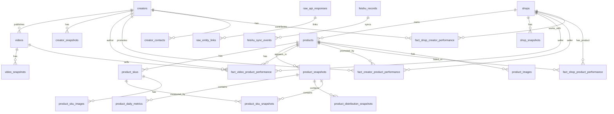

# 事实数据库 ERD 与表结构设计

更新时间：`2026-04-21`

本文给出 TikTok / FastMoss 采集事实数据库的第一版 ERD 和表结构设计。目标是把商品、SKU、店铺、达人、视频、销量趋势、成交占比、建联业务视图之间的边界拆清楚：数据库负责事实、关系、历史快照和聚合索引；飞书负责业务视图、人工协作和可视化展示。

相关依据：

- [18-TK综合数据表设计.md](./18-TK综合数据表设计.md)
- [19-FastMoss四主体接口与关系设计.md](./19-FastMoss四主体接口与关系设计.md)
- [fastmoss已知接口.md](./fastmoss已知接口.md)
- [fastmoss可视化分析.md](./fastmoss可视化分析.md)

## 1. 设计依据

### 1.1 真实接口验证得到的关系

此前通过 Roxy 打开 FastMoss 商品、达人、视频、店铺四个详情页，已验证四类主体之间存在交叉关系：

| 主体 | 样例 ID | 关系依据 |
| --- | --- | --- |
| 商品 | `1732183068040729370` | 商品页 `/api/goods/v3/base` 返回商品和店铺；商品页 `/api/goods/v3/video` 返回关联视频和达人 |
| 店铺 | `7496166867916327706` | 商品页 `data.shop.seller_id` 与店铺页 `/api/shop/v3/base` 一致 |
| 达人 | `7094679250578015274` | 商品页 `/api/goods/v3/author`、视频页 `/api/video/overview`、达人页 `/api/author/v3/detail/*` 均返回同一达人 |
| 视频 | `7623147954093690143` | 商品页、视频页、达人页都能交叉验证视频带货商品、作者达人和销售表现 |

真实样例中：

- 视频 `7623147954093690143` 由达人 `7094679250578015274` 发布。
- 视频 `7623147954093690143` 带货商品 `1732183068040729370`。
- 该视频对该商品贡献销量 `174`，GMV `$2421.05`。
- 商品 `1732183068040729370` 归属店铺 `7496166867916327706`。

这说明数据库不能只做简单的“商品表里放达人字段”或“达人表里放商品字段”，而应使用关系事实表承接多对多关系。

### 1.2 TikTok PDP 真实测试得到的基础字段

通过普通 HTTP 请求 TikTok PDP HTML，解析 `__MODERN_ROUTER_DATA__`，已验证不启动浏览器也能拿到以下基础字段：

| 数据 | TikTok PDP HTML 路径 |
| --- | --- |
| 商品 ID | `product_model.product_id` |
| 店铺 ID | `product_model.seller_id` |
| 商品标题 | `product_model.name` |
| 商品主图 / 侧边栏图 | `product_model.images[]` |
| SKU 列表 | `product_model.skus[]` |
| SKU 规格 | `skus[].property_pairs[]` |
| SKU 库存 | `skus[].sku_quantity.available_quantity` |
| 规格维度和值 | `product_model.sale_properties[]` |
| 商品评分 | `review_model.product_overall_score` |
| 商品评论数 | `review_model.product_review_count` |

20 个真实 PDP 链接的低频测试结果：

- 页面请求：`20/20` HTTP 200。
- 商品组件解析：`20/20` 成功。
- 图片下载：`161/161` 成功。
- 全局间隔：每次 GET 最少 `3s`。
- 未观察到 `403 / 429 / captcha / access denied`。

这说明 TikTok PDP 适合作为商品基础信息和图片/SKU 的低频补充来源。

### 1.3 FastMoss 真实接口验证得到的分析字段

FastMoss 更适合承载分析口径：

| 分析需求 | 推荐接口 |
| --- | --- |
| 商品 7/28/90 天销量、GMV、每日趋势 | `/api/goods/v3/overview` |
| 成交渠道/内容/投放占比 | `/api/goods/v3/overview` |
| SKU 销量/GMV/库存占比 | `/api/goods/v3/productSku` 或旧版 SKU 接口 |
| 商品关联视频排行 | `/api/goods/v3/video` |
| 商品关联达人排行 | `/api/goods/v3/author` |
| 视频基础信息和挂载商品 | `/api/video/overview`、`/api/video/v2/goods` |
| 达人基础、带货、趋势 | `/api/author/v3/detail/*` |
| 店铺基础、商品、达人、趋势 | `/api/shop/v3/*` |

因此：TikTok PDP 主要做商品基础补齐；FastMoss 主要做趋势、占比、达人、视频、店铺表现。

## 2. 设计原则

### 2.1 数据库是事实源，飞书是业务视图

数据库负责：

- 原始接口响应留存。
- 主体去重。
- 主体关系索引。
- 历史快照。
- 时间序列。
- 分析聚合。
- 为飞书提供最新视图和图表数据。

飞书负责：

- 竞品池。
- 达人建联。
- 人工备注。
- 复盘结论。
- 负责人和跟进状态。
- 业务看板和轻量可视化。

### 2.2 主档只保留当前最新稳定属性

例如 `products` 保存商品当前标题、主图、店铺、类目、最新评分、最新评论数。历史评分、价格、销量、库存要进入快照表。

### 2.3 关系事实表承接多对多贡献

商品、达人、视频、店铺之间不是简单一对一：

- 一个商品可以被多个达人推广。
- 一个达人可以推广多个商品。
- 一个视频可以挂多个商品。
- 一个商品可以出现在多个视频中。
- 一个店铺可以被多个达人带货。

所以必须有：

- `fact_video_product_performance`
- `fact_creator_product_performance`
- `fact_shop_product_performance`
- `fact_shop_creator_performance`

### 2.4 快照必须带时间窗口

所有会随时间变化的数据都要带：

- `collected_at`
- `window_type`
- `window_days`
- `window_start`
- `window_end`
- `source_platform`
- `source_endpoint`

否则近 7 天、近 28 天、近 90 天、自定义日期会混在一起。

### 2.5 外部长 ID 全部用文本

TikTok / FastMoss 的 ID 很长，虽然部分能放入 PostgreSQL `bigint`，但为了避免 JavaScript、飞书、CSV、Python JSON、前端渲染中出现精度问题，统一使用 `text` 保存外部 ID。

## 3. 总体 ERD



## 4. 表分层

| 层 | 表 | 作用 |
| --- | --- | --- |
| 原始层 | `raw_api_responses`, `raw_entity_links` | 保存接口原始响应和主体关联，便于回溯 |
| 主体层 | `products`, `product_skus`, `shops`, `creators`, `videos` | 去重后的当前最新主体 |
| 素材层 | `product_images`, `product_sku_images`, `video_assets`, `creator_contacts` | 图片、视频封面、联系方式等附属信息 |
| 快照层 | `product_snapshots`, `product_daily_metrics`, `product_distribution_snapshots`, `product_sku_snapshots`, `video_snapshots`, `creator_snapshots`, `shop_snapshots` | 时间窗口和历史趋势 |
| 关系事实层 | `fact_video_product_performance`, `fact_creator_product_performance`, `fact_shop_product_performance`, `fact_shop_creator_performance` | 多主体之间的表现事实 |
| 飞书映射层 | `feishu_records`, `feishu_sync_events` | 数据库和飞书记录之间的映射、同步日志 |

## 5. PostgreSQL 类型约定

| 类型 | 用途 |
| --- | --- |
| `text` | TikTok/FastMoss 外部 ID、URL、标题、枚举原始值 |
| `numeric(18,2)` | GMV、价格、成本 |
| `numeric(12,6)` | 比例、互动率、ROAS 等小数 |
| `integer` | 数量级较小的计数 |
| `bigint` | 播放量、销量、评论数等可能较大的计数 |
| `timestamptz` | 采集时间、接口响应时间、更新时间 |
| `date` | 趋势日期、窗口开始/结束日期 |
| `jsonb` | 原始片段、扩展属性、接口结构易变字段 |

## 6. 主体表结构

### 6.1 `shops`

店铺主档，一行一个 TikTok Shop seller。

| 字段 | 类型 | 约束 | 说明 |
| --- | --- | --- | --- |
| `id` | `bigserial` | PK | 内部主键 |
| `seller_id` | `text` | UNIQUE NOT NULL | TikTok / FastMoss 店铺 ID |
| `shop_name` | `text` |  | 店铺名称 |
| `shop_url` | `text` |  | TikTok 店铺链接 |
| `fastmoss_url` | `text` |  | FastMoss 店铺链接 |
| `region` | `text` |  | US、UK 等 |
| `currency` | `text` |  | USD 等 |
| `category_name` | `text` |  | 店铺类目 |
| `avatar_url` | `text` |  | 当前头像 URL |
| `avatar_file_id` | `bigint` | FK 可选 | 如落本地/对象存储 |
| `latest_sold_count` | `bigint` |  | 最新累计销量 |
| `latest_sale_amount` | `numeric(18,2)` |  | 最新累计 GMV |
| `latest_product_count` | `integer` |  | 最新在售商品数 |
| `latest_author_count` | `integer` |  | 最新关联达人数 |
| `latest_video_count` | `integer` |  | 最新关联视频数 |
| `latest_live_count` | `integer` |  | 最新关联直播数 |
| `latest_rating` | `numeric(4,2)` |  | 店铺评分 |
| `latest_positive_feedback_rate` | `numeric(8,4)` |  | 好评率，0-1 |
| `raw_current` | `jsonb` |  | 当前最新原始摘要 |
| `first_seen_at` | `timestamptz` | NOT NULL | 首次采集时间 |
| `last_seen_at` | `timestamptz` | NOT NULL | 最近采集时间 |
| `created_at` | `timestamptz` | NOT NULL | 创建时间 |
| `updated_at` | `timestamptz` | NOT NULL | 更新时间 |

索引：

- `UNIQUE (seller_id)`
- `INDEX (shop_name)`
- `INDEX (region)`
- `INDEX (last_seen_at)`

### 6.2 `products`

商品主档，一行一个 TikTok 商品。

| 字段 | 类型 | 约束 | 说明 |
| --- | --- | --- | --- |
| `id` | `bigserial` | PK | 内部主键 |
| `product_id` | `text` | UNIQUE NOT NULL | TikTok 商品 ID |
| `seller_id` | `text` | FK -> `shops.seller_id` | 当前归属店铺 |
| `title` | `text` |  | 当前商品标题 |
| `product_url` | `text` |  | TikTok PDP URL |
| `fastmoss_url` | `text` |  | FastMoss 商品 URL |
| `main_image_url` | `text` |  | 当前主图 URL |
| `main_image_file_id` | `bigint` | FK 可选 | 本地/对象存储文件 |
| `region` | `text` |  | 站点 |
| `currency` | `text` |  | 币种 |
| `category_l1_id` | `text` |  | 一级类目 ID |
| `category_l1_name` | `text` |  | 一级类目 |
| `category_l2_id` | `text` |  | 二级类目 ID |
| `category_l2_name` | `text` |  | 二级类目 |
| `category_l3_id` | `text` |  | 三级类目 ID |
| `category_l3_name` | `text` |  | 三级类目 |
| `commission_rate` | `numeric(8,4)` |  | 佣金率，0-1 |
| `latest_price_min` | `numeric(18,2)` |  | 最新最低价 |
| `latest_price_max` | `numeric(18,2)` |  | 最新最高价 |
| `latest_rating` | `numeric(4,2)` |  | 最新商品评分 |
| `latest_review_count` | `bigint` |  | 最新评论数 |
| `latest_sold_count` | `bigint` |  | 最新累计销量 |
| `latest_sale_amount` | `numeric(18,2)` |  | 最新累计 GMV |
| `latest_stock_count` | `bigint` |  | 最新库存 |
| `off_shelves` | `boolean` |  | 是否下架 |
| `status` | `text` |  | normal / off_shelves / unavailable / unknown |
| `holiday_tags` | `text[]` |  | 节日标签，如 Easter、Valentine |
| `raw_current` | `jsonb` |  | 当前最新原始摘要 |
| `first_seen_at` | `timestamptz` | NOT NULL | 首次采集时间 |
| `last_seen_at` | `timestamptz` | NOT NULL | 最近采集时间 |
| `created_at` | `timestamptz` | NOT NULL | 创建时间 |
| `updated_at` | `timestamptz` | NOT NULL | 更新时间 |

索引：

- `UNIQUE (product_id)`
- `INDEX (seller_id)`
- `INDEX (region)`
- `INDEX (category_l3_id)`
- `INDEX (latest_sold_count DESC)`
- `INDEX (latest_sale_amount DESC)`
- `GIN (holiday_tags)`

### 6.3 `product_skus`

商品规格主档，一行一个 SKU。

| 字段 | 类型 | 约束 | 说明 |
| --- | --- | --- | --- |
| `id` | `bigserial` | PK | 内部主键 |
| `sku_id` | `text` | UNIQUE NOT NULL | TikTok SKU ID |
| `product_id` | `text` | FK -> `products.product_id` | 所属商品 |
| `seller_sku` | `text` |  | 商家 SKU 编码，如 `JOY-BU2-15426` |
| `sku_name` | `text` |  | SKU 内部名 |
| `status` | `text` |  | normal / sold_out / inactive / unknown |
| `stock_status` | `text` |  | 原始库存状态映射 |
| `latest_available_quantity` | `bigint` |  | 最新可售库存 |
| `latest_price` | `numeric(18,2)` |  | 最新价格，如可拿到 |
| `property_pairs` | `jsonb` |  | 规格键值数组 |
| `property_text` | `text` |  | 展示用规格串，如 `quantity=100Pcs` |
| `primary_property_name` | `text` |  | 主规格名，如 quantity / Color |
| `primary_property_value` | `text` |  | 主规格值，如 100Pcs |
| `sku_image_url` | `text` |  | SKU 图片 URL |
| `sku_image_file_id` | `bigint` | FK 可选 | 本地/对象存储文件 |
| `gtin` | `text` |  | GTIN |
| `weight_value` | `numeric(12,4)` |  | 重量 |
| `weight_unit` | `text` |  | 重量单位 |
| `dimension` | `jsonb` |  | 长宽高 |
| `raw_current` | `jsonb` |  | 当前最新原始摘要 |
| `first_seen_at` | `timestamptz` | NOT NULL | 首次采集 |
| `last_seen_at` | `timestamptz` | NOT NULL | 最近采集 |
| `created_at` | `timestamptz` | NOT NULL | 创建时间 |
| `updated_at` | `timestamptz` | NOT NULL | 更新时间 |

索引：

- `UNIQUE (sku_id)`
- `INDEX (product_id)`
- `INDEX (primary_property_name, primary_property_value)`
- `INDEX (status)`

### 6.4 `creators`

达人主档，一行一个 TikTok 达人。

| 字段 | 类型 | 约束 | 说明 |
| --- | --- | --- | --- |
| `id` | `bigserial` | PK | 内部主键 |
| `uid` | `text` | UNIQUE NOT NULL | TikTok / FastMoss 达人 UID |
| `unique_id` | `text` |  | TikTok 账号名 |
| `nickname` | `text` |  | 昵称 |
| `profile_url` | `text` |  | TikTok 主页 |
| `fastmoss_url` | `text` |  | FastMoss 达人页 |
| `avatar_url` | `text` |  | 头像 URL |
| `avatar_file_id` | `bigint` | FK 可选 | 本地/对象存储文件 |
| `region` | `text` |  | 站点 |
| `category_name` | `text` |  | 达人类目 |
| `latest_follower_count` | `bigint` |  | 最新粉丝数 |
| `latest_aweme_count` | `bigint` |  | 最新视频数 |
| `show_shop_tab` | `boolean` |  | 是否展示橱窗 |
| `is_shop_author` | `boolean` |  | 是否店铺达人 |
| `seller_id` | `text` |  | 如达人绑定店铺 |
| `mcn` | `text` |  | MCN |
| `signature` | `text` |  | 简介 |
| `raw_current` | `jsonb` |  | 当前最新原始摘要 |
| `first_seen_at` | `timestamptz` | NOT NULL | 首次采集 |
| `last_seen_at` | `timestamptz` | NOT NULL | 最近采集 |
| `created_at` | `timestamptz` | NOT NULL | 创建时间 |
| `updated_at` | `timestamptz` | NOT NULL | 更新时间 |

索引：

- `UNIQUE (uid)`
- `INDEX (unique_id)`
- `INDEX (region)`
- `INDEX (latest_follower_count DESC)`

### 6.5 `videos`

视频主档，一行一个 TikTok 视频。

| 字段 | 类型 | 约束 | 说明 |
| --- | --- | --- | --- |
| `id` | `bigserial` | PK | 内部主键 |
| `video_id` | `text` | UNIQUE NOT NULL | TikTok 视频 ID |
| `uid` | `text` | FK -> `creators.uid` | 作者达人 |
| `video_url` | `text` |  | TikTok 视频 URL |
| `fastmoss_url` | `text` |  | FastMoss 视频页 |
| `description` | `text` |  | 视频文案 |
| `cover_url` | `text` |  | 封面 URL |
| `cover_file_id` | `bigint` | FK 可选 | 本地/对象存储文件 |
| `duration_seconds` | `integer` |  | 视频时长 |
| `published_at` | `timestamptz` |  | 发布时间 |
| `region` | `text` |  | 站点 |
| `is_ad` | `boolean` |  | 是否广告视频 |
| `latest_play_count` | `bigint` |  | 最新播放量 |
| `latest_digg_count` | `bigint` |  | 最新点赞数 |
| `latest_comment_count` | `bigint` |  | 最新评论数 |
| `latest_share_count` | `bigint` |  | 最新分享数 |
| `latest_product_count` | `integer` |  | 最新挂载商品数 |
| `raw_current` | `jsonb` |  | 当前最新原始摘要 |
| `first_seen_at` | `timestamptz` | NOT NULL | 首次采集 |
| `last_seen_at` | `timestamptz` | NOT NULL | 最近采集 |
| `created_at` | `timestamptz` | NOT NULL | 创建时间 |
| `updated_at` | `timestamptz` | NOT NULL | 更新时间 |

索引：

- `UNIQUE (video_id)`
- `INDEX (uid)`
- `INDEX (published_at DESC)`
- `INDEX (latest_play_count DESC)`
- `INDEX (is_ad)`

## 7. 素材和附属表

### 7.1 `files`

统一保存下载到本地或对象存储的文件元信息。

| 字段 | 类型 | 约束 | 说明 |
| --- | --- | --- | --- |
| `id` | `bigserial` | PK | 文件 ID |
| `source_url` | `text` |  | 原始 URL |
| `storage_provider` | `text` |  | local / s3 / r2 / oss |
| `storage_path` | `text` | NOT NULL | 存储路径 |
| `content_type` | `text` |  | MIME |
| `byte_size` | `bigint` |  | 文件大小 |
| `sha256` | `text` |  | 文件哈希 |
| `width` | `integer` |  | 图片宽度 |
| `height` | `integer` |  | 图片高度 |
| `download_status` | `text` |  | success / failed |
| `downloaded_at` | `timestamptz` |  | 下载时间 |
| `raw_meta` | `jsonb` |  | 原始头信息 |

索引：

- `UNIQUE (sha256)`，允许为空时可建 partial unique index。
- `INDEX (source_url)`

### 7.2 `product_images`

商品轮播图/侧边栏图。

| 字段 | 类型 | 约束 | 说明 |
| --- | --- | --- | --- |
| `id` | `bigserial` | PK | 内部主键 |
| `product_id` | `text` | FK -> `products.product_id` | 商品 |
| `image_url` | `text` | NOT NULL | 图片 URL |
| `file_id` | `bigint` | FK -> `files.id` | 下载文件 |
| `position` | `integer` |  | 图序 |
| `is_main` | `boolean` |  | 是否主图 |
| `width` | `integer` |  | 宽 |
| `height` | `integer` |  | 高 |
| `source` | `text` |  | tiktok_pdp / fastmoss |
| `first_seen_at` | `timestamptz` |  | 首次出现 |
| `last_seen_at` | `timestamptz` |  | 最近出现 |

索引：

- `UNIQUE (product_id, image_url)`
- `INDEX (product_id, position)`

### 7.3 `product_sku_images`

SKU 规格图。

| 字段 | 类型 | 约束 | 说明 |
| --- | --- | --- | --- |
| `id` | `bigserial` | PK | 内部主键 |
| `sku_id` | `text` | FK -> `product_skus.sku_id` | SKU |
| `product_id` | `text` | FK -> `products.product_id` | 商品 |
| `property_value_id` | `text` |  | 规格值 ID |
| `image_url` | `text` | NOT NULL | 图片 URL |
| `file_id` | `bigint` | FK -> `files.id` | 下载文件 |
| `source` | `text` |  | tiktok_pdp / fastmoss |
| `first_seen_at` | `timestamptz` |  | 首次出现 |
| `last_seen_at` | `timestamptz` |  | 最近出现 |

索引：

- `UNIQUE (sku_id, image_url)`
- `INDEX (product_id)`

### 7.4 `creator_contacts`

达人联系方式明细。

| 字段 | 类型 | 约束 | 说明 |
| --- | --- | --- | --- |
| `id` | `bigserial` | PK | 内部主键 |
| `uid` | `text` | FK -> `creators.uid` | 达人 |
| `contact_type` | `text` |  | email / whatsapp / instagram / link |
| `contact_value` | `text` |  | 联系方式 |
| `source` | `text` |  | fastmoss / manual / bio |
| `is_valid` | `boolean` |  | 是否有效 |
| `first_seen_at` | `timestamptz` |  | 首次出现 |
| `last_seen_at` | `timestamptz` |  | 最近出现 |
| `raw_meta` | `jsonb` |  | 原始信息 |

索引：

- `INDEX (uid)`
- `INDEX (contact_type)`
- `UNIQUE (uid, contact_type, contact_value)`

## 8. 快照表结构

### 8.1 `product_snapshots`

商品窗口快照，一行表示一个商品在一个采集时间和统计窗口下的汇总。

| 字段 | 类型 | 约束 | 说明 |
| --- | --- | --- | --- |
| `id` | `bigserial` | PK | 内部主键 |
| `product_id` | `text` | FK -> `products.product_id` | 商品 |
| `seller_id` | `text` | FK -> `shops.seller_id` | 冗余店铺，便于查询 |
| `source_platform` | `text` | NOT NULL | tiktok / fastmoss |
| `source_endpoint` | `text` |  | 接口名 |
| `collected_at` | `timestamptz` | NOT NULL | 采集时间 |
| `window_type` | `text` | NOT NULL | rolling / custom / lifetime |
| `window_days` | `integer` |  | 7 / 28 / 90 |
| `window_start` | `date` |  | 窗口开始 |
| `window_end` | `date` |  | 窗口结束 |
| `price_min` | `numeric(18,2)` |  | 窗口或当前最低价 |
| `price_max` | `numeric(18,2)` |  | 当前最高价 |
| `avg_price` | `numeric(18,2)` |  | 均价 |
| `sold_count` | `bigint` |  | 窗口销量 |
| `sale_amount` | `numeric(18,2)` |  | 窗口 GMV |
| `avg_sold_count` | `numeric(18,2)` |  | 日均销量 |
| `avg_sale_amount` | `numeric(18,2)` |  | 日均 GMV |
| `real_sold_count` | `bigint` |  | FastMoss 真实销量字段，如有 |
| `real_sale_amount` | `numeric(18,2)` |  | FastMoss 真实 GMV 字段，如有 |
| `video_sold_count` | `bigint` |  | 视频销量 |
| `video_sale_amount` | `numeric(18,2)` |  | 视频 GMV |
| `live_sold_count` | `bigint` |  | 直播销量 |
| `live_sale_amount` | `numeric(18,2)` |  | 直播 GMV |
| `author_count` | `integer` |  | 达人数 |
| `video_count` | `integer` |  | 视频数 |
| `live_count` | `integer` |  | 直播数 |
| `rating` | `numeric(4,2)` |  | 评分 |
| `review_count` | `bigint` |  | 评论数 |
| `stock_count` | `bigint` |  | 库存 |
| `rank_country` | `integer` |  | 国家排名 |
| `rank_category` | `integer` |  | 类目排名 |
| `raw_payload_id` | `bigint` | FK -> `raw_api_responses.id` | 原始响应 |
| `raw_summary` | `jsonb` |  | 原始摘要 |

推荐唯一键：

- `UNIQUE (product_id, source_platform, window_type, window_days, window_start, window_end, collected_at)`

常用索引：

- `INDEX (product_id, collected_at DESC)`
- `INDEX (seller_id, collected_at DESC)`
- `INDEX (window_days, window_end)`
- `INDEX (sold_count DESC)`
- `INDEX (sale_amount DESC)`

### 8.2 `product_daily_metrics`

商品每日趋势，用于销量/GMV/价格折线图。

| 字段 | 类型 | 约束 | 说明 |
| --- | --- | --- | --- |
| `id` | `bigserial` | PK | 内部主键 |
| `product_snapshot_id` | `bigint` | FK -> `product_snapshots.id` | 所属快照 |
| `product_id` | `text` | FK -> `products.product_id` | 商品 |
| `metric_date` | `date` | NOT NULL | 日期 |
| `inc_sold_count` | `bigint` |  | 当日销量 |
| `inc_sale_amount` | `numeric(18,2)` |  | 当日 GMV |
| `sold_count` | `bigint` |  | 累计销量 |
| `sale_amount` | `numeric(18,2)` |  | 累计 GMV |
| `price` | `numeric(18,2)` |  | 当日价格 |
| `author_count` | `integer` |  | 当日累计达人数 |
| `inc_author_count` | `integer` |  | 新增达人 |
| `video_count` | `integer` |  | 当日累计视频数 |
| `inc_video_count` | `integer` |  | 新增视频 |
| `live_count` | `integer` |  | 当日累计直播数 |
| `inc_live_count` | `integer` |  | 新增直播 |
| `raw_row` | `jsonb` |  | 原始行 |

推荐唯一键：

- `UNIQUE (product_snapshot_id, metric_date)`

常用索引：

- `INDEX (product_id, metric_date)`
- `INDEX (metric_date)`

### 8.3 `product_distribution_snapshots`

商品成交占比明细。成交渠道、成交内容、成交投放统一放这一张表。

| 字段 | 类型 | 约束 | 说明 |
| --- | --- | --- | --- |
| `id` | `bigserial` | PK | 内部主键 |
| `product_snapshot_id` | `bigint` | FK -> `product_snapshots.id` | 所属快照 |
| `product_id` | `text` | FK -> `products.product_id` | 商品 |
| `distribution_type` | `text` | NOT NULL | channel / content / ads |
| `source_key` | `text` | NOT NULL | FastMoss 原始 key |
| `source_name` | `text` |  | 中文名，如 达人联盟、短视频 |
| `units_sold` | `bigint` |  | 销量 |
| `units_sold_share` | `numeric(12,6)` |  | 销量占比，0-1 |
| `gmv` | `numeric(18,2)` |  | GMV |
| `gmv_share` | `numeric(12,6)` |  | GMV 占比，0-1 |
| `rank_no` | `integer` |  | 排名 |
| `raw_units_row` | `jsonb` |  | 原始销量行 |
| `raw_gmv_row` | `jsonb` |  | 原始 GMV 行 |

推荐唯一键：

- `UNIQUE (product_snapshot_id, distribution_type, source_key)`

常用索引：

- `INDEX (product_id, distribution_type)`
- `INDEX (distribution_type, gmv_share DESC)`

### 8.4 `product_sku_snapshots`

SKU 表现快照，承接主销规格排行、库存风险、SKU 占比图。

| 字段 | 类型 | 约束 | 说明 |
| --- | --- | --- | --- |
| `id` | `bigserial` | PK | 内部主键 |
| `product_snapshot_id` | `bigint` | FK -> `product_snapshots.id` | 所属商品快照 |
| `product_id` | `text` | FK -> `products.product_id` | 商品 |
| `sku_id` | `text` | FK -> `product_skus.sku_id`，可空 | SKU；Other 聚合项可为空 |
| `sku_name` | `text` |  | SKU 名称或 Other |
| `property_text` | `text` |  | 规格展示 |
| `price` | `numeric(18,2)` |  | 当前价格 |
| `stock_count` | `bigint` |  | 当前库存 |
| `stock_share` | `numeric(12,6)` |  | 库存占比 |
| `units_sold` | `bigint` |  | SKU 销量 |
| `units_sold_share` | `numeric(12,6)` |  | SKU 销量占比 |
| `gmv` | `numeric(18,2)` |  | SKU GMV |
| `gmv_share` | `numeric(12,6)` |  | SKU GMV 占比 |
| `rank_no` | `integer` |  | 排名 |
| `is_best_sku` | `boolean` |  | 是否主销规格 |
| `is_aggregated_other` | `boolean` |  | 是否 Other 聚合项 |
| `risk_label` | `text` |  | 主销 / 长尾 / 缺货风险 |
| `raw_row` | `jsonb` |  | 原始行 |

推荐唯一键：

- `UNIQUE (product_snapshot_id, sku_id)`
- 对 `sku_id IS NULL` 的 Other 项，可用 `UNIQUE (product_snapshot_id, sku_name)` 补充。

常用索引：

- `INDEX (product_id, rank_no)`
- `INDEX (sku_id, product_snapshot_id)`
- `INDEX (units_sold_share DESC)`

### 8.5 `video_snapshots`

视频指标快照。

| 字段 | 类型 | 约束 | 说明 |
| --- | --- | --- | --- |
| `id` | `bigserial` | PK | 内部主键 |
| `video_id` | `text` | FK -> `videos.video_id` | 视频 |
| `uid` | `text` | FK -> `creators.uid` | 作者 |
| `source_platform` | `text` | NOT NULL | fastmoss / tiktok |
| `source_endpoint` | `text` |  | 接口 |
| `collected_at` | `timestamptz` | NOT NULL | 采集时间 |
| `window_type` | `text` |  | rolling / lifetime |
| `window_days` | `integer` |  | 28 等 |
| `play_count` | `bigint` |  | 播放 |
| `digg_count` | `bigint` |  | 点赞 |
| `comment_count` | `bigint` |  | 评论 |
| `share_count` | `bigint` |  | 分享 |
| `forward_count` | `bigint` |  | 转发 |
| `interaction_rate` | `numeric(12,6)` |  | 互动率 |
| `ipm` | `numeric(12,6)` |  | IPM |
| `product_count` | `integer` |  | 挂载商品数 |
| `raw_payload_id` | `bigint` | FK -> `raw_api_responses.id` | 原始响应 |
| `raw_summary` | `jsonb` |  | 原始摘要 |

索引：

- `INDEX (video_id, collected_at DESC)`
- `INDEX (uid, collected_at DESC)`
- `INDEX (play_count DESC)`

### 8.6 `creator_snapshots`

达人快照。

| 字段 | 类型 | 约束 | 说明 |
| --- | --- | --- | --- |
| `id` | `bigserial` | PK | 内部主键 |
| `uid` | `text` | FK -> `creators.uid` | 达人 |
| `source_platform` | `text` | NOT NULL | fastmoss / tiktok |
| `source_endpoint` | `text` |  | 接口 |
| `collected_at` | `timestamptz` | NOT NULL | 采集时间 |
| `window_type` | `text` |  | rolling / lifetime |
| `window_days` | `integer` |  | 28 等 |
| `follower_count` | `bigint` |  | 粉丝 |
| `follower_28_count` | `bigint` |  | 28 天涨粉 |
| `aweme_count` | `bigint` |  | 视频数 |
| `aweme_28_count` | `bigint` |  | 28 天视频数 |
| `aweme_play_count` | `bigint` |  | 视频播放总量 |
| `avg_play_count` | `numeric(18,2)` |  | 平均播放 |
| `avg_interaction_rate` | `numeric(12,6)` |  | 平均互动率 |
| `goods_count` | `integer` |  | 带货商品数 |
| `shop_count` | `integer` |  | 带货店铺数 |
| `total_sold_count` | `bigint` |  | 总带货销量 |
| `total_sale_amount` | `numeric(18,2)` |  | 总带货 GMV |
| `video_sale_amount` | `numeric(18,2)` |  | 视频 GMV |
| `live_sale_amount` | `numeric(18,2)` |  | 直播 GMV |
| `region_rank` | `integer` |  | 国家排名 |
| `category_rank` | `integer` |  | 类目排名 |
| `flow_index` | `numeric(12,4)` |  | 流量指数 |
| `carry_index` | `numeric(12,4)` |  | 带货指数 |
| `raw_payload_id` | `bigint` | FK -> `raw_api_responses.id` | 原始响应 |
| `raw_summary` | `jsonb` |  | 原始摘要 |

索引：

- `INDEX (uid, collected_at DESC)`
- `INDEX (follower_count DESC)`
- `INDEX (total_sale_amount DESC)`

### 8.7 `shop_snapshots`

店铺快照。

| 字段 | 类型 | 约束 | 说明 |
| --- | --- | --- | --- |
| `id` | `bigserial` | PK | 内部主键 |
| `seller_id` | `text` | FK -> `shops.seller_id` | 店铺 |
| `source_platform` | `text` | NOT NULL | fastmoss / tiktok |
| `source_endpoint` | `text` |  | 接口 |
| `collected_at` | `timestamptz` | NOT NULL | 采集时间 |
| `window_type` | `text` |  | rolling / lifetime |
| `window_days` | `integer` |  | 28 等 |
| `sold_count` | `bigint` |  | 店铺销量 |
| `sale_amount` | `numeric(18,2)` |  | 店铺 GMV |
| `product_count` | `integer` |  | 在售商品数 |
| `total_product_count` | `integer` |  | 总商品数 |
| `author_count` | `integer` |  | 达人数 |
| `video_count` | `integer` |  | 视频数 |
| `live_count` | `integer` |  | 直播数 |
| `rating` | `numeric(4,2)` |  | 店铺评分 |
| `positive_feedback_rate` | `numeric(12,6)` |  | 好评率 |
| `response_rate` | `numeric(12,6)` |  | 响应率 |
| `delivery_rate` | `numeric(12,6)` |  | 发货率 |
| `rank_region` | `integer` |  | 地区排名 |
| `rank_category` | `integer` |  | 类目排名 |
| `raw_payload_id` | `bigint` | FK -> `raw_api_responses.id` | 原始响应 |
| `raw_summary` | `jsonb` |  | 原始摘要 |

索引：

- `INDEX (seller_id, collected_at DESC)`
- `INDEX (sale_amount DESC)`

## 9. 关系事实表结构

### 9.1 `fact_video_product_performance`

视频带货商品表现。核心表，用于回答“哪个视频给哪个商品贡献了多少销量和 GMV”。

| 字段 | 类型 | 约束 | 说明 |
| --- | --- | --- | --- |
| `id` | `bigserial` | PK | 内部主键 |
| `video_id` | `text` | FK -> `videos.video_id` | 视频 |
| `product_id` | `text` | FK -> `products.product_id` | 商品 |
| `uid` | `text` | FK -> `creators.uid` | 视频作者 |
| `seller_id` | `text` | FK -> `shops.seller_id` | 商品店铺 |
| `source_platform` | `text` | NOT NULL | fastmoss |
| `source_endpoint` | `text` |  | `goods.v3.video` / `video.v2.goods` |
| `collected_at` | `timestamptz` | NOT NULL | 采集时间 |
| `window_type` | `text` |  | rolling / lifetime |
| `window_days` | `integer` |  | 28 等 |
| `published_at` | `timestamptz` |  | 视频发布时间 |
| `is_ad` | `boolean` |  | 是否广告 |
| `play_count` | `bigint` |  | 播放 |
| `digg_count` | `bigint` |  | 点赞 |
| `comment_count` | `bigint` |  | 评论 |
| `share_count` | `bigint` |  | 分享 |
| `engagement_rate` | `numeric(12,6)` |  | 互动率 |
| `sold_count` | `bigint` |  | 该视频带该商品销量 |
| `sale_amount` | `numeric(18,2)` |  | 该视频带该商品 GMV |
| `estimate_cost_amount` | `numeric(18,2)` |  | 预估投放成本 |
| `roas` | `numeric(12,6)` |  | ROAS |
| `raw_payload_id` | `bigint` | FK -> `raw_api_responses.id` | 原始响应 |
| `raw_row` | `jsonb` |  | 原始行 |

推荐唯一键：

- `UNIQUE (video_id, product_id, source_platform, window_type, window_days, collected_at)`

常用索引：

- `INDEX (product_id, sold_count DESC)`
- `INDEX (uid, sale_amount DESC)`
- `INDEX (seller_id, sale_amount DESC)`
- `INDEX (is_ad, roas DESC)`

### 9.2 `fact_creator_product_performance`

达人商品带货汇总，用于回答“哪个达人给哪个商品带了多少货”。

| 字段 | 类型 | 约束 | 说明 |
| --- | --- | --- | --- |
| `id` | `bigserial` | PK | 内部主键 |
| `uid` | `text` | FK -> `creators.uid` | 达人 |
| `product_id` | `text` | FK -> `products.product_id` | 商品 |
| `seller_id` | `text` | FK -> `shops.seller_id` | 商品店铺 |
| `source_platform` | `text` | NOT NULL | fastmoss |
| `source_endpoint` | `text` |  | `goods.v3.author` |
| `collected_at` | `timestamptz` | NOT NULL | 采集时间 |
| `window_type` | `text` |  | rolling / lifetime |
| `window_days` | `integer` |  | 28 等 |
| `start_promoting_at` | `timestamptz` |  | 开始推广时间 |
| `sold_count` | `bigint` |  | 达人带该商品销量 |
| `sale_amount` | `numeric(18,2)` |  | 达人带该商品 GMV |
| `related_video_count` | `integer` |  | 关联视频数 |
| `representative_video_id` | `text` | FK -> `videos.video_id` | 代表视频 |
| `follower_count` | `bigint` |  | 当时粉丝数 |
| `aweme_min_gpm` | `numeric(18,2)` |  | 短视频最低 GPM |
| `aweme_max_gpm` | `numeric(18,2)` |  | 短视频最高 GPM |
| `live_gpm_min` | `numeric(18,2)` |  | 直播最低 GPM |
| `live_gpm_max` | `numeric(18,2)` |  | 直播最高 GPM |
| `raw_payload_id` | `bigint` | FK -> `raw_api_responses.id` | 原始响应 |
| `raw_row` | `jsonb` |  | 原始行 |

推荐唯一键：

- `UNIQUE (uid, product_id, source_platform, window_type, window_days, collected_at)`

索引：

- `INDEX (product_id, sale_amount DESC)`
- `INDEX (uid, sale_amount DESC)`
- `INDEX (seller_id, sale_amount DESC)`

### 9.3 `fact_shop_product_performance`

店铺商品表现，用于从店铺维度看商品窗口表现。

| 字段 | 类型 | 约束 | 说明 |
| --- | --- | --- | --- |
| `id` | `bigserial` | PK | 内部主键 |
| `seller_id` | `text` | FK -> `shops.seller_id` | 店铺 |
| `product_id` | `text` | FK -> `products.product_id` | 商品 |
| `source_platform` | `text` | NOT NULL | fastmoss |
| `source_endpoint` | `text` |  | `shop.v3.goods` |
| `collected_at` | `timestamptz` | NOT NULL | 采集时间 |
| `window_type` | `text` |  | rolling / lifetime |
| `window_days` | `integer` |  | 28 等 |
| `sold_count` | `bigint` |  | 窗口销量 |
| `sale_amount` | `numeric(18,2)` |  | 窗口 GMV |
| `related_author_count` | `integer` |  | 关联达人数 |
| `related_video_count` | `integer` |  | 关联视频数 |
| `related_live_count` | `integer` |  | 关联直播数 |
| `product_rating` | `numeric(4,2)` |  | 商品评分 |
| `off_shelves` | `boolean` |  | 是否下架 |
| `rank_no` | `integer` |  | 店铺内排行 |
| `raw_payload_id` | `bigint` | FK -> `raw_api_responses.id` | 原始响应 |
| `raw_row` | `jsonb` |  | 原始行 |

推荐唯一键：

- `UNIQUE (seller_id, product_id, source_platform, window_type, window_days, collected_at)`

索引：

- `INDEX (seller_id, sale_amount DESC)`
- `INDEX (product_id, collected_at DESC)`

### 9.4 `fact_shop_creator_performance`

店铺达人表现，用于从店铺维度看达人贡献。

| 字段 | 类型 | 约束 | 说明 |
| --- | --- | --- | --- |
| `id` | `bigserial` | PK | 内部主键 |
| `seller_id` | `text` | FK -> `shops.seller_id` | 店铺 |
| `uid` | `text` | FK -> `creators.uid` | 达人 |
| `source_platform` | `text` | NOT NULL | fastmoss |
| `source_endpoint` | `text` |  | `shop.v3.author` |
| `collected_at` | `timestamptz` | NOT NULL | 采集时间 |
| `window_type` | `text` |  | rolling / lifetime |
| `window_days` | `integer` |  | 28 等 |
| `sold_count` | `bigint` |  | 达人给店铺贡献销量 |
| `sale_amount` | `numeric(18,2)` |  | 达人给店铺贡献 GMV |
| `product_count` | `integer` |  | 关联商品数 |
| `representative_product_ids` | `text[]` |  | 代表商品 |
| `follower_count` | `bigint` |  | 粉丝数 |
| `rank_no` | `integer` |  | 店铺内达人排行 |
| `raw_payload_id` | `bigint` | FK -> `raw_api_responses.id` | 原始响应 |
| `raw_row` | `jsonb` |  | 原始行 |

推荐唯一键：

- `UNIQUE (seller_id, uid, source_platform, window_type, window_days, collected_at)`

索引：

- `INDEX (seller_id, sale_amount DESC)`
- `INDEX (uid, sale_amount DESC)`

## 10. 原始响应层

### 10.1 `raw_api_responses`

保存每一次外部请求的原始响应，便于字段变动后重放解析。

| 字段 | 类型 | 约束 | 说明 |
| --- | --- | --- | --- |
| `id` | `bigserial` | PK | 内部主键 |
| `source_platform` | `text` | NOT NULL | tiktok / fastmoss / feishu |
| `source_endpoint` | `text` |  | 接口名或页面类型 |
| `request_method` | `text` |  | GET / POST |
| `request_url` | `text` | NOT NULL | 请求 URL |
| `request_params` | `jsonb` |  | 请求参数 |
| `request_body_hash` | `text` |  | POST body hash |
| `http_status` | `integer` |  | HTTP 状态码 |
| `app_code` | `text` |  | 业务 code，如 FastMoss code |
| `response_headers` | `jsonb` |  | 响应头摘要 |
| `response_json` | `jsonb` |  | JSON 响应 |
| `response_text_path` | `text` |  | HTML 或大文本路径 |
| `response_sha256` | `text` |  | 响应 hash |
| `parsed_ok` | `boolean` |  | 是否解析成功 |
| `parse_error` | `text` |  | 解析失败原因 |
| `risk_flags` | `text[]` |  | 风险标记 |
| `collected_at` | `timestamptz` | NOT NULL | 采集时间 |
| `duration_ms` | `integer` |  | 耗时 |
| `collector_version` | `text` |  | 采集器版本 |
| `run_id` | `text` |  | 采集批次 |

索引：

- `INDEX (source_platform, source_endpoint, collected_at DESC)`
- `INDEX (http_status)`
- `GIN (risk_flags)`
- `INDEX (run_id)`

### 10.2 `raw_entity_links`

把原始响应和解析出来的主体建立关联。

| 字段 | 类型 | 约束 | 说明 |
| --- | --- | --- | --- |
| `id` | `bigserial` | PK | 内部主键 |
| `raw_api_response_id` | `bigint` | FK -> `raw_api_responses.id` | 原始响应 |
| `entity_type` | `text` | NOT NULL | product / shop / creator / video / sku |
| `entity_external_id` | `text` | NOT NULL | 外部 ID |
| `link_role` | `text` |  | primary / related / nested |
| `created_at` | `timestamptz` | NOT NULL | 创建时间 |

索引：

- `INDEX (entity_type, entity_external_id)`
- `INDEX (raw_api_response_id)`

## 11. 飞书映射层

### 11.1 `feishu_records`

记录飞书业务表记录和数据库主体之间的映射。

| 字段 | 类型 | 约束 | 说明 |
| --- | --- | --- | --- |
| `id` | `bigserial` | PK | 内部主键 |
| `app_token` | `text` | NOT NULL | 飞书 Base token |
| `table_id` | `text` | NOT NULL | 飞书表 ID |
| `record_id` | `text` | NOT NULL | 飞书记录 ID |
| `view_name` | `text` |  | 来源视图 |
| `business_table_name` | `text` |  | 商品主档 / 达人建联表等 |
| `entity_type` | `text` |  | product / creator / shop / video / outreach |
| `entity_external_id` | `text` |  | 对应外部 ID |
| `business_status` | `text` |  | 飞书侧业务状态 |
| `owner` | `text` |  | 负责人 |
| `last_pulled_at` | `timestamptz` |  | 最近从飞书读取 |
| `last_pushed_at` | `timestamptz` |  | 最近推送飞书 |
| `raw_fields` | `jsonb` |  | 最近一次飞书字段摘要 |
| `created_at` | `timestamptz` | NOT NULL | 创建时间 |
| `updated_at` | `timestamptz` | NOT NULL | 更新时间 |

推荐唯一键：

- `UNIQUE (app_token, table_id, record_id)`

索引：

- `INDEX (entity_type, entity_external_id)`
- `INDEX (business_table_name)`

### 11.2 `feishu_sync_events`

飞书同步日志。

| 字段 | 类型 | 约束 | 说明 |
| --- | --- | --- | --- |
| `id` | `bigserial` | PK | 内部主键 |
| `feishu_record_id` | `bigint` | FK -> `feishu_records.id` | 映射记录 |
| `sync_direction` | `text` | NOT NULL | db_to_feishu / feishu_to_db |
| `sync_type` | `text` |  | create / update / delete / skip |
| `status` | `text` | NOT NULL | success / failed / skipped |
| `changed_fields` | `jsonb` |  | 变更字段 |
| `error_message` | `text` |  | 错误 |
| `run_id` | `text` |  | 批次 |
| `created_at` | `timestamptz` | NOT NULL | 创建时间 |

索引：

- `INDEX (feishu_record_id, created_at DESC)`
- `INDEX (run_id)`
- `INDEX (status)`

## 12. 业务表：达人建联和合作视频

虽然飞书是主要业务入口，但数据库也建议保留一份业务状态镜像，方便后续把事实表现和业务动作 join 起来。

### 12.1 `creator_outreach_records`

达人建联记录，一行表示一次业务建联动作。

| 字段 | 类型 | 约束 | 说明 |
| --- | --- | --- | --- |
| `id` | `bigserial` | PK | 内部主键 |
| `outreach_no` | `text` | UNIQUE | 建联编号 |
| `uid` | `text` | FK -> `creators.uid` | 达人 |
| `product_id` | `text` | FK -> `products.product_id` | 目标商品 |
| `seller_id` | `text` | FK -> `shops.seller_id` | 店铺 |
| `holiday_tag` | `text` |  | 节日 |
| `outreach_date` | `date` |  | 建联日期 |
| `channel` | `text` |  | email / tiktok / whatsapp |
| `commission_rate` | `numeric(8,4)` |  | 佣金 |
| `sample_status` | `text` |  | 未寄样 / 已寄样 / 已签收 |
| `outreach_status` | `text` |  | 待联系 / 已回复 / 已发视频 / 结束 |
| `expected_video_date` | `date` |  | 预期发视频 |
| `actual_video_id` | `text` | FK -> `videos.video_id` | 实际履约视频 |
| `notes` | `text` |  | 备注 |
| `feishu_record_ref` | `bigint` | FK -> `feishu_records.id` | 飞书记录 |
| `created_at` | `timestamptz` | NOT NULL | 创建时间 |
| `updated_at` | `timestamptz` | NOT NULL | 更新时间 |

索引：

- `INDEX (uid, outreach_date DESC)`
- `INDEX (product_id)`
- `INDEX (outreach_status)`
- `INDEX (actual_video_id)`

### 12.2 `collaboration_videos`

合作爆款视频业务表，一行表示一个人工认定/合作履约视频。

| 字段 | 类型 | 约束 | 说明 |
| --- | --- | --- | --- |
| `id` | `bigserial` | PK | 内部主键 |
| `video_id` | `text` | FK -> `videos.video_id` | 视频 |
| `uid` | `text` | FK -> `creators.uid` | 达人 |
| `product_id` | `text` | FK -> `products.product_id` | 商品 |
| `seller_id` | `text` | FK -> `shops.seller_id` | 店铺 |
| `holiday_tag` | `text` |  | 节日 |
| `video_type` | `text` |  | 合作视频 / 竞品爆款 / 履约视频 |
| `business_status` | `text` |  | 待确认 / 已复盘 / 可复用素材 |
| `published_at` | `timestamptz` |  | 发布时间 |
| `peak_play_count` | `bigint` |  | 观察到的峰值播放 |
| `peak_sold_count` | `bigint` |  | 观察到的峰值销量 |
| `peak_sale_amount` | `numeric(18,2)` |  | 观察到的峰值 GMV |
| `review_notes` | `text` |  | 复盘备注 |
| `feishu_record_ref` | `bigint` | FK -> `feishu_records.id` | 飞书记录 |
| `created_at` | `timestamptz` | NOT NULL | 创建时间 |
| `updated_at` | `timestamptz` | NOT NULL | 更新时间 |

索引：

- `INDEX (video_id)`
- `INDEX (uid)`
- `INDEX (product_id)`
- `INDEX (holiday_tag)`

## 13. 推荐 PostgreSQL DDL 骨架

以下是核心表的 DDL 骨架，实际落地时可以拆成 migration 文件。

```sql
create table shops (
  id bigserial primary key,
  seller_id text not null unique,
  shop_name text,
  shop_url text,
  fastmoss_url text,
  region text,
  currency text,
  category_name text,
  avatar_url text,
  avatar_file_id bigint,
  latest_sold_count bigint,
  latest_sale_amount numeric(18,2),
  latest_product_count integer,
  latest_author_count integer,
  latest_video_count integer,
  latest_live_count integer,
  latest_rating numeric(4,2),
  latest_positive_feedback_rate numeric(8,4),
  raw_current jsonb,
  first_seen_at timestamptz not null default now(),
  last_seen_at timestamptz not null default now(),
  created_at timestamptz not null default now(),
  updated_at timestamptz not null default now()
);

create table products (
  id bigserial primary key,
  product_id text not null unique,
  seller_id text references shops(seller_id),
  title text,
  product_url text,
  fastmoss_url text,
  main_image_url text,
  main_image_file_id bigint,
  region text,
  currency text,
  category_l1_id text,
  category_l1_name text,
  category_l2_id text,
  category_l2_name text,
  category_l3_id text,
  category_l3_name text,
  commission_rate numeric(8,4),
  latest_price_min numeric(18,2),
  latest_price_max numeric(18,2),
  latest_rating numeric(4,2),
  latest_review_count bigint,
  latest_sold_count bigint,
  latest_sale_amount numeric(18,2),
  latest_stock_count bigint,
  off_shelves boolean,
  status text,
  holiday_tags text[],
  raw_current jsonb,
  first_seen_at timestamptz not null default now(),
  last_seen_at timestamptz not null default now(),
  created_at timestamptz not null default now(),
  updated_at timestamptz not null default now()
);

create table product_skus (
  id bigserial primary key,
  sku_id text not null unique,
  product_id text not null references products(product_id),
  seller_sku text,
  sku_name text,
  status text,
  stock_status text,
  latest_available_quantity bigint,
  latest_price numeric(18,2),
  property_pairs jsonb,
  property_text text,
  primary_property_name text,
  primary_property_value text,
  sku_image_url text,
  sku_image_file_id bigint,
  gtin text,
  weight_value numeric(12,4),
  weight_unit text,
  dimension jsonb,
  raw_current jsonb,
  first_seen_at timestamptz not null default now(),
  last_seen_at timestamptz not null default now(),
  created_at timestamptz not null default now(),
  updated_at timestamptz not null default now()
);

create table creators (
  id bigserial primary key,
  uid text not null unique,
  unique_id text,
  nickname text,
  profile_url text,
  fastmoss_url text,
  avatar_url text,
  avatar_file_id bigint,
  region text,
  category_name text,
  latest_follower_count bigint,
  latest_aweme_count bigint,
  show_shop_tab boolean,
  is_shop_author boolean,
  seller_id text,
  mcn text,
  signature text,
  raw_current jsonb,
  first_seen_at timestamptz not null default now(),
  last_seen_at timestamptz not null default now(),
  created_at timestamptz not null default now(),
  updated_at timestamptz not null default now()
);

create table videos (
  id bigserial primary key,
  video_id text not null unique,
  uid text references creators(uid),
  video_url text,
  fastmoss_url text,
  description text,
  cover_url text,
  cover_file_id bigint,
  duration_seconds integer,
  published_at timestamptz,
  region text,
  is_ad boolean,
  latest_play_count bigint,
  latest_digg_count bigint,
  latest_comment_count bigint,
  latest_share_count bigint,
  latest_product_count integer,
  raw_current jsonb,
  first_seen_at timestamptz not null default now(),
  last_seen_at timestamptz not null default now(),
  created_at timestamptz not null default now(),
  updated_at timestamptz not null default now()
);
```

核心快照和事实表：

```sql
create table product_snapshots (
  id bigserial primary key,
  product_id text not null references products(product_id),
  seller_id text references shops(seller_id),
  source_platform text not null,
  source_endpoint text,
  collected_at timestamptz not null default now(),
  window_type text not null,
  window_days integer,
  window_start date,
  window_end date,
  price_min numeric(18,2),
  price_max numeric(18,2),
  avg_price numeric(18,2),
  sold_count bigint,
  sale_amount numeric(18,2),
  avg_sold_count numeric(18,2),
  avg_sale_amount numeric(18,2),
  real_sold_count bigint,
  real_sale_amount numeric(18,2),
  video_sold_count bigint,
  video_sale_amount numeric(18,2),
  live_sold_count bigint,
  live_sale_amount numeric(18,2),
  author_count integer,
  video_count integer,
  live_count integer,
  rating numeric(4,2),
  review_count bigint,
  stock_count bigint,
  rank_country integer,
  rank_category integer,
  raw_payload_id bigint,
  raw_summary jsonb
);

create table product_daily_metrics (
  id bigserial primary key,
  product_snapshot_id bigint not null references product_snapshots(id) on delete cascade,
  product_id text not null references products(product_id),
  metric_date date not null,
  inc_sold_count bigint,
  inc_sale_amount numeric(18,2),
  sold_count bigint,
  sale_amount numeric(18,2),
  price numeric(18,2),
  author_count integer,
  inc_author_count integer,
  video_count integer,
  inc_video_count integer,
  live_count integer,
  inc_live_count integer,
  raw_row jsonb,
  unique(product_snapshot_id, metric_date)
);

create table product_distribution_snapshots (
  id bigserial primary key,
  product_snapshot_id bigint not null references product_snapshots(id) on delete cascade,
  product_id text not null references products(product_id),
  distribution_type text not null,
  source_key text not null,
  source_name text,
  units_sold bigint,
  units_sold_share numeric(12,6),
  gmv numeric(18,2),
  gmv_share numeric(12,6),
  rank_no integer,
  raw_units_row jsonb,
  raw_gmv_row jsonb,
  unique(product_snapshot_id, distribution_type, source_key)
);

create table product_sku_snapshots (
  id bigserial primary key,
  product_snapshot_id bigint not null references product_snapshots(id) on delete cascade,
  product_id text not null references products(product_id),
  sku_id text references product_skus(sku_id),
  sku_name text,
  property_text text,
  price numeric(18,2),
  stock_count bigint,
  stock_share numeric(12,6),
  units_sold bigint,
  units_sold_share numeric(12,6),
  gmv numeric(18,2),
  gmv_share numeric(12,6),
  rank_no integer,
  is_best_sku boolean,
  is_aggregated_other boolean,
  risk_label text,
  raw_row jsonb
);

create table fact_video_product_performance (
  id bigserial primary key,
  video_id text not null references videos(video_id),
  product_id text not null references products(product_id),
  uid text references creators(uid),
  seller_id text references shops(seller_id),
  source_platform text not null,
  source_endpoint text,
  collected_at timestamptz not null default now(),
  window_type text,
  window_days integer,
  published_at timestamptz,
  is_ad boolean,
  play_count bigint,
  digg_count bigint,
  comment_count bigint,
  share_count bigint,
  engagement_rate numeric(12,6),
  sold_count bigint,
  sale_amount numeric(18,2),
  estimate_cost_amount numeric(18,2),
  roas numeric(12,6),
  raw_payload_id bigint,
  raw_row jsonb
);

create table fact_creator_product_performance (
  id bigserial primary key,
  uid text not null references creators(uid),
  product_id text not null references products(product_id),
  seller_id text references shops(seller_id),
  source_platform text not null,
  source_endpoint text,
  collected_at timestamptz not null default now(),
  window_type text,
  window_days integer,
  start_promoting_at timestamptz,
  sold_count bigint,
  sale_amount numeric(18,2),
  related_video_count integer,
  representative_video_id text references videos(video_id),
  follower_count bigint,
  aweme_min_gpm numeric(18,2),
  aweme_max_gpm numeric(18,2),
  live_gpm_min numeric(18,2),
  live_gpm_max numeric(18,2),
  raw_payload_id bigint,
  raw_row jsonb
);
```

推荐索引：

```sql
create index idx_products_seller on products(seller_id);
create index idx_products_latest_sale_amount on products(latest_sale_amount desc);
create index idx_product_skus_product on product_skus(product_id);
create index idx_creators_unique_id on creators(unique_id);
create index idx_creators_followers on creators(latest_follower_count desc);
create index idx_videos_uid on videos(uid);
create index idx_videos_play on videos(latest_play_count desc);

create index idx_product_snapshots_product_time on product_snapshots(product_id, collected_at desc);
create index idx_product_snapshots_window on product_snapshots(window_days, window_end);
create index idx_product_daily_product_date on product_daily_metrics(product_id, metric_date);
create index idx_distribution_product_type on product_distribution_snapshots(product_id, distribution_type);
create index idx_sku_snapshots_product_rank on product_sku_snapshots(product_id, rank_no);

create index idx_fact_video_product_product on fact_video_product_performance(product_id, sale_amount desc);
create index idx_fact_video_product_creator on fact_video_product_performance(uid, sale_amount desc);
create index idx_fact_video_product_roas on fact_video_product_performance(is_ad, roas desc);
create index idx_fact_creator_product_product on fact_creator_product_performance(product_id, sale_amount desc);
create index idx_fact_creator_product_creator on fact_creator_product_performance(uid, sale_amount desc);
```

## 14. Upsert 规则

| 表 | Upsert Key | 更新策略 |
| --- | --- | --- |
| `shops` | `seller_id` | 更新当前名称、头像、累计指标、`last_seen_at` |
| `products` | `product_id` | 更新当前标题、主图、店铺、评分、评论数、价格、状态 |
| `product_skus` | `sku_id` | 更新规格、库存、价格、状态 |
| `creators` | `uid` | 更新昵称、头像、粉丝、类目 |
| `videos` | `video_id` | 更新封面、播放、互动、挂载商品数 |
| `product_snapshots` | 采集时间维度追加为主 | 默认 append，不覆盖历史 |
| `product_daily_metrics` | `product_snapshot_id + metric_date` | 同一次快照内去重 |
| `product_distribution_snapshots` | `product_snapshot_id + distribution_type + source_key` | 同一次快照内去重 |
| `product_sku_snapshots` | `product_snapshot_id + sku_id/sku_name` | 同一次快照内去重 |
| `fact_video_product_performance` | `video_id + product_id + window + collected_at` | 默认 append，可按 run_id 去重 |
| `fact_creator_product_performance` | `uid + product_id + window + collected_at` | 默认 append |
| `feishu_records` | `app_token + table_id + record_id` | 更新业务状态映射 |

## 15. 典型查询能力

### 15.1 商品节日复盘

问题：某个商品在复活节后 28 天表现如何？

查询路径：

```text
products
  -> product_snapshots
  -> product_daily_metrics
  -> product_distribution_snapshots
  -> product_sku_snapshots
```

可回答：

- 28 天销量 / GMV。
- 峰值日。
- 价格趋势。
- 成交渠道占比。
- 主销 SKU。
- 是否有缺货风险。

### 15.2 达人带货贡献

问题：某个达人历史上给哪些商品出过单？

查询路径：

```text
creators
  -> fact_creator_product_performance
  -> products
  -> fact_video_product_performance
  -> videos
```

可回答：

- 达人带过哪些商品。
- 哪个商品 GMV 最高。
- 代表视频是哪条。
- 是否值得建联。

### 15.3 视频爆款分析

问题：哪条视频带货效率最高？

查询路径：

```text
videos
  -> fact_video_product_performance
  -> products
  -> creators
```

可回答：

- 视频播放量、销量、GMV。
- 是否广告。
- ROAS。
- 视频关联商品。
- 视频作者达人。

### 15.4 店铺竞品分析

问题：某个竞品店铺的商品和达人结构如何？

查询路径：

```text
shops
  -> fact_shop_product_performance
  -> fact_shop_creator_performance
  -> shop_snapshots
```

可回答：

- 店铺爆品排行。
- 店铺达人贡献排行。
- 店铺商品结构。
- 店铺 GMV 趋势。

## 16. 飞书视图如何依赖数据库

飞书推荐只同步以下视图，不同步底层全量事实：

| 飞书视图 | 数据库来源 |
| --- | --- |
| 商品主档 | `products` 最新字段 + 最新 `product_snapshots` |
| 竞品收集表 | `products` + 人工状态 |
| 节日复盘看板 | `product_snapshots` + `product_daily_metrics` + `distribution` + `sku_snapshots` |
| 达人主档 | `creators` 最新字段 + 最新 `creator_snapshots` |
| 达人建联表 | `creator_outreach_records`，飞书为主，数据库镜像 |
| 合作爆款视频 | `collaboration_videos` + `videos` + `fact_video_product_performance` |
| 视频带货排行 | `fact_video_product_performance` |
| 达人商品贡献排行 | `fact_creator_product_performance` |

同步原则：

- 数据库事实字段覆盖飞书事实字段。
- 飞书人工字段覆盖数据库业务镜像字段。
- 飞书不要保存全量每日趋势，只保存图表结果、聚合结果、详情链接。

## 17. 后续迭代建议

第一阶段 PoC：

1. 建 `shops / products / product_skus / creators / videos` 五张主档。
2. 建 `product_snapshots / product_daily_metrics / product_distribution_snapshots / product_sku_snapshots` 四张商品分析表。
3. 建 `fact_video_product_performance / fact_creator_product_performance` 两张核心事实表。
4. 把已抓到的 FastMoss 四主体样例和 TikTok PDP 20 条样例写入数据库。
5. 从数据库生成一个飞书商品看板视图。

第二阶段：

1. 增加店铺快照和店铺商品/达人表现。
2. 增加达人快照和达人每日趋势。
3. 增加原始响应重放解析。
4. 增加图表生成服务，把折线图、环形图写回飞书附件字段。

第三阶段：

1. 做节日复盘自动化。
2. 做达人建联推荐。
3. 做爆款视频素材库。
4. 做跨节日、跨店铺、跨达人复盘分析。

