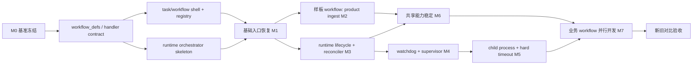
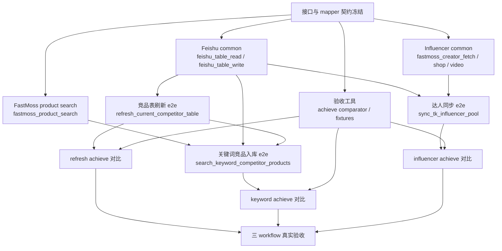

# 重构开发计划

日期: 2026-04-24

状态: 当前执行计划

## 1. 目标

本计划用于指导本轮业务层从 0 到 1 的重构开发顺序、依赖关系和并行开发边界。

本计划遵循以下前提:

- 旧实现已冻结到 `achieve/`，只作为黄金基准和逻辑参考。
- 运行时代码禁止依赖 `achieve/`。
- 重构期间项目不要求持续可运行。
- 新实现必须按目标架构重建:
  - `business/handlers/`
  - `business/workflow_defs/`
  - 新的 `business/flows/`
  - 新的 `business/tasks/`
  - 新的 `business/workflows/`

相关文档:

- [重构验收契约](../arch/rewrite-acceptance-contract.md)
- [当前整体系统架构设计](../arch/current-system-architecture-design.md)
- [四个 Workflow 重设计评审](../arch/workflow-redesign-review.md)
- [Handler Contract 设计](../arch/handler-contract-design.md)

## 2. 当前依赖事实

当前仓库里，真正卡住重构顺序的不是业务逻辑，而是入口层对旧 `business` 目录的硬依赖。

### 2.1 基础入口依赖

当前入口链路:

```text
agent.py / cli.py
  -> registry.py
  -> business.tasks.DEFAULT_TASKS

executor_daemon.py / api_worker_daemon.py / browser_runloop.py / outbox_dispatcher.py
  -> business.flows.refresh_current_competitor_table_flow
  -> execute_* / run_* daemon entrypoints
```

当前直接依赖点:

- [src/automation_business_scaffold/agent.py](/Users/happyzhao/Work/mujitask/src/automation_business_scaffold/agent.py)
- [src/automation_business_scaffold/cli.py](/Users/happyzhao/Work/mujitask/src/automation_business_scaffold/cli.py)
- [src/automation_business_scaffold/registry.py](/Users/happyzhao/Work/mujitask/src/automation_business_scaffold/registry.py)
- [src/automation_business_scaffold/executor_daemon.py](/Users/happyzhao/Work/mujitask/src/automation_business_scaffold/executor_daemon.py)
- [src/automation_business_scaffold/api_worker_daemon.py](/Users/happyzhao/Work/mujitask/src/automation_business_scaffold/api_worker_daemon.py)
- [src/automation_business_scaffold/browser_runloop.py](/Users/happyzhao/Work/mujitask/src/automation_business_scaffold/browser_runloop.py)
- [src/automation_business_scaffold/outbox_dispatcher.py](/Users/happyzhao/Work/mujitask/src/automation_business_scaffold/outbox_dispatcher.py)

结论:

- 基础框架阶段必须先恢复 `task registry` 和 daemon runtime entrypoints。
- 不先补基础层，后面的业务 workflow worktree 没有稳定 contract 可接。

### 2.2 四个 workflow 的共享依赖

根据 [workflow-redesign-review.md](../arch/workflow-redesign-review.md)，四个 workflow 的依赖关系如下:

| Workflow | 必需共享能力 |
| --- | --- |
| `tiktok_fastmoss_product_ingest` | `tiktok_product_request_fetch`、`tiktok_product_browser_fetch`、`fastmoss_product_fetch`、`media_asset_sync`、`fact_bundle_upsert`，可选 `feishu_table_read` / `feishu_table_write` |
| `refresh_current_competitor_table` | `feishu_table_read`、`feishu_table_write`、商品采集链路、`fact_bundle_upsert` |
| `search_keyword_competitor_products` | `fastmoss_product_search`、`feishu_table_write`、商品采集链路、`fact_bundle_upsert` |
| `sync_tk_influencer_pool` | `feishu_table_read`、`feishu_table_write`、`fastmoss_product_fetch`、`fastmoss_creator_fetch`，可扩展 `fastmoss_shop_fetch` / `fastmoss_video_fetch` |

结论:

- `tiktok_fastmoss_product_ingest` 最适合作为第一条样板 workflow。
- `refresh_current_competitor_table` 和 `search_keyword_competitor_products` 共享大量 competitor/product 公共层，适合在公共层 ready 后并行。
- `sync_tk_influencer_pool` 共享 Feishu 读写能力，但其核心 fan-out 和 creator detail 更独立，适合单独 worktree。

## 3. 总体开发策略

建议把这轮开发拆成三条主线，并按波次并行推进:

1. **基础框架主线**
   对应系统架构设计中的 `15.1`。先把 contract、registry、runtime orchestrator 和测试骨架搭起来。
2. **可靠性平台主线**
   对应系统架构设计中的 `15.2 ~ 15.4`。补齐 Runtime lifecycle、Watchdog Scanner、Execution Supervisor、child process / hard timeout。
3. **业务 workflow 主线**
   在基础框架稳定后，按共享能力分层，再用多个 worktree 并行开发各 workflow。

原则:

- 基础框架阶段不按 workflow 分工，而按“架构层”分工。
- `15.2 ~ 15.4` 不再作为“全部 workflow 完成后再补”的远期事项，而是进入本轮正式开发计划。
- 业务阶段不再让多人同时改同一套共享文件；公共层先单独落地，再分 workflow worktree。
- 样板 workflow 跑通后，可以和可靠性平台主线并行推进；但 child runner / hard timeout 合并前，worker 包装层接口必须冻结。

## 4. 关键里程碑

### M0. 基准冻结

已完成:

- `business/flows/achieve/`
- `business/tasks/achieve/`
- `business/workflows/achieve/`

验收:

- `achieve/` 保留黄金基准。
- 运行时代码无 `achieve` import。

### M1. 基础框架可接入

完成标准:

- `business/workflow_defs/` 有稳定模型和 registry。
- `business/handlers/` 有稳定 contract 和 registry。
- `business/tasks/` 恢复 `DEFAULT_TASKS`。
- `business/workflows/` 恢复 framework `WorkflowSpec` 入口。
- `business/flows/` 恢复 daemon 可调用的新 runtime orchestrator entrypoints。
- `agent.py` / `cli.py` / 四个 daemon 可以重新 import。

说明:

M1 不要求四个业务 workflow 全部可跑，但要求基础入口和内部 contract 稳定，足够支撑并行业务开发。

### M2. 第一条样板 workflow 跑通

建议目标:

- 先跑通 `tiktok_fastmoss_product_ingest` 的 direct ingest 路径

原因:

- 单商品链路最短。
- 覆盖 executor / api_worker / browser fallback / fact upsert / outbox 的主路径。
- 能尽早验证 request-first / browser-fallback contract。

### M3. Runtime 生命周期与收敛规则稳定

完成标准:

- `api_worker_job`、`task_execution`、`notification_outbox` 补齐或等价表达:
  - `progress_stage`
  - `last_progress_at`
  - `max_execution_seconds`
  - `error_type`
  - `error_code`
  - `dead_letter_reason`
- parent / child 收敛规则从业务 flow 中抽到显式 reconciler。
- `waiting_children -> ready_for_summary -> completed` 推进规则可以重复执行且保持幂等。
- `outbox sending` 超时、retry、lease reclaim 所需扫描查询和 store API 到位。
- Runtime schema 变更、migration、store contract 和测试一起落地。

说明:

- 这是 `15.2` 和 `15.3` 的共同前置阶段。
- 没有这一步，Watchdog 和 Supervisor 都只能停留在文档层。

### M4. Watchdog / Execution Supervisor 接入

完成标准:

- 抽象统一 `Execution Supervisor`，并接入:
  - `api_worker`
  - `browser_worker`
  - `outbox_dispatcher`
- 统一 heartbeat / retry / error_type / error_code 归类。
- 统一 progress 回报接口和 worker-side 生命周期包装。
- `Watchdog Scanner` 可以处理:
  - running job 扫描
  - lease expired 回收
  - stale progress
  - execution timeout
  - parent `waiting_children` 未收敛
  - outbox `sending` 超时

说明:

- `15.2` 和 `15.3` 在这里进入实际运行链路。
- 这一步完成后，workflow 才真正具备应用层兜底能力。

### M5. 子进程隔离与 hard timeout

完成标准:

- handler 支持在 child process 中执行。
- supervisor 父进程负责 wall-clock timeout / stale-progress timeout 的 kill 与收尾。
- API / browser 长耗时或高风险 handler 有统一 child runner 包装。
- 浏览器资源租约、HTTP 卡死、业务函数不返回等场景能被 kill 后恢复为 retry / failed / dead-letter。

说明:

- 这是系统架构设计中 `15.4` 的正式落地点。
- 这一步不是样板 workflow 跑通的前置条件，但属于“真实卡死问题已被兜底”的验收条件。

### M6. 共享业务能力稳定

完成标准:

- `feishu_table_read`
- `feishu_table_write`
- `tiktok_product_request_fetch`
- `tiktok_product_browser_fetch`
- `fastmoss_product_search`
- `fastmoss_product_fetch`
- `fastmoss_creator_fetch`
- `media_asset_sync`
- `fact_bundle_upsert`

以及第一批 adapter / mapper 接口稳定。

### M7. 四个 workflow 并行开发并完成对比验收

完成标准:

- 四个正式 workflow 都切到新架构
- 新旧行为对比测试通过
- 旧业务专用 handler / flow 不再作为 runtime 主路径

### 4.1 与系统架构设计 15.x 的对应关系

| 系统架构阶段 | 当前重构计划落点 |
| --- | --- |
| `15.1 第一阶段: 统一架构口径` | `M1 基础框架可接入` |
| `15.2 第二阶段: 补齐 Watchdog Scanner` | `M3 Runtime 生命周期与收敛规则稳定` + `M4 Watchdog / Execution Supervisor 接入` |
| `15.3 第三阶段: 标准化 Execution Supervisor` | `M3 Runtime 生命周期与收敛规则稳定` + `M4 Watchdog / Execution Supervisor 接入` |
| `15.4 第四阶段: 子进程隔离与 hard timeout` | `M5 子进程隔离与 hard timeout` |

## 5. 依赖顺序

### 5.1 串行关键路径



必须串行的点:

1. `workflow_defs` 和 `handler contract` 必须先定下来。
2. `registry + task/workflow shell` 和 `runtime orchestrator` 必须在业务开发前稳定。
3. 至少一条样板 workflow 跑通，并且 Runtime lifecycle / reconciler 稳定之后，再全面并行业务开发。
4. `Execution Supervisor` 的 worker 包装接口冻结之后，才能把 child runner / hard timeout 合并进主路径。

### 5.2 可并行的点

基础框架阶段可并行:

- `workflow_defs` 模型与 registry
- `handler registry` 与 handler protocol
- `task/workflow` framework 壳
- 对比测试和契约测试

可靠性平台阶段可并行:

- Runtime lifecycle 字段、store、migration、reconciler
- Supervisor 包装层与 worker 接入
- Watchdog 扫描器和兜底动作
- child runner / hard timeout 骨架

业务阶段可并行:

- `selection analysis`
- `competitor refresh`
- `keyword competitor search`
- `influencer pool sync`

但前提是共享 handler / adapter contract 已稳定。

## 6. 平台阶段的并行开发拆分

这一阶段最适合用 subagent，因为写入范围可以切得比较干净。

### 6.1 基础框架 Lane

### Lane F1: WorkflowDefinition 核心

所有权:

- `src/automation_business_scaffold/business/workflow_defs/**`

内容:

- `WorkflowDefinition`
- `StageDefinition`
- `JobDefinition`
- transition / summary / idempotency policy
- workflow registry

依赖:

- 只依赖文档 contract，不依赖具体业务实现

可并行:

- 可与 F2、F3 并行

### Lane F2: Handler Contract 与 Registry

所有权:

- `src/automation_business_scaffold/business/handlers/**`

内容:

- `HandlerContext`
- payload / result / error contract
- `api` / `browser` / `outbox` registry
- allowlist enforcement

依赖:

- 依赖 `handler-contract-design.md`

可并行:

- 可与 F1、F3 并行

### Lane F3: Framework Entry Shell

所有权:

- `src/automation_business_scaffold/business/tasks/**`
- `src/automation_business_scaffold/business/workflows/**`
- `src/automation_business_scaffold/registry.py`

内容:

- 新的 `DEFAULT_TASKS`
- 四个正式 task 的 framework 入口
- workflow spec builder
- CLI / agent 可重新通过 task registry 发现任务

依赖:

- 依赖 F1 的 workflow defs 稳定 shape

### Lane F4: Runtime Orchestrator Core

所有权:

- `src/automation_business_scaffold/business/flows/**`
- `src/automation_business_scaffold/executor_daemon.py`
- `src/automation_business_scaffold/api_worker_daemon.py`
- `src/automation_business_scaffold/browser_runloop.py`
- `src/automation_business_scaffold/outbox_dispatcher.py`

内容:

- executor orchestrator
- api worker dispatch
- browser worker dispatch
- outbox dispatch
- reconciler / parent update / summary finalize

依赖:

- 依赖 F1、F2

说明:

- 这是基础框架阶段的关键路径。
- 不建议把 F4 再拆得太碎，否则接口来回抖动。

### Lane F5: 契约测试与对比测试骨架

所有权:

- `tests/test_rewrite_contract.py`
- 新的 comparator / integration tests

内容:

- runtime 不得 import `achieve`
- handler allowlist test
- workflow definition contract test
- baseline comparator harness

依赖:

- 可先并行搭空壳
- 最终依赖 F1、F2、F3、F4 落实

### 6.2 可靠性平台 Lane

### Lane R1: Runtime Lifecycle 与 Reconciler

所有权:

- `src/automation_business_scaffold/infrastructure/runtime/**`
- `src/automation_business_scaffold/business/flows/runtime_*`
- Runtime lifecycle 相关 tests / migration

内容:

- `progress_stage`
- `last_progress_at`
- `max_execution_seconds`
- `error_type` / `error_code`
- `dead_letter_reason`
- parent / child 收敛查询
- `waiting_children -> ready_for_summary -> completed` 显式 reconciler
- `notification_outbox` sending timeout / retry / reclaim store API

依赖:

- 依赖 F4 的基础 runtime orchestrator 和 store 主路径稳定

可并行:

- 可与样板 workflow 的功能开发并行
- 可与 R2 的接口草拟并行

### Lane R2: Execution Supervisor

所有权:

- worker 执行包装层
- `src/automation_business_scaffold/business/flows/**`
- `src/automation_business_scaffold/api_worker_daemon.py`
- `src/automation_business_scaffold/browser_runloop.py`
- `src/automation_business_scaffold/outbox_dispatcher.py`

内容:

- 统一 `supervise(job)` 执行壳
- heartbeat loop
- progress callback / stage callback
- retry 分类和标准化 `error_type`
- API / browser / outbox 三类 worker 的统一接入边界

依赖:

- 依赖 R1 的生命周期字段和状态枚举稳定

可并行:

- 可与 R3 并行
- 不建议与 R4 在同一写入范围同时推进

### Lane R3: Watchdog Scanner

所有权:

- 新的 watchdog scanner 模块 / entrypoint
- Runtime scan query
- Watchdog 相关 tests

内容:

- 扫描 running job
- 回收 lease expired
- 识别 stale progress
- 识别 execution timeout
- 修复 parent `waiting_children` 未收敛
- 修复 outbox `sending` 超时
- 统一 repair action / retry action / fail action

依赖:

- 依赖 R1
- 最好复用 R2 的错误分类和状态落库规则

可并行:

- 可与共享业务能力和 workflow 迁移并行
- 但主路径行为合并前要与 R2 对齐 error / retry 口径

### Lane R4: Child Runner / Hard Timeout

所有权:

- 新的 child runner 模块
- Supervisor 集成层
- 浏览器资源清理 / kill 后收尾 hooks

内容:

- handler child process 执行
- parent supervisor kill 超时 child
- wall-clock timeout
- stale-progress timeout 升级为 kill
- kill 后的 retry / failed / dead-letter 收尾

依赖:

- 依赖 R2
- 可选依赖 R3 的 process registry / repair action

说明:

- 这是 `15.4` 的专门实现 lane。
- 不阻塞样板 workflow 功能落地，但阻塞“真实卡死已被兜底”的最终验收。

## 7. 平台阶段的推荐 subagent 分工

建议分两波使用 subagent。

### 7.1 第一波: 基础框架

建议最多 4 个并行开发位:

| Subagent | 负责范围 | 写入范围 |
| --- | --- | --- |
| A | `workflow_defs` | `business/workflow_defs/**` |
| B | `handlers` contract / registry | `business/handlers/**` |
| C | `tasks` / `workflows` / `registry.py` | `business/tasks/**`、`business/workflows/**`、`registry.py` |
| D | runtime orchestrator | `business/flows/**`、4 个 daemon |

主线程负责:

- 定 contract
- 合并 A/B/C/D 的接口
- 处理跨模块冲突
- 决定 milestone gate 是否通过

### 7.2 第二波: 可靠性平台

建议最多 4 个并行开发位:

| Subagent | 负责范围 | 写入范围 |
| --- | --- | --- |
| E | runtime lifecycle / reconciler | `infrastructure/runtime/**`、`business/flows/runtime_*`、相关 tests |
| F | execution supervisor | worker 包装层、`business/flows/**`、`api_worker_daemon.py`、`browser_runloop.py`、`outbox_dispatcher.py` |
| G | watchdog scanner | watchdog 模块、runtime scan query、watchdog tests |
| H | child runner / hard timeout | child runner 模块、supervisor 集成、kill/cleanup tests |

说明:

- 如果人手有限，优先顺序是 `E -> F -> G -> H`。
- `H` 最适合在 `F` 的接口冻结后启动。

## 8. 业务阶段的 worktree 切分

业务阶段不建议继续多人在同一个主 worktree 里改。此时应该切到多个 git worktree。

前提不是只有基础框架完成，还需要满足:

- `M2`: 至少一条样板 workflow 已经跑通
- `M3`: Runtime lifecycle / reconciler contract 已稳定

`M4`、`M5` 可以与业务 workflow 迁移并行，但 worker 执行包装层接口不应继续大幅变动。

最优切法不是“四个 workflow 一上来各开一棵树”，而是:

- `1 个公共层 worktree`
- `3 个主业务 worktree`
- `1 个扩展业务 worktree`

原因:

- `refresh_current_competitor_table` 和 `search_keyword_competitor_products` 共用竞品表 source / projection / product collection 公共层。
- `tiktok_fastmoss_product_ingest` 最独立，适合作为第一条样板线。
- `sync_tk_influencer_pool` 共享 Feishu / FastMoss / Fact 能力，但业务编排更独立。
- `search_keyword_competitor_products` 最适合作为竞品家族扩展，在竞品公共层稳定后接入。

### 8.1 共享能力 worktree

这是 workflow 并行前的公共层。

#### WT-S1: Feishu Common

负责:

- `feishu_table_read`
- `feishu_table_write`
- table adapter interface
- projection mapper interface

建议所有权:

- `business/handlers/api/feishu_*`
- `business/handlers/common/adapter_*`
- 与 Feishu 相关的公共 tests

#### WT-S2: Product Collection Common

负责:

- `tiktok_product_request_fetch`
- `tiktok_product_browser_fetch`
- `fastmoss_product_fetch`
- `media_asset_sync`
- `fact_bundle_upsert`

建议所有权:

- `business/handlers/api/tiktok_*`
- `business/handlers/browser/tiktok_*`
- `business/handlers/api/fastmoss_product_*`
- `business/handlers/api/media_asset_sync.py`
- `business/handlers/api/fact_bundle_upsert.py`

#### WT-S3: Influencer Common

负责:

- `fastmoss_creator_fetch`
- 可选 `fastmoss_shop_fetch`
- 可选 `fastmoss_video_fetch`

建议所有权:

- `business/handlers/api/fastmoss_creator_*`
- `business/handlers/api/fastmoss_shop_*`
- `business/handlers/api/fastmoss_video_*`

#### WT-S4: Competitor Search Common

负责:

- `fastmoss_product_search`
- candidate normalization / filter contract

说明:

- 这是 `search_keyword_competitor_products` 的前置公共能力。

### 8.2 Workflow worktree

共享能力 worktree 合并后，再开 workflow worktree。

#### WT-W1: `tiktok_fastmoss_product_ingest`

依赖:

- WT-S2
- 可选 WT-S1

最小交付:

- direct ingest 路径
- request-first / browser-fallback
- facts + media

第二步:

- `TK选品收集` table mode

说明:

- 这是第一条建议落地的 workflow。

#### WT-W2: `refresh_current_competitor_table`

依赖:

- WT-S1
- WT-S2

最小交付:

- 读竞品表
- fan-out 商品采集
- 竞品表投影写回

#### WT-W3: `sync_tk_influencer_pool`

依赖:

- WT-S1
- WT-S3
- 部分依赖 WT-S2 的商品上下文

最小交付:

- 读竞品候选
- 发现达人
- 采集达人详情
- 写入达人池
- 回写竞品状态

#### WT-W4: `search_keyword_competitor_products`

依赖:

- WT-S1
- WT-S2
- WT-S4
- 已合并的 `refresh_current_competitor_table` 公共竞品层

最小交付:

- FastMoss 搜索候选
- candidate filter
- 写入种子行
- 复用竞品商品采集和投影写回链路

## 9. 推荐并行布局

建议按下面的布局并行，而不是直接开 4 条 workflow 线:

1. `platform-runtime-lifecycle`
2. `platform-supervisor-watchdog`
3. `platform-child-runner`
4. `shared-business-common`
5. `selection analysis`
6. `competitor refresh`
7. `influencer pool`
8. `keyword competitor`

也就是:

```text
3 个平台层 worktree
+ 1 个公共层 worktree
+ 3 个主业务 worktree
+ 1 个扩展业务 worktree
```

其中:

- 平台层 worktree:
  - `runtime lifecycle / reconciler`
  - `supervisor / watchdog`
  - `child runner / hard timeout`
- 主业务 worktree:
  - `tiktok_fastmoss_product_ingest`
  - `refresh_current_competitor_table`
  - `sync_tk_influencer_pool`
- 扩展业务 worktree:
  - `search_keyword_competitor_products`

原因:

- `keyword competitor` 对 `competitor refresh` 的公共层依赖最强。
- `product ingest` 和 `influencer pool` 更适合在公共 handler contract 稳定后独立推进。

## 10. 推荐合并顺序

### Phase A: 基础框架

1. `workflow_defs`
2. `handlers` registry / contract
3. `tasks` / `workflows` / `registry`
4. `runtime orchestrator`
5. 契约测试 / comparator harness

### Phase B: 可靠性平台

1. `Runtime Lifecycle / Reconciler`
2. `Execution Supervisor`
3. `Watchdog Scanner`
4. `Child Runner / Hard Timeout`

### Phase C: 共享业务能力

1. `Product Collection Common`
2. `Feishu Common`
3. `Competitor Search Common`
4. `Influencer Common`

### Phase D: Workflow

1. `tiktok_fastmoss_product_ingest`
2. `refresh_current_competitor_table`
3. `sync_tk_influencer_pool`
4. `search_keyword_competitor_products`

说明:

- `tiktok_fastmoss_product_ingest` 先落地，是因为它最适合作为新架构样板。
- `refresh_current_competitor_table` 应先于 `search_keyword_competitor_products` 合并，因为后者更依赖竞品公共层。
- `sync_tk_influencer_pool` 可以和 `refresh_current_competitor_table` 并行开发，但合并时通常放在竞品公共层稳定之后更稳。

## 11. 建议的 worktree 命名

可直接按下面的名字开:

- `codex/framework-core`
- `codex/framework-tests`
- `codex/platform-runtime-lifecycle`
- `codex/platform-supervisor-watchdog`
- `codex/platform-child-runner`
- `codex/shared-business-common`
- `codex/wf-selection-analysis`
- `codex/wf-competitor-refresh`
- `codex/wf-influencer-pool`
- `codex/wf-keyword-competitor`

说明:

- 如果团队人手更多，也可以把 `codex/shared-business-common` 再拆成 `shared-feishu-common`、`shared-product-collection`、`shared-influencer-common`。
- 但第一轮建议先用一个公共层 worktree，避免公共 contract 过早分裂。

## 12. 每个阶段的完成判定

### Gate G1: 基础框架完成

至少满足:

- `agent.py`、`cli.py`、四个 daemon 的 import 恢复
- `DEFAULT_TASKS` 恢复
- handler registry 可按 allowlist 路由
- workflow definition 能驱动 executor/reconciler

### Gate G2: 第一条 workflow 完成

至少满足:

- `tiktok_fastmoss_product_ingest` direct ingest 跑通
- request-first / browser-fallback 行为符合 contract
- fact upsert / media sync / outbox 路径可验证

### Gate G3: Runtime 生命周期与收敛规则完成

至少满足:

- `progress_stage` / `last_progress_at` / `error_type` / `dead_letter_reason` 已进入 runtime store contract
- reconciler 可以幂等推进 `waiting_children -> ready_for_summary`
- outbox sending timeout / retry / reclaim 查询和动作可验证

### Gate G4: Supervisor / Watchdog 完成

至少满足:

- `api_worker`、`browser_worker`、`outbox_dispatcher` 已统一接入 `Execution Supervisor`
- Watchdog 可以处理 lease expired、stale progress、execution timeout、orphan running
- worker 崩溃后 job 可自动重试或进入终态

### Gate G5: Child Process / Hard Timeout 完成

至少满足:

- handler 可在 child process 中执行
- parent supervisor 可 kill 超时 child
- 卡死的 HTTP / browser / business handler 不会无限占住运行位

### Gate G6: 公共层稳定

至少满足:

- Feishu、product collection、search、influencer common contract 固定
- 业务 worktree 不再频繁修改基础 contract

### Gate G7: 全量验收

至少满足:

- 四个 workflow 都完成
- 新旧行为对比测试通过
- `achieve` 仅作为基准，不参与 runtime import

### 12.1 当前完成状态

更新时间: 2026-04-24

| Gate | 当前状态 | 说明 |
| --- | --- | --- |
| G1 基础框架 | 完成 | `DEFAULT_TASKS`、workflow entrypoints、workflow definitions、handler registry、runtime orchestrator 主入口已恢复。 |
| G2 第一条样板 workflow | 基本完成 | `tiktok_fastmoss_product_ingest` 已覆盖 direct ingest、request-first、browser fallback、fact upsert、outbox 和 child timeout 收敛；仍需跟随真实 handler 完整度继续补强。 |
| G3 Runtime 生命周期与收敛规则 | 完成 | Runtime 表已具备 `progress_stage`、`last_progress_at`、`max_execution_seconds`、`error_type`、`error_code`、`dead_letter_reason` 等生命周期字段；parent/child 收敛和 outbox retry/reclaim 已有测试覆盖。 |
| G4 Supervisor / Watchdog | 完成 | `api_worker`、`browser_worker`、`outbox_dispatcher` 已统一接入 Execution Supervisor；Watchdog 已覆盖 lease expired、stale progress、execution timeout、waiting_children repair、outbox sending timeout。 |
| G5 Child Process / Hard Timeout | 完成 | worker handler 主路径默认 child process；hard timeout 优先读取 Runtime DB `max_execution_seconds`，并已有 `child timeout -> retry_wait -> failed -> parent waiting_children 释放 -> executor 收敛 -> completion outbox` e2e 覆盖。 |
| G6 公共层稳定 | 部分完成 | handler contract / allowlist 已稳定；`tiktok_product_request_fetch`、`tiktok_product_browser_fetch`、`fastmoss_product_fetch`、`media_asset_sync`、`fact_bundle_upsert` 已绑定实现；`feishu_table_read`、`feishu_table_write`、`fastmoss_product_search`、`fastmoss_creator_fetch`、`fastmoss_shop_fetch`、`fastmoss_video_fetch` 仍需补真实实现和默认绑定。 |
| G7 全量验收 | 未完成 | 四个 workflow 已有 runtime integration 基础覆盖，但还没有全部完成新旧 `achieve` 行为对比验收。 |

当前结论:

- 架构平台能力已经基本完成，可以支撑继续业务重构。
- 业务开发尚未全量完成，下一阶段重点是补齐通用 handler、补 workflow e2e 和完成新旧行为对比。

当前 backlog:

1. 补齐通用 handler 的真实实现和默认绑定，优先级为 `feishu_table_read`、`feishu_table_write`、`fastmoss_product_search`、`fastmoss_creator_fetch`。
2. 按 workflow 补完整 e2e: `refresh_current_competitor_table`、`search_keyword_competitor_products`、`sync_tk_influencer_pool`。
3. 建立新旧 `achieve` 行为对比验收，覆盖关键输入、Runtime 中间状态、Fact/Storage 副作用和最终 outbox/飞书投影输出。
4. 扩展 browser worker 与 outbox dispatcher 的 child timeout e2e，覆盖更多 worker 类型。

### 12.2 真实业务可用开发依赖与并行计划

本节描述三个主业务 workflow 达到真实生产可用所需的剩余开发依赖。这里的“可用”不是仅指 runtime integration test 通过，而是指真实外部系统、Fact DB、MinIO、飞书投影和 `achieve` 对比验收都能闭环。

三个主业务 workflow:

- `refresh_current_competitor_table`
- `search_keyword_competitor_products`
- `sync_tk_influencer_pool`

依赖关系总览:



工作包拆分:

| 工作包 | 内容 | 依赖 | 可并行性 | 完成信号 |
| --- | --- | --- | --- | --- |
| P0 契约冻结 | 固定 Feishu adapter、FastMoss search、creator fetch、Fact projection、achieve comparator 的 payload/result 样例 | 无 | 串行优先，避免后续 worktree 反复改 contract | `docs/arch/handler-contract-design.md` 与 workflow payload 示例不再频繁变动 |
| P1 Feishu common | 实现并默认绑定 `feishu_table_read` / `feishu_table_write`；支持表级 adapter / projection mapper、批量读写、幂等、错误分类 | P0 | 可与 P2 / P3 / P4 并行，但 read/write 内部建议同一 worktree 完成 | refresh / keyword / influencer 都能用同一 handler 读写飞书测试表 |
| P2 FastMoss search | 实现并默认绑定 `fastmoss_product_search`；支持 keyword、filter、condition、分页、候选商品标准输出 | P0 | 可与 P1 / P3 / P4 并行 | keyword workflow 能拿到候选商品并生成 seed row payload |
| P3 Influencer common | 实现并默认绑定 `fastmoss_creator_fetch`；按实际需要补 `fastmoss_shop_fetch` / `fastmoss_video_fetch`；补达人事实、关系、观测映射 | P0 | 可与 P1 / P2 / P4 并行 | 达人详情能写入 Fact DB，并生成达人池飞书写入 payload |
| P4 验收工具 | 建立 `achieve` 对比 harness、固定 fixture、输出差异报告；禁止 runtime import `achieve` | P0 | 可与 P1 / P2 / P3 并行 | 能对单个 workflow 跑新旧输入、状态、输出对比 |
| P5 Refresh workflow | 补真实竞品表刷新 e2e: 飞书读取 -> 商品采集 -> media/fact -> 飞书写回 | P1，既有 product/media/fact handler | 可与 P7 并行；P6 依赖 P5 的竞品详情链路 | 飞书测试表能完成真实读写，Fact/MinIO/outbox 可核验 |
| P6 Keyword workflow | 补真实关键词竞品入库 e2e: FastMoss 搜索 -> 飞书 seed row -> 复用竞品详情采集 -> 写回 | P1、P2、P5 的详情采集链路 | P2 完成后可先做搜索与 seed；完整验收需等待 P5 | 关键词输入能产生竞品表 seed，并完成详情补全 |
| P7 Influencer workflow | 补真实达人同步 e2e: 飞书源表 -> 商品/达人采集 -> Fact DB -> 达人池写入 -> 源表状态写回 | P1、P3 | 可与 P5 并行 | 达人池飞书表和源表状态都能真实写回 |
| P8 对比验收 | 对 refresh / keyword / influencer 分别做新旧 `achieve` 行为对比 | P4、P5、P6、P7 | 三个 workflow 的对比可并行，最终验收串行汇总 | 三份对比报告通过，差异要么消除要么有 contract 解释 |
| P9 可靠性补强 | 扩展 browser worker / outbox dispatcher child timeout e2e；补真实环境失败重试样例 | G5 已完成主路径 | 可与业务 e2e 并行 | 非 API worker 的 timeout/retry/failed 路径也有 e2e 覆盖 |

P0 契约冻结产物:

| 契约 | 冻结位置 | 后续 worktree 消费方式 |
| --- | --- | --- |
| `feishu_table_read` / `feishu_table_write` payload/result | [handler-contract-design.md](../arch/handler-contract-design.md) 5.1、5.3、5.4 | P1 实现 Feishu common 时按 `source_table_ref`、`raw_rows/source_rows`、`records`、行级写入结果兼容实现 |
| `fastmoss_product_search` payload/result | [handler-contract-design.md](../arch/handler-contract-design.md) 6.3、[workflow-competitor-table-design.md](../arch/workflow-competitor-table-design.md) 7.3 | P2 实现关键词搜索时输出标准 candidate，seed 行由 `competitor_seed_projection_mapper` 处理 |
| `fastmoss_creator_fetch` payload/result | [handler-contract-design.md](../arch/handler-contract-design.md) 6.5.1、[workflow-influencer-pool-sync-design.md](../arch/workflow-influencer-pool-sync-design.md) 11.3 | P3 实现达人详情时输出 `entities/relations/observations/media_refs/raw_response_refs`，过渡期可保留兼容别名 |
| Fact projection | [handler-contract-design.md](../arch/handler-contract-design.md) 6.7.1、[workflow-competitor-table-design.md](../arch/workflow-competitor-table-design.md) 7.2 | P5/P6/P7 只消费 projection context，不让 `fact_bundle_upsert` 直接写飞书 |
| `achieve` comparator | [rewrite-acceptance-contract.md](../arch/rewrite-acceptance-contract.md) 8 | P4/P8 实现只读 comparator/harness；runtime 主路径禁止 import `achieve` 和 comparator |

P0 明确不交付:

- 不实现生产 handler。
- 不默认绑定未实现 handler。
- 不修改 Runtime DB schema 或 runtime 主路径。
- 不新增业务专用 handler/job 名称。

阶段计划:

| 阶段 | 串行 / 并行 | 目标 | 可开启 worktree |
| --- | --- | --- | --- |
| S0 契约冻结 | 串行 | 先冻结 P0，明确 payload/result/mapper/comparator 边界，减少后续冲突 | 1 个文档/contract worktree |
| S1 通用能力并行开发 | 并行 | P1、P2、P3、P4 同时推进；P1 是三条 workflow 的共同关键依赖 | 4 个 worktree: `feishu-common`、`fastmoss-search`、`influencer-common`、`acceptance-harness` |
| S2 workflow e2e 第一轮 | 部分并行 | P5 refresh 和 P7 influencer 可并行；P6 keyword 可先做 search/seed，完整详情复用需等待 P5 稳定 | 3 个 worktree: `workflow-refresh-e2e`、`workflow-influencer-e2e`、`workflow-keyword-seed` |
| S3 workflow e2e 收敛 | 串行 + 并行 | 先合并 P5 的详情链路，再让 P6 完整复用；P7 可继续独立收敛 | 2 个 worktree: `workflow-keyword-e2e`、`workflow-influencer-polish` |
| S4 新旧行为对比 | 并行 | P8 按三个 workflow 并行生成对比报告和测试；最终由主窗口汇总差异 | 3 个 worktree: `compare-refresh`、`compare-keyword`、`compare-influencer` |
| S5 真实验收收口 | 串行 | 汇总三条 workflow 的真实环境冒烟、对比报告、失败重试样例，更新 G6/G7 状态 | 主窗口收口 |

并行开发边界:

- P1 Feishu common 修改 `handlers/api`、Feishu infrastructure、Feishu adapter/mapper 测试；不要修改具体 workflow stage 规则。
- P2 FastMoss search 修改 FastMoss search handler、接口 reference、search payload/result 测试；不要修改 Feishu 写入 mapper。
- P3 Influencer common 修改 creator/shop/video handler 和 Fact 映射；不要修改 refresh / keyword workflow。
- P4 验收工具只读 `achieve`，输出 comparator/harness；禁止把 `achieve` 导入 runtime 主路径。
- P5/P6/P7 workflow worktree 可以修改各自 `runtime_*`、workflow_defs 和对应 tests，但不要改 handler contract，除非先回到 P0 更新契约。

推荐合并顺序:

1. P0 契约冻结。
2. P1 Feishu common，因为三条 workflow 都依赖它。
3. P2 FastMoss search 与 P3 Influencer common，可按完成度并入。
4. P4 验收工具，可在不影响 runtime 的情况下提前并入。
5. P5 Refresh workflow，作为 keyword 后续详情补全的基础链路。
6. P7 Influencer workflow，可与 P5 相近时间并入。
7. P6 Keyword workflow 完整链路。
8. P8 对比验收与 P9 可靠性补强。

## 13. 一句话建议

你的判断是对的，但现在需要把“基础框架并行”升级成“基础框架 + 可靠性平台 + 业务 workflow 三线并行”。

- **基础框架适合用 subagent 并行开发**
- **`15.2 ~ 15.4` 需要作为可靠性平台主线并行推进**
- **具体业务适合在基础框架 ready 后，用多个 worktree 按 workflow 并行开发**

但最稳的切法是:

- **先完成 foundation + runtime lifecycle**
- **再并行 supervisor / watchdog 与公共层**
- **然后并行 3 条主业务线**
- **最后接 1 条竞品扩展线和 child runner 收口**
