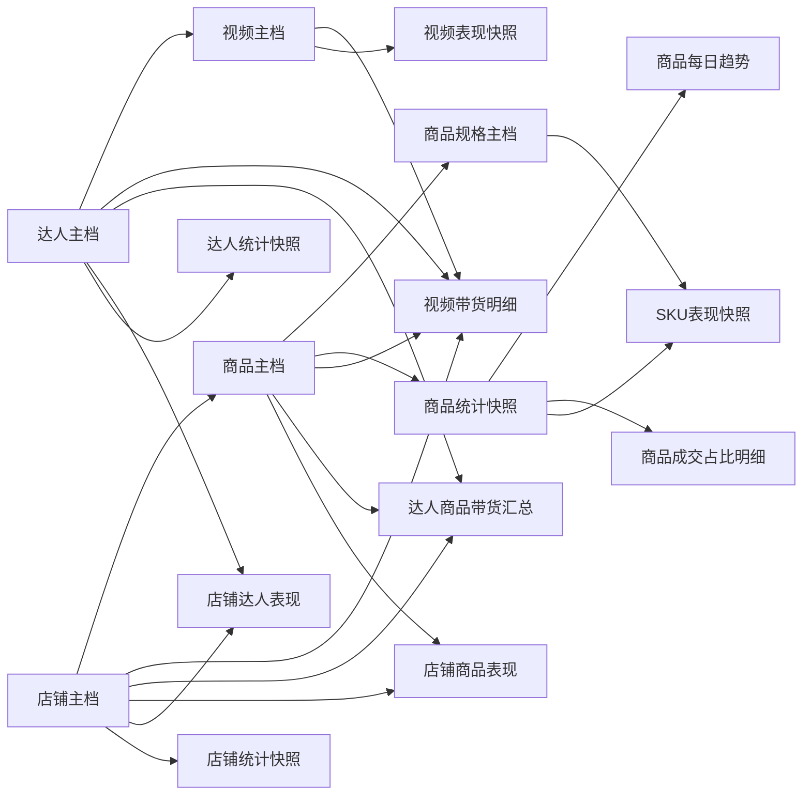

# FastMoss 四主体接口与关系设计

> 状态: Reference 文档。事实库正式 schema 以 [../arch/fact-db-schema-design.md](../arch/fact-db-schema-design.md) 为准；本文保留为 FastMoss 接口和建模参考。

更新时间：`2026-04-20`

本文基于 Roxy 浏览器真实打开以下 FastMoss 页面后抓到的接口请求，整理商品、达人、视频、店铺四类主体的接口结构和落表关系设计。

样例页面：

| 主体 | FastMoss 页面 | 主 ID |
| --- | --- | --- |
| 商品 | `https://www.fastmoss.com/zh/e-commerce/detail/1732183068040729370` | `product_id=1732183068040729370` |
| 达人 | `https://www.fastmoss.com/zh/influencer/detail/7094679250578015274` | `uid=7094679250578015274` |
| 视频 | `https://www.fastmoss.com/zh/media-source/video/7623147954093690143` | `video_id=7623147954093690143` |
| 店铺 | `https://www.fastmoss.com/zh/shop-marketing/detail/7496166867916327706` | `seller_id=7496166867916327706` |

本轮抓包原始结果保存在：

```text
runtime/manual_debug/roxy_fastmoss_relationship_20260420/
```

其中 `relationship_extract.json` 是对四个主体关系字段的整理版。

## 1. 核心结论

这四个页面不是孤立页面，FastMoss 已经在多个接口里交叉返回了主体关系。

样例真实关系：

| 关系 | 真实值 |
| --- | --- |
| 商品归属店铺 | 商品 `1732183068040729370` 归属店铺 `7496166867916327706`，店铺名 `SesionafimHome` |
| 视频归属达人 | 视频 `7623147954093690143` 由达人 `7094679250578015274` 发布，账号 `rebeccatriedit` |
| 视频带货商品 | 视频 `7623147954093690143` 带货商品 `1732183068040729370` |
| 视频带货表现 | 该视频对该商品贡献销量 `174`，GMV `$2421.05` |
| 达人带货商品 | 达人 `7094679250578015274` 对商品 `1732183068040729370` 贡献销量 `174`，GMV `$2421.05` |
| 店铺合作达人 | 店铺 `7496166867916327706` 下存在达人 `7094679250578015274` 的带货表现 |

因此设计上不要把“达人直接塞到商品表里”或“商品直接塞到达人表里”。更合理的方式是：

- `视频主档` 直接关联 `达人主档`，因为一个 TikTok 视频通常只有一个发布账号。
- `商品主档` 直接关联 `店铺主档`，因为当前 TikTok 商品默认有一个 seller。
- `商品` 和 `视频` 是多对多，用 `视频带货明细` 承接。
- `达人` 和 `商品` 是多对多，用 `达人商品带货汇总` 承接。
- `店铺` 和 `达人` 是多对多，用 `店铺达人表现` 或 `达人建联记录` 承接，区分数据表现和业务跟进。

## 2. 页面接口清单

### 2.1 通用接口

这些接口会在多个详情页出现，主要用于账号、权限、地区、收藏状态、通知，不建议进入业务主表。

| 接口 | 用途 |
| --- | --- |
| `/api/user/user` | 当前 FastMoss 用户状态 |
| `/api/user/index/userInfo` | 用户订阅/权限信息 |
| `/api/user/userPayTrial` | 试用或付费状态 |
| `/api/info/handle` | 页面配置/权限提示 |
| `/api/info/pagerInfo` | 页面信息 |
| `/api/author/index/country` | 国家/地区选项 |
| `/api/collect/collectStatus` | 当前主体是否收藏 |
| `/api/export/getExportTimes` | 导出次数 |
| `/api/notify/index` | 通知 |
| `/api/ai/omni/getUserCards` | AI 卡片 |
| `/api/info/bannerList` | 店铺页横幅 |
| `/api/info/appletBanner` | 店铺页小程序横幅 |

### 2.2 商品详情页接口

| 接口 | 业务含义 | 建议落表 |
| --- | --- | --- |
| `/api/goods/v3/base?product_id=<product_id>` | 商品基础信息和店铺基础信息 | `商品主档`、`店铺主档` |
| `/api/goods/v3/overview?product_id=<product_id>&d_type=28` | 28 天汇总、每日趋势、成交渠道/内容/投放占比 | `商品统计快照`、`每日销量趋势`、`成交占比明细` |
| `/api/goods/v3/productSku?product_id=<product_id>&d_type=28` | SKU 清单、SKU 销量/GMV/库存分布、主销 SKU | `商品规格主档`、`SKU表现快照` |
| `/api/goods/v3/video?product_id=<product_id>&date_type=28` | 带货视频列表，包含视频、达人、商品、店铺和销售表现 | `视频主档`、`达人主档`、`视频带货明细` |
| `/api/goods/v3/author?product_id=<product_id>` | 带货达人列表，包含达人对该商品的销量/GMV和代表视频 | `达人主档`、`达人商品带货汇总` |
| `/api/goods/v3/live?product_id=<product_id>&d_type=28` | 商品相关直播 | `直播带货明细`，当前可选 |
| `/api/goods/V3/adsVideo?product_id=<product_id>&d_type=28` | 商品广告视频 | `视频带货明细`，标记 `是否广告` |
| `/api/goods/V3/investment?product_id=<product_id>&d_type=28` | 商品招商/佣金相关信息 | `商品主档` 或 `商品统计快照` 补充 |
| `/api/goods/reviewList?product_id=<product_id>` | 商品评论样例 | `商品评论明细`，当前可选 |
| `/api/goods/v3/authorChart?product_id=<product_id>` | 商品关联达人趋势或结构 | 视字段补充到达人分析层 |

商品基础结构：

| JSON 路径 | 含义 | 示例值 |
| --- | --- | --- |
| `data.product.title` | 商品标题 | `30 Pcs Graduation Cap Candy Boxes...` |
| `data.product.real_price` | 前台价格范围 | `$14.50 - 18.97` |
| `data.product.floor_price` | 最低价 | `14.50` |
| `data.product.product_rating` | 商品评分 | `4.7` |
| `data.product.review_count` | 评论数 | `61` |
| `data.product.sold_count` | 商品累计销量 | `1056` |
| `data.product.sale_amount` | 商品累计 GMV | `15706.66` |
| `data.product.author_count` | 关联达人数 | `46` |
| `data.product.aweme_count` | 关联视频数 | `113` |
| `data.product.live_count` | 关联直播数 | `0` |
| `data.product.commission_rate` | 佣金率 | `8%` |
| `data.product.stock_count` | 当前库存 | `999` |
| `data.product.detail_url` | TikTok 商品链接 | TikTok PDP URL |
| `data.shop.seller_id` | 店铺 ID | `7496166867916327706` |
| `data.shop.name` | 店铺名称 | `SesionafimHome` |
| `data.shop.region` | 站点 | `US` |

商品 28 天概览结构：

| JSON 路径 | 含义 | 示例值 |
| --- | --- | --- |
| `data.overview.sold_count` | 窗口销量 | `886` |
| `data.overview.sale_amount` | 窗口 GMV | `13149.45` |
| `data.overview.avg_sold_count` | 日均销量 | `31` |
| `data.overview.avg_sale_amount` | 日均 GMV | `469` |
| `data.overview.video_sold_count` | 短视频销量 | `714` |
| `data.overview.video_sale_amount` | 短视频 GMV | `10528.46` |
| `data.overview.price` | 窗口均价/当前展示价 | `$14.84` |
| `data.chart_list[].dt` | 趋势日期 | `YYYY-MM-DD` |
| `data.chart_list[].inc_sold_count` | 当日销量 | 数字 |
| `data.chart_list[].inc_sale_amount` | 当日 GMV | 数字 |
| `data.channel_distribution` | 成交渠道占比 | 达人联盟、商品卡、店铺账号 |
| `data.content_distribution` | 成交内容占比 | 短视频、直播、商品卡 |
| `data.ads_distribution` | 成交投放占比 | 广告流量、非广告流量 |

商品视频列表关键结构：

| JSON 路径 | 含义 |
| --- | --- |
| `data.list[].product_id` | 商品 ID |
| `data.list[].video_id` | 视频 ID |
| `data.list[].uid` | 达人 UID |
| `data.list[].seller_id` | 店铺 Seller ID |
| `data.list[].is_ad` | 是否广告 |
| `data.list[].sold_count` | 该视频带该商品销量 |
| `data.list[].sale_amount` | 该视频带该商品 GMV |
| `data.list[].play_count` | 视频播放量 |
| `data.list[].estimate_cost_amount` | 预估投放成本 |
| `data.list[].roas` | ROAS |
| `data.list[].author.*` | 达人信息 |
| `data.list[].video.*` | 视频描述、封面、时长 |

商品达人列表关键结构：

| JSON 路径 | 含义 |
| --- | --- |
| `data.list[].product_id` | 商品 ID |
| `data.list[].uid` | 达人 UID |
| `data.list[].unique_id` | TikTok 账号名 |
| `data.list[].nickname` | 达人昵称 |
| `data.list[].sold_count` | 该达人带该商品销量 |
| `data.list[].sale_amount` | 该达人带该商品 GMV |
| `data.list[].start_promoting` | 开始推广时间 |
| `data.list[].videos[]` | 代表视频列表 |

### 2.3 达人详情页接口

| 接口 | 业务含义 | 建议落表 |
| --- | --- | --- |
| `/api/author/v3/detail/baseInfo?uid=<uid>` | 达人基础信息 | `达人主档` |
| `/api/author/v3/detail/getStatInfo?uid=<uid>` | 达人内容和带货汇总指标 | `达人统计快照` |
| `/api/author/v3/detail/authorIndex?uid=<uid>` | 达人排名、流量指数、带货指数 | `达人统计快照` |
| `/api/author/v3/detail/cargoSummary?uid=<uid>` | 达人带货商品/店铺/GMV 汇总 | `达人统计快照` |
| `/api/author/v3/detail/videoList?uid=<uid>&date_type=28` | 达人视频列表，含视频挂载商品 | `视频主档`、`视频带货明细` |
| `/api/author/v3/detail/liveList?uid=<uid>&date_type=28` | 达人直播列表，含直播挂载商品 | `直播带货明细` |
| `/api/author/v3/detail/dataList?uid=<uid>&field_type=sold_count&date_type=28` | 达人销量趋势 | `达人每日趋势` |
| `/api/author/v3/detail/dataList?uid=<uid>&field_type=follower&date_type=28` | 达人粉丝趋势 | `达人每日趋势` |
| `/api/author/v3/detail/fansPortrait?uid=<uid>&date_type=28` | 粉丝画像 | `达人画像快照`，当前可选 |
| `/api/author/v3/detail/authorActiveRange?uid=<uid>&date_type=28` | 活跃时间段 | `达人画像快照`，当前可选 |
| `/api/author/v3/detail/labelList?uid=<uid>` | 达人标签/话题 | `达人主档` 或 `达人标签明细` |
| `/api/author/v3/detail/authorContact?uid=<uid>` | 达人联系方式 | `达人主档`、`达人联系方式明细` |

达人基础结构：

| JSON 路径 | 含义 | 示例值 |
| --- | --- | --- |
| `data.uid` | 达人 UID | `7094679250578015274` |
| `data.unique_id` | TikTok 账号 | `rebeccatriedit` |
| `data.nickname` | 达人昵称 | `Rebecca Tried It & Loved It` |
| `data.avatar` | 头像 | URL |
| `data.region` | 站点 | `US` |
| `data.category_name` | 内容类目 | `家居、家具和电器` |
| `data.show_shop_tab` | 是否展示橱窗 | `1` |
| `data.seller_id` | 如果是店铺达人，对应 seller | 本样例为空 |

达人带货汇总结构：

| JSON 路径 | 含义 | 示例值 |
| --- | --- | --- |
| `data.shop_count` | 合作/带货店铺数 | `1204` |
| `data.goods_count` | 带货商品数 | `1922` |
| `data.total_sold_count` | 总带货销量 | `11725` |
| `data.total_sale_amount` | 总带货 GMV | `320814.96` |
| `data.video_sale_amount` | 视频带货 GMV | `319700.98` |
| `data.live_sale_amount` | 直播带货 GMV | `1113.98` |
| `data.per_customer_amount` | 客单价 | `23` |

达人视频列表中的商品关系：

| JSON 路径 | 含义 |
| --- | --- |
| `data.list[].video_id` | 视频 ID |
| `data.list[].unique_id` | 达人账号 |
| `data.list[].sold_count` | 该视频总销量 |
| `data.list[].sale_amount` | 该视频总 GMV |
| `data.list[].product_info[].product_id` | 视频挂载商品 ID |
| `data.list[].product_info[].sold_count` | 商品累计销量 |
| `data.list[].product_info[].sale_amount` | 商品累计 GMV |

### 2.4 视频详情页接口

| 接口 | 业务含义 | 建议落表 |
| --- | --- | --- |
| `/api/video/overview?id=<video_id>` | 视频基础信息、作者信息、当前互动指标 | `视频主档`、`达人主档` |
| `/api/video/overviewData?id=<video_id>` | 视频互动指标和 IPM | `视频表现快照` |
| `/api/video/V2/base?id=<video_id>&d_type=28` | 视频 28 天播放/互动趋势 | `视频表现快照`、`视频每日趋势` |
| `/api/video/v2/goods?id=<video_id>&order=1,2` | 视频挂载商品和每个商品销售表现 | `视频带货明细` |
| `/api/video/similar?id=<video_id>` | 相似视频 | `相似视频候选`，当前可选 |

视频基础结构：

| JSON 路径 | 含义 | 示例值 |
| --- | --- | --- |
| `data.video_id` | 视频 ID | `7623147954093690143` |
| `data.uid` | 达人 UID | `7094679250578015274` |
| `data.unique_id` | 达人账号 | `rebeccatriedit` |
| `data.nickname` | 达人昵称 | `Rebecca Tried It` |
| `data.video_desc` | 视频文案 | Graduation party favors... |
| `data.cover` | 视频封面 | URL |
| `data.create_time` | 发布时间 | Unix timestamp |
| `data.duration` | 时长 | `22` |
| `data.is_ad` | 是否广告 | `1` |
| `data.play_count` | 播放量 | `265700` |
| `data.digg_count` | 点赞数 | `1065` |
| `data.comment_count` | 评论数 | `26` |
| `data.share_count` | 分享数 | `275` |
| `data.product_cnt` | 视频商品数 | `1` |
| `data.bind_product_cnt` | 绑定商品数 | `1` |

视频挂载商品结构：

| JSON 路径 | 含义 | 示例值 |
| --- | --- | --- |
| `data.list[].product_id` | 商品 ID | `1732183068040729370` |
| `data.list[].seller_id` | 店铺 ID | `7496166867916327706` |
| `data.list[].title` | 商品标题 | Graduation Cap Candy Boxes... |
| `data.list[].real_price` | 商品价格 | `$14.50 - 18.97` |
| `data.list[].commission_rate` | 佣金率 | `8%` |
| `data.list[].sold_count` | 该视频带该商品销量 | `174` |
| `data.list[].sale_amount` | 该视频带该商品 GMV | `2421.05` |

### 2.5 店铺详情页接口

| 接口 | 业务含义 | 建议落表 |
| --- | --- | --- |
| `/api/shop/v3/base?id=<seller_id>` | 店铺基础信息、店铺总表现、店铺评分 | `店铺主档`、`店铺统计快照` |
| `/api/shop/v3/goods?id=<seller_id>&d_type=28` | 店铺商品列表和商品窗口表现 | `商品主档`、`店铺商品表现` |
| `/api/shop/v3/author?id=<seller_id>&d_type=28&author_product_type=3` | 店铺合作/带货达人列表 | `达人主档`、`店铺达人表现` |
| `/api/shop/v3/recentData?id=<seller_id>&d_type=28&date_type=28` | 店铺销量/GMV趋势 | `店铺每日趋势` |
| `/api/shop/v3/productAnalysis?id=<seller_id>&d_type=28` | 店铺商品类目和价格结构 | `店铺统计快照`、`店铺类目占比` |
| `/api/shop/v3/saleAnalysis?id=<seller_id>&d_type=28` | 店铺成交渠道/内容占比 | `店铺成交占比明细` |
| `/api/shop/v3/shopAuthorAnalysis?id=<seller_id>&d_type=28` | 店铺自有达人/合作达人分析 | `店铺达人表现` |
| `/api/shop/v3/authorAnalysis?id=<seller_id>&d_type=28` | 达人粉丝段、达人类型分布 | `店铺达人画像快照` |
| `/api/shop/goodsStats?id=<seller_id>` | 店铺商品类目销量和商品数 | `店铺类目占比` |
| `/api/shop/v3/priceRange?id=<seller_id>` | 店铺价格带分布 | `店铺价格带明细` |

店铺基础结构：

| JSON 路径 | 含义 | 示例值 |
| --- | --- | --- |
| `data.seller_id` | 店铺 ID | `7496166867916327706` |
| `data.shop_name` | 店铺名称 | `SesionafimHome` |
| `data.region` | 站点 | `US` |
| `data.currency` | 币种 | `USD` |
| `data.sold_count` | 店铺累计销量 | `8835` |
| `data.sale_amount` | 店铺累计 GMV | `154008.66` |
| `data.product_count` | 在售商品数 | `28` |
| `data.total_product_count` | 总商品数 | `41` |
| `data.author_count` | 达人数 | `498` |
| `data.video_count` | 视频数 | `1577` |
| `data.live_count` | 直播数 | `410` |
| `data.shop_category_name` | 店铺类目 | `居家日用` |
| `data.shop_rate.shop_rating` | 店铺评分 | `4.7` |
| `data.shop_rate.positive_feedback_rate` | 好评率 | `92%` |

店铺商品列表关键结构：

| JSON 路径 | 含义 |
| --- | --- |
| `data.product_list[].product_id` | 商品 ID |
| `data.product_list[].title` | 商品标题 |
| `data.product_list[].img` | 商品图片 |
| `data.product_list[].price` | 商品价格 |
| `data.product_list[].sold_count` | 窗口销量 |
| `data.product_list[].sale_amount` | 窗口 GMV |
| `data.product_list[].relate_author_count` | 窗口关联达人数 |
| `data.product_list[].relate_video_count` | 窗口关联视频数 |
| `data.product_list[].relate_live_count` | 窗口关联直播数 |
| `data.product_list[].shop_info` | 店铺嵌套信息 |

店铺达人列表关键结构：

| JSON 路径 | 含义 |
| --- | --- |
| `data.list[].uid` | 达人 UID |
| `data.list[].unique_id` | 达人账号 |
| `data.list[].nickname` | 达人昵称 |
| `data.list[].follower_count` | 粉丝数 |
| `data.list[].sold_count` | 该达人给该店铺带货销量 |
| `data.list[].sale_amount` | 该达人给该店铺带货 GMV |
| `data.list[].product_count` | 关联商品数 |
| `data.list[].product_list[]` | 该达人关联商品列表 |

## 3. 推荐数据模型



## 4. 表结构设计

### 4.1 主档表

#### 商品主档

主键：`商品ID`

| 字段 | 类型 | 来源 |
| --- | --- | --- |
| `商品ID` | 文本 | URL / `product_id` |
| `商品标题` | 文本 | `goods.v3.base.data.product.title` |
| `商品链接` | URL | `goods.v3.base.data.product.detail_url` |
| `FastMoss链接` | URL | 拼接 FastMoss 商品页 |
| `商品主图` | 附件/URL | `cover_list` 或店铺商品 `img` |
| `店铺` | 关联记录 | 关联 `店铺主档` |
| `站点` | 单选 | `region` |
| `类目` | 文本/多选 | `category_name` |
| `佣金率` | 文本/数字 | `commission_rate` |
| `当前价格` | 文本/数字 | `real_price` / `floor_price` |
| `商品评分` | 数字 | `product_rating` |
| `评论数` | 数字 | `review_count` |
| `累计销量` | 数字 | `sold_count` |
| `累计GMV` | 数字 | `sale_amount` |
| `当前库存` | 数字 | `stock_count` |
| `商品状态` | 单选 | `off_shelves` 映射 |
| `节日` | 多选 | 人工/标题识别 |

#### 店铺主档

主键：`Seller ID`

| 字段 | 类型 | 来源 |
| --- | --- | --- |
| `Seller ID` | 文本 | `seller_id` |
| `店铺名称` | 文本 | `shop_name` / `name` |
| `站点` | 单选 | `region` |
| `币种` | 单选 | `currency` |
| `店铺头像` | 附件/URL | `shop_avatar` / `avatar` |
| `店铺类目` | 文本 | `shop_category_name` |
| `累计销量` | 数字 | `sold_count` |
| `累计GMV` | 数字 | `sale_amount` |
| `在售商品数` | 数字 | `product_count` |
| `关联达人数` | 数字 | `author_count` |
| `关联视频数` | 数字 | `video_count` |
| `店铺评分` | 数字 | `shop_rate.shop_rating` |
| `好评率` | 文本/百分比 | `shop_rate.positive_feedback_rate` |

#### 达人主档

主键：`达人UID`

| 字段 | 类型 | 来源 |
| --- | --- | --- |
| `达人UID` | 文本 | `uid` |
| `达人账号` | 文本 | `unique_id` |
| `达人昵称` | 文本 | `nickname` |
| `达人头像` | 附件/URL | `avatar` |
| `站点` | 单选 | `region` |
| `类目` | 文本/多选 | `category_name` |
| `粉丝数` | 数字 | `authorIndex.follower_count` 或列表返回 |
| `橱窗状态` | 单选/复选 | `show_shop_tab` |
| `是否店铺达人` | 复选 | `is_shop_author` |
| `联系方式` | 文本/明细 | `authorContact` |
| `达人状态` | 单选 | 人工维护 |

#### 视频主档

主键：`视频ID`

| 字段 | 类型 | 来源 |
| --- | --- | --- |
| `视频ID` | 文本 | `video_id` |
| `视频链接` | URL | `play_url` 或 TikTok URL 拼接 |
| `FastMoss链接` | URL | 拼接 FastMoss 视频页 |
| `达人` | 关联记录 | 关联 `达人主档` |
| `视频文案` | 文本 | `video_desc` |
| `视频封面` | 附件/URL | `cover` |
| `发布时间` | 日期时间 | `create_time` |
| `时长` | 数字 | `duration` |
| `是否广告` | 复选 | `is_ad` |
| `站点` | 单选 | `region` |
| `当前播放量` | 数字 | `play_count` |
| `当前点赞数` | 数字 | `digg_count` |
| `当前评论数` | 数字 | `comment_count` |
| `当前分享数` | 数字 | `share_count` |
| `挂载商品数` | 数字 | `product_cnt` / `bind_product_cnt` |

### 4.2 关系和事实表

#### 视频带货明细

用途：解决“商品和视频怎么关联”的问题。它是商品、视频、达人、店铺四个主体最关键的交叉事实表。

主键建议：`视频ID + 商品ID + 统计窗口 + 采集日期`

| 字段 | 类型 | 来源 |
| --- | --- | --- |
| `带货明细ID` | 文本 | 自动拼接 |
| `视频` | 关联记录 | `视频主档` |
| `商品` | 关联记录 | `商品主档` |
| `达人` | 关联记录 | `达人主档`，从视频作者或商品视频列表取 |
| `店铺` | 关联记录 | `店铺主档`，从商品或 `seller_id` 取 |
| `统计天数` | 数字 | `d_type` / `date_type` |
| `采集日期` | 日期时间 | 同步时间 |
| `发布时间` | 日期 | `create_time` / `create_date` |
| `是否广告` | 复选 | `is_ad` |
| `播放量` | 数字 | `play_count` |
| `点赞数` | 数字 | `digg_count` |
| `评论数` | 数字 | `comment_count` |
| `分享数` | 数字 | `share_count` |
| `互动率` | 数字/文本 | `engagement_rate` / `interaction_rate` |
| `带货销量` | 数字 | `sold_count` |
| `带货GMV` | 数字 | `sale_amount` |
| `预估成本` | 数字 | `estimate_cost_amount` |
| `ROAS` | 数字/文本 | `roas` |
| `来源接口` | 文本 | `goods.v3.video` / `video.v2.goods` / `author.videoList` |

本样例可生成一条明细：

| 字段 | 值 |
| --- | --- |
| `视频` | `7623147954093690143` |
| `商品` | `1732183068040729370` |
| `达人` | `7094679250578015274` |
| `店铺` | `7496166867916327706` |
| `是否广告` | 是 |
| `播放量` | `260600` 或视频页当前 `265700` |
| `带货销量` | `174` |
| `带货GMV` | `2421.05` |
| `ROAS` | `4.35` |

#### 达人商品带货汇总

用途：解决“达人和商品怎么关联”的问题。它不是建联记录，而是 FastMoss 观测到的带货结果。

主键建议：`达人UID + 商品ID + 统计窗口 + 采集日期`

| 字段 | 类型 | 来源 |
| --- | --- | --- |
| `达人商品关系ID` | 文本 | 自动拼接 |
| `达人` | 关联记录 | `达人主档` |
| `商品` | 关联记录 | `商品主档` |
| `店铺` | 关联记录/查找 | 商品归属店铺 |
| `统计天数` | 数字 | `d_type` |
| `采集日期` | 日期时间 | 同步时间 |
| `开始推广时间` | 日期时间 | `goods.v3.author.start_promoting` |
| `带货销量` | 数字 | `goods.v3.author.sold_count` |
| `带货GMV` | 数字 | `goods.v3.author.sale_amount` |
| `关联视频数` | 数字 | `videos.length` 或聚合 |
| `代表视频` | 关联记录 | 关联 `视频主档` |
| `粉丝数` | 数字 | `follower_count` |
| `短视频GPM范围` | 文本/数字 | `aweme_min_gpm`、`aweme_max_gpm` |
| `直播GPM范围` | 文本/数字 | `live_gpm_min`、`live_gpm_max` |
| `来源接口` | 文本 | `goods.v3.author` |

本样例可生成一条汇总：

| 字段 | 值 |
| --- | --- |
| `达人` | `7094679250578015274 / rebeccatriedit` |
| `商品` | `1732183068040729370` |
| `开始推广时间` | `2026-04-01 12:45:20` |
| `带货销量` | `174` |
| `带货GMV` | `2421.05` |
| `代表视频` | `7623147954093690143` |

#### 店铺商品表现

用途：从店铺视角看每个商品在窗口内的表现。

主键建议：`Seller ID + 商品ID + 统计窗口 + 采集日期`

| 字段 | 类型 | 来源 |
| --- | --- | --- |
| `店铺商品表现ID` | 文本 | 自动拼接 |
| `店铺` | 关联记录 | `店铺主档` |
| `商品` | 关联记录 | `商品主档` |
| `统计天数` | 数字 | `d_type` |
| `采集日期` | 日期时间 | 同步时间 |
| `窗口销量` | 数字 | `shop.v3.goods.product_list[].sold_count` |
| `窗口GMV` | 数字 | `shop.v3.goods.product_list[].sale_amount` |
| `关联达人数` | 数字 | `relate_author_count` |
| `关联视频数` | 数字 | `relate_video_count` |
| `关联直播数` | 数字 | `relate_live_count` |
| `商品状态` | 单选 | `off_shelves` |

#### 店铺达人表现

用途：从店铺视角看达人对店铺的贡献，不等同于人工建联。

主键建议：`Seller ID + 达人UID + 统计窗口 + 采集日期`

| 字段 | 类型 | 来源 |
| --- | --- | --- |
| `店铺达人表现ID` | 文本 | 自动拼接 |
| `店铺` | 关联记录 | `店铺主档` |
| `达人` | 关联记录 | `达人主档` |
| `统计天数` | 数字 | `d_type` |
| `采集日期` | 日期时间 | 同步时间 |
| `带货销量` | 数字 | `shop.v3.author.list[].sold_count` |
| `带货GMV` | 数字 | `shop.v3.author.list[].sale_amount` |
| `关联商品数` | 数字 | `product_count` |
| `代表商品` | 关联记录 | 从 `product_list[]` 映射 |
| `粉丝数` | 数字 | `follower_count` |
| `来源接口` | 文本 | `shop.v3.author` |

#### 商品统计快照

用途：商品在一个时间窗口内的汇总表现。

主键建议：`商品ID + 统计天数 + 统计结束日期`

字段继续沿用已有设计：`窗口销量`、`窗口GMV`、`日均销量`、`日均GMV`、`视频销量`、`视频GMV`、`直播销量`、`直播GMV`、`当前价格`、`峰值日`、`复盘判断`。

#### 商品每日趋势

主键建议：`商品ID + 日期`

来源：`goods.v3.overview.data.chart_list[]`

字段：`日期`、`当日销量`、`当日GMV`、`累计销量`、`累计GMV`、`当日价格`、`当日新增达人`、`当日新增视频`、`当日新增直播`。

#### 商品成交占比明细

主键建议：`商品快照 + 占比类型 + 来源key`

来源：

| 占比类型 | FastMoss 字段 |
| --- | --- |
| `成交渠道` | `goods.v3.overview.data.channel_distribution` |
| `成交内容` | `goods.v3.overview.data.content_distribution` |
| `成交投放` | `goods.v3.overview.data.ads_distribution` |

字段：`占比类型`、`来源key`、`来源名称`、`销量`、`销量占比`、`GMV`、`GMV占比`、`排名`。

#### SKU表现快照

主键建议：`商品快照 + SKU ID / SKU名称`

来源：`goods.v3.productSku.data.sku_units_sold`、`sku_gmv`、`sku_stock`、`sku_list`

字段：`规格SKU`、`SKU名称`、`销量`、`销量占比`、`GMV`、`GMV占比`、`库存`、`库存占比`、`当前价格`、`是否主销规格`、`是否缺货风险`。

#### 视频表现快照

主键建议：`视频ID + 统计天数 + 采集日期`

来源：`video.overviewData`、`video.V2.base`

字段：`视频`、`统计天数`、`播放量`、`点赞数`、`评论数`、`分享数`、`转发数`、`互动率`、`IPM`、`是否广告`。

#### 达人统计快照

主键建议：`达人UID + 统计天数 + 采集日期`

来源：`author.getStatInfo`、`author.authorIndex`、`author.cargoSummary`

字段：`达人`、`统计天数`、`粉丝数`、`28天涨粉`、`28天视频数`、`28天直播数`、`视频GMV`、`直播GMV`、`总带货销量`、`总带货GMV`、`带货商品数`、`带货店铺数`、`国家排名`、`类目排名`、`流量指数`、`带货指数`。

#### 店铺统计快照

主键建议：`Seller ID + 统计天数 + 采集日期`

来源：`shop.v3.base`、`shop.v3.productAnalysis`、`shop.v3.saleAnalysis`

字段：`店铺`、`统计天数`、`累计销量`、`累计GMV`、`在售商品数`、`关联达人数`、`关联视频数`、`关联直播数`、`店铺评分`、`好评率`、`类目结构`、`价格带结构`。

## 5. 与现有五表的关系

建议保留现有五表的业务入口属性，同时把 FastMoss 自动抓取数据同步到标准层：

| 现有表/需求 | 标准归宿 |
| --- | --- |
| `TK竞品收集-拆分版` | 只保留竞品池跟进判断，关联 `商品主档` |
| `商品主档` | 承接商品身份和店铺归属 |
| `TK店铺主档` | 升级为 `店铺主档` |
| `TK达人池` | 升级为 `达人主档` |
| `TK合作爆款视频` | 升级为 `视频主档` |
| `TK达人建联表` | 保持业务建联动作，不等同于 FastMoss 观测到的带货关系 |
| 节日复盘表 | 关联 `商品统计快照`、`商品每日趋势`、`成交占比明细`、`SKU表现快照`、`视频带货明细` |

最重要的修正：

- `达人主档` 不直接塞一堆商品字段，只通过 `达人商品带货汇总`、`视频带货明细`、`达人建联记录` 关联商品。
- `商品主档` 不直接塞一堆达人字段，只通过 `达人商品带货汇总`、`视频带货明细` 看到达人贡献。
- `视频主档` 可以直接关联达人，但不直接只放一个商品；挂载商品用 `视频带货明细`。
- `店铺主档` 不直接塞所有商品和达人表现；商品归属放在 `商品主档`，动态表现放在 `店铺商品表现` 和 `店铺达人表现`。

## 6. 同步顺序

建议同步任务按以下顺序执行，便于 upsert 和关联：

1. 读取商品页 `/api/goods/v3/base`，upsert `商品主档`、`店铺主档`，并把商品关联到店铺。
2. 读取商品页 `/api/goods/v3/overview`，upsert `商品统计快照`、`商品每日趋势`、`商品成交占比明细`。
3. 读取商品页 `/api/goods/v3/productSku`，upsert `商品规格主档`、`SKU表现快照`。
4. 读取商品页 `/api/goods/v3/video`，upsert `视频主档`、`达人主档`、`视频带货明细`。
5. 读取商品页 `/api/goods/v3/author`，upsert `达人主档`、`达人商品带货汇总`，并关联代表视频。
6. 读取视频页 `/api/video/overview`、`/api/video/v2/goods`，补齐 `视频主档` 和 `视频带货明细`。
7. 读取达人页 `/api/author/v3/detail/*`，补齐 `达人主档`、`达人统计快照`、`达人每日趋势`。
8. 读取店铺页 `/api/shop/v3/*`，补齐 `店铺主档`、`店铺统计快照`、`店铺商品表现`、`店铺达人表现`。

## 7. 去重和主键规则

| 表 | upsert 主键 |
| --- | --- |
| `商品主档` | `商品ID` |
| `店铺主档` | `Seller ID` |
| `达人主档` | `达人UID`，缺失时临时用 `达人账号` |
| `视频主档` | `视频ID` |
| `商品规格主档` | `SKU ID`，缺失时用 `商品ID + 规格属性` |
| `商品统计快照` | `商品ID + 统计天数 + 统计结束日期` |
| `商品每日趋势` | `商品ID + 日期` |
| `商品成交占比明细` | `商品快照 + 占比类型 + 来源key` |
| `SKU表现快照` | `商品快照 + SKU ID / SKU名称` |
| `视频带货明细` | `视频ID + 商品ID + 统计天数 + 采集日期` |
| `达人商品带货汇总` | `达人UID + 商品ID + 统计天数 + 采集日期` |
| `店铺商品表现` | `Seller ID + 商品ID + 统计天数 + 采集日期` |
| `店铺达人表现` | `Seller ID + 达人UID + 统计天数 + 采集日期` |

## 8. 推荐视图

| 表 | 视图 |
| --- | --- |
| `商品主档` | `节日商品池`、`有爆款视频商品`、`缺货风险商品`、`按店铺分组` |
| `达人主档` | `可建联达人`、`已出单达人`、`高GMV达人`、`按类目/站点分组` |
| `视频主档` | `广告视频`、`自然爆款视频`、`近28天高播放视频`、`已关联商品视频` |
| `视频带货明细` | `视频带货排行`、`商品下的视频贡献`、`达人视频贡献`、`广告ROAS排行` |
| `达人商品带货汇总` | `达人商品GMV排行`、`单品达人贡献`、`待建联高潜达人` |
| `店铺商品表现` | `店铺爆品排行`、`店铺商品结构` |
| `店铺达人表现` | `店铺达人排行`、`高粉达人`、`高转化达人` |
| `商品统计快照` | `节日复盘看板`、`近28天爆品排行`、`衰退品预警` |

## 9. 一句话落地方案

四个主档只存身份和稳定属性；所有“谁给谁带了多少货”都进入关系事实表：

```text
商品主档 -> 店铺主档：直接归属
视频主档 -> 达人主档：直接作者
商品 <-> 视频：视频带货明细
达人 <-> 商品：达人商品带货汇总
店铺 <-> 达人：店铺达人表现 / 达人建联记录
```

这样既能从商品看达人和视频，也能从达人看商品和视频，还能从店铺看商品和达人，同时不会把动态销量、GMV、播放量这些时间窗口数据污染到主档里。
